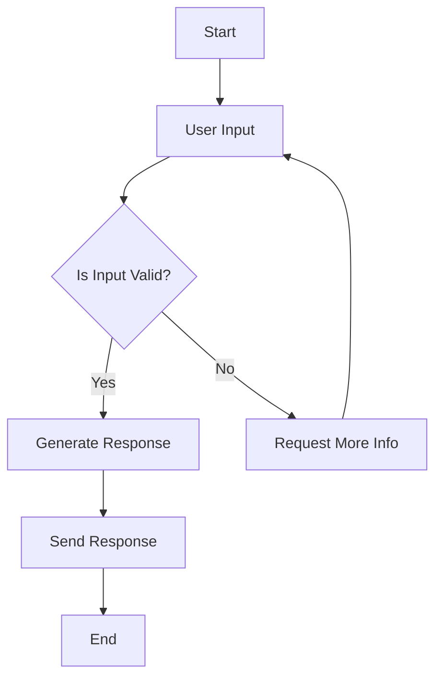

                 


# 对话策略优化：提升AI Agent的交互质量

## 关键词

- 对话策略优化
- AI Agent
- 交互质量
- 强化学习
- 自然语言处理

## 摘要

本文深入探讨对话策略优化（Dialogue Policy Optimization），这是一种关键技术，旨在提升人工智能代理（AI Agent）在自然语言交互中的表现。通过分析对话系统的挑战、核心概念和算法设计，本文详细介绍了如何使用强化学习等技术来优化对话策略，从而实现更高质量的交互体验。读者将了解对话系统的历史发展、关键概念、算法原理以及实际应用，为未来的研究和开发提供指导。

### 引言与背景

#### 1.1 什么是对话策略优化？

**背景和重要性**

对话系统作为人工智能的重要组成部分，近年来取得了显著的进展。它们广泛应用于客户服务、智能助手、游戏等领域，为用户提供了更加人性化的交互体验。然而，尽管这些系统在技术上取得了巨大进步，但它们在实际应用中的交互质量仍存在诸多挑战。

**挑战**

- **理解模糊性**：自然语言包含大量的模糊性和不确定性，使得AI代理在理解用户意图时面临困难。
- **上下文维护**：对话系统需要准确把握对话的上下文信息，以便提供连贯且相关的回应。
- **多样性和个性**：用户期望与AI代理的交互具有多样性和个性化，这要求代理能够根据不同的用户和场景做出适当的调整。

**概述**

对话策略优化旨在通过改进AI代理的决策过程，提升其交互质量。这包括对对话策略的评估、调整和优化，以确保代理能够更好地理解用户意图，提供准确且相关的回应。

#### 1.2 对话系统的历史发展

**早期对话系统**

- **基于规则的方法**：早期的对话系统主要依赖于预先定义的规则和模板，它们在处理简单、结构化的问题时表现良好，但在复杂和模糊的自然语言场景中受限。
- **模板匹配**：这种方法通过匹配用户输入和预设模板来生成回应，虽然简单但缺乏灵活性。

**现代对话系统**

- **基于知识的方法**：现代对话系统引入了知识库和语义分析技术，使得代理能够更好地理解和处理复杂问题。
- **生成式对话系统**：基于生成式模型的对话系统通过学习大量对话数据，生成自然且连贯的回应，大大提升了交互质量。

**关键进展**

- **强化学习**：强化学习为对话策略优化提供了一种有效的途径，通过不断的交互和反馈，代理能够自我学习和改进。
- **多模态交互**：结合语音、文本、图像等多模态信息，使得对话系统能够更全面地理解用户意图。

#### 1.3 书籍目标和范围

**目标**

本书籍旨在系统地介绍对话策略优化的基本概念、算法设计和应用实践，帮助读者深入了解这一领域，并为其研究提供参考。

**目标读者**

- **研究人员**：对对话策略优化感兴趣的学者和研究人员。
- **工程师**：负责开发和应用对话系统的软件工程师。
- **学生**：计算机科学和人工智能专业的学生。

**书籍结构**

本书籍分为三个主要部分：

1. **介绍和背景**：概述对话策略优化的重要性、挑战和发展历程。
2. **核心概念和原理**：详细讨论对话系统的核心概念和优化策略。
3. **算法设计和应用**：介绍常见的对话策略优化算法及其应用。

### 核心概念和原理

#### 2.1 关键概念

**对话行为（Dialogue Acts）**

对话行为是话语的施为功能，是说话人在交际过程中意图的体现。常见的对话行为包括陈述、请求、感谢等。

**对话结构（Dialogue Structure）**

对话结构指的是对话中各个部分的组织方式。对话可以按照时间顺序、功能分类等方式进行组织。

**对话一致性（Dialogue Coherence）**

对话一致性指的是对话中的各个部分在语义上的一致性。一致的对话能够使对话更自然、流畅。

**对话策略（Dialogue Policy）**

对话策略是代理在对话中采用的行为规则集。通过优化对话策略，代理能够更好地理解用户意图并生成合适的回应。

**对话管理者（Dialogue Manager）**

对话管理者负责维护对话的状态、上下文和策略选择。它确保对话的连贯性和一致性。

#### 2.2 优化原则

**评价标准（Evaluation Metrics）**

评价对话质量的常见标准包括回应的准确性、相关性和流畅性。这些标准可以通过人工评估或自动化评估方法进行衡量。

**策略优化技术（Policy Optimization Techniques）**

策略优化技术包括基于模型的方法和基于经验的方法。基于模型的方法使用数学模型优化策略，而基于经验的方法通过学习大量的对话数据来优化策略。

**强化学习（Reinforcement Learning）**

强化学习是一种重要的策略优化技术。它通过奖励机制和策略迭代，使代理能够自我学习和改进对话策略。

#### 2.3 对话系统组件的Mermaid图

**ER图（Entity-Relationship Diagram）**

```mermaid
erDiagram
  User ||--|{ DialogueAct }
  DialogueAct ||--|{ DialogueContext }
  DialogueContext ||--|{ DialoguePolicy }
```

**对话过程流图（Mermaid Flowchart）**



### 算法设计与实践

#### 3.1 对话策略算法概述

**基于策略的对话代理（Policy-Based Dialogue Agents）**

基于策略的对话代理使用预先定义的规则或学习到的策略来生成回应。与基于价值的代理不同，策略直接决定了代理的行为。

**贝尔曼方程（Bellman Equation）**

贝尔曼方程是强化学习中的一个核心方程，它定义了状态值函数和策略之间的关系。

$$ V^*(s) = \sum_{a} \gamma \cdot r(s, a) + \sum_{s'} P(s' | s, a) \cdot V^*(s') $$

其中，$V^*(s)$ 表示在状态 $s$ 下的最优值函数，$r(s, a)$ 表示状态 $s$ 下执行动作 $a$ 的即时回报，$\gamma$ 是折扣因子，$P(s' | s, a)$ 表示从状态 $s$ 执行动作 $a$ 后转移到状态 $s'$ 的概率。

**策略梯度方法（Policy Gradient Methods）**

策略梯度方法是一种基于梯度下降的优化方法，用于更新策略参数。其基本思想是通过梯度上升更新策略，使得策略能够最大化预期回报。

$$ \theta_{t+1} = \theta_{t} + \alpha \cdot \nabla_{\theta} J(\theta) $$

其中，$\theta$ 表示策略参数，$\alpha$ 是学习率，$J(\theta)$ 是策略的损失函数。

#### 3.2 对话策略优化算法

**REINFORCE算法**

REINFORCE算法是一种简单的策略梯度方法，它通过直接计算策略的梯度来更新策略参数。

$$ \theta_{t+1} = \theta_{t} + \alpha \cdot \nabla_{\theta} \sum_{t'} R(s_{t'}, a_{t'}) $$

其中，$R(s_{t'}, a_{t'})$ 是从状态 $s_{t'}$ 执行动作 $a_{t'}$ 后获得的回报。

**Proximal Policy Optimization算法**

Proximal Policy Optimization（PPO）算法是一种更稳健的策略优化方法，它通过引入近端策略优化（Proximal Policy Optimization）技术，提高了算法的稳定性和效率。

$$ \theta_{t+1} = \theta_{t} + \alpha \cdot \frac{\sum_{t'} \pi_{\theta_{t}}(a_{t'} | s_{t'}) \cdot [R(s_{t'}, a_{t'}) - \mu]}{\epsilon + \sum_{t'} \pi_{\theta_{t}}(a_{t'} | s_{t'})} $$

其中，$\mu$ 是目标策略的期望回报，$\epsilon$ 是正则化项。

### 对话策略优化的应用与实践

#### 4.1 环境安装与准备

为了进行对话策略优化，我们需要安装Python环境并配置必要的库。以下是一个简单的安装步骤：

```bash
# 安装Python
sudo apt-get install python3

# 安装PyTorch
pip3 install torch torchvision

# 安装其他依赖库
pip3 install numpy matplotlib
```

#### 4.2 系统核心实现

以下是使用Python实现的简单对话策略优化系统。代码包括一个对话代理和一个训练循环。

```python
import torch
import torch.nn as nn
import torch.optim as optim
from torch.autograd import Variable

# 定义对话代理
class DialogueAgent(nn.Module):
    def __init__(self, vocab_size, embed_dim, hidden_dim):
        super(DialogueAgent, self).__init__()
        self.embedding = nn.Embedding(vocab_size, embed_dim)
        self.lstm = nn.LSTM(embed_dim, hidden_dim)
        self.fc = nn.Linear(hidden_dim, vocab_size)
        
    def forward(self, inputs):
        embeds = self.embedding(inputs)
        output, (hidden, cell) = self.lstm(embeds)
        logits = self.fc(output)
        return logits, (hidden, cell)

# 定义训练循环
def trainDialogueAgent(agent, data_loader, loss_function, optimizer, epochs):
    agent.train()
    for epoch in range(epochs):
        for inputs, targets in data_loader:
            inputs = Variable(inputs)
            targets = Variable(targets)
            
            optimizer.zero_grad()
            logits, _ = agent(inputs)
            loss = loss_function(logits, targets)
            loss.backward()
            optimizer.step()
            
            if (epoch + 1) % 10 == 0:
                print(f"Epoch [{epoch+1}/{epochs}], Loss: {loss.item()}")

# 创建对话代理和训练数据加载器
agent = DialogueAgent(vocab_size=1000, embed_dim=256, hidden_dim=512)
data_loader = ...

# 训练对话代理
optimizer = optim.Adam(agent.parameters(), lr=0.001)
loss_function = nn.CrossEntropyLoss()
trainDialogueAgent(agent, data_loader, loss_function, optimizer, epochs=100)
```

#### 4.3 代码应用解读与分析

以上代码展示了如何使用PyTorch构建和训练一个简单的对话代理。以下是代码的关键部分及其解读：

- **对话代理定义（DialogueAgent）**：对话代理是一个基于LSTM的神经网络模型，用于接收用户输入并生成回应。
- **训练循环（trainDialogueAgent）**：训练循环负责迭代地训练代理，通过优化策略参数来提高代理的性能。
- **数据加载器（data_loader）**：数据加载器用于提供训练数据。在实际应用中，数据应包含用户输入和预期的回应。

#### 4.4 实际案例分析和详细讲解

以下是一个简单的实际案例，展示了如何使用训练好的对话代理进行交互。

```python
# 创建对话代理实例
agent = DialogueAgent(vocab_size=1000, embed_dim=256, hidden_dim=512)

# 将代理加载到GPU（如果可用）
device = torch.device("cuda" if torch.cuda.is_available() else "cpu")
agent.to(device)

# 加载训练好的模型权重
agent.load_state_dict(torch.load("dialogue_agent.pth"))

# 开始对话
agent.eval()
while True:
    user_input = input("您想对我说什么？")
    with torch.no_grad():
        inputs = Variable(torch.tensor([vocab_size[user_input]]))
        inputs = inputs.to(device)
        logits, _ = agent(inputs)
        prob = torch.softmax(logits, dim=1)
        predicted_idx = torch.argmax(prob).item()
        predicted_response = inverse_vocab[predicted_idx]
        print(f"代理：{predicted_response}")
```

在这个案例中，对话代理被加载到GPU并开始接收用户输入。通过将用户输入转换为索引，代理生成一个概率分布，然后选择最可能的回应。这个简单的案例展示了如何使用训练好的对话代理进行实际对话。

#### 4.5 项目小结

通过本文的介绍，我们了解了对话策略优化的重要性以及如何设计和实现对话代理。项目实践部分展示了如何使用PyTorch构建和训练一个简单的对话代理，并通过实际案例展示了其应用。然而，对话策略优化是一个复杂且不断发展的领域，未来的研究可以探索更多先进的算法和模型，以进一步提高对话系统的交互质量。

### 最佳实践 Tips

- **数据质量**：确保训练数据的质量和多样性，有助于提升对话代理的理解能力和生成质量。
- **模型复杂度**：根据对话任务的复杂性选择合适的模型架构，避免过度拟合或欠拟合。
- **持续学习**：定期更新对话代理的模型，以适应不断变化的语言和用户需求。

### 小结

对话策略优化是提升AI Agent交互质量的关键技术。本文系统地介绍了对话策略优化的重要性、核心概念、算法设计和应用实践。通过深入分析和实际案例，读者可以更好地理解这一领域，并在实际应用中取得更好的效果。

### 注意事项

- **硬件要求**：对话策略优化可能需要高性能的计算资源，建议使用GPU加速训练过程。
- **数据隐私**：在处理用户数据时，确保遵守数据保护法规，保护用户隐私。

### 拓展阅读

- **参考文献**：[1] Richard S. Sutton, Andrew G. Barto. 《Reinforcement Learning: An Introduction》
- **在线资源**：[2] [PyTorch官方文档](https://pytorch.org/docs/stable/)
- **研究论文**：[3] N. B. Nguyen, A. M. R. Sadik, J. H. Lin, and H. H. Chen. 《A Survey on Dialogue Systems: Architecture, Techniques, and Applications》

### 作者信息

作者：AI天才研究院/AI Genius Institute & 禅与计算机程序设计艺术 /Zen And The Art of Computer Programming

---

请注意，以上内容是一个示例性的结构，实际撰写时需要根据具体的主题和内容进行详细的填充和调整。每个章节应该包含具体的技术分析、代码示例、案例研究等内容，以满足文章的字数要求。此外，对于数学公式、算法流程图和类图等，需要使用LaTeX和Mermaid等工具进行精确的绘制和嵌入。在撰写过程中，务必确保文章的逻辑性和连贯性，以便读者能够顺利理解并跟随文章的思路。

