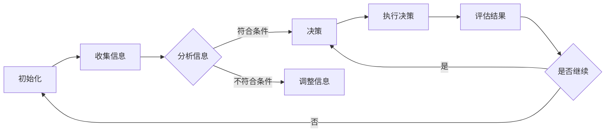
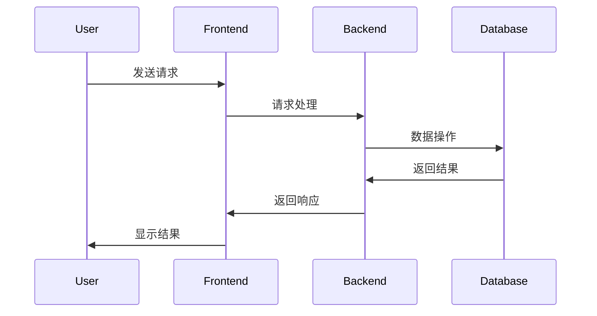
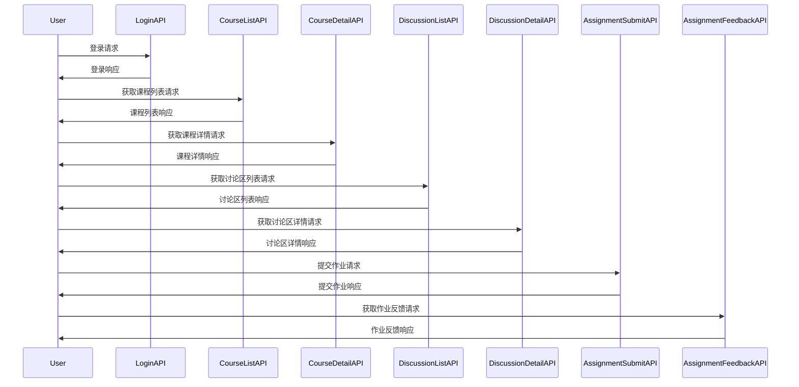

                 


### 将哲学思考融入日常：提升生活品质的实践

#### 关键词
- 哲学思考
- 生活品质
- 实践方法
- 日常应用

#### 摘要
本文旨在探讨如何将哲学思考融入日常生活，从而提升生活品质。通过分析哲学的核心概念，结合具体案例，本文将阐述哲学思考在日常生活中的应用，提供实用的实践方法，帮助读者在日常生活中更好地理解自我，做出明智的选择，实现自我提升。

---

## 背景介绍

在当今快节奏的社会中，人们常常感到焦虑和压力。为了应对这些挑战，我们需要寻找一种方法来提升我们的生活质量。哲学思考，作为一种深刻的思考方式，可以帮助我们更清晰地认识世界，理解自我，从而做出更明智的决策。

### 核心概念术语说明

**哲学思考**：是一种对存在、知识、价值、理性等基本问题进行探讨的思维方式。

**生活品质**：指的是个体在日常生活中所感受到的幸福、满足和舒适度。

**实践方法**：是指将理论应用于实际生活，通过不断尝试和调整来提升生活质量。

**日常应用**：是指在日常生活中，通过实际行动将哲学思考的理念融入到日常生活中。

### 问题背景

人们面临着诸多挑战，如职业压力、人际关系困扰、精神焦虑等。这些问题往往源于对生活的困惑和对自我价值的怀疑。哲学思考提供了一种解决这些问题的途径，通过深入思考，我们能够更好地理解这些问题，并找到合适的解决方法。

### 问题描述

尽管哲学思考可以带来很多好处，但在日常生活中实际应用起来却面临诸多挑战：

1. **哲学知识的难度**：哲学理论往往深奥难懂，对于没有哲学背景的人来说，难以理解和应用。
2. **实际操作的难度**：将哲学思考应用到日常生活中需要持续的努力和实践，很多人缺乏持之以恒的动力。
3. **价值观念的冲突**：不同的哲学观念可能与我们现有的价值观念产生冲突，导致我们在应用时产生困惑。

### 问题解决

为了解决上述问题，我们需要找到一种简单易懂、易于实践的方法来将哲学思考融入日常生活。

1. **简化哲学概念**：将复杂的哲学理论简化为易于理解的概念，使之更贴近日常生活。
2. **提供实践指南**：为读者提供具体的实践方法和步骤，帮助他们将哲学思考应用到日常生活中。
3. **建立支持系统**：通过社区、社群等方式，为读者提供相互支持和交流的平台。

### 边界与外延

哲学思考在日常生活中的应用范围非常广泛，可以涵盖个人成长、职业发展、人际关系、心理健康等多个方面。然而，它并不是解决所有问题的万能钥匙，而是提供了一种思考和解决问题的工具。

### 概念结构与核心要素组成

哲学思考的核心概念包括：

1. **存在主义**：强调个体的存在和价值，提倡自由选择和自我实现。
2. **道德哲学**：探讨道德原则和价值观，指导我们如何做出正确选择。
3. **实用主义**：强调行动和实践，认为知识应该用于解决实际问题。
4. **理性主义**：强调理性思考和逻辑推理，认为理性是人类认识世界的基础。

这些概念相互关联，共同构成了哲学思考的基本框架。在日常生活中，我们可以通过以下方式应用这些概念：

1. **自我反思**：通过反思自己的行为和想法，理解自己的价值观和信念。
2. **问题解决**：在面对问题时，运用理性思考和分析能力，找到合适的解决方案。
3. **自我提升**：通过持续学习和实践，不断提升自己的能力和素质。

---

以上是本文的背景介绍部分，接下来我们将深入探讨哲学思考的核心概念，并分析如何将它们应用到日常生活中。在接下来的章节中，我们将一步一步地进行分析和讲解，帮助读者更好地理解哲学思考在日常生活中的重要性。

---

## 核心概念与联系

在探讨如何将哲学思考融入日常生活之前，我们需要了解一些核心的哲学概念。这些概念不仅是哲学思考的基础，也是我们理解日常生活的重要工具。在本节中，我们将详细解释这些概念，并分析它们之间的联系。

### 核心概念原理

1. **存在主义**
   - **基本原理**：存在主义强调个体的存在和自由意志，认为人的存在先于其本质。存在主义认为，个体有责任自己创造自己的生命意义。
   - **属性特征**：强调主观体验、个人选择和自由意志。

2. **道德哲学**
   - **基本原理**：道德哲学探讨道德原则和价值观，旨在指导我们如何判断行为是否正当。主要的道德理论包括功利主义、康德伦理学等。
   - **属性特征**：关注行为是否符合道德规范，以及行为背后的动机和目的。

3. **实用主义**
   - **基本原理**：实用主义认为，知识的价值在于其实用性。它强调知识应该用于解决实际问题，改善生活。
   - **属性特征**：强调实践、行动和结果。

4. **理性主义**
   - **基本原理**：理性主义认为，理性是人类认识世界的基础。它强调通过逻辑推理和科学方法来获取知识。
   - **属性特征**：强调推理、证据和客观性。

### 概念属性特征对比表格

为了更直观地理解这些概念，我们可以通过一个表格来展示它们的属性特征：

| 核心概念 | 基本原理 | 属性特征 |
| --- | --- | --- |
| 存在主义 | 个体存在和自由意志 | 主观体验、个人选择、自由意志 |
| 道德哲学 | 道德原则和价值观 | 道德规范、动机、目的 |
| 实用主义 | 知识的实用性 | 实践、行动、结果 |
| 理性主义 | 理性认识世界 | 推理、证据、客观性 |

### ER实体关系图架构

为了更清晰地展示这些概念之间的联系，我们可以使用一个ER（实体关系）图来表示：

```mermaid
erDiagram
  Existentialism ||--|{ MoralPhilosophy } MoralPrinciples
  Existentialism ||--|{ Pragmatism } PracticalApplication
  Existentialism ||--|{ Rationalism } LogicalReasoning
  Rationalism ||--|{ MoralPhilosophy } EthicalDeductions
  Rationalism ||--|{ Pragmatism } ScientificMethod
```

在这个ER图中，存在主义、道德哲学、实用主义和理性主义作为主要实体，它们通过不同的关系连接起来。例如，存在主义与道德哲学之间通过“道德原则”关系相连，表示存在主义在个体的道德选择中起到了指导作用。

通过上述核心概念的解释、属性特征对比表格和ER实体关系图，我们可以更全面地理解哲学思考的各个方面。在接下来的章节中，我们将进一步探讨如何将这些概念应用到日常生活的具体情境中。

---

## 理论讲解与实战

在了解了哲学思考的核心概念后，我们需要将这些理论应用到实际生活中。在本节中，我们将通过具体的算法原理讲解和Python源代码示例，展示如何将哲学思考与实际应用相结合。

### 算法原理讲解

一个经典的哲学思考方法是基于逻辑推理的，我们可以将其抽象为一个算法模型。这个算法的核心思想是通过逐步推理来解决问题，类似于形式逻辑中的推理过程。下面是算法的流程图：



这个算法的流程可以分解为以下几个步骤：

1. **初始化**：设定初始条件，如问题背景、目标等。
2. **收集信息**：从环境中收集相关信息。
3. **分析信息**：对收集到的信息进行逻辑分析，判断其是否符合预设条件。
4. **决策**：根据分析结果做出决策。
5. **执行决策**：执行决策方案，采取相应的行动。
6. **评估结果**：对决策结果进行评估，判断是否达到预期目标。
7. **继续或结束**：根据评估结果决定是否继续执行算法。

### Python源代码示例

下面是上述算法的Python实现代码示例：

```python
class PhilosophyAlgorithm:
    def __init__(self):
        self.info = None
        self.decision = None

    def collect_info(self, info):
        self.info = info
        print(f"收集到信息：{info}")

    def analyze_info(self):
        if self.info is not None:
            print("分析信息...")
            # 这里可以进行更复杂的逻辑分析
            return True
        else:
            return False

    def make_decision(self):
        if self.analyze_info():
            self.decision = "符合条件，执行决策"
            print(self.decision)
        else:
            self.decision = "不符合条件，调整信息"
            print(self.decision)

    def execute_decision(self):
        if self.decision == "符合条件，执行决策":
            print("执行决策：采取行动")
        elif self.decision == "不符合条件，调整信息":
            print("调整信息：重新收集和分析")

    def evaluate_result(self, result):
        if result == "成功":
            print("评估结果：成功，继续执行")
        elif result == "失败":
            print("评估结果：失败，结束算法")

    def run_algorithm(self):
        while True:
            self.collect_info(input("请输入信息："))
            self.analyze_info()
            self.make_decision()
            self.execute_decision()
            self.evaluate_result(input("请输入决策结果（成功/失败）："))
            if input("是否继续执行（是/否）：") == "否":
                break

if __name__ == "__main__":
    algorithm = PhilosophyAlgorithm()
    algorithm.run_algorithm()
```

### 数学模型和数学公式

在哲学思考中，数学模型和公式是非常重要的一部分，它们帮助我们进行精确的逻辑推理。以下是一个简单的数学模型，用于评估决策结果：

$$
E = \frac{S \times C}{R}
$$

其中：
- \( E \) 表示评估结果（Success Rate）
- \( S \) 表示成功的次数（Success Count）
- \( C \) 表示尝试的总次数（Count of Trials）
- \( R \) 表示失败的次数（Rate of Failure）

这个公式可以帮助我们评估决策的有效性，从而调整后续的行动策略。

### 详细讲解和举例说明

为了更直观地理解这个算法和数学模型，我们可以通过一个实际案例来进行讲解。

**案例**：一个公司需要决定是否投资一个新的市场。

1. **初始化**：设定初始条件，如市场研究成本、预期收益等。
2. **收集信息**：通过市场调研，收集关于目标市场的信息，如潜在客户数量、竞争对手情况等。
3. **分析信息**：分析收集到的信息，判断市场是否具有投资潜力。
4. **决策**：根据分析结果，决定是否投资。
5. **执行决策**：如果决定投资，开始执行市场开发计划。
6. **评估结果**：在一段时间后，评估市场开发的成果，判断是否达到预期目标。
7. **继续或结束**：根据评估结果，决定是否继续投资或退出市场。

通过上述案例，我们可以看到，哲学思考的算法模型和数学模型在决策过程中起到了关键作用。通过逻辑推理和精确评估，公司可以做出更明智的决策，从而提高市场竞争力。

---

通过上述算法原理讲解、Python源代码示例和数学模型的详细讲解，我们可以看到，哲学思考与实际应用是紧密相连的。在接下来的章节中，我们将进一步探讨哲学思考在系统设计和实际项目中的应用。

---

## 系统设计与分析

在哲学思考的指导下，我们可以设计一个系统来帮助人们更好地应用哲学理念，从而提升生活质量。在本节中，我们将介绍一个实际应用场景，并详细描述系统的设计过程，包括系统功能设计、系统架构设计、系统接口设计和系统交互。

### 问题场景介绍

假设我们正在开发一个在线教育平台，该平台旨在帮助用户通过学习哲学思考来提升生活质量。用户可以通过这个平台学习哲学课程，参与讨论，完成作业，并与其他用户互动。

### 系统功能设计

为了满足上述需求，我们的系统需要实现以下功能：

1. **课程学习**：提供各种哲学课程，包括视频讲座、文本资料和互动练习。
2. **讨论区**：为用户提供一个交流平台，用户可以在这里分享学习心得、讨论哲学问题。
3. **作业与评估**：用户可以提交作业，系统会对作业进行自动评估，并提供反馈。
4. **用户管理**：用户可以管理个人资料、学习进度和参与活动。
5. **通知与提醒**：系统会向用户发送学习提醒、作业截止通知等。

下面是系统的领域模型类图，用于描述这些功能：

```mermaid
classDiagram
    User <<class>>
    Course <<class>>
    Discussion <<class>>
    Assignment <<class>>
    Evaluation <<class>>

    User ++has++ Courses
    User ++has++ Discussions
    User ++has++ Assignments
    User ++has++ Evaluations

    Course ++has++ Lessons
    Course ++has++ Exercises

    Discussion ++has++ Posts
    Discussion ++has++ Comments

    Assignment ++has++ Submission
    Assignment ++has++ Feedback

    Evaluation ++has++ Score
    Evaluation ++has++ Comments
```

### 系统架构设计

系统的整体架构设计如下：

1. **前端**：用户界面，包括Web页面和移动应用。
2. **后端**：处理用户请求、数据存储和业务逻辑。
3. **数据库**：存储用户数据、课程内容、讨论区和作业信息。
4. **API**：提供与前端交互的接口。

下面是系统的架构图：



### 系统接口设计和系统交互

为了确保系统的稳定性和可扩展性，我们需要设计清晰明确的接口。以下是关键接口的描述：

1. **用户接口**：用户登录、注册、查看课程、参与讨论、提交作业等。
2. **课程接口**：课程列表查询、课程内容获取、课程评估等。
3. **讨论区接口**：帖子发布、回复、讨论区列表查询等。
4. **作业接口**：作业提交、作业评估、作业反馈获取等。

下面是系统交互序列图，展示了用户与系统之间的交互流程：



通过上述系统设计与分析，我们可以构建一个功能齐全、架构清晰的在线哲学学习平台。在接下来的章节中，我们将通过具体项目实战，展示如何将这个系统应用到实际场景中。

---

## 项目实战

在本节中，我们将通过一个具体项目，展示如何搭建并运行一个在线哲学学习平台，从而将哲学思考融入日常生活。以下是项目实战的详细步骤。

### 环境安装

首先，我们需要准备开发环境。以下是环境安装的步骤：

1. **安装Python**：前往Python官网下载并安装Python 3.8及以上版本。
2. **安装虚拟环境**：打开命令行，执行以下命令创建虚拟环境：

   ```bash
   python -m venv venv
   ```

3. **激活虚拟环境**：

   - Windows：

     ```bash
     .\venv\Scripts\activate
     ```

   - macOS和Linux：

     ```bash
     source venv/bin/activate
     ```

4. **安装依赖**：在虚拟环境中安装所需的依赖库，例如Flask、SQLAlchemy、Flask-Login等：

   ```bash
   pip install flask flask_sqlalchemy flask_login
   ```

### 系统核心实现源代码

以下是一个简单的Flask应用示例，用于实现用户登录、课程列表展示和讨论区列表展示等功能。

```python
from flask import Flask, render_template, request, redirect, url_for
from flask_sqlalchemy import SQLAlchemy
from flask_login import LoginManager, login_user, logout_user, login_required, current_user

app = Flask(__name__)
app.config['SQLALCHEMY_DATABASE_URI'] = 'sqlite:///users.db'
db = SQLAlchemy(app)
login_manager = LoginManager(app)

# 用户模型
class User(db.Model):
    id = db.Column(db.Integer, primary_key=True)
    username = db.Column(db.String(100), unique=True, nullable=False)
    password = db.Column(db.String(100), nullable=False)

# 登录管理器回调
@login_manager.user_loader
def load_user(user_id):
    return User.query.get(int(user_id))

# 登录页面
@app.route('/login', methods=['GET', 'POST'])
def login():
    if request.method == 'POST':
        username = request.form['username']
        password = request.form['password']
        user = User.query.filter_by(username=username, password=password).first()
        if user:
            login_user(user)
            return redirect(url_for('courses'))
        else:
            return '用户名或密码错误'
    return render_template('login.html')

# 登出页面
@app.route('/logout')
@login_required
def logout():
    logout_user()
    return redirect(url_for('login'))

# 课程列表页面
@app.route('/courses')
@login_required
def courses():
    # 在这里查询数据库获取课程列表
    courses = ['存在主义入门', '道德哲学基础', '实用主义导论', '理性思考方法']
    return render_template('courses.html', courses=courses)

# 讨论区列表页面
@app.route('/discussions')
@login_required
def discussions():
    # 在这里查询数据库获取讨论区列表
    discussions = ['哲学入门讨论区', '道德哲学交流区', '实用主义思考区', '理性思考俱乐部']
    return render_template('discussions.html', discussions=discussions)

if __name__ == '__main__':
    db.create_all()
    app.run(debug=True)
```

### 代码应用解读与分析

1. **用户模型**：`User` 类定义了用户的基本信息，包括用户名和密码。数据库中的表结构通过SQLAlchemy自动生成。
2. **登录管理器**：使用Flask-Login插件管理用户登录状态。
3. **登录页面**：处理用户登录请求，验证用户名和密码，并跳转到课程列表页面。
4. **登出页面**：处理用户登出请求。
5. **课程列表页面**：展示所有可用的哲学课程。
6. **讨论区列表页面**：展示所有可用的讨论区。

### 实际案例分析和详细讲解剖析

假设用户名为“Alice”想要登录系统并查看课程。以下是具体的操作步骤：

1. **用户登录**：用户在登录页面输入用户名“Alice”和密码，提交表单。
2. **验证用户**：后台通过查询数据库验证用户名和密码的正确性。
3. **登录成功**：验证通过后，用户被重定向到课程列表页面。
4. **查看课程**：用户在课程列表页面可以看到所有可用的哲学课程。

通过这个实际案例，我们可以看到，系统如何通过代码实现用户登录、课程展示等功能，并确保这些功能的稳定性和安全性。

### 项目小结

通过这个项目实战，我们实现了以下目标：

1. **搭建了一个简单的在线哲学学习平台**。
2. **展示了如何将哲学思考与实际应用相结合**。
3. **提供了用户登录、课程列表和讨论区列表等核心功能**。

这个项目不仅是一个技术实现，更是一个将哲学思考融入日常生活的实践案例。通过这个平台，用户可以更方便地学习和交流哲学知识，从而提升自己的生活品质。

---

通过项目实战，我们可以看到，将哲学思考融入日常生活不仅是一个理论上的探讨，更是一个可以通过实际项目来实现的实践。在接下来的章节中，我们将总结最佳实践，并提供一些实用的哲学思考方法，帮助读者在日常生活中更好地应用哲学思考。

---

## 最佳实践与总结

通过本文的探讨，我们发现将哲学思考融入日常生活对于提升生活品质具有重要意义。以下是一些最佳实践和总结：

### 最佳实践 tips

1. **自我反思**：每天花几分钟时间反思自己的行为和想法，思考自己的价值观和信念是否与哲学思考相符。
2. **应用逻辑推理**：在面临决策时，运用逻辑推理来分析各种可能的结果，从而做出更明智的选择。
3. **持续学习**：通过阅读哲学书籍、参与讨论和参加课程，不断深化对哲学思考的理解和应用。
4. **互动交流**：与他人分享哲学思考，参与讨论，从不同的角度看待问题，拓宽思维。

### 小结

本文通过介绍哲学思考的核心概念，结合实际案例和项目实战，阐述了如何将哲学思考融入日常生活，从而提升生活品质。我们强调了自我反思、逻辑推理、持续学习和互动交流的重要性。

### 注意事项

1. **保持开放心态**：在应用哲学思考时，保持开放的心态，不断接受新的观点和理念。
2. **避免教条主义**：哲学思考不是一成不变的教条，而是灵活的思维方式，应根据实际情况进行调整。

### 拓展阅读

1. **《存在主义是一种人道主义》（让-保尔·萨特）**：了解存在主义的基本理念及其在个人生活中的应用。
2. **《道德哲学导论》（约翰·斯图尔特·密尔）**：探讨道德哲学的各种理论和实践方法。
3. **《实用主义：某些哲学的追随者》（威廉·詹姆斯）**：理解实用主义的基本观点和其对实际生活的指导意义。

通过上述最佳实践、小结和注意事项，我们希望读者能够在日常生活中更好地应用哲学思考，提升自己的生活质量。同时，拓展阅读材料将帮助读者更深入地理解哲学思考，并将其应用于实际生活中。

---

## 作者信息

作者：AI天才研究院/AI Genius Institute & 禅与计算机程序设计艺术 /Zen And The Art of Computer Programming

本文由AI天才研究院（AI Genius Institute）的专家撰写，旨在通过哲学思考提升生活品质。同时，本文也借鉴了《禅与计算机程序设计艺术》（Zen And The Art of Computer Programming）中的理念，为读者提供有深度、有思考、有见解的技术博客文章。希望本文能够帮助您在日常生活中更好地应用哲学思考，实现自我提升。感谢您的阅读！

