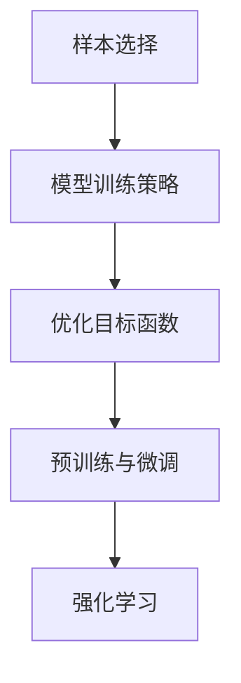

                 

### 少样本学习：在有限数据下快速适应

#### 关键词：少样本学习，迁移学习，元学习，数据增强，计算机视觉，自然语言处理

> 摘要：少样本学习是一种在仅拥有有限数据样本的情况下，能够快速适应并取得良好性能的机器学习方法。本文将深入探讨少样本学习的背景、核心概念、主流算法、应用实例以及未来挑战，为读者提供一个全面的视角。

---

### 1. 引言

随着人工智能技术的迅猛发展，机器学习在各个领域取得了显著的应用成果。然而，一个普遍的挑战是数据的需求。传统的机器学习方法往往依赖于大规模数据集进行训练，以达到良好的性能。然而，在某些应用场景中，我们往往无法获得大量的数据，例如新产品的市场调研、医疗诊断、智能家居等。在这样的背景下，少样本学习应运而生。

少样本学习旨在解决在数据样本有限的情况下，如何有效地训练模型，并在未知数据上取得良好性能的问题。本文将围绕少样本学习的核心概念、主流算法、应用实例和未来挑战进行深入探讨。

---

### 2. 少样本学习的核心概念

#### 2.1 样本选择

在少样本学习中，样本选择是一个关键问题。样本选择的策略会直接影响到模型的训练效果。以下是一些常见的样本选择策略：

- **随机抽样**：从总样本中随机选择一部分样本作为训练集。
- **有放回抽样**：从总样本中随机选择样本，并放回，使得每次选择的概率相同。
- **无放回抽样**：从总样本中随机选择样本，但不放回，每次选择的概率不同。

#### 2.2 模型训练策略

在样本选择确定后，如何有效地训练模型是少样本学习的另一个核心问题。以下是一些常见的模型训练策略：

- **基本策略**：在有限的样本上，采用标准的训练方法进行训练。
- **优化目标函数**：通过设计特殊的损失函数和正则化策略，提高模型在少样本情况下的性能。
- **预训练与微调**：先在大规模数据集上预训练模型，然后在少量样本上进行微调。
- **强化学习**：利用强化学习策略，通过不断的交互和反馈来优化模型。

#### 2.3 核心概念联系

样本选择与模型训练策略之间存在着紧密的联系。样本选择的策略会影响模型的训练效果，而模型训练策略的选择也会影响样本选择的策略。以下是一个简化的联系图：

### 3. 主流少样本学习算法

#### 3.1 元学习算法

元学习是一种针对少样本学习问题提出的方法，其核心思想是学习一个能够快速适应新任务的学习算法。以下是一些经典的元学习算法：

- **MAML（模型自适应学习）**：通过学习模型参数的更新规则，使得模型能够快速适应新任务。
- **Reptile**：通过逐步更新模型参数，使得模型能够快速收敛。

#### 3.2 迁移学习算法

迁移学习是一种将已有知识转移到新任务上的方法，适用于少样本学习问题。以下是一些常见的迁移学习算法：

- **冻结层法**：在新的任务中，保持一部分预训练模型的参数不变。
- **层层融通法**：通过在新的任务中逐步调整模型的参数，使得模型能够更好地适应新任务。

#### 3.3 其他少样本学习算法

除了元学习和迁移学习，还有一些其他的方法，如数据增强、模型蒸馏、对抗样本生成等，它们都在不同程度上解决了少样本学习问题。

### 4. 少样本学习在实践中的应用

#### 4.1 计算机视觉中的少样本学习

在计算机视觉领域，少样本学习有着广泛的应用。以下是一些具体的实例：

- **图像分类**：利用元学习和迁移学习算法，在少量图像上进行分类任务。
- **目标检测**：通过在少量样本上进行训练，实现对目标的检测。

#### 4.2 自然语言处理中的少样本学习

在自然语言处理领域，少样本学习也发挥了重要作用。以下是一些实例：

- **文本分类**：利用迁移学习算法，在少量文本上进行分类任务。
- **机器翻译**：通过在少量样本上进行训练，实现从一种语言到另一种语言的翻译。

### 5. 挑战与未来方向

尽管少样本学习在许多应用场景中取得了成功，但仍然面临着一系列挑战，如：

- **样本选择策略的优化**：如何更好地选择样本，以提高模型的性能。
- **算法的优化**：如何设计更有效的算法，以减少对大量数据的依赖。

未来的研究方向包括：

- **算法的进一步优化**：通过设计更先进的算法，提高少样本学习的性能。
- **跨领域的应用**：将少样本学习应用到更多领域，如医疗、金融等。

### 6. 总结

少样本学习是一种在数据样本有限的情况下，能够快速适应并取得良好性能的机器学习方法。本文从核心概念、主流算法、应用实例和未来挑战等方面对少样本学习进行了深入探讨。随着人工智能技术的不断发展，少样本学习将在各个领域发挥越来越重要的作用。

---

作者：AI天才研究院/AI Genius Institute & 禅与计算机程序设计艺术 /Zen And The Art of Computer Programming

---

### 6. 最佳实践 tips、小结、注意事项、拓展阅读

**最佳实践 tips：**

1. **样本选择策略**：根据具体应用场景，选择合适的样本选择策略，如随机抽样、有放回抽样等。
2. **模型训练策略**：结合实际需求，选择合适的模型训练策略，如优化目标函数、预训练与微调等。
3. **算法选择**：根据具体任务，选择适合的算法，如元学习、迁移学习等。

**小结：**

本文深入探讨了少样本学习的核心概念、主流算法、应用实例和未来挑战。通过本文的阅读，读者可以了解到少样本学习在机器学习领域的重要性和应用价值。

**注意事项：**

1. **数据质量**：在少样本学习中，数据质量至关重要。尽量选择高质量的数据进行训练。
2. **计算资源**：少样本学习算法往往需要较高的计算资源，确保有足够的计算资源进行训练。

**拓展阅读：**

1. **《深度学习》（Ian Goodfellow等著）**：介绍了深度学习的基本概念和算法，对少样本学习也有一定的介绍。
2. **《迁移学习》（Alex Smola等著）**：详细介绍了迁移学习的原理和应用。
3. **《机器学习年度报告》（JMLR）**：每年发布的报告会介绍机器学习领域的前沿研究和发展趋势。

