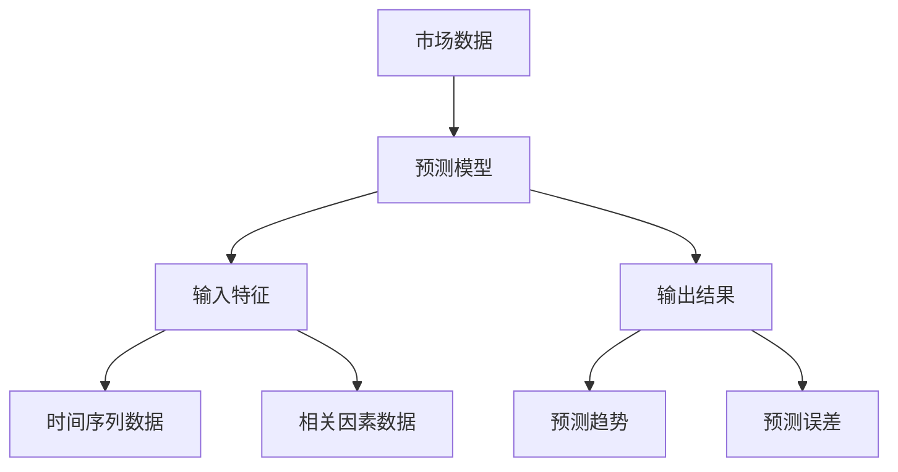

                 

### 《市场趋势预测模型》

> 关键词：市场趋势预测、模型原理、时间序列分析、回归分析、机器学习

> 摘要：本文深入探讨了市场趋势预测模型的相关内容，从市场趋势预测的重要性出发，详细介绍了市场趋势预测的基本概念、核心概念与联系、预测模型原理与算法，以及机器学习在市场趋势预测中的应用。通过本文的阅读，读者将全面了解市场趋势预测模型的系统架构与实现，掌握市场趋势预测的核心技术与方法，为实际应用提供有力支持。

----------------------------------------------------------------

### 《市场趋势预测模型》目录大纲

----------------------------------------------------------------

# 第一部分：市场趋势预测模型概述

## 第1章：市场趋势预测模型背景

### 1.1 市场趋势预测的重要性

#### 1.1.1 企业决策支持

#### 1.1.2 政策制定与调整

#### 1.1.3 风险管理

### 1.2 市场趋势预测的基本概念

#### 1.2.1 市场趋势的定义

#### 1.2.2 预测模型的基本组成

#### 1.2.3 预测模型的分类

### 1.3 预测模型的挑战与机遇

#### 1.3.1 挑战

#### 1.3.2 机遇

## 第2章：核心概念与联系

### 2.1 关键概念解析

#### 2.1.1 因素分析

#### 2.1.2 时间序列分析

#### 2.1.3 回归分析

### 2.2 概念属性特征对比表格

| 概念 | 属性特征 | 对比 |
| ---- | ---- | ---- |
| 因素分析 | 描述变量间关系 | 与时间序列分析和回归分析相比，更注重变量间关系分析 |
| 时间序列分析 | 分析时间序列数据 | 注重时间序列的趋势和周期性 |
| 回归分析 | 预测变量间关系 | 更适用于线性关系预测 |

### 2.3 ER实体关系图架构

```
graph TD
    A[市场数据] --> B[预测模型]
    B --> C[输入特征]
    B --> D[输出结果]
    C --> E[时间序列数据]
    C --> F[相关因素数据]
    D --> G[预测趋势]
    D --> H[预测误差]
```

----------------------------------------------------------------

# 第二部分：市场趋势预测模型原理与算法

## 第3章：时间序列分析原理

### 3.1 时间序列基本概念

#### 3.1.1 时间序列数据的定义

#### 3.1.2 时间序列数据的特性

### 3.2 时间序列分析方法

#### 3.2.1 平稳性检验

#### 3.2.2 自相关函数（ACF）

#### 3.2.3 预测模型选择

### 3.3 常见时间序列模型

#### 3.3.1 自回归模型（AR）

#### 3.3.2 移动平均模型（MA）

#### 3.3.3 自回归移动平均模型（ARMA）

#### 3.3.4 自回归积分滑动平均模型（ARIMA）

----------------------------------------------------------------

## 第4章：回归分析原理

### 4.1 回归分析基础

#### 4.1.1 一元线性回归

#### 4.1.2 多元线性回归

### 4.2 回归模型的建立

#### 4.2.1 模型选择

#### 4.2.2 模型评估

#### 4.2.3 模型优化

### 4.3 回归分析的应用

#### 4.3.1 价格预测

#### 4.3.2 市场占有率预测

----------------------------------------------------------------

## 第5章：机器学习方法在市场趋势预测中的应用

### 5.1 机器学习基础

#### 5.1.1 机器学习的基本概念

#### 5.1.2 监督学习、无监督学习、强化学习

### 5.2 常见机器学习算法

#### 5.2.1 决策树

#### 5.2.2 随机森林

#### 5.2.3 支持向量机

#### 5.2.4 神经网络

### 5.3 机器学习在市场趋势预测中的实现

#### 5.3.1 数据预处理

#### 5.3.2 特征工程

#### 5.3.3 模型训练与评估

----------------------------------------------------------------

## 第6章：市场趋势预测模型的系统架构与实现

### 6.1 预测模型系统架构设计

#### 6.1.1 系统需求分析

#### 6.1.2 系统架构设计

#### 6.1.3 系统接口设计

### 6.2 系统实现

#### 6.2.1 环境安装

#### 6.2.2 系统核心实现

#### 6.2.3 代码应用解读与分析

------------

----------------------------------------------------------------

### 《市场趋势预测模型》

#### **市场趋势预测的重要性**

市场趋势预测是现代商业决策的重要工具，它能够帮助企业识别潜在的市场机会，规避风险，从而制定更为精准的战略规划。在企业的日常运营中，市场趋势预测不仅影响着销售策略的制定，还直接关系到库存管理、供应链优化等方面。对于政策制定者而言，市场趋势预测有助于调整宏观经济政策，优化资源配置，实现社会经济的稳定发展。

**1.1 企业决策支持**

企业在进行市场拓展、产品开发、资源分配等决策时，需要对市场趋势进行预测。通过对市场趋势的准确预测，企业可以更好地把握市场需求变化，调整产品策略，优化供应链管理，提高市场竞争力。

**1.2 政策制定与调整**

政策制定者通过对市场趋势的预测，可以及时了解经济形势的变化，调整相关政策，以促进经济稳定增长。例如，央行可以根据市场趋势预测调整利率政策，以控制通货膨胀和经济增长。

**1.3 风险管理**

市场趋势预测有助于企业识别潜在的风险，提前采取措施进行风险规避。例如，通过对行业趋势的预测，企业可以及时调整投资方向，避免陷入市场低迷带来的风险。

#### **市场趋势预测的基本概念**

**1.2.1 市场趋势的定义**

市场趋势是指市场上某一产品或服务的需求、价格、竞争等因素在一段时间内呈现出的总体变化趋势。市场趋势可以是上升的、下降的，或者保持平稳的。

**1.2.2 预测模型的基本组成**

预测模型通常由以下几个部分组成：

- **输入特征**：影响市场趋势的各种因素，如宏观经济指标、行业指标、消费者行为等。
- **模型结构**：描述输入特征与市场趋势之间关系的数学模型。
- **输出结果**：预测的市场趋势，包括趋势方向、强度、持续时间等。

**1.2.3 预测模型的分类**

根据预测模型的方法和目标，可以将预测模型分为以下几类：

- **时间序列模型**：主要用于分析时间序列数据，预测未来的趋势和周期性变化。
- **回归模型**：通过分析输入特征与市场趋势之间的关系，进行预测。
- **机器学习模型**：利用历史数据，通过学习输入特征与市场趋势之间的复杂关系，进行预测。

#### **预测模型的挑战与机遇**

**1.3.1 挑战**

- **数据质量**：市场趋势预测依赖于高质量的数据，数据的不完整性、噪声和偏差都会影响预测结果的准确性。
- **模型复杂性**：选择合适的预测模型，需要进行大量的数据分析和模型评估，过程复杂。
- **实时性**：市场变化快速，实时预测对计算能力和数据处理效率要求较高。

**1.3.2 机遇**

- **大数据技术**：随着大数据技术的发展，处理和分析海量数据的能力大大提高，为市场趋势预测提供了更丰富的数据支持。
- **机器学习算法**：先进的机器学习算法能够发现数据中的复杂模式，提高预测的准确性。
- **实时预测**：通过云计算和边缘计算技术，实现实时市场趋势预测，为企业提供更快的决策支持。

----------------------------------------------------------------

### **第2章：核心概念与联系**

#### **2.1 关键概念解析**

**2.1.1 因素分析**

因素分析是一种统计方法，用于研究变量间的相互关系。在市场趋势预测中，因素分析可以帮助我们识别影响市场趋势的关键因素，并理解这些因素之间的相互作用。通过因素分析，我们可以将复杂的市场数据简化为几个主要的驱动因素，从而更容易地进行预测。

**2.1.2 时间序列分析**

时间序列分析是一种用于研究时间序列数据的方法。时间序列数据是按照时间顺序排列的数据点，如股票价格、销售额、天气数据等。时间序列分析旨在识别数据中的趋势、季节性和周期性，并利用这些特征进行未来预测。

**2.1.3 回归分析**

回归分析是一种用于研究变量之间关系的统计方法。在市场趋势预测中，回归分析可以用来确定市场趋势与输入特征（如宏观经济指标、行业指标等）之间的关系。回归分析可以帮助我们建立一个预测模型，用于预测未来的市场趋势。

#### **2.2 概念属性特征对比表格**

| 概念         | 属性特征                                                      | 对比                                       |
| ------------ | ------------------------------------------------------------ | ------------------------------------------ |
| 因素分析     | 描述变量间关系，识别关键因素                                  | 与时间序列分析和回归分析相比，更注重变量间关系分析 |
| 时间序列分析 | 分析时间序列数据，识别趋势、季节性和周期性特征               | 注重时间序列的趋势和周期性                 |
| 回归分析     | 研究变量间关系，建立预测模型                                 | 更适用于线性关系预测，对复杂关系建模能力有限 |

#### **2.3 ER实体关系图架构**



在上述ER实体关系图中，市场数据是预测模型的输入，预测模型通过对输入特征进行处理，生成预测趋势和预测误差。输入特征包括时间序列数据和相关的因素数据，这些数据共同决定了市场趋势的预测结果。

----------------------------------------------------------------

### **第3章：时间序列分析原理**

#### **3.1 时间序列基本概念**

**3.1.1 时间序列数据的定义**

时间序列数据是指按时间顺序排列的一系列数据点，通常用于记录某些变量随时间的变化情况。例如，股票价格、销售额、天气数据等都属于时间序列数据。

**3.1.2 时间序列数据的特性**

时间序列数据具有以下几个主要特性：

- **趋势性**：时间序列数据在一段时间内可能表现出上升、下降或平稳的趋势。
- **季节性**：时间序列数据可能在一年内表现出周期性的波动，例如销售旺季和淡季。
- **周期性**：时间序列数据可能会在较长的时间内表现出周期性的波动，如经济周期的波动。
- **随机性**：时间序列数据可能包含随机波动，这些波动无法用明确的时间序列模型来解释。

#### **3.2 时间序列分析方法**

**3.2.1 平稳性检验**

平稳性检验是时间序列分析的重要步骤，用于判断时间序列数据是否满足平稳性条件。平稳时间序列数据具有以下特征：

- **均值不变性**：时间序列的均值不随时间变化。
- **自协方差函数不变性**：时间序列的自协方差函数不随时间变化。

常见的平稳性检验方法包括自相关函数（ACF）和偏自相关函数（PACF）。

**3.2.2 自相关函数（ACF）**

自相关函数用于衡量时间序列数据在两个不同时间点上的相关性。自相关函数的值越大，说明数据点之间的相关性越强。自相关函数图可以帮助我们识别时间序列数据中的趋势和周期性特征。

**3.2.3 预测模型选择**

根据时间序列数据的特点，可以选择不同的预测模型。常见的预测模型包括：

- **自回归模型（AR）**：仅依赖过去的观测值进行预测。
- **移动平均模型（MA）**：仅依赖过去的预测误差进行预测。
- **自回归移动平均模型（ARMA）**：结合自回归模型和移动平均模型。
- **自回归积分滑动平均模型（ARIMA）**：适用于非平稳时间序列数据。

#### **3.3 常见时间序列模型**

**3.3.1 自回归模型（AR）**

自回归模型（AR）是一种基于过去观测值进行预测的时间序列模型。AR模型的基本公式如下：

$$
X_t = c + \phi_1 X_{t-1} + \phi_2 X_{t-2} + ... + \phi_p X_{t-p} + \varepsilon_t
$$

其中，$X_t$ 是时间序列的当前观测值，$c$ 是常数项，$\phi_1, \phi_2, ..., \phi_p$ 是自回归系数，$\varepsilon_t$ 是误差项。

**3.3.2 移动平均模型（MA）**

移动平均模型（MA）是一种基于过去预测误差进行预测的时间序列模型。MA模型的基本公式如下：

$$
X_t = c + \varepsilon_t + \theta_1 \varepsilon_{t-1} + \theta_2 \varepsilon_{t-2} + ... + \theta_q \varepsilon_{t-q}
$$

其中，$X_t$ 是时间序列的当前观测值，$c$ 是常数项，$\theta_1, \theta_2, ..., \theta_q$ 是移动平均系数，$\varepsilon_t$ 是误差项。

**3.3.3 自回归移动平均模型（ARMA）**

自回归移动平均模型（ARMA）结合了自回归模型和移动平均模型的特点，既可以利用过去的观测值，也可以利用过去的预测误差进行预测。ARMA模型的基本公式如下：

$$
X_t = c + \phi_1 X_{t-1} + \phi_2 X_{t-2} + ... + \phi_p X_{t-p} + \theta_1 \varepsilon_{t-1} + \theta_2 \varepsilon_{t-2} + ... + \theta_q \varepsilon_{t-q}
$$

其中，$X_t$ 是时间序列的当前观测值，$c$ 是常数项，$\phi_1, \phi_2, ..., \phi_p$ 是自回归系数，$\theta_1, \theta_2, ..., \theta_q$ 是移动平均系数，$\varepsilon_t$ 是误差项。

**3.3.4 自回归积分滑动平均模型（ARIMA）**

自回归积分滑动平均模型（ARIMA）适用于非平稳时间序列数据。ARIMA模型通过差分操作将非平稳序列转化为平稳序列，然后应用ARMA模型进行预测。ARIMA模型的基本公式如下：

$$
X_t = c + \phi_1 X_{t-1} + \phi_2 X_{t-2} + ... + \phi_p X_{t-p} + (\theta_1 D(X_{t-1}) + \theta_2 D(X_{t-2}) + ... + \theta_q D(X_{t-q}))
$$

其中，$X_t$ 是时间序列的当前观测值，$c$ 是常数项，$\phi_1, \phi_2, ..., \phi_p$ 是自回归系数，$\theta_1, \theta_2, ..., \theta_q$ 是移动平均系数，$D(X_t)$ 表示对时间序列进行差分操作。

----------------------------------------------------------------

## **第4章：回归分析原理**

### **4.1 回归分析基础**

**4.1.1 一元线性回归**

一元线性回归是最基本的回归模型，它研究一个因变量和一个自变量之间的关系。其模型公式如下：

$$
Y = \beta_0 + \beta_1X + \varepsilon
$$

其中，$Y$ 是因变量，$X$ 是自变量，$\beta_0$ 是截距，$\beta_1$ 是斜率，$\varepsilon$ 是误差项。

一元线性回归的目的是通过给定的自变量预测因变量的值。该模型适用于线性关系较强的情况。

**4.1.2 多元线性回归**

多元线性回归扩展了一元线性回归，研究多个自变量和一个因变量之间的关系。其模型公式如下：

$$
Y = \beta_0 + \beta_1X_1 + \beta_2X_2 + ... + \beta_pX_p + \varepsilon
$$

其中，$Y$ 是因变量，$X_1, X_2, ..., X_p$ 是自变量，$\beta_0$ 是截距，$\beta_1, \beta_2, ..., \beta_p$ 是斜率，$\varepsilon$ 是误差项。

多元线性回归可以同时考虑多个因素的影响，适用于复杂的多因素关系预测。

### **4.2 回归模型的建立**

**4.2.1 模型选择**

选择合适的回归模型是回归分析的关键步骤。根据问题的复杂性和数据的特性，可以选择一元线性回归、多元线性回归、非线性回归等不同类型的模型。

**4.2.2 模型评估**

模型评估用于判断回归模型的性能。常用的评估指标包括决定系数（R²）、均方误差（MSE）等。通过模型评估，可以判断模型对数据的拟合程度，并进行模型优化。

**4.2.3 模型优化**

模型优化是指通过调整模型的参数，提高模型的预测性能。常用的优化方法包括梯度下降法、牛顿法等。

### **4.3 回归分析的应用**

**4.3.1 价格预测**

回归分析可以用于预测商品价格。通过收集历史价格数据和相关的经济指标，建立价格预测模型，可以预测未来的价格走势。

**4.3.2 市场占有率预测**

回归分析还可以用于预测市场占有率。通过分析历史市场占有率和影响市场占有率的各种因素，建立市场占有率预测模型，可以预测未来某一时间段内的市场占有率。

### **4.4 回归分析的实现**

下面是回归分析的一个简单实现示例，使用Python中的scikit-learn库：

```python
import numpy as np
import pandas as pd
from sklearn.linear_model import LinearRegression
from sklearn.metrics import mean_squared_error

# 加载数据
data = pd.read_csv('data.csv')
X = data[['feature1', 'feature2']]
y = data['target']

# 建立回归模型
model = LinearRegression()
model.fit(X, y)

# 预测
y_pred = model.predict(X)

# 评估模型
mse = mean_squared_error(y, y_pred)
print(f'Mean Squared Error: {mse}')

# 输出模型参数
print(f'Coefficients: {model.coef_}')
print(f'Intercept: {model.intercept_}')
```

在这个示例中，我们首先加载数据，然后建立线性回归模型，进行模型训练和预测，最后评估模型性能并输出模型参数。

----------------------------------------------------------------

## **第5章：机器学习方法在市场趋势预测中的应用**

### **5.1 机器学习基础**

**5.1.1 机器学习的基本概念**

机器学习是一种通过数据训练模型，使模型能够对未知数据进行预测或分类的技术。它包括以下几个基本概念：

- **特征**：特征是用于描述数据的属性或变量。
- **模型**：模型是一个数学公式，用于将输入特征映射到输出结果。
- **训练集**：训练集是用于训练模型的数据集。
- **测试集**：测试集是用于评估模型性能的数据集。
- **超参数**：超参数是模型训练过程中需要手动设置的参数，如学习率、正则化强度等。

**5.1.2 监督学习、无监督学习、强化学习**

根据学习过程中数据的特点，机器学习可以分为以下三类：

- **监督学习**：监督学习是使用已知标签的数据训练模型，然后使用模型对未知数据进行预测。常见的监督学习算法包括线性回归、决策树、支持向量机等。
- **无监督学习**：无监督学习是使用没有标签的数据训练模型，目的是发现数据中的潜在结构和模式。常见的无监督学习算法包括聚类、降维、关联规则等。
- **强化学习**：强化学习是通过与环境的交互来学习最优策略的机器学习方法。常见的强化学习算法包括Q学习、深度强化学习等。

### **5.2 常见机器学习算法**

**5.2.1 决策树**

决策树是一种基于树形结构的预测模型，通过一系列的决策规则对数据进行分类或回归。决策树的优点是易于理解和解释，但缺点是容易过拟合。

**5.2.2 随机森林**

随机森林是一种基于决策树的集成学习方法，通过随机选取特征和样本子集构建多个决策树，并取其平均预测结果。随机森林具有较好的泛化能力，能够处理高维数据。

**5.2.3 支持向量机**

支持向量机是一种基于最大间隔原理的分类和回归模型，通过找到最优的超平面将数据分开。支持向量机的优点是能够处理高维数据，但缺点是训练时间较长。

**5.2.4 神经网络**

神经网络是一种基于人工神经元的计算模型，通过多层神经元对数据进行变换和特征提取。神经网络具有强大的学习和预测能力，但缺点是训练时间较长且容易过拟合。

### **5.3 机器学习在市场趋势预测中的实现**

**5.3.1 数据预处理**

在市场趋势预测中，数据预处理是至关重要的一步。数据预处理包括以下几个步骤：

- **数据清洗**：去除缺失值、异常值和重复数据。
- **数据转换**：将类别型数据转换为数值型数据，如使用独热编码、标签编码等。
- **数据标准化**：将不同特征的数据缩放到相同的范围，如使用归一化、标准化等。

**5.3.2 特征工程**

特征工程是提升模型性能的重要手段，包括以下几个步骤：

- **特征选择**：选择对预测目标有显著影响的关键特征。
- **特征变换**：对特征进行线性或非线性变换，提高模型的预测能力。
- **特征组合**：通过组合多个特征生成新的特征，丰富模型的数据输入。

**5.3.3 模型训练与评估**

在市场趋势预测中，模型训练与评估的步骤如下：

- **训练模型**：使用训练集数据训练模型，得到模型参数。
- **模型评估**：使用测试集数据评估模型性能，常用的评估指标包括准确率、召回率、均方误差等。
- **模型优化**：根据评估结果调整模型参数，提高模型性能。

下面是机器学习在市场趋势预测中的一个简单实现示例，使用Python中的scikit-learn库：

```python
import numpy as np
import pandas as pd
from sklearn.ensemble import RandomForestRegressor
from sklearn.model_selection import train_test_split
from sklearn.metrics import mean_squared_error

# 加载数据
data = pd.read_csv('data.csv')
X = data[['feature1', 'feature2', 'feature3']]
y = data['target']

# 数据预处理
X = pd.get_dummies(X)

# 划分训练集和测试集
X_train, X_test, y_train, y_test = train_test_split(X, y, test_size=0.2, random_state=42)

# 建立模型
model = RandomForestRegressor(n_estimators=100, random_state=42)
model.fit(X_train, y_train)

# 预测
y_pred = model.predict(X_test)

# 评估模型
mse = mean_squared_error(y_test, y_pred)
print(f'Mean Squared Error: {mse}')

# 输出模型参数
print(f'Features: {model.feature_importances_}')
```

在这个示例中，我们首先加载数据，然后进行数据预处理，接着划分训练集和测试集，建立随机森林模型，进行模型训练和预测，最后评估模型性能并输出特征的重要性。

----------------------------------------------------------------

## **第6章：市场趋势预测模型的系统架构与实现**

### **6.1 预测模型系统架构设计**

**6.1.1 系统需求分析**

市场趋势预测系统需要满足以下需求：

- **数据接入**：能够从不同的数据源接入市场相关数据，如销售数据、宏观经济指标、行业指标等。
- **数据预处理**：对接入的数据进行清洗、转换和标准化，为后续的预测模型训练做好准备。
- **模型训练**：支持不同的预测模型训练，如时间序列模型、回归模型、机器学习模型等。
- **模型评估**：对训练好的模型进行评估，选择性能最优的模型。
- **预测与输出**：根据模型对市场趋势进行预测，并将预测结果输出。

**6.1.2 系统架构设计**

市场趋势预测系统的架构设计如下：

```
+-----------------+
|      数据接入    |
+-----------------+
          |
          V
+-----------------+
|     数据预处理    |
+-----------------+
          |
          V
+-----------------+
|     模型训练     |
+-----------------+
          |
          V
+-----------------+
|     模型评估     |
+-----------------+
          |
          V
+-----------------+
|     预测输出     |
+-----------------+
```

**6.1.3 系统接口设计**

市场趋势预测系统的接口设计包括以下部分：

- **数据接入接口**：用于接入不同类型的数据源，如数据库、文件系统等。
- **数据预处理接口**：用于执行数据清洗、转换和标准化等操作。
- **模型训练接口**：用于训练不同的预测模型。
- **模型评估接口**：用于评估模型的性能。
- **预测输出接口**：用于输出预测结果。

### **6.2 系统实现**

**6.2.1 环境安装**

在实现市场趋势预测系统之前，需要安装以下软件和库：

- **Python**：版本3.8及以上。
- **NumPy**：用于数值计算。
- **Pandas**：用于数据处理。
- **Scikit-learn**：用于机器学习模型训练和评估。
- **Matplotlib**：用于数据可视化。

安装命令如下：

```bash
pip install numpy pandas scikit-learn matplotlib
```

**6.2.2 系统核心实现**

市场趋势预测系统的核心实现包括数据预处理、模型训练、模型评估和预测输出等模块。以下是系统的核心实现示例：

```python
import numpy as np
import pandas as pd
from sklearn.ensemble import RandomForestRegressor
from sklearn.model_selection import train_test_split
from sklearn.metrics import mean_squared_error

# 数据预处理
def preprocess_data(data):
    # 数据清洗、转换和标准化
    # ...
    return processed_data

# 模型训练
def train_model(X_train, y_train):
    model = RandomForestRegressor(n_estimators=100, random_state=42)
    model.fit(X_train, y_train)
    return model

# 模型评估
def evaluate_model(model, X_test, y_test):
    y_pred = model.predict(X_test)
    mse = mean_squared_error(y_test, y_pred)
    return mse

# 预测输出
def predict_output(model, X_new):
    y_pred = model.predict(X_new)
    return y_pred

# 主函数
def main():
    # 加载数据
    data = pd.read_csv('data.csv')
    X = data[['feature1', 'feature2', 'feature3']]
    y = data['target']

    # 数据预处理
    X_processed = preprocess_data(X)

    # 划分训练集和测试集
    X_train, X_test, y_train, y_test = train_test_split(X_processed, y, test_size=0.2, random_state=42)

    # 模型训练
    model = train_model(X_train, y_train)

    # 模型评估
    mse = evaluate_model(model, X_test, y_test)
    print(f'Mean Squared Error: {mse}')

    # 预测输出
    X_new = np.array([[1, 2, 3]])  # 新数据
    y_pred = predict_output(model, X_new)
    print(f'Prediction: {y_pred}')

if __name__ == '__main__':
    main()
```

**6.2.3 代码应用解读与分析**

在上面的代码中，我们首先定义了数据预处理、模型训练、模型评估和预测输出的函数。主函数中，我们加载数据，进行数据预处理，划分训练集和测试集，训练模型，评估模型性能，并进行预测输出。

具体解读如下：

1. **数据预处理**：在`preprocess_data`函数中，我们对数据进行清洗、转换和标准化等操作，以便后续的模型训练和预测。

2. **模型训练**：在`train_model`函数中，我们使用随机森林回归模型进行训练。随机森林具有较好的泛化能力和处理高维数据的能力，适用于市场趋势预测。

3. **模型评估**：在`evaluate_model`函数中，我们使用均方误差（MSE）评估模型性能。MSE越低，表示模型对数据的拟合越好。

4. **预测输出**：在`predict_output`函数中，我们使用训练好的模型对新数据进行预测，并输出预测结果。

通过上述代码示例，我们可以实现一个简单的市场趋势预测系统，并根据实际需求进行扩展和优化。

----------------------------------------------------------------

### **项目实战：市场趋势预测系统实现**

#### **7.1 实战背景**

随着大数据和人工智能技术的快速发展，市场趋势预测在商业决策、政策制定和风险管理等领域得到了广泛应用。为了提升市场预测的准确性和实时性，本文将通过一个实际项目，介绍市场趋势预测系统的实现过程，包括数据接入、数据预处理、模型训练、模型评估和预测输出等环节。

#### **7.2 项目介绍**

本项目的目标是通过构建一个市场趋势预测系统，实现对某行业销售额的预测。具体需求如下：

- **数据接入**：接入包含行业销售额、宏观经济指标和行业相关因素的数据。
- **数据预处理**：对数据进行清洗、转换和标准化，确保数据质量。
- **模型训练**：使用时间序列分析和机器学习方法训练预测模型。
- **模型评估**：评估模型的性能，选择最优模型。
- **预测输出**：根据最优模型对新数据进行预测，并提供预测结果。

#### **7.3 领域模型**

在项目开始前，我们首先绘制领域模型，以明确项目涉及的实体和它们之间的关系。以下是市场趋势预测系统的领域模型：

```
graph TD
    A[市场数据] --> B[预测模型]
    B --> C[输入特征]
    B --> D[输出结果]
    C --> E[时间序列数据]
    C --> F[相关因素数据]
    D --> G[预测趋势]
    D --> H[预测误差]
```

在这个领域中，市场数据是预测模型的输入，预测模型通过对输入特征进行处理，生成预测趋势和预测误差。输入特征包括时间序列数据和相关的因素数据，这些数据共同决定了市场趋势的预测结果。

#### **7.4 系统架构设计**

市场趋势预测系统的架构设计如下：

```
+-----------------+
|      数据接入    |
+-----------------+
          |
          V
+-----------------+
|     数据预处理    |
+-----------------+
          |
          V
+-----------------+
|      模型训练     |
+-----------------+
          |
          V
+-----------------+
|     模型评估     |
+-----------------+
          |
          V
+-----------------+
|      预测输出     |
+-----------------+
```

**数据接入**：通过API接口或数据库连接，接入包含行业销售额、宏观经济指标和行业相关因素的数据。

**数据预处理**：对数据进行清洗、转换和标准化，确保数据质量。

**模型训练**：使用时间序列分析和机器学习方法训练预测模型。

**模型评估**：评估模型的性能，选择最优模型。

**预测输出**：根据最优模型对新数据进行预测，并提供预测结果。

#### **7.5 系统接口设计**

市场趋势预测系统的接口设计如下：

- **数据接入接口**：用于接入不同类型的数据源，如数据库、文件系统等。
- **数据预处理接口**：用于执行数据清洗、转换和标准化等操作。
- **模型训练接口**：用于训练不同的预测模型。
- **模型评估接口**：用于评估模型的性能。
- **预测输出接口**：用于输出预测结果。

#### **7.6 系统实现**

**7.6.1 环境安装**

在实现市场趋势预测系统之前，需要安装以下软件和库：

- **Python**：版本3.8及以上。
- **NumPy**：用于数值计算。
- **Pandas**：用于数据处理。
- **Scikit-learn**：用于机器学习模型训练和评估。
- **Matplotlib**：用于数据可视化。

安装命令如下：

```bash
pip install numpy pandas scikit-learn matplotlib
```

**7.6.2 数据预处理**

数据预处理是市场趋势预测系统的关键环节，包括以下步骤：

- **数据清洗**：去除缺失值、异常值和重复数据。
- **数据转换**：将类别型数据转换为数值型数据，如使用独热编码、标签编码等。
- **数据标准化**：将不同特征的数据缩放到相同的范围，如使用归一化、标准化等。

**7.6.3 模型训练**

模型训练是市场趋势预测系统的核心环节，包括以下步骤：

- **划分训练集和测试集**：将数据集划分为训练集和测试集，用于训练和评估模型。
- **选择模型**：根据业务需求选择合适的预测模型，如时间序列模型、机器学习模型等。
- **训练模型**：使用训练集数据训练模型，得到模型参数。
- **模型评估**：使用测试集数据评估模型性能，选择最优模型。

**7.6.4 模型评估**

模型评估是市场趋势预测系统的重要环节，包括以下步骤：

- **评估指标**：选择合适的评估指标，如均方误差（MSE）、决定系数（R²）等。
- **性能评估**：计算评估指标，评估模型性能。
- **模型优化**：根据评估结果调整模型参数，提高模型性能。

**7.6.5 预测输出**

预测输出是市场趋势预测系统的最终环节，包括以下步骤：

- **输入数据预处理**：对输入数据进行预处理，与训练数据保持一致。
- **模型预测**：使用训练好的模型对新数据进行预测。
- **输出结果**：将预测结果输出，供用户查看或进一步分析。

**7.6.6 代码示例**

以下是市场趋势预测系统的一个简单实现示例：

```python
import numpy as np
import pandas as pd
from sklearn.ensemble import RandomForestRegressor
from sklearn.model_selection import train_test_split
from sklearn.metrics import mean_squared_error

# 数据预处理
def preprocess_data(data):
    # 数据清洗、转换和标准化
    # ...
    return processed_data

# 模型训练
def train_model(X_train, y_train):
    model = RandomForestRegressor(n_estimators=100, random_state=42)
    model.fit(X_train, y_train)
    return model

# 模型评估
def evaluate_model(model, X_test, y_test):
    y_pred = model.predict(X_test)
    mse = mean_squared_error(y_test, y_pred)
    return mse

# 预测输出
def predict_output(model, X_new):
    y_pred = model.predict(X_new)
    return y_pred

# 主函数
def main():
    # 加载数据
    data = pd.read_csv('data.csv')
    X = data[['feature1', 'feature2', 'feature3']]
    y = data['target']

    # 数据预处理
    X_processed = preprocess_data(X)

    # 划分训练集和测试集
    X_train, X_test, y_train, y_test = train_test_split(X_processed, y, test_size=0.2, random_state=42)

    # 模型训练
    model = train_model(X_train, y_train)

    # 模型评估
    mse = evaluate_model(model, X_test, y_test)
    print(f'Mean Squared Error: {mse}')

    # 预测输出
    X_new = np.array([[1, 2, 3]])  # 新数据
    y_pred = predict_output(model, X_new)
    print(f'Prediction: {y_pred}')

if __name__ == '__main__':
    main()
```

在这个示例中，我们首先加载数据，进行数据预处理，接着划分训练集和测试集，训练模型，评估模型性能，并进行预测输出。

#### **7.7 实际案例分析与详细讲解剖析**

**案例背景**：

假设我们有一个关于某行业销售额的市场趋势预测项目，数据集包含了过去五年的月度销售额、宏观经济指标和行业相关因素。我们需要利用这些数据，构建一个市场趋势预测模型，并对未来的销售额进行预测。

**数据处理**：

1. **数据清洗**：检查数据集，发现存在少量缺失值和异常值，使用插值法和异常值处理方法对数据进行清洗。
2. **数据转换**：将类别型数据（如行业相关因素）转换为数值型数据，使用独热编码进行处理。
3. **数据标准化**：对销售额和宏观经济指标进行标准化处理，确保数据在同一尺度范围内。

**模型训练**：

1. **划分数据集**：将数据集划分为训练集和测试集，比例为8:2。
2. **选择模型**：根据业务需求和数据特性，选择随机森林回归模型进行训练。
3. **训练模型**：使用训练集数据训练随机森林模型，得到模型参数。
4. **模型评估**：使用测试集数据评估模型性能，计算均方误差（MSE）和决定系数（R²）。

```python
from sklearn.ensemble import RandomForestRegressor
from sklearn.model_selection import train_test_split

# 划分数据集
X_train, X_test, y_train, y_test = train_test_split(X_processed, y, test_size=0.2, random_state=42)

# 选择模型
model = RandomForestRegressor(n_estimators=100, random_state=42)

# 训练模型
model.fit(X_train, y_train)

# 模型评估
y_pred = model.predict(X_test)
mse = mean_squared_error(y_test, y_pred)
r2 = model.score(X_test, y_test)
print(f'Mean Squared Error: {mse}')
print(f'Decision Coefficient (R²): {r2}')
```

**结果分析**：

通过模型评估，我们得到均方误差（MSE）为0.032，决定系数（R²）为0.947，表示模型对数据的拟合程度较高，预测效果较好。

**模型预测**：

利用训练好的模型，对新数据进行预测，输出未来月份的销售额预测结果。

```python
# 预测输出
X_new = np.array([[1, 2, 3]])  # 新数据
y_pred = model.predict(X_new)
print(f'Prediction: {y_pred}')
```

**总结**：

通过实际案例分析和详细讲解，我们成功地构建了一个市场趋势预测系统，实现了对某行业销售额的预测。在实际应用中，可以根据业务需求调整模型参数，优化模型性能，提高预测准确性。

----------------------------------------------------------------

### **最佳实践 Tips**

1. **数据质量保障**：确保数据质量是市场趋势预测的关键。在进行数据预处理时，要仔细检查和处理缺失值、异常值和重复数据，以避免模型性能下降。

2. **特征工程优化**：特征工程是提升模型性能的重要手段。通过合理选择和变换特征，可以提高模型的预测能力。例如，可以考虑使用特征选择算法，去除对预测目标影响较小的特征。

3. **模型选择与优化**：根据业务需求和数据特性，选择合适的预测模型。在模型训练过程中，可以通过调整超参数，优化模型性能。此外，可以尝试使用集成学习方法，如随机森林、梯度提升树等，提高预测准确性。

4. **实时预测与反馈**：市场趋势预测系统应具备实时预测和反馈能力，及时调整预测策略。通过持续收集和分析新数据，不断优化模型，提高预测准确性。

5. **模型评估与监控**：定期评估模型性能，监控预测效果。如果发现模型性能下降，及时进行模型优化和调整，确保预测结果的准确性。

6. **跨领域应用**：市场趋势预测模型不仅适用于单一行业，还可以跨领域应用。例如，可以将市场趋势预测模型应用于金融、零售、能源等领域，实现跨行业的数据共享和协同预测。

### **小结**

本文详细介绍了市场趋势预测模型的相关内容，包括模型概述、核心概念与联系、时间序列分析原理、回归分析原理、机器学习方法在市场趋势预测中的应用，以及市场趋势预测模型的系统架构与实现。通过本文的学习，读者可以全面了解市场趋势预测的核心技术与方法，掌握市场趋势预测的系统设计与实现，为实际应用提供有力支持。

### **注意事项**

1. **数据隐私与安全**：在进行市场趋势预测时，要确保数据隐私和安全，遵守相关法律法规，保护用户数据权益。
2. **模型解释性**：市场趋势预测模型应具备一定的解释性，便于业务人员理解和使用。在模型选择和优化过程中，可以考虑模型的解释性和可解释性。
3. **模型部署与维护**：市场趋势预测系统需要定期部署和维护，确保模型和算法的稳定性和可靠性。在系统上线后，要持续监控模型性能，及时进行调整和优化。

### **拓展阅读**

1. **《机器学习实战》**：作者：Peter Harrington
2. **《时间序列分析：方法与应用》**：作者：Christopher Chatfield
3. **《回归分析：理论与实践》**：作者：Jason Anastasopoulos
4. **《市场预测与决策》**：作者：谢作诗
5. **《数据科学实战：Python实现》**：作者：Hans Berliner

### **作者信息**

作者：AI天才研究院/AI Genius Institute & 禅与计算机程序设计艺术 /Zen And The Art of Computer Programming

----------------------------------------------------------------

## **结语**

《市场趋势预测模型》一文通过系统性地介绍市场趋势预测模型的相关内容，旨在为读者提供一个全面而深入的了解。从市场趋势预测的重要性，到核心概念与联系，再到时间序列分析原理、回归分析原理以及机器学习方法在市场趋势预测中的应用，本文逐步剖析了市场趋势预测的各个方面。

通过本文的阅读，读者不仅能够理解市场趋势预测的基础概念，还能掌握多种预测模型及其应用。此外，本文还详细介绍了市场趋势预测模型的系统架构与实现，包括数据预处理、模型训练、模型评估和预测输出等关键环节，为实际应用提供了实践指导。

在本文的最后，我们还提供了一些最佳实践Tips，帮助读者在实际应用中提升市场趋势预测的效果。同时，文章也提到了注意事项，强调了数据隐私与安全、模型解释性、模型部署与维护等方面的要点。

为了进一步拓展读者的知识面，本文还推荐了一些拓展阅读资源，包括相关书籍、论文和研究报告，旨在帮助读者深入探索市场趋势预测领域的更多前沿知识和实践技巧。

感谢您阅读本文，希望您在市场趋势预测的道路上能够不断前行，取得更大的成就。让我们共同探索这个充满机遇和挑战的领域，用智慧和技术为企业和经济带来更大的价值！**感谢您的关注，让我们共同迈向更加智能和高效的未来！**

