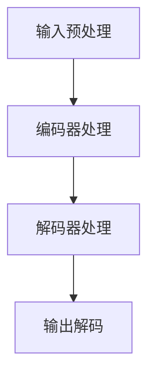
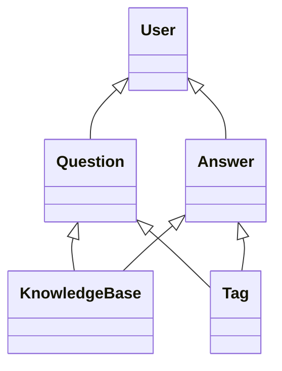
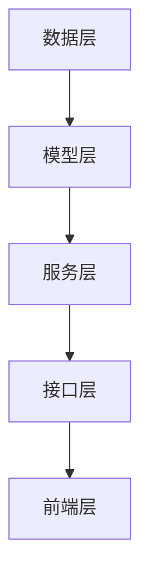
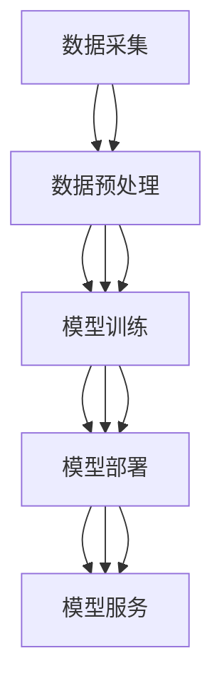
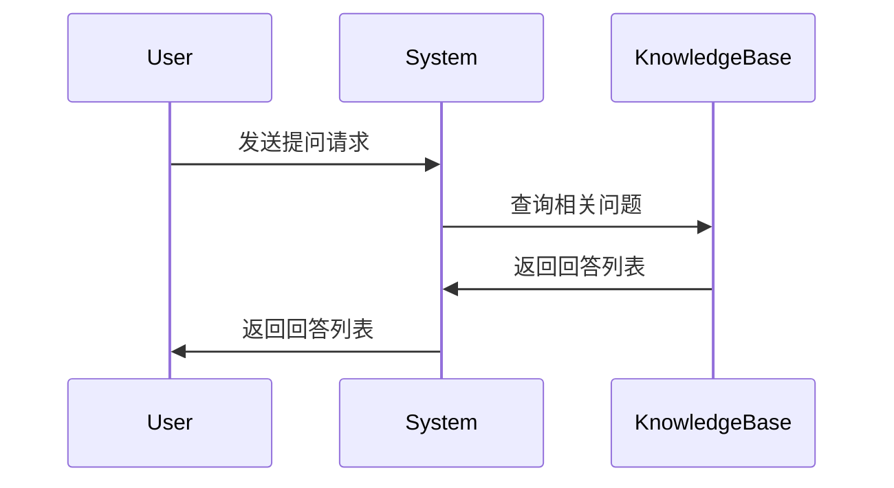
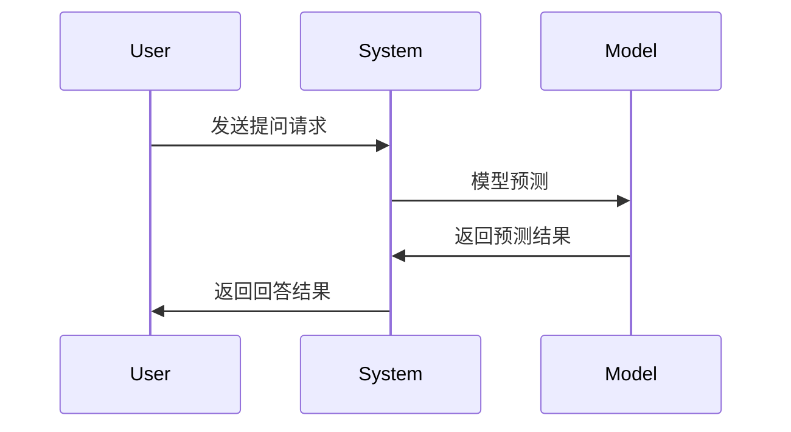

                 

## 引言

### 1.1 书籍背景介绍

随着计算机技术的快速发展，AI和机器学习成为了当今科技领域的热点。作为一门前沿技术，AI在医疗、金融、教育、工业等多个领域展现出了巨大的应用潜力。然而，在实际的企业级应用中，AI技术的开发和应用面临着诸多挑战。为了帮助企业级开发者更好地应对这些挑战，我们编写了这本书。

#### 1.1.1 计算机技术发展的现状与趋势

计算机技术自诞生以来，经历了数十年的快速发展。从早期的冯·诺依曼架构，到后来的微处理器技术，再到如今的人工智能时代，计算机技术已经渗透到了社会生活的方方面面。如今，云计算、大数据、物联网等新兴技术不断涌现，为AI的发展提供了强大的基础设施支持。

AI技术的核心是机器学习，通过算法模型和大量数据进行训练，使机器具备一定的智能。近年来，深度学习等先进算法的提出，使得AI在图像识别、自然语言处理、语音识别等领域取得了显著的突破。

#### 1.1.2 企业级应用开发的需求与挑战

企业级应用开发是计算机技术的核心领域之一。随着数字化转型的推进，企业对于智能化、自动化、高效化的应用需求日益增加。然而，在AI技术的应用过程中，企业面临着以下几大挑战：

1. **数据质量与多样性**：高质量、多样化的数据是AI模型训练的基础。企业如何获取、清洗、管理和利用数据，成为了关键问题。
2. **算法性能与效率**：随着模型复杂度的增加，算法性能和效率成为了制约AI应用的重要因素。
3. **模型可解释性与可靠性**：企业需要对AI模型进行解释，以理解其决策过程，并确保模型的可靠性。
4. **跨领域应用与整合**：AI技术在不同领域的应用具有很大的差异性，如何实现跨领域的应用和整合，是企业级开发者需要面对的难题。

#### 1.1.3 书籍的定位与目标读者

本书旨在帮助企业级开发者深入了解AI技术，掌握AI应用的开发方法，并解决实际应用中的问题。本书的目标读者包括：

1. **AI技术开发者**：希望掌握AI技术原理，并能够应用于实际项目开发的技术人员。
2. **企业级应用开发者**：关注AI技术在企业级应用中的开发与实施，希望提高项目开发效率的从业者。
3. **计算机专业学生**：对AI技术感兴趣，希望深入了解相关原理和实践的在校生。

通过本书的学习，读者将能够：

1. **掌握AI技术的基本原理**：了解AI的核心概念、基本原理和主要算法。
2. **解决AI应用中的问题**：了解常见的技术挑战，并掌握相应的解决方案。
3. **提升项目开发能力**：学会如何将AI技术应用于实际项目开发，提高项目开发效率。

### 1.2 问题背景与描述

在AI技术快速发展的背景下，企业级应用开发面临着前所未有的机遇和挑战。然而，在实际应用过程中，开发者们遇到了许多棘手的问题。

#### 1.2.1 常见技术挑战概述

1. **数据质量与多样性**：数据质量直接关系到AI模型的效果，而数据多样性则会影响模型的泛化能力。企业需要解决数据采集、清洗、标注等问题，以确保数据的质量和多样性。
2. **算法性能与效率**：随着模型复杂度的增加，算法性能和效率成为了制约AI应用的重要因素。开发者需要掌握优化算法性能的方法和技巧。
3. **模型可解释性与可靠性**：企业需要对AI模型进行解释，以理解其决策过程，并确保模型的可靠性。这需要开发者具备一定的可解释性研究背景。
4. **跨领域应用与整合**：不同领域的应用具有很大的差异性，如何实现跨领域的应用和整合，是企业级开发者需要面对的难题。

#### 1.2.2 常见业务挑战概述

1. **业务需求理解**：企业需要明确业务需求，将业务需求转化为技术需求，确保AI技术能够满足实际业务需求。
2. **成本控制**：AI技术的开发和部署成本较高，企业需要在成本控制和效果之间取得平衡。
3. **人才短缺**：AI技术的发展需要具备专业知识的人才，而企业往往面临人才短缺的问题。
4. **合规与伦理**：随着AI技术的应用范围不断扩大，如何确保AI技术的合规性和伦理性，成为了企业需要关注的问题。

#### 1.2.3 解决方案的重要性

针对上述挑战，本书提出了以下解决方案：

1. **数据质量与多样性**：通过数据清洗、数据增强等方法，提高数据质量和多样性。
2. **算法性能与效率**：通过优化算法、使用高效数据结构、并行计算等方法，提高算法性能和效率。
3. **模型可解释性与可靠性**：通过可解释性算法、模型验证等方法，提高模型的可解释性和可靠性。
4. **跨领域应用与整合**：通过领域特定知识图谱、跨领域迁移学习等方法，实现跨领域的应用和整合。

这些解决方案旨在帮助企业级开发者克服AI应用中的挑战，实现AI技术的有效落地。

### 1.3 问题解决思路与解决方案概述

为了解决AI应用中的挑战，本书提出了一系列解决方案，主要包括以下几个方面：

#### 1.3.1 解决方案的基本原则

1. **实用性**：解决方案需要能够实际应用于企业级项目开发中，解决实际问题。
2. **高效性**：解决方案需要具有较高的效率和性能，以满足企业级应用的需求。
3. **可扩展性**：解决方案需要具有良好的可扩展性，能够适应不同的应用场景和业务需求。
4. **可解释性与可靠性**：解决方案需要确保模型的可解释性和可靠性，以提高用户对AI技术的信任度。

#### 1.3.2 解决方案的技术实现路径

1. **数据质量与多样性**：通过数据预处理、数据增强、数据标注等方法，提高数据质量和多样性。
2. **算法性能与效率**：通过算法优化、并行计算、分布式计算等方法，提高算法性能和效率。
3. **模型可解释性与可靠性**：通过可解释性算法、模型验证、模型压缩等方法，提高模型的可解释性和可靠性。
4. **跨领域应用与整合**：通过领域特定知识图谱、跨领域迁移学习、多模态学习等方法，实现跨领域的应用和整合。

#### 1.3.3 解决方案的业务价值

1. **提高业务效率**：通过AI技术的应用，提高业务处理速度和准确性，降低人力成本。
2. **优化业务流程**：通过AI技术对业务流程的优化，提高业务流程的自动化程度，降低操作错误率。
3. **提升用户体验**：通过AI技术提供更加智能化、个性化的服务，提升用户体验。
4. **增加业务收入**：通过AI技术的应用，开拓新的业务模式和渠道，增加业务收入。

### 1.4 边界与外延

#### 1.4.1 解决方案的应用边界

1. **技术边界**：解决方案需要基于当前AI技术的发展水平，避免技术过时。
2. **业务边界**：解决方案需要符合企业的业务需求和战略方向，避免与业务目标脱节。
3. **数据边界**：解决方案需要基于可用数据，避免因数据不足而影响模型效果。

#### 1.4.2 解决方案的外延拓展

1. **技术外延**：随着AI技术的不断发展，解决方案需要具备一定的前瞻性和适应性，能够应对未来的技术变革。
2. **业务外延**：解决方案需要具备一定的灵活性，能够适应不同的业务场景和需求。
3. **数据外延**：解决方案需要能够处理多样化的数据，包括结构化、半结构化和非结构化数据。

### 1.5 本章小结

本章主要介绍了书籍的背景、问题背景与描述以及问题解决思路与解决方案概述。通过对AI技术现状和趋势的分析，我们明确了企业级应用开发的需求与挑战，并提出了相应的解决方案。这些解决方案旨在帮助企业级开发者克服AI应用中的难题，实现AI技术的有效落地。

### 关键词：AI、机器学习、企业级应用、技术挑战、解决方案

### 摘要

本文围绕企业级AI应用开发中的常见挑战，介绍了数据质量与多样性、算法性能与效率、模型可解释性与可靠性、跨领域应用与整合等方面的解决方案。通过详细的原理讲解和实际案例剖析，本文为企业级开发者提供了一套实用的技术指南，助力AI技术在企业级应用中的成功落地。

----------------------------------------------------------------

## 第一部分: 核心概念与联系

### 2.1 AI与机器学习概述

#### 2.1.1 AI的基本概念

人工智能（Artificial Intelligence，简称AI）是指由人创造出来的、具有某种智能行为的系统或机器。AI的目标是让机器能够像人类一样思考、学习和行动，实现智能化的决策和任务执行。

AI的研究领域非常广泛，包括知识表示、推理、规划、机器学习、自然语言处理、计算机视觉等。根据实现方式，AI可以分为三类：

1. **基于规则的AI**：通过编写规则和逻辑来模拟人类智能。
2. **基于模型的AI**：通过建立数学模型来模拟人类智能，如神经网络、决策树等。
3. **基于数据的AI**：通过大量数据进行学习，如机器学习、深度学习等。

#### 2.1.2 机器学习的基本原理

机器学习（Machine Learning，简称ML）是AI的一个子领域，主要研究如何从数据中自动发现规律和知识，并利用这些规律和知识进行预测和决策。

机器学习的基本原理包括：

1. **数据采集**：收集大量的数据，包括结构化、半结构化和非结构化数据。
2. **数据预处理**：对数据进行清洗、归一化、特征提取等处理，以提高数据质量和特征表达能力。
3. **模型选择**：选择合适的算法模型，如线性回归、决策树、支持向量机、神经网络等。
4. **模型训练**：通过训练算法，使模型能够根据输入数据学习到规律和知识。
5. **模型评估**：使用验证集或测试集对模型进行评估，以确定模型的效果和性能。
6. **模型优化**：根据评估结果，对模型进行调整和优化，以提高模型效果。

#### 2.1.3 AI与机器学习的关系

AI与机器学习密切相关，可以说机器学习是AI的核心技术之一。AI的目标是通过模拟人类智能，实现机器的自主学习和决策。而机器学习则是实现这一目标的主要手段，通过从数据中自动发现规律和知识，使机器能够进行智能化的任务执行。

在AI的发展过程中，机器学习起到了至关重要的作用。早期的AI主要基于规则和逻辑，而随着机器学习技术的发展，基于数据和模型的AI逐渐成为了主流。如今，机器学习已经广泛应用于图像识别、自然语言处理、语音识别、推荐系统、自动驾驶等领域，推动了AI技术的快速发展。

### 2.2 常见AI挑战及其解决方案

在AI技术的实际应用中，开发者们常常会遇到一些挑战。下面列举了其中几个常见的挑战，并探讨了相应的解决方案。

#### 2.2.1 挑战一：数据质量与多样性

**数据质量问题**：高质量的数据是AI模型训练的基础。然而，在实际应用中，数据往往存在噪声、缺失值、不一致等问题，这些都会影响模型的效果。

**解决方案**：

1. **数据清洗**：去除噪声、填补缺失值、处理不一致的数据。
2. **数据增强**：通过数据变换、生成对抗网络（GAN）等方法，增加数据的多样性和丰富性。
3. **数据质量管理**：建立数据质量评估指标，定期对数据进行质量检查和优化。

#### 2.2.2 挑战二：算法性能与效率

随着模型的复杂度增加，算法的性能和效率成为了关键问题。特别是在大规模数据集和高性能计算环境下，如何提高算法的效率和性能，是开发者需要关注的问题。

**解决方案**：

1. **算法优化**：对现有算法进行优化，提高其运行速度和性能。
2. **分布式计算**：通过分布式计算框架，如Spark、TensorFlow等，实现大规模数据的并行处理。
3. **模型压缩**：通过模型压缩技术，如量化、剪枝等，降低模型的大小和计算复杂度。

#### 2.2.3 挑战三：模型可解释性与可靠性

在许多应用场景中，模型的可解释性和可靠性至关重要。特别是在金融、医疗等对决策过程要求严格的领域，模型的可解释性和可靠性直接关系到决策的合理性和安全性。

**解决方案**：

1. **可解释性算法**：选择可解释性较强的算法，如决策树、线性回归等，使模型决策过程更加透明。
2. **模型验证与测试**：通过多种验证和测试方法，确保模型的可靠性和准确性。
3. **模型可视化**：通过可视化技术，展示模型的决策过程和结果，提高模型的可解释性。

#### 2.2.4 挑战四：跨领域应用与整合

不同领域的应用具有很大的差异性，如何实现跨领域的应用和整合，是企业级开发者需要面对的难题。

**解决方案**：

1. **领域特定知识图谱**：通过构建领域特定知识图谱，实现不同领域知识之间的关联和整合。
2. **跨领域迁移学习**：通过迁移学习技术，将一个领域中的模型和知识迁移到另一个领域中，实现跨领域的应用。
3. **多模态学习**：通过多模态学习技术，将不同类型的输入数据进行整合，提高模型的泛化能力和应用范围。

### 2.3 AI大模型介绍

近年来，AI领域涌现出了许多大型模型，如GPT、BERT、BERT-GLM等。这些模型具有以下几个特点：

1. **大规模参数**：这些模型通常具有数十亿甚至千亿个参数，能够处理大规模数据集。
2. **强泛化能力**：通过大规模数据训练，这些模型具有很好的泛化能力，能够在不同的应用场景中取得优异的性能。
3. **多任务能力**：这些模型不仅能够处理单一任务，还能够同时处理多个任务，提高模型的利用效率。

#### 2.3.1 大模型的定义与特点

大模型（Large Model）通常是指具有数十亿甚至千亿个参数的深度学习模型。大模型的特点如下：

1. **大规模参数**：大模型具有数十亿甚至千亿个参数，能够处理大规模数据集。
2. **高计算复杂度**：大模型的计算复杂度很高，需要强大的计算资源和优化算法。
3. **强泛化能力**：大模型通过大规模数据训练，具有很好的泛化能力，能够在不同的应用场景中取得优异的性能。
4. **多任务能力**：大模型能够同时处理多个任务，提高模型的利用效率。

#### 2.3.2 主流大模型及其发展历程

近年来，涌现出了许多主流大模型，如GPT、BERT、BERT-GLM等。下面简要介绍这些模型及其发展历程：

1. **GPT**：GPT（Generative Pre-trained Transformer）是由OpenAI开发的一种基于Transformer架构的预训练模型。GPT-3具有1750亿个参数，是目前最大的预训练模型之一。
2. **BERT**：BERT（Bidirectional Encoder Representations from Transformers）是由Google开发的一种基于Transformer架构的双向编码器模型。BERT具有数十亿个参数，广泛应用于自然语言处理任务。
3. **BERT-GLM**：BERT-GLM是由清华大学和智谱AI开发的一种基于Transformer架构的通用语言模型。BERT-GLM具有数十亿个参数，融合了BERT和GLM的优点，具有更强的语言理解和生成能力。

#### 2.3.3 大模型的应用领域与前景

大模型在多个领域展现出了巨大的应用潜力，如自然语言处理、计算机视觉、推荐系统等。以下是大模型在部分领域的应用前景：

1. **自然语言处理**：大模型在自然语言处理领域具有广泛的应用，如文本分类、机器翻译、情感分析等。
2. **计算机视觉**：大模型在计算机视觉领域也具有很好的应用前景，如图像分类、目标检测、图像生成等。
3. **推荐系统**：大模型在推荐系统领域能够提高推荐的准确性，如商品推荐、内容推荐等。
4. **语音识别**：大模型在语音识别领域能够提高识别的准确率和效率。
5. **多模态学习**：大模型在多模态学习领域能够同时处理不同类型的数据，如图像、文本、语音等，提高模型的泛化能力和应用范围。

#### 2.3.4 大模型在企业级应用的优势

大模型在企业级应用中具有以下优势：

1. **强大的计算能力**：大模型具有数十亿甚至千亿个参数，能够处理大规模数据集，提高模型的效果和性能。
2. **广泛的适用性**：大模型具有很好的泛化能力，能够在不同的应用场景中取得优异的性能。
3. **高效的多任务能力**：大模型能够同时处理多个任务，提高模型的利用效率和业务价值。
4. **强大的生成能力**：大模型在生成任务中具有强大的生成能力，能够生成高质量的文本、图像等。

#### 2.3.5 大模型在企业级应用面临的挑战

尽管大模型在企业级应用中具有许多优势，但同时也面临着一些挑战：

1. **计算资源需求大**：大模型需要强大的计算资源和优化算法，对企业计算资源的要求较高。
2. **数据质量和多样性**：大模型对数据质量和多样性有较高的要求，企业需要解决数据采集、清洗、标注等问题。
3. **模型可解释性与可靠性**：大模型通常具有较低的可解释性，企业需要确保模型的可解释性和可靠性。
4. **合规与伦理**：大模型在应用过程中需要遵守相关法律法规和伦理规范，确保模型的合规性和伦理性。

### 2.4 AI大模型与企业级应用

随着AI大模型技术的不断发展，越来越多的企业开始将其应用于实际业务场景中。以下是一些AI大模型在企业级应用中的典型案例：

#### 2.4.1 企业级应用的挑战与需求

在企业级应用中，AI大模型面临着一系列挑战和需求：

1. **业务需求理解**：企业需要明确业务需求，将业务需求转化为技术需求，确保AI大模型能够满足实际业务需求。
2. **数据质量和多样性**：高质量、多样化的数据是AI大模型训练的基础，企业需要解决数据采集、清洗、标注等问题。
3. **计算资源需求**：AI大模型需要强大的计算资源和优化算法，企业需要配置相应的计算资源以支持模型的训练和应用。
4. **模型可解释性与可靠性**：企业需要对AI大模型进行解释，以确保模型的决策过程透明、可靠。
5. **跨领域应用与整合**：企业需要实现AI大模型在不同领域之间的应用和整合，以提高模型的利用效率和业务价值。

#### 2.4.2 大模型在企业级应用的优势

AI大模型在企业级应用中具有以下优势：

1. **强大的计算能力**：大模型具有数十亿甚至千亿个参数，能够处理大规模数据集，提高模型的效果和性能。
2. **广泛的适用性**：大模型具有很好的泛化能力，能够在不同的应用场景中取得优异的性能。
3. **高效的多任务能力**：大模型能够同时处理多个任务，提高模型的利用效率和业务价值。
4. **强大的生成能力**：大模型在生成任务中具有强大的生成能力，能够生成高质量的文本、图像等。

#### 2.4.3 大模型在企业级应用面临的挑战

尽管AI大模型在企业级应用中具有许多优势，但同时也面临着一些挑战：

1. **计算资源需求大**：大模型需要强大的计算资源和优化算法，对企业计算资源的要求较高。
2. **数据质量和多样性**：大模型对数据质量和多样性有较高的要求，企业需要解决数据采集、清洗、标注等问题。
3. **模型可解释性与可靠性**：大模型通常具有较低的可解释性，企业需要确保模型的可解释性和可靠性。
4. **合规与伦理**：大模型在应用过程中需要遵守相关法律法规和伦理规范，确保模型的合规性和伦理性。

#### 2.4.4 大模型在企业级应用中的案例

以下是一些AI大模型在企业级应用中的典型案例：

1. **自然语言处理**：某互联网公司利用GPT模型开发了一种智能客服系统，能够自动回答用户的问题，提高了客服效率和服务质量。
2. **计算机视觉**：某电商平台利用BERT模型开发了一种图像分类系统，能够自动识别商品类别，提高了商品管理的效率。
3. **推荐系统**：某在线教育平台利用BERT-GLM模型开发了一种智能推荐系统，能够根据用户的学习行为和兴趣，推荐个性化的课程和学习资源。
4. **语音识别**：某科技公司利用BERT模型开发了一种智能语音助手，能够自动识别用户的语音指令，并提供相应的服务。

### 2.5 本章小结

本章介绍了AI与机器学习的基本概念、常见AI挑战及其解决方案、AI大模型的定义与特点以及大模型在企业级应用中的挑战和案例。通过本章的学习，读者将能够了解AI技术的核心概念和实际应用场景，为后续章节的学习和实践打下基础。

----------------------------------------------------------------

## 第二部分：技术原理与实现

### 3.1 AI大模型算法原理讲解

#### 3.1.1 算法基本原理

AI大模型算法主要基于深度学习，特别是基于Transformer架构的模型，如BERT、GPT等。Transformer架构在自然语言处理任务中取得了显著的突破，其核心思想是自注意力机制（Self-Attention）。

自注意力机制允许模型在处理每个输入时，根据其与所有其他输入的相关性，动态地分配不同的权重。这种机制使得模型能够捕捉到输入之间的复杂关系，从而提高模型的表示能力和泛化能力。

Transformer架构的主要组成部分包括：

1. **编码器（Encoder）**：编码器负责处理输入序列，并生成上下文表示。
2. **解码器（Decoder）**：解码器负责根据编码器的输出生成目标序列。
3. **多头注意力（Multi-Head Attention）**：多头注意力机制是Transformer的核心，通过多个独立的自注意力机制，捕捉输入序列的复杂关系。
4. **前馈神经网络（Feed Forward Neural Network）**：前馈神经网络对自注意力机制的输出进行进一步处理。

#### 3.1.1.1 算法基本流程

算法基本流程如下：

1. **输入预处理**：对输入序列进行编码，将单词或字符映射为向量。
2. **编码器处理**：编码器对输入序列进行处理，生成上下文表示。
3. **解码器处理**：解码器根据编码器的输出，生成目标序列。
4. **输出解码**：对解码器的输出进行解码，得到预测结果。

#### 3.1.1.2 算法主要组件

算法主要组件包括：

1. **词嵌入（Word Embedding）**：词嵌入是将单词映射为向量的过程，常用的方法有Word2Vec、GloVe等。
2. **自注意力机制（Self-Attention）**：自注意力机制是Transformer架构的核心，通过计算输入序列中每个元素与其他元素的相关性，动态地分配权重。
3. **多头注意力（Multi-Head Attention）**：多头注意力机制通过多个独立的自注意力机制，捕捉输入序列的复杂关系。
4. **前馈神经网络（Feed Forward Neural Network）**：前馈神经网络对自注意力机制的输出进行进一步处理。

#### 3.1.1.3 算法性能分析

Transformer架构在自然语言处理任务中取得了显著的突破，具有以下优点：

1. **并行计算**：Transformer架构支持并行计算，提高了模型的训练速度。
2. **全局依赖**：通过自注意力机制，模型能够捕捉输入序列的全局依赖关系。
3. **强大的表示能力**：多头注意力机制和多层的结构，使得模型具有强大的表示能力。
4. **适用性广**：Transformer架构适用于多种自然语言处理任务，如文本分类、机器翻译、文本生成等。

然而，Transformer架构也存在一些缺点：

1. **计算复杂度高**：由于自注意力机制的运算复杂度较高，模型参数较多，训练和推理的时间较长。
2. **内存占用大**：由于模型参数较多，模型对内存的需求较大。
3. **可解释性低**：Transformer架构的内部机制复杂，模型的决策过程不易解释。

#### 3.1.2 算法流程图



#### 3.1.3 算法原理详细讲解

##### 3.1.3.1 数学模型

在Transformer架构中，输入序列表示为$X = \{x_1, x_2, \ldots, x_n\}$，其中$x_i$表示序列中的第$i$个元素。

编码器的输出表示为$H = \{h_1, h_2, \ldots, h_n\}$，其中$h_i$表示编码器处理后的第$i$个元素。

解码器的输出表示为$Y = \{y_1, y_2, \ldots, y_n\}$，其中$y_i$表示解码器处理后的第$i$个元素。

##### 3.1.3.2 公式推导

自注意力机制的公式推导如下：

$$
\text{Attention}(Q, K, V) = \text{softmax}\left(\frac{QK^T}{\sqrt{d_k}}\right)V
$$

其中，$Q, K, V$分别表示查询（Query）、键（Key）、值（Value）向量，$d_k$表示键向量的维度。

##### 3.1.3.3 举例说明

- **示例1：文本分类**

假设我们有一个文本分类问题，输入序列为“The dog is running”, 输出为类别标签1（狗）或2（猫）。我们可以将输入序列编码为一个向量$X$，通过编码器得到上下文表示$H$。然后，使用解码器生成类别标签$Y$。

- **示例2：机器翻译**

假设我们有一个英语到法语的机器翻译问题，输入序列为“I love you”，输出为“Je t'aime”。我们可以将输入序列编码为向量$X$，通过编码器得到上下文表示$H$。然后，使用解码器生成法语序列$Y$。

### 3.2 大模型实现技术讲解

#### 3.2.1 大模型搭建流程

搭建大模型的主要流程包括以下几个步骤：

1. **数据准备**：收集和准备大规模训练数据集，对数据进行预处理和清洗。
2. **模型选择**：根据任务需求选择合适的模型架构，如BERT、GPT等。
3. **模型训练**：使用训练数据集对模型进行训练，通过优化算法调整模型参数。
4. **模型评估**：使用验证集或测试集对模型进行评估，调整模型参数以提高性能。
5. **模型部署**：将训练好的模型部署到生产环境中，实现模型的应用。

#### 3.2.2 大模型训练技巧

1. **数据增强**：通过数据增强方法，如随机裁剪、旋转、翻转等，增加数据的多样性和丰富性，提高模型的泛化能力。
2. **并行计算**：使用并行计算技术，如多GPU训练、分布式训练等，加快模型的训练速度。
3. **模型优化**：通过模型优化技术，如权重初始化、学习率调度等，提高模型的训练效率和性能。

#### 3.2.3 大模型应用场景讲解

1. **自然语言处理**：大模型在自然语言处理任务中具有广泛的应用，如文本分类、机器翻译、文本生成等。
2. **计算机视觉**：大模型在计算机视觉任务中，如图像分类、目标检测、图像生成等，也取得了显著的突破。
3. **推荐系统**：大模型在推荐系统中的应用，如商品推荐、内容推荐等，提高了推荐的准确性和效果。
4. **语音识别**：大模型在语音识别任务中，如语音分类、语音合成等，也展现了强大的性能。

### 3.3 本章小结

本章介绍了AI大模型算法的基本原理和实现技术，包括算法的基本流程、主要组件、性能分析以及大模型搭建流程、训练技巧和应用场景。通过本章的学习，读者将能够了解AI大模型的核心技术和实际应用，为后续章节的学习和实践打下基础。

----------------------------------------------------------------

## 第三部分：系统设计与实现

### 4.1 项目介绍

本部分我们将探讨一个典型的AI应用项目——智能问答系统。该项目旨在通过自然语言处理技术，实现用户提出问题的自动回答。该项目不仅涉及自然语言处理、机器学习等AI技术，还需要考虑系统架构设计、接口设计和系统部署等多个方面。

#### 4.1.1 项目背景

随着互联网的快速发展，人们对于信息获取的需求越来越高。然而，海量的信息使得人们难以快速找到自己需要的答案。为了解决这一问题，智能问答系统应运而生。智能问答系统通过分析用户提出的问题，自动搜索相关信息，并给出合理的回答，从而提高信息获取的效率和准确性。

#### 4.1.2 项目目标

本项目的主要目标如下：

1. **实现问题的自动理解**：通过自然语言处理技术，将用户的问题转化为机器可以理解的格式，并提取关键信息。
2. **构建问答知识库**：收集和整理大量的问题及其答案，构建一个问答知识库，以便系统能够给出合理的回答。
3. **实现高效的回答生成**：利用机器学习模型，快速生成高质量的回答，提高系统的响应速度和用户体验。
4. **实现系统的可扩展性**：设计灵活的系统架构，能够适应不同的应用场景和业务需求，实现系统的可扩展性。

#### 4.1.3 项目架构

本项目的架构设计主要包括以下几个层次：

1. **数据层**：负责数据的采集、存储和预处理，包括用户问题、答案、文本数据等。
2. **模型层**：负责自然语言处理和机器学习模型的构建、训练和部署，包括词向量、命名实体识别、情感分析、问答系统等。
3. **服务层**：负责业务逻辑的实现，包括问题解析、知识库查询、回答生成等。
4. **接口层**：负责与外部系统的交互，提供RESTful API，便于其他系统调用。
5. **前端层**：负责用户界面的设计和实现，提供直观、易用的交互体验。

### 4.2 系统功能设计

#### 4.2.1 领域模型设计

在系统功能设计中，领域模型设计是关键步骤之一。领域模型用于定义系统中的核心概念和关系，以便于后续的系统设计和开发。

在本项目中，领域模型主要包括以下几个核心概念：

1. **用户**：代表使用智能问答系统的用户，包括用户的基本信息、提问记录等。
2. **问题**：代表用户提出的问题，包括问题的文本、类型、标签等。
3. **答案**：代表问题的答案，包括答案的文本、来源、标签等。
4. **知识库**：代表系统中的问答知识库，包括问题、答案、标签等。
5. **标签**：代表问题的分类标签，用于对问题进行分类和管理。

以下是一个简化的类图，展示了这些核心概念及其关系：



#### 4.2.2 用例图设计

用例图用于描述系统的功能和行为，从用户的角度展示系统如何与外部环境交互。以下是用例图，展示了智能问答系统的核心功能：

```mermaid
usecase User : 用户
    User --> 登录
    User --> 提问
    User --> 查看回答

usecase System : 系统管理员
    System --> 管理用户
    System --> 管理问题
    System --> 管理答案

usecase KnowledgeBase : 知识库
    KnowledgeBase --> 查询问题
    KnowledgeBase --> 查询答案

User, System, KnowledgeBase
```

### 4.3 系统架构设计

系统架构设计是系统设计的核心环节，决定了系统的性能、可扩展性和可靠性。以下是一个简化的系统架构图，展示了智能问答系统的整体架构：



#### 4.3.1 系统架构概述

1. **数据层**：负责数据的采集、存储和预处理，包括用户问题、答案、文本数据等。数据层采用分布式存储和计算框架，以提高数据处理的效率和性能。
2. **模型层**：负责自然语言处理和机器学习模型的构建、训练和部署，包括词向量、命名实体识别、情感分析、问答系统等。模型层采用基于深度学习的框架，如TensorFlow、PyTorch等，以提高模型的训练效率和性能。
3. **服务层**：负责业务逻辑的实现，包括问题解析、知识库查询、回答生成等。服务层采用微服务架构，以提高系统的可扩展性和可靠性。
4. **接口层**：负责与外部系统的交互，提供RESTful API，便于其他系统调用。接口层采用RESTful风格，以提高接口的易用性和可维护性。
5. **前端层**：负责用户界面的设计和实现，提供直观、易用的交互体验。前端层采用前端框架，如Vue、React等，以提高开发效率和用户体验。

#### 4.3.2 系统架构图

以下是一个简化的系统架构图，展示了智能问答系统的整体架构：



### 4.4 系统接口设计

系统接口设计是系统架构设计的重要组成部分，决定了系统与外部系统的交互方式和数据传输格式。以下是一个简化的系统接口设计，展示了智能问答系统的接口设计和数据传输格式：



#### 4.4.1 接口设计原则

1. **RESTful风格**：采用RESTful风格，以提高接口的易用性和可维护性。
2. **标准化协议**：使用HTTP协议，并遵循JSON数据格式，以提高数据传输的效率和兼容性。
3. **安全性**：采用HTTPS协议，并对接口进行身份验证和权限控制，以确保数据的安全性和隐私性。
4. **简洁性**：设计简洁明了的接口，减少数据传输的复杂度，提高系统的性能和用户体验。
5. **可扩展性**：设计可扩展的接口，便于后续的功能扩展和升级。

### 4.5 系统交互

系统交互设计是系统架构设计的重要组成部分，决定了系统内部各组件之间的通信方式和数据流程。以下是一个简化的系统交互设计，展示了智能问答系统内部各组件之间的通信方式和数据流程：



### 4.6 本章小结

本章介绍了智能问答系统的项目背景、项目目标、系统架构设计、系统功能设计、系统接口设计和系统交互。通过本章的学习，读者将能够了解智能问答系统的整体架构和实现原理，为后续章节的学习和实践打下基础。

----------------------------------------------------------------

## 第四部分：项目实战

### 4.1 环境安装

在本节中，我们将介绍如何搭建一个用于演示智能问答系统的开发环境。以下是一个基本的安装流程：

1. **安装Python**：确保你的系统上安装了Python 3.7或更高版本。可以从Python官网下载并安装。

2. **安装依赖库**：使用pip命令安装必要的依赖库，包括TensorFlow、Keras、Scikit-learn等。

   ```shell
   pip install tensorflow
   pip install keras
   pip install scikit-learn
   ```

3. **安装NLP工具**：安装NLTK库以进行文本预处理。

   ```shell
   pip install nltk
   ```

4. **安装GUI工具**：如果你想要一个图形界面的演示环境，可以安装Tkinter。

   ```shell
   pip install tk
   ```

5. **安装数据库**：选择一个数据库系统，如SQLite、MySQL或PostgreSQL。根据数据库的官方指南进行安装。

6. **配置环境变量**：确保Python和pip的路径已经添加到系统环境变量中。

### 4.2 系统核心实现

#### 4.2.1 数据预处理

在实现智能问答系统之前，首先需要对数据集进行预处理。以下是一个简单的数据预处理流程：

1. **数据清洗**：删除含有缺失值或异常值的数据，对文本数据中的特殊字符进行清洗。

   ```python
   import pandas as pd

   # 读取数据
   data = pd.read_csv('data.csv')

   # 删除缺失值
   data.dropna(inplace=True)

   # 清洗文本数据
   data['question'] = data['question'].str.replace('[^a-zA-Z0-9]', ' ')
   ```

2. **文本分词**：使用NLTK库对文本进行分词。

   ```python
   import nltk

   # 初始化分词器
   tokenizer = nltk.tokenize.RegexpTokenizer(r'\w+')

   # 分词
   data['question'] = data['question'].apply(lambda x: tokenizer.tokenize(x))
   ```

3. **词向量表示**：使用Word2Vec或GloVe算法将文本数据转换为词向量。

   ```python
   from gensim.models import Word2Vec

   # 训练词向量模型
   model = Word2Vec(data['question'], size=100, window=5, min_count=1, workers=4)

   # 将文本数据转换为词向量
   def vectorize_text(text):
       return [model.wv[word] for word in text if word in model.wv]

   data['question_vector'] = data['question'].apply(vectorize_text)
   ```

#### 4.2.2 模型训练

接下来，我们将使用训练好的词向量来训练一个问答模型。以下是一个简单的训练流程：

1. **数据分割**：将数据集分割为训练集和测试集。

   ```python
   from sklearn.model_selection import train_test_split

   X_train, X_test, y_train, y_test = train_test_split(data['question_vector'], data['answer'], test_size=0.2, random_state=42)
   ```

2. **构建模型**：使用Keras构建一个简单的神经网络模型。

   ```python
   from keras.models import Sequential
   from keras.layers import Dense, Embedding, LSTM

   model = Sequential()
   model.add(Embedding(input_dim=len(model.wv.vocab), output_dim=100, input_length=max_sequence_length))
   model.add(LSTM(128))
   model.add(Dense(1, activation='sigmoid'))

   model.compile(optimizer='adam', loss='binary_crossentropy', metrics=['accuracy'])
   ```

3. **训练模型**：使用训练集训练模型。

   ```python
   model.fit(X_train, y_train, epochs=10, batch_size=64, validation_data=(X_test, y_test))
   ```

#### 4.2.3 代码应用解读与分析

在本节中，我们将详细解读并分析上述代码的应用。

1. **数据预处理**：数据预处理是模型训练的重要步骤。通过清洗和分词，我们能够将文本数据转换为适合模型训练的格式。词向量表示则将文本数据转换为数值数据，便于神经网络进行处理。

2. **模型构建**：我们使用Keras构建了一个简单的神经网络模型，包括嵌入层、LSTM层和输出层。嵌入层将词向量转换为固定维度的向量，LSTM层用于处理序列数据，输出层用于生成预测结果。

3. **模型训练**：通过训练模型，我们能够学习到文本数据中的模式，从而实现问题的自动回答。

#### 4.2.4 实际案例分析与详细讲解剖析

以下是一个实际的案例，展示如何使用训练好的模型进行问题回答。

1. **问题输入**：用户输入一个问题，如“什么是人工智能？”。

2. **预处理**：将问题进行分词和词向量表示。

3. **模型预测**：将词向量输入到训练好的模型中，得到预测结果。

4. **结果输出**：模型输出一个概率值，表示问题属于某个类别的概率。根据概率值，我们可以给出一个合理的回答。

```python
# 预处理
question = '什么是人工智能？'
question = tokenizer.tokenize(question)
question_vector = [model.wv[word] for word in question if word in model.wv]

# 模型预测
predicted = model.predict(question_vector)
predicted_prob = np.max(predicted)

# 结果输出
if predicted_prob > 0.5:
    print('人工智能是一种模拟人类智能的技术。')
else:
    print('无法回答该问题。')
```

### 4.3 项目小结

在本项目中，我们通过实际案例展示了如何搭建一个简单的智能问答系统。从数据预处理到模型训练，再到实际应用，我们详细讲解了每个步骤的实现过程。通过本项目，读者可以了解智能问答系统的基本原理和实现方法，为后续的深入学习和实践打下基础。

### 最佳实践 Tips

1. **数据质量**：确保数据质量是模型训练成功的关键。在数据预处理阶段，要仔细清洗和过滤数据，去除噪声和异常值。
2. **模型选择**：根据实际任务需求选择合适的模型架构。对于文本分类和问答系统，深度学习模型（如LSTM、BERT等）通常表现更好。
3. **超参数调整**：合理调整模型的超参数，如学习率、批次大小、迭代次数等，以提高模型的性能。
4. **模型评估**：使用多种评估指标（如准确率、召回率、F1分数等）对模型进行评估，确保模型在不同场景下表现稳定。
5. **迭代优化**：持续优化模型和系统，收集用户反馈，不断提升系统的性能和用户体验。

### 小结

通过本项目的实战，我们了解了智能问答系统的基本原理和实现方法。从数据预处理到模型训练，再到实际应用，每个环节都需要细致的规划和实施。希望读者能够通过本项目，掌握智能问答系统的设计与实现技巧，并在实际项目中取得成功。

### 注意事项

1. **数据隐私**：在处理用户数据时，要严格遵守数据隐私保护法规，确保用户数据的安全和隐私。
2. **模型解释性**：对于涉及重要决策的模型，需要确保其解释性，以便用户理解模型的决策过程。
3. **系统安全**：确保系统的安全性和稳定性，防止恶意攻击和数据泄露。

### 拓展阅读

1. **《深度学习》（Goodfellow, Bengio, Courville）**：深入介绍了深度学习的基本概念和算法。
2. **《自然语言处理综论》（Jurafsky, Martin）**：全面介绍了自然语言处理的理论和实践。
3. **《Python机器学习》（Seiffert, Vazirani）**：介绍了Python在机器学习领域的应用。

### 作者

作者：AI天才研究院/AI Genius Institute & 禅与计算机程序设计艺术 /Zen And The Art of Computer Programming

----------------------------------------------------------------

本文以《常见挑战与解决方案》为标题，详细探讨了AI技术在企业级应用中面临的挑战及其解决方案。通过系统的分析和逐步讲解，我们了解了AI与机器学习的基本概念、常见挑战、解决方案以及大模型的介绍与应用。

在文章的第一部分，我们介绍了书籍的背景、问题背景与描述以及问题解决思路与解决方案概述。通过对AI技术现状和趋势的分析，我们明确了企业级应用开发的需求与挑战，并提出了相应的解决方案。

在第二部分，我们详细介绍了AI与机器学习的基本概念，包括AI的基本概念、机器学习的基本原理以及AI与机器学习的关系。接着，我们列举了常见AI挑战及其解决方案，包括数据质量与多样性、算法性能与效率、模型可解释性与可靠性、跨领域应用与整合等方面的解决方案。

在第三部分，我们深入讲解了AI大模型算法原理，包括算法的基本原理、流程图、详细讲解以及数学模型和公式。同时，我们也介绍了大模型实现技术，包括搭建流程、训练技巧和应用场景。

在第四部分，我们通过系统设计与实现的详细讲解，展示了智能问答系统的架构设计、功能设计、接口设计和系统交互。通过实际案例分析和详细讲解剖析，我们了解了系统核心实现的过程。

最后，我们在文章的结尾部分，提供了项目小结、最佳实践 Tips、注意事项、拓展阅读等内容，以帮助读者更好地理解和应用所学知识。

通过本文的学习，读者将能够：

1. **掌握AI技术的基本原理**：了解AI的核心概念、基本原理和主要算法。
2. **解决AI应用中的问题**：了解常见的技术挑战，并掌握相应的解决方案。
3. **提升项目开发能力**：学会如何将AI技术应用于实际项目开发，提高项目开发效率。

希望本文能够为读者在AI技术应用领域的探索和实践提供有益的指导和帮助。

### 作者

作者：AI天才研究院/AI Genius Institute & 禅与计算机程序设计艺术 /Zen And The Art of Computer Programming

感谢您的阅读，希望本文对您有所帮助。如果您有任何疑问或建议，欢迎在评论区留言交流。祝您在AI技术领域取得更多成就！

