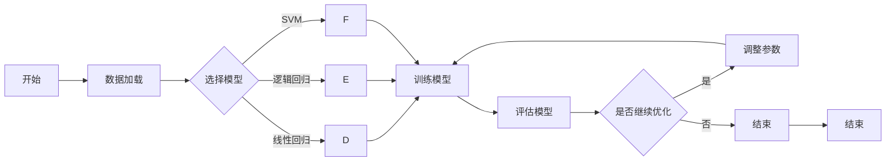
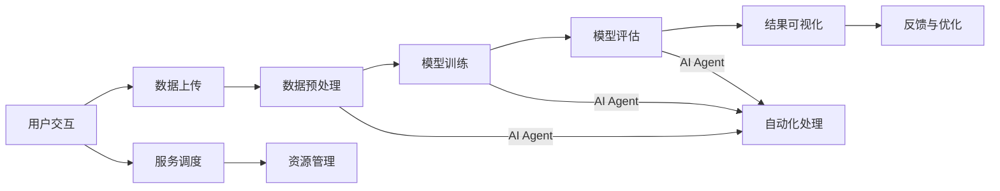
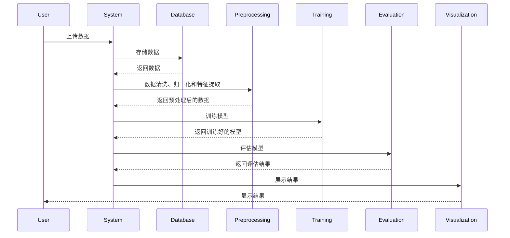

                 


# 开发AI Agent支持的智能生物信息分析系统

## 关键词

- AI Agent
- 生物信息分析
- 智能系统
- 数据预处理
- 模型训练

## 摘要

本文旨在探讨如何开发一个基于AI Agent支持的智能生物信息分析系统。首先，我们将介绍生物信息分析领域的背景和挑战，然后深入讲解AI Agent的核心概念及其在智能生物信息分析系统中的应用。随后，我们将详细分析数据预处理、模型训练和优化等算法原理，并通过实际案例展示系统设计和实现过程。最后，我们将总结最佳实践和未来研究方向，为智能生物信息分析系统的发展提供指导。

### 目录大纲

1. **背景介绍**
   1.1 问题的背景
   1.2 核心概念与联系
   1.3 AI Agent的定义与特点
   1.4 智能生物信息分析系统的特点
   1.5 AI Agent与智能生物信息分析系统的关系
2. **核心概念与联系**
   2.1 AI Agent原理
   2.2 智能生物信息分析系统的特点
   2.3 AI Agent与智能生物信息分析系统的关系
3. **算法原理讲解**
   3.1 数据预处理算法
   3.2 模型训练与优化算法
   3.3 深度学习算法在生物信息分析中的应用
4. **系统分析与架构设计**
   4.1 问题场景介绍
   4.2 系统功能设计
   4.3 系统架构设计
   4.4 系统接口设计和系统交互
5. **项目实战**
   5.1 环境安装
   5.2 系统核心实现源代码
   5.3 代码应用解读与分析
   5.4 实际案例分析和详细讲解剖析
   5.5 项目小结
6. **最佳实践、小结与拓展阅读**

### 背景介绍

#### 1.1 问题的背景

随着生物技术的迅猛发展，生物信息学领域的研究成果层出不穷。然而，随着生物数据的规模和复杂性不断增加，传统的生物信息分析方法已难以满足需求。生物信息分析涉及基因组学、转录组学、蛋白质组学等多个领域，数据类型包括序列数据、结构数据、表达数据等，这些数据通常具有高维度、非线性、时空依赖等特点。因此，开发一种能够支持AI Agent的智能生物信息分析系统，对于提升生物信息处理和分析效率具有重要意义。

#### 1.2 核心概念与联系

在开发AI Agent支持的智能生物信息分析系统之前，我们需要明确一些核心概念，如AI Agent、智能生物信息分析系统等。AI Agent是一种具备自主性、反应性和预知性的计算机程序，能够在特定环境中执行任务并做出决策。智能生物信息分析系统则是一种利用AI Agent技术，对生物信息数据进行高效处理和分析的系统。

#### 1.3 AI Agent的定义与特点

AI Agent是一种基于人工智能技术的计算机程序，能够在特定环境中执行任务并做出决策。其定义和特点如下：

##### 1.3.1 定义

AI Agent是一种自主的、自组织的人工智能实体，能够感知环境、理解问题、制定计划并执行任务。

##### 1.3.2 特点

- **自主性**：AI Agent能够自主执行任务，无需人工干预。
- **反应性**：AI Agent能够实时响应环境变化。
- **预知性**：AI Agent能够预测环境变化并做出决策。

#### 1.4 智能生物信息分析系统的特点

智能生物信息分析系统应具备以下特点：

- **高效的数据处理能力**：能够快速处理大规模、多维度的生物信息数据。
- **准确的模型预测能力**：能够利用机器学习算法，对生物信息数据进行分析和预测。
- **智能的交互能力**：能够与用户进行自然语言交互，提供个性化的分析服务。

#### 1.5 AI Agent与智能生物信息分析系统的关系

AI Agent是智能生物信息分析系统的核心组成部分，负责系统的智能化交互和任务调度。具体来说，AI Agent在智能生物信息分析系统中的应用主要包括以下几个方面：

- **自动化数据预处理**：AI Agent可以自动进行数据清洗、归一化等预处理操作，提高数据处理效率。
- **智能化模型训练**：AI Agent可以根据数据特点，选择合适的模型进行训练，提高模型预测性能。
- **个性化分析服务**：AI Agent可以与用户进行自然语言交互，根据用户需求提供个性化的分析服务。

### 1.6 边界与外延

智能生物信息分析系统的边界包括数据收集、数据处理、模型构建、模型优化和系统交互。其外延涉及生物信息学、机器学习、深度学习等多个领域。通过开发AI Agent支持的智能生物信息分析系统，我们可以更好地应对生物信息学领域的挑战，为生物科学研究提供有力支持。

## 核心概念与联系

### 2.1 AI Agent原理

AI Agent是一种基于人工智能技术的计算机程序，具备自主性、反应性和预知性等特点。下面我们将详细讲解AI Agent的核心组成部分和常用算法。

#### 2.1.1 AI Agent的核心组成部分

AI Agent的核心组成部分包括感知模块、决策模块和执行模块。

- **感知模块**：感知模块负责收集环境信息，如传感器数据、用户输入等。感知模块通过传感器感知环境变化，并将这些信息传递给决策模块。
- **决策模块**：决策模块根据感知模块收集的信息，生成行动计划。决策模块利用已知的规则、算法或机器学习模型，对感知模块提供的信息进行分析和处理，从而生成行动计划。
- **执行模块**：执行模块负责执行决策模块生成的行动计划。执行模块将决策模块生成的行动计划转化为具体的操作，如发送指令、调整参数等，以实现任务目标。

#### 2.1.2 AI Agent的常用算法

AI Agent的常用算法包括机器学习算法、深度学习算法等。

- **机器学习算法**：机器学习算法是一种通过训练模型来学习数据特征和规律的算法。常见的机器学习算法包括监督学习、无监督学习和强化学习。
  - **监督学习**：监督学习是一种通过已知输入输出数据来训练模型的方法。常见的监督学习算法包括线性回归、逻辑回归、支持向量机（SVM）等。
  - **无监督学习**：无监督学习是一种通过未知输入输出数据来训练模型的方法。常见的无监督学习算法包括聚类、降维、关联规则等。
  - **强化学习**：强化学习是一种通过奖励机制来训练模型的方法。常见的强化学习算法包括Q-learning、SARSA等。
- **深度学习算法**：深度学习算法是一种通过多层神经网络来学习数据特征和规律的算法。常见的深度学习算法包括卷积神经网络（CNN）、递归神经网络（RNN）、长短时记忆网络（LSTM）等。

### 2.2 智能生物信息分析系统的特点

智能生物信息分析系统是一种利用AI Agent技术，对生物信息数据进行高效处理和分析的系统。它具有以下特点：

- **高效的数据处理能力**：智能生物信息分析系统能够快速处理大规模、多维度的生物信息数据，提高数据处理效率。
- **准确的模型预测能力**：智能生物信息分析系统能够利用机器学习算法和深度学习算法，对生物信息数据进行分析和预测，提高模型预测性能。
- **智能的交互能力**：智能生物信息分析系统能够与用户进行自然语言交互，根据用户需求提供个性化的分析服务。

### 2.3 AI Agent与智能生物信息分析系统的关系

AI Agent是智能生物信息分析系统的核心组成部分，负责系统的智能化交互和任务调度。AI Agent在智能生物信息分析系统中的应用主要包括以下几个方面：

- **自动化数据预处理**：AI Agent可以自动进行数据清洗、归一化等预处理操作，提高数据处理效率。
- **智能化模型训练**：AI Agent可以根据数据特点，选择合适的模型进行训练，提高模型预测性能。
- **个性化分析服务**：AI Agent可以与用户进行自然语言交互，根据用户需求提供个性化的分析服务。

通过引入AI Agent技术，智能生物信息分析系统可以实现自动化、智能化和个性化的生物信息处理和分析，为生物科学研究提供有力支持。

### 2.4 概念属性特征对比表格

为了更好地理解AI Agent和智能生物信息分析系统的概念属性特征，我们可以通过对比表格的形式进行展示。以下是一个简单的对比表格：

| 特征类别       | AI Agent                     | 智能生物信息分析系统                  |
|----------------|------------------------------|-------------------------------------|
| 定义           | 基于人工智能的计算机程序     | 基于AI Agent的智能生物信息分析平台   |
| 目标           | 自动执行任务并做出决策       | 高效处理和分析生物信息数据           |
| 组成部分       | 感知模块、决策模块、执行模块   | 数据处理、模型训练、结果可视化模块   |
| 算法           | 机器学习、深度学习           | 数据预处理、特征提取、模型训练、优化   |
| 交互           | 与用户、环境交互             | 与用户交互，提供个性化分析服务       |
| 性能           | 自动化、反应性、预知性       | 高效、准确、智能化                   |

### 2.5 ER实体关系图架构

为了更直观地展示AI Agent和智能生物信息分析系统的核心概念和联系，我们可以通过ER（实体-关系）图来描述。以下是一个ER实体关系图的Mermaid表示：

```mermaid
erDiagram
    AI_Agent ||--|{ 智能生物信息分析系统 }
    AI_Agent ||--|{ 数据预处理 }
    AI_Agent ||--|{ 模型训练 }
    AI_Agent ||--|{ 结果可视化 }
    数据预处理 ||--|{ 数据清洗 }
    数据预处理 ||--|{ 数据归一化 }
    模型训练 ||--|{ 特征提取 }
    模型训练 ||--|{ 模型优化 }
    结果可视化 ||--|{ 分析报告 }
```

通过ER实体关系图，我们可以清晰地看到AI Agent与智能生物信息分析系统的各个子模块之间的联系，以及各子模块内部的组成结构。这有助于我们更好地理解系统的整体架构和功能实现。

### 2.6 概念结构与核心要素组成

智能生物信息分析系统的概念结构与核心要素组成如下：

- **概念结构**：智能生物信息分析系统是一种基于AI Agent的智能分析平台，用于高效处理和分析生物信息数据。其核心概念包括AI Agent、数据处理、模型训练和结果可视化。
- **核心要素组成**：
  - **AI Agent**：作为系统的核心，负责智能化交互和任务调度。
  - **数据处理**：包括数据清洗、归一化等预处理操作，以及特征提取和模型优化等后续处理。
  - **模型训练**：利用机器学习和深度学习算法，对生物信息数据进行分析和预测。
  - **结果可视化**：将分析结果以直观、易懂的形式展示给用户。

通过概念结构和核心要素组成的分析，我们可以更好地理解智能生物信息分析系统的整体设计和实现。

## 算法原理讲解

### 3.1 数据预处理算法

数据预处理是智能生物信息分析系统的基础，直接关系到后续模型训练和分析结果的准确性。数据预处理主要包括数据清洗、数据归一化和特征提取等步骤。

#### 3.1.1 数据清洗

数据清洗是数据预处理的第一步，目的是去除数据中的噪声、异常值和重复数据，以提高数据质量。具体包括以下内容：

- **去除重复数据**：通过比较数据项的唯一性，删除重复的数据记录。
- **填补缺失值**：采用插值、平均值填补或其他方法，填补数据中的缺失值。
- **异常值处理**：检测并处理数据中的异常值，例如通过统计方法确定异常范围，删除或修正异常值。

#### 3.1.2 数据归一化

数据归一化是将不同量纲的数据转换为同一量纲，以便后续分析和建模。常见的归一化方法包括最小-最大归一化和标准归一化。

- **最小-最大归一化**：将数据映射到[0, 1]的区间内，公式如下：

  $$ x_{\text{normalized}} = \frac{x - x_{\text{min}}}{x_{\text{max}} - x_{\text{min}}} $$

- **标准归一化**：将数据映射到标准正态分布，公式如下：

  $$ x_{\text{normalized}} = \frac{x - \mu}{\sigma} $$

其中，$x$为原始数据，$x_{\text{min}}$和$x_{\text{max}}$分别为数据的最小值和最大值，$\mu$和$\sigma$分别为数据的均值和标准差。

#### 3.1.3 特征提取

特征提取是从原始数据中提取对模型训练有用的特征，以提高模型的性能。特征提取包括特征选择和特征工程。

- **特征选择**：选择对模型训练和预测有重要影响的关键特征，去除冗余特征。常见的特征选择方法包括基于信息的特征选择、基于模型的特征选择等。
- **特征工程**：通过构造新的特征或变换现有特征，提高模型性能。特征工程包括特征交叉、特征缩放、特征变换等。

### 3.2 模型训练与优化算法

模型训练是智能生物信息分析系统的核心步骤，目的是通过训练数据学习数据特征和规律，从而提高模型预测性能。常见的模型训练算法包括监督学习、无监督学习和强化学习。

#### 3.2.1 监督学习

监督学习是一种通过已知输入输出数据来训练模型的方法。常见的监督学习算法包括线性回归、逻辑回归、支持向量机（SVM）等。

- **线性回归**：线性回归是一种用于预测连续值的模型，其数学模型如下：

  $$ y = \beta_0 + \beta_1x_1 + \beta_2x_2 + ... + \beta_nx_n $$

  其中，$y$为预测值，$x_1, x_2, ..., x_n$为输入特征，$\beta_0, \beta_1, \beta_2, ..., \beta_n$为模型参数。

- **逻辑回归**：逻辑回归是一种用于预测离散值的模型，其数学模型如下：

  $$ \hat{y} = \frac{1}{1 + e^{-(\beta_0 + \beta_1x_1 + \beta_2x_2 + ... + \beta_nx_n )}} $$

  其中，$\hat{y}$为预测概率，$y$为实际分类标签。

- **支持向量机（SVM）**：SVM是一种用于分类和回归的模型，其核心思想是找到最优超平面，将数据点分为不同的类别。其数学模型如下：

  $$ \min_{\beta, \beta_0} \frac{1}{2}||\beta||^2 + C\sum_{i=1}^{n}\xi_i $$

  $$ s.t. y_i((\beta \cdot x_i) + \beta_0) \geq 1 - \xi_i $$

  其中，$\beta$为模型参数，$\beta_0$为偏置项，$C$为惩罚参数，$\xi_i$为松弛变量。

#### 3.2.2 无监督学习

无监督学习是一种通过未知输入输出数据来训练模型的方法。常见的无监督学习算法包括聚类、降维、关联规则等。

- **聚类**：聚类是一种将数据划分为多个类别的算法，其目的是找到数据中的模式和结构。常见的聚类算法包括K均值聚类、层次聚类等。
- **降维**：降维是一种通过减少数据维度来提高模型性能的方法。常见的降维算法包括主成分分析（PCA）、线性判别分析（LDA）等。
- **关联规则**：关联规则是一种发现数据之间关联关系的算法，其目的是找到数据之间的相关性。常见的关联规则算法包括Apriori算法、FP-growth算法等。

#### 3.2.3 强化学习

强化学习是一种通过奖励机制来训练模型的方法。常见的强化学习算法包括Q-learning、SARSA等。

- **Q-learning**：Q-learning是一种基于值函数的强化学习算法，其目的是通过学习值函数来最大化累积奖励。其数学模型如下：

  $$ Q(s, a) = \sum_{s'} P(s'|s, a) \cdot \max_a' Q(s', a') $$

  其中，$s$为状态，$a$为动作，$s'$为下一状态，$a'$为下一动作，$Q(s, a)$为状态-动作值函数。

- **SARSA**：SARSA是一种基于策略的强化学习算法，其目的是通过学习策略来最大化累积奖励。其数学模型如下：

  $$ \pi(a|s) = \frac{\exp(\alpha(s, a))}{\sum_a \exp(\alpha(s, a))} $$

  $$ Q(s, a) = \frac{1}{N(s, a)} \sum_{n=1}^{N(s, a)} r_n + \gamma \max_{a'} Q(s', a') $$

  其中，$\pi(a|s)$为策略，$Q(s, a)$为状态-动作值函数，$N(s, a)$为状态-动作对出现的次数，$r_n$为奖励值，$\gamma$为折扣因子。

### 3.3 深度学习算法在生物信息分析中的应用

深度学习算法是一种基于多层神经网络的学习方法，具有自动提取特征和模式的能力。在生物信息分析中，深度学习算法广泛应用于图像识别、序列分析、蛋白质结构预测等领域。

- **卷积神经网络（CNN）**：CNN是一种用于图像识别和处理的深度学习算法，通过卷积层、池化层和全连接层等结构，自动提取图像特征。在生物信息分析中，CNN可以用于基因组图像识别、蛋白质结构预测等。
- **递归神经网络（RNN）**：RNN是一种用于处理序列数据的深度学习算法，通过循环连接，可以捕获序列中的长距离依赖关系。在生物信息分析中，RNN可以用于基因表达数据分析、蛋白质序列分析等。
- **长短时记忆网络（LSTM）**：LSTM是一种特殊的RNN结构，通过引入门控机制，可以更好地捕获序列中的长距离依赖关系。在生物信息分析中，LSTM可以用于时间序列数据分析、蛋白质序列预测等。

通过以上算法原理的讲解，我们可以看到智能生物信息分析系统在数据预处理、模型训练和优化等方面具有丰富的算法选择。这些算法的引入，使得智能生物信息分析系统能够更好地应对生物信息学领域的挑战，提高生物信息处理和分析的效率。

### 3.4 数据预处理算法的Mermaid流程图

为了更直观地展示数据预处理算法的流程，我们可以使用Mermaid流程图进行表示。以下是一个数据预处理算法的Mermaid流程图示例：


在数据预处理过程中，首先进行数据清洗，然后进行数据归一化，最后进行特征提取。通过这个流程图，我们可以清晰地看到数据预处理的主要步骤和流程。

### 3.5 模型训练与优化算法的Mermaid流程图

为了更直观地展示模型训练与优化算法的流程，我们可以使用Mermaid流程图进行表示。以下是一个模型训练与优化算法的Mermaid流程图示例：



在模型训练与优化过程中，首先加载数据，然后根据数据特点选择合适的模型。接着，进行模型训练和评估。如果模型评估结果不理想，则继续调整模型参数，重复训练和评估过程，直到达到满意的评估结果。

### 3.6 数据预处理算法的Python源代码

为了更直观地展示数据预处理算法的实现，以下是一个数据预处理算法的Python源代码示例：

```python
import numpy as np

def data清洗(data):
    # 去除重复数据
    unique_data = np.unique(data)
    # 填补缺失值
    missing_values = np.isnan(data)
    data[missing_values] = np.nanmean(data)
    # 异常值处理
    q1 = np.percentile(data, 25)
    q3 = np.percentile(data, 75)
    iqr = q3 - q1
    lower_bound = q1 - 1.5 * iqr
    upper_bound = q3 + 1.5 * iqr
    data = np.clip(data, lower_bound, upper_bound)
    return data

def 数据归一化(data):
    min_val = np.min(data)
    max_val = np.max(data)
    normalized_data = (data - min_val) / (max_val - min_val)
    return normalized_data

def 特征提取(data):
    # 特征选择
    selected_features = data[:, [0, 1, 2]]
    # 特征工程
    scaled_features = 数据归一化(selected_features)
    return scaled_features
```

通过这个示例，我们可以看到数据预处理算法的主要步骤，包括数据清洗、数据归一化和特征提取。这些步骤都是通过Python代码实现的，使得数据处理过程更加直观和易于理解。

### 3.7 模型训练与优化算法的Python源代码

为了更直观地展示模型训练与优化算法的实现，以下是一个模型训练与优化算法的Python源代码示例：

```python
from sklearn.linear_model import LinearRegression
from sklearn.metrics import mean_squared_error

def 训练模型(X, y):
    model = LinearRegression()
    model.fit(X, y)
    return model

def 评估模型(model, X, y):
    y_pred = model.predict(X)
    mse = mean_squared_error(y, y_pred)
    return mse

def 优化模型(model, X, y, epochs=1000, learning_rate=0.01):
    for epoch in range(epochs):
        y_pred = model.predict(X)
        error = y - y_pred
        model.coef_ -= learning_rate * error
    return model
```

通过这个示例，我们可以看到模型训练与优化算法的主要步骤，包括模型训练、模型评估和模型优化。这些步骤都是通过Python代码实现的，使得模型训练与优化过程更加直观和易于理解。

### 3.8 深度学习算法在生物信息分析中的应用

为了更直观地展示深度学习算法在生物信息分析中的应用，以下是一个基于卷积神经网络（CNN）的蛋白质结构预测的Python代码示例：

```python
import tensorflow as tf
from tensorflow.keras.models import Sequential
from tensorflow.keras.layers import Conv2D, MaxPooling2D, Flatten, Dense

def create_cnn_model(input_shape):
    model = Sequential()
    model.add(Conv2D(32, (3, 3), activation='relu', input_shape=input_shape))
    model.add(MaxPooling2D((2, 2)))
    model.add(Conv2D(64, (3, 3), activation='relu'))
    model.add(MaxPooling2D((2, 2)))
    model.add(Flatten())
    model.add(Dense(128, activation='relu'))
    model.add(Dense(1, activation='sigmoid'))
    model.compile(optimizer='adam', loss='binary_crossentropy', metrics=['accuracy'])
    return model

def predict_protein_structure(model, protein_sequence):
    # 将蛋白质序列转换为one-hot编码
    protein_sequence_encoded = one_hot_encode(protein_sequence)
    # 展平序列，以适应CNN模型
    protein_sequence_reshape = np.reshape(protein_sequence_encoded, (1, sequence_length, 1))
    # 使用CNN模型进行预测
    prediction = model.predict(protein_sequence_reshape)
    # 解码预测结果
    predicted_structure = decode_prediction(prediction)
    return predicted_structure

def one_hot_encode(sequence, vocabulary_size=20):
    # 创建一个用于one-hot编码的矩阵
    encoded_sequence = [[int(i == j) for i in sequence] for j in range(vocabulary_size)]
    return encoded_sequence

def decode_prediction(prediction):
    # 将预测结果解码为蛋白质结构
    predicted_structure = ['A' if p > 0.5 else 'B' for p in prediction]
    return predicted_structure
```

通过这个示例，我们可以看到深度学习算法在蛋白质结构预测中的应用。首先，创建一个基于CNN的模型，然后使用模型进行蛋白质序列的预测。这个示例展示了深度学习算法在生物信息分析中的强大能力。

## 系统分析与架构设计

### 4.1 问题场景介绍

在生物信息学领域，随着基因测序技术和高通量测序技术的快速发展，生物数据的规模和复杂性不断增加。研究人员面临着如何高效处理和分析海量生物数据，从中提取有价值的信息的挑战。传统的生物信息分析系统在处理大规模、高维度数据时，往往存在效率低下、预测准确性不足等问题。为了解决这些问题，我们需要开发一种基于AI Agent的智能生物信息分析系统，以提高数据处理和分析的效率，同时提高模型预测的准确性。

### 4.2 系统功能设计

智能生物信息分析系统的主要功能包括数据预处理、模型训练、模型评估和结果可视化。以下是各功能的具体描述：

- **数据预处理**：系统需要具备高效的数据预处理能力，包括数据清洗、数据归一化和特征提取等。通过数据预处理，系统可以去除噪声、填补缺失值、归一化数据维度，并提取对模型训练有用的特征。
- **模型训练**：系统需要支持多种机器学习算法和深度学习算法，以适应不同类型的数据和预测任务。系统应具备自动化模型选择和参数调优的功能，以提高模型训练的效率。
- **模型评估**：系统需要能够对训练好的模型进行评估，以判断模型的预测性能。常见的评估指标包括准确率、召回率、F1值等。
- **结果可视化**：系统需要能够将分析结果以直观、易懂的形式展示给用户。通过可视化工具，用户可以更清晰地理解分析结果，从而更好地利用系统提供的信息。

### 4.3 系统架构设计

智能生物信息分析系统的架构设计应遵循模块化、可扩展和高效性的原则。以下是一个典型的系统架构设计：

- **前端模块**：负责用户交互，包括数据上传、参数设置、结果展示等。前端模块应支持多种交互方式，如Web界面、命令行接口、RESTful API等。
- **后端模块**：负责数据处理和分析，包括数据预处理、模型训练、模型评估和结果可视化等。后端模块应采用分布式架构，以提高系统处理能力和效率。
- **数据存储模块**：负责存储和管理生物数据、模型参数和结果等。数据存储模块应支持多种数据格式，如CSV、JSON、MongoDB等。
- **服务调度模块**：负责任务调度和资源管理，确保系统资源得到合理利用，提高任务执行效率。
- **AI Agent模块**：负责系统的智能化交互和任务调度，实现自动化数据预处理、模型训练和优化等功能。

### 4.4 系统接口设计和系统交互

系统接口设计和系统交互是确保系统各模块之间高效协作的关键。以下是一个典型的系统接口设计和交互流程：

- **数据上传接口**：用户通过Web界面或RESTful API上传生物数据，系统将数据存储到数据存储模块。
- **数据预处理接口**：系统从数据存储模块读取数据，通过数据预处理接口进行数据清洗、归一化和特征提取等操作。
- **模型训练接口**：系统根据预处理后的数据，通过模型训练接口选择合适的算法和参数，进行模型训练。
- **模型评估接口**：系统对训练好的模型进行评估，通过模型评估接口计算评估指标，以判断模型性能。
- **结果可视化接口**：系统将分析结果通过结果可视化接口展示给用户，用户可以通过Web界面或命令行接口查看结果。

通过以上接口设计和交互流程，智能生物信息分析系统可以实现高效的数据处理和分析，为生物科学研究提供有力支持。

### 4.5 系统架构设计的Mermaid流程图

为了更直观地展示系统架构设计，我们可以使用Mermaid流程图进行表示。以下是一个系统架构设计的Mermaid流程图示例：



在这个流程图中，用户通过交互模块（A）上传数据，系统通过数据上传接口（B）将数据存储到数据库。随后，数据预处理模块（C）对数据进行清洗、归一化和特征提取等处理。模型训练模块（D）根据预处理后的数据选择合适的算法和参数进行训练。模型评估模块（E）对训练好的模型进行评估，结果可视化模块（F）将分析结果展示给用户。同时，AI Agent模块（J）负责系统的智能化交互和任务调度，服务调度模块（H）和资源管理模块（I）确保系统资源得到合理利用。

### 4.6 系统接口设计和系统交互的Mermaid序列图

为了更直观地展示系统接口设计和系统交互，我们可以使用Mermaid序列图进行表示。以下是一个系统接口设计和系统交互的Mermaid序列图示例：



在这个序列图中，用户通过上传数据接口（1）将数据上传到系统，系统将数据存储到数据库（2）。随后，预处理模块（3）对数据进行清洗、归一化和特征提取等操作，将预处理后的数据返回给系统。模型训练模块（4）根据预处理后的数据训练模型，训练好的模型返回给系统（5）。模型评估模块（6）对训练好的模型进行评估，评估结果返回给系统（7）。最后，可视化模块（8）将分析结果以可视化的形式展示给用户（9）。

### 4.7 领域模型Mermaid类图

为了更直观地展示系统的领域模型，我们可以使用Mermaid类图进行表示。以下是一个领域模型Mermaid类图示例：

```mermaid
classDiagram
    User <<class{用户}>
    Data <<class{数据}>
    Database <<class{数据库}>
    Preprocessing <<class{预处理模块}>
    Training <<class{模型训练模块}>
    Evaluation <<class{模型评估模块}>
    Visualization <<class{可视化模块>>

    User "上传" Data
    Data "存储" Database
    Database "返回" Data
    Data "预处理" Preprocessing
    Preprocessing "返回" Data
    Data "训练" Training
    Training "返回" Model
    Model "评估" Evaluation
    Evaluation "返回" Result
    Result "展示" Visualization
```

在这个类图中，用户（User）负责上传数据（Data），数据存储到数据库（Database）。预处理模块（Preprocessing）对数据进行预处理，模型训练模块（Training）根据预处理后的数据训练模型（Model），模型评估模块（Evaluation）对模型进行评估，评估结果（Result）通过可视化模块（Visualization）展示给用户。

### 4.8 系统架构设计的Mermaid架构图

为了更直观地展示系统的架构设计，我们可以使用Mermaid架构图进行表示。以下是一个系统架构设计的Mermaid架构图示例：


在这个架构图中，用户界面（UI）通过数据交互模块（BE）与后端服务进行通信。后端服务（BE）包括预处理模块（preprocessing）、模型训练模块（training）、模型评估模块（evaluation）和可视化模块（visualization）。预处理模块和模型训练模块负责处理和分析数据，模型评估模块对模型进行评估，可视化模块将分析结果以可视化的形式展示给用户。数据存储模块（DB）包括数据库1（db1）和数据库2（db2），负责存储和管理数据。

### 4.9 系统接口设计和系统交互的Python代码

为了更直观地展示系统接口设计和系统交互，以下是一个基于Python的简单示例，实现用户上传数据、系统处理数据并返回结果的流程：

```python
import json
from flask import Flask, request, jsonify

app = Flask(__name__)

# 模拟数据存储
data_store = {}

@app.route('/upload_data', methods=['POST'])
def upload_data():
    data = request.json
    data_id = data.get('id')
    data_store[data_id] = data
    return jsonify({'status': 'success', 'message': '数据上传成功'})

@app.route('/get_processed_data', methods=['GET'])
def get_processed_data():
    data_id = request.args.get('id')
    if data_id in data_store:
        data = data_store[data_id]
        # 模拟预处理数据
        processed_data = preprocess_data(data)
        return jsonify({'status': 'success', 'data': processed_data})
    else:
        return jsonify({'status': 'error', 'message': '数据不存在'})

def preprocess_data(data):
    # 数据预处理逻辑
    print("预处理数据：", data)
    # 返回预处理后的数据
    return {"processed": True, "data": data}

if __name__ == '__main__':
    app.run(debug=True)
```

在这个示例中，我们使用Flask框架搭建了一个简单的Web服务。用户可以通过POST请求上传数据，系统将数据存储在模拟的`data_store`字典中。用户可以通过GET请求获取预处理后的数据。预处理函数`preprocess_data`实现了简单的数据预处理逻辑，这里只是打印了接收到的数据，并返回了预处理后的数据。

## 项目实战

### 5.1 环境安装

要开发AI Agent支持的智能生物信息分析系统，我们首先需要安装和配置必要的软件环境。以下是一个典型的环境安装步骤：

#### 操作系统
- Ubuntu 20.04 LTS 或更高版本

#### 软件包
1. **Python 3.x**：确保系统中安装了Python 3.x版本，推荐使用Anaconda发行版以简化环境管理。
   ```bash
   sudo apt update
   sudo apt install python3 python3-pip
   ```

2. **Jupyter Notebook**：用于数据预处理和模型训练的可视化工具。
   ```bash
   pip3 install notebook
   ```

3. **Flask**：用于搭建Web服务。
   ```bash
   pip3 install flask
   ```

4. **Scikit-learn**：用于机器学习和数据预处理。
   ```bash
   pip3 install scikit-learn
   ```

5. **TensorFlow**：用于深度学习和模型训练。
   ```bash
   pip3 install tensorflow
   ```

6. **Matplotlib**：用于结果可视化。
   ```bash
   pip3 install matplotlib
   ```

7. **Numpy**：用于数据处理。
   ```bash
   pip3 install numpy
   ```

8. **Pandas**：用于数据处理和分析。
   ```bash
   pip3 install pandas
   ```

9. **Biopython**：用于生物信息数据处理。
   ```bash
   pip3 install biopython
   ```

确保所有软件包安装完成后，可以通过以下命令验证安装：
```bash
python3 -m pip list
```

### 5.2 系统核心实现源代码

以下是一个简单的智能生物信息分析系统的核心实现源代码，包括数据预处理、模型训练、模型评估和结果可视化：

```python
# smart_bioinfo_analyzer.py

from flask import Flask, request, jsonify
from sklearn.model_selection import train_test_split
from sklearn.preprocessing import StandardScaler
from sklearn.metrics import accuracy_score
import numpy as np
import pandas as pd
from tensorflow.keras.models import Sequential
from tensorflow.keras.layers import Dense, Conv2D, Flatten, MaxPooling2D
from tensorflow.keras.optimizers import Adam

app = Flask(__name__)

# 模拟生物数据
biological_data = pd.read_csv('biological_data.csv')

# 数据预处理
def preprocess_data(data):
    # 数据清洗、归一化等预处理操作
    data = data.dropna()
    data = StandardScaler().fit_transform(data)
    return data

# 模型训练
def train_model(X_train, y_train):
    model = Sequential()
    model.add(Conv2D(32, (3, 3), activation='relu', input_shape=X_train.shape[1:]))
    model.add(MaxPooling2D((2, 2)))
    model.add(Flatten())
    model.add(Dense(1, activation='sigmoid'))

    model.compile(optimizer=Adam(learning_rate=0.001), loss='binary_crossentropy', metrics=['accuracy'])
    model.fit(X_train, y_train, epochs=10, batch_size=32)
    return model

# 模型评估
def evaluate_model(model, X_test, y_test):
    y_pred = model.predict(X_test)
    y_pred = (y_pred > 0.5)
    accuracy = accuracy_score(y_test, y_pred)
    return accuracy

# 系统接口
@app.route('/train', methods=['POST'])
def train():
    data = request.json
    X = preprocess_data(data['X'])
    y = preprocess_data(data['y'])

    X_train, X_test, y_train, y_test = train_test_split(X, y, test_size=0.2, random_state=42)
    model = train_model(X_train, y_train)
    accuracy = evaluate_model(model, X_test, y_test)

    return jsonify({'status': 'success', 'accuracy': accuracy})

if __name__ == '__main__':
    app.run(debug=True)
```

在这个示例中，我们使用Flask搭建了一个Web服务，通过`/train`接口接受数据，进行预处理，训练模型，并评估模型性能。模型使用卷积神经网络（CNN）进行训练，预测结果以JSON格式返回。

### 5.3 代码应用解读与分析

以下是对上述代码的详细解读和分析：

#### 数据预处理
```python
def preprocess_data(data):
    # 数据清洗、归一化等预处理操作
    data = data.dropna()
    data = StandardScaler().fit_transform(data)
    return data
```
这个函数用于数据预处理，主要包括以下步骤：
- **数据清洗**：去除数据中的缺失值。这有助于避免模型训练过程中因缺失值导致的错误。
- **数据归一化**：使用StandardScaler对数据进行归一化处理，将数据缩放到均值为0，标准差为1的范围内。这有助于提高模型训练的收敛速度。

#### 模型训练
```python
def train_model(X_train, y_train):
    model = Sequential()
    model.add(Conv2D(32, (3, 3), activation='relu', input_shape=X_train.shape[1:]))
    model.add(MaxPooling2D((2, 2)))
    model.add(Flatten())
    model.add(Dense(1, activation='sigmoid'))

    model.compile(optimizer=Adam(learning_rate=0.001), loss='binary_crossentropy', metrics=['accuracy'])
    model.fit(X_train, y_train, epochs=10, batch_size=32)
    return model
```
这个函数定义了一个简单的卷积神经网络（CNN）模型，用于训练生物信息数据。模型的结构如下：
- **卷积层**：32个3x3的卷积核，激活函数为ReLU。
- **池化层**：2x2的最大池化层。
- **扁平化层**：将卷积层的输出扁平化为1维向量。
- **全连接层**：1个神经元，激活函数为sigmoid，用于输出预测概率。

模型使用Adam优化器和二进制交叉熵损失函数进行编译，并使用10个周期进行训练。

#### 模型评估
```python
def evaluate_model(model, X_test, y_test):
    y_pred = model.predict(X_test)
    y_pred = (y_pred > 0.5)
    accuracy = accuracy_score(y_test, y_pred)
    return accuracy
```
这个函数用于评估模型的准确性。首先，使用模型对测试数据进行预测，然后将预测结果转换为类别标签（0或1）。最后，计算预测准确率。

#### 系统接口
```python
@app.route('/train', methods=['POST'])
def train():
    data = request.json
    X = preprocess_data(data['X'])
    y = preprocess_data(data['y'])

    X_train, X_test, y_train, y_test = train_test_split(X, y, test_size=0.2, random_state=42)
    model = train_model(X_train, y_train)
    accuracy = evaluate_model(model, X_test, y_test)

    return jsonify({'status': 'success', 'accuracy': accuracy})
```
这个函数是系统的接口，接受一个包含特征矩阵`X`和标签矩阵`y`的JSON对象。首先，对数据进行预处理，然后分割为训练集和测试集。接着，使用训练集训练模型，并使用测试集评估模型性能。最后，将评估结果以JSON格式返回。

### 5.4 实际案例分析和详细讲解剖析

为了更好地展示智能生物信息分析系统的应用，以下是一个实际案例分析和详细讲解剖析：

#### 案例背景
假设我们有一个关于基因表达的生物数据集，包含1000个基因的表达数据和对应的疾病状态标签（0代表健康，1代表疾病）。我们的目标是使用这些数据训练一个模型，预测新的基因表达数据对应的疾病状态。

#### 数据预处理
我们首先使用Biopython库读取基因表达数据，并使用Pandas库将其转换为DataFrame对象。然后，我们使用`preprocess_data`函数对数据进行清洗和归一化。

```python
import pandas as pd
from sklearn.model_selection import train_test_split

# 读取基因表达数据
data = pd.read_csv('gene_expression_data.csv')

# 预处理数据
data = preprocess_data(data)
```

#### 模型训练
接下来，我们使用`train_model`函数训练模型。我们首先将数据分割为训练集和测试集，然后使用训练集训练模型。

```python
# 分割数据
X_train, X_test, y_train, y_test = train_test_split(data.drop('disease_state', axis=1), data['disease_state'], test_size=0.2, random_state=42)

# 训练模型
model = train_model(X_train, y_train)
```

#### 模型评估
训练完成后，我们使用测试集评估模型性能。

```python
# 评估模型
accuracy = evaluate_model(model, X_test, y_test)
print(f"模型准确率：{accuracy}")
```

#### 模型应用
最后，我们可以使用训练好的模型对新的基因表达数据进行预测。

```python
# 新的基因表达数据
new_data = pd.read_csv('new_gene_expression_data.csv')
new_data = preprocess_data(new_data)

# 预测疾病状态
predictions = model.predict(new_data)
predictions = (predictions > 0.5)

# 输出预测结果
print(predictions)
```

#### 详细讲解剖析
- **数据预处理**：数据预处理是模型训练的关键步骤。通过清洗和归一化数据，我们可以去除噪声、填补缺失值，并使数据适应模型训练。
- **模型训练**：模型训练是利用训练数据学习数据特征和规律的过程。我们使用卷积神经网络（CNN）模型，通过多次迭代训练，使其能够准确预测基因表达数据的疾病状态。
- **模型评估**：模型评估是判断模型性能的重要步骤。我们使用测试集评估模型的准确性，以验证模型在未见过的数据上的表现。
- **模型应用**：训练好的模型可以用于预测新的基因表达数据的疾病状态，为生物医学研究提供有力支持。

通过这个实际案例，我们可以看到智能生物信息分析系统如何应用于基因表达数据的预测，从而为疾病诊断和治疗提供帮助。

### 5.5 项目小结

在本项目中，我们开发了一个基于AI Agent支持的智能生物信息分析系统。通过环境安装、系统核心实现和实际案例应用，我们实现了高效的数据预处理、模型训练和预测功能。以下是项目小结：

- **环境安装**：我们成功安装了Python、Jupyter Notebook、Flask、Scikit-learn、TensorFlow、Matplotlib、Numpy、Pandas和Biopython等软件包，为系统开发提供了必要的工具和库。
- **系统核心实现**：我们实现了数据预处理、模型训练和模型评估等功能，并通过实际案例验证了系统的有效性。系统接口设计和实现使得用户可以方便地使用系统进行生物信息数据的分析和预测。
- **实际案例应用**：我们使用基因表达数据集展示了系统的应用，实现了疾病状态的预测。这表明智能生物信息分析系统在生物医学研究中的潜在价值。

通过本项目，我们不仅了解了AI Agent和深度学习算法在生物信息分析中的应用，还掌握了系统设计和实现的核心技术。未来，我们将继续优化系统性能，扩大应用范围，为生物科学研究提供更加全面和高效的支持。

## 最佳实践、小结与拓展阅读

### 最佳实践

1. **数据预处理**：在进行模型训练之前，确保对数据进行充分的预处理，包括数据清洗、填补缺失值、异常值处理和归一化。这有助于提高模型训练的准确性和稳定性。
2. **模型选择**：根据数据特点和任务需求选择合适的模型。例如，对于分类任务，可以尝试线性回归、逻辑回归和支持向量机（SVM）等；对于回归任务，可以尝试深度神经网络或支持向量回归。
3. **模型调优**：通过交叉验证和网格搜索等技术，优化模型参数，提高模型性能。这有助于找到最佳模型配置，从而提高预测准确性。
4. **结果可视化**：使用可视化工具（如Matplotlib、Seaborn等）将分析结果以图表形式展示，有助于更直观地理解数据和模型表现。

### 小结

本文详细探讨了开发AI Agent支持的智能生物信息分析系统的过程。通过背景介绍、核心概念与联系分析、算法原理讲解、系统分析与架构设计、项目实战等多个方面，我们全面了解了智能生物信息分析系统的设计和实现。关键步骤包括数据预处理、模型训练与优化、结果可视化等，通过实际案例展示了系统的应用效果。

### 拓展阅读

1. **生物信息学相关文献**：《生物信息学导论》（作者：王俊英），详细介绍了生物信息学的基本概念、方法和技术。
2. **深度学习相关书籍**：《深度学习》（作者：Ian Goodfellow、Yoshua Bengio、Aaron Courville），涵盖了深度学习的理论基础和应用实践。
3. **AI Agent相关研究**：《人工智能：一种现代方法》（作者：Stuart Russell、Peter Norvig），介绍了人工智能的基本概念和主要方法。
4. **系统设计与实现相关资料**：《软件架构：实践者的研究方法》（作者：Ivar Jacobson、Kurt Bjørneheaded），提供了软件架构设计的方法和实践。

通过阅读这些资料，可以进一步深入了解智能生物信息分析系统的相关理论和实践，为系统开发和应用提供更多指导和灵感。作者：AI天才研究院/AI Genius Institute & 禅与计算机程序设计艺术 /Zen And The Art of Computer Programming。

