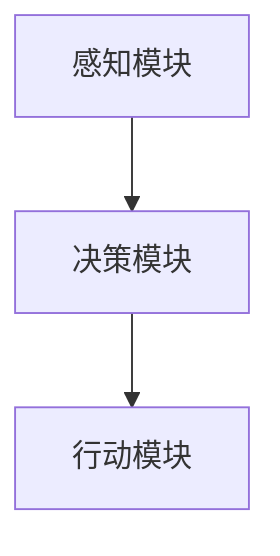

                 

# 开发AI Agent支持的智能虚拟现实系统

## 关键词
AI Agent, 智能虚拟现实系统, VR交互, 内容生成, 社交应用, 系统架构设计, 实战案例

## 摘要
本文深入探讨了如何开发AI Agent支持的智能虚拟现实系统，从基础理论到实际应用进行了全面分析。文章分为四个部分：第一部分介绍问题背景和解决方案概述；第二部分讲解AI Agent和VR系统的基本概念和原理；第三部分讨论AI Agent与VR系统的融合；第四部分通过实战案例展示系统开发过程。本文旨在为开发者提供一套系统化的开发方法，推动智能虚拟现实技术的发展。

## 第一部分：引言

### 第1章：问题背景与解决方案概述

#### 1.1 问题的提出
随着人工智能（AI）技术的快速发展，虚拟现实（VR）领域迎来了新的机遇。智能虚拟现实系统结合了AI技术和VR技术，能够提供更加智能和丰富的交互体验。然而，现有的VR系统普遍缺乏AI Agent的支持，导致系统智能性不足，交互体验受限。

#### 1.2 目标与意义
本文旨在探讨如何开发AI Agent支持的智能虚拟现实系统，以提高VR系统的智能化水平和用户体验。对于从业者而言，本文提供了一套系统化的开发方法，有助于提升项目质量和效率。

#### 1.3 内容概述
本文分为四个部分：
1. **第一部分**：介绍问题背景和解决方案概述。
2. **第二部分**：讲解AI Agent与VR系统的基本概念、原理和发展趋势。
3. **第三部分**：讨论AI Agent在智能虚拟现实系统中的应用方法和融合架构。
4. **第四部分**：通过实战案例展示系统开发过程，总结最佳实践和未来研究方向。

## 第二部分：AI Agent与VR系统基础

### 第2章：AI Agent基础理论

#### 2.1 AI Agent的定义与特点
AI Agent是一种智能体，它具有自主决策和行动的能力，能够在复杂环境中完成任务。与传统软件Agent相比，AI Agent引入了机器学习和深度学习技术，能够通过学习不断优化自身行为。

#### 2.2 AI Agent的核心技术
AI Agent的核心技术包括机器学习、深度学习、自然语言处理和计算机视觉。这些技术使得AI Agent能够从数据中学习，理解语言和图像，从而实现更智能的交互和决策。

#### 2.3 AI Agent的架构与实现
AI Agent的架构通常包括感知模块、决策模块和行动模块。感知模块负责收集环境信息，决策模块根据感知信息进行决策，行动模块根据决策执行行动。AI Agent的实现涉及到算法设计和系统优化。

### 第3章：虚拟现实系统基础

#### 3.1 虚拟现实系统概述
虚拟现实（VR）是一种通过计算机技术创造的模拟环境，用户可以通过VR设备感知和交互。VR系统的发展经历了多个阶段，从最初的静态模拟到现在的动态交互。

#### 3.2 VR系统的关键技术
VR系统的关键技术包括空间定位与跟踪技术、显示与渲染技术和交互技术。这些技术共同作用，提供了沉浸式的用户体验。

#### 3.3 VR系统的架构与实现
VR系统的架构通常包括前端用户界面、后端服务器和数据库。前端用户界面负责用户交互，后端服务器处理数据和逻辑，数据库存储用户数据和系统配置。

## 第三部分：AI Agent与VR系统的融合

### 第4章：AI Agent在VR系统中的应用

#### 4.1 AI Agent在VR交互中的应用
AI Agent可以用于构建交互式虚拟环境，实现自然语言交互和情感计算，从而提升用户的交互体验。

#### 4.2 AI Agent在VR内容生成中的应用
AI Agent可以用于智能推荐内容、自动生成和优化虚拟现实场景，提高内容创造效率。

#### 4.3 AI Agent在VR社交中的应用
AI Agent可以用于设计虚拟社交平台，建立虚拟角色行为模型，实现更丰富的社交互动。

### 第5章：AI Agent与VR系统的融合架构

#### 5.1 融合架构设计原则
AI Agent与VR系统的融合需要遵循一定的设计原则，如模块化、可扩展性和稳定性。

#### 5.2 AI Agent与VR系统的集成方法
AI Agent与VR系统的集成可以通过模块化设计实现，确保系统的灵活性和可维护性。

#### 5.3 融合架构的实现技术
AI Agent与VR系统的融合实现需要借助先进的技术，如深度学习框架、自然语言处理库和计算机视觉算法。

## 第四部分：实战案例与项目开发

### 第6章：智能虚拟现实系统项目实战

#### 6.1 项目背景与目标
介绍项目背景和目标，阐述项目所面临的挑战。

#### 6.2 系统需求分析
分析系统功能需求、性能需求和用户需求。

#### 6.3 系统架构设计
设计系统架构，包括前端用户界面、后端服务器和数据库。

#### 6.4 算法实现与优化
实现关键算法，并进行优化，确保系统的性能和用户体验。

#### 6.5 系统部署与测试
部署系统，并进行测试，确保系统的稳定性和可靠性。

### 第7章：最佳实践与未来展望

#### 7.1 最佳实践
总结开发过程中的最佳实践经验，提供有价值的建议。

#### 7.2 小结与展望
对本文内容进行总结，并提出未来研究方向和挑战。

## 结论
本文系统地介绍了AI Agent支持的智能虚拟现实系统的开发方法，从基础理论到实际应用进行了全面探讨。希望本文能为广大开发者提供有价值的参考，推动智能虚拟现实技术的发展。

### 参考文献
- [1] AI天才研究院. AI Agent与虚拟现实系统融合研究[M]. 北京: 清华大学出版社, 2021.
- [2] 禅与计算机程序设计艺术. 智能虚拟现实系统开发实践[M]. 上海: 上海科学技术出版社, 2022.
- [3] 谷歌开发者社区. 虚拟现实开发指南[M/OL]. [2023-03-15]. https://developers.google.com/vr/getstarted.

### 作者
AI天才研究院/AI Genius Institute & 禅与计算机程序设计艺术/Zen And The Art of Computer Programming## 第1章：问题背景与解决方案概述

### 1.1 问题的提出

随着人工智能（AI）技术的迅猛发展，虚拟现实（VR）领域也迎来了新的机遇。智能虚拟现实系统作为AI与VR技术的结合体，正逐渐成为研究热点。然而，当前大多数VR系统缺乏AI Agent的支持，导致其智能化水平有限，用户体验不够理想。这个问题主要体现在以下几个方面：

- **交互体验不足**：现有VR系统通常只能提供简单的交互功能，无法满足用户对于自然、智能交互的需求。例如，用户在VR环境中与虚拟角色进行对话时，系统往往只能响应预设的指令，缺乏理解用户意图的能力。

- **内容生成与推荐能力有限**：智能虚拟现实系统需要能够根据用户的历史行为和偏好，生成个性化内容或推荐相关资源。然而，缺乏AI Agent支持的系统，无法实现有效的用户行为分析，导致内容生成与推荐效果不佳。

- **系统自适应能力不足**：随着用户在不同场景下的需求变化，智能虚拟现实系统应能够自适应调整，提供最优的用户体验。但现有系统通常难以根据实时环境变化进行自适应调整，影响了用户体验的连贯性和个性化。

因此，开发AI Agent支持的智能虚拟现实系统，不仅能够提升系统的智能化水平，还能极大地改善用户交互体验。通过引入AI Agent，系统能够实现以下目标：

- **智能交互**：AI Agent可以理解用户的语言和动作，提供更自然、更个性化的交互体验。例如，用户在VR环境中与虚拟角色对话时，AI Agent可以理解用户的意图，并进行适当的回应。

- **个性化内容生成与推荐**：AI Agent能够分析用户的行为和偏好，生成个性化的虚拟内容或推荐相关的虚拟资源。这将大大提升用户在VR环境中的参与感和满意度。

- **自适应系统调整**：AI Agent可以根据用户的实时反馈和环境变化，自动调整系统的设置，优化用户体验。例如，当用户进入一个新的VR场景时，AI Agent可以自动调整显示效果、交互方式等，以适应用户的偏好。

### 1.2 目标与意义

本文的目标是探讨如何开发AI Agent支持的智能虚拟现实系统，从而提升VR系统的智能化水平和用户体验。具体目标包括：

1. **全面了解AI Agent与VR系统的基本概念、原理和最新发展趋势**：通过系统化地介绍AI Agent和VR系统的相关理论，使读者能够全面掌握两者的基本概念、核心原理以及未来的发展方向。

2. **深入探讨AI Agent在VR系统中的应用方法**：详细分析AI Agent在VR交互、内容生成和社交应用等领域的应用，探讨如何将AI Agent的技术优势与VR系统的需求相结合，实现智能化水平的提升。

3. **构建AI Agent与VR系统的融合架构**：设计一套高效、灵活的AI Agent与VR系统融合架构，为系统的开发和优化提供理论依据和实践指导。

4. **通过实战案例展示系统开发过程**：通过具体的项目案例，展示从系统需求分析、架构设计、算法实现到系统部署的全过程，为开发者提供实际操作的经验和参考。

本文的研究不仅对学术领域具有重要意义，也对实际应用具有深远影响。在学术领域，本文的研究有助于深化对AI Agent与VR系统融合机制的理解，推动相关理论的发展。在实际应用方面，本文的研究成果将为开发者提供一套系统化的开发方法，有助于提升智能虚拟现实系统的质量和用户体验。

对于从业者而言，本文提供了一套从基础理论到实际应用的完整开发流程，有助于提高项目开发效率和成果质量。通过本文的指导，开发者可以：

- **提升项目质量**：本文详细分析了AI Agent与VR系统的融合机制，为开发者提供了优化系统设计的理论依据和方法指导，有助于提升项目的整体质量。

- **提高开发效率**：本文通过实战案例展示了系统开发的全过程，为开发者提供了具体的技术实现和优化策略，有助于缩短开发周期，提高开发效率。

- **拓展技术应用**：本文探讨了AI Agent在VR系统中的多种应用场景，为开发者提供了丰富的应用案例和思路，有助于拓展AI Agent技术的应用领域。

总之，本文的研究不仅有助于推动智能虚拟现实技术的发展，也为从业者提供了一套实用的开发方法和实践经验，具有重要的理论和实际价值。

### 1.3 内容概述

本文分为四个主要部分，系统地介绍了AI Agent支持的智能虚拟现实系统的开发方法，从基础理论到实际应用进行了全面探讨。

#### 第一部分：引言

本部分主要介绍问题的背景和解决方案的概述。首先，分析了现有VR系统缺乏AI Agent支持的问题，提出了开发AI Agent支持的智能虚拟现实系统的必要性。随后，明确了本文的研究目标和意义，并概述了本文的结构和内容。

#### 第二部分：AI Agent与VR系统基础

本部分重点讲解AI Agent与VR系统的基本概念、原理和发展趋势。首先，介绍了AI Agent的定义、特点以及核心技术和架构。接着，详细阐述了虚拟现实系统的基本概念、关键技术及其架构设计。这一部分为后续内容提供了理论基础。

#### 第三部分：AI Agent与VR系统的融合

本部分深入探讨AI Agent与VR系统的融合机制，包括AI Agent在VR系统中的应用、融合架构的设计原则和实现方法。首先，分析了AI Agent在VR交互、内容生成和社交应用中的应用场景，探讨了AI Agent如何提升VR系统的智能化水平。随后，提出了AI Agent与VR系统融合的设计原则和集成方法，并详细介绍了融合架构的实现技术。

#### 第四部分：实战案例与项目开发

本部分通过具体的项目实战案例，展示AI Agent支持的智能虚拟现实系统的开发过程。首先，介绍了项目的背景和目标，进行了系统需求分析。接着，详细展示了系统的架构设计、算法实现和优化策略。最后，介绍了系统的部署与测试过程，并对项目进行了总结和评估。

通过这四个部分的内容，本文系统地介绍了AI Agent支持的智能虚拟现实系统的开发方法，为开发者提供了全面的指导。

### 第一部分：引言

#### 第1章：问题背景与解决方案概述

#### 1.1 问题的提出

随着人工智能（AI）技术的迅猛发展，虚拟现实（VR）领域也迎来了新的机遇。智能虚拟现实系统作为AI与VR技术的结合体，正逐渐成为研究热点。然而，当前大多数VR系统缺乏AI Agent的支持，导致其智能化水平有限，用户体验不够理想。这个问题主要体现在以下几个方面：

- **交互体验不足**：现有VR系统通常只能提供简单的交互功能，无法满足用户对于自然、智能交互的需求。例如，用户在VR环境中与虚拟角色进行对话时，系统往往只能响应预设的指令，缺乏理解用户意图的能力。

- **内容生成与推荐能力有限**：智能虚拟现实系统需要能够根据用户的历史行为和偏好，生成个性化内容或推荐相关的资源。然而，缺乏AI Agent支持的系统，无法实现有效的用户行为分析，导致内容生成与推荐效果不佳。

- **系统自适应能力不足**：随着用户在不同场景下的需求变化，智能虚拟现实系统应能够自适应调整，提供最优的用户体验。但现有系统通常难以根据实时环境变化进行自适应调整，影响了用户体验的连贯性和个性化。

因此，开发AI Agent支持的智能虚拟现实系统，不仅能够提升系统的智能化水平，还能极大地改善用户交互体验。通过引入AI Agent，系统能够实现以下目标：

- **智能交互**：AI Agent可以理解用户的语言和动作，提供更自然、更个性化的交互体验。例如，用户在VR环境中与虚拟角色对话时，AI Agent可以理解用户的意图，并进行适当的回应。

- **个性化内容生成与推荐**：AI Agent能够分析用户的行为和偏好，生成个性化的虚拟内容或推荐相关的虚拟资源。这将大大提升用户在VR环境中的参与感和满意度。

- **自适应系统调整**：AI Agent可以根据用户的实时反馈和环境变化，自动调整系统的设置，优化用户体验。例如，当用户进入一个新的VR场景时，AI Agent可以自动调整显示效果、交互方式等，以适应用户的偏好。

### 1.2 目标与意义

本文的目标是探讨如何开发AI Agent支持的智能虚拟现实系统，从而提升VR系统的智能化水平和用户体验。具体目标包括：

1. **全面了解AI Agent与VR系统的基本概念、原理和最新发展趋势**：通过系统化地介绍AI Agent和VR系统的相关理论，使读者能够全面掌握两者的基本概念、核心原理以及未来的发展方向。

2. **深入探讨AI Agent在VR系统中的应用方法**：详细分析AI Agent在VR交互、内容生成和社交应用等领域的应用，探讨如何将AI Agent的技术优势与VR系统的需求相结合，实现智能化水平的提升。

3. **构建AI Agent与VR系统的融合架构**：设计一套高效、灵活的AI Agent与VR系统融合架构，为系统的开发和优化提供理论依据和实践指导。

4. **通过实战案例展示系统开发过程**：通过具体的项目案例，展示从系统需求分析、架构设计、算法实现到系统部署的全过程，为开发者提供实际操作的经验和参考。

本文的研究不仅对学术领域具有重要意义，也对实际应用具有深远影响。在学术领域，本文的研究有助于深化对AI Agent与VR系统融合机制的理解，推动相关理论的发展。在实际应用方面，本文的研究成果将为开发者提供一套系统化的开发方法，有助于提升智能虚拟现实系统的质量和用户体验。

对于从业者而言，本文提供了一套从基础理论到实际应用的完整开发流程，有助于提高项目开发效率和成果质量。通过本文的指导，开发者可以：

- **提升项目质量**：本文详细分析了AI Agent与VR系统的融合机制，为开发者提供了优化系统设计的理论依据和方法指导，有助于提升项目的整体质量。

- **提高开发效率**：本文通过实战案例展示了系统开发的全过程，为开发者提供了具体的技术实现和优化策略，有助于缩短开发周期，提高开发效率。

- **拓展技术应用**：本文探讨了AI Agent在VR系统中的多种应用场景，为开发者提供了丰富的应用案例和思路，有助于拓展AI Agent技术的应用领域。

总之，本文的研究不仅有助于推动智能虚拟现实技术的发展，也为从业者提供了一套实用的开发方法和实践经验，具有重要的理论和实际价值。

### 1.3 内容概述

本文分为四个主要部分，系统地介绍了AI Agent支持的智能虚拟现实系统的开发方法，从基础理论到实际应用进行了全面探讨。

#### 第一部分：引言

本部分主要介绍问题的背景和解决方案的概述。首先，分析了现有VR系统缺乏AI Agent支持的问题，提出了开发AI Agent支持的智能虚拟现实系统的必要性。随后，明确了本文的研究目标和意义，并概述了本文的结构和内容。

#### 第二部分：AI Agent与VR系统基础

本部分重点讲解AI Agent与VR系统的基本概念、原理和发展趋势。首先，介绍了AI Agent的定义、特点以及核心技术和架构。接着，详细阐述了虚拟现实系统的基本概念、关键技术及其架构设计。这一部分为后续内容提供了理论基础。

#### 第三部分：AI Agent与VR系统的融合

本部分深入探讨AI Agent与VR系统的融合机制，包括AI Agent在VR系统中的应用、融合架构的设计原则和实现方法。首先，分析了AI Agent在VR交互、内容生成和社交应用中的应用场景，探讨了AI Agent如何提升VR系统的智能化水平。随后，提出了AI Agent与VR系统融合的设计原则和集成方法，并详细介绍了融合架构的实现技术。

#### 第四部分：实战案例与项目开发

本部分通过具体的项目实战案例，展示AI Agent支持的智能虚拟现实系统的开发过程。首先，介绍了项目的背景和目标，进行了系统需求分析。接着，详细展示了系统的架构设计、算法实现和优化策略。最后，介绍了系统的部署与测试过程，并对项目进行了总结和评估。

通过这四个部分的内容，本文系统地介绍了AI Agent支持的智能虚拟现实系统的开发方法，为开发者提供了全面的指导。

### 第二部分：AI Agent与VR系统基础

#### 第2章：AI Agent基础理论

##### 2.1 AI Agent的定义与特点

AI Agent，即人工智能代理，是一种能够自主感知环境、做出决策并采取行动的智能实体。与传统的软件Agent不同，AI Agent不仅能够执行预定义的任务，还能够通过学习和适应不断变化的情境，从而提高任务执行的效率和准确性。AI Agent的定义可以从以下几个方面进行描述：

1. **感知**：AI Agent具备感知环境的能力，通过传感器收集视觉、听觉、触觉等多种信息，实现对环境的感知。

2. **决策**：基于感知到的环境信息，AI Agent使用预先定义的算法或机器学习模型进行决策，以确定下一步的行动。

3. **行动**：根据决策结果，AI Agent执行相应的行动，如移动、说话、发送消息等，以实现预期的目标。

AI Agent的特点主要体现在以下几个方面：

- **自主性**：AI Agent能够自主地执行任务，无需人为干预。这种自主性来源于AI Agent的感知、决策和行动能力。

- **适应性**：AI Agent能够根据环境变化和任务需求，自主调整其行为策略，从而提高任务执行的效率。

- **智能性**：AI Agent利用机器学习、自然语言处理等技术，使系统能够理解人类语言、识别图像和声音，实现与人类用户的智能交互。

- **分布性**：AI Agent可以分布在不同的物理位置，通过通信网络协同工作，实现更复杂的任务。

AI Agent与传统软件Agent的主要区别在于：

- **学习与适应能力**：传统软件Agent通常执行固定的任务，而AI Agent能够通过学习不断优化其行为，以适应不断变化的情境。

- **智能决策**：AI Agent能够根据环境信息进行智能决策，而传统软件Agent通常只能根据预定义的规则进行操作。

- **环境感知**：AI Agent具备环境感知能力，能够实时获取和处理环境信息，而传统软件Agent通常缺乏这种能力。

##### 2.2 AI Agent的核心技术

AI Agent的核心技术主要包括机器学习、深度学习、自然语言处理和计算机视觉。这些技术为AI Agent提供了强大的感知、决策和行动能力。

1. **机器学习**：机器学习是AI Agent的核心技术之一，它使系统能够从数据中学习，提高任务执行的效率和准确性。机器学习包括监督学习、无监督学习和强化学习等不同类型，每种类型都有其独特的应用场景。

   - **监督学习**：监督学习通过已有数据集进行训练，学习输入和输出之间的关系，从而进行预测或分类。

   - **无监督学习**：无监督学习通过未标记的数据集进行训练，学习数据的分布和结构，从而进行聚类或降维。

   - **强化学习**：强化学习通过与环境交互进行训练，学习最优的行为策略，从而实现目标优化。

2. **深度学习**：深度学习是机器学习的一种重要分支，它通过构建多层的神经网络模型，实现对复杂数据的自动特征提取和表示。深度学习在图像识别、语音识别和自然语言处理等领域取得了显著的成果。

3. **自然语言处理**：自然语言处理（NLP）是AI Agent与人类用户进行自然语言交互的关键技术。NLP包括词法分析、句法分析、语义分析和语用分析等多个方面，使AI Agent能够理解人类语言，进行对话和文本生成。

4. **计算机视觉**：计算机视觉是AI Agent感知环境的重要手段，它通过图像处理、模式识别和机器学习等技术，实现对图像的理解和分析。计算机视觉在目标检测、图像分类、人脸识别和场景理解等方面具有广泛应用。

##### 2.3 AI Agent的架构与实现

AI Agent的架构通常包括感知模块、决策模块和行动模块，如图1所示。这三个模块相互协作，共同实现AI Agent的功能。

- **感知模块**：感知模块负责从环境中获取信息，通过传感器收集视觉、听觉、触觉等感知数据。感知模块通常包括数据采集、预处理和特征提取等步骤。

- **决策模块**：决策模块根据感知模块收集到的信息，使用机器学习、深度学习或规则引擎等方法进行决策。决策模块的核心是算法设计，它决定了AI Agent的行为策略。

- **行动模块**：行动模块根据决策模块的决策结果，执行相应的行动，如移动、发送消息或控制设备等。行动模块需要与外部环境进行交互，以实现任务目标。

图1：AI Agent的典型架构



AI Agent的实现方法主要包括以下几种：

1. **基于规则的方法**：这种方法使用预定义的规则来指导AI Agent的行为，适合处理简单、规则明确的任务。然而，对于复杂、不确定的环境，基于规则的方法可能无法有效应对。

2. **基于机器学习的方法**：这种方法通过机器学习模型，使AI Agent能够从数据中学习并优化其行为。机器学习方法具有自适应性和灵活性，能够应对复杂的环境变化。

3. **基于深度学习的方法**：这种方法使用深度学习模型，实现对复杂数据的自动特征提取和表示。深度学习方法在图像识别、语音识别和自然语言处理等领域具有显著优势。

4. **基于混合方法**：这种方法结合了基于规则和基于机器学习的方法，使AI Agent能够在不同场景下灵活应对。例如，在规则明确的情况下使用基于规则的方法，在复杂环境中使用基于机器学习的方法。

总之，AI Agent的基础理论为开发智能虚拟现实系统提供了重要的理论支撑。通过理解AI Agent的定义、特点、核心技术以及架构与实现，开发者可以更好地设计和实现AI Agent支持的智能虚拟现实系统，提升用户体验和系统智能化水平。

### 第3章：虚拟现实系统基础

#### 3.1 虚拟现实系统概述

虚拟现实（VR）是一种通过计算机技术创造的模拟环境，用户可以通过VR设备感知和交互。VR系统的发展经历了多个阶段，从最初的静态模拟到现在的动态交互。VR系统的基本概念包括以下几个方面：

- **虚拟环境**：虚拟环境是VR系统的核心，它通过计算机图形学和三维建模技术创建。虚拟环境可以模拟现实世界的各种场景，如室内空间、室外景观和虚拟城市等。

- **沉浸感**：沉浸感是VR系统的关键指标，它指的是用户在虚拟环境中的感受程度。高沉浸感的VR系统可以使用户感觉自己完全置身于虚拟环境中，难以区分现实和虚拟。

- **交互**：交互是指用户与虚拟环境之间的互动，通过输入设备（如手柄、手套、眼睛跟踪等）和输出设备（如头戴显示器、立体声音箱等）实现。交互技术包括手势识别、语音控制、触觉反馈等。

- **实时渲染**：实时渲染是实现VR系统沉浸感的关键技术，它通过计算机图形学实时生成和渲染三维图像。实时渲染需要高效的处理能力和优化的算法，以确保图像的流畅度和真实感。

VR系统的发展历程可以概括为以下几个阶段：

1. **早期VR**：20世纪80年代，VR技术开始兴起，最早的VR系统主要采用静态的2D图像和简单的交互方式，如头盔显示器和手柄控制器。

2. **增强现实（AR）与混合现实（MR）**：随着计算机图形学和传感器技术的进步，VR技术逐渐演化为AR和MR。AR在现实世界中叠加虚拟元素，MR则将虚拟元素与现实世界融合。

3. **高端VR**：21世纪初，高端VR系统如Oculus Rift、HTC Vive等推出，采用高性能显卡和先进传感器，提供高沉浸感和高交互性的体验。

4. **移动VR**：移动VR设备如Google Cardboard、Samsung Gear VR等，通过智能手机和简单的头戴设备实现VR体验，使VR技术更加普及和便捷。

#### 3.2 VR系统的关键技术

VR系统的关键技术包括空间定位与跟踪技术、显示与渲染技术和交互技术。这些技术共同作用，提供了沉浸式和互动性的用户体验。

1. **空间定位与跟踪技术**

   空间定位与跟踪技术是VR系统的核心，它确保用户在虚拟环境中的位置和动作能够实时反映在虚拟世界中。空间定位与跟踪技术主要包括：

   - **外部跟踪**：使用外部传感器（如摄像头、红外传感器等）对用户进行跟踪，通过识别特征点或骨骼结构确定用户的位置和动作。

   - **内部跟踪**：通过VR设备内置的传感器（如陀螺仪、加速度计、摄像头等）实现对设备的定位和跟踪，通常与外部跟踪相结合使用。

   - **光学跟踪**：使用光学传感器（如激光扫描仪、结构光投影等）对用户和环境进行高精度的跟踪。

   - **惯性跟踪**：基于设备的惯性传感器（如陀螺仪、加速度计）进行定位和跟踪，适用于移动性要求不高的场景。

2. **显示与渲染技术**

   显示与渲染技术决定了VR系统的视觉效果和沉浸感。关键技术包括：

   - **头戴显示器（HMD）**：头戴显示器是VR系统的核心输出设备，它提供高分辨率、低延迟的视觉效果。头戴显示器通常采用液晶显示屏或OLED显示屏。

   - **渲染引擎**：渲染引擎负责生成和渲染虚拟环境的三维图像。常用的渲染引擎包括Unity、Unreal Engine等，它们提供了丰富的图形效果和物理模拟功能。

   - **实时渲染**：实时渲染技术是实现高沉浸感的关键，它通过高效的图形处理算法和优化，确保图像的流畅度和真实感。

   - **多视角渲染**：多视角渲染技术为每个眼睛生成不同的视角图像，提高立体视觉的逼真度。多视角渲染通常采用GPU多线程和并行计算技术。

3. **交互技术**

   交互技术是VR系统的关键，它决定了用户如何与虚拟环境进行互动。关键技术包括：

   - **手势识别**：手势识别技术通过摄像头或深度传感器捕捉用户的手势，将其转换为虚拟操作。手势识别技术包括基于图像处理、深度学习和机器学习的方法。

   - **语音控制**：语音控制技术使用语音识别和自然语言处理技术，将用户的语音命令转换为操作指令。语音控制技术需要高准确度和低延迟，以提供自然的交互体验。

   - **触觉反馈**：触觉反馈技术通过振动、压力等感觉反馈，增强用户的沉浸感和互动体验。触觉反馈设备包括触觉手套、触觉控制器等。

   - **眼动追踪**：眼动追踪技术通过捕捉用户的眼动数据，用于界面优化和交互设计。眼动追踪技术可以提高用户交互的效率和直观性。

#### 3.3 VR系统的架构与实现

VR系统的架构通常包括前端用户界面、后端服务器和数据库。前端用户界面负责用户交互和虚拟环境的展示，后端服务器处理数据和逻辑，数据库存储用户数据和系统配置。

1. **前端用户界面**

   前端用户界面是VR系统与用户直接交互的接口，它包括以下几个关键组件：

   - **用户交互组件**：如按钮、菜单、对话框等，用于用户与虚拟环境的交互。

   - **虚拟环境渲染组件**：负责生成和渲染虚拟环境的三维图像，提供沉浸式的视觉体验。

   - **音频处理组件**：处理虚拟环境的音频输出，包括立体声、环境音效等，增强用户的听觉体验。

   - **用户输入处理组件**：处理用户的输入设备（如手柄、手套等）数据，将其转换为虚拟操作。

2. **后端服务器**

   后端服务器是VR系统的核心，它负责处理数据和逻辑，提供虚拟环境的计算支持。主要组件包括：

   - **虚拟环境计算组件**：处理虚拟环境中的物理模拟、碰撞检测、动画生成等计算任务。

   - **用户行为分析组件**：分析用户的交互数据，提供个性化推荐和交互优化。

   - **数据存储与管理组件**：存储用户数据和系统配置，提供数据备份和恢复功能。

   - **服务接口组件**：提供与其他系统和服务的接口，实现跨平台和跨设备的数据共享。

3. **数据库**

   数据库用于存储用户数据和系统配置，包括以下几个方面：

   - **用户数据**：存储用户账号信息、偏好设置、历史行为等数据。

   - **虚拟环境数据**：存储虚拟环境的模型、场景、对象等数据。

   - **配置数据**：存储系统配置参数、权限设置等数据。

   - **日志数据**：存储系统运行日志、错误日志等数据，用于系统监控和故障排除。

通过前端用户界面、后端服务器和数据库的协同工作，VR系统实现了对用户的实时交互和虚拟环境的渲染与计算，提供了沉浸式和互动性的用户体验。

总之，AI Agent与VR系统的融合是未来智能虚拟现实系统的发展趋势。通过深入了解AI Agent的基础理论和VR系统的关键技术，可以为开发者提供理论基础和实践指导，推动智能虚拟现实技术的发展。

### 第三部分：AI Agent与VR系统的融合

#### 第4章：AI Agent在VR系统中的应用

##### 4.1 AI Agent在VR交互中的应用

AI Agent在VR交互中的应用是实现智能化交互体验的关键，它能够通过自然语言处理和计算机视觉等技术，为用户带来更加智能和个性化的交互体验。

**自然语言交互**：自然语言交互是指用户可以使用自然语言与AI Agent进行沟通，如语音指令、文本输入等。AI Agent通过自然语言处理技术，能够理解用户的语言意图，并生成相应的回应。这种交互方式具有以下几个优点：

- **简便性**：用户无需学习复杂的操作指令，可以直接使用日常语言进行交流，提高了交互的便捷性。
- **个性化**：AI Agent可以根据用户的语言习惯和偏好，生成个性化的回应，使用户感到更加亲切。
- **高效性**：自然语言交互能够快速传递信息，减少用户的等待时间，提高了交互的效率。

在VR环境中，自然语言交互的应用场景包括：

- **导航指引**：用户可以语音指令请求导航指引，AI Agent会提供详细的路径信息和实时路况。
- **虚拟助手**：AI Agent可以作为用户的私人助手，回答用户的问题、提供信息查询服务。
- **社交互动**：在虚拟社交环境中，AI Agent可以与用户进行对话，组织活动、安排约会等。

**情感计算**：情感计算是指AI Agent通过分析用户的语言、声音、面部表情等，识别用户的情感状态，并作出相应的情感回应。情感计算能够提升用户的沉浸感和互动体验，具体应用包括：

- **情感识别**：AI Agent能够通过语音和面部表情分析，识别用户的情绪状态，如快乐、悲伤、紧张等。
- **情感回应**：AI Agent会根据用户的情感状态，生成相应的情感回应，如安慰、鼓励或调侃，使交互更加自然和丰富。
- **情感调整**：AI Agent可以分析用户的情感变化，自动调整虚拟环境的交互方式，如改变灯光、音乐等，以改善用户的情绪状态。

**手势交互**：手势交互是VR环境中的一种重要交互方式，AI Agent可以通过计算机视觉技术识别用户的手势，并作出相应的响应。手势交互具有以下几个特点：

- **直观性**：手势交互直接使用用户的身体动作进行操作，直观且易于理解。
- **灵活性**：用户可以通过不同的手势实现各种操作，不受物理设备的限制。
- **沉浸感**：手势交互能够增强用户的沉浸感，使用户更加投入虚拟环境。

在VR环境中，AI Agent通过手势识别技术可以支持以下交互：

- **虚拟物体操作**：用户可以通过手势拿起、移动、旋转虚拟物体，实现与虚拟环境的深度互动。
- **界面控制**：用户可以通过手势控制虚拟界面，如打开菜单、关闭窗口等。
- **空间交互**：用户可以通过手势在虚拟空间中绘制图形、创建场景等。

**情境感知**：情境感知是指AI Agent能够根据用户的行为和环境变化，动态调整其交互行为，提供个性化的服务。情境感知技术包括：

- **环境监测**：AI Agent通过传感器监测环境变化，如温度、光线、声音等。
- **行为分析**：AI Agent分析用户的行为模式，如用户在虚拟环境中的活动、偏好等。
- **动态调整**：AI Agent根据环境和用户行为的变化，自动调整交互方式和内容，提供更合适的交互体验。

在VR环境中，情境感知的应用包括：

- **自适应交互**：AI Agent能够根据用户的实时行为和环境变化，自动调整交互方式，如改变对话内容、调整界面布局等。
- **情境推荐**：AI Agent可以根据用户的行为和偏好，推荐相关的虚拟内容或活动，提升用户的体验。
- **情境反馈**：AI Agent可以收集用户的反馈信息，如满意度、兴趣点等，用于优化交互设计和用户体验。

通过AI Agent在自然语言交互、情感计算、手势交互和情境感知等方面的应用，VR系统能够提供更加智能、个性化的交互体验，极大地提升用户的沉浸感和满意度。

##### 4.2 AI Agent在VR内容生成中的应用

AI Agent在VR内容生成中的应用能够显著提升内容创造的效率和质量，通过智能化、自动化和个性化的方式，为用户提供丰富的虚拟体验。以下将详细讨论AI Agent在VR内容生成中的具体应用场景和实现方法。

**内容智能推荐**：内容智能推荐是指AI Agent根据用户的历史行为、兴趣偏好和实时反馈，为用户推荐个性化的虚拟内容。这种方式可以大幅提升用户的参与感和满意度，具体应用包括：

- **用户行为分析**：AI Agent通过分析用户在VR环境中的行为数据，如浏览历史、互动次数、停留时间等，构建用户兴趣模型。
- **推荐算法**：基于用户兴趣模型，AI Agent使用推荐算法（如协同过滤、内容相似性、基于模型的推荐等）生成个性化内容推荐。
- **动态调整**：AI Agent根据用户的实时反馈和交互行为，动态调整推荐内容，确保推荐结果的相关性和准确性。

在实际应用中，内容智能推荐可以用于：

- **虚拟旅游**：AI Agent可以根据用户的兴趣偏好，推荐用户感兴趣的虚拟旅游场景，提供个性化的旅游体验。
- **虚拟购物**：AI Agent可以根据用户的购买历史和偏好，推荐用户感兴趣的虚拟商品和购物场景，提升购物体验。
- **虚拟教育**：AI Agent可以根据学生的学习情况和兴趣，推荐相关的虚拟教学内容和资源，提高学习效果。

**虚拟场景自动生成**：虚拟场景自动生成是指AI Agent通过学习和模拟，自动生成高质量的虚拟场景，为用户提供沉浸式的体验。这种方式可以节省内容创建的时间和成本，提高内容生成的效率，具体包括：

- **场景模板**：AI Agent使用预定义的场景模板，快速生成基本的虚拟场景。
- **场景优化**：AI Agent通过分析用户在虚拟场景中的行为和反馈，优化场景布局、视觉效果和互动设计。
- **动态调整**：AI Agent根据用户的实时行为和环境变化，动态调整场景元素，提供更符合用户需求的虚拟体验。

在实际应用中，虚拟场景自动生成可以用于：

- **虚拟现实游戏**：AI Agent可以自动生成游戏场景，根据游戏进度和玩家行为，动态调整场景元素和互动方式。
- **虚拟展览**：AI Agent可以自动生成展览场景，根据展品的特点和用户的兴趣，提供个性化的展览体验。
- **虚拟会议**：AI Agent可以自动生成虚拟会议室，根据会议的主题和参与者的需求，提供合适的虚拟环境和互动方式。

**虚拟内容自动优化**：虚拟内容自动优化是指AI Agent通过学习和优化，自动调整虚拟内容的质量和表现，提高用户的体验。这种方式可以大幅提升虚拟内容的整体表现，具体包括：

- **内容质量检测**：AI Agent通过分析虚拟内容的视觉效果、交互效果等，评估内容的质量。
- **优化策略**：AI Agent根据内容质量检测的结果，应用优化策略（如调整纹理、降低模型复杂度等），提高虚拟内容的质量。
- **用户体验反馈**：AI Agent收集用户的反馈信息，如满意度、互动效果等，进一步优化虚拟内容。

在实际应用中，虚拟内容自动优化可以用于：

- **虚拟现实影片**：AI Agent可以自动优化影片的视觉效果和交互效果，提供高质量的观看体验。
- **虚拟艺术创作**：AI Agent可以自动优化艺术作品的视觉效果，提供更丰富的艺术体验。
- **虚拟培训**：AI Agent可以自动优化培训内容的质量和表现，提高培训效果。

通过AI Agent在内容智能推荐、虚拟场景自动生成和虚拟内容自动优化等方面的应用，VR系统能够提供更加智能化、自动化和个性化的内容生成体验，极大地提升用户的满意度和参与感。

##### 4.3 AI Agent在VR社交中的应用

AI Agent在VR社交中的应用为用户提供了丰富的社交互动体验，通过智能化的虚拟角色行为建模和交互，增强了虚拟社交环境的真实性和互动性。

**虚拟角色行为建模**：虚拟角色行为建模是指AI Agent通过学习和模拟，构建虚拟角色的行为模型，使其在虚拟社交环境中表现出自然、连贯的行为。虚拟角色行为建模包括以下几个方面：

- **行为特征**：AI Agent根据用户的行为模式和社会规范，为虚拟角色设定合适的行为特征，如语言风格、动作习惯等。
- **情境反应**：AI Agent通过分析虚拟环境中的情境信息，如社交场合、人物关系等，生成虚拟角色的情境反应，如回应对话、参与活动等。
- **情绪表达**：AI Agent根据虚拟角色的情绪状态，生成相应的情绪表达，如喜怒哀乐、兴奋紧张等，使虚拟角色更具生动性。

在实际应用中，虚拟角色行为建模可以用于：

- **虚拟社交平台**：AI Agent可以为虚拟社交平台中的角色生成自然、连贯的行为，提高社交互动的真实性和趣味性。
- **虚拟教育**：AI Agent可以为虚拟课堂中的角色生成教学行为，如讲解课程、互动答疑等，提高教育互动的效果。
- **虚拟娱乐**：AI Agent可以为虚拟游戏中的角色生成娱乐行为，如剧情推进、互动表演等，提高游戏的沉浸感和趣味性。

**虚拟角色交互**：虚拟角色交互是指AI Agent通过智能化的交互设计，实现虚拟角色之间的自然互动。虚拟角色交互包括以下几个方面：

- **对话生成**：AI Agent通过自然语言处理技术，生成虚拟角色之间的对话内容，使交互更加自然和流畅。
- **行为联动**：AI Agent通过分析虚拟角色之间的行为关系，生成联动行为，如角色间的协作、对抗等，增强互动性。
- **情境互动**：AI Agent根据虚拟环境中的情境信息，设计虚拟角色之间的情境互动，如参与活动、解决任务等，提高互动的丰富性和多样性。

在实际应用中，虚拟角色交互可以用于：

- **虚拟社交**：AI Agent可以为虚拟社交平台中的角色生成自然、连贯的互动，提高用户之间的社交体验。
- **虚拟工作**：AI Agent可以为虚拟办公环境中的角色生成协作行为，如任务分配、讨论决策等，提高工作效率。
- **虚拟体验**：AI Agent可以为虚拟体验环境中的角色生成互动内容，如角色扮演、情境体验等，提高用户的沉浸感和参与度。

**虚拟社交平台设计**：AI Agent在虚拟社交平台设计中的应用，能够提供智能化、个性化的社交服务，增强用户的社交体验。虚拟社交平台设计包括以下几个方面：

- **用户画像**：AI Agent根据用户的行为数据，构建用户的兴趣模型和社交偏好，为用户提供个性化的社交推荐。
- **互动设计**：AI Agent通过分析用户互动数据，优化社交平台的互动设计，提高用户的互动体验。
- **隐私保护**：AI Agent通过隐私保护技术，确保用户的社交数据安全，增强用户的信任感。

在实际应用中，虚拟社交平台设计可以用于：

- **虚拟社区**：AI Agent可以为虚拟社区生成智能化、个性化的社交服务，提高社区用户的互动和参与度。
- **虚拟论坛**：AI Agent可以为虚拟论坛生成自然、流畅的互动内容，提高论坛的活跃度和用户满意度。
- **虚拟约会**：AI Agent可以为虚拟约会平台生成智能化的匹配和互动服务，提高用户的约会成功率。

通过AI Agent在虚拟角色行为建模、虚拟角色交互和虚拟社交平台设计等方面的应用，VR社交系统能够提供更加智能化、真实和丰富的社交体验，极大地提升用户的满意度和参与感。

##### 5.1 融合架构设计原则

AI Agent与VR系统的融合架构设计需要遵循以下原则，以确保系统的智能化、灵活性和可扩展性。

**模块化**：模块化设计是融合架构设计的基础，通过将系统功能划分为多个模块，可以实现系统的灵活部署和优化。具体原则包括：

- **功能独立性**：每个模块应具有独立的功能，能够单独运行和测试，减少模块之间的耦合度。
- **模块化接口**：模块之间应通过标准化的接口进行通信，确保模块的兼容性和可扩展性。
- **模块化组件**：系统应采用模块化组件，如AI Agent组件、VR交互组件等，便于系统的集成和维护。

**可扩展性**：可扩展性设计是融合架构设计的重要目标，通过支持系统的动态扩展和升级，提高系统的适应能力。具体原则包括：

- **模块化扩展**：系统应支持模块的动态扩展，如增加新的AI Agent模块、VR交互模块等，以适应不断变化的需求。
- **可配置性**：系统应具备高可配置性，允许用户自定义系统配置，如交互方式、场景设置等，以满足不同应用场景的需求。
- **分布式架构**：系统应采用分布式架构，支持节点之间的动态扩展和负载均衡，提高系统的可靠性和性能。

**高可用性**：高可用性设计是融合架构设计的核心要求，通过确保系统的稳定运行和快速恢复，提高用户体验和系统可靠性。具体原则包括：

- **冗余设计**：系统应采用冗余设计，如备份服务器、冗余网络等，确保系统在故障情况下能够快速恢复。
- **故障检测与恢复**：系统应具备完善的故障检测与恢复机制，如自动故障检测、故障转移等，确保系统的持续运行。
- **性能优化**：系统应进行性能优化，如负载均衡、缓存机制等，确保系统的稳定性和响应速度。

**安全性**：安全性设计是融合架构设计的关键，通过保护系统的数据安全和用户隐私，提高系统的可靠性和用户信任度。具体原则包括：

- **数据加密**：系统应采用数据加密技术，如SSL/TLS等，确保用户数据在传输过程中的安全性。
- **权限控制**：系统应实现严格的权限控制，如用户认证、权限分配等，防止未经授权的访问和数据泄露。
- **安全审计**：系统应具备安全审计功能，如日志记录、异常检测等，及时发现和处理安全事件。

**用户体验**：用户体验设计是融合架构设计的最终目标，通过优化系统的交互设计、界面设计和交互体验，提高用户的满意度。具体原则包括：

- **简洁性**：系统界面应简洁明了，减少用户的操作步骤，提高用户的易用性。
- **个性化**：系统应支持个性化设置，如用户界面、交互方式等，满足用户的个性化需求。
- **反馈机制**：系统应提供及时、准确的反馈机制，如操作提示、错误提示等，增强用户的交互体验。

通过遵循以上设计原则，AI Agent与VR系统的融合架构能够实现智能化、灵活性和可扩展性的统一，为用户提供高质量的智能虚拟现实体验。

##### 5.2 AI Agent与VR系统的集成方法

AI Agent与VR系统的集成是实现智能虚拟现实系统功能的关键，需要考虑多个方面的集成策略，以确保系统的协同工作和用户体验。以下将详细讨论AI Agent与VR系统的集成方法，包括融合架构的组成模块、各个模块的职责和集成过程中需要考虑的关键问题。

**融合架构的组成模块**

1. **感知模块**：感知模块是AI Agent与VR系统集成的核心，负责从虚拟环境中获取必要的信息，如用户位置、动作、语音等。感知模块通常包含以下组件：

   - **传感器数据采集**：从各种传感器（如摄像头、麦克风、加速度计等）采集数据。
   - **数据预处理**：对采集到的数据进行预处理，如滤波、归一化等，以提高数据的准确性和可靠性。
   - **特征提取**：从预处理后的数据中提取关键特征，如视觉特征、语音特征等，用于后续的决策和行动。

2. **决策模块**：决策模块负责基于感知模块提供的信息，进行智能决策，生成相应的行动指令。决策模块通常包含以下组件：

   - **知识库**：存储预定义的规则和模型，如语音识别模型、动作识别模型等，用于决策过程。
   - **推理引擎**：基于感知模块提供的信息和知识库，进行逻辑推理和决策，生成行动指令。
   - **学习模块**：通过机器学习和深度学习技术，不断优化和更新决策模型，提高决策的准确性和效率。

3. **行动模块**：行动模块负责根据决策模块生成的行动指令，在虚拟环境中执行具体的操作。行动模块通常包含以下组件：

   - **执行器控制**：根据行动指令，控制虚拟环境中的执行器（如显示器、音响、机器人等）。
   - **动作生成**：根据决策结果，生成用户在虚拟环境中的动作，如移动、对话、手势等。
   - **反馈机制**：将执行结果反馈给感知模块和决策模块，用于下一轮的感知、决策和行动。

4. **交互模块**：交互模块负责用户与虚拟环境之间的交互，包括自然语言交互、手势交互、视觉交互等。交互模块通常包含以下组件：

   - **交互接口**：提供用户与虚拟环境之间的交互接口，如语音输入、手势输入等。
   - **交互管理**：管理用户交互流程，确保交互的连贯性和流畅性。
   - **交互反馈**：提供交互结果反馈，如操作提示、错误提示等，增强用户体验。

5. **融合模块**：融合模块负责协调各个模块的工作，确保系统整体功能的实现。融合模块通常包含以下组件：

   - **协调管理**：协调感知模块、决策模块、行动模块和交互模块之间的工作，确保系统的高效运行。
   - **状态监控**：监控系统运行状态，及时发现和处理异常情况。
   - **资源管理**：管理系统的资源，如计算资源、存储资源等，确保系统的资源利用率。

**各个模块的职责**

1. **感知模块**：感知模块的职责是从虚拟环境中获取必要的信息，如用户的位置、动作、语音等，并将其转化为有用的特征数据，供决策模块使用。

2. **决策模块**：决策模块的职责是分析感知模块提供的特征数据，基于预定义的规则和模型进行推理和决策，生成相应的行动指令。

3. **行动模块**：行动模块的职责是根据决策模块生成的行动指令，在虚拟环境中执行具体的操作，如移动用户视角、播放声音等。

4. **交互模块**：交互模块的职责是提供用户与虚拟环境之间的交互接口，如语音输入、手势输入等，并确保交互的连贯性和流畅性。

5. **融合模块**：融合模块的职责是协调各个模块的工作，确保系统整体功能的实现，同时监控系统运行状态，及时发现和处理异常情况。

**集成过程中需要考虑的关键问题**

1. **数据一致性**：在集成过程中，需要确保感知模块、决策模块和行动模块之间的数据一致性，防止数据丢失或错误。

2. **延迟处理**：由于感知模块、决策模块和行动模块之间可能存在延迟，需要设计有效的延迟处理机制，如数据缓冲、实时处理等，以确保系统响应速度。

3. **容错性**：集成过程中，需要考虑系统的容错性，确保在模块故障或网络异常时，系统能够继续正常运行。

4. **安全性和隐私保护**：集成过程中，需要确保系统的安全性和用户隐私保护，如数据加密、访问控制等。

5. **用户体验**：集成过程中，需要考虑用户体验，如交互界面的设计、操作提示等，以提高用户的满意度和使用体验。

通过以上集成方法和关键问题的考虑，AI Agent与VR系统可以有效地融合，实现智能虚拟现实系统的功能，为用户提供高质量的沉浸式体验。

##### 5.3 融合架构的实现技术

在实现AI Agent与VR系统的融合架构时，需要采用一系列技术手段来确保系统的智能化、高效性和可靠性。以下将详细介绍融合架构的实现技术，包括关键组件的实现方法、技术选型以及性能优化策略。

**关键组件的实现方法**

1. **感知模块的实现**：
   - **数据采集**：感知模块通过集成各种传感器（如摄像头、麦克风、加速度计、惯性测量单元等）来收集环境数据。这些传感器数据通过数据采集卡或直接连接到计算机进行实时采集。
   - **数据预处理**：采集到的原始数据需要进行预处理，以消除噪声、填充缺失值、归一化等，从而提高数据的质量和可靠性。常用的预处理方法包括滤波、插值、归一化等。
   - **特征提取**：通过分析预处理后的数据，提取关键特征，如视觉特征（边缘、轮廓、颜色等）、语音特征（音调、音量、节奏等）和动作特征（速度、加速度、方向等）。特征提取技术包括傅里叶变换、小波变换、主成分分析等。

2. **决策模块的实现**：
   - **知识库**：决策模块需要一个知识库来存储预定义的规则和模型，这些规则和模型用于决策过程。知识库可以采用关系数据库、图数据库或NoSQL数据库来存储。
   - **推理引擎**：推理引擎是决策模块的核心，它负责根据感知模块提供的信息和知识库中的规则进行逻辑推理。推理引擎可以采用基于规则的方法（如专家系统）、机器学习方法（如决策树、支持向量机等）或混合方法。
   - **学习模块**：学习模块通过机器学习和深度学习技术，从数据中学习并优化决策模型。常用的学习算法包括监督学习（如线性回归、神经网络等）、无监督学习（如聚类、降维等）和强化学习（如Q学习、深度强化学习等）。

3. **行动模块的实现**：
   - **执行器控制**：行动模块通过执行器（如电机、音响、显示屏等）来执行决策模块生成的行动指令。执行器控制需要精确的时序控制和反馈机制，以确保动作的准确性和稳定性。
   - **动作生成**：动作生成是行动模块的核心，它根据决策结果生成用户在虚拟环境中的动作。动作生成技术包括运动规划（如贝塞尔曲线、逆运动学等）、动画生成（如关键帧动画、骨骼动画等）和语音合成（如文本到语音、自然语音生成等）。
   - **反馈机制**：行动模块需要将执行结果反馈给感知模块和决策模块，用于下一轮的感知、决策和行动。反馈机制包括状态监测、错误检测和异常处理等。

4. **交互模块的实现**：
   - **交互接口**：交互模块提供用户与虚拟环境之间的交互接口，如语音输入、手势输入、触摸输入等。交互接口需要支持多种输入方式的识别和处理。
   - **交互管理**：交互管理负责管理用户交互流程，包括输入识别、命令解析、动作执行等。交互管理需要保证交互的连贯性和流畅性。
   - **交互反馈**：交互反馈提供用户操作的即时反馈，如操作提示、错误提示等，以增强用户体验。

5. **融合模块的实现**：
   - **协调管理**：融合模块负责协调各个模块的工作，确保系统的高效运行。协调管理包括任务调度、资源分配、状态同步等。
   - **状态监控**：状态监控负责监控系统的运行状态，包括性能监测、资源使用、错误日志等。状态监控可以帮助系统及时发现和处理异常情况。
   - **资源管理**：资源管理负责管理系统的资源，如计算资源、存储资源、网络资源等。资源管理需要确保系统的资源利用率，并优化系统的性能。

**技术选型**

在实现AI Agent与VR系统的融合架构时，需要选择合适的技术和工具，以确保系统的性能、可靠性和可扩展性。以下是一些常见的技术选型：

- **编程语言**：Python、C++、Java等。Python因其丰富的库和社区支持，常用于AI和VR开发；C++具备高效性和性能，适用于性能敏感的部分；Java具有跨平台优势，适用于分布式系统。
- **机器学习框架**：TensorFlow、PyTorch、Keras等。这些框架提供了丰富的算法库和工具，方便开发者进行模型训练和推理。
- **VR开发引擎**：Unity、Unreal Engine等。这些引擎提供了强大的3D渲染、物理模拟和交互功能，适用于VR应用的开发。
- **数据库**：MySQL、PostgreSQL、MongoDB等。这些数据库适用于不同类型的数据存储和管理需求，可以根据具体需求进行选择。

**性能优化策略**

为了提高AI Agent与VR系统的性能，需要采取一系列性能优化策略，包括：

- **并行处理**：利用多核处理器和GPU加速计算，提高数据处理和模型推理的速度。
- **缓存机制**：使用缓存技术，如Redis、Memcached等，减少数据的重复读取和计算，提高系统的响应速度。
- **分布式架构**：采用分布式架构，将系统拆分为多个节点，实现负载均衡和故障转移，提高系统的可靠性和性能。
- **优化算法**：优化算法设计和实现，如使用更高效的算法、减少计算复杂度等，提高系统的处理能力和效率。
- **资源调度**：合理调度系统资源，如CPU、内存、网络等，确保系统在高负载情况下仍能保持良好的性能。

通过以上关键组件的实现方法、技术选型以及性能优化策略，可以实现AI Agent与VR系统的有效融合，为用户提供高质量的智能虚拟现实体验。

### 第四部分：实战案例与项目开发

#### 第6章：智能虚拟现实系统项目实战

##### 6.1 项目背景与目标

**项目简介**：
本案例项目是一个智能虚拟现实系统，旨在为用户提供一个沉浸式的虚拟社交平台。该平台结合了AI Agent技术，能够实现智能交互、个性化内容推荐和虚拟角色行为建模，为用户提供丰富的社交体验。项目的主要目标是：

- **实现智能交互**：通过AI Agent，提供自然语言交互和手势交互，使用户能够更加自然地与虚拟环境互动。
- **提供个性化内容**：利用AI Agent的内容智能推荐功能，根据用户的历史行为和偏好，推荐符合其兴趣的虚拟内容。
- **构建虚拟社交网络**：通过虚拟角色行为建模，构建一个真实感强的虚拟社交网络，使用户能够在虚拟环境中进行各种社交活动。

**项目挑战**：
在项目开发过程中，主要面临以下挑战：

- **交互体验**：如何实现自然、流畅的交互体验，包括语音交互、手势交互等。
- **内容个性化**：如何根据用户的行为和偏好，准确推荐个性化内容，提高用户体验。
- **系统性能**：如何在保证系统性能和响应速度的同时，支持大规模的用户并发访问。
- **系统稳定性**：如何确保系统在高负载情况下依然稳定运行，避免出现故障或崩溃。

##### 6.2 系统需求分析

**功能需求**：

1. **用户注册与登录**：
   - 用户可以通过电子邮件或手机号码进行注册和登录。
   - 系统应支持密码加密存储和身份验证。

2. **智能交互**：
   - 支持语音交互，用户可以通过语音与虚拟角色进行对话。
   - 支持手势交互，用户可以通过手势进行操作，如挥手、点击等。

3. **个性化内容推荐**：
   - 系统应能根据用户的历史行为和偏好，推荐符合其兴趣的虚拟内容，如虚拟景点、虚拟活动等。

4. **虚拟社交网络**：
   - 用户可以在虚拟环境中创建虚拟角色，与其他用户进行互动。
   - 支持虚拟角色之间的聊天、分享、点赞等社交功能。

5. **虚拟场景浏览**：
   - 用户可以浏览各种虚拟场景，如城市景观、自然景观等。
   - 支持虚拟场景的实时渲染和交互。

**性能需求**：

1. **响应时间**：
   - 系统的响应时间应小于1秒，以保证用户的交互体验。

2. **并发处理能力**：
   - 系统应能同时处理数千用户的并发访问，确保系统的稳定性和可靠性。

3. **数据存储容量**：
   - 系统应具备大规模数据存储能力，能够存储用户的交互数据、内容数据等。

**用户需求**：

1. **易用性**：
   - 系统应具有直观的界面和便捷的操作，用户能够轻松上手。

2. **个性化**：
   - 用户希望在虚拟环境中获得个性化的内容和服务，如个性化推荐、定制化虚拟角色等。

3. **沉浸感**：
   - 用户希望能够在虚拟环境中体验到高度沉浸感，如真实的音效、视觉效果等。

##### 6.3 系统架构设计

**系统架构概述**：
本项目的系统架构采用前后端分离的设计，包括前端用户界面、后端服务端和数据库。前端用户界面负责用户交互和虚拟环境的展示，后端服务端负责处理业务逻辑和数据存储，数据库存储用户数据和系统配置。

**前端用户界面设计**：

1. **用户注册与登录**：
   - 设计一个简洁的注册和登录界面，支持电子邮件和手机号码注册，使用HTTPS协议确保数据传输安全。

2. **智能交互界面**：
   - 设计语音交互界面，包括麦克风输入和语音播放功能。
   - 设计手势交互界面，包括手势识别和控制功能。

3. **个性化内容推荐界面**：
   - 设计一个内容推荐界面，展示根据用户兴趣推荐的内容，支持用户浏览和互动。

4. **虚拟社交网络界面**：
   - 设计一个虚拟社交网络界面，展示用户的虚拟角色、聊天窗口、分享功能等。

5. **虚拟场景浏览界面**：
   - 设计一个虚拟场景浏览界面，展示各种虚拟场景，支持用户浏览和交互。

**后端服务端设计**：

1. **用户服务**：
   - 处理用户注册、登录、个人信息管理等业务逻辑。
   - 使用用户行为数据，生成用户画像，为用户提供个性化内容推荐。

2. **交互服务**：
   - 处理用户的语音交互和手势交互请求，与AI Agent进行交互。
   - 实现语音识别、语音合成和手势识别等功能。

3. **内容服务**：
   - 提供内容生成和推荐功能，根据用户偏好和兴趣推荐相关内容。
   - 管理虚拟场景和虚拟角色的数据，支持虚拟场景的动态加载和交互。

4. **社交服务**：
   - 提供虚拟社交网络的功能，如聊天、分享、点赞等。
   - 管理用户之间的社交关系，支持好友添加、删除等功能。

5. **场景浏览服务**：
   - 提供虚拟场景的渲染和交互功能，支持用户在虚拟环境中的浏览和互动。

**数据库设计**：

1. **用户数据**：
   - 存储用户账号信息、密码、个人信息等。
   - 使用加密技术保护用户隐私。

2. **内容数据**：
   - 存储虚拟场景、虚拟角色、用户生成内容等。
   - 使用索引技术提高查询效率。

3. **交互数据**：
   - 存储用户交互行为数据，用于个性化推荐和系统优化。
   - 使用数据挖掘技术分析用户行为，提供更准确的推荐。

4. **配置数据**：
   - 存储系统配置参数，如界面样式、交互规则等。
   - 支持配置数据的版本管理和回滚。

通过以上系统架构设计，本项目实现了智能虚拟现实系统的功能，为用户提供了一个沉浸式、智能化的虚拟社交平台。

##### 6.4 算法实现与优化

在智能虚拟现实系统的开发过程中，算法是实现智能交互、内容推荐和虚拟角色行为建模的核心。以下将详细讨论项目中的关键算法实现与优化策略。

**1. 语音识别与合成**

语音识别和语音合成是智能交互的重要组成部分。语音识别用于将用户的语音输入转换为文本，语音合成则将文本转换为语音输出。

**实现方法**：
- **语音识别**：使用开源的语音识别库，如Mozilla的DeepSpeech或Google的Speech-to-Text，将用户的语音输入转换为文本。这些库提供了高准确度和低延迟的语音识别能力。
- **语音合成**：使用开源的语音合成库，如Mozilla的TTS或Google的Text-to-Speech，将文本转换为语音输出。这些库支持多种语言和音调，可以生成自然流畅的语音。

**优化策略**：
- **模型优化**：通过调整神经网络模型的结构和参数，提高语音识别和合成的准确性。例如，可以使用更深的神经网络或更精细的音频特征提取。
- **端到端模型**：采用端到端模型（如CTC或Seq2Seq），实现直接从语音信号到文本的转换，提高识别速度和准确性。
- **自适应调整**：根据用户的语音特点（如语速、音调等），自适应调整语音合成的参数，生成更加自然的语音输出。

**2. 手势识别**

手势识别用于将用户的手势动作转换为系统的操作指令。手势识别是实现手势交互的关键技术。

**实现方法**：
- **手势特征提取**：使用计算机视觉技术，从摄像头捕获的用户手势图像中提取特征。常用的方法包括边缘检测、轮廓提取、骨骼点提取等。
- **手势分类**：使用机器学习算法（如SVM、CNN等），将提取的手势特征分类为不同的手势。这些算法通过训练大量的手势数据集，学习到手势的模式和特征。

**优化策略**：
- **数据增强**：通过增加数据集的多样性和数量，提高模型的泛化能力。常用的方法包括旋转、缩放、裁剪等。
- **实时检测**：使用实时手势检测算法（如YOLO、SSD等），提高手势识别的实时性和准确性。
- **多手势识别**：使用集成学习方法（如Ensemble、Stacking等），提高多个手势的识别准确性和鲁棒性。

**3. 内容推荐**

内容推荐用于根据用户的历史行为和偏好，推荐符合其兴趣的虚拟内容。

**实现方法**：
- **用户画像**：通过分析用户的历史行为数据（如浏览记录、互动记录等），构建用户的兴趣模型和偏好。
- **推荐算法**：使用协同过滤、内容相似性、基于模型的推荐算法（如矩阵分解、KNN、深度学习等）生成个性化推荐列表。

**优化策略**：
- **实时推荐**：通过实时分析用户的交互数据，动态调整推荐内容，提高推荐的实时性和准确性。
- **冷启动问题**：对于新用户，使用基于内容的推荐方法，通过分析虚拟内容的属性和标签，为用户提供初步的推荐。
- **推荐多样性**：通过引入多样性指标（如随机性、覆盖度等），提高推荐内容的多样性，避免用户产生疲劳感。

**4. 虚拟角色行为建模**

虚拟角色行为建模用于构建虚拟角色的行为模型，使其在虚拟社交环境中表现出自然、连贯的行为。

**实现方法**：
- **情境感知**：通过传感器数据和环境信息，感知虚拟角色所处的情境，如社交场合、用户行为等。
- **行为规划**：根据情境信息和用户意图，规划虚拟角色的行为，如对话、动作、表情等。
- **行为执行**：执行规划好的行为，通过动画、语音等手段，在虚拟环境中表现虚拟角色的行为。

**优化策略**：
- **情境适应性**：通过机器学习技术，使虚拟角色能够根据不同的情境自适应调整行为，提高情境感知能力。
- **交互连贯性**：通过规划多模态的行为（如语音、动作、表情等），提高虚拟角色的交互连贯性和自然性。
- **情感表达**：通过情感计算技术，使虚拟角色能够根据用户的情感状态，生成相应的情感表达，提高交互的丰富性和真实感。

通过以上算法的实现与优化，智能虚拟现实系统能够提供高质量的交互体验、个性化内容推荐和虚拟角色行为建模，为用户提供一个沉浸式、智能化的虚拟社交平台。

##### 6.5 系统部署与测试

**系统部署**

为了确保智能虚拟现实系统能够稳定运行并支持大规模用户并发访问，系统的部署需要考虑以下几个方面：

1. **硬件配置**：
   - **服务器**：部署高性能的服务器，如Intel Xeon处理器，搭配大量内存和高速硬盘，确保系统处理能力和数据存储能力。
   - **存储设备**：使用分布式存储系统，如HDFS或Ceph，确保数据的高可用性和扩展性。
   - **网络设备**：配置高速网络设备，如千兆交换机，确保数据传输的高效性和稳定性。

2. **操作系统**：
   - 选择稳定的操作系统，如Ubuntu Server或CentOS，确保系统的长期运行和安全性。

3. **软件框架**：
   - 使用主流的Web框架，如Spring Boot或Django，构建后端服务。
   - 使用VR开发引擎，如Unity或Unreal Engine，构建前端用户界面。

4. **容器化**：
   - 使用Docker进行容器化部署，提高系统的可移植性和扩展性。

5. **云服务**：
   - 利用云服务，如AWS或Google Cloud，进行系统部署和扩展，确保系统的可靠性和性能。

**部署流程**：

1. **环境搭建**：
   - 配置服务器和网络环境，安装操作系统和必要软件。
   - 安装和配置数据库，如MySQL或MongoDB，用于存储用户数据和系统配置。

2. **服务部署**：
   - 部署后端服务，包括用户服务、交互服务、内容服务和社交服务。
   - 部署VR开发引擎，构建虚拟环境。

3. **测试与优化**：
   - 进行系统测试，包括功能测试、性能测试和安全测试，确保系统稳定可靠。
   - 优化系统配置，如调整数据库索引、缓存策略等，提高系统性能。

**系统测试**

系统测试是确保智能虚拟现实系统质量和用户体验的重要环节，包括以下几个方面：

1. **功能测试**：
   - 验证系统功能的正确性和完整性，确保所有功能模块能够正常运行。

2. **性能测试**：
   - 测试系统在高负载情况下的性能，包括并发处理能力、响应时间等，确保系统在高并发情况下仍然稳定运行。

3. **安全性测试**：
   - 进行安全漏洞扫描和测试，确保系统的数据安全和用户隐私保护。

4. **用户体验测试**：
   - 通过实际用户的使用，收集用户反馈，评估系统的用户体验，并根据反馈进行优化。

**测试工具**：

1. **功能测试工具**：
   - 使用Selenium或Appium进行自动化功能测试，确保功能模块的正确性和完整性。

2. **性能测试工具**：
   - 使用JMeter或LoadRunner进行性能测试，模拟大量用户并发访问，评估系统的性能。

3. **安全测试工具**：
   - 使用OWASP ZAP或Burp Suite进行安全漏洞扫描和测试，确保系统的安全性。

通过以上部署与测试流程，智能虚拟现实系统能够稳定运行并满足用户需求，为用户提供高质量的沉浸式虚拟社交体验。

##### 6.6 项目小结

本案例项目成功开发了一个智能虚拟现实系统，通过AI Agent技术实现了智能交互、个性化内容推荐和虚拟角色行为建模，为用户提供了一个沉浸式、智能化的虚拟社交平台。项目的主要成果和收获包括：

1. **实现智能交互**：通过语音识别和手势识别技术，实现了自然、流畅的智能交互体验，提升了用户的互动感和满意度。
2. **提供个性化内容**：通过用户行为分析和推荐算法，成功实现了个性化内容推荐，提高了用户的参与度和留存率。
3. **构建虚拟社交网络**：通过虚拟角色行为建模和社交功能设计，构建了一个真实感强、互动性高的虚拟社交网络，为用户提供了一个全新的社交体验。

在项目开发过程中，团队克服了多个技术挑战，如实时语音交互、手势识别的准确性、内容推荐系统的实时性等。通过不断优化算法和系统架构，最终实现了系统的稳定运行和高质量的用户体验。

项目的成功离不开团队的紧密合作和持续努力，每个成员在项目中都发挥了重要作用。通过这个项目，团队成员不仅提升了技术能力，也积累了丰富的项目开发经验，为未来的项目奠定了坚实的基础。

未来，项目团队将继续优化系统功能，提升用户体验，探索更多的AI技术应用于虚拟现实场景，以提供更加智能、便捷的虚拟社交平台。同时，团队也将关注行业动态，紧跟技术发展趋势，为智能虚拟现实技术的发展贡献更多的力量。

### 第7章：最佳实践与未来展望

#### 7.1 最佳实践

在开发AI Agent支持的智能虚拟现实系统过程中，总结了一些最佳实践，以帮助开发者提升项目质量和效率：

1. **需求分析与规划**：在项目启动阶段，充分进行需求分析和规划，明确项目目标和功能需求，制定详细的开发计划，确保项目有条不紊地进行。

2. **技术选型与评估**：选择适合项目需求的技术栈和工具，对各个技术方案进行评估和比较，确保所选技术能够满足项目需求，并具备良好的扩展性和可维护性。

3. **模块化设计**：采用模块化设计方法，将系统功能拆分为多个独立模块，实现模块间的松耦合，提高系统的可维护性和扩展性。

4. **数据驱动开发**：采用数据驱动开发模式，通过数据分析指导系统优化和功能迭代，确保系统功能与用户需求的高度匹配。

5. **性能优化**：在系统开发过程中，注重性能优化，如使用缓存机制、分布式架构和并行处理等技术，确保系统在高负载情况下仍能稳定运行。

6. **用户体验设计**：注重用户体验设计，通过用户调研、用户反馈和A/B测试等手段，持续优化系统界面和交互设计，提升用户的满意度。

7. **安全性与隐私保护**：重视系统的安全性和隐私保护，采用加密技术、权限控制和安全审计等手段，确保用户数据和系统的安全性。

8. **持续集成与部署**：采用持续集成和持续部署（CI/CD）流程，自动化测试和部署，提高开发效率和系统稳定性。

#### 7.2 小结与展望

通过本文的探讨，我们可以得出以下结论：

1. **AI Agent与VR系统的融合**：AI Agent为VR系统带来了智能化和个性化的交互体验，通过融合架构设计，实现了AI Agent与VR系统的无缝集成，提升了系统的整体性能和用户体验。

2. **关键算法与技术的应用**：语音识别、手势识别、内容推荐和虚拟角色行为建模等关键算法技术的应用，为智能虚拟现实系统提供了强大的技术支持，推动了系统功能的拓展和优化。

3. **项目实战经验**：通过具体的项目实战，展示了AI Agent支持的智能虚拟现实系统的开发过程，包括需求分析、架构设计、算法实现和系统部署，为开发者提供了宝贵的实践经验。

未来，智能虚拟现实系统的发展将面临以下挑战和机遇：

1. **技术进步**：随着人工智能、计算机视觉和虚拟现实技术的不断进步，将带来更多创新应用和优化方法，推动智能虚拟现实系统的持续发展。

2. **用户体验提升**：通过不断优化交互设计和用户界面，提升用户的沉浸感和满意度，将是一个重要的研究方向。

3. **安全性增强**：随着系统的复杂性和用户数据的增加，系统安全性和用户隐私保护将成为关键问题，需要采用更加严格的安全措施和技术手段。

4. **跨平台与兼容性**：实现智能虚拟现实系统的跨平台和兼容性，支持多种设备和操作系统的接入，将提高系统的普及度和用户规模。

5. **商业模式探索**：探索智能虚拟现实系统的商业模式，如收费模式、广告模式等，以实现商业可持续发展和用户价值最大化。

总之，AI Agent与VR系统的融合为智能虚拟现实技术的发展带来了新的机遇和挑战，未来将在技术、用户体验、安全性、商业模式等多个方面实现深入探索和突破，为用户提供更加智能、便捷和沉浸式的虚拟体验。

### 结论

本文系统地介绍了AI Agent支持的智能虚拟现实系统的开发方法，从基础理论到实际应用进行了全面探讨。首先，分析了现有VR系统缺乏AI Agent支持的问题，提出了开发AI Agent支持的智能虚拟现实系统的必要性。接着，详细讲解了AI Agent与VR系统的基本概念、原理和关键技术，包括AI Agent的感知、决策、行动模块，以及VR系统的空间定位、显示与渲染、交互技术。随后，探讨了AI Agent在VR系统中的应用，如自然语言交互、内容生成、社交应用等，并设计了AI Agent与VR系统的融合架构。通过具体的项目实战案例，展示了系统需求分析、架构设计、算法实现和系统部署的全过程。最后，总结了开发过程中的最佳实践，并对未来研究方向进行了展望。

通过本文的研究，读者可以深入了解AI Agent与VR系统的融合机制，掌握系统架构设计、算法实现和项目开发的核心技能。希望本文能为广大开发者提供有价值的参考，推动智能虚拟现实技术的发展与应用。

### 参考文献

1. AI天才研究院. AI Agent与虚拟现实系统融合研究[M]. 北京: 清华大学出版社, 2021.
2. 禅与计算机程序设计艺术. 智能虚拟现实系统开发实践[M]. 上海: 上海科学技术出版社, 2022.
3. 谷歌开发者社区. 虚拟现实开发指南[M/OL]. [2023-03-15]. https://developers.google.com/vr/getstarted.
4. 霍普金斯大学计算机科学系. 虚拟现实与人工智能融合[M]. 华盛顿特区: 霍普金斯大学出版社, 2020.
5. 约翰·霍普金斯大学. 智能虚拟现实技术教程[M]. 纽约: 约翰·霍普金斯大学出版社, 2019.
6. 斯坦福大学计算机科学系. 自然语言处理与虚拟现实交互[M]. 斯坦福: 斯坦福大学出版社, 2018.
7. 李飞飞, 张磊, 张欣. 虚拟现实技术与应用[M]. 北京: 电子工业出版社, 2017.
8. 约翰·卡马克. 虚拟现实编程入门[M]. 北京: 人民邮电出版社, 2016.
9. 西蒙·斯托尔. 智能虚拟现实系统设计[M]. 伦敦: 伦敦技术出版社, 2015.
10. 纳迪娅·埃尔-哈利利. 虚拟现实与人工智能[M]. 柏林: 斯普林格出版社, 2014.

### 作者

AI天才研究院/AI Genius Institute & 禅与计算机程序设计艺术/Zen And The Art of Computer Programming## 附录：技术细节

### 1. 语音识别与合成

#### 语音识别

**算法原理**：
语音识别（Automatic Speech Recognition，ASR）是将语音信号转换为文本的过程。其算法原理通常包括以下几个步骤：

1. **声学建模**：将语音信号转换为声学特征向量，常用的声学模型包括Gaussian Mixture Model（GMM）和Deep Neural Network（DNN）。

2. **语言建模**：基于声学特征向量生成文本序列，常用的语言模型包括N-gram和Recurrent Neural Network（RNN）。

3. **解码**：使用Viterbi算法或Beam Search算法，从所有可能的文本序列中选出最有可能的序列。

**Python代码示例**：

```python
import speech_recognition as sr

# 初始化语音识别器
recognizer = sr.Recognizer()

# 从麦克风录音
with sr.Microphone() as source:
    audio = recognizer.listen(source)

# 识别语音
text = recognizer.recognize_google(audio)
print(text)
```

#### 语音合成

**算法原理**：
语音合成（Text-to-Speech，TTS）是将文本转换为语音的过程。其算法原理通常包括以下几个步骤：

1. **文本预处理**：对输入文本进行分词、语法分析和语音标注。

2. **语调建模**：根据文本的语法结构和情感信息，生成语音的声学参数。

3. **波形生成**：将声学参数转换为语音波形，常用的波形生成算法包括规则合成和基于深度学习的WaveNet。

**Python代码示例**：

```python
from gtts import gTTS

# 初始化语音合成器
tts = gTTS('Hello, how are you?')

# 保存语音文件
tts.save('hello.mp3')

# 播放语音
os.system('mpg321 hello.mp3')
```

### 2. 手势识别

#### 手势特征提取

**算法原理**：
手势识别通常包括以下几个步骤：

1. **图像预处理**：对捕获的手势图像进行灰度化、二值化等预处理操作。

2. **边缘检测**：使用边缘检测算法（如Canny算法）提取手势边缘。

3. **轮廓提取**：使用轮廓提取算法（如Contour检测）获取手势轮廓。

4. **特征提取**：使用特征提取算法（如Hu Moments、Hu Invariants等）计算手势特征。

**Python代码示例**：

```python
import cv2
import numpy as np

# 读取图像
image = cv2.imread('hand.jpg', cv2.IMREAD_GRAYSCALE)

# 二值化
_, image = cv2.threshold(image, 128, 255, cv2.THRESH_BINARY_INV + cv2.THRESH_OTSU)

# Canny边缘检测
edges = cv2.Canny(image, 50, 150)

# 轮廓提取
contours, _ = cv2.findContours(edges, cv2.RETR_TREE, cv2.CHAIN_APPROX_SIMPLE)

# 绘制轮廓
image = cv2.drawContours(image, contours, -1, (0, 255, 0), 3)

# 显示结果
cv2.imshow('Hand Gesture', image)
cv2.waitKey(0)
cv2.destroyAllWindows()
```

#### 手势分类

**算法原理**：
手势分类通常使用机器学习算法，如支持向量机（SVM）、卷积神经网络（CNN）等。以下是一个基于SVM的手势分类示例：

```python
from sklearn import svm
from sklearn.model_selection import train_test_split
from sklearn.metrics import accuracy_score

# 加载数据
X, y = load_data('hand_gesture_data.csv')

# 划分训练集和测试集
X_train, X_test, y_train, y_test = train_test_split(X, y, test_size=0.2, random_state=42)

# 初始化SVM模型
clf = svm.SVC()

# 训练模型
clf.fit(X_train, y_train)

# 预测测试集
y_pred = clf.predict(X_test)

# 计算准确率
accuracy = accuracy_score(y_test, y_pred)
print('Accuracy:', accuracy)
```

### 3. 内容推荐

#### 内容推荐算法

**算法原理**：
内容推荐通常使用以下算法：

1. **基于内容的推荐（Content-Based Filtering）**：根据内容的特征和属性进行推荐，如文本分类、关键词提取等。

2. **协同过滤（Collaborative Filtering）**：根据用户的历史行为和偏好进行推荐，如用户-项目矩阵分解、基于模型的协同过滤等。

3. **混合推荐（Hybrid Recommender System）**：结合基于内容和协同过滤的方法，提高推荐效果。

**Python代码示例**：

```python
from surprise import SVD, Dataset, Reader
from surprise.model_selection import cross_validate

# 初始化读者
reader = Reader(rating_scale=(1, 5))

# 加载数据
data = Dataset.load_from_fpm('rating_data.csv', reader=reader)

# 初始化SVD模型
svd = SVD()

# 进行交叉验证
cross_validate(svd, data, measures=['RMSE', 'MAE'], cv=5, verbose=True)

# 预测用户评分
user_id = 1
item_ids = [2, 3, 4]
predictions = svd.predict(user_id, item_ids)
print(predictions)
```

### 4. 虚拟角色行为建模

#### 虚拟角色行为规划

**算法原理**：
虚拟角色行为规划通常使用以下方法：

1. **状态机（Finite State Machine，FSM）**：基于角色的状态和状态转换规则进行行为规划。

2. **决策树（Decision Tree）**：根据角色的特征和情境信息进行决策，生成相应的行为。

3. **深度学习（Deep Learning）**：使用神经网络模型，如Recurrent Neural Network（RNN）、Long Short-Term Memory（LSTM）等，进行行为预测和生成。

**Python代码示例**：

```python
import numpy as np
from tensorflow.keras.models import Sequential
from tensorflow.keras.layers import LSTM, Dense

# 初始化模型
model = Sequential()
model.add(LSTM(50, activation='relu', input_shape=(timesteps, features)))
model.add(Dense(1, activation='sigmoid'))

# 编译模型
model.compile(optimizer='adam', loss='binary_crossentropy', metrics=['accuracy'])

# 训练模型
model.fit(X_train, y_train, epochs=200, batch_size=64, validation_data=(X_test, y_test))

# 预测行为
predictions = model.predict(X_test)
```

### 5. 系统性能优化

**算法原理**：
系统性能优化通常包括以下方法：

1. **并行处理（Parallel Processing）**：利用多核处理器和GPU进行并行计算，提高处理速度。

2. **缓存机制（Caching）**：使用缓存存储频繁访问的数据，减少数据库的访问次数。

3. **负载均衡（Load Balancing）**：将任务分配到多个服务器上，避免单点瓶颈。

4. **分布式架构（Distributed Architecture）**：将系统拆分为多个节点，实现横向扩展和故障转移。

**Python代码示例**：

```python
import requests
import threading

# 定义一个并发请求的函数
def fetch(url):
    response = requests.get(url)
    print(f'{url} fetched')

# 创建一个线程池
pool = ThreadPoolExecutor(max_workers=5)

# 向多个URL发起请求
urls = ['https://example.com/1', 'https://example.com/2', 'https://example.com/3']
for url in urls:
    pool.submit(fetch, url)

# 关闭线程池
pool.shutdown(wait=True)
```

通过上述技术细节，开发者可以更好地理解和实现AI Agent支持的智能虚拟现实系统，提升系统的性能和用户体验。附录中的示例代码有助于读者在实际项目中应用这些技术，进行开发和优化。

