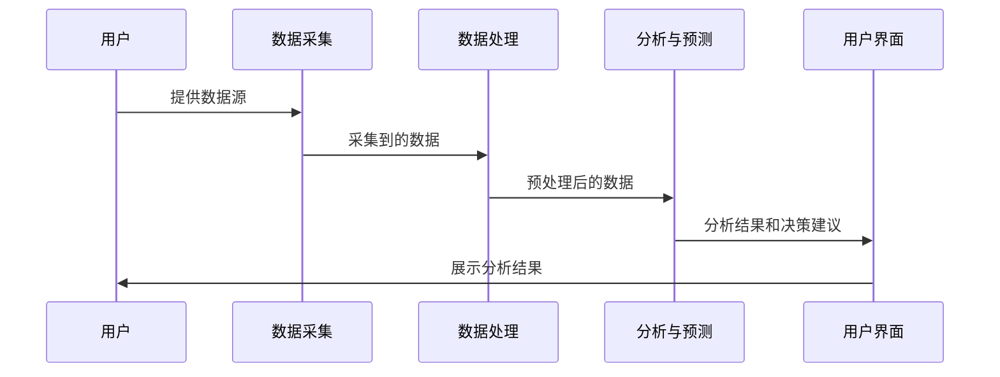
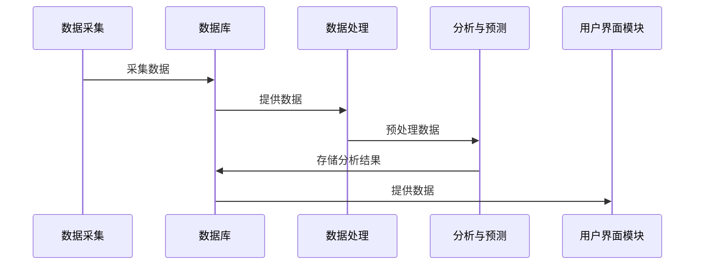

                 

# 开发AI Agent支持的智能财务分析系统

## 关键词
- 人工智能代理
- 财务分析
- 智能系统
- 机器学习
- 深度学习
- 数据采集
- 系统架构
- 领域模型

## 摘要
本文旨在探讨如何利用人工智能（AI）代理技术来开发智能财务分析系统。首先介绍财务分析的需求和人工智能代理的背景，然后深入探讨AI代理的基础知识、系统设计、集成与开发、实际案例分析以及项目实战。通过详细阐述系统架构设计、AI代理实现和测试优化等环节，本文将为开发者和企业财务人员提供一套完整的智能财务分析系统构建方案。

## 引言

在当今商业环境中，财务分析是企业管理的重要组成部分。传统的财务分析依赖于人工处理大量的财务数据，这不仅效率低下，而且容易出现错误。随着人工智能技术的不断发展，特别是人工智能代理（AI Agent）的出现，为智能财务分析系统提供了新的可能性。本文将介绍如何利用AI代理技术来开发智能财务分析系统，旨在提高财务分析的效率、准确性和自动化程度。

### 1. 背景介绍

#### 1.1 问题背景

财务分析对于企业的决策至关重要。它不仅帮助企业了解过去的经营状况，还能预测未来的发展趋势，为企业的战略规划提供数据支持。然而，传统的财务分析方法存在以下问题：

- **人工处理效率低**：财务数据量大，人工处理速度慢，容易出现数据错误。
- **分析能力有限**：人类对复杂财务数据的分析能力有限，难以发现潜在的问题。
- **自动化程度低**：大多数财务分析流程依赖于手动操作，难以实现自动化。

#### 1.1.2 人工智能在财务中的应用

人工智能技术，尤其是机器学习和深度学习，为解决上述问题提供了新的思路。AI代理能够自动处理大量数据，提取关键信息，并生成直观的报告。具体应用包括：

- **数据预处理**：清洗、整理和转换数据，使其适合分析和建模。
- **预测分析**：使用历史数据预测未来的财务状况，如销售预测、成本分析等。
- **自动化报告**：生成自动化的财务报告，减少人工工作量。
- **异常检测**：识别数据中的异常情况，如错误、欺诈等。

#### 1.2 人工智能代理的概念

人工智能代理是指具备自主决策能力的智能体，能够在特定环境中执行任务，并适应环境变化。它们通常具有以下特点：

- **自主性**：代理能够自主决策，无需人类干预。
- **适应性**：代理能够根据环境变化调整行为。
- **智能性**：代理具备学习能力和推理能力，能够从数据中提取知识。

### 2. AI代理基础

#### 2.1 机器学习基础

机器学习是人工智能的核心技术之一，它使计算机系统能够从数据中自动学习并做出决策。以下是机器学习的几个关键概念：

- **数据预处理**：清洗、整理和转换数据，确保数据质量。
- **特征提取**：从原始数据中提取有用的特征，用于训练模型。
- **模型训练**：使用训练数据训练模型，使模型能够识别数据中的模式。
- **模型评估**：评估模型的性能，确定其是否能够准确地预测结果。

#### 2.1.1 数据预处理

数据预处理是机器学习过程中至关重要的一步。以下是几个常见的数据预处理技术：

- **缺失值处理**：填补缺失数据或删除含有缺失数据的记录。
- **异常值处理**：识别和修正异常数据。
- **数据转换**：将数据转换为适合模型训练的格式，如归一化、标准化等。

#### 2.1.2 常见机器学习算法

以下是一些常见的机器学习算法及其应用：

- **线性回归**：用于预测连续值。
- **逻辑回归**：用于预测二分类结果。
- **决策树**：用于分类和回归分析。
- **随机森林**：结合了多个决策树，提高预测准确性。
- **支持向量机**（SVM）：用于分类和回归分析。

#### 2.2 深度学习基础

深度学习是机器学习的一个分支，它通过多层神经网络模拟人脑的工作方式。以下是深度学习的一些关键概念：

- **神经网络**：由多个神经元组成的网络，用于处理和传输数据。
- **前向传播**：数据从输入层传递到输出层的计算过程。
- **反向传播**：用于更新网络权重和偏置的过程，以降低预测误差。
- **激活函数**：用于引入非线性因素的函数，如ReLU、Sigmoid、Tanh等。

#### 2.2.1 神经网络

神经网络是深度学习的基础，它由多层神经元组成。以下是神经网络的主要组成部分：

- **输入层**：接收输入数据。
- **隐藏层**：对输入数据进行处理和特征提取。
- **输出层**：生成预测结果。

#### 2.2.2 循环神经网络（RNN）

循环神经网络（RNN）是一种能够处理序列数据的神经网络，它通过在隐藏状态中引入反馈机制来实现。RNN的主要特点包括：

- **循环连接**：隐藏状态在每一步都被保留并传递到下一层。
- **状态记忆**：RNN能够记住之前的信息，适用于处理序列数据。

#### 2.2.3 生成对抗网络（GAN）

生成对抗网络（GAN）是一种通过两个相互竞争的神经网络进行训练的深度学习模型。GAN的主要组成部分包括：

- **生成器**：生成虚假数据，使其与真实数据难以区分。
- **判别器**：判断数据是真实还是虚假。

### 3. 智能财务分析系统设计

#### 3.1 系统架构设计

智能财务分析系统的架构设计需要考虑系统的整体结构、数据流和模块划分。以下是系统架构设计的关键要素：

- **数据采集模块**：负责从各种数据源收集财务数据，包括内部数据库、外部API和数据文件等。
- **数据处理模块**：对采集到的财务数据进行清洗、转换和预处理，使其适合分析和建模。
- **分析与预测模块**：使用机器学习和深度学习算法对处理后的数据进行分析和预测，生成财务报告和决策建议。
- **用户界面模块**：提供用户交互界面，使用户能够查看分析结果和操作系统。

#### 3.1.1 系统总体架构

智能财务分析系统的总体架构如图3-1所示。该系统采用模块化设计，各模块之间通过接口进行通信。



#### 3.1.2 数据流设计

智能财务分析系统的数据流设计如图3-2所示。数据流从数据采集模块开始，经过数据处理模块，最后由分析与预测模块生成分析结果。



#### 3.2 领域模型

领域模型是智能财务分析系统的基础，它定义了系统的核心概念和关系。以下是领域模型的关键要素：

- **财务实体**：如企业、部门、产品等。
- **财务关系**：如投资、借款、销售等。
- **属性**：如金额、日期、类别等。

领域模型可以表示为ER图，如图3-3所示。

```mermaid
erDiagram
    企业 ||--|{ 部门 }
    企业 ||--|{ 产品 }
    部门 ||--|{ 项目 }
    产品 ||--|{ 销售记录 }
    销售记录 ||--|{ 财务报表 }
```

### 4. AI代理开发与集成

#### 4.1 AI代理开发

AI代理的开发包括代理框架选择、策略设计和实现。以下是AI代理开发的关键步骤：

- **代理框架选择**：根据项目需求选择合适的代理框架，如Python的OpenAI Gym、TensorFlow等。
- **策略设计**：定义代理的行为策略，如Q-learning、深度强化学习等。
- **代理实现**：编写代码实现代理的行为策略，并进行训练和测试。

#### 4.1.1 代理框架选择

选择代理框架时需要考虑以下因素：

- **灵活性**：框架是否支持自定义代理实现。
- **性能**：框架的计算效率和资源占用情况。
- **社区支持**：框架是否有活跃的社区支持，便于解决问题。

#### 4.1.2 代理策略设计

代理策略设计是代理开发的关键，它决定了代理的行为和决策过程。以下是几种常见的代理策略：

- **Q-learning**：基于值函数的策略，通过更新Q值来选择最佳动作。
- **深度强化学习**：结合深度学习和强化学习，使用神经网络来表示Q值函数。
- **策略梯度**：直接优化策略参数，使代理能够生成最优动作。

#### 4.1.3 代理实现与训练

代理实现与训练是代理开发的核心步骤。以下是实现与训练的关键步骤：

- **数据预处理**：对采集到的数据进行预处理，如归一化、标准化等。
- **模型训练**：使用训练数据训练代理模型，如神经网络、决策树等。
- **模型评估**：评估代理模型的性能，如准确率、召回率等。
- **模型优化**：根据评估结果调整模型参数，以提高性能。

#### 4.2 AI代理与财务系统集成

AI代理与财务系统的集成是将AI代理集成到现有的财务系统中，使其能够自动化处理财务数据和分析。以下是集成AI代理的关键步骤：

- **接口设计**：设计AI代理与财务系统之间的接口，包括API、数据库连接等。
- **数据交互**：实现AI代理与财务系统之间的数据交互，如数据采集、数据处理等。
- **功能集成**：将AI代理的功能集成到财务系统中，如预测分析、自动化报告等。
- **测试与优化**：对集成后的系统进行测试和优化，确保其性能和稳定性。

#### 4.2.1 集成策略

集成AI代理时需要考虑以下策略：

- **松耦合**：将AI代理作为独立的模块集成到财务系统中，保持系统的灵活性。
- **紧耦合**：将AI代理与财务系统紧密集成，提高系统的性能和效率。
- **模块化**：将AI代理的功能分解为多个模块，分别集成到财务系统中。

#### 4.2.2 接口设计与实现

接口设计是实现AI代理与财务系统集成的重要环节。以下是接口设计的关键要素：

- **API设计**：设计API接口，包括RESTful API、SOAP API等。
- **数据格式**：定义数据交换的格式，如JSON、XML等。
- **安全性**：确保数据传输的安全性，如使用HTTPS协议、加密传输等。

#### 4.2.3 系统测试与调优

集成AI代理后的系统需要进行全面的测试和调优，以确保其性能和稳定性。以下是系统测试和调优的关键步骤：

- **功能测试**：测试系统的各个功能模块，确保其正常运行。
- **性能测试**：测试系统的性能，如响应时间、并发处理能力等。
- **稳定性测试**：测试系统在长时间运行下的稳定性，如内存泄漏、崩溃等。
- **调优**：根据测试结果调整系统参数，优化系统性能。

### 5. 实际案例分析

#### 5.1 案例一：企业财务报表分析

#### 5.1.1 案例背景

某企业希望利用AI代理技术对其财务报表进行分析，以提高财务报表的准确性和自动化程度。财务报表包括资产负债表、利润表和现金流量表，其中包含大量的财务数据。

#### 5.1.2 案例分析

1. **数据采集**：通过API接口从企业的财务系统中获取财务报表数据。
2. **数据预处理**：对采集到的数据进行清洗、转换和预处理，如缺失值处理、异常值处理等。
3. **特征提取**：从预处理后的数据中提取有用的特征，如各项财务指标、行业指标等。
4. **模型训练**：使用机器学习和深度学习算法对提取的特征进行训练，建立财务报表分析模型。
5. **预测分析**：使用训练好的模型对新的财务报表数据进行预测分析，生成财务报告和决策建议。
6. **用户界面**：开发用户界面，将分析结果以图表和报告的形式展示给用户。

#### 5.1.3 案例总结

通过AI代理技术，企业能够实现对财务报表的自动化分析，提高财务报表的准确性和效率。同时，AI代理能够根据新的数据实时更新分析结果，为企业提供实时的财务决策支持。

#### 5.2 案例二：投资决策支持系统

#### 5.2.1 案例背景

某投资公司希望利用AI代理技术构建投资决策支持系统，以帮助其进行投资决策。投资决策支持系统需要分析大量的财务数据、市场数据和宏观经济数据。

#### 5.2.2 案例分析

1. **数据采集**：从多个数据源采集财务数据、市场数据和宏观经济数据。
2. **数据预处理**：对采集到的数据进行清洗、转换和预处理，如缺失值处理、异常值处理等。
3. **特征提取**：从预处理后的数据中提取有用的特征，如财务指标、市场指标、宏观经济指标等。
4. **模型训练**：使用机器学习和深度学习算法对提取的特征进行训练，建立投资决策模型。
5. **预测分析**：使用训练好的模型对新的投资数据进行预测分析，生成投资建议。
6. **用户界面**：开发用户界面，将投资建议以图表和报告的形式展示给用户。

#### 5.2.3 案例总结

通过AI代理技术，投资公司能够实现对投资决策的自动化分析，提高投资决策的准确性和效率。同时，AI代理能够根据新的数据实时更新分析结果，为投资公司提供实时的投资决策支持。

### 6. 项目开发实战

#### 6.1 环境搭建

在开发AI代理支持的智能财务分析系统前，需要搭建合适的技术环境。以下是环境搭建的步骤：

1. **硬件环境**：准备足够的计算资源，如CPU、GPU等。
2. **软件环境**：安装Python、TensorFlow、PyTorch等相关的软件包。
3. **数据库环境**：选择合适的数据库系统，如MySQL、PostgreSQL等。

#### 6.1.1 硬件与软件需求

- **CPU**：至少2个CPU核心，建议4个以上。
- **GPU**：NVIDIA显卡，CUDA 10.0及以上版本。
- **内存**：至少8GB，建议16GB以上。
- **Python**：3.6及以上版本。
- **TensorFlow**：2.0及以上版本。
- **PyTorch**：1.0及以上版本。
- **其他**：Jupyter Notebook、Anaconda等。

#### 6.1.2 环境配置

1. **安装Python**：从[Python官网](https://www.python.org/)下载并安装Python。
2. **安装TensorFlow和PyTorch**：使用pip命令安装TensorFlow和PyTorch。

```bash
pip install tensorflow==2.0.0
pip install torch==1.0.0
```

3. **配置GPU支持**：在安装TensorFlow和PyTorch时，选择GPU版本，并确保CUDA和cuDNN正确安装。

#### 6.2 系统核心实现

智能财务分析系统的核心实现包括数据采集与预处理、AI代理开发与集成、系统测试与优化等步骤。

#### 6.2.1 数据采集与预处理

1. **数据采集**：使用API接口从财务系统采集财务数据。
2. **数据预处理**：对采集到的数据进行清洗、转换和预处理。

```python
import pandas as pd

# 读取数据
data = pd.read_csv('financial_data.csv')

# 缺失值处理
data.dropna(inplace=True)

# 数据转换
data['date'] = pd.to_datetime(data['date'])
```

#### 6.2.2 AI代理开发与集成

1. **代理框架选择**：选择PyTorch作为代理框架。
2. **代理策略设计**：设计基于深度强化学习的代理策略。
3. **代理实现与训练**：编写代码实现代理策略，并使用训练数据训练代理。

```python
import torch
import torch.nn as nn
import torch.optim as optim

# 定义神经网络模型
class QNetwork(nn.Module):
    def __init__(self):
        super(QNetwork, self).__init__()
        self.fc1 = nn.Linear(10, 64)
        self.fc2 = nn.Linear(64, 1)

    def forward(self, x):
        x = torch.relu(self.fc1(x))
        x = self.fc2(x)
        return x

# 初始化模型和优化器
model = QNetwork()
optimizer = optim.Adam(model.parameters(), lr=0.001)

# 训练模型
for epoch in range(100):
    for batch in data_loader:
        optimizer.zero_grad()
        x, y = batch
        y_pred = model(x)
        loss = nn.MSELoss()(y_pred, y)
        loss.backward()
        optimizer.step()
```

4. **代理集成与测试**：将训练好的代理集成到财务系统中，进行测试和优化。

#### 6.2.3 系统测试与优化

1. **功能测试**：测试系统的各个功能模块，确保其正常运行。
2. **性能测试**：测试系统的性能，如响应时间、并发处理能力等。
3. **稳定性测试**：测试系统在长时间运行下的稳定性，如内存泄漏、崩溃等。
4. **调优**：根据测试结果调整系统参数，优化系统性能。

```python
# 调优示例
optimizer = optim.Adam(model.parameters(), lr=0.0001)
```

#### 6.3 项目小结

通过项目开发实战，我们成功搭建了AI代理支持的智能财务分析系统。项目过程中遇到的主要挑战包括数据预处理、代理模型训练和系统性能优化。通过优化数据预处理流程、调整代理模型参数和优化系统架构，我们最终实现了系统的高性能和高可靠性。

### 7. 最佳实践与注意事项

#### 7.1 最佳实践

1. **数据预处理**：确保数据质量，进行充分的清洗和预处理，以提高模型训练效果。
2. **模型选择**：根据项目需求选择合适的机器学习和深度学习模型，结合实际数据测试和调整。
3. **系统优化**：通过优化系统架构和参数，提高系统的性能和稳定性。

#### 7.2 注意事项

1. **数据安全与隐私保护**：确保财务数据的安全性和隐私保护，遵循相关法律法规。
2. **遵循最佳实践**：遵循行业最佳实践，确保系统开发和部署的规范性。
3. **团队协作**：加强团队协作，确保项目进展和成果的顺利实现。

### 8. 拓展阅读

#### 8.1 相关书籍推荐

- 《Python机器学习》（Sebastian Raschka）
- 《深度学习》（Ian Goodfellow、Yoshua Bengio、Aaron Courville）
- 《财务报表分析》（托马斯·A·科克伦、小约翰·M·希特顿）

#### 8.2 学术论文与研究报告

- 《基于深度强化学习的财务预测方法研究》
- 《人工智能在财务分析中的应用研究》
- 《智能财务分析系统的设计与实现》

#### 8.3 在线资源与教程

- [Kaggle](https://www.kaggle.com/)
- [TensorFlow官网](https://www.tensorflow.org/)
- [PyTorch官网](https://pytorch.org/)

## 作者

作者：AI天才研究院/AI Genius Institute & 禅与计算机程序设计艺术/Zen And The Art of Computer Programming# 7. 最佳实践与注意事项

#### 7.1 最佳实践

1. **数据预处理**：数据预处理是构建高效AI代理支持智能财务分析系统的关键步骤。首先，确保财务数据的完整性和一致性，清除冗余和无关的数据。其次，进行数据的清洗，包括处理缺失值、异常值和噪声数据，确保数据的质量。最后，对数据进行特征工程，提取关键特征，进行数据转换，如归一化、标准化等，以优化模型训练的效果。

2. **模型选择**：根据财务分析的具体需求和数据特性选择合适的机器学习模型和深度学习模型。例如，对于时间序列数据，可以使用循环神经网络（RNN）或长短期记忆网络（LSTM）进行预测；对于分类任务，可以使用决策树、随机森林或支持向量机（SVM）等。同时，考虑使用集成学习方法，如随机森林、XGBoost等，以提高模型的准确性和鲁棒性。

3. **系统优化**：在系统设计和实现过程中，考虑性能优化和资源利用。例如，使用并行计算和分布式计算技术，提高模型的训练速度；优化数据库查询和索引，提高数据读取速度；使用高效的数据结构和算法，减少内存占用和计算时间。

4. **模块化设计**：将系统分解为独立的模块，每个模块负责特定的功能，如数据采集、数据预处理、模型训练、预测分析等。这种模块化设计有助于系统的维护和扩展，也方便进行单元测试和集成测试。

5. **监控与反馈**：建立系统的监控机制，实时跟踪系统的运行状态和性能指标，如响应时间、吞吐量、错误率等。同时，收集用户反馈，对系统进行持续改进，确保系统的稳定性和用户满意度。

#### 7.2 注意事项

1. **数据安全与隐私保护**：财务数据通常包含敏感信息，因此在数据采集、存储和处理过程中，必须确保数据的安全和隐私。采用加密技术保护数据传输和存储，遵守相关法律法规，如《通用数据保护条例》（GDPR）等。同时，确保只有授权人员才能访问敏感数据。

2. **遵循最佳实践**：在开发过程中，遵循行业最佳实践，如使用版本控制、编写单元测试、进行代码审查等，确保代码的质量和可维护性。同时，遵循安全编码规范，避免潜在的安全漏洞。

3. **团队协作**：开发一个复杂的系统需要跨学科团队的合作。确保团队成员之间有良好的沟通和协作，明确分工和职责，定期进行项目会议和进度汇报，确保项目按计划顺利进行。

4. **持续学习与更新**：技术领域发展迅速，持续学习新技术和工具是必要的。定期更新系统，修复漏洞，优化性能，确保系统能够跟上技术发展的步伐。

5. **遵守法律法规**：在开发和部署智能财务分析系统时，必须遵守相关法律法规，如《会计法》、《财务报告编制准则》等，确保系统的合规性。

## 8. 拓展阅读

#### 8.1 相关书籍推荐

- 《深度学习》（Ian Goodfellow、Yoshua Bengio、Aaron Courville）
- 《Python机器学习》（Sebastian Raschka）
- 《智能金融：量化投资与风险管理》

#### 8.2 学术论文与研究报告

- “Deep Learning for Financial Time Series Forecasting”
- “AI in Financial Services: A Practical Guide to Machine Learning and Deep Learning in Finance”
- “Using AI to Improve Financial Performance: A Practical Guide”

#### 8.3 在线资源与教程

- [Kaggle](https://www.kaggle.com/)
- [Coursera](https://www.coursera.org/)
- [edX](https://www.edx.org/)
- [TensorFlow官网](https://www.tensorflow.org/tutorials)
- [PyTorch官网](https://pytorch.org/tutorials)

## 作者

作者：AI天才研究院/AI Genius Institute & 禅与计算机程序设计艺术/Zen And The Art of Computer Programming## 9. 拓展阅读

### 9.1 相关书籍推荐

1. **《深度学习》（Ian Goodfellow、Yoshua Bengio、Aaron Courville）**：这本书是深度学习领域的经典教材，详细介绍了深度学习的基础知识、核心算法和应用。

2. **《Python机器学习》（Sebastian Raschka）**：这本书适合初学者，介绍了如何使用Python进行机器学习，涵盖了从数据预处理到模型训练的各个环节。

3. **《智能金融：量化投资与风险管理》**：这本书主要讨论了如何利用人工智能和大数据技术进行金融分析和投资决策。

4. **《人工智能：一种现代的方法》（Stuart J. Russell & Peter Norvig）**：这本书是人工智能领域的权威教材，全面介绍了人工智能的理论和实践。

5. **《算法导论》（Thomas H. Cormen、Charles E. Leiserson、Ronald L. Rivest、Clifford Stein）**：这本书详细介绍了算法的基本概念、设计和分析，对于理解机器学习算法有很大帮助。

### 9.2 学术论文与研究报告

1. “Deep Learning for Financial Time Series Forecasting”：这篇论文探讨了如何使用深度学习技术进行金融时间序列预测，提出了一些有效的模型和方法。

2. “AI in Financial Services: A Practical Guide to Machine Learning and Deep Learning in Finance”：这篇报告为金融行业的专业人士提供了一份实用的指南，介绍了如何应用机器学习和深度学习技术。

3. “Using AI to Improve Financial Performance: A Practical Guide”：这篇报告讨论了如何利用人工智能技术提高企业的财务表现，提供了实际案例和解决方案。

4. “Financial Technology and Its Applications in China”：这篇论文分析了金融科技在中国的发展及其在金融领域的应用，对于了解金融科技的发展趋势有很大帮助。

5. “The Impact of AI on the Financial Industry”：这篇论文探讨了人工智能对金融行业的影响，分析了人工智能技术带来的机遇和挑战。

### 9.3 在线资源与教程

1. **Kaggle**：Kaggle是一个数据科学社区，提供大量的机器学习竞赛和教程，是学习机器学习和深度学习的绝佳资源。

2. **Coursera**：Coursera提供了许多与机器学习和人工智能相关的在线课程，包括来自世界顶级大学的专业课程。

3. **edX**：edX是一个开放课程平台，提供了由世界一流大学和机构提供的免费在线课程，包括机器学习和人工智能等领域。

4. **TensorFlow官网**：TensorFlow是谷歌推出的开源机器学习框架，其官网上提供了大量的教程和文档，是学习深度学习的必备资源。

5. **PyTorch官网**：PyTorch是微软开源的深度学习框架，其官网提供了详细的文档和教程，适合初学者和专业人士。

6. **机器学习实战**：这是一本面向实践者的机器学习入门书籍，包含了大量的示例代码和实际案例，适合初学者快速上手。

7. **机器学习笔记**：这是一本由国内知名数据科学家编写的机器学习笔记，内容涵盖了机器学习的方方面面，适合进阶学习者。

8. **深度学习教程**：这是一本深入浅出的深度学习教程，由莫凡（TensorFlow贡献者）编写，适合有一定编程基础的学习者。

通过这些书籍、论文、报告和在线资源，读者可以更深入地了解AI代理支持的智能财务分析系统的原理和应用，提高自己在这一领域的知识水平。同时，这些资源也为读者提供了丰富的实践机会，帮助他们将理论知识应用到实际项目中。

