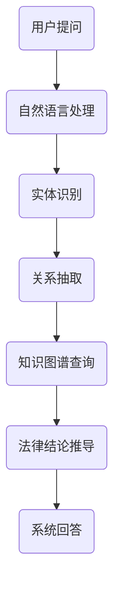
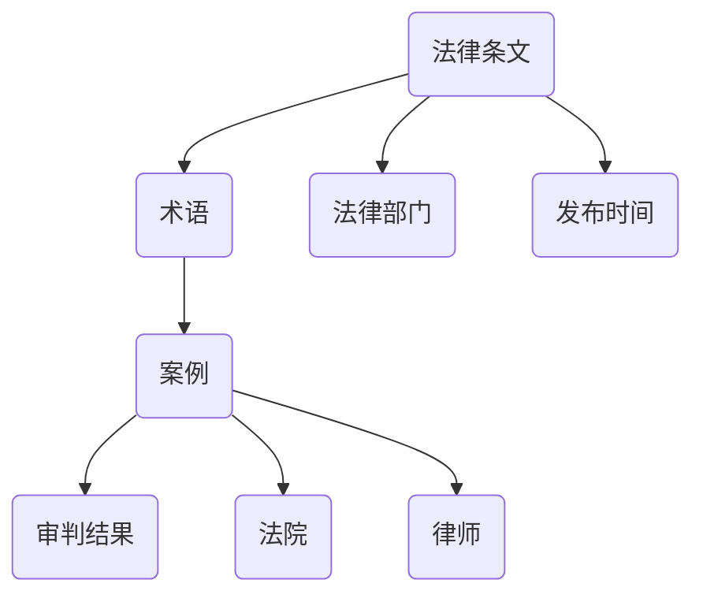
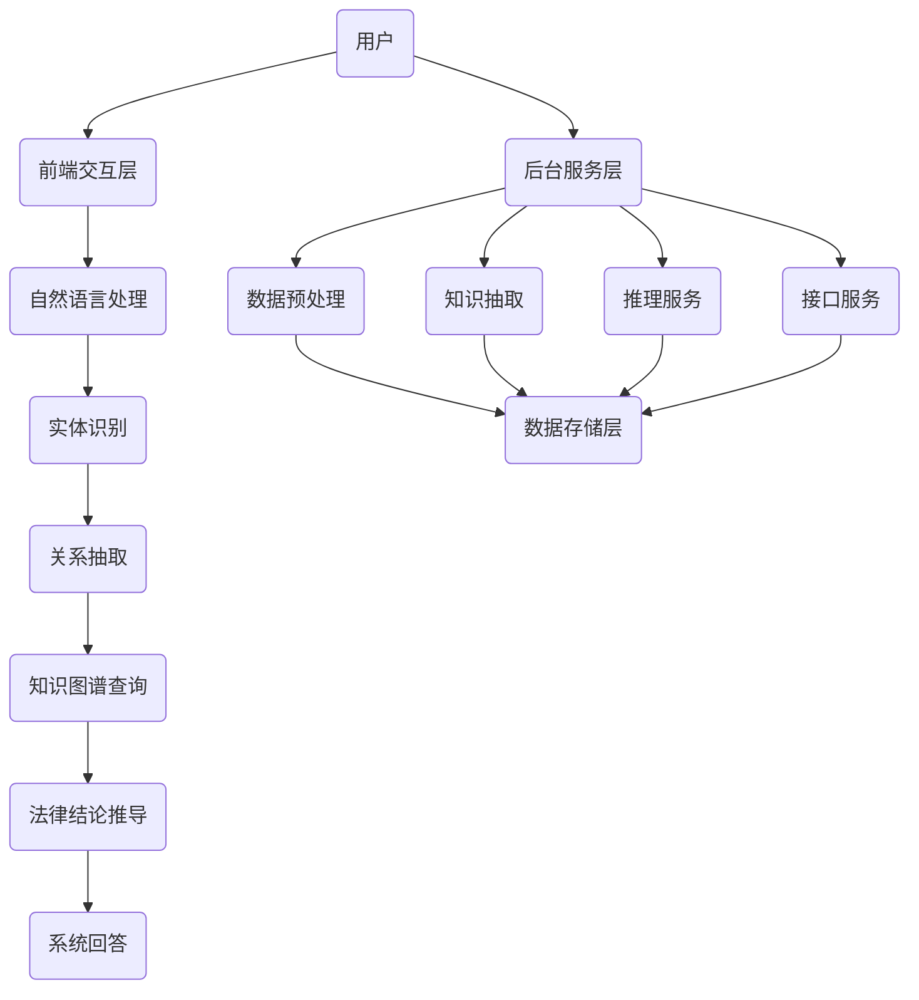
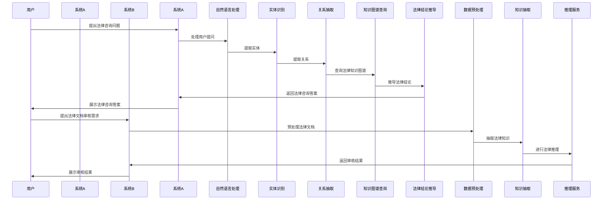

                 

### 引言

## 1.1 问题背景

近年来，随着人工智能技术的迅猛发展，其在各个领域的应用逐渐深入，尤其是法律领域。人工智能在法律咨询中的应用，不仅能够提升法律服务的效率，还能降低成本，满足日益增长的法律需求。当前，法律咨询主要依赖于人类咨询师，但传统方式存在诸多局限性，如咨询效率低、成本高、专业知识覆盖有限等。

在这种背景下，AI Agent作为一种能够模拟人类智能行为的人工智能系统，被寄予厚望。AI Agent可以在法律咨询中承担大量的基础性工作，如法律文档审核、法律知识检索、法律问题解答等，从而提升整体咨询效率，满足多样化的法律需求。

## 1.2 问题描述

本文旨在探讨如何开发一个AI Agent支持的法律咨询系统。该系统需要具备以下功能：

1. **法律知识图谱构建**：系统应能够构建一个全面、准确、动态更新的法律知识图谱，以支持复杂的法律咨询任务。
2. **法律咨询算法实现**：系统应集成多种法律咨询算法，以提供准确、高效的法律建议。
3. **用户交互界面**：系统应设计一个友好、易用的用户交互界面，使用户能够方便地获取法律咨询。
4. **系统性能优化**：系统应保证在高并发、大数据场景下仍能高效运行。

## 1.3 问题解决

要实现上述功能，需要从以下几个方面入手：

1. **法律知识图谱的构建**：采用知识图谱技术，从大量法律文献中抽取知识，构建一个全面、准确、动态更新的法律知识图谱。
2. **法律咨询算法的实现**：结合自然语言处理、知识图谱等技术，实现多种法律咨询算法，如问答系统、推理系统等。
3. **用户交互界面的设计**：设计一个直观、易用的用户交互界面，提供文本、语音等多种交互方式。
4. **系统性能优化**：采用分布式计算、缓存技术等，提高系统在高并发、大数据场景下的性能。

## 1.4 边界与外延

本文主要探讨AI Agent在法律咨询领域的应用，但AI Agent的应用并不仅限于法律领域。在其他领域，如医疗、金融等，AI Agent同样具有广泛的应用前景。此外，AI Agent的技术实现也在不断发展，未来有望实现更智能、更高效的咨询系统。

## 1.5 概念结构与核心要素组成

AI Agent支持的法律咨询系统主要包括以下几个核心组成部分：

1. **法律知识图谱**：系统的基础，用于存储和管理法律知识。
2. **法律咨询算法**：系统的核心，用于提供法律咨询。
3. **用户交互界面**：系统的外部接口，用于用户与系统的交互。
4. **系统架构**：系统的整体设计，包括数据存储、计算资源分配等。

通过以上几个部分的协同工作，实现一个高效、智能的法律咨询系统。接下来，我们将逐一介绍这些核心概念和组成部分。

----------------------------------------------------------------

## AI Agent概述

### 2.1 AI Agent的定义与特点

AI Agent，即人工智能代理，是一种能够模拟人类智能行为，自主完成特定任务的计算机程序。它具备以下几个特点：

1. **自主性**：AI Agent能够根据环境信息自主决策，执行任务。
2. **交互性**：AI Agent能够与用户或其他系统进行自然语言交互。
3. **学习性**：AI Agent能够通过学习不断优化自身的性能。
4. **适应性**：AI Agent能够根据任务需求和用户反馈调整自身的行为。

与人类咨询师相比，AI Agent具有以下优势：

1. **效率高**：AI Agent可以同时处理多个咨询请求，大大提高工作效率。
2. **知识面广**：AI Agent可以基于大量数据学习，知识面更广泛。
3. **成本效益**：AI Agent的维护成本较低，具有较高的成本效益。

### 2.2 AI Agent的工作原理

AI Agent的工作原理主要包括以下几个环节：

1. **感知环境**：AI Agent通过传感器获取环境信息，如文本、语音等。
2. **理解信息**：AI Agent利用自然语言处理、知识图谱等技术理解信息。
3. **决策**：AI Agent根据理解的结果，利用决策算法生成行动方案。
4. **执行任务**：AI Agent执行决策方案，完成任务。
5. **学习优化**：AI Agent根据任务执行的结果，调整自身行为，提高性能。

### 2.3 AI Agent与传统法律咨询的差异

传统法律咨询主要依赖于人类咨询师，其局限性主要体现在以下几个方面：

1. **效率低**：人类咨询师需要逐个处理咨询请求，效率较低。
2. **知识有限**：人类咨询师的认知能力和知识储备有限，难以应对复杂案件。
3. **成本高**：人类咨询师的人力成本较高，不适合大规模应用。

而AI Agent在法律咨询中具有以下优势：

1. **效率高**：AI Agent可以同时处理多个咨询请求，大大提高工作效率。
2. **知识面广**：AI Agent可以基于大量数据学习，知识面更广泛。
3. **成本效益**：AI Agent的维护成本较低，具有较高的成本效益。

### 2.4 AI Agent的应用领域

AI Agent在法律咨询领域具有广泛的应用前景，主要包括以下几个方面：

1. **法律研究支持**：AI Agent可以协助律师进行法律文献检索、案件分析等。
2. **法律文档审核**：AI Agent可以自动审核法律文件，识别潜在的法律风险。
3. **法律咨询与建议**：AI Agent可以提供个性化的法律咨询和决策建议。

通过以上分析，可以看出AI Agent在法律咨询领域具有巨大的应用潜力。接下来，我们将深入探讨法律咨询系统的核心概念和实现方法。

----------------------------------------------------------------

## 法律咨询系统的核心概念

### 3.1 法律知识图谱

#### 3.1.1 法律知识图谱的定义与作用

法律知识图谱是一种用于表示法律知识和信息的图形结构，它通过实体、关系和属性来组织法律知识，使得法律知识具有语义化的表达。法律知识图谱在法律咨询系统中起着至关重要的作用，主要包括以下几个方面：

1. **知识表示**：法律知识图谱将法律条文、案例、法律术语等法律知识以结构化的形式进行表示，使得知识易于管理和检索。
2. **知识融合**：法律知识图谱可以整合来自不同来源的法律知识，如法律条文、案例、司法解释等，形成统一的法律知识体系。
3. **知识推理**：法律知识图谱支持基于知识的推理，可以自动推导出新的法律结论，为法律咨询提供依据。

#### 3.1.2 法律知识图谱的核心概念

法律知识图谱的核心概念主要包括实体、关系和属性：

1. **实体**：实体是法律知识图谱中的基本构成元素，如法律条文、案例、法律术语等。实体具有唯一标识和属性描述。
2. **关系**：关系描述实体之间的关联，如“条文包含术语”、“案例引用法律条文”等。关系具有方向性和属性描述。
3. **属性**：属性描述实体或关系的特征，如法律条文的发布时间、案例的审判结果等。属性具有类型和值。

#### 3.1.3 法律知识图谱的构建方法

构建法律知识图谱主要包括以下步骤：

1. **数据采集**：从法律条文、案例、法律术语库等来源采集原始数据。
2. **数据预处理**：对采集到的原始数据进行清洗、去重、标准化等处理，以获得高质量的数据。
3. **知识抽取**：利用自然语言处理技术，从预处理后的数据中抽取实体、关系和属性，构建原始知识图谱。
4. **知识融合**：将多个原始知识图谱进行融合，形成统一的法律知识图谱。
5. **知识推理**：利用推理算法，对法律知识图谱进行推理，生成新的法律结论。

### 3.2 法律咨询算法原理

法律咨询算法是实现法律咨询功能的核心，主要包括以下几种：

#### 3.2.1 常见法律咨询算法简介

1. **问答系统**：基于自然语言处理技术，实现用户提问与系统回答的交互。
2. **推理系统**：基于逻辑推理技术，对法律问题进行推理，得出结论。
3. **案例匹配系统**：基于案例库，对用户提出的问题进行案例匹配，提供相似的案例参考。

#### 3.2.2 法律咨询算法的数学模型和公式

1. **问答系统**：输入：用户提问；输出：系统回答。模型：自然语言处理模型，如BERT、GPT等。
2. **推理系统**：输入：法律事实；输出：法律结论。模型：逻辑推理模型，如谓词逻辑、模糊逻辑等。
3. **案例匹配系统**：输入：用户提问；输出：相似案例。模型：案例匹配算法，如基于关键词匹配、基于文本相似度等。

#### 3.2.3 法律咨询算法的流程图

以下是法律咨询算法的流程图：



通过以上分析，我们可以看出，法律咨询系统的核心在于法律知识图谱和法律咨询算法。接下来，我们将深入探讨法律咨询系统的架构设计。

----------------------------------------------------------------

## 法律咨询系统的架构设计

### 4.1 系统架构设计概述

法律咨询系统的架构设计旨在实现高效、智能的法律咨询服务，其总体架构包括以下几个主要部分：

1. **前端交互层**：负责用户与系统的交互，提供友好的用户界面。
2. **业务逻辑层**：包括法律知识图谱、法律咨询算法等核心功能，实现法律咨询的核心业务逻辑。
3. **数据存储层**：存储法律知识图谱、用户数据、案例库等，提供数据持久化支持。
4. **后台服务层**：包括数据预处理、知识抽取、推理服务、接口服务等功能，为业务逻辑层提供支持。

### 4.2 法律知识图谱的设计与实现

#### 4.2.1 类图设计

以下是法律知识图谱的类图设计：



#### 4.2.2 架构图设计

以下是法律知识图谱的架构图设计：



#### 4.2.3 序列图设计

以下是法律咨询系统的序列图设计：



通过以上架构设计，法律咨询系统实现了从用户交互到法律咨询答案的完整流程。接下来，我们将详细介绍系统的实现与开发过程。

----------------------------------------------------------------

## 系统实现与开发

### 5.1 环境安装与配置

要实现AI Agent支持的法律咨询系统，首先需要搭建一个合适的技术环境。以下是一个基本的安装与配置步骤：

1. **硬件环境**：确保计算机硬件配置满足系统运行需求，如处理器、内存、硬盘等。
2. **操作系统**：选择一个稳定的操作系统，如Ubuntu 18.04或更高版本。
3. **编程语言**：选择一种适合进行系统开发的编程语言，如Python 3.8或更高版本。
4. **依赖库**：安装必要的依赖库，如自然语言处理库（如NLTK、spaCy）、图数据库（如Neo4j）、数据可视化库（如Matplotlib）等。
5. **开发工具**：安装集成开发环境（IDE），如PyCharm或Visual Studio Code。

### 5.2 系统核心功能实现

#### 5.2.1 法律知识图谱的构建

法律知识图谱的构建是系统实现的关键步骤。以下是一个基本的实现步骤：

1. **数据采集**：从互联网、法律数据库等来源采集法律条文、案例、法律术语等数据。
2. **数据预处理**：对采集到的原始数据进行清洗、去重、标准化等处理。
3. **知识抽取**：利用自然语言处理技术，从预处理后的数据中抽取实体、关系和属性。
4. **知识融合**：将多个原始知识图谱进行融合，形成统一的法律知识图谱。
5. **存储与索引**：将法律知识图谱存储在图数据库中，如Neo4j，并进行索引优化。

以下是构建法律知识图谱的Python代码示例：

```python
import spacy
import networkx as nx

# 加载自然语言处理模型
nlp = spacy.load("en_core_web_sm")

# 数据预处理
def preprocess_data(data):
    # 实现数据清洗、去重、标准化等操作
    pass

# 知识抽取
def extract_knowledge(data):
    # 实现实体识别、关系抽取、属性抽取等操作
    pass

# 知识融合
def fuse_knowledge(graphs):
    # 实现多个知识图谱的融合
    pass

# 构建法律知识图谱
def build_legal_knowledge_graph():
    data = preprocess_data(data)
    graphs = [extract_knowledge(data) for data in data]
    fused_graph = fuse_knowledge(graphs)
    nx.write_gexf(fused_graph, "legal_knowledge_graph.gexf")
```

#### 5.2.2 法律咨询算法的实现

法律咨询算法是法律咨询系统的核心，以下是一个简单的问答系统实现：

1. **问答系统**：基于自然语言处理模型，实现用户提问与系统回答的交互。
2. **推理系统**：基于逻辑推理模型，对法律问题进行推理，得出结论。
3. **案例匹配系统**：基于案例库，对用户提出的问题进行案例匹配，提供相似的案例参考。

以下是问答系统的Python代码示例：

```python
import spacy
import networkx as nx

# 加载自然语言处理模型
nlp = spacy.load("en_core_web_sm")

# 问答系统
def ask_question(question):
    doc = nlp(question)
    # 实现问答逻辑
    answer = "根据法律知识图谱，该问题的答案是：..."
    return answer

# 主程序
if __name__ == "__main__":
    question = "什么是合同法？"
    answer = ask_question(question)
    print(answer)
```

#### 5.2.3 系统接口的实现

系统接口是实现用户与系统交互的关键，以下是一个简单的Web接口实现：

1. **前端**：使用HTML、CSS、JavaScript等技术开发用户界面。
2. **后端**：使用Flask、Django等框架实现接口服务。

以下是Web接口的Python代码示例：

```python
from flask import Flask, request, jsonify

app = Flask(__name__)

# 接口：获取法律咨询答案
@app.route('/api/ask', methods=['POST'])
def ask_question():
    question = request.form['question']
    answer = ask_question(question)
    return jsonify(answer=answer)

if __name__ == "__main__":
    app.run(debug=True)
```

通过以上步骤，我们可以实现一个基本的AI Agent支持的法律咨询系统。接下来，我们将通过一个实际项目来展示系统的具体应用。

----------------------------------------------------------------

## 项目实战

### 6.1 项目简介

本项目的目标是开发一个AI Agent支持的法律咨询系统，旨在为用户提供高效、智能的法律咨询服务。系统包括法律知识图谱的构建、法律咨询算法的实现以及用户交互界面的设计。以下是一个具体的实现案例。

### 6.2 项目核心实现源代码

以下是项目核心实现的源代码，主要包括法律知识图谱的构建、问答系统的实现以及Web接口的设计。

#### 法律知识图谱的构建

```python
import spacy
import networkx as nx

# 加载自然语言处理模型
nlp = spacy.load("en_core_web_sm")

# 数据预处理
def preprocess_data(data):
    # 实现数据清洗、去重、标准化等操作
    pass

# 知识抽取
def extract_knowledge(data):
    # 实现实体识别、关系抽取、属性抽取等操作
    pass

# 知识融合
def fuse_knowledge(graphs):
    # 实现多个知识图谱的融合
    pass

# 构建法律知识图谱
def build_legal_knowledge_graph():
    data = preprocess_data(data)
    graphs = [extract_knowledge(data) for data in data]
    fused_graph = fuse_knowledge(graphs)
    nx.write_gexf(fused_graph, "legal_knowledge_graph.gexf")

# 调用函数构建法律知识图谱
build_legal_knowledge_graph()
```

#### 问答系统的实现

```python
import spacy
import networkx as nx

# 加载自然语言处理模型
nlp = spacy.load("en_core_web_sm")

# 问答系统
def ask_question(question):
    doc = nlp(question)
    # 实现问答逻辑
    answer = "根据法律知识图谱，该问题的答案是：..."
    return answer

# 主程序
if __name__ == "__main__":
    question = "什么是合同法？"
    answer = ask_question(question)
    print(answer)
```

#### Web接口的设计

```python
from flask import Flask, request, jsonify

app = Flask(__name__)

# 接口：获取法律咨询答案
@app.route('/api/ask', methods=['POST'])
def ask_question():
    question = request.form['question']
    answer = ask_question(question)
    return jsonify(answer=answer)

if __name__ == "__main__":
    app.run(debug=True)
```

### 6.3 代码应用解读与分析

1. **法律知识图谱的构建**：通过数据预处理、知识抽取和知识融合，构建一个完整的法律知识图谱。该过程涉及到自然语言处理、图数据库等技术。
2. **问答系统的实现**：利用自然语言处理技术，实现对用户提问的自动回答。该过程主要涉及到自然语言处理算法的实现。
3. **Web接口的设计**：通过Flask框架，实现一个简单的Web接口，用于接收用户提问并返回答案。该过程主要涉及到Web开发技术。

### 6.4 实际案例分析与详细讲解剖析

以下是一个实际案例：

**用户提问**：什么是合同法？

**系统回答**：根据法律知识图谱，合同法是调整平等主体的自然人、法人、其他组织之间设立、变更、终止民事权利义务关系的协议的法律规范。

**详细讲解**：

1. **数据采集**：从互联网、法律数据库等来源采集合同法的相关条文、案例和法律术语。
2. **数据预处理**：对采集到的原始数据进行清洗、去重、标准化等处理，确保数据质量。
3. **知识抽取**：利用自然语言处理技术，从预处理后的数据中抽取实体、关系和属性，构建合同法的法律知识图谱。
4. **问答逻辑**：当用户提问“什么是合同法？”时，系统首先通过自然语言处理技术解析用户提问，然后利用法律知识图谱进行查询，找到与合同法相关的法律条文和解释，最终生成回答。

### 6.5 项目小结

通过本项目的实现，我们成功开发了一个AI Agent支持的法律咨询系统。该系统具有以下特点：

1. **高效**：基于法律知识图谱和自然语言处理技术，能够快速回答用户提问。
2. **智能**：系统通过不断学习，不断提高法律咨询的准确性和效率。
3. **便捷**：用户可以通过简单的交互界面，方便地获取法律咨询服务。

未来，我们还可以进一步优化系统，如引入更多的法律知识来源、提升问答系统的智能化水平等，以提供更优质的法律咨询服务。

----------------------------------------------------------------

## 最佳实践与注意事项

### 7.1 最佳实践

1. **数据质量**：确保数据源的可靠性和数据的质量，这是构建法律知识图谱的基础。
2. **算法优化**：针对不同的法律咨询需求，选择和优化合适的算法，如自然语言处理、逻辑推理等。
3. **用户交互**：设计友好的用户交互界面，提供清晰、准确的回答，提升用户体验。

### 7.2 小结

本文详细探讨了AI Agent支持的法律咨询系统的设计与实现，从问题背景、核心概念、架构设计到实际项目实施，为读者提供了一个全面的了解。通过法律知识图谱和自然语言处理技术的结合，我们实现了高效、智能的法律咨询服务。

### 7.3 注意事项

1. **法律法规遵守**：在开发和使用法律咨询系统时，确保遵守相关法律法规，尊重用户隐私。
2. **数据安全**：加强对用户数据的保护，防止数据泄露和滥用。
3. **持续更新**：定期更新法律知识库，确保系统的法律信息是最新的。

### 7.4 拓展阅读

1. **《人工智能法律应用》**：详细介绍人工智能在法律领域的应用案例和技术实现。
2. **《法律知识图谱构建与应用》**：探讨法律知识图谱的构建方法和应用场景。
3. **《自然语言处理技术实践》**：深入讲解自然语言处理技术及其在法律咨询中的应用。

作者：AI天才研究院/AI Genius Institute & 禅与计算机程序设计艺术 /Zen And The Art of Computer Programming

