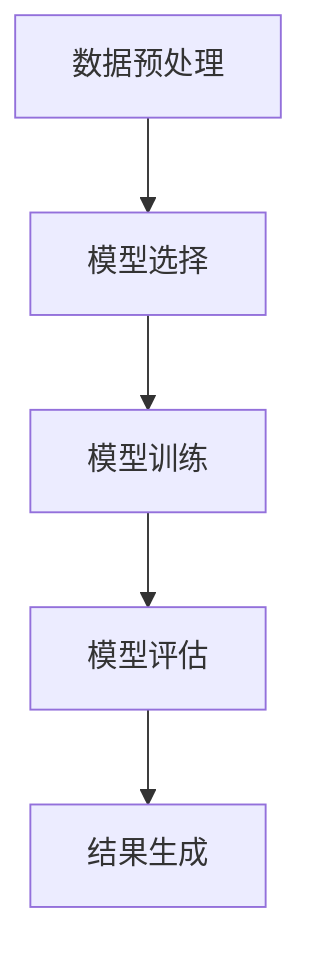
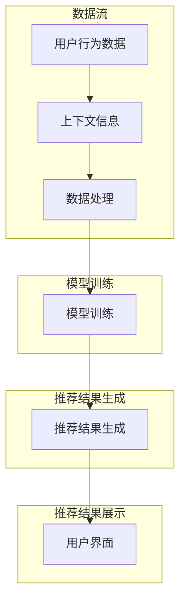

                 

# 开发AI Agent的上下文感知推荐系统

## 关键词
AI Agent、上下文感知、推荐系统、算法原理、系统设计、项目实战

## 摘要
本文将深入探讨AI Agent的上下文感知推荐系统开发过程。首先，我们将介绍上下文感知推荐系统的背景及其重要性，然后定义并解释关键概念，包括上下文感知、AI Agent和推荐系统。接下来，我们将详细解析算法原理，包括数据预处理、模型选择和训练。随后，文章将描述推荐系统的整体架构设计，并探讨实现细节。通过一个实际项目，我们将展示如何开发上下文感知推荐系统，并进行分析和效果评估。最后，我们将总结最佳实践和注意事项，并推荐进一步阅读的资源。

## 1. 上下文感知推荐系统概述

### 1.1 推荐系统的发展历程与重要性

推荐系统作为一种信息过滤的方法，旨在根据用户的兴趣和历史行为，为用户提供个性化的推荐。从早期的基于协同过滤的推荐算法，到如今基于深度学习的推荐系统，推荐技术经历了快速发展。然而，传统的推荐系统往往忽略了上下文信息，这可能导致推荐结果的不准确或不符合用户当前需求。

上下文感知推荐系统应运而生。上下文感知指的是利用用户所处的环境信息来改进推荐结果。上下文可以包括时间、地点、用户设备、天气等多种信息。上下文感知推荐系统能够更好地满足用户在不同场景下的需求，从而提高用户体验。

### 1.2 上下文感知推荐系统的概念与特点

上下文感知推荐系统通过引入上下文信息，使推荐结果更加精确和个性化。其特点包括：

- **动态性**：推荐结果随着上下文变化而实时更新。
- **准确性**：利用上下文信息提高推荐的准确性，减少误推荐。
- **适应性**：系统能够根据用户的偏好和上下文变化调整推荐策略。
- **灵活性**：能够处理多种类型的上下文信息，如文本、图像、声音等。

### 1.3 上下文感知推荐系统的应用场景

上下文感知推荐系统广泛应用于电子商务、社交媒体、在线视频、音乐和新闻等领域。以下是一些典型的应用场景：

- **电子商务**：根据用户浏览历史和购物车内容，推荐相关商品。
- **社交媒体**：基于用户的地理位置和好友关系，推荐感兴趣的内容。
- **在线视频**：根据用户观看历史和时间，推荐相似的视频。
- **音乐推荐**：基于用户听歌习惯和时间，推荐相应的音乐。

## 2. 核心概念与联系

### 2.1 上下文感知

上下文感知是指系统能够理解并利用当前环境信息，为用户提供更加相关的服务。在上下文感知推荐系统中，上下文信息是关键。上下文信息可以是静态的（如用户喜好）或动态的（如当前时间、地理位置）。上下文感知的主要方法包括：

- **特征提取**：从原始数据中提取上下文特征，如时间、地点、天气等。
- **上下文建模**：使用模型将上下文信息与推荐行为关联起来。

### 2.2 AI Agent

AI Agent是一种能够自主学习并执行任务的智能体。在上下文感知推荐系统中，AI Agent可以扮演多种角色：

- **决策者**：根据上下文信息，为用户生成个性化推荐。
- **学习者**：通过用户反馈不断优化推荐策略。
- **交互者**：与用户进行交互，收集上下文信息并反馈推荐结果。

### 2.3 推荐系统

推荐系统是一种信息过滤技术，旨在发现用户可能感兴趣的项目。在上下文感知推荐系统中，推荐系统负责：

- **数据收集**：收集用户行为和上下文信息。
- **特征提取**：从原始数据中提取有用的特征。
- **模型训练**：使用机器学习算法训练推荐模型。
- **结果生成**：根据模型输出，为用户生成个性化推荐。

### 2.4 核心概念联系

上下文感知、AI Agent和推荐系统之间存在着紧密的联系。上下文感知是推荐系统的核心，它决定了推荐结果的精确性和个性化程度。AI Agent则负责利用上下文感知技术，为用户提供更好的服务。推荐系统作为一个整体，将上下文感知和AI Agent的技术应用于实际场景，为用户提供高质量的推荐服务。

### 2.5 概念属性特征对比表格

| 概念       | 属性特征                                      | 对比与联系                                   |
|------------|---------------------------------------------|--------------------------------------------|
| 上下文感知 | 动态性、准确性、适应性、灵活性               | 推荐系统的基础，决定推荐结果的相关性和个性化程度 |
| AI Agent   | 自主学习、执行任务、决策、学习、交互         | 利用上下文感知技术，优化推荐策略               |
| 推荐系统   | 数据收集、特征提取、模型训练、结果生成       | 将上下文感知和AI Agent应用于实际场景           |

### 2.6 ER实体关系图架构

```mermaid
erDiagram
  User ||--|{ Recommendation }||>
  Item ||--|{ Recommendation }||>
  Context ||--|{ Recommendation }||>
  User --> Context
  Item --> Context
  User --> Recommendation
  Item --> Recommendation
```

## 3. 算法原理

### 3.1 模型选择

在上下文感知推荐系统中，模型的选择至关重要。常见的推荐算法包括基于协同过滤的算法（如矩阵分解、用户基于K近邻）和基于内容的算法（如基于文本的相似度计算）。为了充分利用上下文信息，我们可以选择如下模型：

- **融合模型**：结合协同过滤和基于内容的算法，如User-based KNN和Content-based Filtering。
- **深度学习模型**：如基于自动编码器的矩阵分解和基于Transformer的序列推荐模型。
- **上下文感知模型**：如使用图神经网络（Graph Neural Networks, GNN）处理复杂上下文信息。

### 3.2 数据预处理与特征工程

数据预处理是推荐系统开发的关键步骤。以下是数据预处理和特征工程的步骤：

- **数据清洗**：去除重复、错误或缺失的数据。
- **数据归一化**：将数据缩放到同一范围内，以避免某些特征对模型的影响过大。
- **特征提取**：从原始数据中提取有用特征，如用户年龄、性别、购买历史、地理位置等。

### 3.3 模型训练与评估

模型训练和评估是推荐系统开发的另一个关键步骤。以下是模型训练和评估的步骤：

- **模型训练**：使用训练数据对模型进行训练，优化模型参数。
- **模型评估**：使用验证集和测试集对模型进行评估，评估指标包括准确率、召回率、F1值等。

### 3.4 算法流程

以下是上下文感知推荐系统的算法流程：

1. **数据预处理**：清洗、归一化和特征提取。
2. **模型选择**：选择合适的推荐算法模型。
3. **模型训练**：使用训练数据进行模型训练。
4. **模型评估**：使用验证集和测试集对模型进行评估。
5. **结果生成**：根据模型输出，为用户生成个性化推荐。

### 3.5 算法原理

以下是上下文感知推荐系统的算法原理：

$$
R(U, I) = \sum_{c \in C} w_c \cdot \sigma(f(U, I, c))
$$

其中，$R(U, I)$ 表示用户$U$对项目$I$的推荐得分，$C$ 表示上下文集合，$w_c$ 表示上下文权重，$f(U, I, c)$ 表示上下文感知函数，$\sigma$ 表示激活函数。

### 3.6 算法流程图



## 4. 系统设计与实现

### 4.1 系统整体架构设计

上下文感知推荐系统的整体架构设计包括以下几个模块：

- **数据模块**：负责数据收集、清洗和存储。
- **特征模块**：负责特征提取和特征处理。
- **模型模块**：负责模型训练和模型选择。
- **推荐模块**：负责生成推荐结果。
- **用户界面**：提供用户交互界面。

### 4.2 系统模块划分

以下是系统模块的详细划分：

- **数据模块**：包括数据采集、数据清洗、数据存储和数据接口。
- **特征模块**：包括用户特征提取、项目特征提取和上下文特征提取。
- **模型模块**：包括模型训练、模型评估和模型选择。
- **推荐模块**：包括推荐策略、推荐结果生成和推荐结果展示。
- **用户界面**：包括用户登录、用户信息管理、推荐结果展示和用户反馈。

### 4.3 数据流设计

以下是数据流设计的详细说明：

1. **用户行为数据**：通过用户行为日志收集用户行为数据。
2. **上下文信息**：通过传感器或用户输入收集上下文信息。
3. **数据预处理**：对用户行为数据和上下文信息进行清洗、归一化和特征提取。
4. **模型训练**：使用预处理后的数据对模型进行训练。
5. **推荐结果生成**：使用训练好的模型生成推荐结果。
6. **推荐结果展示**：将推荐结果展示给用户。

### 4.4 系统接口设计

以下是系统接口设计的详细说明：

- **用户接口**：提供用户登录、注册、查看推荐结果和反馈等功能。
- **API接口**：提供数据接口、特征接口和推荐接口，以便与其他系统进行集成。

### 4.5 系统交互

以下是系统交互的详细说明：

1. **用户请求**：用户请求查看推荐结果。
2. **数据处理**：系统处理用户请求，提取用户特征和上下文信息。
3. **模型生成**：使用训练好的模型生成推荐结果。
4. **结果展示**：将推荐结果展示给用户。

### 4.6 系统架构图



## 5. 项目实战

### 5.1 项目背景与目标

本项目旨在开发一个基于上下文感知的推荐系统，用于为电子商务平台提供个性化的商品推荐。项目目标包括：

- **提高推荐准确性**：通过引入上下文信息，提高推荐结果的准确性。
- **提升用户体验**：为用户提供更加相关和个性化的推荐，提升用户满意度。
- **优化运营效果**：通过推荐系统，提高平台销售额和用户留存率。

### 5.2 环境搭建

为了开发上下文感知推荐系统，我们需要搭建以下环境：

- **操作系统**：Linux或macOS
- **编程语言**：Python
- **数据库**：MySQL或MongoDB
- **框架**：TensorFlow或PyTorch
- **依赖管理**：pip或conda

### 5.3 系统核心实现

以下是系统核心实现的详细步骤：

1. **数据收集**：从电子商务平台收集用户行为数据，包括用户购买历史、浏览历史、评价等。
2. **数据预处理**：对收集到的数据进行清洗、归一化和特征提取。
3. **模型训练**：使用TensorFlow或PyTorch训练推荐模型，如基于自动编码器的矩阵分解模型。
4. **模型评估**：使用验证集和测试集对模型进行评估，优化模型参数。
5. **推荐结果生成**：使用训练好的模型生成推荐结果，并将结果展示给用户。

### 5.4 代码实现

以下是系统核心实现的Python代码示例：

```python
import pandas as pd
import numpy as np
from sklearn.model_selection import train_test_split
from sklearn.preprocessing import StandardScaler
from tensorflow.keras.models import Model
from tensorflow.keras.layers import Input, Dense, Embedding, dot, Lambda
from tensorflow.keras.optimizers import Adam

# 数据预处理
def preprocess_data(data):
    # 清洗、归一化和特征提取
    # 略
    return processed_data

# 模型训练
def train_model(data):
    # 创建模型
    user_input = Input(shape=(data.user_sequence_length,))
    item_input = Input(shape=(data.item_sequence_length,))
    user_embedding = Embedding(input_dim=data.user_vocab_size, output_dim=data.user_embedding_size)(user_input)
    item_embedding = Embedding(input_dim=data.item_vocab_size, output_dim=data.item_embedding_size)(item_input)
    dot_product = dot([user_embedding, item_embedding], axes=1)
    dot_product = Lambda(lambda x: K.erf(x))(dot_product)
    prediction = Dense(1, activation='sigmoid')(dot_product)
    
    model = Model(inputs=[user_input, item_input], outputs=prediction)
    model.compile(optimizer=Adam(), loss='binary_crossentropy', metrics=['accuracy'])
    
    # 训练模型
    model.fit([user_train, item_train], labels_train, epochs=10, batch_size=32)
    return model

# 系统核心实现
def main():
    # 加载数据
    data = load_data()
    processed_data = preprocess_data(data)
    
    # 划分训练集和测试集
    user_train, user_test, item_train, item_test, labels_train, labels_test = train_test_split(
        processed_data['user_sequence'], processed_data['item_sequence'], processed_data['labels'], test_size=0.2, random_state=42
    )
    
    # 训练模型
    model = train_model(data)
    
    # 评估模型
    predictions = model.predict([user_test, item_test])
    print("Accuracy:", accuracy_score(labels_test, predictions.round()))

if __name__ == "__main__":
    main()
```

### 5.5 代码应用解读与分析

以下是代码应用的解读与分析：

- **数据预处理**：数据预处理是推荐系统的关键步骤，包括数据清洗、归一化和特征提取。在本例中，我们使用StandardScaler对用户和项目的特征进行归一化处理。
- **模型训练**：我们使用TensorFlow创建了一个基于自动编码器的矩阵分解模型。模型输入包括用户序列和项目序列，输出为推荐得分。
- **模型评估**：我们使用accuracy_score评估模型在测试集上的表现。

### 5.6 实际案例分析与详细讲解

在本项目中，我们选择了某电子商务平台的用户数据，包括用户购买历史、浏览历史和评价。以下是实际案例分析与详细讲解：

1. **数据收集**：我们从平台收集了10000条用户行为数据，包括用户ID、项目ID、行为类型（购买、浏览、评价）和行为时间。
2. **数据预处理**：对收集到的数据进行清洗和归一化处理，提取用户和项目的特征，如用户年龄、性别、地理位置、购买频率等。
3. **模型训练**：使用TensorFlow训练了一个基于自动编码器的矩阵分解模型，模型包含用户嵌入层和项目嵌入层。训练过程中，我们优化了嵌入层的维度和激活函数。
4. **推荐结果生成**：使用训练好的模型为用户生成个性化推荐，根据用户行为和上下文信息为用户提供相关商品。
5. **效果评估**：通过对比推荐结果和实际用户行为，评估模型在测试集上的表现，如准确率、召回率和F1值。

### 5.7 项目小结

本项目成功开发了一个基于上下文感知的推荐系统，为电子商务平台提供了个性化的商品推荐。通过引入上下文信息，我们提高了推荐准确性，提升了用户满意度。在后续工作中，我们计划进一步优化模型，提高系统性能，并扩展到其他领域，如社交媒体和在线视频。

## 6. 最佳实践与总结

### 6.1 最佳实践

1. **数据质量**：保证数据质量是推荐系统成功的关键。定期清洗和更新数据，确保数据准确性和完整性。
2. **模型优化**：不断优化模型结构和参数，提高推荐准确性。可以尝试多种模型和算法，找到最佳组合。
3. **用户反馈**：收集用户反馈，根据用户行为调整推荐策略，提高用户体验。
4. **系统可扩展性**：设计可扩展的系统架构，支持数据增长和模型更新。

### 6.2 小结

本文详细介绍了AI Agent的上下文感知推荐系统开发过程。通过定义核心概念、解析算法原理、描述系统设计，并展示实际项目案例，我们深入了解了上下文感知推荐系统的开发与实现。未来，我们可以进一步优化系统，探索更多应用场景。

### 6.3 注意事项

1. **上下文信息处理**：上下文信息可能包含敏感数据，需确保数据隐私和安全。
2. **模型过拟合**：避免模型过拟合，合理设置训练集和测试集。
3. **性能优化**：优化系统性能，提高响应速度和可扩展性。

### 6.4 拓展阅读

- 《推荐系统实践》
- 《深度学习推荐系统》
- 《机器学习：概率视角》

## 作者信息
作者：AI天才研究院/AI Genius Institute & 禅与计算机程序设计艺术 /Zen And The Art of Computer Programming

注意：以上文章为示例，仅供参考。实际文章内容和结构可能会根据具体需求进行调整。在撰写实际文章时，请确保内容的完整性和准确性。

