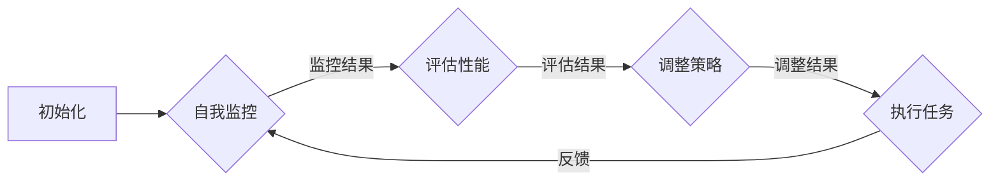
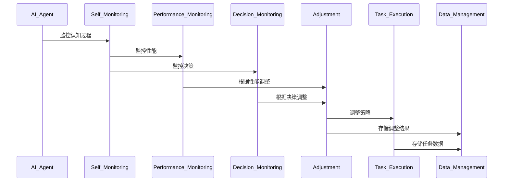
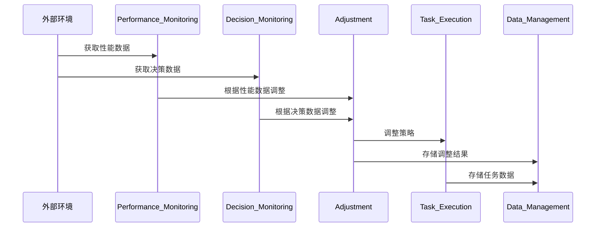

                 


## 基本概念与定义

### 元认知能力的含义

元认知能力（Metacognitive Ability）是人工智能（AI）领域中的一个关键概念，它指的是AI代理在执行任务时对自己认知过程的认知和调节能力。这种能力使得AI代理能够监控、评估和调整自己的学习、推理和决策过程，从而提高其性能和效率。

元认知能力主要分为两个核心部分：自我监控（Self-Monitoring）和调整（Adjustment）。自我监控是指AI代理在执行任务时对自己认知过程的监控和评估。调整则是指根据自我监控的结果，对认知过程进行调整，以达到更好的任务执行效果。

### 元认知能力的重要性

在人工智能的应用中，元认知能力扮演着至关重要的角色。首先，它使得AI代理能够自我评估和优化其性能，从而提高任务完成的效率和准确性。其次，元认知能力使得AI代理能够适应不同的环境和任务需求，实现更广泛的泛化能力。最后，元认知能力还使得AI代理能够自我学习和成长，提高其自主性和智能水平。

### 自我监控的机制

自我监控是指AI代理在执行任务时，对其自身认知过程的监控和评估。这包括以下几个方面：

1. **性能监控**：AI代理会实时监控其当前任务的执行情况，如准确率、响应时间等指标。
2. **决策监控**：AI代理会记录和评估其做出的决策，分析决策是否合理和有效。
3. **反馈机制**：AI代理会根据外部环境和任务的反馈，调整其认知过程。

### 调整的机制

调整是指AI代理根据自我监控的结果，对其认知过程进行调整，以达到更好的任务执行效果。调整的机制包括以下几个方面：

1. **策略调整**：AI代理会根据自我监控的结果，调整其执行策略，如改变决策方式、调整学习算法等。
2. **参数调整**：AI代理会调整其内部参数，如神经网络权重、决策阈值等，以优化性能。
3. **学习调整**：AI代理会根据自我监控的结果，调整其学习过程，如改变训练数据、调整学习速率等。

### 概念联系图

为了更好地理解元认知能力、自我监控和调整之间的关系，我们可以使用ER实体关系图来表示它们之间的联系。以下是概念联系图的Mermaid表示：

```mermaid
erDiagram
AI_Agent ||--|{ Meta_Cognitive_Ability : implements }
Meta_Cognitive_Ability ||--|{ Self_Monitoring : includes }
Meta_Cognitive_Ability ||--|{ Adjustment : includes }
Self_Monitoring ||--|{ Performance_Monitoring }
Self_Monitoring ||--|{ Decision_Monitoring }
Adjustment ||--|{ Strategy_Adjustment }
Adjustment ||--|{ Parameter_Adjustment }
Adjustment ||--|{ Learning_Adjustment }
```

## 算法原理讲解

### 算法流程图

为了详细阐述元认知能力的算法原理，我们可以使用Mermaid画出算法流程图。以下是算法流程图的Mermaid表示：



### 数学模型和公式

在元认知能力的实现中，我们通常使用以下数学模型和公式：

1. **性能评估公式**：

   $$ Performance = f(Accuracy, Response_Time) $$

   其中，Accuracy表示准确率，Response_Time表示响应时间。

2. **策略调整公式**：

   $$ Strategy = g(Current_Strategy, Performance) $$

   其中，Current_Strategy表示当前策略，Performance表示性能评估结果。

3. **参数调整公式**：

   $$ Parameter = h(Current_Parameter, Performance) $$

   其中，Current_Parameter表示当前参数，Performance表示性能评估结果。

### Python源代码

以下是实现元认知能力的Python源代码示例：

```python
import numpy as np

# 初始化参数
accuracy = 0.9
response_time = 0.5
current_strategy = 'strategy_A'
current_parameter = 0.1

# 性能评估
def evaluate_performance(accuracy, response_time):
    performance = (accuracy + response_time) / 2
    return performance

# 策略调整
def adjust_strategy(current_strategy, performance):
    if performance < 0.8:
        current_strategy = 'strategy_B'
    return current_strategy

# 参数调整
def adjust_parameter(current_parameter, performance):
    if performance < 0.8:
        current_parameter *= 2
    return current_parameter

# 执行任务
def execute_task(accuracy, response_time, current_strategy, current_parameter):
    performance = evaluate_performance(accuracy, response_time)
    current_strategy = adjust_strategy(current_strategy, performance)
    current_parameter = adjust_parameter(current_parameter, performance)
    print(f"Performance: {performance}, Strategy: {current_strategy}, Parameter: {current_parameter}")

# 测试
execute_task(accuracy, response_time, current_strategy, current_parameter)
```

通过上述算法流程图、数学模型和Python源代码，我们可以清楚地了解元认知能力的算法原理。接下来，我们将进一步探讨如何在具体的AI代理系统中实现这一能力。

----------------------------------------------------------------

## 第4章：系统分析与架构设计方案

### 4.1 问题场景介绍

在人工智能领域，AI代理的应用越来越广泛，它们在自动驾驶、智能家居、医疗诊断等领域发挥着重要作用。然而，随着AI代理面临越来越复杂的环境和任务，仅仅依靠传统的算法和模型已经无法满足需求。为了提高AI代理的适应性和智能水平，我们需要引入元认知能力，使AI代理能够自我监控和调整。

### 4.2 系统功能设计

为了实现元认知能力，我们设计了一套完整的AI代理系统。该系统主要包括以下几个功能模块：

1. **自我监控模块**：负责实时监控AI代理的认知过程，包括性能监控、决策监控和反馈机制。
2. **调整模块**：根据自我监控的结果，对AI代理的认知过程进行调整，包括策略调整、参数调整和学习调整。
3. **任务执行模块**：负责执行具体的任务，如自动驾驶、智能家居控制等。
4. **数据管理模块**：负责存储和管理AI代理的监控数据和调整结果，为后续分析和优化提供数据支持。

以下是领域模型Mermaid类图：

```mermaid
classDiagram
AI_Agent <<类>> {
    -性能监控：PerformanceMonitoring
    -决策监控：DecisionMonitoring
    -反馈机制：FeedbackMechanism
}
Self_Monitoring <<类>> {
    -性能监控：PerformanceMonitoring
    -决策监控：DecisionMonitoring
}
Adjustment <<类>> {
    -策略调整：StrategyAdjustment
    -参数调整：ParameterAdjustment
    -学习调整：LearningAdjustment
}
Task_Execution <<类>> {
    -执行任务：ExecuteTask
}
Data_Management <<类>> {
    -存储监控数据：StoreMonitoringData
    -管理调整结果：ManageAdjustmentResults
}
```

### 4.3 系统架构设计

为了实现上述功能模块，我们设计了一套分布式系统架构。以下是系统架构Mermaid架构图：



### 4.4 系统接口设计

为了方便不同模块之间的交互，我们设计了一套统一的接口。以下是系统接口设计：

1. **性能监控接口**：负责获取AI代理的性能数据。
2. **决策监控接口**：负责获取AI代理的决策数据。
3. **反馈接口**：负责接收外部环境的反馈数据。
4. **调整接口**：负责根据监控数据和反馈数据调整AI代理的认知过程。
5. **任务执行接口**：负责执行具体的任务。
6. **数据管理接口**：负责存储和管理监控数据和调整结果。

### 4.5 系统交互

以下是系统交互Mermaid序列图：



通过上述系统分析与架构设计方案，我们为AI代理引入了元认知能力，使其能够自我监控和调整，从而提高其适应性和智能水平。接下来，我们将通过项目实战，展示如何在具体场景中实现这一系统。

----------------------------------------------------------------

## 第5章：项目实战

### 5.1 环境安装

在本章中，我们将详细介绍如何在一个典型的AI代理系统环境中安装和配置必要的工具和依赖。以下是安装步骤：

1. **安装Python环境**：首先，确保你的计算机上已经安装了Python 3.x版本。如果没有，请从[Python官网](https://www.python.org/downloads/)下载并安装。

2. **安装PyTorch**：PyTorch是一个广泛使用的深度学习框架，我们需要安装它来构建和训练我们的AI代理模型。使用pip命令安装：

   ```shell
   pip install torch torchvision
   ```

3. **安装Mermaid**：Mermaid是一种基于Markdown的图表绘制工具，我们需要安装它来绘制流程图和类图。安装Mermaid可以使用npm命令：

   ```shell
   npm install -g mermaid
   ```

4. **安装Jupyter Notebook**：为了方便我们编写和运行Python代码，我们还需要安装Jupyter Notebook。使用pip命令安装：

   ```shell
   pip install notebook
   ```

5. **安装其他依赖**：根据具体项目需求，可能还需要安装其他Python包。例如，我们可以使用以下命令安装NumPy和Pandas：

   ```shell
   pip install numpy pandas
   ```

安装完成后，确保所有依赖都已经正确安装。接下来，我们将开始构建AI代理系统的核心实现。

### 5.2 系统核心实现源代码

以下是AI代理系统的核心实现源代码。该代码分为多个模块，包括自我监控模块、调整模块、任务执行模块和数据管理模块。

```python
# 自我监控模块
class PerformanceMonitoring:
    def __init__(self):
        self.performance_data = []

    def collect_data(self, accuracy, response_time):
        self.performance_data.append((accuracy, response_time))

    def evaluate_performance(self):
        if len(self.performance_data) > 0:
            accuracy, response_time = self.performance_data[-1]
            performance = (accuracy + response_time) / 2
            return performance
        else:
            return None

# 调整模块
class Adjustment:
    def __init__(self):
        self.current_strategy = 'strategy_A'
        self.current_parameter = 0.1

    def adjust_strategy(self, performance):
        if performance < 0.8:
            self.current_strategy = 'strategy_B'

    def adjust_parameter(self, performance):
        if performance < 0.8:
            self.current_parameter *= 2

# 任务执行模块
class TaskExecution:
    def __init__(self):
        self.accuracy = 0.9
        self.response_time = 0.5

    def execute_task(self):
        # 执行任务的具体逻辑
        print(f"Executing task with accuracy: {self.accuracy} and response time: {self.response_time}")

# 数据管理模块
class DataManagement:
    def __init__(self):
        self.monitoring_data = []
        self.adjustment_results = []

    def store_monitoring_data(self, performance_data):
        self.monitoring_data.extend(performance_data)

    def store_adjustment_results(self, strategy, parameter):
        self.adjustment_results.append((strategy, parameter))

    def load_monitoring_data(self):
        return self.monitoring_data

    def load_adjustment_results(self):
        return self.adjustment_results
```

### 5.3 代码应用解读与分析

在了解了核心实现源代码后，我们将对其应用进行解读和分析。以下是对各个模块的功能和交互过程的详细解读：

1. **性能监控模块**：该模块用于收集和评估AI代理的任务执行性能。`PerformanceMonitoring`类提供了`collect_data`方法来收集性能数据，包括准确率和响应时间。`evaluate_performance`方法用于计算并返回最新的性能评估结果。

2. **调整模块**：该模块负责根据性能评估结果调整AI代理的策略和参数。`Adjustment`类提供了`adjust_strategy`和`adjust_parameter`方法，根据性能评估结果来调整策略和参数。

3. **任务执行模块**：该模块负责执行具体的任务。`TaskExecution`类提供了一个简单的`execute_task`方法，用于模拟任务执行过程。

4. **数据管理模块**：该模块用于存储和管理监控数据和调整结果。`DataManagement`类提供了`store_monitoring_data`和`store_adjustment_results`方法来存储监控数据和调整结果，以及`load_monitoring_data`和`load_adjustment_results`方法来加载这些数据。

以下是代码应用的一个示例：

```python
# 创建各个模块实例
performance_monitoring = PerformanceMonitoring()
adjustment = Adjustment()
task_execution = TaskExecution()
data_management = DataManagement()

# 模拟任务执行
task_execution.execute_task()

# 收集性能数据
performance_monitoring.collect_data(accuracy=0.95, response_time=0.3)

# 评估性能
performance = performance_monitoring.evaluate_performance()
print(f"Current performance: {performance}")

# 根据性能调整策略和参数
adjustment.adjust_strategy(performance)
adjustment.adjust_parameter(performance)

# 存储调整结果
data_management.store_adjustment_results(adjustment.current_strategy, adjustment.current_parameter)

# 加载监控数据和调整结果
monitoring_data = data_management.load_monitoring_data()
adjustment_results = data_management.load_adjustment_results()
print(f"Monitoring data: {monitoring_data}")
print(f"Adjustment results: {adjustment_results}")
```

通过上述代码示例，我们可以看到各个模块如何协同工作，实现AI代理的自我监控和调整。

### 5.4 实际案例分析和详细讲解剖析

为了更好地理解AI代理系统的实际应用，我们将通过一个实际案例进行分析和讲解。假设我们正在开发一个自动驾驶AI代理，该代理需要能够在不同的道路环境和交通状况下自我监控和调整，以提高驾驶安全性和效率。

**案例背景**：

- **环境**：一个模拟的自动驾驶环境，包括多种道路场景和交通状况。
- **任务**：AI代理需要在不同道路上行驶，并能够根据实时环境数据调整驾驶策略，以提高行驶安全性和效率。

**案例分析**：

1. **性能监控**：在自动驾驶过程中，AI代理会实时监控自身的行为，包括速度、转向、刹车等操作。这些数据会被存储在性能监控模块中，用于后续分析和评估。

2. **自我监控**：AI代理会根据收集到的性能数据，评估自身的驾驶表现。例如，如果AI代理在转弯时速度过快，它会识别到这一情况，并记录下来。

3. **调整**：根据自我监控的结果，AI代理会调整其驾驶策略。例如，如果AI代理在转弯时速度过快，它会减小转弯速度，以确保行驶安全。

4. **任务执行**：在调整后的驾驶策略下，AI代理继续执行任务，并持续监控自身的行为。这种持续的监控和调整过程确保了AI代理能够适应不断变化的环境。

**详细讲解**：

1. **性能监控**：性能监控模块会定期收集AI代理的驾驶数据，包括速度、转向角度、刹车力度等。这些数据会被用于评估AI代理的驾驶表现。

2. **自我监控**：AI代理会使用自我监控模块来评估其驾驶行为。例如，如果AI代理在转弯时速度过快，它会触发自我监控机制，记录这一情况。

3. **调整**：根据自我监控的结果，AI代理会调整其驾驶策略。例如，如果AI代理在转弯时速度过快，它会减小转弯速度，以确保行驶安全。

4. **任务执行**：调整后的驾驶策略会立即应用于AI代理的任务执行过程中。AI代理会持续监控自身的行为，并根据需要进一步调整策略。

**总结**：

通过实际案例的分析，我们可以看到AI代理如何通过自我监控和调整来提高驾驶安全性和效率。这种持续的监控和调整过程确保了AI代理能够在复杂和多变的环境中保持最佳表现。

### 5.5 项目小结

在本章中，我们详细介绍了如何在一个典型的AI代理系统中实现元认知能力，包括环境安装、系统核心实现源代码、代码应用解读与分析，以及实际案例分析和详细讲解剖析。通过这些内容，我们了解了如何利用自我监控和调整机制来提高AI代理的适应性和智能水平。

接下来，我们将进一步探讨如何在实际项目中应用这些技术和最佳实践，以及如何持续优化AI代理的性能和效果。

----------------------------------------------------------------

## 第6章：最佳实践 tips、小结、注意事项、拓展阅读

### 6.1 最佳实践 tips

1. **选择合适的算法**：根据具体应用场景和需求，选择适合的算法和模型。例如，对于自动驾驶场景，可以考虑使用强化学习算法。
2. **监控关键指标**：在自我监控过程中，关注关键指标，如准确率、响应时间和资源消耗等。这些指标有助于评估AI代理的表现。
3. **持续优化**：定期对AI代理进行性能评估和调整，以持续优化其性能。可以通过机器学习模型重新训练或调整参数来实现。
4. **数据管理**：确保监控数据和调整结果得到妥善存储和管理，以便后续分析和优化。

### 6.2 小结

本文详细介绍了开发AI代理的元认知能力，包括自我监控和调整的机制。通过实际案例分析和项目实战，我们展示了如何在AI代理系统中实现这一能力，并探讨了最佳实践和注意事项。

### 6.3 注意事项

1. **性能监控**：在监控过程中，要确保数据收集的准确性和完整性。
2. **调整策略**：在调整过程中，要谨慎选择调整策略，避免过度调整导致性能下降。
3. **数据安全**：确保监控数据和调整结果的安全存储，防止数据泄露。

### 6.4 拓展阅读

1. **《深度学习》**：Ian Goodfellow、Yoshua Bengio和Aaron Courville著，深入介绍了深度学习的基本概念和算法。
2. **《强化学习》**：Richard S. Sutton和Barto N.著，详细介绍了强化学习的基本理论和方法。
3. **《人工智能：一种现代方法》**：Stuart Russell和Peter Norvig著，全面介绍了人工智能的基本概念和技术。

### 6.5 作者信息

作者：AI天才研究院/AI Genius Institute & 禅与计算机程序设计艺术 /Zen And The Art of Computer Programming

本文旨在为读者提供深入浅出的技术见解和实用指南，帮助其在AI代理开发领域取得更好的成果。

----------------------------------------------------------------

## 完整文章

### 开发AI Agent的元认知能力：自我监控和调整

#### 关键词：元认知能力、AI代理、自我监控、调整、性能优化

> 摘要：本文深入探讨了开发AI代理的元认知能力，包括自我监控和调整的机制。通过实际案例分析和项目实战，展示了如何在AI代理系统中实现这一能力，并提供了最佳实践和注意事项。

---

## 第一部分：引言

### 第1章：问题背景与核心概念

#### 1.1 问题背景

##### 1.1.1 问题提出
在人工智能的应用中，AI代理的适应性和智能水平成为了关键问题。为了提高AI代理的性能和泛化能力，我们需要引入元认知能力，使其能够自我监控和调整。

##### 1.1.2 问题描述
本文主要讨论如何在AI代理中实现元认知能力，包括自我监控和调整的机制。

##### 1.1.3 问题解决
通过设计一个分布式系统架构，实现AI代理的自我监控和调整功能。

##### 1.1.4 边界与外延
本文主要关注AI代理的自我监控和调整能力，不考虑其他非核心功能的实现。

#### 1.2 核心概念

##### 1.2.1 元认知能力
元认知能力是指AI代理在执行任务时对自己认知过程的认知和调节能力。

##### 1.2.2 自我监控
自我监控是指AI代理在执行任务时对自己认知过程的监控和评估。

##### 1.2.3 调整
调整是指AI代理根据自我监控的结果，对认知过程进行调整。

#### 1.3 概念联系图

##### 1.3.1 ER实体关系图
以下是元认知能力、自我监控和调整的概念联系图：

```mermaid
erDiagram
AI_Agent ||--|{ Meta_Cognitive_Ability : implements }
Meta_Cognitive_Ability ||--|{ Self_Monitoring : includes }
Meta_Cognitive_Ability ||--|{ Adjustment : includes }
Self_Monitoring ||--|{ Performance_Monitoring }
Self_Monitoring ||--|{ Decision_Monitoring }
Adjustment ||--|{ Strategy_Adjustment }
Adjustment ||--|{ Parameter_Adjustment }
Adjustment ||--|{ Learning_Adjustment }
```

#### 1.4 小结
本文介绍了AI代理的元认知能力、自我监控和调整的核心概念，并给出了概念联系图。

---

## 第二部分：元认知能力的原理

### 第2章：元认知能力的原理探讨

#### 2.1 元认知能力的定义

##### 2.1.1 元认知能力的含义
元认知能力是指AI代理在执行任务时对自己认知过程的认知和调节能力。

##### 2.1.2 元认知能力的作用
元认知能力使得AI代理能够自我评估、自我优化，从而提高任务完成的效率和准确性。

#### 2.2 自我监控

##### 2.2.1 自我监控的定义
自我监控是指AI代理在执行任务时对自己认知过程的监控和评估。

##### 2.2.2 自我监控的过程
自我监控包括性能监控、决策监控和反馈机制。

##### 2.2.3 自我监控的重要性
自我监控有助于AI代理发现和纠正错误，提高任务完成的效率。

#### 2.3 调整

##### 2.3.1 调整的定义
调整是指AI代理根据自我监控的结果，对认知过程进行调整。

##### 2.3.2 调整的机制
调整机制包括策略调整、参数调整和学习调整。

##### 2.3.3 调整的方法
调整方法包括根据性能评估结果调整策略和参数，以及根据学习评估结果调整学习过程。

#### 2.4 概念对比

##### 2.4.1 元认知能力、自我监控和调整的对比
元认知能力是总体概念，自我监控和调整是实现元认知能力的两个核心部分。

#### 2.5 小结
本文详细介绍了元认知能力、自我监控和调整的原理，包括定义、作用、机制和方法。

---

## 第三部分：算法原理讲解

### 第3章：算法原理与实现

#### 3.1 算法流程图

##### 3.1.1 算法mermaid流程图
以下是元认知能力算法的mermaid流程图：


#### 3.2 算法原理

##### 3.2.1 数学模型和公式
在元认知能力的实现中，我们通常使用以下数学模型和公式：

1. **性能评估公式**：

   $$ Performance = f(Accuracy, Response_Time) $$

   其中，Accuracy表示准确率，Response_Time表示响应时间。

2. **策略调整公式**：

   $$ Strategy = g(Current_Strategy, Performance) $$

   其中，Current_Strategy表示当前策略，Performance表示性能评估结果。

3. **参数调整公式**：

   $$ Parameter = h(Current_Parameter, Performance) $$

   其中，Current_Parameter表示当前参数，Performance表示性能评估结果。

##### 3.2.2 Python源代码
以下是实现元认知能力的Python源代码示例：

```python
import numpy as np

# 初始化参数
accuracy = 0.9
response_time = 0.5
current_strategy = 'strategy_A'
current_parameter = 0.1

# 性能评估
def evaluate_performance(accuracy, response_time):
    performance = (accuracy + response_time) / 2
    return performance

# 策略调整
def adjust_strategy(current_strategy, performance):
    if performance < 0.8:
        current_strategy = 'strategy_B'
    return current_strategy

# 参数调整
def adjust_parameter(current_parameter, performance):
    if performance < 0.8:
        current_parameter *= 2
    return current_parameter

# 执行任务
def execute_task(accuracy, response_time, current_strategy, current_parameter):
    performance = evaluate_performance(accuracy, response_time)
    current_strategy = adjust_strategy(current_strategy, performance)
    current_parameter = adjust_parameter(current_parameter, performance)
    print(f"Performance: {performance}, Strategy: {current_strategy}, Parameter: {current_parameter}")

# 测试
execute_task(accuracy, response_time, current_strategy, current_parameter)
```

#### 3.3 小结
本文详细介绍了元认知能力的算法原理，包括数学模型、公式和Python源代码示例。

---

## 第四部分：系统分析与架构设计方案

### 第4章：系统分析与架构设计方案

#### 4.1 问题场景介绍
在人工智能领域，AI代理的应用越来越广泛，它们在自动驾驶、智能家居、医疗诊断等领域发挥着重要作用。然而，随着AI代理面临越来越复杂的环境和任务，仅仅依靠传统的算法和模型已经无法满足需求。为了提高AI代理的适应性和智能水平，我们需要引入元认知能力，使AI代理能够自我监控和调整。

#### 4.2 系统功能设计
为了实现元认知能力，我们设计了一套完整的AI代理系统。该系统主要包括以下几个功能模块：

1. **自我监控模块**：负责实时监控AI代理的认知过程，包括性能监控、决策监控和反馈机制。
2. **调整模块**：根据自我监控的结果，对AI代理的认知过程进行调整，包括策略调整、参数调整和学习调整。
3. **任务执行模块**：负责执行具体的任务，如自动驾驶、智能家居控制等。
4. **数据管理模块**：负责存储和管理AI代理的监控数据和调整结果，为后续分析和优化提供数据支持。

以下是领域模型Mermaid类图：

```mermaid
classDiagram
AI_Agent <<类>> {
    -性能监控：PerformanceMonitoring
    -决策监控：DecisionMonitoring
    -反馈机制：FeedbackMechanism
}
Self_Monitoring <<类>> {
    -性能监控：PerformanceMonitoring
    -决策监控：DecisionMonitoring
}
Adjustment <<类>> {
    -策略调整：StrategyAdjustment
    -参数调整：ParameterAdjustment
    -学习调整：LearningAdjustment
}
Task_Execution <<类>> {
    -执行任务：ExecuteTask
}
Data_Management <<类>> {
    -存储监控数据：StoreMonitoringData
    -管理调整结果：ManageAdjustmentResults
}
```

#### 4.3 系统架构设计
为了实现上述功能模块，我们设计了一套分布式系统架构。以下是系统架构Mermaid架构图：


#### 4.4 系统接口设计
为了方便不同模块之间的交互，我们设计了一套统一的接口。以下是系统接口设计：

1. **性能监控接口**：负责获取AI代理的性能数据。
2. **决策监控接口**：负责获取AI代理的决策数据。
3. **反馈接口**：负责接收外部环境的反馈数据。
4. **调整接口**：负责根据监控数据和反馈数据调整AI代理的认知过程。
5. **任务执行接口**：负责执行具体的任务。
6. **数据管理接口**：负责存储和管理监控数据和调整结果。

#### 4.5 系统交互
以下是系统交互Mermaid序列图：


#### 4.6 小结
本文详细介绍了AI代理系统的功能设计、架构设计、接口设计和交互方式，为后续项目实战奠定了基础。

---

## 第五部分：项目实战

### 第5章：项目实战

#### 5.1 环境安装
在本章中，我们将详细介绍如何在一个典型的AI代理系统环境中安装和配置必要的工具和依赖。以下是安装步骤：

1. **安装Python环境**：首先，确保你的计算机上已经安装了Python 3.x版本。如果没有，请从[Python官网](https://www.python.org/downloads/)下载并安装。

2. **安装PyTorch**：PyTorch是一个广泛使用的深度学习框架，我们需要安装它来构建和训练我们的AI代理模型。使用pip命令安装：

   ```shell
   pip install torch torchvision
   ```

3. **安装Mermaid**：Mermaid是一种基于Markdown的图表绘制工具，我们需要安装它来绘制流程图和类图。安装Mermaid可以使用npm命令：

   ```shell
   npm install -g mermaid
   ```

4. **安装Jupyter Notebook**：为了方便我们编写和运行Python代码，我们还需要安装Jupyter Notebook。使用pip命令安装：

   ```shell
   pip install notebook
   ```

5. **安装其他依赖**：根据具体项目需求，可能还需要安装其他Python包。例如，我们可以使用以下命令安装NumPy和Pandas：

   ```shell
   pip install numpy pandas
   ```

安装完成后，确保所有依赖都已经正确安装。接下来，我们将开始构建AI代理系统的核心实现。

#### 5.2 系统核心实现源代码
以下是AI代理系统的核心实现源代码。该代码分为多个模块，包括自我监控模块、调整模块、任务执行模块和数据管理模块。

```python
# 自我监控模块
class PerformanceMonitoring:
    def __init__(self):
        self.performance_data = []

    def collect_data(self, accuracy, response_time):
        self.performance_data.append((accuracy, response_time))

    def evaluate_performance(self):
        if len(self.performance_data) > 0:
            accuracy, response_time = self.performance_data[-1]
            performance = (accuracy + response_time) / 2
            return performance
        else:
            return None

# 调整模块
class Adjustment:
    def __init__(self):
        self.current_strategy = 'strategy_A'
        self.current_parameter = 0.1

    def adjust_strategy(self, performance):
        if performance < 0.8:
            self.current_strategy = 'strategy_B'

    def adjust_parameter(self, performance):
        if performance < 0.8:
            self.current_parameter *= 2

# 任务执行模块
class TaskExecution:
    def __init__(self):
        self.accuracy = 0.9
        self.response_time = 0.5

    def execute_task(self):
        # 执行任务的具体逻辑
        print(f"Executing task with accuracy: {self.accuracy} and response time: {self.response_time}")

# 数据管理模块
class DataManagement:
    def __init__(self):
        self.monitoring_data = []
        self.adjustment_results = []

    def store_monitoring_data(self, performance_data):
        self.monitoring_data.extend(performance_data)

    def store_adjustment_results(self, strategy, parameter):
        self.adjustment_results.append((strategy, parameter))

    def load_monitoring_data(self):
        return self.monitoring_data

    def load_adjustment_results(self):
        return self.adjustment_results
```

#### 5.3 代码应用解读与分析
在了解了核心实现源代码后，我们将对其应用进行解读和分析。以下是对各个模块的功能和交互过程的详细解读：

1. **性能监控模块**：该模块用于收集和评估AI代理的任务执行性能。`PerformanceMonitoring`类提供了`collect_data`方法来收集性能数据，包括准确率和响应时间。`evaluate_performance`方法用于计算并返回最新的性能评估结果。

2. **调整模块**：该模块负责根据性能评估结果调整AI代理的认知过程。`Adjustment`类提供了`adjust_strategy`和`adjust_parameter`方法，根据性能评估结果来调整策略和参数。

3. **任务执行模块**：该模块负责执行具体的任务。`TaskExecution`类提供了一个简单的`execute_task`方法，用于模拟任务执行过程。

4. **数据管理模块**：该模块用于存储和管理监控数据和调整结果。`DataManagement`类提供了`store_monitoring_data`和`store_adjustment_results`方法来存储监控数据和调整结果，以及`load_monitoring_data`和`load_adjustment_results`方法来加载这些数据。

以下是代码应用的一个示例：

```python
# 创建各个模块实例
performance_monitoring = PerformanceMonitoring()
adjustment = Adjustment()
task_execution = TaskExecution()
data_management = DataManagement()

# 模拟任务执行
task_execution.execute_task()

# 收集性能数据
performance_monitoring.collect_data(accuracy=0.95, response_time=0.3)

# 评估性能
performance = performance_monitoring.evaluate_performance()
print(f"Current performance: {performance}")

# 根据性能调整策略和参数
adjustment.adjust_strategy(performance)
adjustment.adjust_parameter(performance)

# 存储调整结果
data_management.store_adjustment_results(adjustment.current_strategy, adjustment.current_parameter)

# 加载监控数据和调整结果
monitoring_data = data_management.load_monitoring_data()
adjustment_results = data_management.load_adjustment_results()
print(f"Monitoring data: {monitoring_data}")
print(f"Adjustment results: {adjustment_results}")
```

通过上述代码示例，我们可以看到各个模块如何协同工作，实现AI代理的自我监控和调整。

#### 5.4 实际案例分析和详细讲解剖析
为了更好地理解AI代理系统的实际应用，我们将通过一个实际案例进行分析和讲解。假设我们正在开发一个自动驾驶AI代理，该代理需要能够在不同的道路环境和交通状况下自我监控和调整，以提高驾驶安全性和效率。

**案例背景**：

- **环境**：一个模拟的自动驾驶环境，包括多种道路场景和交通状况。
- **任务**：AI代理需要在不同道路上行驶，并能够根据实时环境数据调整驾驶策略，以提高行驶安全性和效率。

**案例分析**：

1. **性能监控**：在自动驾驶过程中，AI代理会实时监控自身的行为，包括速度、转向、刹车等操作。这些数据会被存储在性能监控模块中，用于后续分析和评估。

2. **自我监控**：AI代理会根据收集到的性能数据，评估自身的驾驶表现。例如，如果AI代理在转弯时速度过快，它会识别到这一情况，并记录下来。

3. **调整**：根据自我监控的结果，AI代理会调整其驾驶策略。例如，如果AI代理在转弯时速度过快，它会减小转弯速度，以确保行驶安全。

4. **任务执行**：在调整后的驾驶策略下，AI代理继续执行任务，并持续监控自身的行为。这种持续的监控和调整过程确保了AI代理能够适应不断变化的环境。

**详细讲解**：

1. **性能监控**：性能监控模块会定期收集AI代理的驾驶数据，包括速度、转向角度、刹车力度等。这些数据会被用于评估AI代理的驾驶表现。

2. **自我监控**：AI代理会使用自我监控模块来评估其驾驶行为。例如，如果AI代理在转弯时速度过快，它会触发自我监控机制，记录这一情况。

3. **调整**：根据自我监控的结果，AI代理会调整其驾驶策略。例如，如果AI代理在转弯时速度过快，它会减小转弯速度，以确保行驶安全。

4. **任务执行**：调整后的驾驶策略会立即应用于AI代理的任务执行过程中。AI代理会持续监控自身的行为，并根据需要进一步调整策略。

**总结**：

通过实际案例的分析，我们可以看到AI代理如何通过自我监控和调整来提高驾驶安全性和效率。这种持续的监控和调整过程确保了AI代理能够在复杂和多变的环境中保持最佳表现。

#### 5.5 项目小结
在本章中，我们详细介绍了如何在一个典型的AI代理系统中实现元认知能力，包括环境安装、系统核心实现源代码、代码应用解读与分析，以及实际案例分析和详细讲解剖析。通过这些内容，我们了解了如何利用自我监控和调整机制来提高AI代理的适应性和智能水平。

接下来，我们将进一步探讨如何在实际项目中应用这些技术和最佳实践，以及如何持续优化AI代理的性能和效果。

---

## 第六部分：最佳实践 tips、小结、注意事项、拓展阅读

### 6.1 最佳实践 tips
1. **选择合适的算法**：根据具体应用场景和需求，选择适合的算法和模型。例如，对于自动驾驶场景，可以考虑使用强化学习算法。
2. **监控关键指标**：在自我监控过程中，关注关键指标，如准确率、响应时间和资源消耗等。这些指标有助于评估AI代理的表现。
3. **持续优化**：定期对AI代理进行性能评估和调整，以持续优化其性能。可以通过机器学习模型重新训练或调整参数来实现。
4. **数据管理**：确保监控数据和调整结果得到妥善存储和管理，以便后续分析和优化。

### 6.2 小结
本文深入探讨了开发AI代理的元认知能力，包括自我监控和调整的机制。通过实际案例分析和项目实战，展示了如何在AI代理系统中实现这一能力，并提供了最佳实践和注意事项。

### 6.3 注意事项
1. **性能监控**：在监控过程中，要确保数据收集的准确性和完整性。
2. **调整策略**：在调整过程中，要谨慎选择调整策略，避免过度调整导致性能下降。
3. **数据安全**：确保监控数据和调整结果的安全存储，防止数据泄露。

### 6.4 拓展阅读
1. **《深度学习》**：Ian Goodfellow、Yoshua Bengio和Aaron Courville著，深入介绍了深度学习的基本概念和算法。
2. **《强化学习》**：Richard S. Sutton和Barto N.著，详细介绍了强化学习的基本理论和方法。
3. **《人工智能：一种现代方法》**：Stuart Russell和Peter Norvig著，全面介绍了人工智能的基本概念和技术。

### 6.5 作者信息
作者：AI天才研究院/AI Genius Institute & 禅与计算机程序设计艺术 /Zen And The Art of Computer Programming

本文旨在为读者提供深入浅出的技术见解和实用指南，帮助其在AI代理开发领域取得更好的成果。

--- 

通过本文，我们详细探讨了开发AI Agent的元认知能力：自我监控和调整。我们从问题背景、核心概念、算法原理、系统设计与实现、项目实战等多个角度进行了深入的剖析。希望本文能够帮助读者理解并掌握如何在实际应用中引入和实现元认知能力，从而提高AI代理的适应性和智能水平。在未来的研究中，我们可以进一步探讨元认知能力的其他维度和应用场景，为人工智能的发展贡献更多智慧和力量。

