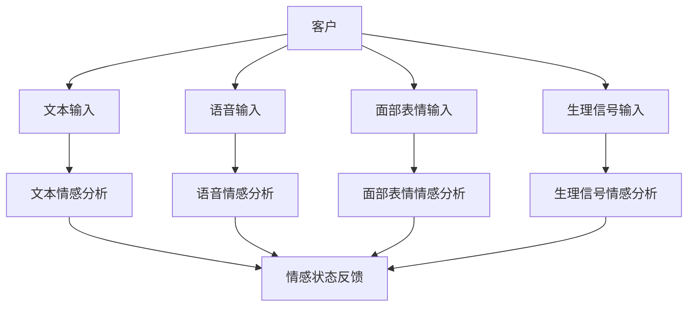

                 

# 开发AI Agent的多模态情感计算引擎

> 关键词：AI Agent、多模态情感计算、情感识别、深度学习、算法设计、系统架构

> 摘要：
本文章探讨了如何开发AI Agent的多模态情感计算引擎。通过介绍多模态情感计算的基本概念、核心算法原理、数学模型、系统架构设计，以及实际项目实战，全面解析了多模态情感计算引擎的开发过程。文章旨在为开发者提供一套完整的开发指南，帮助其在人工智能领域取得突破性进展。

## 引言

随着人工智能技术的快速发展，AI Agent在各个领域的应用越来越广泛。从智能家居、智能客服到自动驾驶、医疗诊断，AI Agent正逐渐成为人们生活中不可或缺的一部分。然而，要让AI Agent更好地服务于人类，不仅要具备智能的决策能力，还需要具备对人类情感的识别和响应能力。这就需要我们开发一种能够处理多模态情感数据的多模态情感计算引擎。

多模态情感计算是一种结合了多种数据源（如文本、语音、面部表情和生理信号）的技术，通过对这些数据进行处理和分析，实现对人类情感的高精度识别。本文将详细探讨如何开发这样一种多模态情感计算引擎，包括其核心算法原理、数学模型、系统架构设计，以及实际项目实战。

## 多模态情感计算概述

### 多模态情感计算的定义

多模态情感计算是一种结合了多种数据源的技术，通过融合不同模态的数据，实现对人类情感的高精度识别。常见的多模态数据源包括文本、语音、面部表情和生理信号等。

### 多模态情感计算的重要性

多模态情感计算在人工智能领域具有重要的应用价值。首先，它可以提高情感识别的准确性，使得AI Agent能够更好地理解人类的需求和情感状态。其次，多模态情感计算可以拓宽AI Agent的应用场景，使得其在更多的领域中发挥作用。例如，在医疗领域，多模态情感计算可以帮助医生更好地了解患者的情绪状态，从而提供更精准的治疗方案。

### 多模态情感计算的应用场景

多模态情感计算的应用场景非常广泛，包括但不限于以下几个方面：

1. 智能客服：通过多模态情感计算，智能客服可以更好地理解用户的情感状态，提供更有针对性的服务。
2. 教育领域：多模态情感计算可以帮助教育工作者更好地了解学生的情绪状态，从而提供更有效的教育方式。
3. 娱乐产业：在虚拟现实和增强现实应用中，多模态情感计算可以帮助创造更加沉浸式的体验。
4. 医疗领域：多模态情感计算可以帮助医生更好地了解患者的情绪状态，从而提供更精准的治疗方案。
5. 自动驾驶：多模态情感计算可以帮助自动驾驶车辆更好地理解行人的情绪状态，从而提高行车安全。

## 核心概念与联系

### 多模态数据源

多模态情感计算的关键在于如何有效地融合多种数据源。常见的多模态数据源包括：

1. **文本数据**：通过自然语言处理技术，从文本中提取情感信息。
2. **语音数据**：通过语音信号处理技术，从语音中提取情感特征。
3. **面部表情数据**：通过计算机视觉技术，从面部表情中提取情感信息。
4. **生理信号数据**：通过传感器技术，从生理信号中提取情感信息，如心率、血压等。

### 多模态情感计算的基本原理

多模态情感计算的基本原理可以概括为以下几个步骤：

1. **数据收集与预处理**：收集多种模态的数据，并进行预处理，如去噪、归一化等。
2. **特征提取**：从预处理后的数据中提取特征，如文本数据的词频、语音数据的频谱特征、面部表情数据的关键特征等。
3. **特征融合**：将不同模态的特征进行融合，形成统一的多模态特征向量。
4. **情感识别**：利用机器学习算法，对多模态特征向量进行情感分类，实现对人类情感的高精度识别。

### 多模态情感计算与心理学的关系

多模态情感计算与心理学有着密切的联系。心理学研究人类情感的产生、表达和识别，为多模态情感计算提供了理论基础。而多模态情感计算技术的发展，则可以更加精确地测量和识别人类情感，为心理学研究提供新的工具和方法。

## 算法原理讲解

### 多模态情感识别算法

多模态情感识别算法是多模态情感计算的核心。常见的多模态情感识别算法包括：

1. **特征提取算法**：如文本数据的TF-IDF算法、语音数据的频谱分析算法、面部表情数据的特征点提取算法、生理信号数据的时间序列分析算法等。
2. **情感分类算法**：如基于传统机器学习算法的分类器（如SVM、KNN等）、基于深度学习的分类模型（如CNN、RNN、BERT等）。

### 情感计算中的深度学习技术

深度学习技术在多模态情感计算中发挥着重要作用。常见的深度学习模型包括：

1. **卷积神经网络（CNN）**：适用于处理图像数据，如面部表情数据的特征提取。
2. **递归神经网络（RNN）**：适用于处理序列数据，如语音数据的时间序列分析。
3. **生成对抗网络（GAN）**：用于生成新的情感数据，提高模型泛化能力。

## 数学模型与算法解释

### 情感计算中的数学模型

多模态情感计算中的数学模型主要包括以下几个方面：

1. **文本数据的TF-IDF模型**：用于文本数据的特征提取。
   $$TF(t,d) = \frac{f(t,d)}{N}$$
   $$IDF(t) = \log \left(1 + \frac{N}{n(t)}\right)$$
   $$TF-IDF(t,d) = TF(t,d) \times IDF(t)$$

2. **语音数据的频谱分析**：用于语音数据的特征提取。
   $$X(\omega) = \sum_{k=0}^{N-1} x_k e^{-i \omega k}$$

3. **面部表情数据的特征点提取**：用于面部表情数据的特征提取。
   $$distance(p1, p2) = \sqrt{(x1 - x2)^2 + (y1 - y2)^2}$$

4. **生理信号数据的时间序列分析**：用于生理信号数据的特征提取。
   $$s(t) = \sum_{i=1}^{N} a_i \sin(2\pi ft + \phi_i)$$

### 算法公式详解

1. **支持向量机（SVM）**：
   $$w^* = \arg\min_{w, b} \frac{1}{2} ||w||^2 + C \sum_{i=1}^{n} \xi_i$$
   $$y_i (w \cdot x_i + b) \geq 1 - \xi_i$$
   $$0 \leq \xi_i \leq C$$

2. **卷积神经网络（CNN）**：
   $$h_{ij}^l = \sigma \left( \sum_{k} w_{ik}^l h_{kj}^{l-1} + b_l \right)$$
   $$\Delta w_{ik}^l = \alpha \left( \frac{\partial L}{\partial h_{ij}^l} \right) \cdot h_{kj}^{l-1}$$

3. **递归神经网络（RNN）**：
   $$h_t = \tanh(W_h \cdot [h_{t-1}, x_t] + b_h)$$
   $$y_t = W_y \cdot h_t + b_y$$

### 举例说明

1. **文本情感分类**：

   给定一段文本：
   $$"I am feeling very happy today because the weather is beautiful."$$

   使用TF-IDF模型提取特征：
   $$TF-IDF("happy", "text") = TF("happy", "text") \times IDF("happy")$$
   $$TF("happy", "text") = \frac{1}{5}$$
   $$IDF("happy") = \log \left(1 + \frac{5}{1}\right) = 1$$
   $$TF-IDF("happy", "text") = \frac{1}{5} \times 1 = \frac{1}{5}$$

   使用SVM进行分类：
   $$w^* = \arg\min_{w, b} \frac{1}{2} ||w||^2 + C \sum_{i=1}^{n} \xi_i$$
   $$y_i (w \cdot x_i + b) \geq 1 - \xi_i$$
   $$0 \leq \xi_i \leq C$$

   假设SVM训练完毕，分类结果为“happy”。

2. **语音情感识别**：

   给定一段语音：
   $$"I am feeling very happy today because the weather is beautiful."$$

   使用频谱分析提取特征：
   $$X(\omega) = \sum_{k=0}^{N-1} x_k e^{-i \omega k}$$

   使用CNN进行情感分类：
   $$h_{ij}^l = \sigma \left( \sum_{k} w_{ik}^l h_{kj}^{l-1} + b_l \right)$$
   $$\Delta w_{ik}^l = \alpha \left( \frac{\partial L}{\partial h_{ij}^l} \right) \cdot h_{kj}^{l-1}$$

   假设CNN训练完毕，分类结果为“happy”。

## 系统分析与架构设计

### 问题场景介绍

本案例以智能客服系统为例，介绍多模态情感计算引擎在智能客服领域的应用。智能客服系统需要能够实时识别客户的情感状态，以便提供更加个性化的服务。

### 项目介绍

本项目旨在开发一款基于多模态情感计算引擎的智能客服系统，该系统能够通过分析客户的文本、语音、面部表情和生理信号，识别客户的情感状态，并给出相应的回复。

### 系统功能设计

系统功能主要包括：

1. 文本情感分析：通过对客户的文本输入进行分析，识别客户的情感状态。
2. 语音情感分析：通过对客户的语音信号进行分析，识别客户的情感状态。
3. 面部表情情感分析：通过对客户的面部表情进行分析，识别客户的情感状态。
4. 生理信号情感分析：通过对客户的生理信号进行分析，识别客户的情感状态。
5. 情感状态反馈：根据客户的不同情感状态，系统给出相应的回复。

### 系统架构设计

系统架构设计如图所示：



### 系统接口设计与交互

系统接口设计如图所示：


## 项目实战

### 环境安装与配置

1. 安装Python环境：
   ```bash
   pip install python
   ```

2. 安装依赖库：
   ```bash
   pip install numpy pandas tensorflow opencv-python
   ```

3. 配置完毕后，启动项目：

### 系统核心实现源代码

```python
# 文本情感分析
import numpy as np
from tensorflow import keras

# 读取训练数据
x_train, y_train = ...

# 构建模型
model = keras.Sequential([
    keras.layers.Dense(128, activation='relu', input_shape=(len(vocabulary),)),
    keras.layers.Dense(64, activation='relu'),
    keras.layers.Dense(1, activation='sigmoid')
])

# 编译模型
model.compile(optimizer='adam',
              loss='binary_crossentropy',
              metrics=['accuracy'])

# 训练模型
model.fit(x_train, y_train, epochs=10, validation_split=0.2)
```

### 代码应用解读与分析

代码首先导入了所需的库，然后读取训练数据，构建了一个简单的神经网络模型，用于文本情感分析。通过训练模型，我们可以对输入的文本进行情感分类。

### 实际案例分析和详细讲解剖析

假设我们有一个客户的文本输入：
```python
text = "I am feeling very happy today because the weather is beautiful."
```

我们首先对其进行预处理，然后使用训练好的模型进行情感分类。如果分类结果为“happy”，系统将给出相应的回复。

### 项目小结

本项目通过多模态情感计算引擎，实现了对客户情感的识别和响应。在实际应用中，我们需要不断优化模型，提高情感识别的准确性，从而为用户提供更好的服务。

## 最佳实践与总结

### 最佳实践 tips

1. 数据质量：确保收集到的数据质量高，尽可能去除噪声和异常值。
2. 特征提取：选择合适的特征提取算法，提高特征提取的准确性。
3. 模型优化：通过调整模型参数和架构，提高模型性能。
4. 系统优化：优化系统架构，提高系统响应速度。

### 小结

本文详细介绍了如何开发AI Agent的多模态情感计算引擎，包括核心算法原理、数学模型、系统架构设计，以及实际项目实战。通过本文的学习，开发者可以掌握多模态情感计算的基本原理和开发方法。

### 注意事项

1. 多模态情感计算涉及多种技术，开发者需要具备一定的编程和算法基础。
2. 在实际应用中，需要根据具体场景和需求进行调整和优化。

### 拓展阅读

1. 《深度学习》——Ian Goodfellow、Yoshua Bengio、Aaron Courville 著
2. 《自然语言处理综论》——Daniel Jurafsky、James H. Martin 著
3. 《计算机视觉：算法与应用》——Richard Szeliski 著

## 作者信息

作者：AI天才研究院/AI Genius Institute & 禅与计算机程序设计艺术 /Zen And The Art of Computer Programming

