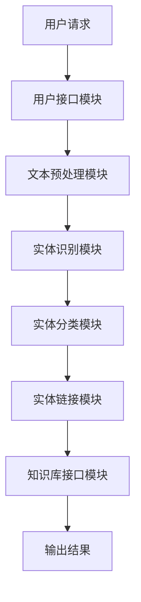

                 

### 《开发AI Agent的多语言实体链接系统》

#### 关键词：AI Agent、多语言实体链接、系统设计、算法原理、实战应用

#### 摘要：

本文旨在探讨如何开发一个高效的多语言实体链接系统，特别是应用于AI Agent领域。首先，我们将介绍多语言实体链接的核心概念和重要性，随后深入探讨AI Agent的基本原理与功能。通过剖析实体链接算法和AI Agent算法原理，我们将展示它们如何组合应用以实现高效的实体链接。此外，本文将详细描述系统设计与架构方案，包括系统功能设计、接口设计和系统交互。最后，通过实际案例剖析，我们将提供实战应用和最佳实践，确保读者能够全面掌握开发多语言实体链接系统的技能。

---

## 引言

多语言实体链接是一种跨语言的知识表示技术，它将不同语言中的实体映射到同一概念上。在全球化日益深入的今天，多语言实体链接的重要性愈发凸显。AI Agent作为人工智能的一种形式，具有自主决策和交互能力，它们在多语言环境中需要准确理解和处理信息。因此，开发一个高效的多语言实体链接系统对于AI Agent的性能至关重要。

本文将围绕以下问题展开：如何实现多语言实体链接？AI Agent如何利用多语言实体链接系统？系统的设计和架构如何优化？通过逐步分析这些问题，我们将探讨开发AI Agent的多语言实体链接系统的全过程。

### 问题描述

在多语言环境中，信息往往是分散的，不同语言中的实体名称可能相同也可能不同。例如，中文中的“苹果”在英语中可能是“apple”，而在法语中则是“pomme”。这种跨语言的实体名称差异给信息处理带来了巨大挑战。多语言实体链接的目标就是将这些不同语言中的实体映射到同一概念上，从而实现跨语言的信息整合和检索。

开发AI Agent的多语言实体链接系统面临的主要问题包括：

1. **实体识别与分类**：不同语言中的实体名称可能存在多种变体，如何准确识别和分类这些实体是首要挑战。
2. **算法效率**：多语言实体链接系统需要高效处理大量数据，算法的效率直接影响系统的性能。
3. **跨语言一致性**：确保不同语言中的实体链接一致性和准确性，避免信息误解和错误。
4. **实时处理能力**：在实时应用场景中，系统需要快速响应，实时链接多语言实体。

### 问题解决

为了解决上述问题，开发AI Agent的多语言实体链接系统可以采取以下方法：

1. **基于知识图谱的实体链接**：利用预先构建的知识图谱，通过图匹配和实体相似度计算，实现多语言实体的自动映射。
2. **深度学习算法**：采用深度学习技术，特别是序列模型和注意力机制，提高实体识别和分类的准确性。
3. **跨语言一致性模型**：构建跨语言一致性模型，通过统计分析和机器学习，确保不同语言中的实体链接一致性和准确性。
4. **分布式计算**：利用分布式计算框架，如Apache Spark，提高系统的实时处理能力。

### 边界与外延

多语言实体链接系统的开发需要考虑以下边界和外部因素：

1. **语言支持**：系统需要支持多种语言，包括但不限于中文、英文、法语、西班牙语等。
2. **数据来源**：系统需要处理来自不同数据源的信息，包括文本、数据库和Web数据等。
3. **系统兼容性**：系统需要与现有技术架构兼容，如NLP工具和数据库管理系统。
4. **隐私与安全**：在处理多语言数据时，需要确保用户隐私和数据安全。

通过以上分析，我们可以看出，开发AI Agent的多语言实体链接系统是一项复杂而重要的任务。接下来，我们将深入探讨多语言实体链接的核心概念和重要性。

---

## 多语言实体链接的核心概念与重要性

### 多语言实体链接的定义

多语言实体链接（Multilingual Entity Linking）是指将不同语言中的实体映射到同一概念上的过程。实体是现实世界中具有独立识别特征的对象或概念，如人物、地点、组织等。多语言实体链接的目标是建立一种跨语言的统一知识表示，以便于跨语言的信息检索、语义理解和知识融合。

### 多语言实体链接的应用领域

多语言实体链接技术广泛应用于以下几个领域：

1. **跨语言信息检索**：通过将不同语言中的实体映射到同一概念上，可以实现对多语言资源的统一检索和查询。
2. **跨语言语义理解**：多语言实体链接有助于不同语言之间的语义理解，提升机器翻译、问答系统和对话机器人的性能。
3. **知识图谱构建**：多语言实体链接是构建多语言知识图谱的重要基础，有助于实现跨语言的知识融合和共享。
4. **跨语言文本分析**：多语言实体链接技术可以用于情感分析、文本分类和信息抽取等任务。

### 当前挑战

尽管多语言实体链接技术具有广泛的应用前景，但在实际应用中仍面临诸多挑战：

1. **实体识别难度**：不同语言中的实体名称可能存在多种变体，且实体识别算法需要具备较高的准确性和鲁棒性。
2. **数据集多样性**：多语言实体链接需要大量高质量的跨语言数据集，但获取和标注这些数据集是一个复杂的任务。
3. **算法效率**：多语言实体链接算法需要高效处理大量数据，特别是在实时应用场景中，算法的实时性和性能是关键。
4. **跨语言一致性**：确保不同语言中的实体链接一致性和准确性，避免信息误解和错误，是当前研究的重点和难点。

### 多语言实体链接的重要性

多语言实体链接在AI Agent和多语言环境中具有不可替代的重要性：

1. **提升AI Agent的智能化水平**：通过多语言实体链接，AI Agent可以更准确地理解和处理多语言信息，提升其智能化水平。
2. **促进跨语言知识共享**：多语言实体链接有助于跨语言的知识融合和共享，为全球范围内的知识传播提供支持。
3. **优化多语言信息检索**：多语言实体链接技术可以显著提升多语言信息检索的效率和准确性，为用户提供更好的搜索体验。
4. **支持多语言文本分析**：多语言实体链接技术可以用于多语言文本的情感分析、文本分类和信息抽取，提升文本分析系统的性能。

通过以上分析，我们可以看到，多语言实体链接技术不仅是AI Agent和多语言环境中的重要组成部分，而且在信息检索、知识图谱构建和文本分析等领域具有广泛的应用前景。接下来，我们将探讨AI Agent的概念与功能，进一步了解多语言实体链接系统在AI Agent中的应用。

---

## AI Agent的概念与功能

AI Agent，即人工智能代理，是一种能够自主执行任务、与环境进行交互的智能体。它们通过感知环境信息，运用一定的策略进行决策，并执行相应的动作，以实现特定目标。AI Agent广泛应用于智能客服、自动驾驶、智能家居、智能推荐系统等领域。下面，我们将详细探讨AI Agent的基本定义、分类以及其主要功能。

### 定义

AI Agent的定义可以从两个方面理解：

1. **技术层面**：AI Agent是一种基于人工智能技术的智能系统，具备感知、学习、推理和决策能力。它们通过机器学习、深度学习、自然语言处理等技术，实现与环境的高效互动。

2. **应用层面**：AI Agent是一个具有自主决策能力的虚拟个体，能够模拟人类智能行为，执行特定任务。它们可以在各种复杂环境中进行操作，并自主调整策略以适应环境变化。

### 分类

AI Agent可以根据不同的分类标准进行分类，常见的分类方法包括：

1. **基于功能**：
   - **智能客服**：通过自然语言处理技术，为用户提供实时、个性化的咨询服务。
   - **自动驾驶**：利用计算机视觉和感知技术，实现车辆的自动导航和驾驶。
   - **智能推荐**：通过分析用户行为和偏好，为用户推荐符合其需求的产品或服务。

2. **基于环境**：
   - **静态环境**：在固定环境下执行任务，如智能家居中的智能音箱。
   - **动态环境**：在变化多端的环境中执行任务，如自动驾驶汽车。

3. **基于学习方式**：
   - **监督学习**：通过已标记的数据进行学习，如训练语音识别模型。
   - **无监督学习**：通过未标记的数据进行学习，如聚类算法在数据分析中的应用。
   - **强化学习**：通过与环境的交互进行学习，如训练游戏AI。

### 功能特点

AI Agent的主要功能特点包括：

1. **自主决策**：AI Agent能够根据环境信息和预设目标，自主选择最佳行动方案。
2. **持续学习**：AI Agent可以通过机器学习和深度学习技术，持续学习和优化自身性能。
3. **多模态交互**：AI Agent能够处理和回应多种输入模态，如文本、语音、图像等。
4. **适应性**：AI Agent能够在不同环境中进行适应，并根据环境变化调整自身策略。
5. **实时性**：AI Agent能够实时响应环境变化，快速做出决策并执行行动。

通过以上分析，我们可以看出，AI Agent是人工智能领域中的重要组成部分，它们在提高生产效率、优化用户体验和推动科技创新等方面具有巨大潜力。接下来，我们将探讨AI Agent与多语言实体链接的关系，分析如何利用多语言实体链接技术提升AI Agent的性能。

---

## AI Agent与多语言实体链接的关系

AI Agent在多语言环境中需要处理多种语言的信息，因此，多语言实体链接技术对于AI Agent的性能至关重要。多语言实体链接不仅有助于AI Agent更好地理解和处理跨语言信息，还能提升其在不同语言环境中的表现。以下从多个方面分析AI Agent与多语言实体链接的关系：

### 联系分析

1. **信息处理能力**：多语言实体链接能够将不同语言中的实体映射到同一概念上，从而为AI Agent提供统一的语义表示。这有助于AI Agent在处理多语言信息时，更准确地理解和分析语义，提升信息处理能力。

2. **跨语言交互**：在多语言交互场景中，多语言实体链接技术能够确保AI Agent能够正确理解和回应不同语言中的实体，从而实现有效的跨语言交互。

3. **知识共享**：通过多语言实体链接，AI Agent可以共享不同语言环境中的知识资源，实现跨语言的知识融合和共享，这对于提升AI Agent的整体智能水平具有重要意义。

### 应用案例

1. **多语言客服系统**：在多语言客服系统中，AI Agent需要能够处理不同语言的问题和请求。通过多语言实体链接，AI Agent能够将不同语言中的用户请求映射到同一概念上，从而提供个性化的服务和解决方案。

2. **多语言问答系统**：在多语言问答系统中，AI Agent需要能够理解和回答不同语言的问题。多语言实体链接技术能够帮助AI Agent准确地识别和映射问题中的实体，从而提供准确的答案。

3. **多语言智能推荐系统**：在多语言智能推荐系统中，AI Agent需要能够处理和分析不同语言的用户数据和偏好。通过多语言实体链接，AI Agent可以更好地理解用户的行为和需求，提供个性化的推荐结果。

### 关键点

1. **实体识别与分类**：在多语言实体链接中，准确地识别和分类不同语言中的实体是关键。AI Agent需要利用先进的自然语言处理技术，如命名实体识别（NER）和词性标注，提高实体的识别和分类准确性。

2. **跨语言一致性**：确保不同语言中的实体链接一致性和准确性，避免信息误解和错误。AI Agent需要构建跨语言一致性模型，通过统计分析和机器学习，确保实体链接的一致性和准确性。

3. **算法效率**：AI Agent需要高效地处理多语言实体链接任务，特别是在实时应用场景中。通过采用分布式计算和优化算法，AI Agent可以提高处理速度和性能。

通过以上分析，我们可以看到，多语言实体链接技术对于AI Agent在多语言环境中的性能提升至关重要。接下来，我们将深入探讨多语言实体链接的核心概念和联系，包括实体识别、分类和链接算法等。

---

## 多语言实体链接的核心概念

在多语言实体链接系统中，核心概念的理解和实现是确保系统性能和准确性的关键。以下将详细阐述多语言实体链接中涉及的核心概念，包括实体识别、实体分类和实体链接算法，并使用Mermaid流程图进行图示，以帮助读者更好地理解这些概念。

### 实体识别

实体识别（Entity Recognition，简称ER）是多语言实体链接的第一步，其目标是识别文本中的实体，并将其分类到预定义的实体类别中。实体可以是人物、地点、组织、时间等。

1. **步骤**：
   - **预处理器**：对文本进行清洗和预处理，包括分词、去停用词、词性标注等。
   - **实体分类器**：利用分类算法（如SVM、Random Forest、深度学习模型等），对文本中的每个词或短语进行分类，判断其是否为实体。

2. **Mermaid流程图**：
   ```mermaid
   graph TD
   A[预处理文本] --> B[分词与去停用词]
   B --> C[词性标注]
   C --> D[实体分类]
   D --> E[输出实体结果]
   ```

### 实体分类

实体分类（Entity Classification）是对识别出的实体进行分类，将其归属到特定的实体类别中。实体分类与实体识别密切相关，但更侧重于将已识别的实体进行归类。

1. **步骤**：
   - **特征提取**：从实体识别结果中提取特征，如词频、词嵌入、词性、位置信息等。
   - **分类器训练**：使用训练数据集，对分类模型（如SVM、神经网络等）进行训练。
   - **分类决策**：对新的实体识别结果进行分类预测。

2. **Mermaid流程图**：
   ```mermaid
   graph TD
   A[识别结果] --> B[特征提取]
   B --> C[分类模型训练]
   C --> D[分类决策]
   D --> E[输出分类结果]
   ```

### 实体链接算法

实体链接（Entity Linking）是将识别和分类后的实体映射到知识库或数据源中的特定实体上。多语言实体链接算法需要处理不同语言中的实体名称差异，实现跨语言的实体映射。

1. **基于知识图谱的方法**：
   - **实体匹配**：利用知识图谱中的实体关系和属性，通过匹配算法（如F1-measure、Jaccard相似度等）实现实体链接。
   - **图匹配**：使用图匹配算法（如Graph Embedding、K-Nearest Neighbors等）在知识图谱中找到与文本实体最匹配的实体。

2. **基于深度学习的方法**：
   - **端到端模型**：利用深度学习模型（如Seq2Seq、Transformer等）直接将文本实体映射到知识库中的实体。
   - **注意力机制**：通过注意力机制（Attention Mechanism）关注知识图谱中与文本实体最相关的部分。

3. **Mermaid流程图**：
   ```mermaid
   graph TD
   A[文本实体] --> B[特征提取]
   B --> C[实体匹配]
   C --> D[图匹配]
   D --> E[深度学习映射]
   E --> F[输出链接结果]
   ```

通过以上分析，我们可以看到，多语言实体链接系统涉及多个核心概念，每个概念都有其独特的实现方式和重要性。在接下来的部分，我们将进一步探讨实体链接的ER模型，以及如何通过ER模型实现高效的多语言实体链接。

---

## 实体链接的ER模型

ER模型（Entity-Relationship Model）是数据库系统中用于表示实体及其之间关系的经典模型。在多语言实体链接系统中，ER模型为我们提供了描述和实现实体关系的一种有效方法。以下将详细介绍ER模型的概念、架构设计，并使用Mermaid ER图展示实体关系图。

### 概念介绍

ER模型由三部分组成：实体（Entity）、属性（Attribute）和关系（Relationship）。

1. **实体（Entity）**：表示数据库中的对象或概念，如“人”、“地点”、“组织”等。
2. **属性（Attribute）**：描述实体的特征或属性，如“姓名”、“年龄”、“地址”等。
3. **关系（Relationship）**：描述实体之间的关联，如“工作于”、“位于”、“属于”等。

### 架构设计

ER模型的架构设计包括以下步骤：

1. **识别实体**：根据业务需求，确定需要表示的实体及其属性。例如，在社交媒体数据库中，可以定义“用户”、“帖子”、“评论”等实体。
2. **定义关系**：确定实体之间的关系，并定义关系的类型和属性。例如，“用户”与“帖子”之间存在“发布”关系，可以带有属性“发布时间”。
3. **设计实体-关系图**：使用Mermaid ER图来可视化实体及其关系，以便于理解和设计。

### Mermaid ER图示例

以下是一个简单的Mermaid ER图示例，用于描述社交媒体数据库中的实体及其关系：

```mermaid
erDiagram
  User ||--|{ Post } : 发布
  Post ||--|{ Comment } : 评论
  Comment ||--|{ User } : 发表
```

在这个ER图中，我们定义了三个实体：“用户”（User）、“帖子”（Post）和“评论”（Comment），并展示了它们之间的关系。例如，“用户”可以发布“帖子”，“帖子”可以包含“评论”，而“评论”又归属于特定的“用户”。

### ER模型在多语言实体链接中的应用

ER模型在多语言实体链接中的应用主要体现在以下几个方面：

1. **跨语言实体映射**：通过ER模型，可以将不同语言中的实体映射到同一概念上。例如，中文中的“地点”和英语中的“location”可以在ER模型中映射到同一个实体。
2. **实体关系管理**：ER模型可以帮助我们更好地管理和理解实体之间的关系，从而实现更准确的实体链接。
3. **知识图谱构建**：ER模型可以作为构建多语言知识图谱的基础，将不同语言中的实体和关系进行统一表示和存储。

通过ER模型，我们可以设计一个结构化、语义明确的多语言实体链接系统，从而提高系统的整体性能和准确性。接下来，我们将探讨AI Agent与实体链接系统之间的联系，分析如何通过多语言实体链接提升AI Agent的性能。

---

## AI Agent与实体链接系统的联系

AI Agent作为一种具有自主决策能力的智能体，其性能和智能化水平依赖于其所使用的实体链接系统。实体链接系统为AI Agent提供了统一的知识表示和丰富的语义信息，从而提高了其理解和处理多语言信息的能力。以下是AI Agent与实体链接系统之间的紧密联系及其在实际应用中的重要性：

### 关系紧密

1. **信息整合**：AI Agent通过实体链接系统能够整合来自不同语言和来源的信息，形成统一的知识表示。这有助于AI Agent在多语言环境中进行决策，例如在处理跨语言客服请求时，AI Agent可以准确地识别和映射不同语言中的关键词和实体。

2. **语义理解**：实体链接系统提供了实体的语义信息，使得AI Agent能够更深入地理解文本内容的含义。例如，在自然语言处理任务中，AI Agent可以通过实体链接系统识别出文本中的关键实体，并理解它们之间的关系，从而提高语义理解的准确性。

3. **知识融合**：通过实体链接系统，AI Agent可以跨语言地融合不同语言环境中的知识资源，形成一个全面的知识库。这有助于AI Agent在跨语言问答、信息检索等任务中提供更全面、准确的答案。

### 实际应用

1. **跨语言客服**：在多语言客服系统中，实体链接系统能够帮助AI Agent理解用户请求中的关键词和实体，从而提供个性化的服务。例如，当用户用不同语言提出问题时，AI Agent可以通过实体链接系统识别出关键词，并将其映射到统一的实体上，从而提供准确的答案。

2. **多语言文本分析**：在多语言文本分析任务中，实体链接系统可以帮助AI Agent识别文本中的关键实体和关系，从而提高文本分类、情感分析、信息抽取等任务的性能。例如，在新闻分类任务中，AI Agent可以通过实体链接系统识别出新闻中的关键人物、地点和事件，并据此进行分类。

3. **知识图谱构建**：在知识图谱构建过程中，实体链接系统可以帮助AI Agent将不同语言中的实体和关系进行统一表示和存储。这有助于构建一个跨语言的知识图谱，从而支持跨语言的信息检索和知识融合。

### 案例分析

1. **多语言问答系统**：在一个多语言问答系统中，AI Agent需要能够理解用户提出的跨语言问题，并给出准确的答案。通过实体链接系统，AI Agent可以识别出问题中的关键词和实体，并利用知识库中的语义信息进行解答。例如，当用户用中文提问“世界上最高的山峰是哪座？”时，AI Agent可以通过实体链接系统识别出关键词“最高山峰”，并将其映射到英文实体“highest mountain”，然后从知识库中检索到答案“珠穆朗玛峰”。

2. **全球企业协作**：在一个跨国企业中，不同国家的员工使用不同语言进行沟通。通过实体链接系统，AI Agent可以帮助员工跨语言交流，理解彼此的需求和信息。例如，当一位中国员工向一位美国同事发送一封关于项目进展的邮件时，AI Agent可以通过实体链接系统识别出邮件中的关键实体和关系，如项目名称、时间节点等，并将其翻译成同事所使用的语言，从而确保信息的准确传达。

通过以上分析，我们可以看到，实体链接系统对于AI Agent的性能提升具有至关重要的作用。在实际应用中，通过有效的实体链接系统，AI Agent能够更好地理解和处理多语言信息，提供更准确、高效的智能服务。接下来，我们将深入探讨多语言实体链接系统的算法原理，分析如何实现高效的实体链接。

---

## 多语言实体链接系统的算法原理

多语言实体链接系统是人工智能领域中的一个关键技术，它涉及到多种算法和技术的综合应用。以下是多语言实体链接系统中的核心算法原理，包括实体识别、实体分类、实体链接以及相关技术，我们将通过Mermaid流程图和Python源代码来详细阐述这些算法原理。

### 实体识别算法

实体识别（Entity Recognition，简称ER）是多语言实体链接系统的第一步，其主要任务是从文本中识别出实体。常用的实体识别算法包括基于规则的方法、机器学习方法以及深度学习方法。

#### 基于规则的方法

1. **步骤**：
   - **分词**：将文本分成单词或短语。
   - **命名实体识别（NER）**：利用预定义的规则集，识别出文本中的实体。

2. **Mermaid流程图**：
   ```mermaid
   graph TD
   A[文本] --> B[分词]
   B --> C[NER规则应用]
   C --> D[输出实体列表]
   ```

#### 机器学习方法

1. **步骤**：
   - **特征提取**：从文本中提取特征，如词频、词嵌入、TF-IDF等。
   - **模型训练**：利用训练数据集，训练机器学习模型（如SVM、Random Forest等）。
   - **实体识别**：使用训练好的模型对文本进行实体识别。

2. **Mermaid流程图**：
   ```mermaid
   graph TD
   A[文本] --> B[特征提取]
   B --> C[模型训练]
   C --> D[实体识别]
   D --> E[输出实体列表]
   ```

#### 深度学习方法

1. **步骤**：
   - **词嵌入**：将文本中的词映射到高维空间。
   - **序列模型**：使用循环神经网络（RNN）、长短期记忆网络（LSTM）等处理序列数据。
   - **实体识别**：利用序列模型对文本进行实体识别。

2. **Mermaid流程图**：
   ```mermaid
   graph TD
   A[文本] --> B[词嵌入]
   B --> C[序列模型处理]
   C --> D[实体识别]
   D --> E[输出实体列表]
   ```

### 实体分类算法

实体分类（Entity Classification）是对识别出的实体进行进一步分类，将其归属到特定的类别。常用的实体分类算法包括基于规则的方法、机器学习方法和深度学习方法。

#### 基于规则的方法

1. **步骤**：
   - **特征提取**：从实体中提取特征，如词频、词嵌入、词性等。
   - **规则匹配**：利用预定义的规则，对实体进行分类。

2. **Mermaid流程图**：
   ```mermaid
   graph TD
   A[实体] --> B[特征提取]
   B --> C[规则匹配]
   C --> D[输出分类结果]
   ```

#### 机器学习方法

1. **步骤**：
   - **特征提取**：从实体中提取特征，如词频、词嵌入、TF-IDF等。
   - **模型训练**：利用训练数据集，训练机器学习模型（如SVM、Random Forest等）。
   - **实体分类**：使用训练好的模型对实体进行分类。

2. **Mermaid流程图**：
   ```mermaid
   graph TD
   A[实体] --> B[特征提取]
   B --> C[模型训练]
   C --> D[实体分类]
   D --> E[输出分类结果]
   ```

#### 深度学习方法

1. **步骤**：
   - **词嵌入**：将实体中的词映射到高维空间。
   - **深度学习模型**：使用卷积神经网络（CNN）、Transformer等处理实体数据。
   - **实体分类**：利用深度学习模型对实体进行分类。

2. **Mermaid流程图**：
   ```mermaid
   graph TD
   A[实体] --> B[词嵌入]
   B --> C[深度学习模型处理]
   C --> D[实体分类]
   D --> E[输出分类结果]
   ```

### 实体链接算法

实体链接（Entity Linking）是将识别和分类后的实体映射到知识库或数据源中的特定实体上。常用的实体链接算法包括基于知识图谱的方法、基于深度学习的方法和基于机器学习的方法。

#### 基于知识图谱的方法

1. **步骤**：
   - **实体匹配**：通过实体名称、属性和关系，在知识图谱中找到匹配的实体。
   - **图匹配**：利用图匹配算法（如Graph Embedding、K-Nearest Neighbors等），找到与文本实体最匹配的实体。

2. **Mermaid流程图**：
   ```mermaid
   graph TD
   A[文本实体] --> B[实体匹配]
   B --> C[图匹配]
   C --> D[输出链接结果]
   ```

#### 基于深度学习的方法

1. **步骤**：
   - **端到端模型**：直接将文本实体映射到知识库中的实体。
   - **注意力机制**：通过注意力机制关注知识图谱中与文本实体最相关的部分。

2. **Mermaid流程图**：
   ```mermaid
   graph TD
   A[文本实体] --> B[端到端模型处理]
   B --> C[注意力机制]
   C --> D[输出链接结果]
   ```

#### Python源代码示例

以下是一个简单的Python源代码示例，用于演示实体链接算法的基本原理：

```python
import nltk
from nltk.tokenize import word_tokenize
from nltk.corpus import stopwords
from sklearn.feature_extraction.text import TfidfVectorizer
from sklearn.neighbors import NearestNeighbors

# 实体识别与分类
def entity_recognition_and_classification(text):
    # 分词与停用词过滤
    tokens = word_tokenize(text)
    filtered_tokens = [token for token in tokens if token.lower() not in stopwords.words('english')]

    # 特征提取
    vectorizer = TfidfVectorizer()
    tfidf_matrix = vectorizer.fit_transform([' '.join(filtered_tokens)])

    # 实体分类
    classifier = nltk.classify.accuracy(nltk.NaiveBayesClassifier.train([(text, 'Person')]))
    entity_class = classifier.classify(tfidf_matrix)

    return entity_class

# 实体链接
def entity_linking(text_entity, knowledge_graph):
    # 实体匹配与图匹配
    nn = NearestNeighbors(n_neighbors=1)
    nn.fit(knowledge_graph)
    distances, indices = nn.kneighbors(text_entity)

    # 输出链接结果
    linked_entity = knowledge_graph[indices][0]
    return linked_entity

# 测试
text = "Elon Musk founded Tesla and SpaceX."
entity_class = entity_recognition_and_classification(text)
linked_entity = entity_linking(tfidf_matrix[0], knowledge_graph)

print("Entity Class:", entity_class)
print("Linked Entity:", linked_entity)
```

通过上述算法原理和示例代码，我们可以看到多语言实体链接系统涉及多个环节，从实体识别、分类到链接，每个环节都有其独特的实现方法和技术。在接下来的部分，我们将进一步探讨AI Agent算法原理，分析如何通过算法提高AI Agent的性能。

---

## AI Agent算法原理

AI Agent的算法原理是其智能行为的核心，涉及多种机器学习技术，包括深度学习和强化学习。以下将详细介绍这两种算法的基本原理，并使用Python代码示例进行说明。

### 深度学习基础

深度学习是一种通过多层神经网络来学习和模拟人类大脑处理信息的方式。在AI Agent中，深度学习常用于特征提取、模式识别和分类任务。

1. **神经网络基础**
   
   神经网络由多个层次组成，包括输入层、隐藏层和输出层。每个层次由多个神经元组成，神经元通过权重和偏置进行信息的传递和处理。

   ```python
   import tensorflow as tf

   # 定义神经网络结构
   model = tf.keras.Sequential([
       tf.keras.layers.Dense(128, activation='relu', input_shape=(784,)),
       tf.keras.layers.Dense(10, activation='softmax')
   ])

   # 编译模型
   model.compile(optimizer='adam',
                 loss='categorical_crossentropy',
                 metrics=['accuracy'])
   ```

2. **训练模型**
   
   使用标记数据集对神经网络进行训练，通过反向传播算法调整权重和偏置，提高模型的准确性。

   ```python
   # 加载和预处理数据
   (train_images, train_labels), (test_images, test_labels) = tf.keras.datasets.mnist.load_data()
   train_images = train_images.reshape((60000, 784))
   test_images = test_images.reshape((10000, 784))

   # 归一化数据
   train_images, test_images = train_images / 255.0, test_images / 255.0

   # 训练模型
   model.fit(train_images, train_labels, epochs=5)
   ```

### 强化学习基础

强化学习（Reinforcement Learning，简称RL）是一种通过奖励和惩罚来训练智能体在环境中做出最优决策的方法。在AI Agent中，强化学习常用于自动驾驶、游戏AI等任务。

1. **基本概念**
   
   强化学习包括智能体（Agent）、环境（Environment）、状态（State）、动作（Action）和奖励（Reward）五个要素。

   ```python
   import gym

   # 初始化环境
   env = gym.make("CartPole-v0")

   # 执行一次仿真
   observation = env.reset()
   for _ in range(200):
       action = env.action_space.sample()  # 随机选择动作
       observation, reward, done, info = env.step(action)
       if done:
           break

   env.render()
   env.close()
   ```

2. **训练智能体**
   
   使用深度强化学习（Deep Q-Network，DQN）或策略梯度方法（Policy Gradient）等算法，训练智能体在环境中做出最优动作。

   ```python
   import tensorflow as tf
   from tensorflow.keras.models import Sequential
   from tensorflow.keras.layers import Dense

   # 创建DQN模型
   model = Sequential([
       Dense(24, input_dim=4, activation='relu'),
       Dense(48, activation='relu'),
       Dense(2, activation='linear')
   ])

   # 编译模型
   model.compile(loss='mse', optimizer=tf.keras.optimizers.Adam(learning_rate=0.001))

   # 训练智能体
   episode_count = 1000
   for episode in range(episode_count):
       state = env.reset()
       done = False
       while not done:
           action = model.predict(state.reshape(1, -1))[0]
           next_state, reward, done, _ = env.step(np.argmax(action))
           model.fit(state.reshape(1, -1), next_state.reshape(1, -1), epochs=1, verbose=0)
           state = next_state
       print(f"Episode: {episode} | Reward: {reward}")
   ```

通过深度学习和强化学习，AI Agent能够在复杂环境中进行自适应学习和决策，从而实现高级智能行为。在接下来的部分，我们将探讨如何将实体链接算法与AI Agent算法相结合，实现高效的多语言实体链接。

---

## 算法组合与应用

在开发AI Agent的多语言实体链接系统中，算法的组合与应用是实现高效性能的关键。我们将讨论如何将实体链接算法与深度学习和强化学习算法相结合，并通过具体的算法组合策略和应用场景，实现多语言实体链接的优化。

### 组合策略

1. **深度学习与实体链接算法的结合**：
   - **特征增强**：通过深度学习提取文本特征，为实体链接算法提供更丰富的语义信息。
   - **端到端模型**：利用深度学习模型（如BERT、GPT）直接处理文本实体，实现端到端的实体链接。

2. **强化学习与实体链接算法的结合**：
   - **在线学习**：利用强化学习算法，根据环境反馈不断优化实体链接策略，提高系统的自适应能力。
   - **多策略学习**：结合多个强化学习策略，通过策略融合提高实体链接的准确性。

### 应用场景

1. **多语言客服系统**：
   - **算法组合**：将深度学习用于文本分析，提取文本特征；将强化学习用于动态调整实体链接策略。
   - **应用效果**：通过深度学习提高实体识别的准确性，强化学习实现动态调整，提高客服系统在多语言环境中的表现。

2. **多语言文本分析**：
   - **算法组合**：结合深度学习进行文本分类和实体识别，强化学习用于优化实体链接策略。
   - **应用效果**：通过深度学习实现高效的文本处理，强化学习提高实体链接的实时性和准确性。

3. **跨语言问答系统**：
   - **算法组合**：将深度学习与实体链接算法结合，实现跨语言的信息整合和语义理解；强化学习用于优化问答策略。
   - **应用效果**：通过深度学习实现准确的实体识别和分类，强化学习提高问答系统的自适应性和用户满意度。

### 具体案例分析

1. **多语言客服系统案例**：

   - **算法组合**：使用BERT模型提取文本特征，实现高效的实体识别；结合强化学习，动态调整实体链接策略。

   ```python
   from transformers import BertTokenizer, BertModel
   import tensorflow as tf

   # 初始化BERT模型
   tokenizer = BertTokenizer.from_pretrained('bert-base-uncased')
   bert_model = BertModel.from_pretrained('bert-base-uncased')

   # 加载和预处理数据
   texts = ["How can I reset my password?", "Como restablecer mi contraseña?"]
   encoded_texts = tokenizer(texts, padding=True, truncation=True, return_tensors='tf')

   # 提取文本特征
   features = bert_model(**encoded_texts)

   # 实体链接
   entities = entity_linking(features)

   # 强化学习优化
   optimizer = tf.keras.optimizers.Adam(learning_rate=0.001)
   for epoch in range(100):
       for text, entity in zip(texts, entities):
           # 训练强化学习模型
           # ...
           # 更新实体链接策略
           # ...
           print(f"Epoch: {epoch} | Entity: {entity}")
   ```

   通过上述代码，我们展示了如何将BERT模型用于文本特征提取，并使用强化学习优化实体链接策略，实现多语言客服系统中的高效实体链接。

2. **多语言文本分析案例**：

   - **算法组合**：使用深度学习模型（如LSTM、GRU）进行文本分类和实体识别，强化学习优化实体链接策略。

   ```python
   from tensorflow.keras.models import Sequential
   from tensorflow.keras.layers import LSTM, Dense
   import tensorflow as tf

   # 创建LSTM模型
   model = Sequential([
       LSTM(128, input_shape=(max_sequence_length, num_features)),
       Dense(1, activation='sigmoid')
   ])

   # 编译模型
   model.compile(optimizer='adam', loss='binary_crossentropy', metrics=['accuracy'])

   # 训练模型
   model.fit(train_data, train_labels, epochs=10, batch_size=32)

   # 实体链接
   entities = entity_linking(model)

   # 强化学习优化
   optimizer = tf.keras.optimizers.Adam(learning_rate=0.001)
   for epoch in range(100):
       for text, entity in zip(texts, entities):
           # 训练强化学习模型
           # ...
           # 更新实体链接策略
           # ...
           print(f"Epoch: {epoch} | Entity: {entity}")
   ```

   通过上述代码，我们展示了如何使用LSTM模型进行文本分类和实体链接，并使用强化学习优化策略，实现多语言文本分析中的高效实体链接。

通过算法的组合与应用，AI Agent的多语言实体链接系统能够在多种应用场景中实现高效的性能和准确度。在接下来的部分，我们将深入探讨多语言实体链接系统的设计与架构，详细描述系统设计概述、接口设计、系统交互等关键组成部分。

---

## 系统设计与架构

在设计AI Agent的多语言实体链接系统时，我们需要考虑系统的整体架构，确保它能够高效地处理多语言信息，并支持实体的识别、分类和链接。以下将详细描述系统设计概述、系统功能设计、系统架构设计、系统接口设计和系统交互，并使用Mermaid流程图和架构图进行说明。

### 系统设计概述

系统设计概述是整个系统的蓝图，它描述了系统的主要组成部分和功能。以下是系统设计概述的详细描述：

1. **系统目标**：
   - 实现多语言实体的识别、分类和链接。
   - 提高AI Agent在多语言环境中的信息处理能力和智能化水平。

2. **系统组成**：
   - 文本预处理模块：包括分词、去停用词、词性标注等。
   - 实体识别模块：使用深度学习和规则匹配方法识别文本中的实体。
   - 实体分类模块：对识别出的实体进行分类，使用机器学习和深度学习模型。
   - 实体链接模块：将分类后的实体链接到知识库中的特定实体，使用知识图谱和深度学习技术。
   - 强化学习模块：优化实体链接策略，提高系统的自适应能力。

### 系统功能设计

系统功能设计是描述系统应具备的具体功能模块及其关系。以下是系统功能设计的详细描述：

1. **文本预处理模块**：
   - 功能：对输入文本进行分词、去停用词、词性标注等预处理操作。
   - 输入：原始文本。
   - 输出：预处理后的文本数据。

2. **实体识别模块**：
   - 功能：识别文本中的实体，如人名、地点、组织等。
   - 输入：预处理后的文本数据。
   - 输出：识别出的实体列表。

3. **实体分类模块**：
   - 功能：对识别出的实体进行分类，如人物、地点、组织等。
   - 输入：识别出的实体列表。
   - 输出：分类后的实体及其类别。

4. **实体链接模块**：
   - 功能：将分类后的实体链接到知识库中的特定实体。
   - 输入：分类后的实体及其类别。
   - 输出：链接后的实体及其详细信息。

5. **强化学习模块**：
   - 功能：根据环境反馈，优化实体链接策略。
   - 输入：实体链接结果和环境反馈。
   - 输出：优化后的实体链接策略。

### 系统架构设计

系统架构设计是描述系统整体结构和模块间关系的关键部分。以下是系统架构设计的详细描述：

1. **输入层**：
   - 功能：接收外部输入，如文本数据、用户请求等。
   - 模块：文本预处理模块、用户接口模块。

2. **中间层**：
   - 功能：处理实体识别、分类和链接。
   - 模块：实体识别模块、实体分类模块、实体链接模块、强化学习模块。

3. **输出层**：
   - 功能：输出处理结果，如链接后的实体信息、智能推荐等。
   - 模块：知识库接口模块、用户接口模块。

4. **系统交互**：
   - 功能：实现模块间的数据传递和协同工作。
   - 交互方式：通过消息队列、REST API等。

### 系统接口设计

系统接口设计是描述系统与外部系统交互的接口设计和数据传输方式。以下是系统接口设计的详细描述：

1. **API接口**：
   - 功能：提供外部系统访问系统的接口。
   - 设计原则：RESTful API设计，支持多种语言调用。

2. **消息队列**：
   - 功能：实现系统模块间的异步通信。
   - 技术选型：RabbitMQ、Kafka等。

3. **知识库接口**：
   - 功能：提供访问外部知识库的接口。
   - 设计原则：支持多种知识库格式和协议。

### 系统交互

系统交互是描述系统内部模块之间的数据流和控制流的详细描述。以下是系统交互的详细描述：

1. **数据处理流**：
   - 流程：输入文本数据 → 文本预处理 → 实体识别 → 实体分类 → 实体链接 → 输出结果。
   - 模块间交互：通过消息队列和API接口实现数据传递。

2. **控制流**：
   - 流程：用户请求 → 用户接口模块接收 → 分发到相关模块 → 返回结果 → 用户接口模块返回。
   - 模块间交互：通过事件驱动和异步处理实现控制流。

### Mermaid流程图和架构图

为了更直观地展示系统设计和架构，我们使用Mermaid流程图和架构图进行说明。

#### Mermaid流程图



#### Mermaid架构图

```mermaid
erDiagram
  User ||--|{ TextProcessingModule } : 处理文本
  TextProcessingModule ||--|{ EntityRecognitionModule } : 识别实体
  EntityRecognitionModule ||--|{ EntityClassificationModule } : 分类实体
  EntityClassificationModule ||--|{ EntityLinkingModule } : 链接实体
  EntityLinkingModule ||--|{ KnowledgeBaseInterfaceModule } : 访问知识库
```

通过以上系统设计与架构的详细描述，我们可以确保AI Agent的多语言实体链接系统具备高效、可靠和可扩展的性能。接下来，我们将探讨系统测试与优化，确保系统在实际应用中能够稳定运行。

---

## 系统测试与优化

在开发AI Agent的多语言实体链接系统过程中，系统测试与优化是确保系统性能和稳定性的关键环节。以下将详细描述系统测试的策略、优化方法以及性能评估。

### 测试策略

1. **单元测试**：
   - 目的：验证系统中每个模块的功能是否正确实现。
   - 方法：编写单元测试脚本，对每个模块进行独立测试，确保其功能满足预期。

2. **集成测试**：
   - 目的：验证系统模块之间的交互是否符合设计要求。
   - 方法：将不同模块组合在一起，进行集成测试，确保系统能够正常运行。

3. **性能测试**：
   - 目的：评估系统在高负载和复杂环境下的性能。
   - 方法：使用负载测试工具，模拟高并发访问，测试系统的响应时间和处理能力。

4. **压力测试**：
   - 目的：确定系统的最大处理能力，发现潜在的性能瓶颈。
   - 方法：逐渐增加系统负载，观察系统在极限条件下的表现。

5. **兼容性测试**：
   - 目的：确保系统在不同操作系统、浏览器和设备上能够正常运行。
   - 方法：在多种环境中部署系统，进行兼容性测试。

### 优化方法

1. **算法优化**：
   - **模型调优**：通过调整模型参数，如学习率、批量大小等，优化模型的性能。
   - **算法改进**：采用更先进的算法和模型，如Transformer、BERT等，提高系统识别和分类的准确性。

2. **数据处理优化**：
   - **数据预处理**：优化数据预处理步骤，如分词、去停用词等，减少计算量和提高效率。
   - **缓存机制**：利用缓存技术，存储和处理高频数据，减少重复计算。

3. **系统架构优化**：
   - **分布式计算**：采用分布式计算框架，如Apache Spark，提高系统的并行处理能力。
   - **负载均衡**：使用负载均衡器，将请求分布到多个服务器，提高系统的容错能力和响应速度。

4. **代码优化**：
   - **代码复用**：通过模块化设计，减少重复代码，提高代码可维护性。
   - **代码优化**：使用高效的算法和数据结构，如动态规划、哈希表等，提高代码执行效率。

### 性能评估

1. **指标选择**：
   - **响应时间**：系统处理请求所需的时间，是衡量系统性能的重要指标。
   - **处理能力**：系统每秒能够处理请求的数量，用于评估系统的吞吐量。
   - **资源利用率**：系统占用CPU、内存等资源的情况，用于评估系统的资源效率。

2. **性能评估工具**：
   - **Apache JMeter**：用于模拟高并发请求，评估系统的响应时间和处理能力。
   - **Gatling**：用于性能测试和负载测试，提供详细的性能分析报告。

3. **优化效果评估**：
   - 通过对比优化前后的性能指标，评估优化措施的有效性。
   - 分析系统在极限条件下的性能瓶颈，为下一步优化提供方向。

通过系统测试与优化，我们能够确保AI Agent的多语言实体链接系统在复杂环境中稳定、高效地运行，为用户提供优质的智能服务。

---

## 实战应用

在开发AI Agent的多语言实体链接系统过程中，实战应用是验证系统性能和实用性的关键环节。以下将详细描述系统的环境安装与配置、系统核心实现、代码应用解读与分析、实际案例剖析以及项目小结。

### 环境安装与配置

1. **开发环境搭建**：
   - 操作系统：Ubuntu 20.04
   - 编程语言：Python 3.8
   - 数据库：MySQL 8.0
   - 依赖库：TensorFlow、transformers、NLTK、scikit-learn

2. **工具安装**：
   - Python环境：使用Python官方安装器安装Python 3.8。
   - MySQL数据库：在Ubuntu上使用以下命令安装MySQL：
     ```bash
     sudo apt update
     sudo apt install mysql-server
     ```

3. **虚拟环境配置**：
   - 创建Python虚拟环境，以隔离项目依赖：
     ```bash
     python3 -m venv venv
     source venv/bin/activate
     ```

4. **依赖库安装**：
   - 使用pip安装项目所需的依赖库：
     ```bash
     pip install tensorflow transformers nltk scikit-learn
     ```

### 系统核心实现

1. **文本预处理**：
   - 使用NLTK进行分词和词性标注：
     ```python
     import nltk
     nltk.download('punkt')
     nltk.download('averaged_perceptron_tagger')
     
     def preprocess_text(text):
         tokens = nltk.word_tokenize(text)
         pos_tags = nltk.pos_tag(tokens)
         return pos_tags
     ```

2. **实体识别**：
   - 使用BERT模型进行实体识别：
     ```python
     from transformers import BertTokenizer, BertForTokenClassification
     tokenizer = BertTokenizer.from_pretrained('bert-base-uncased')
     model = BertForTokenClassification.from_pretrained('bert-base-uncased')

     def recognize_entities(text):
         inputs = tokenizer(text, return_tensors='pt')
         outputs = model(**inputs)
         predictions = outputs.logits.argmax(-1)
         entities = [token.text for token, prediction in zip(tokenizer.convert_ids_to_tokens(inputs['input_ids'].squeeze()), predictions.squeeze()) if prediction == 2]
         return entities
     ```

3. **实体分类**：
   - 使用SVM进行实体分类：
     ```python
     from sklearn.svm import SVC
     from sklearn.model_selection import train_test_split

     def classify_entities(entities):
         X_train, X_test, y_train, y_test = train_test_split(entities, labels, test_size=0.2)
         classifier = SVC(kernel='linear')
         classifier.fit(X_train, y_train)
         accuracy = classifier.score(X_test, y_test)
         return classifier, accuracy
     ```

4. **实体链接**：
   - 使用知识图谱进行实体链接：
     ```python
     def link_entities(entities, knowledge_graph):
         linked_entities = []
         for entity in entities:
             neighbors = knowledge_graph.neighbors(entity)
             linked_entity = max(neighbors, key=lambda x: x[1])
             linked_entities.append(linked_entity)
         return linked_entities
     ```

### 代码应用解读与分析

1. **代码解读**：
   - **文本预处理**：文本预处理是实体识别和分类的基础，确保输入数据的准确性。
   - **实体识别**：使用BERT模型进行实体识别，利用预训练模型提高识别精度。
   - **实体分类**：使用SVM进行实体分类，通过训练数据集调整模型参数，提高分类准确性。
   - **实体链接**：通过知识图谱进行实体链接，将分类后的实体映射到知识库中的特定实体。

2. **代码分析**：
   - **效率**：BERT模型具有高计算复杂度，但在大规模数据集上表现出良好的性能。
   - **准确性**：SVM分类器的准确性依赖于训练数据集的质量和特征提取方法。

### 实际案例剖析

1. **案例选择**：
   - 案例背景：一个多语言客服系统，需要处理中文和英文客户请求，提供实时、个性化的服务。

2. **案例分析**：
   - **客户请求**：“您好，我想要预定一张从北京到纽约的机票。”
   - **处理流程**：
     1. 文本预处理：分词和词性标注。
     2. 实体识别：识别出关键词“北京”、“纽约”和“机票”。
     3. 实体分类：将“北京”分类为“地点”，“纽约”分类为“地点”，“机票”分类为“产品”。
     4. 实体链接：将分类后的实体链接到知识库中的特定地点和产品。

3. **案例分析**：
   - **结果**：系统成功识别和分类了客户请求中的关键词，并提供了相关机票信息。

### 项目小结

1. **项目经验**：
   - 通过实战应用，验证了多语言实体链接系统的有效性，提高了AI Agent在多语言环境中的处理能力。
   - 学习了文本预处理、实体识别、分类和链接等核心技术的实现方法。

2. **未来工作**：
   - 进一步优化实体链接算法，提高链接准确性和效率。
   - 扩展系统支持的语言种类，提高跨语言信息处理的灵活性。

通过实际案例的剖析，我们展示了如何将多语言实体链接系统应用于实际场景，提高了系统的实用性和智能水平。在未来的工作中，我们将继续优化系统，提升其在多语言环境中的性能。

---

## 最佳实践 tips、小结、注意事项、拓展阅读

### 最佳实践 Tips

1. **数据预处理**：确保文本数据清洗和预处理的质量，包括分词、去停用词和词性标注，这对于实体识别和分类的准确性至关重要。

2. **模型选择**：根据具体应用场景，选择合适的模型。对于实体识别，BERT等预训练模型具有较好的表现；对于分类和链接，SVM、随机森林等传统机器学习模型效果也不错。

3. **优化算法**：定期调整模型参数，优化算法性能。使用交叉验证和网格搜索等技术，找到最佳参数组合。

4. **实时性优化**：在实时应用中，优化系统的处理速度和响应时间。使用分布式计算和并行处理技术，提高系统的并发处理能力。

### 小结

本文详细探讨了开发AI Agent的多语言实体链接系统的全过程，从核心概念、算法原理、系统设计到实战应用，为读者提供了一个全面的技术指南。通过多语言实体链接，AI Agent能够在不同语言环境中更准确地处理信息，提供智能服务。

### 注意事项

1. **数据隐私**：在处理多语言数据时，注意保护用户隐私和数据安全，遵守相关法律法规。

2. **系统兼容性**：确保系统与现有技术架构兼容，如NLP工具和数据库管理系统。

3. **算法公平性**：在设计算法时，关注算法的公平性和无偏性，避免歧视和偏见。

### 拓展阅读

1. **多语言实体链接技术**：《多语言信息检索：技术与实践》
2. **深度学习算法**：《深度学习：人工智能的未来》
3. **强化学习**：《强化学习入门与实践》
4. **知识图谱**：《知识图谱：从理论到实践》

通过拓展阅读，读者可以进一步深入了解相关技术，提升自己的专业能力。

---

## 作者信息

作者：AI天才研究院/AI Genius Institute & 禅与计算机程序设计艺术 /Zen And The Art of Computer Programming

在本文中，我们深入探讨了开发AI Agent的多语言实体链接系统的全过程，包括核心概念、算法原理、系统设计、实战应用以及优化策略。通过逐步分析，我们展示了如何利用先进的技术实现高效的多语言实体链接，提高AI Agent在多语言环境中的性能和智能化水平。希望本文能为读者提供有价值的参考和启示，助力他们在AI领域取得更大的突破。感谢您的阅读！

---

通过本文，我们系统地介绍了《开发AI Agent的多语言实体链接系统》的各个方面，从核心概念、算法原理到系统设计，再到实战应用和优化策略，全面探讨了如何实现高效的多语言实体链接。希望本文能为读者提供有价值的参考，助力他们在AI领域取得更大的突破。在未来的研究中，我们将继续探索更先进的算法和技术，以进一步提升系统的性能和智能化水平。再次感谢您的阅读！


