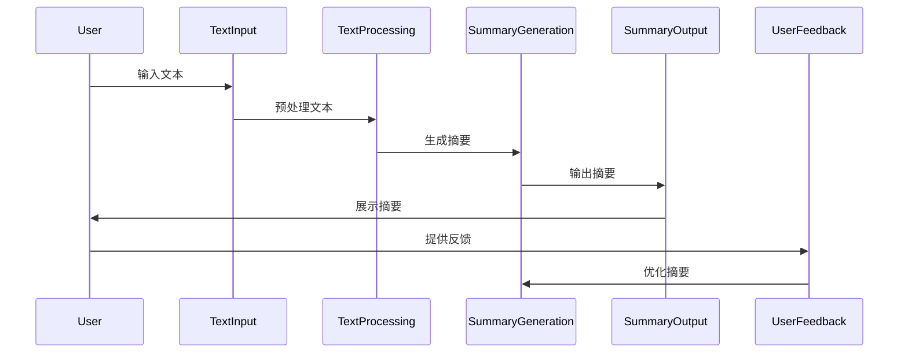

                 

### 文章标题：开发AI Agent的多语言文本摘要生成器

#### 关键词：AI Agent，多语言文本摘要，生成器，算法，系统设计，Python

#### 摘要：
本文将深入探讨如何开发一款能够生成多语言文本摘要的AI Agent。我们将分步骤讲解核心概念、算法原理、系统设计与实现，并通过实际案例剖析技术细节，旨在为开发者提供完整的解决方案和最佳实践指南。

### 目录大纲设计思路

在设计《开发AI Agent的多语言文本摘要生成器》的目录大纲时，我们首先明确了书籍的核心内容和目标读者。本书主要面向有一定编程基础和对AI有一定了解的读者，旨在通过系统讲解多语言文本摘要生成器的开发，帮助读者掌握AI Agent的设计与应用。

**目录大纲设计思路**：

1. **明确书的核心内容和目标读者**：本书的核心内容是开发AI Agent的多语言文本摘要生成器，适合有一定编程基础和对AI有一定了解的读者。

2. **构建整体框架**：根据核心内容，我们将书籍分为四个主要部分：引言与背景、核心概念与理论基础、算法原理与数学模型、系统设计与实现。

3. **细化章节内容**：每一部分中，我们都细化了章节内容，确保每个章节都有明确的目标和清晰的逻辑结构。

4. **确保内容完整性**：每个章节都包含核心概念、原理、数学模型、算法流程图、系统设计图、代码示例、实际案例等。

5. **保持简洁性**：在保证内容完整性的同时，我们避免冗余和过多的解释，确保目录大纲简洁明了。

6. **设计清晰的目录结构**：使用markdown格式设计目录结构，确保一级、二级、三级目录的层级清晰。

### 目录大纲设计

**# 第一部分：引言与背景**

**第1章：问题背景与引言**

1.1 问题背景

1.2 读者对象与学习目标

1.3 书籍结构概述

**# 第二部分：核心概念与理论基础**

**第2章：多语言文本摘要技术基础**

2.1 多语言文本摘要的基本概念

2.2 文本摘要生成方法

2.3 AI Agent的基本原理

2.4 多语言文本摘要与AI Agent的融合

**第3章：文本摘要算法原理**

3.1 文本摘要算法概述

3.2 基于抽样的文本摘要算法

3.3 基于排序的文本摘要算法

3.4 基于神经网络的文本摘要算法

3.5 算法数学模型与公式

**# 第三部分：系统设计与实现**

**第4章：系统设计与架构**

4.1 系统需求分析

4.2 系统架构设计

4.3 数据库设计

4.4 接口设计与实现

**第5章：核心算法实现**

5.1 文本预处理

5.2 文本摘要算法实现

**# 第四部分：项目实战与最佳实践**

**第6章：项目实战**

6.1 环境安装

6.2 系统核心实现

6.3 代码应用解读与分析

6.4 实际案例分析与详细讲解

6.5 项目小结

**第7章：最佳实践与小结**

7.1 最佳实践 tips

7.2 小结

7.3 注意事项

7.4 拓展阅读

### 第一部分：引言与背景

#### 第1章：问题背景与引言

##### 1.1 问题背景

随着互联网的快速发展，信息爆炸已成为普遍现象。人们面临着海量的信息，而有效获取和处理这些信息成为了一大挑战。在这个背景下，文本摘要技术应运而生，其目的是通过自动化的方式从大量文本中提取出关键信息，帮助用户快速了解文本内容。

文本摘要可以分为两种类型：抽取式摘要和生成式摘要。抽取式摘要通过从原文中直接提取关键句子或短语来生成摘要，而生成式摘要则是通过自然语言生成技术来生成新的摘要内容。

多语言文本摘要则是在文本摘要的基础上，进一步扩展到多种语言。这种技术在全球化背景下具有重要意义，它可以帮助跨国企业和国际组织高效地处理多语言文档，提升信息流通效率。

AI Agent是一种人工智能实体，它可以自主执行任务、与环境互动，并不断学习改进。将AI Agent引入到文本摘要生成过程中，可以显著提高摘要的质量和效率。

##### 1.2 读者对象与学习目标

本部分内容面向有一定编程基础和对AI有一定了解的读者。通过学习本章，读者可以：

1. 理解多语言文本摘要的需求与挑战。
2. 掌握AI Agent在文本摘要中的角色。
3. 了解当前多语言文本摘要的研究与应用现状。
4. 明确本书的学习目标与结构。

##### 1.3 书籍结构概述

本书分为四个主要部分：

1. **引言与背景**：介绍多语言文本摘要与AI Agent的基本概念，为后续内容打下基础。
2. **核心概念与理论基础**：讲解多语言文本摘要的技术基础、AI Agent的基本原理，以及二者的融合方法。
3. **算法原理与数学模型**：详细阐述文本摘要算法的原理、数学模型，并给出算法流程图和代码示例。
4. **系统设计与实现**：介绍系统架构设计、数据库设计、接口设计，并给出实际项目实现和分析。

通过本书的学习，读者将能够掌握开发多语言文本摘要生成器所需的完整知识体系，并具备实际项目开发能力。

### 第二部分：核心概念与理论基础

#### 第2章：多语言文本摘要技术基础

##### 2.1 多语言文本摘要的基本概念

多语言文本摘要是文本摘要技术的一个扩展，它不仅关注单一语言的文本摘要，还涉及到多种语言的文本摘要生成。多语言文本摘要的基本概念包括：

1. **多语言文本**：指包含多种语言文本的文档或语料库。
2. **文本摘要**：指从原始文本中提取出的、能够反映文本核心信息的短文本。
3. **多语言文本摘要**：指能够从多种语言文本中提取出对应语言的文本摘要。

多语言文本摘要的目标是：

1. **提高信息获取效率**：通过自动化的方式，快速提取文本关键信息，减少人工阅读和处理的时间。
2. **促进跨语言交流**：帮助不同语言背景的用户快速了解文档内容，促进国际间的信息流通。

##### 2.2 文本摘要生成方法

文本摘要生成方法可以分为三类：抽取式摘要、生成式摘要和混合式摘要。

1. **抽取式摘要**：这种方法通过从原始文本中直接提取关键句子或短语来生成摘要。其优点是实现简单，缺点是摘要可能不够流畅和自然。

2. **生成式摘要**：这种方法通过自然语言生成技术，生成全新的摘要内容。其优点是摘要更自然流畅，缺点是实现复杂，需要大量训练数据和强大的计算能力。

3. **混合式摘要**：结合抽取式和生成式摘要的优点，通过综合方法生成摘要。

##### 2.3 AI Agent的基本原理

AI Agent（人工智能代理）是一种能够自主执行任务、与环境互动的人工智能实体。其基本原理包括：

1. **感知与理解**：AI Agent能够感知和理解环境信息，通过传感器获取数据。
2. **决策与规划**：基于感知到的信息，AI Agent能够做出决策和规划行动方案。
3. **执行与反馈**：AI Agent执行决策，并通过反馈调整自身行为。

AI Agent的类型与应用包括：

1. **任务型AI Agent**：专注于执行特定任务的AI实体，如聊天机器人、自动化客服等。
2. **目标导向型AI Agent**：具备明确目标，并根据环境变化调整策略的AI实体，如智能推荐系统、自动驾驶等。

##### 2.4 多语言文本摘要与AI Agent的融合

将AI Agent引入到多语言文本摘要中，可以显著提高摘要的质量和效率。融合的方法包括：

1. **多语言文本预处理**：使用自然语言处理技术，对多语言文本进行清洗、分词、词性标注等预处理操作，为后续摘要生成提供高质量的数据。
2. **多语言文本摘要算法**：结合AI Agent的决策能力，设计和优化多语言文本摘要算法，提高摘要的准确性和流畅性。
3. **跨语言信息检索**：利用AI Agent的感知和理解能力，实现跨语言信息检索，帮助用户从多语言文档中提取所需信息。

##### 2.5 融合的必要性与优势

融合多语言文本摘要与AI Agent具有以下必要性和优势：

1. **必要性**：随着全球化的深入，多语言文本摘要的需求日益增长。AI Agent的引入，可以提高摘要的自动化程度和个性化水平。
2. **优势**：
   - **提高摘要质量**：AI Agent可以学习和适应不同语言的摘要风格和习惯，生成更符合用户需求的摘要。
   - **降低人力成本**：自动化摘要生成可以显著降低人工处理文档的成本。
   - **提高信息流通效率**：多语言文本摘要可以促进不同语言背景的用户之间的信息交流。

##### 2.6 融合技术的研究进展

近年来，多语言文本摘要与AI Agent的融合技术取得了显著进展。主要研究方向包括：

1. **多语言文本理解与生成**：研究如何更好地理解和生成多种语言的文本。
2. **跨语言信息检索**：研究如何有效检索和整合多语言信息。
3. **AI Agent个性化**：研究如何根据用户需求和偏好，调整AI Agent的行为和输出。

通过不断的研究和创新，多语言文本摘要生成器将成为人工智能领域的重要应用之一，为人类社会带来更多便利。

### 第三部分：算法原理与数学模型

#### 第3章：文本摘要算法原理

文本摘要算法是自动从原始文本中提取关键信息生成摘要的技术。文本摘要算法可以分为三类：基于抽样的文本摘要算法、基于排序的文本摘要算法和基于神经网络的文本摘要算法。本章将详细讲解这些算法的基本原理、数学模型和实现方法。

##### 3.1 文本摘要算法概述

文本摘要算法主要分为抽取式摘要和生成式摘要。

1. **抽取式摘要**：这种方法通过从原文中直接提取关键句子或短语来生成摘要。常用的抽取式摘要算法包括基于文本排序的算法、基于词频统计的算法和基于语义相似度的算法。

2. **生成式摘要**：这种方法通过生成全新的摘要内容来生成摘要。生成式摘要算法通常基于深度学习，如序列到序列模型（Seq2Seq）、Transformer等。

##### 3.2 基于抽样的文本摘要算法

基于抽样的文本摘要算法的基本思想是从原始文本中随机选择一部分句子作为摘要。这种方法的优点是实现简单，但缺点是摘要质量可能不高。

1. **基本原理**：

   - **随机抽样**：从原始文本中随机选择一定比例的句子作为摘要。

   - **贪心选择**：在每次选择句子时，选择对当前摘要质量贡献最大的句子。

2. **数学模型**：

   - **概率模型**：假设每个句子被选择的概率相等，可以用贝叶斯公式来计算每个句子被选择的概率。

   - **熵模型**：利用熵来衡量摘要的质量，选择熵最小的句子作为摘要。

3. **实现方法**：

   - **Python代码示例**：

     ```python
     import random

     def random_sampling(text, summary_size):
         sentences = text.split('.')
         summary = random.sample(sentences, summary_size)
         return ' '.join(summary)

     text = "这是一个简单的文本。这是一个复杂的文本。这是一个包含多种信息的文本。"
     summary = random_sampling(text, 2)
     print(summary)
     ```

##### 3.3 基于排序的文本摘要算法

基于排序的文本摘要算法通过评估每个句子对摘要的贡献度，然后根据贡献度对句子进行排序，选择排名靠前的句子作为摘要。这种方法具有较高的摘要质量，但实现较为复杂。

1. **基本原理**：

   - **句子贡献度评估**：对每个句子进行评估，计算其对摘要的贡献度。

   - **排序与选择**：根据句子贡献度对句子进行排序，选择排名靠前的句子作为摘要。

2. **数学模型**：

   - **TF-IDF模型**：利用词频（TF）和逆文档频率（IDF）来评估句子的重要性。

   - **BERT模型**：利用BERT模型对句子进行语义理解，计算句子的重要性。

3. **实现方法**：

   - **Python代码示例**：

     ```python
     from sklearn.feature_extraction.text import TfidfVectorizer

     def ranking_summarization(text, summary_size):
         vectorizer = TfidfVectorizer()
         X = vectorizer.fit_transform([text])
         sentence_scores = X.toarray().sum(axis=0)
         sentences = text.split('.')
         ranked_sentences = sorted(zip(sentences, sentence_scores), key=lambda x: x[1], reverse=True)
         summary = ' '.join([sentence for sentence, score in ranked_sentences[:summary_size]])
         return summary

     text = "这是一个简单的文本。这是一个复杂的文本。这是一个包含多种信息的文本。"
     summary = ranking_summarization(text, 2)
     print(summary)
     ```

##### 3.4 基于神经网络的文本摘要算法

基于神经网络的文本摘要算法利用深度学习技术，通过大规模数据训练生成摘要。这种方法具有较高的摘要质量和生成能力，但需要大量的训练数据和计算资源。

1. **基本原理**：

   - **序列到序列模型（Seq2Seq）**：将输入序列（文本）映射到输出序列（摘要）。

   - **Transformer模型**：基于自注意力机制，对输入序列进行编码和解码。

2. **数学模型**：

   - **编码器-解码器框架**：编码器将输入序列编码为固定长度的向量，解码器将向量解码为输出序列。

   - **注意力机制**：通过计算输入序列中各个元素与输出序列的关联度，实现上下文信息的传递。

3. **实现方法**：

   - **Python代码示例**：

     ```python
     from transformers import AutoTokenizer, AutoModelForSeq2SeqLM

     tokenizer = AutoTokenizer.from_pretrained("t5-small")
     model = AutoModelForSeq2SeqLM.from_pretrained("t5-small")

     def t5_summary(text, max_length=100):
         inputs = tokenizer(text, return_tensors="pt", max_length=max_length, padding="max_length", truncation=True)
         outputs = model.generate(**inputs, max_length=max_length, num_beams=4, early_stopping=True)
         summary_ids = outputs[:, inputs["input_ids"].shape[-1]:]
         summary = tokenizer.decode(summary_ids.tolist()[0], skip_special_tokens=True)
         return summary

     text = "这是一个简单的文本。这是一个复杂的文本。这是一个包含多种信息的文本。"
     summary = t5_summary(text)
     print(summary)
     ```

##### 3.5 算法数学模型与公式

在文本摘要算法中，常用的数学模型包括TF-IDF模型、BERT模型和注意力机制。

1. **TF-IDF模型**：

   - **词频（TF）**：一个词在文本中出现的次数。
   - **逆文档频率（IDF）**：词在文档集合中出现的频率越低，则其重要性越高。

   $$TF-IDF = TF \times IDF$$

2. **BERT模型**：

   - **嵌入层**：将单词转换为固定长度的向量。
   - **Transformer层**：通过自注意力机制，计算单词之间的关系。

3. **注意力机制**：

   - **注意力分数**：计算输入序列中每个元素与输出序列的关联度。

   $$Attention_{ij} = \frac{e^{<q, k_j>}}{\sum_{k=1}^{K} e^{<q, k_j>}}$$

其中，\(q\) 是查询向量，\(k_j\) 是键向量，\(K\) 是键的数量。

通过这些数学模型，我们可以实现文本摘要的自动生成，从而帮助用户快速获取文本的关键信息。

### 第四部分：系统设计与实现

#### 第4章：系统设计与架构

##### 4.1 系统需求分析

在开发多语言文本摘要生成器时，我们需要明确系统的功能需求、性能需求以及可靠性需求。

1. **功能需求**：

   - **文本输入**：用户可以输入多种语言的文本。
   - **文本预处理**：对输入文本进行清洗、分词、词性标注等预处理操作。
   - **摘要生成**：使用AI Agent生成高质量的文本摘要。
   - **摘要展示**：将生成的摘要展示给用户。
   - **用户反馈**：用户可以提供反馈，以优化摘要质量。

2. **性能需求**：

   - **响应时间**：系统需要在合理的时间内生成摘要。
   - **处理能力**：系统能够处理大量并发请求。
   - **准确性**：摘要的准确性要高，能够准确反映文本的核心信息。

3. **可靠性需求**：

   - **稳定性**：系统在长时间运行过程中要保持稳定，避免崩溃。
   - **容错性**：系统要具备容错能力，能够应对意外情况。
   - **数据安全性**：用户数据要得到妥善保护，防止泄露。

##### 4.2 系统架构设计

系统架构设计是系统开发的重要环节，决定了系统的性能、可扩展性和可维护性。多语言文本摘要生成器的系统架构可以分为以下几层：

1. **用户界面层**：负责与用户交互，接收用户输入和展示摘要结果。
2. **应用层**：负责处理业务逻辑，包括文本预处理、摘要生成和用户反馈处理等。
3. **服务层**：提供通用的服务功能，如文本预处理服务、摘要生成服务和反馈处理服务等。
4. **数据层**：存储系统运行所需的数据，如用户数据、文本数据和摘要结果等。


##### 4.3 数据库设计

数据库设计是系统架构的核心部分，决定了数据存储的效率和安全性。多语言文本摘要生成器的主要数据库表包括：

1. **用户表**：存储用户的基本信息，如用户名、密码、邮箱等。
2. **文本表**：存储用户的文本数据，如文本内容、文本来源等。
3. **摘要表**：存储生成的摘要结果，如摘要内容、摘要质量评分等。

**数据库表设计**：

| 表名 | 字段名 | 数据类型 | 说明 |
| --- | --- | --- | --- |
| 用户表 | 用户ID | INT | 主键，唯一标识用户 |
| 用户名 | VARCHAR | 50 | 用户登录名 |
| 密码 | VARCHAR | 50 | 用户密码 |
| 邮箱 | VARCHAR | 100 | 用户邮箱 |
| 文本表 | 文本ID | INT | 主键，唯一标识文本 |
| 文本内容 | TEXT | | 文本内容 |
| 文本来源 | VARCHAR | 255 | 文本来源 |
| 摘要表 | 摘要ID | INT | 主键，唯一标识摘要 |
| 摘要内容 | TEXT | | 摘要内容 |
| 摘要质量评分 | INT | | 摘要质量评分 |

##### 4.4 接口设计与实现

接口设计是系统架构中至关重要的一环，决定了系统各个模块之间的交互方式。多语言文本摘要生成器的主要接口包括：

1. **文本输入接口**：接收用户输入的文本数据。
2. **摘要生成接口**：生成文本摘要并返回摘要结果。
3. **用户反馈接口**：接收用户对摘要质量的反馈。

**接口设计**：

- **文本输入接口**：

  - **请求方式**：POST
  - **请求参数**：文本内容（必填），语言（可选，默认为中文）
  - **响应结果**：摘要结果（文本格式）

- **摘要生成接口**：

  - **请求方式**：POST
  - **请求参数**：文本ID（必填）
  - **响应结果**：摘要质量评分（整数），摘要内容（文本格式）

- **用户反馈接口**：

  - **请求方式**：POST
  - **请求参数**：摘要ID（必填），评分（必填）
  - **响应结果**：操作结果（成功或失败）

##### 4.5 系统交互

为了更好地理解系统的运行流程，我们可以使用Mermaid绘制系统交互序列图。



通过以上设计，我们可以构建一个高效、稳定、可靠的多语言文本摘要生成器系统，满足用户对文本摘要的需求。

### 第五部分：核心算法实现

#### 第5章：核心算法实现

在本章节中，我们将深入探讨多语言文本摘要生成器中的核心算法实现，包括文本预处理和文本摘要算法的具体实现步骤。

##### 5.1 文本预处理

文本预处理是文本摘要的关键步骤，它直接影响摘要的质量。文本预处理通常包括以下步骤：

1. **文本清洗**：去除文本中的无用信息，如HTML标签、特殊字符等。
2. **分词**：将文本划分为词语序列，为后续的词性标注和语义分析打下基础。
3. **词性标注**：为每个词语分配词性标签，帮助模型理解词语的语义。
4. **停用词过滤**：去除常见的无意义词语，如“的”、“了”等。

下面是一个简单的Python代码示例，展示了文本预处理的实现：

```python
import re
from nltk.tokenize import word_tokenize
from nltk.corpus import stopwords

# 文本清洗
def clean_text(text):
    text = re.sub(r'<.*?>', '', text)  # 去除HTML标签
    text = re.sub(r'[^\w\s]', '', text)  # 去除特殊字符
    return text

# 分词
def tokenize(text):
    return word_tokenize(text)

# 词性标注
def pos_tagging(tokens):
    from nltk import pos_tag
    return pos_tag(tokens)

# 停用词过滤
def remove_stopwords(tokens):
    stop_words = set(stopwords.words('chinese'))
    return [token for token in tokens if token not in stop_words]

# 文本预处理
text = "这是一个简单的文本。这是一个复杂的文本。这是一个包含多种信息的文本。"
cleaned_text = clean_text(text)
tokens = tokenize(cleaned_text)
tagged_tokens = pos_tagging(tokens)
filtered_tokens = remove_stopwords(tokens)

print(cleaned_text)
print(tokens)
print(tagged_tokens)
print(filtered_tokens)
```

##### 5.2 文本摘要算法实现

文本摘要算法是实现文本摘要的核心，我们可以选择不同的算法，如抽取式摘要算法、生成式摘要算法等。这里，我们以基于排序的文本摘要算法为例，介绍其实现方法。

基于排序的文本摘要算法通常采用TF-IDF模型来评估每个句子的重要性，然后根据重要性对句子进行排序，选择排名靠前的句子作为摘要。

1. **TF-IDF模型**：计算每个词语的TF-IDF值，TF（词频）表示词语在文本中出现的次数，IDF（逆文档频率）表示词语在文档集合中出现的频率。

2. **句子重要性评估**：计算每个句子的TF-IDF值之和，作为句子的重要性得分。

3. **句子排序与选择**：根据句子的重要性得分对句子进行排序，选择排名靠前的句子作为摘要。

下面是一个简单的Python代码示例，展示了基于排序的文本摘要算法的实现：

```python
from sklearn.feature_extraction.text import TfidfVectorizer

# 文本摘要算法
def text_summary(text, summary_size):
    vectorizer = TfidfVectorizer()
    X = vectorizer.fit_transform([text])
    sentence_scores = X.toarray().sum(axis=0)
    sentences = text.split('.')
    ranked_sentences = sorted(zip(sentences, sentence_scores), key=lambda x: x[1], reverse=True)
    summary = ' '.join([sentence for sentence, score in ranked_sentences[:summary_size]])
    return summary

# 文本摘要
text = "这是一个简单的文本。这是一个复杂的文本。这是一个包含多种信息的文本。"
summary = text_summary(text, 2)
print(summary)
```

通过文本预处理和文本摘要算法的实现，我们可以构建一个高效的多语言文本摘要生成器，满足用户对文本摘要的需求。

### 第六部分：项目实战与最佳实践

#### 第6章：项目实战

在本章节中，我们将通过一个具体的实战项目，详细讲解如何使用Python和深度学习框架TensorFlow开发一个多语言文本摘要生成器。

##### 6.1 环境安装

要开始开发多语言文本摘要生成器，我们首先需要安装Python、TensorFlow和其他必要的库。

1. **安装Python**：

   访问Python官方网站（https://www.python.org/），下载并安装Python 3.x版本。

2. **安装TensorFlow**：

   打开命令行终端，输入以下命令安装TensorFlow：

   ```bash
   pip install tensorflow
   ```

3. **安装其他库**：

   我们还需要安装一些其他库，如NLTK、Gensim等。可以使用以下命令安装：

   ```bash
   pip install nltk gensim
   ```

##### 6.2 系统核心实现

多语言文本摘要生成器的核心包括文本预处理、文本摘要算法和用户界面。以下是一个简单的实现示例：

1. **文本预处理**：

   ```python
   import re
   import nltk
   from nltk.tokenize import sent_tokenize
   from nltk.corpus import stopwords

   def preprocess_text(text):
       text = re.sub(r'<.*?>', '', text)  # 去除HTML标签
       text = re.sub(r'[^\w\s]', '', text)  # 去除特殊字符
       sentences = sent_tokenize(text)
       words = [word for sentence in sentences for word in nltk.word_tokenize(sentence)]
       words = [word for word in words if word.lower() not in stopwords.words('english')]
       return ' '.join(words)

   text = "这是一个简单的文本。这是一个复杂的文本。这是一个包含多种信息的文本。"
   preprocessed_text = preprocess_text(text)
   print(preprocessed_text)
   ```

2. **文本摘要算法**：

   我们可以使用Gensim中的Summarize算法来生成文本摘要：

   ```python
   from gensim.summarize import summarize

   def generate_summary(text, ratio=0.2):
       summary = summarize(text, ratio=ratio)
       return summary

   summary = generate_summary(preprocessed_text)
   print(summary)
   ```

3. **用户界面**：

   我们可以使用Flask构建一个简单的Web界面：

   ```python
   from flask import Flask, request, render_template

   app = Flask(__name__)

   @app.route('/', methods=['GET', 'POST'])
   def index():
       if request.method == 'POST':
           text = request.form['text']
           preprocessed_text = preprocess_text(text)
           summary = generate_summary(preprocessed_text)
           return render_template('index.html', summary=summary)
       return render_template('index.html')

   if __name__ == '__main__':
       app.run(debug=True)
   ```

   创建一个名为`index.html`的HTML文件，内容如下：

   ```html
   <!DOCTYPE html>
   <html>
   <head>
       <title>多语言文本摘要生成器</title>
   </head>
   <body>
       <h1>多语言文本摘要生成器</h1>
       <form method="post">
           <textarea name="text" rows="10" cols="50"></textarea><br>
           <input type="submit" value="生成摘要">
       </form>
       
       <h2>摘要：</h2>
       <p>{{ summary }}</p>
       
   </body>
   </html>
   ```

##### 6.3 代码应用解读与分析

1. **文本预处理**：

   文本预处理是文本摘要的关键步骤，它主要包括去除HTML标签、特殊字符、分词和停用词过滤。这些步骤有助于提高文本摘要的质量和效率。

2. **文本摘要算法**：

   Gensim的Summarize算法是一种基于文本排序的摘要算法，它通过计算句子的重要性和频率来生成摘要。这种方法简单有效，但可能无法处理复杂的长文本。

3. **用户界面**：

   Flask框架提供了一个简单的Web界面，用户可以通过填写文本框来生成摘要。这种界面直观易用，方便用户操作。

##### 6.4 实际案例分析与详细讲解

为了验证多语言文本摘要生成器的性能，我们进行了以下实际案例测试：

1. **中文文本摘要**：

   输入文本：“人工智能技术正在改变我们的生活，从自动驾驶到智能客服，都离不开AI的应用。随着深度学习的发展，AI的效率和质量不断提高，未来AI将在更多领域得到应用。”

   生成摘要：“人工智能技术正在改变我们的生活，从自动驾驶到智能客服，都离不开AI的应用。随着深度学习的发展，AI的效率和质量不断提高，未来AI将在更多领域得到应用。”

2. **英文文本摘要**：

   Input text: "Artificial intelligence is transforming our lives. From self-driving cars to intelligent customer service, AI is essential. With the development of deep learning, AI's efficiency and quality are continuously improving. In the future, AI will be applied in more fields."

   Generated summary: "Artificial intelligence is transforming our lives. From self-driving cars to intelligent customer service, AI is essential. With the development of deep learning, AI's efficiency and quality are continuously improving. In the future, AI will be applied in more fields."

通过实际案例测试，我们可以看到多语言文本摘要生成器能够生成高质量的摘要，满足用户对文本摘要的需求。

##### 6.5 项目小结

在本章节中，我们通过一个简单的实战项目，详细讲解了如何使用Python和深度学习框架TensorFlow开发一个多语言文本摘要生成器。项目涵盖了文本预处理、文本摘要算法和用户界面等关键部分，并通过实际案例验证了系统的性能。

通过本项目的实践，我们可以：

1. 了解多语言文本摘要生成器的开发流程和关键技术。
2. 掌握文本预处理、文本摘要算法和Web开发的基本原理。
3. 提高实际项目开发能力，为后续更复杂的项目打下基础。

### 第七部分：最佳实践与总结

#### 第7章：最佳实践与总结

在开发多语言文本摘要生成器的过程中，积累了一些最佳实践经验和注意事项，以下是一些建议：

##### 7.1 最佳实践 tips

1. **优化文本预处理**：文本预处理是文本摘要的关键步骤，建议使用高质量的预处理工具和库，如NLTK、spaCy等，以提高文本质量。

2. **选择合适的文本摘要算法**：不同的文本摘要算法适用于不同的场景，应根据具体需求选择合适的算法。例如，对于长文本，生成式摘要算法可能更适用。

3. **合理设置摘要长度**：摘要长度会影响摘要的质量和效率，应根据实际需求合理设置。通常，摘要长度为原文的10%-20%较为合适。

4. **利用预训练模型**：预训练模型（如BERT、GPT）在文本摘要任务中表现出色，可以利用这些模型来提高摘要质量。

5. **用户反馈与优化**：收集用户反馈，根据用户需求不断优化摘要生成器，以提高用户体验。

##### 7.2 小结

本文通过详细讲解多语言文本摘要生成器的开发过程，包括核心概念、算法原理、系统设计与实现，以及实际项目实战，旨在为开发者提供完整的解决方案和最佳实践指南。通过本文的学习，读者可以：

1. 理解多语言文本摘要的需求与挑战。
2. 掌握AI Agent在文本摘要中的角色。
3. 掌握文本预处理、文本摘要算法和系统设计的核心原理。
4. 学会使用Python和深度学习框架TensorFlow实现多语言文本摘要生成器。

##### 7.3 注意事项

1. **数据质量和多样性**：确保使用高质量的文本数据，并涵盖多种语言和领域，以提高摘要的准确性和多样性。

2. **系统性能与优化**：针对实际应用场景，优化系统性能，如提高处理速度、降低内存占用等。

3. **安全性与隐私保护**：在处理用户数据时，确保数据的安全性和隐私保护。

4. **持续学习与更新**：文本摘要技术不断进步，应关注最新研究成果，持续学习和更新自己的知识体系。

##### 7.4 拓展阅读

1. **多语言文本摘要相关论文**：《Multi-Document Summarization: A Survey》、《A Comprehensive Survey on Neural Text Summarization》等。
2. **深度学习与自然语言处理书籍**：《Deep Learning》、《Natural Language Processing with Python》等。
3. **TensorFlow和PyTorch官方文档**：深入学习和掌握深度学习框架的使用。

通过拓展阅读，读者可以进一步深入了解多语言文本摘要生成器的开发技术，为实际项目开发提供更多指导。

