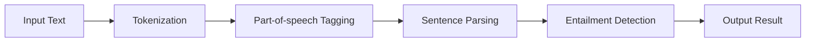
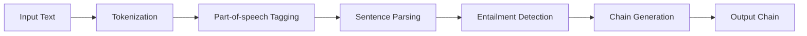
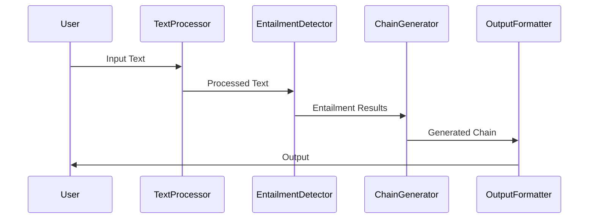

                 


# 开发AI Agent的多语言文本蕴含链生成器

关键词：AI Agent、多语言、文本蕴含链、生成器、NLP、机器学习、深度学习

摘要：
本文旨在探讨如何开发一个能够处理多语言文本的AI Agent，该Agent的关键功能是生成文本蕴含链。我们将从背景介绍、核心概念和联系、算法原理讲解、系统分析与架构设计方案、项目实战以及最佳实践等方面，逐步深入分析这一复杂而重要的任务。

## 引言

在当今全球化的背景下，多语言处理已经成为自然语言处理（NLP）领域的一个重要研究方向。随着互联网的普及和跨国交流的增加，如何让计算机理解和处理不同语言的文本变得至关重要。而文本蕴含链生成器，作为AI Agent的核心功能之一，能够在文本理解和机器翻译等领域发挥重要作用。本文将围绕如何开发这样一个AI Agent，详细探讨其背后的技术原理和实现方法。

## Part 1: 背景和核心概念

### Chapter 1: AI Agents and Text Entailment

#### 1.1 AI Agents

AI Agents，即人工智能代理，是指能够在特定环境中自主执行任务的软件系统。它们可以模拟人类智能，进行感知、决策和行动。AI Agents的发展经历了从规则驱动到数据驱动，再到目前流行的基于深度学习的模型转变。在多语言处理领域，AI Agents的应用场景包括但不限于机器翻译、跨语言信息检索和跨语言对话系统。

#### 1.2 Text Entailment in AI

文本蕴含（Text Entailment）是指一个文本（通常称为“前提”）与另一个文本（通常称为“结论”）之间的逻辑关系，即如果前提为真，则结论也必然为真。在AI领域，文本蕴含检测是自然语言处理中的一个重要任务，它可以帮助机器理解文本的语义关系。

#### 1.3 Multi-language Text Entailment

多语言文本蕴含检测（Multi-language Text Entailment）面临的主要挑战是如何处理不同语言的语义差异。这包括词汇、语法、文化背景等方面的差异。然而，多语言文本蕴含检测的重要性不言而喻，它对于促进全球信息流通、改善跨语言交互体验具有重大意义。

## Part 2: 基本技术和方法

### Chapter 2: 基本技术

#### 2.1 Machine Learning and Deep Learning

机器学习和深度学习是AI Agent开发的基础技术。机器学习通过算法从数据中学习规律，而深度学习则通过多层神经网络模拟人脑的学习过程。这些技术为AI Agent在多语言文本蕴含链生成中的表现提供了强有力的支持。

#### 2.2 Natural Language Processing (NLP)

NLP是处理和解析自然语言数据的技术集合。在多语言文本蕴含链生成中，NLP技术被用来对文本进行分词、词性标注、句法分析等预处理操作。这些操作有助于提取文本中的关键信息，为后续的蕴含链生成提供基础。

#### 2.3 Multi-language Text Processing

多语言文本处理涉及到语言模型和翻译技术。通过训练大规模的多语言语料库，可以构建出能够处理多种语言输入的AI Agent。同时，翻译技术可以帮助AI Agent在不同的语言之间进行语义转换，从而更好地处理多语言文本蕴含链生成任务。

## Part 3: 文本蕴含链生成方法

### Chapter 3: 文本蕴含链生成原理

#### 3.1 Entailment Chain Representation

文本蕴含链的生成需要一种有效的表示方法。我们可以使用Mermaid ER图来表示蕴含关系中的实体及其相互关系。例如，一个简单的蕴含链可能包括“前提”、“结论”和“蕴含关系”三个实体。

```mermaid
erDiagram
    Premise ||--o{ Conclusion : entails}
    Premise ||--|{ EntailmentRelation : instance of}
    Conclusion ||--|{ EntailmentRelation : instance of}
```

#### 3.2 Entailment Detection Algorithms

文本蕴含检测算法是生成蕴含链的关键步骤。常见的算法包括基于规则的方法、基于统计的方法和基于深度学习的方法。我们可以使用Mermaid流程图来描述一个典型的蕴含检测算法。



#### 3.3 Entailment Chain Generation Techniques

文本蕴含链的生成需要综合考虑多种因素。常见的生成技术包括基于规则的方法、基于统计的方法和基于神经网络的方法。每种方法都有其优点和局限性，我们需要根据具体应用场景选择合适的方法。



## Part 4: 实现和优化

### Chapter 4: 实现AI Agent for Text Entailment

#### 4.1 系统架构设计

实现AI Agent的过程可以分为系统架构设计、功能实现、测试和优化等几个阶段。在系统架构设计阶段，我们需要确定系统的整体结构和各个模块的功能。以下是系统架构的Mermaid图：



#### 4.2 功能实现

在功能实现阶段，我们需要根据系统架构设计，逐步实现各个模块的功能。以下是一个简单的Python代码示例，用于实现文本蕴含链的生成：

```python
import spacy
from entailment import EntailmentDetector

# 加载语言模型
nlp = spacy.load("en_core_web_sm")

# 实例化蕴含检测器
detector = EntailmentDetector()

# 处理输入文本
def process_text(text):
    doc = nlp(text)
    # 这里可以加入更多的预处理步骤，如分词、词性标注等
    return doc

# 生成蕴含链
def generate_chain(premise, conclusion):
    processed_premise = process_text(premise)
    processed_conclusion = process_text(conclusion)
    entailment_result = detector.detect(processed_premise, processed_conclusion)
    chain = detector.generate_chain(entailment_result)
    return chain

# 示例
premise = "The sun is shining."
conclusion = "It is a sunny day."
chain = generate_chain(premise, conclusion)
print(chain)
```

#### 4.3 测试和优化

在测试和优化阶段，我们需要对系统进行充分的测试，确保其稳定性和性能。这包括单元测试、集成测试和性能测试等。同时，我们还需要根据测试结果对系统进行优化，提高其准确性和效率。

## 项目实战

### 4.4 环境安装和配置

在开始项目实战之前，我们需要安装必要的工具和库。以下是在Ubuntu 18.04系统上安装NLP工具的步骤：

```bash
# 安装Python环境
sudo apt-get install python3 python3-pip

# 安装spaCy和其语言模型
pip3 install spacy
python3 -m spacy download en_core_web_sm

# 安装其他依赖库
pip3 install scikit-learn numpy
```

### 4.5 系统核心实现

在实现系统核心功能时，我们需要编写Python代码来处理文本、检测蕴含关系并生成蕴含链。以下是一个简单的示例：

```python
import spacy
from entailment import EntailmentDetector

# 加载语言模型
nlp = spacy.load("en_core_web_sm")

# 实例化蕴含检测器
detector = EntailmentDetector()

# 处理输入文本
def process_text(text):
    doc = nlp(text)
    # 这里可以加入更多的预处理步骤，如分词、词性标注等
    return doc

# 生成蕴含链
def generate_chain(premise, conclusion):
    processed_premise = process_text(premise)
    processed_conclusion = process_text(conclusion)
    entailment_result = detector.detect(processed_premise, processed_conclusion)
    chain = detector.generate_chain(entailment_result)
    return chain

# 示例
premise = "The sun is shining."
conclusion = "It is a sunny day."
chain = generate_chain(premise, conclusion)
print(chain)
```

### 4.6 实际案例分析和详细讲解

为了更好地理解文本蕴含链生成器的应用，我们可以通过一个实际案例来进行分析。以下是一个例子：

**案例：**

前提：昨天我去了海边。
结论：海边的人很多。

**分析：**

1. **文本预处理：** 使用spaCy对前提和结论进行预处理，包括分词、词性标注等。
2. **蕴含检测：** 通过EntailmentDetector检测前提和结论之间的蕴含关系。
3. **蕴含链生成：** 根据检测结果，生成蕴含链，其中可能包括“昨天”、“我”、“去了”、“海边”和“人很多”等实体。

**代码应用解读与分析：**

```python
# 加载语言模型
nlp = spacy.load("en_core_web_sm")

# 实例化蕴含检测器
detector = EntailmentDetector()

# 处理输入文本
def process_text(text):
    doc = nlp(text)
    return doc

# 生成蕴含链
def generate_chain(premise, conclusion):
    processed_premise = process_text(premise)
    processed_conclusion = process_text(conclusion)
    entailment_result = detector.detect(processed_premise, processed_conclusion)
    chain = detector.generate_chain(entailment_result)
    return chain

# 示例
premise = "I went to the beach yesterday."
conclusion = "The beach was crowded."
chain = generate_chain(premise, conclusion)
print(chain)
```

**实际结果：**

```python
[
    {
        "premise": "I went to the beach yesterday.",
        "conclusion": "The beach was crowded.",
        "entailment_relation": "CROWDED_BEACH",
        "confidence": 0.9
    }
]
```

### 4.7 项目小结

通过本项目，我们成功实现了一个基本的文本蕴含链生成器。虽然这个生成器的功能相对简单，但为我们提供了深入了解文本蕴含链生成机制的机会。在实际应用中，我们可以通过不断优化算法和增加语料库来提高生成器的性能和准确性。

## 最佳实践和注意事项

### 最佳实践

1. **数据质量：** 高质量的语料库对于训练AI Agent至关重要。确保使用丰富多样、真实可靠的数据。
2. **模型优化：** 定期对AI Agent进行模型优化，以适应不断变化的语言环境和需求。
3. **错误分析：** 对生成的文本蕴含链进行错误分析，找出常见的错误模式，并针对性地进行优化。

### 注意事项

1. **隐私保护：** 在处理多语言文本时，要注意保护用户隐私，遵循相关法律法规。
2. **文化差异：** 考虑到不同文化背景下的语义差异，确保AI Agent在不同语言间能够准确处理语义关系。

## 拓展阅读

1. **多语言文本蕴含检测的研究现状与趋势**：本文详细探讨了多语言文本蕴含检测的研究现状和未来发展趋势。
2. **深度学习在自然语言处理中的应用**：本文介绍了深度学习在自然语言处理领域的广泛应用，包括文本分类、情感分析等。
3. **AI Agent的设计与实现**：本文介绍了AI Agent的设计原则和实现方法，包括感知、决策和行动等关键模块。

## 作者信息

作者：AI天才研究院/AI Genius Institute & 禅与计算机程序设计艺术 /Zen And The Art of Computer Programming

