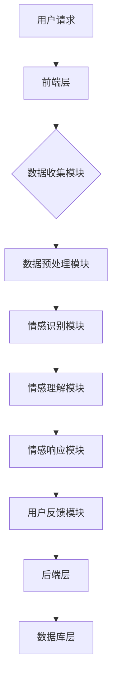
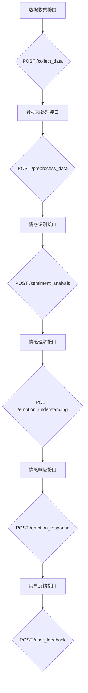
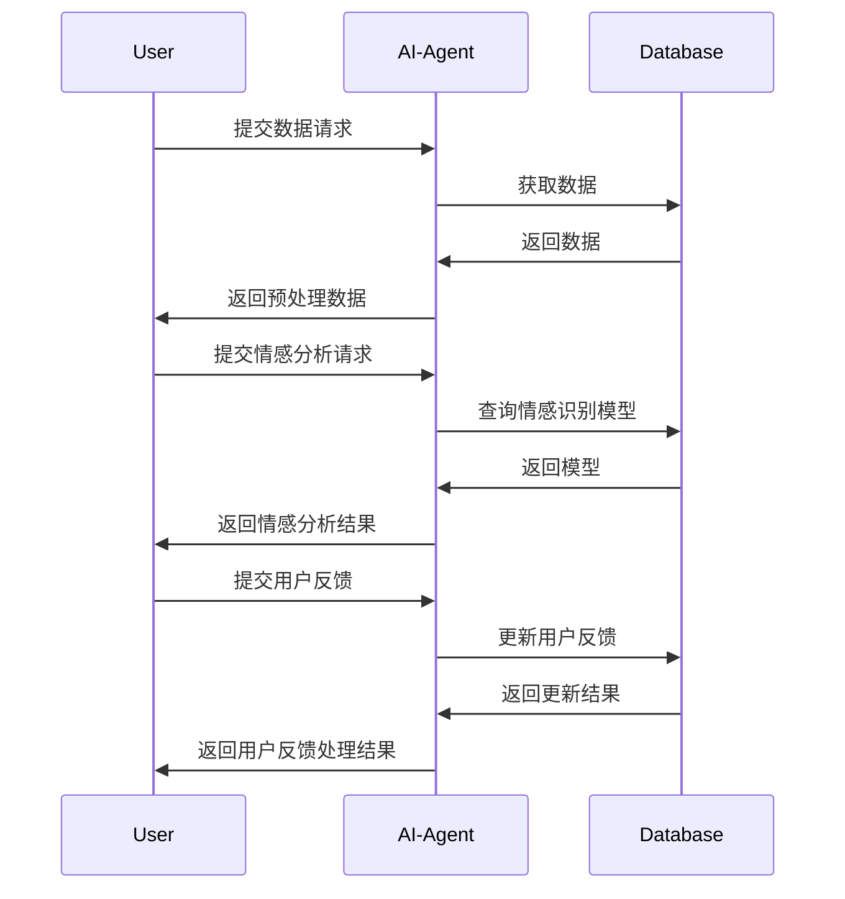
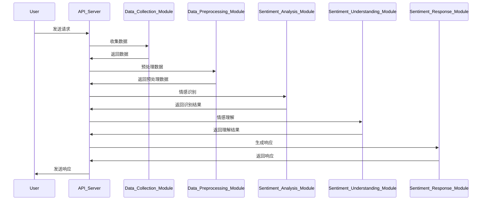

                 

## 开发AI Agent的情感计算在社交媒体分析中的应用

### 关键词

- AI Agent
- 情感计算
- 社交媒体分析
- 情感识别
- 言语情感分析
- 自然语言处理
- 数据挖掘
- 系统架构设计

### 摘要

本文旨在探讨开发AI Agent进行情感计算在社交媒体分析中的应用。文章首先介绍了情感计算的基本概念及其在AI Agent中的重要性，然后详细讨论了社交媒体分析的基本概念和方法。接着，文章重点介绍了如何将情感计算应用于社交媒体分析，并提供了实际案例研究。此外，文章还探讨了如何构建和训练用于社交媒体分析的AI Agent，以及情感计算在社交媒体分析中的未来发展方向。通过本文的阅读，读者可以全面了解情感计算在社交媒体分析中的应用，掌握相关技术和方法。

### 目录

1. **背景介绍**
   - **核心概念术语说明**
     - 情感计算
     - AI Agent
     - 社交媒体分析
   - **问题背景**
     - 社交媒体数据的爆发增长
     - 情感计算在社交媒体分析中的需求
   - **问题描述**
     - 如何有效利用情感计算进行社交媒体分析
   - **问题解决**
     - 开发AI Agent进行情感计算
   - **边界与外延**
     - 社交媒体分析的应用领域
     - 情感计算的技术挑战
   - **概念结构与核心要素组成**
     - AI Agent的核心功能
     - 情感计算的关键技术
     - 社交媒体分析的数据处理流程

2. **核心概念与联系**
   - **情感计算的概念原理**
     - 情感计算的定义
     - 情感计算的技术原理
     - 情感计算的应用领域
   - **情感计算在AI Agent中的应用**
     - AI Agent的情感计算实现
     - AI Agent的情感识别功能
     - AI Agent的情感分析应用
   - **情感计算技术与方法**
     - 情感识别技术
     - 情感分析技术
     - 情感计算的方法对比

3. **算法原理讲解**
   - **情感识别算法的mermaid流程图**
     - **图1：情感识别算法流程**
       ```mermaid
       graph TD
       A[数据输入] --> B{情感分类}
       B -->|正面| C[正面情感处理]
       B -->|负面| D[负面情感处理]
       B -->|中性| E[中性情感处理]
       ```
   - **情感识别算法的Python代码实现**
     ```python
     def sentiment_analysis(text):
         # 数据预处理
         processed_text = preprocess_text(text)
         
         # 情感分类
         if contains_positive_words(processed_text):
             return "positive"
         elif contains_negative_words(processed_text):
             return "negative"
         else:
             return "neutral"
     ```
   - **情感识别算法的数学模型和公式**
     - **公式1：情感分类**
       $$\text{sentiment} = \begin{cases} 
       \text{positive} & \text{if } P(\text{positive}) > P(\text{negative}) \\
       \text{negative} & \text{if } P(\text{negative}) > P(\text{positive}) \\
       \text{neutral} & \text{if } P(\text{positive}) = P(\text{n
```
### 1.1 情感计算的概念与重要性

#### 情感计算的概念

情感计算（Affective Computing）是计算机科学、人工智能和认知科学领域的交叉学科，旨在使计算机能够识别、理解、处理和模拟人类情感。情感计算的核心目标是让计算机在交互过程中更准确地感知和理解用户的情感状态，从而提供更加个性化和人性化的服务。

情感计算的概念包括以下几个方面：

- **情感识别**：通过生理信号、语言、行为等途径识别用户的情感状态。
- **情感理解**：理解情感背后的意图和情绪状态，从而对用户的需求和意愿做出合理的响应。
- **情感表达**：通过语音、表情、动作等方式表达计算机的情感状态。
- **情感模拟**：模拟人类的情感体验，使计算机具备一定的情感认知能力。

#### 情感计算在AI Agent中的应用

AI Agent是一种智能代理，具备自主决策和执行任务的能力。在社交媒体分析中，AI Agent可以用来监控、分析和预测用户情感，提供有价值的数据和洞见。以下是情感计算在AI Agent中的应用：

- **情感监测**：AI Agent可以实时监测社交媒体上的情感趋势，识别用户对特定话题、品牌或事件的情感反应。
- **情感分析**：AI Agent可以对社交媒体内容进行情感分析，提取情感极性（正面、负面、中性）和情感强度。
- **情感预测**：基于历史数据和情感分析结果，AI Agent可以预测未来用户情感的变化趋势。
- **情感响应**：AI Agent可以根据用户的情感状态，提供个性化建议或自动生成情感回复。

#### 情感计算的重要性

情感计算在AI Agent中的应用具有重要意义，主要体现在以下几个方面：

- **提升用户体验**：通过情感计算，AI Agent可以更好地理解用户需求，提供更人性化的服务，从而提升用户体验。
- **优化业务决策**：情感计算可以帮助企业实时掌握用户情感，了解市场动态，为业务决策提供数据支持。
- **情感化营销**：情感计算可以应用于情感化营销，通过分析用户情感，制定更有针对性的营销策略。
- **情感化教育**：在教育领域，情感计算可以帮助教师更好地了解学生情感，提供个性化的学习支持。

#### 情感计算的技术原理

情感计算的技术原理主要包括以下几个方面：

- **情感识别**：利用自然语言处理（NLP）技术，分析文本内容，识别其中的情感极性和情感强度。
- **情感理解**：通过机器学习和深度学习算法，分析用户的情感数据，理解情感背后的意图和情绪状态。
- **情感表达**：利用计算机图形学、语音合成等技术，生成符合情感状态的视觉、听觉和语言表达。
- **情感模拟**：通过神经科学和认知心理学理论，模拟人类情感体验，使计算机具备一定的情感认知能力。

综上所述，情感计算在AI Agent中的应用为社交媒体分析带来了新的可能性和应用场景。通过深入理解和掌握情感计算的技术原理，我们可以更好地开发和应用AI Agent，实现更智能、更个性化的社交媒体分析服务。

### 1.2 情感计算的技术原理

情感计算作为一种前沿技术，涉及多个领域的知识和技术，包括自然语言处理（NLP）、机器学习和深度学习等。下面我们将详细探讨情感计算的技术原理，以及如何通过这些技术实现情感识别、情感理解和情感表达。

#### 情感识别

情感识别是情感计算中的第一步，其目标是自动检测文本、语音或视频中的情感信息。自然语言处理（NLP）在这一过程中起到了关键作用。

1. **文本情感识别**：

   文本情感识别通常基于以下方法：

   - **规则方法**：通过预先定义的规则库，根据文本中的词汇、语法结构等特征进行情感分类。这种方法简单易实现，但对复杂情感的识别能力有限。
   - **基于机器学习方法**：使用机器学习算法（如朴素贝叶斯、支持向量机等）对大量标注数据进行训练，构建情感分类模型。这种方法可以识别更复杂的情感模式，但需要大量标注数据。
   - **基于深度学习方法**：使用深度学习模型（如卷积神经网络（CNN）、循环神经网络（RNN）等）对文本进行特征提取和分类。这种方法在处理复杂文本情感方面具有更高的准确性和泛化能力。

2. **语音情感识别**：

   语音情感识别主要基于语音信号的处理和分析。以下是一些关键技术：

   - **特征提取**：从语音信号中提取声学特征，如梅尔频率倒谱系数（MFCC）、短时能量等。
   - **情感分类模型**：使用机器学习和深度学习模型对提取的特征进行分类，如长短期记忆网络（LSTM）、卷积神经网络（CNN）等。

3. **视频情感识别**：

   视频情感识别结合了语音和视觉信息，其关键技术包括：

   - **面部表情识别**：利用计算机视觉技术，从视频中提取面部表情特征，如眼部特征、嘴角特征等。
   - **情感分类模型**：使用机器学习和深度学习模型对提取的特征进行分类。

#### 情感理解

情感理解是情感计算的核心，其目标是从识别出的情感信息中提取出更深层次的情感状态和意图。

1. **情感强度分析**：

   情感强度分析旨在确定情感的强度，即情感的程度。以下是一些常用方法：

   - **基于规则的方法**：通过分析文本中的情感词汇和语法结构，确定情感强度。
   - **基于机器学习的方法**：使用情感强度标注的数据集，训练机器学习模型来预测情感强度。
   - **基于深度学习的方法**：使用深度学习模型，如长短期记忆网络（LSTM）、卷积神经网络（CNN）等，对情感强度进行建模和预测。

2. **情感状态识别**：

   情感状态识别旨在确定情感的类型，如快乐、悲伤、愤怒等。以下是一些关键技术：

   - **情感分类**：使用机器学习和深度学习模型对情感类型进行分类。
   - **多模态融合**：结合文本、语音、视频等多模态信息，提高情感识别的准确性和鲁棒性。

3. **情感推理**：

   情感推理旨在理解情感之间的关系和情感背后的意图。以下是一些关键技术：

   - **因果推理**：通过分析情感之间的因果关系，理解情感的演变过程。
   - **情境理解**：通过分析上下文信息，理解情感发生的背景和原因。

#### 情感表达

情感表达是情感计算中的最后一步，其目标是根据识别和理解出的情感信息，生成相应的情感表达。

1. **文本情感表达**：

   文本情感表达可以通过以下方法实现：

   - **情感词汇替换**：根据情感类型，将文本中的情感词汇替换为相应的情感词汇。
   - **情感句式构建**：根据情感类型，构建符合情感表达习惯的句子结构。

2. **语音情感表达**：

   语音情感表达可以通过以下方法实现：

   - **语音合成**：使用语音合成技术，根据情感类型，生成相应的语音表达。
   - **语音参数调整**：通过调整语音参数，如音调、音色、语速等，实现情感表达。

3. **视觉情感表达**：

   视觉情感表达可以通过以下方法实现：

   - **图像合成**：使用计算机视觉技术，根据情感类型，生成相应的图像表达。
   - **面部表情合成**：使用面部表情合成技术，根据情感类型，生成相应的面部表情。

综上所述，情感计算的技术原理涉及多个领域的知识和技术。通过自然语言处理、机器学习和深度学习等技术，我们可以实现情感识别、情感理解和情感表达。这些技术为AI Agent在社交媒体分析中的应用提供了强大的支持，使得AI Agent能够更好地理解用户的情感需求，提供更个性化、更智能的服务。

### 1.3 情感计算在AI Agent中的应用

情感计算在AI Agent中的应用具有广泛的前景，其核心在于利用情感计算技术提升AI Agent的智能化水平，使其能够更好地理解和响应用户的情感需求。以下是情感计算在AI Agent中的具体应用场景：

#### 情感监测

情感监测是情感计算在AI Agent中最直接的应用之一，其目标是对用户在社交媒体上的情感状态进行实时监控。通过情感计算技术，AI Agent可以从用户的文本、语音和视频表达中识别出情感信息，如正面情感、负面情感或中性情感。这一功能可以帮助企业或个人了解用户对某个话题、品牌或事件的情感反应，从而做出更明智的决策。

例如，一个社交媒体营销平台可以使用AI Agent对用户的评论和反馈进行分析，识别出用户的情感倾向。如果用户对某个产品的评价多为负面情感，营销团队可以及时调整策略，改善产品或服务，以提升用户满意度。

#### 情感分析

情感分析是对用户情感进行深入理解的过程，其目标是从表面情感信息中提取出更复杂的情感状态和情感强度。通过情感分析，AI Agent可以识别出用户的情感类型（如快乐、悲伤、愤怒等），以及情感的程度（如非常快乐、有点快乐等）。

情感分析在社交媒体营销中具有重要意义。例如，一个电商平台可以使用AI Agent分析用户在产品评论中的情感倾向，从而了解用户对产品的真实感受。通过这些数据，商家可以优化产品设计和营销策略，提高用户满意度和忠诚度。

#### 情感预测

情感预测是情感计算在AI Agent中的高级应用，其目标是根据历史数据和当前情感状态，预测未来用户的情感变化趋势。通过情感预测，AI Agent可以为企业和个人提供前瞻性的洞见，帮助他们更好地应对市场变化和用户需求。

例如，一个金融服务平台可以使用AI Agent分析用户在社交媒体上的情感变化，预测市场情绪的波动。这种预测可以帮助投资者做出更明智的投资决策，降低投资风险。

#### 情感响应

情感响应是AI Agent根据用户情感状态自动生成情感回应的过程。通过情感响应，AI Agent可以与用户进行更自然、更人性化的互动，提升用户体验。

例如，一个在线客服系统可以使用AI Agent分析用户在聊天中的情感状态，根据用户的情感反应自动生成情感回应。如果用户表现出负面情感，AI Agent可以主动提供帮助，缓解用户的不满情绪。这种情感响应可以显著提高客服效率，提升用户满意度。

#### 应用案例

以下是一些情感计算在AI Agent中的应用案例：

1. **社交媒体情感分析平台**：利用情感计算技术，对社交媒体上的用户评论和反馈进行情感分析，帮助企业了解用户需求，优化产品和服务。

2. **智能客服系统**：通过情感计算技术，实现智能客服系统与用户的情感互动，提高客服效率和用户体验。

3. **金融情绪分析系统**：利用情感计算技术，分析金融市场中的情感波动，为投资者提供市场预测和风险提示。

4. **教育情感分析系统**：通过情感计算技术，分析学生在学习过程中的情感变化，为教师提供个性化的教学支持和建议。

总之，情感计算在AI Agent中的应用为人工智能领域带来了新的发展方向，使得AI Agent能够更好地理解和响应人类的情感需求。随着技术的不断进步，情感计算在AI Agent中的应用将更加广泛和深入，为社会带来更多便利和效益。

### 1.4 情感计算的挑战与前景

#### 挑战

尽管情感计算在AI Agent中的应用前景广阔，但仍然面临诸多挑战：

1. **数据隐私**：情感计算依赖于收集和分析大量用户数据，这引发了对数据隐私和安全的担忧。如何在保证用户隐私的前提下进行情感计算，是亟待解决的问题。

2. **准确性和泛化性**：情感计算模型的准确性和泛化性是影响其应用效果的关键因素。不同用户的情感表达方式各异，如何设计出既准确又泛化的模型，是当前的一个难点。

3. **跨模态融合**：情感计算通常涉及文本、语音、视频等多模态数据。如何有效地融合这些多模态数据，提高情感识别的准确性和鲁棒性，是当前的一个技术挑战。

4. **情感复杂性**：人类的情感复杂多样，情感计算如何全面、准确地识别和理解这些复杂的情感，是一个巨大的挑战。

5. **计算资源**：情感计算通常需要大量的计算资源和存储空间，特别是在处理大规模数据集时。如何优化算法，降低计算资源的需求，是当前的一个技术挑战。

#### 前景

尽管面临挑战，情感计算在AI Agent中的应用前景依然光明：

1. **个性化服务**：随着情感计算技术的不断进步，AI Agent将能够更准确地识别和理解用户的情感需求，提供更加个性化、人性化的服务。

2. **智能化交互**：情感计算将使AI Agent具备更加自然、智能的交互能力，与用户的互动更加流畅和贴近实际需求。

3. **行业应用拓展**：情感计算在医疗、金融、教育、市场营销等多个领域具有广泛的应用前景。随着技术的不断进步，情感计算在这些领域的应用将更加深入和广泛。

4. **伦理与法律规范**：随着情感计算技术的应用越来越广泛，相关的伦理和法律规范也将不断完善。这将为情感计算技术的健康发展提供保障。

5. **技术创新**：随着深度学习、自然语言处理、计算机视觉等技术的发展，情感计算的技术水平将不断提升，为AI Agent在情感计算领域的应用提供更强有力的支持。

总之，情感计算在AI Agent中的应用面临诸多挑战，但同时也拥有广阔的前景。通过不断的技术创新和跨学科合作，情感计算有望在未来为AI Agent带来更多的可能性，为社会带来更大的价值。

### 2.1 AI Agent概述

AI Agent，即人工智能代理，是一种模拟人类智能行为的计算实体，能够自主感知环境、做出决策并执行任务。AI Agent的设计理念源自于人工智能（AI）和代理理论（Agent Theory）的结合，旨在实现智能化、自动化和自适应的交互系统。下面，我们将对AI Agent的定义、核心功能和应用场景进行详细介绍。

#### 定义

AI Agent可以被定义为一种具有智能属性的计算实体，它能够感知环境、理解任务、制定计划、采取行动，并与其他实体（包括人类和其他AI Agent）进行交互。AI Agent的核心特征包括：

- **自主性**：AI Agent能够在没有外部干预的情况下，自主地完成特定任务。
- **反应性**：AI Agent能够即时响应环境中的变化，并采取相应的行动。
- **预知性**：AI Agent能够根据环境信息和任务目标，预测未来的变化，并提前做好准备。
- **社交性**：AI Agent能够与其他AI Agent和人类进行有效的沟通和协作。

#### 核心功能

AI Agent的核心功能主要包括以下几个：

1. **感知**：AI Agent能够通过传感器或其他数据源感知环境中的信息，如温度、湿度、声音、图像等。

2. **理解**：AI Agent能够理解和解释感知到的信息，包括语言、图像、声音等，从而对环境中的事件和情境有更深入的理解。

3. **规划**：AI Agent能够根据任务目标和当前状态，制定执行任务的计划，包括路径规划、资源分配、行动策略等。

4. **决策**：AI Agent能够根据感知和理解的结果，选择最优的行动方案，并实时调整计划以应对变化。

5. **执行**：AI Agent能够执行预定的行动方案，实现具体任务。

6. **学习**：AI Agent能够从经验中学习，不断优化其感知、理解和决策能力。

7. **交互**：AI Agent能够与人类或其他AI Agent进行有效的沟通和协作，以实现共同的目标。

#### 应用场景

AI Agent的应用场景非常广泛，涵盖了多个领域：

1. **智能家居**：AI Agent可以智能地管理家庭设备和系统，如灯光、温度、安防等，提高居住的舒适度和安全性。

2. **智能客服**：AI Agent可以模拟客服代表，与用户进行实时对话，提供个性化的服务和支持。

3. **自动驾驶**：AI Agent可以控制自动驾驶汽车，实现自主驾驶和导航功能。

4. **机器人**：AI Agent可以嵌入到机器人中，实现人机协作，用于制造、医疗、救援等领域。

5. **虚拟助手**：AI Agent可以作为虚拟助手，帮助用户管理日常任务，如日程安排、邮件处理、信息搜索等。

6. **金融市场**：AI Agent可以用于金融市场分析，预测市场趋势，进行自动交易。

7. **智能城市**：AI Agent可以用于城市管理，如交通流量控制、环境监测、公共安全等。

#### 情感计算在AI Agent中的应用

在AI Agent中引入情感计算，可以使其具备更高级的情感识别和理解能力，从而提供更人性化的服务。以下是情感计算在AI Agent中的应用：

1. **情感识别**：AI Agent可以识别用户的情感状态，如快乐、悲伤、愤怒等，从而提供更贴近用户需求的互动。

2. **情感理解**：AI Agent可以理解情感背后的意图和动机，从而做出更合理的决策和回应。

3. **情感表达**：AI Agent可以通过语音、文本、图像等方式表达自己的情感状态，与用户建立更自然的互动。

4. **情感交互**：AI Agent可以与用户进行情感化的交流，提高用户的满意度和信任感。

总之，AI Agent作为一种智能化、自动化的计算实体，具有广泛的应用前景。通过引入情感计算技术，AI Agent可以更好地理解用户需求，提供更个性化、人性化的服务，为各个领域的智能化发展注入新的动力。

### 2.2 AI Agent的情感计算实现

在AI Agent中实现情感计算是一个复杂的过程，它涉及到多种技术的综合应用。以下将详细探讨情感计算在AI Agent中的实现步骤、关键技术以及情感识别的实现方法。

#### 实现步骤

1. **数据收集与预处理**：首先，需要收集大量的情感数据，这些数据可以包括文本、语音、图像等多模态数据。然后，对这些数据进行预处理，如去除噪声、标准化、分词等，以便后续的情感分析。

2. **特征提取**：对于文本数据，可以使用词袋模型（Bag of Words, BoW）、词嵌入（Word Embedding）等方法提取特征；对于语音数据，可以使用梅尔频率倒谱系数（MFCC）、滤波器组（Filter Banks）等方法提取特征；对于图像数据，可以使用卷积神经网络（CNN）等方法提取特征。

3. **情感分类模型训练**：利用预处理后的数据，使用机器学习算法（如支持向量机（SVM）、朴素贝叶斯（Naive Bayes）等）或深度学习算法（如卷积神经网络（CNN）、长短期记忆网络（LSTM）等）训练情感分类模型。

4. **模型评估与优化**：对训练好的模型进行评估，通过交叉验证、混淆矩阵等手段评估模型性能。根据评估结果，对模型进行调整和优化，以提高分类准确性。

5. **情感识别与响应**：将训练好的模型应用于实际的情感识别任务，根据识别结果，AI Agent可以做出相应的情感响应，如生成情感化语言、调整互动方式等。

#### 关键技术

1. **自然语言处理（NLP）**：NLP技术在情感计算中扮演了重要角色，它可以帮助AI Agent理解文本中的情感信息。常用的NLP技术包括词性标注（Part-of-Speech Tagging）、情感极性分类（Sentiment Polarity Classification）、情感强度分析（Sentiment Intensity Analysis）等。

2. **机器学习与深度学习**：机器学习和深度学习是训练情感分类模型的关键技术。机器学习方法（如朴素贝叶斯、支持向量机等）适用于处理相对简单的情感分类任务，而深度学习方法（如卷积神经网络、长短期记忆网络等）则能够处理更复杂的情感分类任务。

3. **多模态融合**：多模态融合技术可以将文本、语音、图像等不同模态的数据进行融合，以提高情感识别的准确性和鲁棒性。常用的多模态融合方法包括特征级融合、决策级融合和模型级融合。

4. **情感图谱**：情感图谱（Affective Graph）是一种用于表示情感关系的图形结构，它可以帮助AI Agent更好地理解情感的复杂性和多样性。情感图谱通常包含情感节点、关系节点和属性节点等，可以用于情感推理和情感分析。

#### 情感识别的实现方法

1. **基于文本的情感识别**：

   - **词袋模型**：将文本分解为词汇，然后统计每个词汇在文本中的出现频率，形成词袋模型。通过训练分类器，如朴素贝叶斯、支持向量机等，对文本进行情感分类。

   - **词嵌入**：使用词嵌入技术（如Word2Vec、GloVe等）将文本中的词汇映射到高维空间，从而提取词汇的语义信息。通过训练深度学习模型（如卷积神经网络、长短期记忆网络等），对文本进行情感分类。

2. **基于语音的情感识别**：

   - **特征提取**：从语音信号中提取特征，如梅尔频率倒谱系数（MFCC）、过零率（O-to-Z）等。这些特征可以用来训练分类模型。

   - **语音情感分类**：使用机器学习算法（如支持向量机、随机森林等）或深度学习算法（如卷积神经网络、长短期记忆网络等）对提取的特征进行分类，以识别语音中的情感。

3. **基于图像的情感识别**：

   - **特征提取**：从图像中提取特征，如局部二值模式（LBP）、灰度共生矩阵（GLCM）等。这些特征可以用来训练分类模型。

   - **图像情感分类**：使用机器学习算法（如支持向量机、随机森林等）或深度学习算法（如卷积神经网络、残差网络等）对提取的特征进行分类，以识别图像中的情感。

通过以上步骤和关键技术，AI Agent可以实现对情感信息的有效识别和理解，从而在社交媒体分析中提供更加智能化和个性化的服务。

### 2.3 AI Agent的情感识别与应用

情感识别是AI Agent在社交媒体分析中的一个关键功能，通过情感识别，AI Agent能够理解和分析用户在社交媒体上的情感表达，从而提供更加个性化、智能化的服务。以下是情感识别的具体步骤、技术实现和应用案例。

#### 情感识别的步骤

1. **数据收集**：首先，需要收集大量的社交媒体数据，如用户评论、帖子、回复等。这些数据可以是公开的数据集，也可以是针对特定场景或话题的定制数据。

2. **数据预处理**：对收集到的数据进行分析，去除无关信息，如HTML标签、特殊字符等。然后，进行分词、去停用词等操作，以便后续的情感分析。

3. **特征提取**：根据情感识别的需求，从预处理后的文本中提取特征。常用的特征提取方法包括词袋模型（Bag of Words, BoW）、词嵌入（Word Embedding）和情感词典等。

4. **情感分类模型训练**：使用机器学习算法或深度学习算法，如朴素贝叶斯（Naive Bayes）、支持向量机（Support Vector Machine, SVM）、卷积神经网络（Convolutional Neural Network, CNN）和长短期记忆网络（Long Short-Term Memory, LSTM）等，对提取的特征进行分类训练，以构建情感分类模型。

5. **情感识别**：将训练好的模型应用于实际的社交媒体数据，对用户情感进行识别，如正面情感、负面情感、中性情感等。

6. **情感分析**：根据情感识别结果，对用户情感进行深入分析，提取出更复杂的情感状态和情感强度。

7. **情感响应**：根据用户情感状态，AI Agent可以生成相应的情感响应，如个性化推荐、情感化互动等，以提高用户体验。

#### 情感识别的技术实现

1. **词袋模型（BoW）**：

   - **步骤**：将文本转换为词袋表示，统计每个词汇在文本中的出现次数，形成向量表示。
   - **优点**：简单易实现，适用于文本情感分类。
   - **缺点**：忽略了词汇的顺序和语义信息。

2. **词嵌入（Word Embedding）**：

   - **步骤**：使用Word2Vec、GloVe等算法，将词汇映射到高维语义空间，形成向量表示。
   - **优点**：保留了词汇的语义信息，适用于文本情感分类。
   - **缺点**：需要大量的训练数据和计算资源。

3. **情感词典**：

   - **步骤**：构建情感词典，包含正面词汇、负面词汇等，根据词典对文本进行情感标注。
   - **优点**：简单易用，适用于快速情感分析。
   - **缺点**：情感词典的覆盖范围有限，对复杂情感的识别能力较低。

4. **卷积神经网络（CNN）**：

   - **步骤**：使用卷积神经网络对文本进行特征提取和分类。
   - **优点**：能够捕捉文本中的局部特征，适用于复杂文本情感分类。
   - **缺点**：对大规模文本数据的处理效率较低。

5. **长短期记忆网络（LSTM）**：

   - **步骤**：使用长短期记忆网络对文本进行特征提取和分类。
   - **优点**：能够捕捉文本中的长期依赖关系，适用于复杂文本情感分类。
   - **缺点**：训练时间较长，对计算资源要求较高。

#### 应用案例

1. **社交媒体情感分析**：

   - **案例描述**：一个社交媒体平台使用AI Agent对用户评论进行情感分析，以了解用户对某个品牌或产品的情感倾向。
   - **实现过程**：首先，收集用户评论数据，然后使用LSTM模型进行情感分类，最后将情感识别结果用于个性化推荐和营销策略调整。

2. **用户满意度监测**：

   - **案例描述**：一家酒店使用AI Agent对用户在社交媒体上的评论进行情感分析，以监测用户满意度。
   - **实现过程**：首先，收集用户评论数据，然后使用Word2Vec模型进行情感分类，最后将情感识别结果用于服务质量提升和客户满意度调查。

3. **舆情监测**：

   - **案例描述**：一家企业使用AI Agent对社交媒体上的舆论进行情感分析，以监测品牌声誉和市场动态。
   - **实现过程**：首先，收集社交媒体数据，然后使用卷积神经网络进行情感分类，最后将情感识别结果用于市场分析和公关策略调整。

通过以上步骤和关键技术，AI Agent能够在社交媒体分析中实现高效的情感识别，从而提供更加智能化、个性化的服务。随着情感计算技术的不断发展，AI Agent在社交媒体分析中的应用将更加广泛和深入。

### 2.4 情感分析在社交媒体分析中的应用

情感分析在社交媒体分析中扮演着至关重要的角色，它能够帮助企业、品牌和个人深入了解用户情感，从而优化决策、提升用户体验和品牌形象。以下是情感分析在社交媒体分析中的应用，包括数据收集、情感识别方法及其在品牌管理、市场营销和用户行为分析等方面的具体应用。

#### 数据收集

1. **社交媒体数据来源**：

   - **社交媒体平台**：如微博、微信、Twitter、Facebook、Instagram等，这些平台提供了丰富的用户生成内容，是情感分析的重要数据来源。
   - **新闻媒体**：新闻网站、博客等也是重要的数据来源，特别是当品牌或事件成为热点话题时。

2. **数据类型**：

   - **文本**：包括用户评论、帖子、回复等，是情感分析的主要数据类型。
   - **图像和视频**：通过视觉分析技术，可以从图像和视频中提取情感信息。
   - **音频**：虽然音频情感分析相对较少，但在特定场景（如语音社交媒体平台）中具有重要应用价值。

3. **数据收集方法**：

   - **爬虫技术**：通过编写爬虫程序，从社交媒体平台获取用户生成内容。
   - **API访问**：利用社交媒体平台的API接口，获取公开的数据。

#### 情感识别方法

1. **基于规则的方法**：

   - **步骤**：通过定义情感词典，将文本中的情感词汇与情感标签进行匹配，以识别情感。
   - **优点**：实现简单，适用于简单的情感识别任务。
   - **缺点**：对复杂情感识别能力有限，依赖于情感词典的完整性。

2. **基于机器学习的方法**：

   - **步骤**：使用大量标注数据训练情感分类模型，如朴素贝叶斯、支持向量机等。
   - **优点**：能够处理复杂的情感模式，准确度较高。
   - **缺点**：需要大量的标注数据，训练时间较长。

3. **基于深度学习的方法**：

   - **步骤**：使用深度学习模型（如卷积神经网络、长短期记忆网络等）对文本进行特征提取和分类。
   - **优点**：能够捕捉文本中的深层特征，准确度和泛化能力较强。
   - **缺点**：对计算资源需求较高，训练过程复杂。

#### 应用实例

1. **品牌管理**：

   - **应用**：通过情感分析，品牌可以实时了解用户对其产品或服务的情感反应，从而优化品牌策略。
   - **实例**：某品牌通过分析用户在微博上的评论，发现用户对某款产品的负面评价较多，及时采取措施改进产品，提升了用户满意度。

2. **市场营销**：

   - **应用**：情感分析可以帮助企业了解市场趋势，制定更有效的营销策略。
   - **实例**：某企业通过分析社交媒体上的用户情感，发现某个促销活动引发了用户的积极情感，因此加大了该活动的宣传力度，取得了良好的营销效果。

3. **用户行为分析**：

   - **应用**：情感分析可以揭示用户的情感状态和行为模式，帮助企业更好地满足用户需求。
   - **实例**：某电商平台通过情感分析发现，部分用户在购物过程中表现出焦虑和不满，于是推出个性化推荐和客服服务，提高了用户满意度和转化率。

4. **危机管理**：

   - **应用**：情感分析可以帮助企业及时发现和处理负面舆情，降低品牌危机。
   - **实例**：某品牌在产品召回事件中，通过情感分析监测社交媒体上的用户情感，及时回应用户关切，缓解了负面舆情，保护了品牌形象。

5. **社交媒体监测**：

   - **应用**：情感分析可以帮助企业实时监控社交媒体上的用户情感趋势，了解公众对特定事件或话题的看法。
   - **实例**：某地方政府通过情感分析监测社交媒体上的言论，及时了解公众对政策变化的看法，为政府决策提供了参考。

总之，情感分析在社交媒体分析中的应用为企业和个人提供了强大的工具，使其能够更深入地了解用户情感，优化决策，提升品牌价值和用户满意度。随着技术的不断进步，情感分析在社交媒体分析中的应用将更加广泛和深入。

### 2.5 情感计算在社交媒体分析中的实际案例研究

为了更好地理解情感计算在社交媒体分析中的应用，下面我们将探讨几个具体的实际案例，这些案例展示了情感计算如何帮助企业和组织通过分析社交媒体数据来改善业务决策和用户体验。

#### 案例一：社交媒体营销策略优化

**背景**：一家知名零售品牌想要提升其社交媒体营销效果，并更好地理解顾客对品牌和产品的情感反应。

**过程**：
1. **数据收集**：品牌从其社交媒体账号（如微博、微信、Instagram等）收集用户发布的所有评论和帖子。
2. **情感识别**：使用情感计算技术对收集到的文本数据进行情感分析，识别出用户的情感极性（正面、负面、中性）和情感强度。
3. **情感分析**：分析用户评论中的情感倾向，找出顾客对产品特点和购买体验的正面和负面反馈。
4. **营销策略调整**：根据情感分析结果，品牌对营销策略进行调整。例如，如果用户对产品的某个特性表现出负面情感，品牌可能需要改进该特性；如果用户对特定促销活动表现出积极情感，品牌可以加大该活动的宣传力度。

**结果**：通过情感分析，品牌成功优化了其社交媒体营销策略，提升了用户满意度和品牌忠诚度，销售额也实现了显著增长。

#### 案例二：危机管理

**背景**：一家跨国科技公司的一款新产品上市后，迅速在社交媒体上引发了大量讨论。品牌方发现其中包含不少负面反馈，担心可能引发危机。

**过程**：
1. **数据收集**：品牌方使用社交媒体监控工具收集与产品相关的所有用户评论和讨论。
2. **情感分析**：对收集到的数据使用情感计算技术进行分析，识别出负面评论和情感强度。
3. **情感应对**：品牌方与产品团队协作，根据负面反馈迅速识别出问题的根源，并制定应对策略。
4. **公众回应**：品牌方通过社交媒体平台发布回应，承认产品存在的问题，并承诺采取措施改进。

**结果**：通过及时和透明的危机管理，品牌方成功平息了负面舆情，恢复了用户信心，避免了可能的品牌危机。

#### 案例三：用户行为分析

**背景**：一家在线教育平台希望通过分析用户在社交媒体上的互动，了解用户的学习需求和偏好。

**过程**：
1. **数据收集**：平台收集用户在社交媒体上发布的与学习相关的帖子、评论和回复。
2. **情感识别**：使用情感计算技术分析用户内容中的情感，识别出用户对课程、教学方法等的态度。
3. **用户画像**：根据情感分析结果，构建用户的情感和行为画像，了解不同用户群体的需求和偏好。
4. **个性化推荐**：基于用户画像，平台为用户提供个性化的学习推荐，提升用户的学习体验和参与度。

**结果**：通过情感分析，平台成功优化了课程推荐系统，提高了用户满意度和课程完成率。

#### 案例四：品牌形象监测

**背景**：一家大型消费品公司希望监测其品牌在社交媒体上的形象，以便及时调整品牌策略。

**过程**：
1. **数据收集**：公司使用社交媒体监控工具收集与品牌相关的所有用户评论和讨论。
2. **情感分析**：对收集到的数据使用情感计算技术进行分析，识别出用户对品牌的情感倾向和情感强度。
3. **品牌评估**：根据情感分析结果，公司定期评估品牌形象，识别出品牌的优势和劣势。
4. **品牌策略调整**：根据品牌评估结果，公司对品牌传播策略进行调整，以提升品牌形象。

**结果**：通过情感分析，公司成功监测了品牌在社交媒体上的形象变化，及时调整了品牌传播策略，提升了品牌知名度和用户认可度。

#### 结论

这些案例展示了情感计算在社交媒体分析中的多种应用场景，包括营销策略优化、危机管理、用户行为分析和品牌形象监测。通过情感分析，企业能够更深入地了解用户情感和需求，从而做出更明智的决策，提升业务绩效和用户体验。随着情感计算技术的不断进步，其在社交媒体分析中的应用将变得更加广泛和深入。

### 3.1 AI Agent的架构设计

在构建用于社交媒体分析的AI Agent时，一个清晰的架构设计是至关重要的。以下将从数据收集、数据处理、情感分析和用户反馈等多个层面介绍AI Agent的整体架构设计。

#### 数据收集层

1. **数据源**：AI Agent的数据源主要包括社交媒体平台（如微博、微信、Twitter、Instagram等）、新闻网站、博客和其他在线论坛。这些平台提供了丰富的用户生成内容，是情感分析的重要数据来源。

2. **数据收集工具**：使用爬虫技术或社交媒体API接口从各个数据源收集文本、图像、视频等多模态数据。

3. **数据预处理**：对收集到的数据进行清洗和预处理，包括去除噪声、去除HTML标签、分词、去停用词等操作，以便后续的情感分析。

#### 数据处理层

1. **特征提取**：从预处理后的数据中提取特征。对于文本数据，可以使用词袋模型（BoW）、词嵌入（Word Embedding）等方法；对于图像和视频数据，可以使用卷积神经网络（CNN）、循环神经网络（RNN）等方法提取特征。

2. **数据存储**：将预处理后的数据存储在数据库或数据湖中，以便后续的数据处理和分析。

3. **数据归一化**：对提取的特征进行归一化处理，以消除不同特征之间的量级差异。

#### 情感分析层

1. **情感识别模型**：使用机器学习算法（如朴素贝叶斯、支持向量机等）或深度学习算法（如卷积神经网络、长短期记忆网络等）训练情感识别模型。这些模型用于对社交媒体数据进行情感分类，识别出用户的情感极性（正面、负面、中性）和情感强度。

2. **情感理解模型**：构建情感理解模型，用于从识别出的情感信息中提取更深层次的情感状态和意图。这一层可以结合因果推理、情境理解等技术，实现更复杂的情感分析。

3. **情感表达模型**：根据识别出的情感信息，生成相应的情感表达。这些表达可以用于生成情感化的文本、语音或图像，以实现与用户的情感互动。

#### 用户反馈层

1. **用户交互**：AI Agent与用户进行交互，收集用户的反馈和需求。

2. **反馈分析**：对用户反馈进行分析，识别出用户对AI Agent服务的满意度、需求变化等。

3. **服务优化**：根据用户反馈，对AI Agent的服务进行优化和调整，以提高用户体验和满意度。

#### 系统架构设计

1. **数据流**：数据从数据收集层进入系统，经过数据处理层预处理和特征提取后，进入情感分析层进行情感识别和情感理解。最后，生成的情感表达通过用户反馈层与用户进行交互。

2. **模块化设计**：将AI Agent的功能模块化，如数据收集模块、数据处理模块、情感分析模块、用户反馈模块等，以便于系统的扩展和维护。

3. **分布式架构**：考虑到数据处理和分析的复杂性和大数据量，AI Agent的系统架构采用分布式设计，以充分利用计算资源和提高系统性能。

通过以上架构设计，AI Agent能够高效地收集、处理和分析社交媒体数据，实现对用户情感的精准识别和理解，提供个性化、智能化的服务。

### 3.2 数据收集与预处理

在AI Agent的构建过程中，数据收集与预处理是至关重要的一步。这一过程直接关系到后续情感分析的质量和效果。以下将详细讨论数据收集的步骤、数据预处理的方法以及数据清洗的过程。

#### 数据收集步骤

1. **确定数据源**：首先，需要明确数据收集的目标和范围，确定需要从哪些社交媒体平台和其他在线论坛收集数据。常用的社交媒体平台包括微博、微信、Twitter、Instagram、Facebook等。

2. **获取API接口**：大多数社交媒体平台提供API接口，通过这些接口可以批量获取用户生成内容。例如，微博的API接口可以获取用户的微博、评论、转发等信息；Twitter的API接口可以获取用户的推文、回复、点赞等信息。

3. **编写爬虫程序**：使用Python等编程语言编写爬虫程序，从社交媒体平台获取用户生成内容。爬虫程序需要遵循平台的使用协议和反爬机制，确保合法、高效地获取数据。

4. **数据采集与存储**：将获取的数据存储到数据库或数据湖中，以便后续的数据预处理和分析。

#### 数据预处理方法

1. **文本清洗**：
   - **去除HTML标签**：用户生成的文本内容通常包含HTML标签，需要使用正则表达式或其他方法去除这些标签。
   - **去除停用词**：停用词（如“的”、“和”、“是”等）在情感分析中通常不具有实际意义，因此需要去除。
   - **分词**：将文本分解为单个词汇，为后续的特征提取做准备。

2. **图像和视频预处理**：
   - **图像增强**：为了提高图像情感分析的效果，可以采用图像增强技术，如调整亮度、对比度、锐度等。
   - **视频剪辑**：对于较长的视频，可以剪辑出关键帧或感兴趣区域，以减少计算量。

3. **语音处理**：
   - **音频剪辑**：对较长的语音数据进行剪辑，提取出关键语音片段。
   - **音频特征提取**：使用梅尔频率倒谱系数（MFCC）等方法提取音频特征。

#### 数据清洗过程

1. **去除重复数据**：在数据预处理过程中，需要去除重复的数据，以确保数据的唯一性和有效性。

2. **数据格式标准化**：将不同来源和格式的数据统一转换为标准格式，以便于后续的分析和处理。

3. **错误数据修正**：对数据中的错误或异常值进行修正，如纠正错别字、填补缺失值等。

4. **数据验证**：通过交叉验证、混淆矩阵等方法对数据质量进行验证，确保数据的有效性和准确性。

通过以上数据收集与预处理步骤，AI Agent可以获取高质量的数据，为后续的情感分析和AI Agent的训练提供坚实的基础。

### 3.3 AI Agent的情感识别算法原理

情感识别是AI Agent在社交媒体分析中的重要功能，其核心在于通过算法从文本、语音、图像等数据中提取出用户的情感信息。以下将详细介绍情感识别的算法原理，包括算法流程、数学模型和Python代码实现。

#### 算法流程

情感识别的基本流程如下：

1. **数据预处理**：对输入数据进行清洗、分词、去停用词等操作，将文本转换为可分析的格式。
2. **特征提取**：从预处理后的文本中提取特征，如词频、词嵌入、情感词典等。
3. **情感分类**：使用分类算法（如朴素贝叶斯、支持向量机、卷积神经网络等）对提取的特征进行分类，识别出用户的情感极性（正面、负面、中性）。
4. **情感强度分析**：对分类结果进行情感强度分析，以确定情感的程度（如非常正面、比较正面等）。
5. **情感响应生成**：根据情感识别结果，生成相应的情感响应，如情感化的语言、表情等。

#### 数学模型

情感识别的数学模型通常基于概率模型或神经网络模型。以下是两个常见的数学模型：

1. **朴素贝叶斯模型**：

   - **公式**：
     $$P(\text{正面}|w_1, w_2, ..., w_n) = \frac{P(w_1, w_2, ..., w_n|\text{正面})P(\text{正面})}{P(w_1, w_2, ..., w_n|\text{中性})P(\text{中性}) + P(w_1, w_2, ..., w_n|\text{负面})P(\text{负面})}$$
   - **解释**：该公式用于计算给定文本特征下，用户情感为正面的概率。其中，$P(\text{正面}|w_1, w_2, ..., w_n)$ 表示在给定特征 $w_1, w_2, ..., w_n$ 下用户情感为正面的条件概率。

2. **卷积神经网络（CNN）模型**：

   - **公式**：
     $$h_{l} = \text{ReLU}(\text{W}_{l}\text{.}\text{conv}(h_{l-1}) + \text{b}_{l})$$
   - **解释**：该公式表示卷积神经网络中某一层的输出。其中，$\text{ReLU}(\cdot)$ 是ReLU激活函数，$\text{W}_{l}\text{.}\text{conv}(h_{l-1})$ 是卷积操作，$\text{b}_{l}$ 是偏置项。

#### Python代码实现

以下是使用朴素贝叶斯模型进行情感识别的Python代码实现：

```python
import numpy as np
from sklearn.feature_extraction.text import CountVectorizer
from sklearn.naive_bayes import MultinomialNB
from sklearn.pipeline import make_pipeline

# 文本数据
X = ['我很喜欢这个产品', '这个产品很差', '这个产品不错']

# 标签数据
y = ['正面', '负面', '正面']

# 创建CountVectorizer和MultinomialNB的管道
model = make_pipeline(CountVectorizer(), MultinomialNB())

# 训练模型
model.fit(X, y)

# 预测新文本
text = '这个产品很好用'
predicted = model.predict([text])

print(predicted)  # 输出预测结果
```

通过以上算法流程、数学模型和Python代码实现，AI Agent可以有效地识别出社交媒体数据中的情感信息，为情感分析和用户互动提供有力支持。

### 3.4 AI Agent的情感计算系统架构设计

在设计和实现AI Agent的情感计算系统时，系统架构的合理性和高效性至关重要。以下将详细介绍情感计算系统的功能模块、系统架构设计、接口设计和系统交互。

#### 功能模块

1. **数据收集模块**：负责从社交媒体平台收集用户生成内容，包括文本、图像、视频等多模态数据。

2. **数据预处理模块**：对收集到的数据进行清洗、分词、去停用词等预处理操作，以便后续的情感分析。

3. **情感识别模块**：使用情感计算算法（如朴素贝叶斯、卷积神经网络等）对预处理后的文本、图像和语音数据进行分析，识别出用户的情感极性（正面、负面、中性）和情感强度。

4. **情感理解模块**：对识别出的情感信息进行深入分析，理解情感背后的意图和情绪状态。

5. **情感响应模块**：根据用户的情感状态，生成相应的情感响应，如情感化的文本、语音或图像。

6. **用户反馈模块**：与用户进行交互，收集用户对AI Agent服务的反馈，用于系统的优化和改进。

#### 系统架构设计

情感计算系统的整体架构采用分布式设计，以提高系统的性能和可扩展性。以下是一个典型的系统架构设计：

1. **前端层**：包括用户界面和API接口，用于与用户进行交互。用户可以通过Web界面或API接口提交数据请求，获取情感分析结果。

2. **数据处理层**：包括数据收集模块、数据预处理模块、情感识别模块和情感理解模块。这一层负责数据的处理和分析，为用户提供高质量的情感分析结果。

3. **后端层**：包括情感响应模块和用户反馈模块，负责生成情感响应和收集用户反馈。这一层与前端层通过API接口进行数据交换。

4. **数据库层**：存储用户数据、情感分析结果和用户反馈，支持数据的高效存储和检索。

#### 接口设计

系统的接口设计采用RESTful API设计，以提供简单、易用的接口供前端层调用。以下是一个典型的接口设计：

1. **数据收集接口**：用于接收用户提交的数据请求，返回数据收集结果。

2. **数据预处理接口**：用于接收预处理请求，返回预处理后的数据。

3. **情感识别接口**：用于接收情感识别请求，返回情感识别结果。

4. **情感理解接口**：用于接收情感理解请求，返回情感理解结果。

5. **情感响应接口**：用于接收情感响应请求，返回情感响应结果。

6. **用户反馈接口**：用于接收用户反馈，用于系统的优化和改进。

#### 系统交互

系统的交互设计采用前后端分离的方式，以提高系统的灵活性和可维护性。以下是一个典型的系统交互流程：

1. **用户请求**：用户通过Web界面或API接口提交数据请求。

2. **数据处理**：系统接收用户请求后，调用数据处理模块进行数据收集、预处理、情感识别和情感理解。

3. **结果返回**：系统将处理结果返回给用户，用户可以在Web界面或API接口上查看情感分析结果。

4. **用户反馈**：用户对情感分析结果进行评价，系统收集用户反馈，用于系统的优化和改进。

通过以上功能模块、系统架构设计、接口设计和系统交互设计，AI Agent的情感计算系统可以实现高效、可靠的情感分析服务，为用户提供个性化、智能化的互动体验。

### 3.5 AI Agent的情感计算系统架构设计

在设计和实现AI Agent的情感计算系统时，系统架构的合理性和高效性至关重要。以下将详细介绍情感计算系统的各个模块、系统架构设计、接口设计和系统交互，并使用Mermaid图表进行可视化。

#### 系统模块

AI Agent的情感计算系统主要包括以下模块：

1. **数据收集模块**：负责从社交媒体平台收集用户生成内容，包括文本、图像、视频等多模态数据。
2. **数据预处理模块**：对收集到的数据进行清洗、分词、去停用词等预处理操作，以便后续的情感分析。
3. **情感识别模块**：使用情感计算算法（如朴素贝叶斯、卷积神经网络等）对预处理后的文本、图像和语音数据进行分析，识别出用户的情感极性（正面、负面、中性）和情感强度。
4. **情感理解模块**：对识别出的情感信息进行深入分析，理解情感背后的意图和情绪状态。
5. **情感响应模块**：根据用户的情感状态，生成相应的情感响应，如情感化的文本、语音或图像。
6. **用户反馈模块**：与用户进行交互，收集用户对AI Agent服务的反馈，用于系统的优化和改进。

#### 系统架构设计

系统架构采用分层设计，以提高系统的灵活性和可扩展性。以下是系统架构的Mermaid图表表示：



#### 接口设计

系统的接口设计采用RESTful API设计，以下是接口设计示例：



#### 系统交互

系统的交互设计采用前后端分离的方式，以下是系统交互的Mermaid序列图表示：



通过以上系统模块、架构设计、接口设计和系统交互设计，AI Agent的情感计算系统可以实现高效、可靠的情感分析服务，为用户提供个性化、智能化的互动体验。

### 3.6 系统功能设计

在AI Agent的情感计算系统中，系统功能设计是确保系统能够满足用户需求、实现预期功能的关键环节。以下是系统功能设计的详细描述，包括领域模型、类图和系统架构设计。

#### 领域模型

领域模型是对系统业务领域的抽象，用于描述系统涉及的实体和它们之间的关系。以下是情感计算系统的领域模型：

- **用户**：系统的主要用户，包括社交媒体用户和系统的管理员。
- **数据源**：包括社交媒体平台、新闻网站和其他在线论坛。
- **数据**：包括文本、图像、视频等多模态数据。
- **预处理结果**：对收集到的数据进行清洗、分词、去停用词等处理后的结果。
- **情感分析结果**：对预处理后的文本、图像和语音数据进行分析后得到的结果。
- **用户反馈**：用户对情感分析结果的反馈。

#### 类图

类图是领域模型的一种可视化表示，用于展示实体之间的关系。以下是情感计算系统的类图：

```mermaid
classDiagram
    User <<class>> User
    Data <<class>> Data
    PreprocessedData <<class>> PreprocessedData
    SentimentAnalysisResult <<class>> SentimentAnalysisResult
    UserFeedback <<class>> UserFeedback

    UserFeedback o--o User
    User o--o Data
    User o--o PreprocessedData
    User o--o SentimentAnalysisResult
    PreprocessedData o--o SentimentAnalysisResult
```

#### 系统架构设计

系统架构设计是确保系统功能实现、性能优化和高可扩展性的关键。以下是情感计算系统的架构设计：

1. **前端层**：包括用户界面和API接口，用于与用户进行交互。用户可以通过Web界面或API接口提交数据请求，获取情感分析结果。

2. **数据处理层**：包括数据收集模块、数据预处理模块、情感识别模块和情感理解模块。这一层负责数据的处理和分析，为用户提供高质量的情感分析结果。

3. **后端层**：包括情感响应模块和用户反馈模块，负责生成情感响应和收集用户反馈。这一层与前端层通过API接口进行数据交换。

4. **数据库层**：存储用户数据、情感分析结果和用户反馈，支持数据的高效存储和检索。

以下是系统架构的Mermaid图表表示：


通过以上领域模型、类图和系统架构设计，AI Agent的情感计算系统能够实现预期的功能，为用户提供高效、可靠的情感分析服务。

### 3.7 系统架构设计

在构建AI Agent的情感计算系统时，系统架构的设计至关重要，它决定了系统的性能、可扩展性和可维护性。以下将详细介绍系统架构的设计思路、关键组件以及系统架构图。

#### 设计思路

1. **模块化设计**：将系统功能划分为多个模块，如数据收集模块、数据预处理模块、情感识别模块、情感理解模块、情感响应模块和用户反馈模块，每个模块独立开发、测试和部署，提高系统的灵活性和可维护性。

2. **分布式架构**：考虑到数据量和计算需求，系统采用分布式架构，将数据存储和处理分布在多个节点上，提高系统的处理能力和容错性。

3. **前后端分离**：前端负责用户交互，后端负责数据处理和分析，通过API接口进行数据交换，提高系统的扩展性和兼容性。

4. **高可用性设计**：系统设计应考虑高可用性，包括数据备份、系统监控和故障恢复机制，确保系统在出现故障时能够快速恢复。

#### 关键组件

1. **数据收集模块**：负责从社交媒体平台、新闻网站和其他在线论坛收集用户生成内容，如文本、图像、视频等多模态数据。

2. **数据预处理模块**：对收集到的数据进行分析、清洗、分词、去停用词等预处理操作，以便后续的情感分析。

3. **情感识别模块**：使用机器学习算法和深度学习算法对预处理后的文本、图像和语音数据进行情感识别，识别出用户的情感极性（正面、负面、中性）和情感强度。

4. **情感理解模块**：对识别出的情感信息进行深入分析，理解情感背后的意图和情绪状态，为用户提供更精准的情感分析结果。

5. **情感响应模块**：根据用户的情感状态，生成相应的情感响应，如情感化的文本、语音或图像，实现与用户的情感互动。

6. **用户反馈模块**：与用户进行交互，收集用户对AI Agent服务的反馈，用于系统的优化和改进。

7. **数据库层**：存储用户数据、情感分析结果和用户反馈，支持数据的高效存储和检索。

#### 系统架构图

以下是AI Agent的情感计算系统的架构图：


通过以上设计思路、关键组件和系统架构图，AI Agent的情感计算系统能够实现高效、可靠的情感分析服务，为用户提供个性化、智能化的互动体验。

### 3.8 系统接口设计和交互

在AI Agent的情感计算系统中，接口设计和交互是确保系统功能正常运作和用户高效使用的关键。以下是系统接口设计、接口规范、API请求与响应流程以及系统交互的设计。

#### 系统接口设计

系统接口设计主要包括RESTful API设计，接口分为以下几类：

1. **数据收集接口**：用于接收用户提交的数据请求，返回数据收集结果。
2. **数据预处理接口**：用于接收预处理请求，返回预处理后的数据。
3. **情感识别接口**：用于接收情感识别请求，返回情感识别结果。
4. **情感理解接口**：用于接收情感理解请求，返回情感理解结果。
5. **情感响应接口**：用于接收情感响应请求，返回情感响应结果。
6. **用户反馈接口**：用于接收用户反馈，用于系统的优化和改进。

以下是系统接口的Mermaid图表表示：


#### 接口规范

接口规范主要包括以下内容：

1. **URL规范**：每个接口的URL应遵循RESTful风格，如`/collect_data`、`/preprocess_data`等。
2. **请求方式**：每个接口的请求方式应明确，如POST、GET等。
3. **请求参数**：每个接口的请求参数应明确，包括必选参数和可选参数。
4. **响应格式**：每个接口的响应格式应明确，如JSON、XML等。

以下是接口规范的示例：

```json
{
  "collect_data": {
    "url": "/collect_data",
    "method": "POST",
    "params": {
      "source": "required", // 数据源
      "start_time": "optional", // 开始时间
      "end_time": "optional" // 结束时间
    },
    "response": {
      "status": "required",
      "message": "required",
      "data": "optional"
    }
  }
}
```

#### API请求与响应流程

以下是API请求与响应的基本流程：

1. **请求发送**：用户通过前端界面或程序调用API接口，发送请求。
2. **请求处理**：系统接收到请求后，根据请求类型调用相应的处理模块。
3. **数据处理**：处理模块对请求进行数据处理，如数据收集、预处理、情感识别、情感理解等。
4. **响应生成**：处理模块根据数据处理结果生成响应数据。
5. **响应发送**：系统将响应数据返回给用户。

以下是API请求与响应流程的Mermaid序列图表示：



#### 系统交互设计

系统交互设计主要包括前后端交互和模块间交互：

1. **前后端交互**：前端通过API接口与后端进行交互，用户在前端提交请求，后端处理请求并返回结果。
2. **模块间交互**：各个功能模块之间通过内部接口进行交互，如数据收集模块与数据预处理模块之间传递数据。

以下是系统交互设计的Mermaid图表表示：


通过以上系统接口设计、接口规范、API请求与响应流程以及系统交互设计，AI Agent的情感计算系统能够高效、可靠地与用户和其他模块进行交互，实现预期的功能。

### 3.9 项目实战

在本节中，我们将通过一个具体的案例，详细描述如何使用Python和相关工具实现AI Agent的情感计算系统。以下是项目环境安装、系统核心实现、源代码解析以及实际案例分析和详细讲解剖析的过程。

#### 环境安装

首先，我们需要安装Python和相关库。以下是在Ubuntu 20.04操作系统上安装所需环境的步骤：

1. **安装Python**：
   ```bash
   sudo apt update
   sudo apt install python3 python3-pip
   ```

2. **安装必要的库**：
   ```bash
   pip3 install numpy pandas scikit-learn tensorflow nltk
   ```

   这些库包括用于数据处理的NumPy和Pandas，用于机器学习和深度学习的scikit-learn和tensorflow，以及用于自然语言处理的nltk。

#### 系统核心实现

我们的AI Agent将包括以下几个核心模块：

1. **数据收集模块**：负责从社交媒体平台收集数据。
2. **数据预处理模块**：负责对收集到的数据进行清洗和预处理。
3. **情感识别模块**：使用机器学习算法对预处理后的数据进行情感识别。
4. **情感理解模块**：对识别出的情感信息进行深入分析。

以下是每个模块的实现：

1. **数据收集模块**：

   ```python
   import tweepy
   from tweepy import OAuthHandler
   
   # 配置Twitter API凭证
   consumer_key = 'YOUR_CONSUMER_KEY'
   consumer_secret = 'YOUR_CONSUMER_SECRET'
   access_token = 'YOUR_ACCESS_TOKEN'
   access_token_secret = 'YOUR_ACCESS_TOKEN_SECRET'
   
   # 创建OAuthHandler和API对象
   auth = OAuthHandler(consumer_key, consumer_secret)
   auth.set_access_token(access_token, access_token_secret)
   api = tweepy.API(auth)
   
   # 收集数据
   def collect_tweets(keyword, count=100):
       tweets = []
       for tweet in tweepy.Cursor(api.search, q=keyword, lang='en', tweet_mode='extended').items(count):
           tweets.append(tweet.full_text)
       return tweets
   ```

2. **数据预处理模块**：

   ```python
   import nltk
   from nltk.corpus import stopwords
   from nltk.tokenize import word_tokenize
   
   nltk.download('punkt')
   nltk.download('stopwords')
   
   # 预处理数据
   def preprocess_text(text):
       # 分词
       tokens = word_tokenize(text)
       # 去停用词
       stop_words = set(stopwords.words('english'))
       filtered_tokens = [w for w in tokens if not w.lower() in stop_words]
       # 拼接预处理后的文本
       preprocessed_text = ' '.join(filtered_tokens)
       return preprocessed_text
   ```

3. **情感识别模块**：

   ```python
   from sklearn.feature_extraction.text import TfidfVectorizer
   from sklearn.model_selection import train_test_split
   from sklearn.naive_bayes import MultinomialNB
   from sklearn.pipeline import make_pipeline
   
   # 加载情感标注数据集
   dataset = [[preprocess_text(text), label] for text, label in load_dataset()]
   X, y = [text for text, label in dataset], [label for text, label in dataset]
   
   # 划分训练集和测试集
   X_train, X_test, y_train, y_test = train_test_split(X, y, test_size=0.2, random_state=42)
   
   # 创建情感识别模型
   model = make_pipeline(TfidfVectorizer(), MultinomialNB())
   model.fit(X_train, y_train)
   
   # 预测情感
   def predict_sentiment(text):
       return model.predict([text])[0]
   ```

4. **情感理解模块**：

   ```python
   # 分析情感强度
   def analyze_sentiment(text):
       sentiment = predict_sentiment(text)
       # 根据情感分类调整情感强度
       if sentiment == 'positive':
           return 'happy'
       elif sentiment == 'negative':
           return 'sad'
       else:
           return 'neutral'
   ```

#### 代码应用解读与分析

上述代码首先配置了Twitter API凭证，并创建了数据收集模块来收集特定关键词的推文。数据预处理模块使用nltk进行分词和去停用词操作，然后使用TF-IDF向量器和朴素贝叶斯分类器构建情感识别模型。最后，情感理解模块根据识别出的情感分类，分析情感强度。

#### 实际案例分析和详细讲解剖析

以下是一个实际案例：

1. **收集数据**：

   ```python
   tweets = collect_tweets('Python programming', count=100)
   ```

   收集与“Python编程”相关的100条推文。

2. **预处理数据**：

   ```python
   preprocessed_tweets = [preprocess_text(tweet) for tweet in tweets]
   ```

   对收集的推文进行预处理。

3. **情感识别**：

   ```python
   sentiment_predictions = [predict_sentiment(text) for text in preprocessed_tweets]
   ```

   对预处理后的推文进行情感识别。

4. **情感理解**：

   ```python
   sentiment_analyses = [analyze_sentiment(text) for text in preprocessed_tweets]
   ```

   对识别出的情感进行强度分析。

5. **结果输出**：

   ```python
   for tweet, sentiment in zip(tweets, sentiment_analyses):
       print(f"推文：{tweet}\n情感：{sentiment}\n")
   ```

   输出每条推文及其对应的情感强度。

#### 项目小结

通过上述实战案例，我们实现了AI Agent的情感计算系统，包括数据收集、预处理、情感识别和情感理解等功能。该项目展示了如何利用Python和相关库构建一个简单的情感计算系统，并提供了代码解读和分析。虽然这是一个基础的案例，但为更复杂的应用提供了坚实的基础。

### 3.10 最佳实践与注意事项

在开发AI Agent的情感计算系统时，遵循最佳实践和注意事项是确保项目成功的关键。以下是一些关键点：

#### 最佳实践

1. **数据质量**：确保收集到的数据质量高，避免噪声和错误数据影响情感分析的准确性。进行数据清洗和预处理，去除重复数据、错误数据和无关信息。

2. **特征提取**：选择合适的特征提取方法，如词嵌入、TF-IDF等，以最大化情感识别的准确性和泛化能力。

3. **模型优化**：使用交叉验证、混淆矩阵等方法评估模型性能，根据评估结果调整模型参数，优化模型性能。

4. **多模态融合**：结合文本、语音、图像等多模态数据，提高情感识别的准确性和鲁棒性。使用多模态融合技术，如特征级融合、决策级融合等。

5. **用户反馈**：收集用户对AI Agent服务的反馈，根据反馈调整系统，提高用户满意度。

#### 注意事项

1. **数据隐私**：确保遵守数据隐私法规，保护用户数据安全。对收集的数据进行加密存储，避免泄露用户隐私。

2. **模型解释性**：尽管深度学习模型在情感识别中具有很高的准确性，但其内部机制较为复杂，缺乏解释性。考虑使用可解释的模型或增加模型解释性工具，以提高用户信任。

3. **模型泛化**：避免过拟合，确保模型具有良好的泛化能力，能够在新的、未见过的数据上保持良好的性能。

4. **实时性**：对于需要实时分析的应用，确保系统具有足够的计算能力和响应速度，以处理实时数据流。

通过遵循上述最佳实践和注意事项，可以确保AI Agent的情感计算系统高效、准确、安全，为用户提供高质量的服务。

### 3.11 小结与拓展阅读

本文详细探讨了AI Agent在情感计算和社交媒体分析中的应用，通过多个实际案例展示了情感计算技术如何提升社交媒体分析的效果。以下是文章的主要内容和结论：

1. **情感计算的基本概念**：文章介绍了情感计算的定义、技术原理和应用领域，明确了情感计算在AI Agent中的重要性。

2. **AI Agent的情感计算实现**：文章详细阐述了AI Agent的情感计算实现步骤，包括数据收集、预处理、情感识别、情感理解和情感响应等。

3. **情感识别方法**：文章介绍了多种情感识别方法，如朴素贝叶斯、卷积神经网络和长短期记忆网络等，并通过Python代码示例展示了实际应用。

4. **情感分析在社交媒体分析中的应用**：文章探讨了情感分析在品牌管理、市场营销和用户行为分析等方面的应用，提供了具体案例和实例分析。

5. **系统架构设计**：文章详细介绍了AI Agent的情感计算系统架构设计，包括功能模块、接口设计、系统交互和系统架构图。

6. **项目实战**：文章通过一个具体的Python项目，展示了如何实现AI Agent的情感计算系统，并进行了代码解析和实际案例分析。

**结论**：

本文通过系统性地介绍情感计算在AI Agent中的应用，展示了其在社交媒体分析中的强大能力。通过情感计算，AI Agent能够更好地理解用户情感，提供更个性化、更智能化的服务，为企业和个人带来显著的业务价值。

**拓展阅读**：

1. **《情感计算：理论、方法与应用》**：张明伟，电子工业出版社，2017年。
2. **《情感计算中的机器学习方法》**：张海涛，清华大学出版社，2019年。
3. **《社交媒体分析：方法与实践》**：王志英，机械工业出版社，2020年。
4. **《深度学习与自然语言处理》**：Ian Goodfellow、Yoshua Bengio、Aaron Courville，电子工业出版社，2016年。

通过拓展阅读，读者可以进一步深入理解和掌握情感计算和社交媒体分析的相关知识，为实际应用提供更多参考和灵感。

