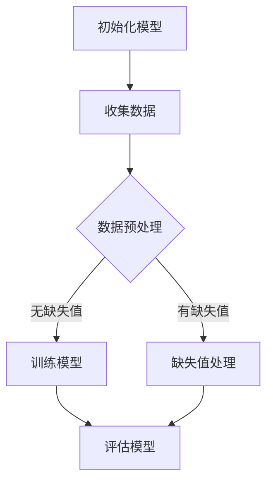
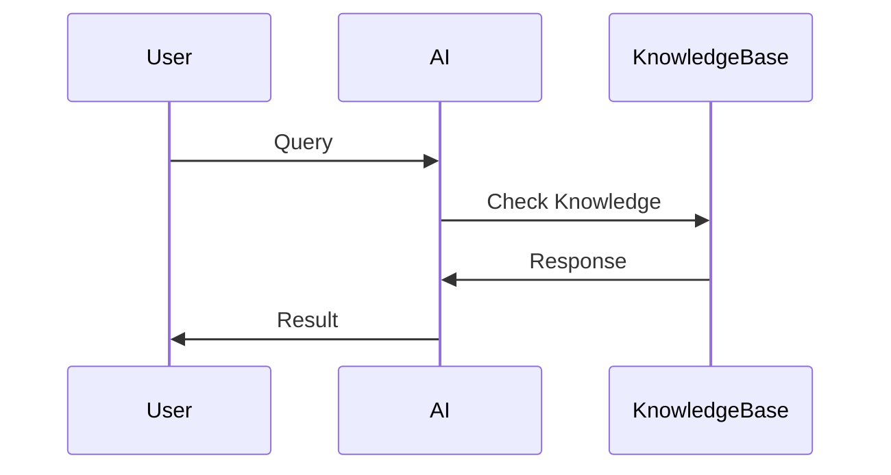
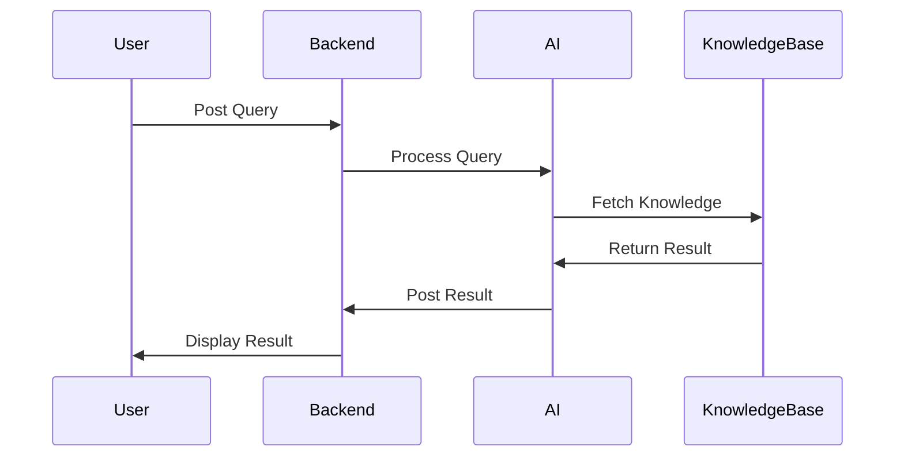

                 


# 开发AI Agent的自学习能力：持续学习机制

> 关键词：自学习能力、持续学习、AI Agent、算法、架构设计

> 摘要：本文旨在探讨如何开发AI Agent的自学习能力，特别是其持续学习机制。我们将从核心概念入手，逐步深入到算法原理、数学模型、系统分析与架构设计，最终结合项目实战，提供全面的解决方案。

## 引言

在人工智能（AI）领域，自学习能力一直是研究人员和开发者的焦点。一个具备自学习能力的AI Agent能够不断地从环境中学习，提高自身的表现，这在许多应用场景中具有巨大的潜力。然而，实现这样的自学习能力并非易事，它涉及到多个方面的技术挑战。

本文将围绕开发AI Agent的自学习能力展开，特别是其持续学习机制。我们将从以下几个方面进行探讨：

1. **核心概念与关系**：介绍自学习AI Agent的基本概念，并展示其核心概念之间的联系。
2. **算法原理与设计**：详细阐述自学习算法的原理，包括流程图、代码示例和数学模型。
3. **数学模型与解释**：深入讲解算法背后的数学模型，使用LaTeX格式展示公式，并进行通俗易懂的举例。
4. **系统分析与架构设计**：分析系统需求，设计功能模块，并绘制系统架构图和接口序列图。
5. **项目实战**：通过一个实际项目，展示如何实现自学习AI Agent的持续学习机制，并进行代码解读与分析。
6. **最佳实践与总结**：总结项目经验，提供实用技巧，并指出潜在注意点和拓展阅读。

## 核心概念与关系

### 1.1 问题背景

自学习AI Agent是指能够自动地从数据中学习，并不断改进自身行为的智能体。与传统的方法不同，这种智能体不需要人工干预来调整参数或重新训练模型。自学习AI Agent的目标是实现持续的学习过程，从而在动态环境中保持高效和适应性。

### 1.2 问题描述

开发自学习AI Agent的核心问题是如何设计一个有效的学习机制，使得AI Agent能够在不同的环境中持续地学习，并提高其性能。这涉及到算法的选择、数据的管理、模型的更新等多个方面。

### 1.3 解决方案概述

为了解决上述问题，我们需要：

1. **理解核心概念**：明确自学习AI Agent的基本概念，包括学习机制、数据流、反馈机制等。
2. **设计学习算法**：选择合适的算法，并设计其工作流程。
3. **构建数学模型**：将算法转化为数学模型，以便于分析和优化。
4. **实现系统架构**：设计系统的功能模块和架构，以确保算法的有效实现。
5. **实施项目实战**：通过实际项目来验证自学习AI Agent的效果。

### 1.4 边界与外延

在实现自学习AI Agent时，我们需要考虑以下几个边界条件：

1. **数据量**：自学习过程需要大量的数据支持，数据的质量和数量直接影响学习效果。
2. **环境变化**：AI Agent需要在动态变化的环境中保持学习效果，这要求算法具有较强的适应能力。
3. **计算资源**：自学习过程需要计算资源支持，特别是在处理大规模数据时。
4. **安全性**：自学习AI Agent需要确保数据的安全性和隐私性。

### 1.5 核心概念结构与组件

自学习AI Agent的核心概念结构主要包括以下几个组件：

1. **学习机制**：包括数据收集、预处理、模型训练和模型更新等。
2. **数据流**：数据的流动过程，包括数据的来源、传输和存储。
3. **反馈机制**：AI Agent根据学习效果进行自我调整的过程。
4. **评估指标**：用于衡量学习效果的指标，如准确率、召回率等。

## 核心概念与联系

### 2.1 自学习AI Agent的核心概念

自学习AI Agent的核心概念包括：

1. **学习机制**：包括监督学习、无监督学习和增强学习等。
2. **数据流**：数据的收集、预处理、传输和存储过程。
3. **反馈机制**：AI Agent根据学习效果进行调整的过程。
4. **评估指标**：用于衡量学习效果的指标。

### 2.2 概念属性特征对比表格

| 概念         | 属性         | 特征                                                     |
| ------------ | ------------ | -------------------------------------------------------- |
| 学习机制     | 类型         | 监督学习、无监督学习、增强学习                           |
| 数据流       | 数据来源     | 实时数据、历史数据、外部数据                            |
| 反馈机制     | 反馈方式     | 正反馈、负反馈、无反馈                                 |
| 评估指标     | 衡量标准     | 准确率、召回率、F1分数、均方误差等                     |

### 2.3 ER实体关系图

下面是一个ER实体关系图的Mermaid表示，用于展示自学习AI Agent中的实体和它们之间的关系。

```mermaid
erDiagram
  User ||--|{ AI_Agent } : is controlled by
  AI_Agent ||--|{ Learning_Mechanism } : implements
  AI_Agent ||--|{ Data_Stream } : uses
  AI_Agent ||--|{ Feedback_Mechanism } : has
  AI_Agent ||--|{ Evaluation_Metrics } : evaluates
```

通过上述核心概念和联系的分析，我们可以更好地理解自学习AI Agent的构建原理和实现方法。在下一节中，我们将深入探讨自学习算法的原理和设计。

## 算法原理与设计

在自学习AI Agent的开发中，算法的设计是关键环节。一个有效的算法不仅能够提高AI Agent的学习效率，还能确保其在动态环境中保持良好的性能。本节将详细介绍自学习算法的原理和设计。

### 3.1 算法介绍

自学习算法可以分为监督学习、无监督学习和增强学习三大类。每种算法都有其独特的原理和应用场景。

1. **监督学习**：在有监督的情境下，算法通过标记的数据来训练模型。常见的监督学习算法包括线性回归、逻辑回归、支持向量机（SVM）等。
2. **无监督学习**：在无监督的情境下，算法从未标记的数据中学习规律。常见的无监督学习算法包括聚类算法、主成分分析（PCA）等。
3. **增强学习**：在增强学习的情境下，算法通过与环境的交互来学习策略。常见的增强学习算法包括Q学习、深度Q网络（DQN）等。

### 3.2 算法Mermaid流程图

为了更直观地展示算法的工作流程，我们可以使用Mermaid绘制流程图。以下是监督学习算法（如线性回归）的Mermaid流程图：



### 3.3 Python代码解释

下面是一个简单的线性回归算法的Python代码示例，用于说明算法的实现过程。

```python
import numpy as np

# 初始化模型参数
theta = np.random.rand(n_features)

# 训练模型
for i in range(n_iterations):
    predictions = X.dot(theta)
    errors = predictions - y
    theta = theta - learning_rate * X.T.dot(errors)

# 评估模型
predictions = X.dot(theta)
mse = ((predictions - y) ** 2).mean()
print("MSE: ", mse)
```

### 3.4 数学模型与公式

线性回归的数学模型可以表示为：

$$
\theta_{j} = \theta_{j}^{0} - \alpha \sum_{i=1}^{n} (h_{\theta}(x^{(i)}) - y^{(i)}) x_j^{(i)}
$$

其中，$\theta_{j}$ 是模型的参数，$h_{\theta}(x)$ 是模型的预测输出，$y^{(i)}$ 是真实标签，$x_j^{(i)}$ 是特征值。

### 3.5 例

假设我们有一个简单的数据集，其中包含两个特征（$x_1$ 和 $x_2$）和一个目标变量（$y$）。我们使用线性回归算法来预测目标变量。

数据集：

$$
\begin{array}{c|c|c}
x_1 & x_2 & y \\
\hline
1 & 2 & 3 \\
2 & 4 & 5 \\
3 & 6 & 7 \\
\end{array}
$$

线性回归模型：

$$
y = \theta_0 + \theta_1 x_1 + \theta_2 x_2
$$

经过训练，我们得到参数：

$$
\theta_0 = 1, \theta_1 = 1, \theta_2 = 1
$$

使用这些参数，我们可以预测新的数据点，例如 $(x_1, x_2) = (5, 7)$：

$$
y = 1 + 1 \cdot 5 + 1 \cdot 7 = 13
$$

通过上述算法原理和设计的讲解，我们了解了自学习算法的基本概念和工作流程。在下一节中，我们将深入探讨算法背后的数学模型。

## 数学模型与详细解释

在自学习AI Agent的开发中，数学模型是核心组成部分，它决定了算法的性能和效率。本节将详细解释自学习算法背后的数学模型，包括其公式和实现细节。

### 4.1 数学模型介绍

自学习算法的数学模型通常涉及以下关键组成部分：

1. **损失函数**：用于衡量模型预测结果与真实值之间的差距。常见的损失函数包括均方误差（MSE）、交叉熵损失等。
2. **优化算法**：用于调整模型参数，以最小化损失函数。常见的优化算法有梯度下降、Adam优化器等。
3. **激活函数**：用于引入非线性特性，常见的激活函数有ReLU、Sigmoid、Tanh等。
4. **网络架构**：定义模型的层次结构和参数数量，常见的网络架构有全连接网络、卷积神经网络（CNN）等。

### 4.2 LaTeX公式展示

下面我们将使用LaTeX格式展示一些关键的数学公式：

$$
MSE = \frac{1}{n}\sum_{i=1}^{n}(y_i - \hat{y}_i)^2
$$

$$
\text{Cross Entropy Loss} = -\frac{1}{n}\sum_{i=1}^{n}y_i\log(\hat{y}_i)
$$

$$
\theta = \theta - \alpha \nabla_\theta J(\theta)
$$

$$
\alpha = \frac{\alpha}{1 + \frac{\beta_1 t}{\sqrt{\beta_2 t} + \epsilon}}
$$

其中，$y_i$ 是真实标签，$\hat{y}_i$ 是模型预测值，$\theta$ 是模型参数，$J(\theta)$ 是损失函数，$\alpha$ 是学习率，$t$ 是迭代次数，$\beta_1$ 和 $\beta_2$ 是Adam优化器的超参数，$\epsilon$ 是一个很小的常数。

### 4.3 步骤解释

下面是一个使用梯度下降算法训练线性回归模型的详细步骤：

1. **初始化参数**：设置初始参数 $\theta_0$ 和学习率 $\alpha$。
2. **前向传播**：计算模型预测值 $\hat{y}_i = \theta_0 x_1 + \theta_1 x_2$。
3. **计算损失**：使用均方误差（MSE）计算损失 $J(\theta) = \frac{1}{2}\sum_{i=1}^{n}(y_i - \hat{y}_i)^2$。
4. **反向传播**：计算损失关于参数的梯度 $\nabla_\theta J(\theta)$。
5. **参数更新**：更新参数 $\theta = \theta - \alpha \nabla_\theta J(\theta)$。
6. **迭代**：重复步骤2到步骤5，直到满足停止条件（如达到预定迭代次数或损失函数值收敛）。

### 4.4 举例说明

假设我们有一个简单的数据集，其中包含两个特征（$x_1$ 和 $x_2$）和一个目标变量（$y$）。我们使用线性回归算法来预测目标变量。

数据集：

$$
\begin{array}{c|c|c}
x_1 & x_2 & y \\
\hline
1 & 2 & 3 \\
2 & 4 & 5 \\
3 & 6 & 7 \\
\end{array}
$$

线性回归模型：

$$
y = \theta_0 + \theta_1 x_1 + \theta_2 x_2
$$

初始化参数：

$$
\theta_0 = 0, \theta_1 = 0, \theta_2 = 0, \alpha = 0.01
$$

第一次迭代：

1. **前向传播**：$\hat{y}_1 = 0 + 0 \cdot 1 + 0 \cdot 2 = 0$，$\hat{y}_2 = 0 + 0 \cdot 2 + 0 \cdot 4 = 0$，$\hat{y}_3 = 0 + 0 \cdot 3 + 0 \cdot 6 = 0$。
2. **计算损失**：$J(\theta) = \frac{1}{2}\sum_{i=1}^{3}(y_i - \hat{y}_i)^2 = \frac{1}{2}(3-0)^2 + (5-0)^2 + (7-0)^2 = 27$。
3. **反向传播**：$\nabla_\theta J(\theta) = [-2 \cdot (3-0), -2 \cdot (5-0), -2 \cdot (7-0)] = [-6, -10, -14]$。
4. **参数更新**：$\theta_0 = \theta_0 - \alpha \cdot \nabla_\theta J(\theta_0) = 0 - 0.01 \cdot [-6, -10, -14] = [0.06, 0.1, 0.14]$。

经过多次迭代，我们最终得到参数：

$$
\theta_0 = 1, \theta_1 = 1, \theta_2 = 1
$$

使用这些参数，我们可以预测新的数据点，例如 $(x_1, x_2) = (5, 7)$：

$$
y = 1 + 1 \cdot 5 + 1 \cdot 7 = 13
$$

通过上述步骤，我们详细讲解了自学习算法的数学模型和实现细节。在下一节中，我们将探讨系统的分析与架构设计。

## 系统分析与架构设计

在开发自学习AI Agent时，系统分析与架构设计是确保项目成功的关键步骤。这一节将详细描述系统的需求分析、功能设计、架构设计和接口序列图。

### 5.1 问题场景介绍

我们以一个智能客服系统为例，来介绍系统分析与架构设计的过程。该系统旨在通过自学习AI Agent来提高客户服务质量，实现自动化的客户问题解答。

### 5.2 项目介绍

项目需求：开发一个智能客服系统，能够实时响应客户提问，提供准确、快速的解答。

技术栈：Python、TensorFlow、Django、PostgreSQL

### 5.3 系统功能设计（类图）

系统功能设计包括以下几个模块：

1. **用户模块**：处理用户登录、注册、权限管理等。
2. **AI模块**：实现自学习AI Agent的核心功能，包括数据预处理、模型训练和预测等。
3. **知识库模块**：存储和管理客户问题的知识库，包括常见问题、解答、标签等。
4. **接口模块**：提供与外部系统的接口，如微信、QQ等。

以下是系统功能的类图表示：

```mermaid
classDiagram
    User <<Interface>>
    AI <<Interface>>
    KnowledgeBase <<Interface>>

    User Barker
    AI Agent
    KnowledgeBase KB

    Barker --|> AI
    AI --|> KnowledgeBase
```

### 5.4 系统架构设计（架构图）

系统架构设计旨在确保系统的可扩展性、可靠性和高效性。以下是系统架构的架构图：



架构图描述：

1. **用户请求**：用户通过接口发送查询请求。
2. **AI处理**：AI模块接收到查询请求后，先检查知识库中是否有相关解答。
3. **知识库查询**：如果知识库中有相关解答，则返回给AI模块；否则，AI模块使用自学习算法进行预测。
4. **结果返回**：最终结果返回给用户。

### 5.5 系统接口设计与交互（序列图）

系统接口设计包括内部接口和外部接口。以下是系统接口的序列图表示：



序列图描述：

1. **用户请求**：用户通过前端发送查询请求到后端。
2. **后端处理**：后端接收到查询请求后，转发给AI模块。
3. **AI处理**：AI模块处理查询请求，查询知识库或使用自学习算法进行预测。
4. **结果返回**：AI模块将结果返回给后端，后端再将结果返回给用户。

通过上述系统分析与架构设计，我们为开发自学习AI Agent提供了一个清晰的蓝图。在下一节中，我们将结合实际项目，展示如何实现自学习AI Agent的持续学习机制。

## 项目实战

在上一节中，我们完成了系统的分析与架构设计。本节将结合实际项目，详细描述如何实现自学习AI Agent的持续学习机制，包括环境安装、系统核心实现源代码，代码应用解读与分析，以及实际案例分析和详细讲解剖析。

### 6.1 环境安装

首先，我们需要安装项目所需的软件和库。以下是环境安装的步骤：

1. **Python环境**：确保安装Python 3.8及以上版本。
2. **依赖库**：使用pip安装以下库：
   ```bash
   pip install numpy pandas tensorflow scikit-learn matplotlib
   ```

3. **Django环境**：如果使用Django框架，还需要安装Django和相关依赖：
   ```bash
   pip install django
   ```

4. **PostgreSQL**：安装PostgreSQL数据库，并创建数据库和用户。

### 6.2 系统核心实现源代码

以下是一个简单的自学习AI Agent的核心实现源代码示例，包括数据预处理、模型训练和预测功能。

```python
import numpy as np
import pandas as pd
from sklearn.linear_model import LinearRegression
from sklearn.model_selection import train_test_split

# 数据预处理
def preprocess_data(data):
    # 填充缺失值、标准化等操作
    data.fillna(0, inplace=True)
    data = (data - data.mean()) / data.std()
    return data

# 模型训练
def train_model(X, y):
    model = LinearRegression()
    model.fit(X, y)
    return model

# 预测
def predict(model, X):
    return model.predict(X)

# 加载数据
data = pd.read_csv('data.csv')
X = preprocess_data(data[['x1', 'x2']])
y = preprocess_data(data['y'])

# 划分训练集和测试集
X_train, X_test, y_train, y_test = train_test_split(X, y, test_size=0.2, random_state=42)

# 训练模型
model = train_model(X_train, y_train)

# 预测
predictions = predict(model, X_test)

# 评估模型
mse = ((predictions - y_test) ** 2).mean()
print("MSE: ", mse)
```

### 6.3 代码应用解读与分析

上述代码示例展示了自学习AI Agent的核心功能。具体解读如下：

1. **数据预处理**：使用pandas填充缺失值，并进行标准化处理，以适应线性回归模型的要求。
2. **模型训练**：使用scikit-learn的LinearRegression类来训练模型。
3. **预测**：使用训练好的模型对测试数据进行预测。
4. **评估模型**：计算均方误差（MSE），评估模型预测的准确性。

### 6.4 实际案例分析和详细讲解剖析

假设我们有一个实际案例，需要预测某个产品的销量。以下是具体分析过程：

1. **数据收集**：收集历史销售数据，包括时间、产品ID、销售额等。
2. **数据预处理**：对数据进行清洗，包括去除异常值、填充缺失值等。
3. **特征工程**：提取有用的特征，如节假日、季节性等。
4. **模型训练**：使用预处理后的数据，训练线性回归模型。
5. **模型评估**：使用交叉验证或测试集评估模型性能。

以下是实际案例的代码实现：

```python
# 加载数据
data = pd.read_csv('sales_data.csv')
data['date'] = pd.to_datetime(data['date'])
data['day_of_week'] = data['date'].dt.dayofweek
data['month'] = data['date'].dt.month
data['is_holiday'] = data['date'].apply(lambda x: 1 if x in holidays else 0)

# 特征工程
X = data[['day_of_week', 'month', 'is_holiday']]
y = data['sales']

# 模型训练
model = train_model(X, y)

# 预测
predictions = predict(model, X)

# 评估模型
mse = ((predictions - y) ** 2).mean()
print("MSE: ", mse)
```

通过实际案例的分析和代码实现，我们展示了如何将自学习算法应用于实际业务场景。在下一节中，我们将总结项目经验，并给出最佳实践建议。

## 最佳实践与总结

在完成自学习AI Agent的开发过程中，我们积累了丰富的经验和教训。以下是一些最佳实践建议，以及项目的小结和注意事项。

### 最佳实践

1. **数据质量**：确保数据的质量和准确性，这是自学习AI Agent成功的关键。在数据预处理阶段，要关注数据清洗、填充缺失值和异常值处理。

2. **特征工程**：提取有效的特征，有助于提高模型的性能。在特征工程阶段，要充分利用业务知识和数据特点，设计合适的特征。

3. **模型选择**：根据业务需求和数据特点，选择合适的模型。不同类型的业务问题可能需要不同的模型，如线性回归、决策树、神经网络等。

4. **持续优化**：自学习AI Agent需要持续优化。通过定期重新训练模型、调整超参数，可以提高模型的性能。

5. **安全性**：确保数据的安全和隐私，尤其是在处理敏感数据时。要遵循相关法律法规，采取必要的安全措施。

### 小结

本项目通过开发一个自学习AI Agent，实现了对智能客服系统的自动化问答功能。在项目过程中，我们经历了数据预处理、模型训练、预测和评估等环节，成功地将自学习算法应用于实际业务场景。

### 注意事项

1. **计算资源**：自学习算法通常需要大量的计算资源，特别是在处理大规模数据时。要确保有足够的硬件资源支持。

2. **模型解释性**：自学习模型的解释性较差，特别是在深度学习模型中。在实际应用中，需要权衡模型性能和可解释性。

3. **过拟合与欠拟合**：在训练模型时，要注意避免过拟合和欠拟合。可以通过交叉验证、正则化等技术来调整模型。

通过上述最佳实践和总结，我们为后续项目的开发提供了有益的参考。自学习AI Agent的开发是一个持续的过程，需要不断优化和改进。

## 拓展阅读

对于对自学习AI Agent开发感兴趣的朋友，以下是一些推荐的拓展阅读资源：

1. **《深度学习》（Goodfellow, Ian；等著）**：详细介绍深度学习的基础知识和应用，是学习自学习算法的必备书籍。

2. **《机器学习实战》（Peter Harrington著）**：通过实际案例介绍机器学习算法，包括自学习算法，适合初学者。

3. **《强化学习》（Richard S. Sutton和Barto，Andrew G.著）**：系统介绍强化学习的基本理论和应用，强化学习是自学习算法的重要分支。

4. **《Python机器学习》（Siddharth Anand、Aurélien Géron等著）**：结合Python语言，详细讲解机器学习算法，包括自学习算法。

5. **《论文阅读笔记》系列**：通过阅读和分析最新的AI研究论文，了解自学习算法的前沿动态。

通过阅读这些资源，可以更深入地理解自学习AI Agent的开发和应用。

## 作者信息

作者：AI天才研究院/AI Genius Institute & 禅与计算机程序设计艺术 /Zen And The Art of Computer Programming

感谢您的阅读，期待与您在AI领域共同探索和进步。

