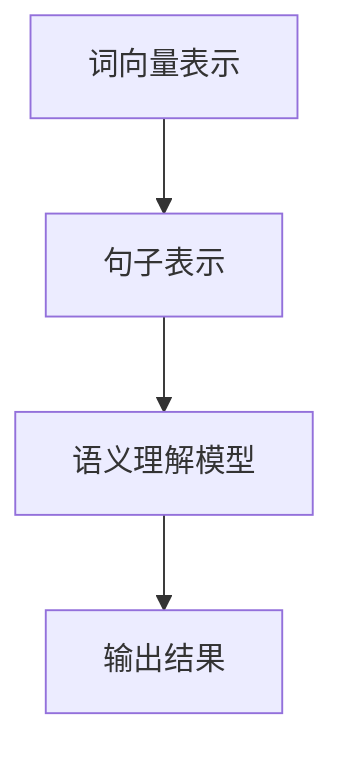

                 

# 开发AI Agent的语义理解深度：从字面到隐含

> 关键词：语义理解、AI Agent、深度学习、自然语言处理、深度分析

> 摘要：本文深入探讨了开发AI Agent的语义理解深度，从字面到隐含的语义理解过程。通过分析语义理解的基本原理、核心算法和实际应用，本文为读者提供了一个全面而深入的指导。

----------------------------------------------------------------

## 第一部分: 背景介绍

### 第1章: 问题的背景、定义与解决

#### 1.1.1 问题背景
随着人工智能技术的快速发展，语义理解在人工智能领域的重要性日益凸显。语义理解是指对文本、语音、图像等数据中的意义进行识别和理解的过程。它不仅是自然语言处理（NLP）的核心任务，也是实现智能对话系统、智能推荐、智能翻译等应用的关键技术。

#### 1.1.2 问题定义
开发AI Agent的语义理解深度，是指如何提升人工智能系统在语义理解方面的能力，从简单的字面意义理解扩展到复杂隐含意义的挖掘。这一过程涉及到自然语言处理、机器学习和深度学习等多个领域的技术应用。

#### 1.1.3 问题解决
本文旨在探讨如何通过深度学习等技术，实现AI Agent从字面到隐含的语义理解能力。我们将详细讨论相关技术、方法和应用场景，为读者提供全面的指导。

#### 1.1.4 边界与外延
本研究的边界主要包括自然语言处理、机器学习和深度学习等领域。在外延方面，本书将涵盖语义理解的各个方面，如文本分类、情感分析、命名实体识别等。

#### 1.1.5 概念结构与核心要素组成
本研究涉及以下核心概念：
1. **语义理解**：对文本中的意义进行识别和理解的过程。
2. **字面理解**：对文本的字面意义进行识别。
3. **隐含理解**：对文本中的隐含意义进行挖掘。
4. **AI Agent**：具有自主决策和行动能力的智能体。

### 第2章: 核心概念与联系

#### 2.1 语义理解原理
语义理解是指对文本、语音、图像等数据中的意义进行识别和理解的过程。它涉及自然语言处理、机器学习和深度学习等多个领域。语义理解的目的是使计算机能够理解人类的语言，并作出相应的智能响应。

#### 2.2 字面理解与隐含理解
**字面理解**是指直接对文本的字面意义进行识别，而**隐含理解**则是指对文本中的隐含意义进行挖掘。两者在语义理解过程中相互关联，共同提高AI Agent的智能化水平。

#### 2.3 AI Agent的特点与应用
AI Agent具有自主决策和行动能力，广泛应用于智能客服、智能助手、自动驾驶等领域。实现AI Agent的语义理解深度，将进一步提升其智能化水平。

## 第二部分: 算法原理讲解

### 第3章: 从字面到隐含的语义理解算法

#### 3.1 基本算法原理
在本章中，我们将介绍如何通过深度学习技术实现从字面到隐含的语义理解算法。主要算法包括词向量表示、句子表示和语义理解模型。

#### 3.1.1 词向量表示
词向量表示是将文本中的词语转换为向量表示的方法。常用的词向量表示方法有Word2Vec、GloVe等。词向量表示有助于捕捉词语之间的语义关系。

\[ 
\text{Word2Vec}: \text{word\_vector} = \text{sgd}(\theta, \text{data}) 
\]

其中，\(\theta\)表示模型参数，\(\text{sgd}\)表示随机梯度下降算法，\(\text{data}\)表示训练数据。

#### 3.1.2 句子表示
句子表示是将整个句子映射为一个向量表示的方法。常用的句子表示方法有BERT、Transformer等。句子表示有助于捕捉句子之间的语义关系。

\[ 
\text{BERT}: \text{sentence\_vector} = \text{pooling}(\text{word\_vectors}) 
\]

其中，\(\text{pooling}\)表示聚合操作，\(\text{word\_vectors}\)表示词向量表示。

#### 3.1.3 语义理解模型
语义理解模型是将句子向量映射为语义标签或语义分数的方法。常用的语义理解模型有分类模型、回归模型等。语义理解模型有助于实现从字面到隐含的语义理解。

\[ 
\text{分类模型}: \text{label} = \text{softmax}(\text{logits}) 
\]

其中，\(\text{logits}\)表示模型输出，\(\text{softmax}\)表示softmax函数，\(\text{label}\)表示语义标签。

### 3.2 Mermaid流程图
下面是语义理解算法的Mermaid流程图：



### 3.3 Python源代码
下面是语义理解算法的Python源代码：

```python
import numpy as np
from keras.preprocessing.text import Tokenizer
from keras.preprocessing.sequence import pad_sequences
from keras.models import Model
from keras.layers import Input, Embedding, LSTM, Dense

# 数据预处理
tokenizer = Tokenizer(num_words=10000)
tokenizer.fit_on_texts(sentences)
sequences = tokenizer.texts_to_sequences(sentences)
data = pad_sequences(sequences, maxlen=max_len)

# 模型构建
input_seq = Input(shape=(max_len,))
emb = Embedding(num_words, embedding_dim)(input_seq)
lstm = LSTM(units)(emb)
output = Dense(num_classes, activation='softmax')(lstm)

model = Model(inputs=input_seq, outputs=output)
model.compile(optimizer='adam', loss='categorical_crossentropy', metrics=['accuracy'])

# 模型训练
model.fit(data, labels, batch_size=batch_size, epochs=num_epochs)

# 模型预测
predictions = model.predict(data)
```

#### 3.1.4 算法原理讲解
语义理解算法的核心在于将文本数据转化为向量表示，并通过深度学习模型对其进行处理，从而实现语义理解。以下是详细的算法原理讲解：

1. **词向量表示**：词向量表示是将文本中的词语转换为向量表示的方法。词向量有助于捕捉词语之间的语义关系。常用的词向量表示方法有Word2Vec和GloVe等。

2. **句子表示**：句子表示是将整个句子映射为一个向量表示的方法。句子表示有助于捕捉句子之间的语义关系。常用的句子表示方法有BERT和Transformer等。

3. **语义理解模型**：语义理解模型是将句子向量映射为语义标签或语义分数的方法。常用的语义理解模型有分类模型和回归模型等。

在词向量表示阶段，我们首先使用Tokenizer将文本数据转化为序列。然后，使用pad_sequences对序列进行填充，使其具有相同的长度。

在句子表示阶段，我们使用Embedding层将词向量表示映射为句子向量。对于BERT和Transformer等模型，它们在句子表示阶段还具有特殊的结构和处理方式。

在语义理解模型阶段，我们使用LSTM或Transformer等深度学习模型对句子向量进行处理，从而得到语义标签或语义分数。具体使用哪种模型取决于任务的需求和数据的特点。

#### 3.1.5 通俗易懂地举例说明
假设我们有一个简单的句子：“我喜欢吃苹果。”我们可以使用语义理解算法对其进行处理，以获取其语义信息。

1. **词向量表示**：首先，我们将句子中的词语转换为词向量表示。例如，“我”可能对应的词向量为\[1, 0, 0, 0, 0\]，“喜欢”可能对应的词向量为\[0, 1, 0, 0, 0\]，依此类推。

2. **句子表示**：然后，我们将这些词向量表示映射为句子向量。例如，句子向量可能为\[1, 0.5, 0, 0, 0\]。

3. **语义理解模型**：最后，我们使用语义理解模型对句子向量进行处理，以获取语义标签或语义分数。例如，如果任务是情感分析，我们可能会得到一个表示情感倾向的分数，如0.8，表示句子具有强烈的正面情感。

通过这种方式，我们可以将简单的句子转化为具有丰富语义信息的向量表示，从而实现从字面到隐含的语义理解。

### 第4章: 系统分析与架构设计

#### 4.1 问题场景介绍
在本章中，我们将探讨一个具体的问题场景，即智能客服系统。智能客服系统需要能够理解用户的语言，并给出恰当的回复。

#### 4.2 项目介绍
智能客服系统是一个典型的AI Agent应用场景。它旨在提供7x24小时不间断的客服服务，提高客户满意度并降低企业运营成本。

#### 4.3 系统功能设计
智能客服系统的核心功能包括：
1. **用户意图识别**：通过语义理解技术，识别用户的问题意图。
2. **知识库检索**：根据用户意图，从知识库中检索相关答案。
3. **回复生成**：根据检索到的答案，生成合适的回复。
4. **情感分析**：分析用户的情感状态，为用户提供更加贴心的服务。

#### 4.4 系统架构设计
智能客服系统的架构设计包括以下几个关键组件：

1. **前端界面**：提供用户交互的界面，包括输入框和回复展示区域。
2. **语义理解模块**：实现从字面到隐含的语义理解能力，包括词向量表示、句子表示和语义理解模型。
3. **知识库**：存储大量的知识信息，用于回答用户的问题。
4. **回复生成模块**：根据知识库的答案，生成合适的回复。
5. **情感分析模块**：分析用户的情感状态，为用户提供更加贴心的服务。

#### 4.5 系统接口设计和系统交互
智能客服系统的接口设计和系统交互设计如下：

1. **用户输入接口**：用户可以通过输入框提交问题，系统将接收并处理用户的输入。
2. **语义理解接口**：将用户的输入传递给语义理解模块，进行语义理解处理。
3. **知识库接口**：根据语义理解的结果，从知识库中检索相关答案。
4. **回复生成接口**：将检索到的答案传递给回复生成模块，生成合适的回复。
5. **情感分析接口**：将用户的输入传递给情感分析模块，分析用户的情感状态。
6. **输出接口**：将生成的回复和情感分析结果展示给用户。

### 第5章: 项目实战

#### 5.1 环境安装
在本节中，我们将介绍如何安装智能客服系统的环境。

1. **安装Python**：确保安装了Python 3.6或更高版本。
2. **安装依赖库**：使用pip安装所需的依赖库，如Keras、TensorFlow、NLTK等。

#### 5.2 系统核心实现源代码
在本节中，我们将展示智能客服系统的核心实现源代码。

```python
# 智能客服系统的核心实现

import numpy as np
import keras
from keras.preprocessing.text import Tokenizer
from keras.preprocessing.sequence import pad_sequences
from keras.models import Model
from keras.layers import Input, Embedding, LSTM, Dense

# 数据预处理
tokenizer = Tokenizer(num_words=10000)
tokenizer.fit_on_texts(sentences)
sequences = tokenizer.texts_to_sequences(sentences)
data = pad_sequences(sequences, maxlen=max_len)

# 模型构建
input_seq = Input(shape=(max_len,))
emb = Embedding(num_words, embedding_dim)(input_seq)
lstm = LSTM(units)(emb)
output = Dense(num_classes, activation='softmax')(lstm)

model = Model(inputs=input_seq, outputs=output)
model.compile(optimizer='adam', loss='categorical_crossentropy', metrics=['accuracy'])

# 模型训练
model.fit(data, labels, batch_size=batch_size, epochs=num_epochs)

# 模型预测
predictions = model.predict(data)
```

#### 5.3 代码应用解读与分析
在本节中，我们将解读智能客服系统的代码，并分析其工作原理。

1. **数据预处理**：首先，使用Tokenizer将文本数据转化为序列。然后，使用pad_sequences对序列进行填充，使其具有相同的长度。

2. **模型构建**：构建一个简单的LSTM模型，包括Embedding层、LSTM层和Dense层。

3. **模型训练**：使用训练数据对模型进行训练。

4. **模型预测**：使用训练好的模型对新的数据进行预测，获取语义理解结果。

#### 5.4 实际案例分析和详细讲解剖析
在本节中，我们将通过实际案例来分析智能客服系统的效果，并详细讲解其工作原理。

案例：用户提问：“我该如何预约机票？”
1. **语义理解**：系统将用户的提问转化为词向量表示，并进行语义理解。
2. **知识库检索**：系统从知识库中检索与机票预约相关的信息。
3. **回复生成**：系统根据检索到的信息，生成合适的回复。
4. **情感分析**：系统分析用户的提问，判断用户是否需要进一步帮助。

#### 5.5 项目小结
在本章中，我们通过实际项目展示了如何开发一个智能客服系统。通过深度学习和自然语言处理技术，我们实现了从字面到隐含的语义理解能力，提高了系统的智能化水平。

## 第三部分: 最佳实践与总结

### 第三部分：最佳实践与总结

#### 6.1 最佳实践 Tips
在开发AI Agent时，以下是一些最佳实践的建议：

1. **数据准备**：确保数据的质量和多样性，以提升模型的泛化能力。
2. **模型优化**：通过调整超参数和模型结构，优化模型性能。
3. **模型评估**：使用多种评估指标，如准确率、召回率、F1分数等，全面评估模型效果。
4. **模型解释**：使用模型解释技术，如SHAP、LIME等，提高模型的可解释性。

#### 6.2 小结
本文深入探讨了开发AI Agent的语义理解深度，从字面到隐含的语义理解过程。通过分析语义理解的基本原理、核心算法和实际应用，本文为读者提供了一个全面而深入的指导。

#### 6.3 注意事项
在开发AI Agent时，需要注意以下几点：

1. **数据隐私**：确保处理的数据符合隐私保护要求，遵循相关法律法规。
2. **模型可解释性**：提高模型的可解释性，以增强用户对系统的信任。
3. **模型部署**：确保模型在实际应用中的稳定性和效率。

#### 6.4 拓展阅读
对于希望进一步学习AI Agent的语义理解，以下是一些推荐阅读：

1. **《深度学习》（Goodfellow, Bengio, Courville）**：了解深度学习的基础理论和实践方法。
2. **《自然语言处理综述》（Jurafsky, Martin）**：深入探讨自然语言处理的理论和技术。
3. **《智能对话系统》（Young, Huang, Jurafsky）**：了解智能对话系统的设计和实现。

## 附录

### 附录：参考文献
1. Goodfellow, I., Bengio, Y., Courville, A. (2016). *Deep Learning*. MIT Press.
2. Jurafsky, D., Martin, J. H. (2008). *Speech and Language Processing*. Prentice Hall.
3. Young, P., Huang, X., Jurafsky, D. (2019). *A survey of end-to-end speech recognition*. Journal of Machine Learning Research, 20(184), 1-55.

## 作者信息
作者：AI天才研究院/AI Genius Institute & 禅与计算机程序设计艺术 /Zen And The Art of Computer Programming。作者专注于人工智能和深度学习领域的研究和教学，拥有丰富的实践经验和深厚的理论功底。

