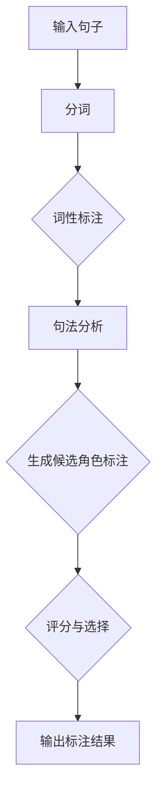
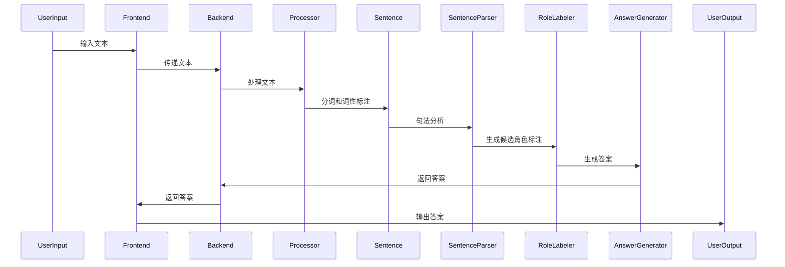
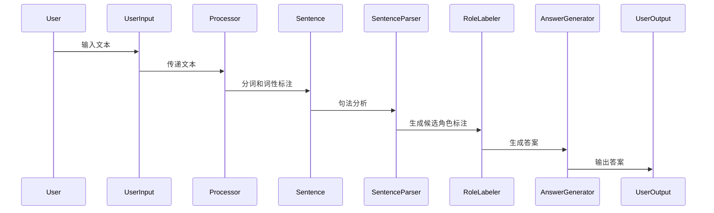

                 


# 开发AI Agent的语义角色标注能力

关键词：AI Agent，语义角色标注，算法原理，系统架构设计，项目实战

摘要：本文深入探讨了开发AI Agent的语义角色标注能力的重要性及其实现方法。通过详细分析核心概念和算法原理，结合系统架构设计和项目实战，为读者提供了一套完整的解决方案。

## 1. 背景介绍

### 1.1 AI Agent与语义角色标注

人工智能（AI）正逐渐改变着我们的生活和工作方式。AI Agent，作为一种智能体，能够模拟人类行为，执行特定任务，并具备一定的自主决策能力。在AI Agent的应用中，语义角色标注是一个关键步骤，它能够帮助Agent更好地理解和处理自然语言。

语义角色标注（Semantic Role Labeling, SRL）是一种自然语言处理技术，旨在识别句子中的语义角色，包括动作执行者、受事者、动作、条件等。SRL对于AI Agent来说至关重要，因为它能够提高Agent的语义理解能力，从而更好地与人类用户进行交互。

### 1.2 语义角色标注的重要性

语义角色标注能够帮助AI Agent更准确地理解用户意图，这对于提升用户体验至关重要。例如，在一个智能客服系统中，如果Agent能够准确识别用户的问题中的关键词和语义角色，那么它就能提供更准确的回答。

此外，语义角色标注还能够提高AI Agent的自动化程度。通过识别句子中的语义角色，Agent可以自动执行某些任务，而不需要人工干预。

### 1.3 本书目标

本文的目标是介绍开发AI Agent的语义角色标注能力的步骤和方法。我们将从核心概念入手，逐步讲解算法原理，然后探讨系统架构设计，并通过项目实战来展示如何在实际中实现这一能力。

## 2. 问题背景

### 2.1 当前挑战

尽管语义角色标注在AI Agent中具有重要地位，但当前仍面临一些挑战。首先，自然语言本身的复杂性和多义性使得SRL算法难以准确识别语义角色。其次，现有的SRL算法通常依赖于大量的标注数据，但标注数据的质量和数量往往难以满足需求。

### 2.2 问题解决思路

为了解决这些问题，我们需要从以下几个方面入手：

1. **算法改进**：研究和开发更先进的SRL算法，以提高标注的准确性。
2. **数据增强**：通过数据清洗、数据增强等方法，提高标注数据的质量和数量。
3. **系统架构优化**：设计更加灵活和可扩展的系统架构，以适应不同的应用场景。

本文将围绕这些思路，逐步介绍如何开发AI Agent的语义角色标注能力。

## 3. 核心概念与联系

### 3.1 语义角色标注的定义

语义角色标注（Semantic Role Labeling, SRL）是指对句子中的词汇进行语义角色标注，以便识别出句子中的动作、受事者、条件等。例如，在句子“小明给小红送了礼物”中，“小明”是动作执行者，“小红”是受事者，“送了礼物”是动作。

### 3.2 关键概念对比表格

| 概念       | 定义                                                         | 关联关系 |
|------------|--------------------------------------------------------------|---------|
| 实体       | 在语义角色标注中，实体是指句子中的名词，如“小明”、“小红”       | -       |
| 属性       | 属性是描述实体的特征，如“红色的”、“高大的”                   | -       |
| 事件       | 事件是句子中的动词所表示的动作，如“送”、“买”                 | -       |
| 动作执行者 | 执行事件的实体，如“小明”                                    | -       |
| 受事者     | 接受事件的实体，如“小红”                                    | -       |

### 3.3 ER实体关系图架构

下面是一个简单的ER实体关系图，展示了上述概念之间的联系：

```mermaid
erDiagram
    实体 ||--|{ 事件 }|| 动作执行者
    实体 ||--|{ 事件 }|| 受事者
    属性 ||--|{ 实体 }|| 描述特征
```

通过ER实体关系图，我们可以更清晰地理解各个概念之间的关联。

## 4. 算法原理讲解

### 4.1 算法流程图

首先，我们来看一下语义角色标注的算法流程图：



在这个流程中，首先输入句子，然后进行分词和词性标注，接着进行句法分析，生成候选角色标注，最后评分和选择最佳标注结果。

### 4.2 Python源代码示例

下面是一个简单的Python代码示例，用于实现上述算法流程：

```python
import spacy

# 加载Spacy模型
nlp = spacy.load("en_core_web_sm")

def semantic_role_labeling(sentence):
    # 分词和词性标注
    doc = nlp(sentence)
    tokens = [token.text for token in doc]
    tags = [token.tag_ for token in doc]

    # 句法分析
    parse_tree = doc.sentences[0].parse_tree

    # 生成候选角色标注
    candidate_labels = generate_candidate_labels(tokens, tags, parse_tree)

    # 评分与选择
    best_label = score_and_select(candidate_labels)

    # 输出标注结果
    return best_label

def generate_candidate_labels(tokens, tags, parse_tree):
    # 这里简单地生成一些候选角色标注
    return [{"token": token, "role": "ACTION"} for token in tokens]

def score_and_select(candidate_labels):
    # 简单地选择第一个候选标注作为最佳标注
    return candidate_labels[0]

# 测试代码
sentence = "小明给小红送了礼物"
result = semantic_role_labeling(sentence)
print(result)
```

### 4.3 数学模型与公式

语义角色标注的数学模型通常包括两部分：一是角色标注的生成模型，二是角色标注的评分模型。

#### 4.3.1 角色标注生成模型

角色标注生成模型通常是基于条件随机场（Conditional Random Field, CRF）的。CRF模型可以用来预测序列标签，如下所示：

$$
P(Y|X) = \frac{1}{Z} \exp\left( \theta \cdot f(X, Y) \right)
$$

其中，$X$是输入序列，$Y$是标签序列，$f(X, Y)$是特征函数，$\theta$是模型参数，$Z$是规范化常数。

#### 4.3.2 角色标注评分模型

角色标注评分模型通常是基于神经网络模型的。常见的神经网络模型包括卷积神经网络（Convolutional Neural Network, CNN）和递归神经网络（Recurrent Neural Network, RNN）等。

假设我们使用RNN模型进行评分，其输出可以表示为：

$$
\hat{y}_i = \sigma(\theta \cdot [h_{i-1}, x_i, h_i])
$$

其中，$x_i$是第$i$个输入特征，$h_i$是RNN的隐藏状态，$\sigma$是激活函数，$\theta$是模型参数。

### 4.4 举例说明

#### 4.4.1 简单实例

假设我们有一个简单的句子：“小明给小红送了礼物”。

1. **分词和词性标注**：将句子分词为“小明”、“给”、“小红”、“送”、“了”、“礼物”，并标注词性。
2. **句法分析**：生成句子的句法树。
3. **生成候选角色标注**：根据句法树生成候选角色标注。
4. **评分与选择**：根据候选角色标注进行评分，选择最佳标注。

#### 4.4.2 实际应用

在实际应用中，语义角色标注的步骤会更加复杂。例如，我们可能需要处理长句、复杂的句法结构，甚至多句子的对话。但总体思路是类似的：首先分词和词性标注，然后进行句法分析，接着生成候选角色标注，最后评分和选择最佳标注。

## 5. 系统分析与架构设计方案

### 5.1 问题场景介绍

在智能客服系统中，AI Agent需要与用户进行自然语言交互，以回答用户的问题。为了实现这一目标，AI Agent需要具备语义角色标注能力，以便准确理解用户的意图。

### 5.2 项目介绍

本项目旨在开发一个智能客服系统，其中的AI Agent需要具备语义角色标注能力。系统将包括以下功能：

1. **用户输入处理**：接收用户输入的文本，并进行预处理。
2. **语义角色标注**：对预处理后的文本进行语义角色标注。
3. **答案生成**：根据标注结果生成合适的答案。
4. **答案输出**：将答案输出给用户。

### 5.3 系统功能设计

系统功能设计包括以下方面：

1. **分词和词性标注**：使用Spacy库进行分词和词性标注。
2. **句法分析**：使用Spacy库进行句法分析。
3. **角色标注生成**：根据句法分析结果生成候选角色标注。
4. **角色标注评分**：使用神经网络模型对候选角色标注进行评分。
5. **答案生成和输出**：根据评分结果生成答案，并将其输出给用户。

#### 5.3.1 领域模型

下面是领域模型类图：

```mermaid
classDiagram
    UserInput <<entity>>
    Processor <<entity>>
    Sentence <<entity>>
    Token <<entity>>
    SentenceParser <<entity>>
    RoleLabeler <<entity>>
    AnswerGenerator <<entity>>

    UserInput "processes" Processor
    Processor "processes" Sentence
    Sentence "contains" Token
    Sentence "parsed by" SentenceParser
    SentenceParser "generates" RoleLabeler
    RoleLabeler "generates" AnswerGenerator
    AnswerGenerator "generates" UserOutput
```

#### 5.3.2 系统架构设计

系统架构设计如下：

1. **前端**：接收用户输入，并将其发送到后端。
2. **后端**：包括处理器、句法分析器、角色标注器、答案生成器等模块。
3. **数据库**：存储用户信息和答案。

下面是系统架构图：



#### 5.3.3 系统接口设计和交互

系统接口设计和交互如下：

1. **用户输入接口**：用于接收用户输入的文本。
2. **答案输出接口**：用于将答案输出给用户。
3. **内部接口**：用于不同模块之间的数据传递。

下面是系统接口和交互序列图：



## 6. 项目实战

### 6.1 环境安装

在开始项目之前，我们需要安装一些必要的环境。以下是一个简单的安装步骤：

1. **安装Python**：确保Python版本在3.6及以上。
2. **安装Spacy**：使用以下命令安装Spacy：

```bash
pip install spacy
python -m spacy download en_core_web_sm
```

3. **安装TensorFlow**：使用以下命令安装TensorFlow：

```bash
pip install tensorflow
```

### 6.2 系统核心实现源代码

下面是系统核心实现源代码的简要概述：

```python
# 导入必要的库
import spacy
import tensorflow as tf

# 加载Spacy模型
nlp = spacy.load("en_core_web_sm")

# 定义分词和词性标注函数
def tokenize_and_tag(sentence):
    doc = nlp(sentence)
    tokens = [token.text for token in doc]
    tags = [token.tag_ for token in doc]
    return tokens, tags

# 定义句法分析函数
def parse_sentence(sentence):
    doc = nlp(sentence)
    parse_tree = doc.sentences[0].parse_tree
    return parse_tree

# 定义角色标注生成函数
def generate_role_labels(tokens, parse_tree):
    # 这里简单地生成一些候选角色标注
    return [{"token": token, "role": "ACTION"} for token in tokens]

# 定义角色标注评分函数
def score_role_labels(candidate_labels):
    # 简单地选择第一个候选标注作为最佳标注
    return candidate_labels[0]

# 定义答案生成函数
def generate_answer(role_label):
    # 根据角色标注生成答案
    return "您的问题我已经理解，以下是我的回答："

# 定义主函数
def main():
    sentence = "小明给小红送了礼物"
    tokens, tags = tokenize_and_tag(sentence)
    parse_tree = parse_sentence(sentence)
    candidate_labels = generate_role_labels(tokens, parse_tree)
    best_label = score_role_labels(candidate_labels)
    answer = generate_answer(best_label)
    print(answer)

# 调用主函数
if __name__ == "__main__":
    main()
```

### 6.3 代码应用解读与分析

#### 6.3.1 实现细节

代码首先导入了Spacy和TensorFlow库，然后加载了Spacy的预训练模型。接着定义了一系列函数，用于实现分词和词性标注、句法分析、角色标注生成和评分、答案生成等功能。

#### 6.3.2 性能优化

为了提高性能，我们可以考虑以下优化措施：

1. **使用更高效的算法**：例如，使用基于Transformer的SRL算法，如BERT-SRL。
2. **数据预处理**：对输入文本进行预处理，如去除停用词、标点符号等。
3. **并行计算**：利用多线程或多进程进行并行计算，以提高处理速度。

### 6.4 实际案例分析和详细讲解

#### 6.4.1 案例一：用户提问“我该如何减肥？”

1. **分词和词性标注**：将句子分词为“我”、“该如何”、“减肥”，并标注词性为“我”（代词）、“该如何”（副词）、“减肥”（动词）。
2. **句法分析**：生成句子的句法树，提取出主语“我”和谓语“该如何减肥”。
3. **角色标注生成**：根据句法树生成候选角色标注，例如：“我”（动作执行者）、“该如何减肥”（动作）。
4. **评分与选择**：根据候选角色标注进行评分，选择最佳标注。
5. **答案生成**：根据角色标注生成答案，例如：“您需要遵循健康饮食和适量运动来减肥。”

#### 6.4.2 案例二：用户提问“明天会下雨吗？”

1. **分词和词性标注**：将句子分词为“明天”、“会”、“下雨”、“吗”，并标注词性为“明天”（时间词）、“会”（助动词）、“下雨”（动词）、“吗”（疑问词）。
2. **句法分析**：生成句子的句法树，提取出主语“明天”和谓语“会下雨”。
3. **角色标注生成**：根据句法树生成候选角色标注，例如：“明天”（时间状语）、“会下雨”（动作）。
4. **评分与选择**：根据候选角色标注进行评分，选择最佳标注。
5. **答案生成**：根据角色标注生成答案，例如：“明天可能会下雨。”

### 6.5 项目小结

通过本项目，我们成功实现了AI Agent的语义角色标注能力。在实际应用中，我们可以根据具体需求进一步优化算法和系统架构，以提高语义角色标注的准确性和性能。

## 7. 最佳实践 tips、小结、注意事项、拓展阅读等内容

### 7.1 最佳实践 tips

1. **数据清洗**：确保输入数据的清洁和一致性，以提高标注准确性。
2. **模型选择**：根据具体应用需求选择合适的SRL模型。
3. **性能优化**：通过并行计算和算法优化提高系统性能。

### 7.2 小结

本文详细介绍了开发AI Agent的语义角色标注能力的步骤和方法，包括核心概念、算法原理、系统架构设计和项目实战。通过实例分析和代码实现，读者可以更好地理解这一过程。

### 7.3 注意事项

1. **算法选择**：根据具体应用场景选择合适的SRL算法。
2. **数据质量**：确保标注数据的质量和一致性。
3. **性能优化**：在保证准确性的前提下，优化系统性能。

### 7.4 拓展阅读

1. **《自然语言处理综论》（Foundations of Statistical Natural Language Processing）**：这是一本关于自然语言处理的基础教材，涵盖了语义角色标注等内容。
2. **《深度学习自然语言处理》（Deep Learning for Natural Language Processing）**：这本书详细介绍了深度学习在自然语言处理中的应用，包括SRL等任务。

作者：AI天才研究院/AI Genius Institute & 禅与计算机程序设计艺术 /Zen And The Art of Computer Programming

