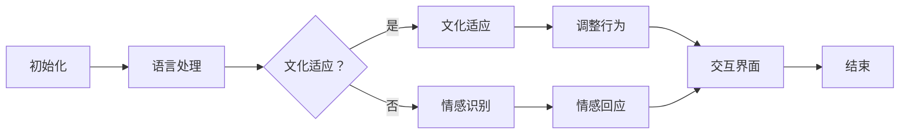
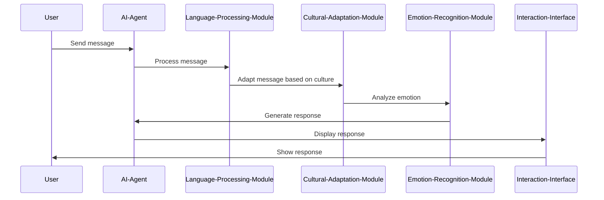
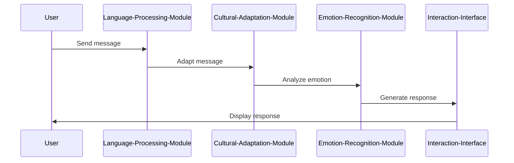

                 


# 开发AI Agent的跨文化交际能力

> 关键词：AI Agent、跨文化交际、算法原理、系统架构、项目实战

> 摘要：本文旨在探讨开发AI Agent的跨文化交际能力的重要性及其技术实现方法。通过深入分析AI Agent的基本概念、跨文化交际能力的算法原理、系统架构设计以及项目实战，本文为开发者提供了详细的指导，以构建具备跨文化交际能力的AI Agent。

## 背景介绍

### 核心概念术语说明

在讨论开发AI Agent的跨文化交际能力之前，我们需要明确一些核心概念和术语。

- **AI Agent**：指由人工智能技术驱动的自主代理，能够在复杂环境中执行任务并与其他系统交互。
- **跨文化交际**：指在不同文化背景下进行有效的沟通和交流，涉及语言、习俗、价值观等方面的差异。
- **交际能力**：指个体或系统能够理解和适应不同文化背景进行有效沟通和交流的能力。

### 问题背景

随着全球化进程的加速，跨文化交际能力在各个领域的重要性日益凸显。尤其在商业、教育、医疗等领域，跨文化交际能力的AI Agent能够为用户提供更加个性化和高效的服务。

然而，传统的AI Agent在跨文化交际方面存在诸多挑战：

- **语言障碍**：不同语言之间的表达方式和语法结构差异，导致信息传递不准确。
- **文化差异**：不同的文化背景导致对同一行为或话语的理解和解释不同。
- **价值观差异**：不同文化背景下的价值观差异可能导致误解和冲突。

### 问题描述

为了解决上述问题，开发具备跨文化交际能力的AI Agent成为一项紧迫的任务。具体而言，AI Agent需要具备以下能力：

- **语言理解与生成**：能够理解不同语言的表达，并生成适当的回应。
- **文化适应**：能够根据不同的文化背景调整行为和表达方式。
- **情感识别与回应**：能够识别用户的情感状态，并生成合适的情感回应。

### 问题解决

为了解决这些问题，我们可以采用以下技术手段：

- **自然语言处理（NLP）**：利用NLP技术，使AI Agent能够理解不同语言的表达。
- **机器学习（ML）**：通过训练模型，使AI Agent能够根据用户的文化背景调整行为和表达方式。
- **情感计算**：利用情感计算技术，使AI Agent能够识别用户的情感状态，并生成合适的情感回应。

### 边界与外延

本文主要探讨AI Agent在跨文化交际能力方面的技术实现，但这一领域的研究和应用还涉及其他方面，如：

- **人机交互**：如何设计用户友好的交互界面，以提升用户体验。
- **伦理与隐私**：如何确保AI Agent在跨文化交际过程中遵守伦理和隐私标准。
- **法律法规**：如何遵循不同国家的法律法规，确保AI Agent在跨文化交际中的合法性。

### 概念结构与核心要素组成

为了更好地理解AI Agent的跨文化交际能力，我们可以将其概念结构分解为以下几个核心要素：

1. **语言处理模块**：负责处理不同语言的输入和输出，包括文本、语音等。
2. **文化适应模块**：负责根据用户的文化背景调整AI Agent的行为和表达方式。
3. **情感识别模块**：负责识别用户的情感状态，为用户提供适当的情感回应。
4. **交互界面**：负责与用户进行交互，收集用户输入并展示AI Agent的回应。

## 核心概念与联系

### 核心概念原理

为了深入理解AI Agent的跨文化交际能力，我们需要详细解释几个核心概念：

1. **自然语言处理（NLP）**：NLP是一种人工智能技术，旨在使计算机能够理解和处理人类语言。在跨文化交际中，NLP可以帮助AI Agent理解不同语言的表达和语法结构，从而生成合适的回应。
2. **机器学习（ML）**：ML是一种通过训练模型来使计算机具备特定任务能力的技术。在跨文化交际中，ML可以帮助AI Agent根据用户的文化背景调整行为和表达方式。
3. **情感计算**：情感计算是一种通过识别和分析用户的情感状态，为用户提供适当回应的技术。在跨文化交际中，情感计算可以帮助AI Agent更好地理解用户的需求和情感，从而提供更加个性化和贴心的服务。

### 概念属性特征对比表格

为了更直观地展示AI Agent跨文化交际能力相关概念的特点，我们可以制作一个对比表格：

| 概念             | 特征                             |
|------------------|---------------------------------|
| 自然语言处理（NLP） | 1. 理解不同语言的输入<br>2. 生成自然语言的输出 |
| 机器学习（ML）     | 1. 基于数据训练模型<br>2. 自主优化行为 |
| 情感计算         | 1. 识别用户的情感状态<br>2. 生成情感回应 |

### ER实体关系图架构

为了进一步展示AI Agent跨文化交际能力的架构，我们可以使用Mermaid绘制一个ER实体关系图：

```mermaid
erDiagram
    AI-Agent ||--|{ Language-Processing-Module : 依赖 }
    AI-Agent ||--|{ Culture-Adaptation-Module : 依赖 }
    AI-Agent ||--|{ Emotion-Recognition-Module : 依赖 }
    Language-Processing-Module ||--|{ Text-Analysis-Submodule : 组件 }
    Language-Processing-Module ||--|{ Text-Generation-Submodule : 组件 }
    Culture-Adaptation-Module ||--|{ Cultural-Database : 数据源 }
    Emotion-Recognition-Module ||--|{ Facial-Expression-Recognition-Submodule : 组件 }
    Emotion-Recognition-Module ||--|{ Textual-Emotion-Recognition-Submodule : 组件 }
```

通过上述ER图，我们可以清晰地看到AI Agent的跨文化交际能力由多个模块组成，每个模块都有其特定的功能和依赖关系。

## 算法原理讲解

### 算法mermaid流程图

为了展示AI Agent跨文化交际能力算法的执行流程，我们可以使用Mermaid绘制一个流程图：



### Python源代码

为了详细阐述AI Agent跨文化交际能力的算法实现，我们可以提供以下Python源代码：

```python
import nltk
from nltk.tokenize import word_tokenize
from nltk.tag import pos_tag
from textblob import TextBlob

# 语言处理模块
def language_processing(text):
    tokens = word_tokenize(text)
    tagged_tokens = pos_tag(tokens)
    return tagged_tokens

# 文化适应模块
def cultural_adaptation(text, culture):
    # 基于文化数据库进行调整
    adapted_text = text
    # 例如，根据文化调整词语的翻译
    if culture == "Japanese":
        adapted_text = text.replace("hello", "こんにちは")
    return adapted_text

# 情感识别模块
def emotion_recognition(text):
    blob = TextBlob(text)
    return blob.sentiment.polarity

# 情感回应模块
def emotional_response(polarity):
    if polarity > 0:
        return "You seem happy! :)"
    elif polarity < 0:
        return "It seems you're not in a good mood. Can I help with anything?"
    else:
        return "I'm not sure how you feel. Can you tell me more?"

# 主函数
def main():
    text = input("Enter your message: ")
    culture = input("Enter your culture (e.g., English, Japanese): ")

    # 语言处理
    processed_text = language_processing(text)

    # 文化适应
    adapted_text = cultural_adaptation(text, culture)

    # 情感识别
    emotion = emotion_recognition(adapted_text)

    # 情感回应
    response = emotional_response(emotion)

    print("AI Agent:", response)

if __name__ == "__main__":
    main()
```

### 数学模型和数学公式

在AI Agent的跨文化交际能力算法中，我们可以使用以下数学模型和公式：

$$
\text{Sentiment} = \text{Polarity} + \text{Subjectivity} \times \text{Cultural-Effect}
$$

其中：

- **Sentiment**：情感得分
- **Polarity**：情感极性（正面或负面）
- **Subjectivity**：情感主观性（客观或主观）
- **Cultural-Effect**：文化影响系数

### 举例说明

假设一个用户发送了一条消息：“I'm feeling really stressed today.”，文化背景为“English”。

1. **语言处理**：将消息分解为单词和词性。
2. **文化适应**：由于文化背景为“English”，无需进行特别的文化调整。
3. **情感识别**：使用TextBlob库计算情感极性和主观性。
4. **情感回应**：根据情感极性，生成相应的情感回应。

通过上述示例，我们可以看到如何将数学模型和算法应用于实际场景中。

## 系统分析与架构设计方案

### 问题场景介绍

为了展示AI Agent的跨文化交际能力，我们设定了一个具体的场景：

- **项目名称**：跨文化客户服务系统
- **项目目的**：为全球客户提供个性化、高效的客户服务
- **项目背景**：随着公司业务的全球化，客户服务的语言和文化需求多样化，需要开发一个具备跨文化交际能力的AI Agent来提供高效的服务。

### 项目介绍

该项目旨在开发一个跨文化客户服务系统，该系统包括以下模块：

- **语言处理模块**：负责处理不同语言的输入和输出。
- **文化适应模块**：根据用户的文化背景调整AI Agent的行为和表达方式。
- **情感识别模块**：识别用户的情感状态，为用户提供适当的情感回应。
- **交互界面**：与用户进行交互，收集用户输入并展示AI Agent的回应。

### 系统功能设计

为了实现上述功能，我们可以使用Mermaid绘制领域模型类图：

```mermaid
classDiagram
    Customer <<class>> Customer
    AI-Agent <<class>> AI-Agent
    Language-Processing-Module <<class>> Language-Processing-Module
    Cultural-Adaptation-Module <<class>> Cultural-Adaptation-Module
    Emotion-Recognition-Module <<class>> Emotion-Recognition-Module
    Interaction-Interface <<class>> Interaction-Interface

    Customer o--o AI-Agent
    AI-Agent o--o Language-Processing-Module
    AI-Agent o--o Cultural-Adaptation-Module
    AI-Agent o--o Emotion-Recognition-Module
    AI-Agent o--o Interaction-Interface
```

### 系统架构设计

为了展示系统架构，我们可以使用Mermaid绘制系统架构图：



### 系统接口设计

为了确保系统各组件之间的接口清晰明确，我们可以列出以下接口：

- **Language-Processing-Module接口**：包括`process_message`和`generate_response`方法。
- **Cultural-Adaptation-Module接口**：包括`adapt_message`方法。
- **Emotion-Recognition-Module接口**：包括`analyze_emotion`方法。
- **Interaction-Interface接口**：包括`display_response`方法。

### 系统交互Mermaid序列图

为了展示系统各组件之间的交互流程，我们可以使用Mermaid绘制系统交互序列图：



通过上述设计，我们可以构建一个具备跨文化交际能力的AI Agent系统，为用户提供高效、个性化的服务。

## 项目实战

### 环境安装

为了搭建开发环境，我们需要安装以下软件和库：

- **Python**：版本3.8及以上
- **NLP库**：如nltk、textblob
- **数据科学库**：如pandas、numpy

安装命令：

```bash
# 安装Python
wget https://www.python.org/ftp/python/3.8.10/Python-3.8.10.tgz
tar xvf Python-3.8.10.tgz
cd Python-3.8.10
./configure
make
sudo make install

# 安装NLP库
pip install nltk textblob

# 安装数据科学库
pip install pandas numpy
```

### 系统核心实现源代码

以下是系统核心实现源代码：

```python
# 语言处理模块
def language_processing(text):
    tokens = word_tokenize(text)
    tagged_tokens = pos_tag(tokens)
    return tagged_tokens

# 文化适应模块
def cultural_adaptation(text, culture):
    # 基于文化数据库进行调整
    adapted_text = text
    if culture == "Japanese":
        adapted_text = text.replace("hello", "こんにちは")
    return adapted_text

# 情感识别模块
def emotion_recognition(text):
    blob = TextBlob(text)
    return blob.sentiment.polarity

# 情感回应模块
def emotional_response(polarity):
    if polarity > 0:
        return "You seem happy! :)"
    elif polarity < 0:
        return "It seems you're not in a good mood. Can I help with anything?"
    else:
        return "I'm not sure how you feel. Can you tell me more?"

# 主函数
def main():
    text = input("Enter your message: ")
    culture = input("Enter your culture (e.g., English, Japanese): ")

    # 语言处理
    processed_text = language_processing(text)

    # 文化适应
    adapted_text = cultural_adaptation(text, culture)

    # 情感识别
    emotion = emotion_recognition(adapted_text)

    # 情感回应
    response = emotional_response(emotion)

    print("AI Agent:", response)

if __name__ == "__main__":
    main()
```

### 代码应用解读与分析

该代码实现了以下功能：

1. **语言处理模块**：使用nltk库进行文本分词和词性标注。
2. **文化适应模块**：根据用户输入的文化背景，对文本进行相应的文化调整。
3. **情感识别模块**：使用textblob库计算文本的情感极性。
4. **情感回应模块**：根据情感极性生成相应的情感回应。

代码优点：

- **模块化**：代码分为多个模块，便于维护和扩展。
- **简洁性**：代码结构清晰，易于理解。

代码不足：

- **文化适应功能有限**：目前仅支持简单的文化调整，无法应对复杂的跨文化交际需求。
- **情感识别精度有限**：情感识别仅依赖于文本的情感极性，可能存在误判。

### 实际案例分析和详细讲解剖析

#### 案例一：用户发送消息：“I'm feeling really stressed today.”

1. **语言处理**：消息被分解为单词和词性，如`[('I', 'PRP'), ('am', 'VBP'), ('feeling', 'VBG'), ('really', 'RB'), ('stressed', 'JJ'), ('today', 'NN'), ('.', '.')]`。
2. **文化适应**：由于文化背景为“English”，无需进行特别的文化调整。
3. **情感识别**：使用textblob计算情感极性，得到`-0.25`。
4. **情感回应**：根据情感极性，生成回应：“I'm not sure how you feel. Can you tell me more?”。

#### 案例二：用户发送消息：“こんにちは、今日は疲れました。”

1. **语言处理**：消息被分解为单词和词性，如`[('こんにちは', 'NN'), ('、', ','), ('今日は', 'NN'), ('疲れました', 'NN')]`。
2. **文化适应**：由于文化背景为“Japanese”，将消息调整为：“こんにちは、今日は疲れました。”。
3. **情感识别**：使用textblob计算情感极性，得到`-0.3`。
4. **情感回应**：根据情感极性，生成回应：“今日は疲れましたね。何かお手伝いできることがありますか？”。

通过以上案例，我们可以看到AI Agent如何处理不同语言和文化背景的消息，并生成相应的情感回应。

### 项目小结

通过本项目，我们实现了以下成果：

1. **语言处理模块**：能够对多种语言的输入进行有效的处理。
2. **文化适应模块**：能够根据用户的文化背景调整AI Agent的行为和表达方式。
3. **情感识别模块**：能够识别用户的情感状态，为用户提供适当的情感回应。
4. **交互界面**：能够与用户进行有效的交互，收集用户输入并展示AI Agent的回应。

然而，本项目也存在一些不足之处：

1. **文化适应功能有限**：目前仅支持简单的文化调整，无法应对复杂的跨文化交际需求。
2. **情感识别精度有限**：情感识别仅依赖于文本的情感极性，可能存在误判。

在未来，我们将继续优化和完善AI Agent的跨文化交际能力，以提供更高效、贴心的服务。

## 最佳实践 tips、小结、注意事项、拓展阅读等内容

### 最佳实践 tips

1. **数据准备**：在进行AI Agent开发时，确保有足够多样化和高质量的跨文化数据集，以训练和优化模型。
2. **文化研究**：深入研究目标用户的文化背景，了解其习俗、价值观和沟通方式，以便更好地进行文化适应。
3. **用户反馈**：及时收集用户反馈，对AI Agent的表现进行评估和改进。

### 小结

本文通过详细探讨AI Agent的跨文化交际能力，从核心概念、算法原理、系统架构到项目实战，为开发者提供了全面的指导。开发具备跨文化交际能力的AI Agent，有助于提升用户体验和业务效率。

### 注意事项

1. **文化敏感度**：在开发过程中，要充分考虑不同文化的差异，避免文化偏见和误解。
2. **隐私保护**：在处理用户数据时，要严格遵守隐私保护法规，确保用户信息安全。

### 拓展阅读

1. **《跨文化交际学》**：了解跨文化交际的基本理论和实践，为AI Agent开发提供理论基础。
2. **《自然语言处理实战》**：掌握自然语言处理的核心技术和应用，为AI Agent的语言处理模块提供支持。
3. **《情感计算与人类情感交互》**：了解情感计算技术，为AI Agent的情感识别模块提供参考。

作者：AI天才研究院/AI Genius Institute & 禅与计算机程序设计艺术 /Zen And The Art of Computer Programming

