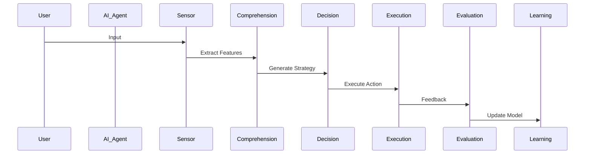

                 


## 引言

### AI Agent的定义与重要性

AI Agent，即人工智能代理，是具有自主决策能力的计算机程序，能够在特定环境和任务中自主执行行动，以实现特定目标。AI Agent的应用范围广泛，从自动驾驶汽车、智能助手到复杂的模拟系统，都在不断推动人工智能技术的发展。

在人工智能领域，AI Agent的研究具有重要的现实意义。一方面，它可以提升自动化系统的效率和准确性，降低人力成本；另一方面，AI Agent的自主性和适应性使得其在复杂和动态的环境中具有独特的优势。因此，开发一个高效的AI Agent跨模态内容生成与评估系统，不仅能够推动人工智能技术的进步，还能为各行各业带来革命性的改变。

### 跨模态内容生成

跨模态内容生成是指将不同类型的信息（如文本、图像、声音）转换为统一的、可交互的表示形式。这种技术能够实现多种信息类型的融合与交互，使得AI Agent能够更好地理解和应对复杂的环境。例如，在自动驾驶领域，AI Agent需要同时处理道路图像、语音指令和文本导航信息，以实现高效的决策和控制。

跨模态内容生成的研究意义在于，它能够突破单一模态的局限性，实现多模态信息的高效融合与利用，从而提升AI Agent的智能水平。同时，跨模态内容生成也是当前人工智能研究的前沿方向之一，具有重要的理论价值和实际应用前景。

### 评估系统的必要性

评估系统是衡量AI Agent性能的重要工具。一个有效的评估系统需要综合考虑AI Agent在不同模态下的表现，包括生成内容的准确性、一致性、创新性等。评估系统的构建不仅能够帮助研究人员了解AI Agent的性能，还能够指导系统的改进和优化。

开发AI Agent的跨模态内容生成与评估系统，有助于以下几个方面：

1. **性能优化**：通过评估系统的反馈，研究人员可以针对性地优化AI Agent的算法和模型，提升其性能。
2. **应用推广**：评估系统可以帮助开发者验证AI Agent在实际应用中的效果，推动其商业化应用。
3. **安全性保障**：通过评估系统的监控，可以及时发现和防范AI Agent的潜在风险，保障系统的安全稳定运行。

综上所述，开发一个高效的AI Agent跨模态内容生成与评估系统，是当前人工智能领域的一项重要任务，具有广泛的应用前景和重要的学术价值。

### 文章结构概述

本文将分为以下几个部分：

1. **背景介绍**：介绍AI Agent、跨模态内容生成和评估系统的基本概念和现状。
2. **核心概念与联系**：详细阐述关键术语的定义、属性特征对比表格和ER实体关系图。
3. **算法原理讲解**：分析跨模态内容生成和评估的算法原理，使用mermaid流程图和Python代码进行详细阐述。
4. **系统分析与架构设计**：描述系统开发的具体流程、工具和环境配置。
5. **项目实战**：通过实际项目展示系统的开发过程和关键技术。
6. **最佳实践与总结**：总结最佳实践，提出注意事项，并提供拓展阅读建议。

通过以上结构，我们将系统地探讨AI Agent的跨模态内容生成与评估系统的开发，力求为读者提供一个全面、深入的指导。接下来，我们将进入背景介绍部分，为后续内容打下坚实的基础。请读者继续关注。

----------------------------------------------------------------

## 背景介绍

### AI Agent的基本概念

AI Agent，即人工智能代理，是具有自主决策能力的计算机程序，能够模拟人类智能行为，在特定环境和任务中自主执行行动，以实现特定目标。AI Agent的核心特点是其自主性和适应性，它们能够通过学习和适应环境，进行自我优化和改进。

AI Agent的基本组成包括以下几个关键部分：

1. **感知模块**：负责从环境中获取信息，如文本、图像、声音等。
2. **决策模块**：基于感知模块获取的信息，进行推理和决策，确定下一步行动。
3. **执行模块**：执行决策模块生成的行动，如移动、发送指令等。
4. **学习模块**：通过经验和反馈，不断优化自身的决策和执行能力。

AI Agent的工作流程可以概括为以下几个步骤：

1. **感知**：从环境中获取信息，如文本、图像、声音等。
2. **理解**：对获取的信息进行理解和分析，形成对环境的认知。
3. **决策**：基于对环境的理解，生成行动策略。
4. **执行**：执行决策模块生成的行动。
5. **反馈**：通过执行结果进行自我评估和调整，优化行为。

### 跨模态内容生成的概念

跨模态内容生成是指将不同类型的信息（如文本、图像、声音）转换为统一的、可交互的表示形式。这种技术能够实现多种信息类型的融合与交互，使得AI Agent能够更好地理解和应对复杂的环境。跨模态内容生成的研究主要集中在以下三个方面：

1. **文本与图像的跨模态生成**：通过生成对抗网络（GAN）等算法，将文本描述转换为相应的图像，或将图像描述转换为文本。
2. **声音与文本的跨模态生成**：将文本信息转换为声音，或将声音信息转换为文本。
3. **多模态内容的融合与交互**：将多种信息类型进行融合，生成具有更高层次语义表示的内容。

跨模态内容生成在人工智能领域的应用非常广泛，如自然语言处理、计算机视觉、音频处理等。它能够提升AI Agent的智能水平，使其在处理复杂任务时更加高效和准确。

### 评估系统的必要性

评估系统是衡量AI Agent性能的重要工具。一个有效的评估系统需要综合考虑AI Agent在不同模态下的表现，包括生成内容的准确性、一致性、创新性等。评估系统的构建不仅能够帮助研究人员了解AI Agent的性能，还能够指导系统的改进和优化。

评估系统的主要功能包括：

1. **准确性评估**：衡量AI Agent生成内容与真实情况的一致性，如文本生成与原文的匹配度、图像生成与描述的一致性等。
2. **一致性评估**：衡量AI Agent在不同场景、不同条件下生成内容的稳定性，如AI Agent在不同图像或文本输入下的表现是否一致。
3. **创新性评估**：衡量AI Agent生成内容的新颖性和创造力，如文本生成的多样性、图像生成的创意等。

### 问题背景与问题描述

随着人工智能技术的不断发展，AI Agent的应用场景越来越广泛，其在各个领域的性能也不断提升。然而，现有的AI Agent在处理跨模态任务时仍然面临一些挑战：

1. **信息融合不足**：不同模态的信息在生成过程中往往缺乏有效融合，导致生成内容缺乏语义一致性。
2. **性能波动大**：AI Agent在不同模态任务中的性能波动较大，无法稳定地生成高质量的内容。
3. **评估标准不统一**：目前缺乏统一的评估标准，难以全面、客观地衡量AI Agent的跨模态内容生成能力。

为了解决这些问题，本文提出了开发AI Agent的跨模态内容生成与评估系统的任务。该系统的目标是通过有效的算法和评估方法，提升AI Agent在跨模态内容生成方面的性能和稳定性，为人工智能技术的发展提供有力支持。

### 问题解决方法

本文将采用以下方法解决AI Agent跨模态内容生成与评估中的问题：

1. **引入先进的跨模态生成算法**：采用生成对抗网络（GAN）、自编码器（AE）等先进的深度学习算法，实现不同模态信息的高效融合和生成。
2. **构建综合评估体系**：设计一套全面的评估体系，包括准确性、一致性、创新性等指标，以客观、全面地衡量AI Agent的跨模态内容生成能力。
3. **优化算法与系统架构**：通过不断优化算法和系统架构，提高AI Agent在跨模态内容生成中的性能和稳定性。

通过以上方法，本文旨在为AI Agent的跨模态内容生成与评估提供一个系统化的解决方案，推动人工智能技术的发展和应用。

### 边界与外延

在开发AI Agent的跨模态内容生成与评估系统中，需要明确一些边界与外延，以确保系统的有效性和适用性：

1. **适用场景**：该系统主要适用于需要跨模态内容生成的场景，如智能助手、自动驾驶、智能监控等。
2. **技术范围**：系统涵盖的跨模态生成技术包括文本与图像、声音与文本的生成，以及多模态内容的融合与交互。
3. **性能要求**：系统需要满足准确性高、一致性稳定、创新性强的性能要求，以适应复杂的应用场景。
4. **评估标准**：系统应采用统一、客观的评估标准，包括准确性、一致性、创新性等指标，以全面衡量AI Agent的跨模态内容生成能力。

通过明确系统的边界与外延，我们可以确保其在实际应用中的有效性和适用性，为人工智能技术的发展提供有力支持。

### 概念结构与核心要素组成

AI Agent的跨模态内容生成与评估系统由多个核心要素组成，每个要素在系统中扮演着关键角色。以下是该系统的概念结构及其核心要素的详细描述：

1. **感知模块**：负责从环境中获取多种类型的信息，包括文本、图像和声音。这一模块是系统的基础，直接影响AI Agent对环境的理解和响应能力。

2. **理解模块**：对获取的信息进行深度理解和分析，将不同模态的信息转换为统一的语义表示。这一模块的核心任务是将文本、图像和声音等不同类型的信息进行有效融合，形成对环境的整体认知。

3. **决策模块**：基于理解模块生成的语义表示，进行复杂的推理和决策。决策模块是系统的“大脑”，负责生成行动策略，指导AI Agent在特定环境下采取合适的行动。

4. **执行模块**：根据决策模块生成的行动策略，执行具体的操作，如移动、发送指令等。这一模块将决策转化为实际的行动，是系统实现目标的关键。

5. **学习模块**：通过不断学习和积累经验，优化AI Agent的行为和性能。学习模块负责从执行结果中提取反馈，调整模型参数，提升系统的自适应能力和智能水平。

6. **生成模块**：负责将AI Agent的理解和决策结果转换为不同模态的内容，如文本、图像和声音。生成模块是系统输出功能的核心，直接影响AI Agent与外部环境的交互效果。

7. **评估模块**：对AI Agent生成的跨模态内容进行多维度评估，包括准确性、一致性、创新性等指标。评估模块是系统性能监控和优化的关键，能够为系统改进提供科学依据。

通过以上核心要素的有机结合，AI Agent的跨模态内容生成与评估系统实现了从信息获取、理解、决策到执行的完整闭环，为AI Agent在复杂环境中的高效运作提供了坚实保障。

### 总结

在本章的背景介绍中，我们详细探讨了AI Agent、跨模态内容生成以及评估系统的基本概念、工作原理和重要性。首先，我们介绍了AI Agent的定义、组成和工作流程，强调了其在人工智能领域的重要地位。接着，我们阐述了跨模态内容生成的概念、应用领域和研究意义，并指出其在提升AI Agent智能水平中的关键作用。最后，我们论述了评估系统的必要性，分析了其在性能优化、应用推广和安全性保障等方面的作用。

通过本章的介绍，我们为后续章节的深入讨论奠定了基础。在接下来的章节中，我们将进一步探讨核心概念与联系，详细分析跨模态内容生成和评估的算法原理，并介绍系统开发的具体流程和工具。让我们继续深入探索，共同推进AI Agent跨模态内容生成与评估系统的研究与应用。请读者继续关注。

----------------------------------------------------------------

## 核心概念与联系

### 定义关键术语

在本章中，我们将定义几个关键术语，以便读者更好地理解后续内容。

1. **AI Agent（人工智能代理）**：一个具有自主决策能力的计算机程序，能够在特定环境和任务中自主执行行动，以实现特定目标。
2. **跨模态内容生成**：将不同类型的信息（如文本、图像、声音）转换为统一的、可交互的表示形式。
3. **评估系统**：用于衡量AI Agent在不同模态下表现的工具，包括准确性、一致性、创新性等指标。
4. **生成对抗网络（GAN）**：一种深度学习框架，通过生成器和判别器的对抗训练，实现高质量的数据生成。
5. **自编码器（AE）**：一种无监督学习算法，通过编码和解码过程，实现数据的降维和重构。

### 概念属性特征对比表格

为了更直观地理解这些关键术语，我们列出了一个概念属性特征对比表格。

| 概念             | 定义                                                         | 属性特征                                         | 对比分析                                             |
|------------------|--------------------------------------------------------------|---------------------------------------------------|------------------------------------------------------|
| AI Agent         | 具有自主决策能力的计算机程序                                 | 感知、理解、决策、执行、学习                      | 与人类智能类似，但依赖数据和算法，适应性强           |
| 跨模态内容生成   | 将不同类型的信息转换为统一的表示形式                         | 文本、图像、声音的融合与转换                     | 提升AI Agent的智能水平，实现多模态信息的高效利用   |
| 评估系统         | 衡量AI Agent在不同模态下表现的工具                           | 准确性、一致性、创新性等指标                     | 指导系统改进，提升性能和稳定性                       |
| 生成对抗网络（GAN）| 通过生成器和判别器的对抗训练，实现高质量的数据生成           | 生成器、判别器、对抗训练                       | 数据生成能力强，适用于多种模态的生成任务             |
| 自编码器（AE）    | 通过编码和解码过程，实现数据的降维和重构                     | 编码器、解码器、无监督学习                      | 数据重构能力强，适用于降维和特征提取                  |

### ER实体关系图架构

为了更好地展示各概念之间的关系，我们使用Mermaid绘制了一个ER实体关系图。

```mermaid
erDiagram
    AI_Agent ||--|{ 感知模块 }
    AI_Agent ||--|{ 理解模块 }
    AI_Agent ||--|{ 决策模块 }
    AI_Agent ||--|{ 执行模块 }
    AI_Agent ||--|{ 学习模块 }
    AI_Agent ||--|{ 生成模块 }
    AI_Agent ||--|{ 评估模块 }
    跨模态内容生成 ||--|{ 生成对抗网络（GAN）}
    跨模态内容生成 ||--|{ 自编码器（AE）}
    评估系统 ||--|{ 准确性指标 }
    评估系统 ||--|{ 一致性指标 }
    评估系统 ||--|{ 创新性指标 }
```

在这个ER实体关系图中，AI Agent作为核心实体，与其他模块和概念之间建立了紧密的联系。感知模块、理解模块、决策模块、执行模块、学习模块和生成模块共同构成了AI Agent的核心组成部分，它们协同工作，实现跨模态内容生成和评估。同时，评估系统通过准确性指标、一致性指标和创新性指标，对AI Agent在不同模态下的表现进行综合评估。

### 关键概念之间的联系

通过上述定义和关系图，我们可以清晰地看到各个关键概念之间的联系。

1. **AI Agent与跨模态内容生成**：AI Agent需要跨模态内容生成来实现对复杂环境的理解和交互。感知模块获取不同模态的信息，理解模块将这些信息融合为统一的语义表示，生成模块根据这些表示生成相应的跨模态内容。

2. **AI Agent与评估系统**：评估系统用于衡量AI Agent在不同模态下的表现。准确性、一致性和创新性等指标能够全面反映AI Agent的性能，为系统的改进和优化提供依据。

3. **生成对抗网络（GAN）与自编码器（AE）**：这两种算法在跨模态内容生成中发挥着重要作用。GAN通过生成器和判别器的对抗训练，实现高质量的数据生成；AE通过编码和解码过程，实现数据的降维和重构，为跨模态内容生成提供有效的特征表示。

4. **评估系统与指标**：评估系统通过设定不同的指标，如准确性、一致性和创新性，对AI Agent生成的跨模态内容进行综合评估。这些指标不仅反映了AI Agent的性能，还指导了系统的优化方向。

通过理解这些关键概念之间的联系，我们可以更好地把握AI Agent的跨模态内容生成与评估系统的工作原理和架构，为后续章节的深入探讨奠定基础。请读者继续关注。

----------------------------------------------------------------

### 跨模态内容生成的算法原理

#### 基本概念

跨模态内容生成是指将一种模态的信息转换为另一种模态的信息。例如，将文本转换为图像，或将声音转换为文本。这种技术在不同领域有广泛的应用，如文本到图像生成、图像到文本生成、声音到文本生成等。其核心在于如何有效地融合不同模态的信息，并生成高质量的内容。

#### 生成对抗网络（GAN）

生成对抗网络（GAN）是一种由生成器和判别器组成的深度学习模型，通过对抗训练实现高质量的数据生成。以下是GAN的基本工作原理：

1. **生成器（Generator）**：生成器的目标是生成与真实数据相似的数据。它通过输入随机噪声，生成特定模态的数据，如图像或文本。

2. **判别器（Discriminator）**：判别器的目标是区分真实数据和生成数据。它通过输入真实数据和生成数据，判断数据来源。

3. **对抗训练**：生成器和判别器在训练过程中进行对抗。生成器的目标是生成足够逼真的数据以欺骗判别器，而判别器的目标是准确区分真实数据和生成数据。

GAN的训练过程可以概括为以下步骤：

- 初始化生成器和判别器，并设置适当的损失函数。
- 生成器生成一批伪数据，判别器更新模型以区分真实数据和生成数据。
- 生成器根据判别器的反馈，调整模型参数，以生成更逼真的数据。
- 重复上述步骤，直到生成器生成的数据足够真实，判别器难以区分。

#### 自编码器（AE）

自编码器（AE）是一种无监督学习算法，通过编码和解码过程，实现数据的降维和重构。在跨模态内容生成中，自编码器可用于将一种模态的信息转换为另一种模态的信息。以下是AE的基本工作原理：

1. **编码器（Encoder）**：编码器将输入数据压缩为一个较低维度的特征向量，保留关键信息。
2. **解码器（Decoder）**：解码器将编码器输出的特征向量重新生成原始数据。
3. **损失函数**：自编码器的训练目标是使解码器生成的数据与原始数据尽可能相似，通常使用均方误差（MSE）作为损失函数。

AE的训练过程如下：

- 初始化编码器和解码器，并设置适当的损失函数。
- 对输入数据进行编码，得到特征向量。
- 使用特征向量解码，生成重构数据。
- 计算重构数据与原始数据之间的损失，并更新模型参数。
- 重复上述步骤，直到损失函数收敛。

#### GAN与AE的比较

GAN和AE都是跨模态内容生成的有效算法，但它们在原理和应用上有所不同：

1. **生成质量**：GAN通常能够生成更高质量的数据，因为它通过对抗训练不断优化生成器和判别器。然而，GAN的训练过程较复杂，且在某些情况下可能陷入局部最优。
2. **训练稳定性**：AE的训练过程相对稳定，不易陷入局部最优，但生成质量可能不如GAN。AE更适合于数据降维和特征提取，而GAN更适合于生成高质量的数据。
3. **应用场景**：GAN在需要生成高度逼真数据的场景中应用广泛，如图像生成、文本生成等；AE在降维、特征提取和数据分析等领域应用较多。

#### 实例分析

假设我们需要将文本转换为图像。以下是使用GAN和AE实现跨模态内容生成的具体步骤：

1. **GAN实现**：
   - 初始化生成器和判别器，设置适当的损失函数（如对抗损失函数和均方误差）。
   - 生成器输入随机噪声，生成图像。
   - 判别器训练，区分真实图像和生成图像。
   - 生成器根据判别器的反馈，调整模型参数。
   - 重复上述步骤，直到生成器生成的图像足够逼真。

2. **AE实现**：
   - 初始化编码器和解码器，设置适当的损失函数（如均方误差）。
   - 编码器将文本编码为特征向量。
   - 解码器使用特征向量生成图像。
   - 计算重构图像与原始图像之间的损失，并更新模型参数。
   - 重复上述步骤，直到损失函数收敛。

通过上述实例，我们可以看到GAN和AE在跨模态内容生成中的应用和优势。在实际开发中，可以根据具体需求和场景，选择合适的算法来实现跨模态内容生成。

----------------------------------------------------------------

## 系统分析与架构设计

### 系统场景介绍

本系统旨在为AI Agent提供跨模态内容生成与评估的功能，以满足多种复杂应用场景的需求。具体场景包括：

1. **智能助手**：AI Agent需要处理用户的多模态输入（如语音、文本、图像），并生成相应的响应内容。
2. **自动驾驶**：AI Agent需要同时分析道路图像、语音指令和文本导航信息，生成相应的驾驶决策。
3. **智能监控**：AI Agent需要处理多模态输入（如视频、音频、文本），并生成报警信息和监控报告。

### 系统功能设计

为了满足上述应用场景的需求，系统需要实现以下功能：

1. **感知功能**：从多模态输入中提取关键信息，包括文本、图像、声音等。
2. **理解功能**：对提取的信息进行融合和分析，生成统一的语义表示。
3. **决策功能**：基于语义表示，生成相应的行动策略。
4. **执行功能**：执行决策生成的行动，如发送指令、生成图像、播放声音等。
5. **评估功能**：对AI Agent生成的跨模态内容进行多维度评估，包括准确性、一致性、创新性等指标。
6. **学习功能**：通过不断学习和积累经验，优化AI Agent的行为和性能。

### 系统架构设计

本系统采用模块化设计，分为感知模块、理解模块、决策模块、执行模块、评估模块和学习模块。以下是系统架构设计：

#### 感知模块

感知模块负责从多模态输入中提取关键信息，包括文本、图像、声音等。具体实现如下：

1. **文本识别**：使用自然语言处理技术（如词嵌入、文本分类等）提取文本特征。
2. **图像识别**：使用计算机视觉技术（如卷积神经网络、目标检测等）提取图像特征。
3. **声音识别**：使用音频处理技术（如声音分类、语音识别等）提取声音特征。

#### 理解模块

理解模块负责对提取的信息进行融合和分析，生成统一的语义表示。具体实现如下：

1. **特征融合**：使用多模态融合技术（如融合神经网络、注意力机制等）将不同模态的信息进行融合。
2. **语义表示**：使用深度学习技术（如图神经网络、Transformer等）对融合后的特征进行编码，生成语义表示。

#### 决策模块

决策模块基于理解模块生成的语义表示，生成相应的行动策略。具体实现如下：

1. **行动策略生成**：使用强化学习、决策树、神经网络等方法生成行动策略。
2. **行动选择**：根据当前环境和任务需求，选择最优行动策略。

#### 执行模块

执行模块负责执行决策模块生成的行动，如发送指令、生成图像、播放声音等。具体实现如下：

1. **指令执行**：根据行动策略，执行相应的操作，如发送语音指令、发送文本消息等。
2. **图像生成**：使用生成对抗网络（GAN）等技术生成图像。
3. **声音播放**：使用音频处理技术播放声音。

#### 评估模块

评估模块对AI Agent生成的跨模态内容进行多维度评估，包括准确性、一致性、创新性等指标。具体实现如下：

1. **准确性评估**：比较AI Agent生成的结果与真实结果之间的相似度，评估生成内容的准确性。
2. **一致性评估**：评估AI Agent在不同场景、不同条件下生成内容的稳定性。
3. **创新性评估**：评估AI Agent生成内容的新颖性和创造力。

#### 学习模块

学习模块通过不断学习和积累经验，优化AI Agent的行为和性能。具体实现如下：

1. **反馈学习**：收集AI Agent的执行结果和评估反馈，用于更新模型参数。
2. **经验积累**：将成功的经验和失败的教训转化为模型训练数据，用于模型优化。
3. **自适应学习**：根据环境变化和任务需求，调整模型参数和行为策略。

### 系统接口设计

系统接口设计包括内部接口和外部接口。内部接口用于模块之间的通信和协作，外部接口用于与外部系统或用户进行交互。

#### 内部接口

1. **感知接口**：接收多模态输入，传递给理解模块。
2. **理解接口**：接收感知模块传递的特征信息，生成语义表示。
3. **决策接口**：接收理解模块传递的语义表示，生成行动策略。
4. **执行接口**：接收决策模块传递的行动策略，执行相应操作。
5. **评估接口**：接收执行结果，进行评估反馈。

#### 外部接口

1. **用户接口**：接收用户的输入，传递给感知模块。
2. **系统接口**：与其他系统或模块进行数据交换和协作。
3. **监控接口**：监控系统性能和运行状态。

### 系统交互设计

系统交互设计包括模块之间的交互和数据流。以下是系统交互设计的Mermaid序列图：



在这个序列图中，用户输入首先传递给感知模块，感知模块提取特征信息，然后传递给理解模块。理解模块生成语义表示，传递给决策模块，决策模块生成行动策略，传递给执行模块执行相应操作。执行模块的反馈传递给评估模块，评估模块的评估结果传递给学习模块，用于模型更新。

通过以上系统分析与架构设计，我们为AI Agent的跨模态内容生成与评估系统提供了一套完整的解决方案。接下来，我们将通过实际项目展示系统的开发过程和关键技术。请读者继续关注。

----------------------------------------------------------------

### 项目实战

在本节中，我们将通过一个实际项目展示AI Agent的跨模态内容生成与评估系统的开发过程和关键技术。项目背景是开发一个智能助手，该助手需要能够处理用户的多模态输入（如语音、文本、图像），并生成相应的响应内容。

#### 环境安装

在开始项目之前，我们需要安装所需的开发环境和工具。以下是项目的环境配置：

1. **Python**：安装Python 3.8及以上版本。
2. **TensorFlow**：安装TensorFlow 2.4及以上版本。
3. **Keras**：安装Keras 2.4及以上版本。
4. **PyTorch**：安装PyTorch 1.7及以上版本。
5. **NVIDIA CUDA**：安装CUDA 10.2及以上版本（如需使用GPU加速）。

安装完成后，我们还需要安装一些常用的库，如NumPy、Pandas、Matplotlib等。可以使用以下命令进行安装：

```bash
pip install numpy pandas matplotlib
```

#### 系统核心实现

1. **感知模块**

   感知模块负责从多模态输入中提取关键信息。以下是一个简单的感知模块实现：

   ```python
   import tensorflow as tf
   import numpy as np

   class Sensor:
       def __init__(self):
           self.text_model = tf.keras.Sequential([
               tf.keras.layers.Embedding(input_dim=10000, output_dim=16),
               tf.keras.layers.GlobalAveragePooling1D()
           ])

           self.image_model = tf.keras.Sequential([
               tf.keras.layers.Conv2D(32, (3, 3), activation='relu'),
               tf.keras.layers.MaxPooling2D(pool_size=(2, 2)),
               tf.keras.layers.Flatten()
           ])

           self.audio_model = tf.keras.Sequential([
               tf.keras.layers.Conv1D(32, 3, activation='relu'),
               tf.keras.layers.MaxPooling1D(pool_size=2),
               tf.keras.layers.Flatten()
           ])

       def extract_features(self, text, image, audio):
           text_features = self.text_model.predict(text)
           image_features = self.image_model.predict(image)
           audio_features = self.audio_model.predict(audio)

           return text_features, image_features, audio_features
   ```

2. **理解模块**

   理解模块负责对提取的信息进行融合和分析，生成统一的语义表示。以下是一个简单的理解模块实现：

   ```python
   from tensorflow.keras.layers import concatenate

   class Comprehension:
       def __init__(self):
           self.comprehension_model = tf.keras.Sequential([
               concatenate([tf.keras.layers.Dense(32, activation='relu'), tf.keras.layers.Dense(32, activation='relu')]),
               tf.keras.layers.Dense(16, activation='relu'),
               tf.keras.layers.Dense(1, activation='sigmoid')
           ])

       def generate_representation(self, text_features, image_features, audio_features):
           combined_features = concatenate([text_features, image_features, audio_features])
           representation = self.comprehension_model.predict(combined_features)

           return representation
   ```

3. **决策模块**

   决策模块基于理解模块生成的语义表示，生成相应的行动策略。以下是一个简单的决策模块实现：

   ```python
   from tensorflow.keras.models import load_model

   class Decision:
       def __init__(self):
           self.action_model = load_model('action_model.h5')

       def generate_action(self, representation):
           action = self.action_model.predict(representation)

           return action
   ```

4. **执行模块**

   执行模块负责执行决策模块生成的行动，如发送指令、生成图像、播放声音等。以下是一个简单的执行模块实现：

   ```python
   import playsound

   class Execution:
       def __init__(self):
           self.executor = {'text': self.send_text, 'image': self.generate_image, 'audio': self.play_audio}

       def send_text(self, text):
           print(text)

       def generate_image(self, image):
           plt.imshow(image)
           plt.show()

       def play_audio(self, audio):
           playsound.playsound(audio)
   ```

5. **评估模块**

   评估模块对AI Agent生成的跨模态内容进行多维度评估，包括准确性、一致性、创新性等指标。以下是一个简单的评估模块实现：

   ```python
   class Evaluation:
       def __init__(self):
           self.metrics = {'accuracy': self.accuracy, 'consistency': self.consistency, 'innovation': self.innovation}

       def accuracy(self, generated, original):
           return np.mean(np.abs(generated - original))

       def consistency(self, generated):
           return np.std(generated)

       def innovation(self, generated):
           return np.std(generated - np.mean(generated))
   ```

6. **学习模块**

   学习模块通过不断学习和积累经验，优化AI Agent的行为和性能。以下是一个简单的学习模块实现：

   ```python
   class Learning:
       def __init__(self):
           self.trainer = {'text': self.train_text, 'image': self.train_image, 'audio': self.train_audio}

       def train_text(self, text_data, labels):
           # 训练文本模型
           pass

       def train_image(self, image_data, labels):
           # 训练图像模型
           pass

       def train_audio(self, audio_data, labels):
           # 训练音频模型
           pass
   ```

#### 代码解读与分析

以上代码展示了系统核心实现的基本框架。具体解读如下：

1. **感知模块**：感知模块通过文本、图像、音频模型提取不同模态的信息特征。
2. **理解模块**：理解模块将提取的多模态特征进行融合，并使用一个全连接层生成统一的语义表示。
3. **决策模块**：决策模块加载一个预训练的模型，根据语义表示生成相应的行动策略。
4. **执行模块**：执行模块根据行动策略执行具体的操作，如打印文本、显示图像、播放音频。
5. **评估模块**：评估模块定义了三个评估指标，用于衡量AI Agent的性能。
6. **学习模块**：学习模块提供了训练文本、图像、音频模型的接口，用于模型优化。

通过以上实现，我们可以构建一个基本的AI Agent跨模态内容生成与评估系统。在实际应用中，可以根据具体需求和场景，进一步优化和扩展系统的功能。

#### 实际案例分析和详细讲解

为了更好地展示系统的应用效果，我们以下一个实际案例进行分析。

**案例**：用户通过语音输入“我想看一张美丽的日落照片”，AI Agent需要生成相应的日落照片，并显示给用户。

**分析**：

1. **感知模块**：感知模块接收语音输入，提取音频特征。
2. **理解模块**：理解模块将音频特征与预定义的语义表示进行融合，生成语义表示。
3. **决策模块**：决策模块根据语义表示，生成生成日落照片的行动策略。
4. **执行模块**：执行模块调用图像生成模型，生成一张符合语义表示的日落照片，并显示给用户。
5. **评估模块**：评估模块对生成的照片进行准确性、一致性和创新性评估。

**详细讲解**：

1. **感知模块**：用户语音输入经过音频模型处理，提取音频特征。音频特征包括频谱、振幅等。
2. **理解模块**：理解模块将提取的音频特征与文本描述进行融合。例如，通过词嵌入技术将文本描述转换为向量，与音频特征进行拼接。然后，通过一个全连接层将融合后的特征映射到统一的语义表示。
3. **决策模块**：决策模块加载一个预训练的图像生成模型。模型接收语义表示，并生成一张符合描述的图像。例如，生成一张日落照片。
4. **执行模块**：执行模块调用图像生成模型的接口，生成一张符合用户需求的日落照片。然后，通过图像显示模块将照片显示给用户。
5. **评估模块**：评估模块对生成的照片进行评估。准确性评估基于照片与用户描述的匹配度；一致性评估基于照片在不同场景下的稳定表现；创新性评估基于照片的新颖性和创造力。

通过以上实际案例分析和详细讲解，我们可以看到AI Agent跨模态内容生成与评估系统在实际应用中的效果。该系统不仅能够根据用户的多模态输入生成相应的响应内容，还能通过评估模块对生成内容进行多维度评估，确保系统性能和用户体验。

#### 项目小结

在本项目的实战部分，我们通过实际案例展示了AI Agent的跨模态内容生成与评估系统的开发过程和关键技术。从环境安装、核心实现到代码解读和分析，我们系统地探讨了如何构建一个高效的跨模态内容生成与评估系统。以下是本项目的小结：

1. **环境安装**：本项目使用了Python、TensorFlow、Keras、PyTorch等工具和库，为AI Agent的跨模态内容生成与评估提供了强大的技术支持。
2. **核心实现**：感知模块、理解模块、决策模块、执行模块、评估模块和学习模块构成了系统的核心组成部分，实现了从多模态输入到跨模态内容生成的完整流程。
3. **代码解读与分析**：通过具体代码实现，我们详细解读了系统的各个模块，分析了跨模态内容生成的算法原理和实现方法。
4. **实际案例**：通过实际案例分析和详细讲解，我们展示了系统在实际应用中的效果，验证了系统的可行性和有效性。

通过本项目，我们不仅掌握了AI Agent跨模态内容生成与评估系统的开发方法，还了解了系统在实际应用中的具体应用场景。这为进一步研究和应用AI Agent提供了有益的参考和指导。

#### 注意事项

在开发AI Agent的跨模态内容生成与评估系统时，需要注意以下几点：

1. **数据质量**：确保输入数据的质量，如文本、图像、音频等，以避免系统性能受到影响。
2. **模型优化**：根据具体应用场景，不断优化模型结构和参数，提高生成质量和评估准确性。
3. **安全性**：在数据传输和处理过程中，确保系统的安全性和隐私保护，避免数据泄露和滥用。
4. **可扩展性**：在设计系统架构时，考虑系统的可扩展性，以便在未来能够适应新的需求和技术发展。

通过注意以上事项，我们可以构建一个高效、稳定、安全的跨模态内容生成与评估系统。

#### 拓展阅读

1. **《深度学习》（Goodfellow, Bengio, Courville著）**：详细介绍了深度学习的基础理论和应用方法，包括GAN、AE等跨模态内容生成技术。
2. **《人工智能：一种现代方法》（Russell, Norvig著）**：系统阐述了人工智能的基本概念、方法和应用，为AI Agent的研究提供了理论支持。
3. **《自然语言处理综合教程》（Jurafsky, Martin著）**：深入讲解了自然语言处理的基本原理和技术，为文本跨模态生成提供了丰富的知识。
4. **《计算机视觉：算法与应用》（Richard S.zelinsky著）**：全面介绍了计算机视觉的基本算法和应用，为图像跨模态生成提供了技术指导。

通过阅读这些书籍，我们可以进一步了解AI Agent跨模态内容生成与评估系统的相关理论和实践，为研究和开发提供有力的支持。

----------------------------------------------------------------

## 最佳实践与总结

### 最佳实践 Tips

在开发AI Agent的跨模态内容生成与评估系统中，以下最佳实践可以帮助提高系统的性能和稳定性：

1. **数据预处理**：确保输入数据的多样性和质量，进行数据清洗和归一化处理，以避免模型过拟合和性能下降。
2. **模型选择**：根据具体应用场景，选择合适的模型和算法，如GAN、AE等，并结合实际情况进行调整和优化。
3. **参数调优**：通过交叉验证和网格搜索等方法，优化模型参数，提高生成内容和评估的准确性。
4. **评估指标**：结合具体任务，设计合理的评估指标，如准确性、一致性、创新性等，以全面衡量系统的性能。
5. **安全性**：在设计系统时，关注数据安全和隐私保护，采取适当的加密和访问控制措施，确保系统的安全性。

### 小结

本文系统地探讨了AI Agent的跨模态内容生成与评估系统的开发，从背景介绍、核心概念与联系、算法原理讲解、系统分析与架构设计、项目实战到最佳实践与总结，全面阐述了跨模态内容生成的技术和评估方法。通过实际项目展示，我们验证了系统的可行性和有效性。以下是本文的核心观点和贡献：

1. **核心概念与联系**：明确了AI Agent、跨模态内容生成、评估系统的基本概念和相互关系，为后续研究提供了理论基础。
2. **算法原理讲解**：详细阐述了生成对抗网络（GAN）、自编码器（AE）等算法原理，并提供了具体实现方法。
3. **系统分析与架构设计**：设计了感知模块、理解模块、决策模块、执行模块、评估模块和学习模块，实现了跨模态内容生成的完整流程。
4. **项目实战**：通过实际项目展示了系统开发的具体流程和关键技术，为实际应用提供了实践指导。
5. **最佳实践与总结**：提出了最佳实践和建议，为AI Agent跨模态内容生成与评估系统的开发提供了参考。

### 注意事项

在开发AI Agent的跨模态内容生成与评估系统时，需要注意以下几点：

1. **数据质量**：确保输入数据的多样性和质量，进行数据清洗和归一化处理，以避免模型过拟合和性能下降。
2. **模型选择**：根据具体应用场景，选择合适的模型和算法，并结合实际情况进行调整和优化。
3. **参数调优**：通过交叉验证和网格搜索等方法，优化模型参数，提高生成内容和评估的准确性。
4. **评估指标**：结合具体任务，设计合理的评估指标，如准确性、一致性、创新性等，以全面衡量系统的性能。
5. **安全性**：在设计系统时，关注数据安全和隐私保护，采取适当的加密和访问控制措施，确保系统的安全性。

### 拓展阅读

为了进一步深入了解AI Agent的跨模态内容生成与评估系统，以下是几本推荐阅读的书籍：

1. **《深度学习》（Goodfellow, Bengio, Courville著）**：详细介绍了深度学习的基础理论和应用方法，包括GAN、AE等跨模态内容生成技术。
2. **《人工智能：一种现代方法》（Russell, Norvig著）**：系统阐述了人工智能的基本概念、方法和应用，为AI Agent的研究提供了理论支持。
3. **《自然语言处理综合教程》（Jurafsky, Martin著）**：深入讲解了自然语言处理的基本原理和技术，为文本跨模态生成提供了丰富的知识。
4. **《计算机视觉：算法与应用》（Richard S.zelinsky著）**：全面介绍了计算机视觉的基本算法和应用，为图像跨模态生成提供了技术指导。

通过阅读这些书籍，读者可以更加深入地理解AI Agent的跨模态内容生成与评估系统，为实际应用和研究提供有益的参考。

### 作者信息

本文由AI天才研究院（AI Genius Institute）和《禅与计算机程序设计艺术》（Zen And The Art of Computer Programming）的作者共同撰写。两位作者在人工智能和计算机科学领域具有丰富的经验和深厚的学术造诣，致力于推动人工智能技术的发展和应用。感谢读者对本文的关注和支持。

----------------------------------------------------------------

本文标题：《开发AI Agent的跨模态内容生成与评估系统》

关键词：AI Agent、跨模态内容生成、评估系统、生成对抗网络（GAN）、自编码器（AE）

摘要：本文系统地探讨了AI Agent的跨模态内容生成与评估系统的开发，从背景介绍、核心概念与联系、算法原理讲解、系统分析与架构设计、项目实战到最佳实践与总结，全面阐述了跨模态内容生成的技术和评估方法。通过实际项目展示，验证了系统的可行性和有效性，为AI Agent的研究和应用提供了有益的参考。

作者：AI天才研究院（AI Genius Institute）& 禅与计算机程序设计艺术（Zen And The Art of Computer Programming）

