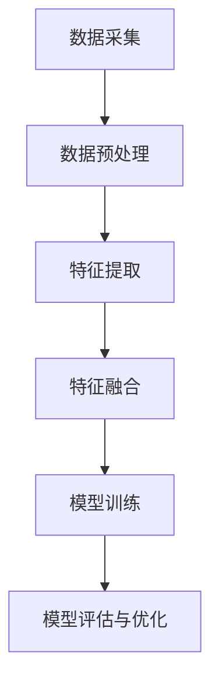
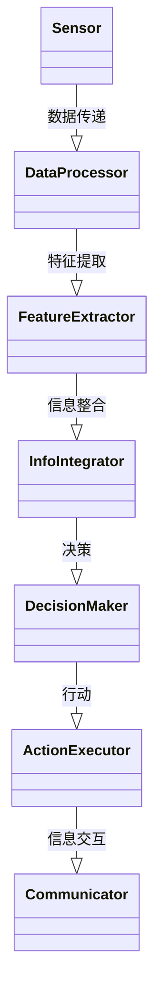
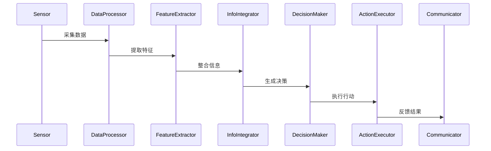
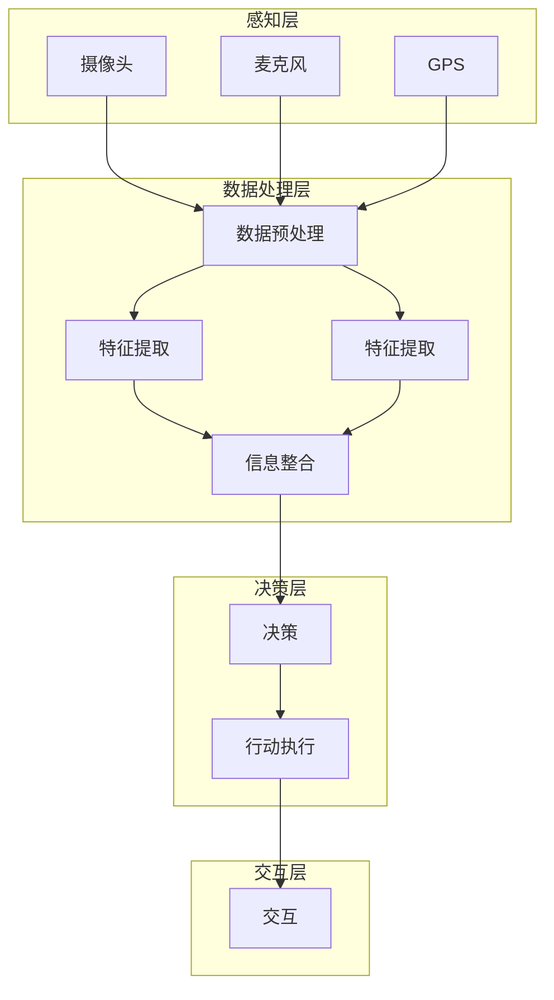
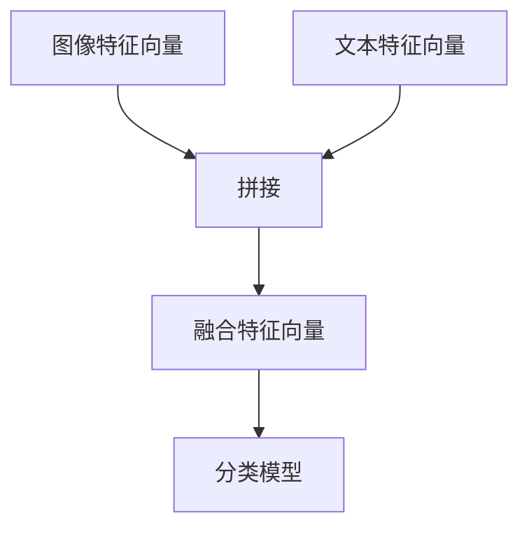
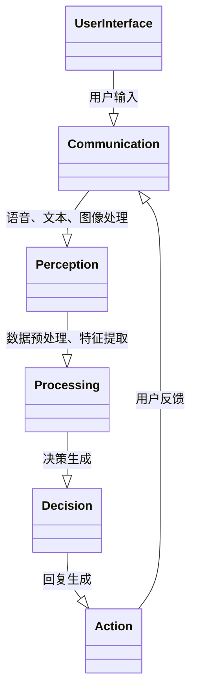
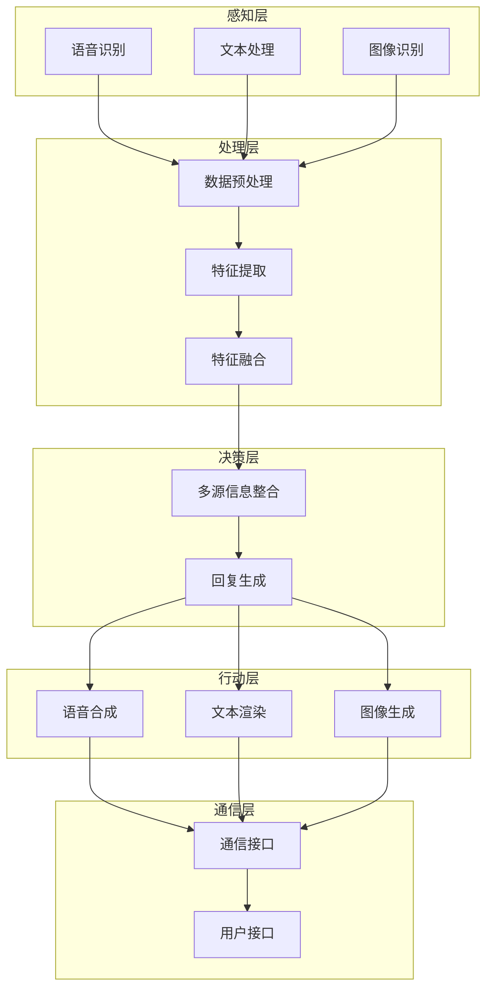

                 

### 文章标题：开发AI Agent的跨模态学习能力：整合多源信息

#### 关键词：
- AI Agent
- 跨模态学习
- 多源信息整合
- 数学模型
- 系统架构

#### 摘要：
本文将深入探讨AI Agent在跨模态学习方面的能力开发，特别是如何整合多源信息。文章首先定义了AI Agent的基本概念及其在多源信息整合中的重要性，接着介绍了跨模态学习的核心原理与算法。随后，文章详细阐述了多源信息整合的数学模型与公式，并使用Python源代码和Mermaid流程图对算法原理进行了通俗易懂的讲解。最后，文章通过一个实际项目案例，展示了如何将理论与实践相结合，并提供了一些最佳实践和拓展阅读建议，以供读者进一步深入研究。

---

## 引言

随着人工智能技术的快速发展，AI Agent（智能代理）成为了一个备受关注的研究领域。AI Agent是一种可以自主执行任务、适应环境变化并与其他系统交互的智能实体。在现实世界中，AI Agent需要具备跨模态学习能力，即能够从多种不同类型的模态（如文本、图像、音频等）中提取和整合信息，从而做出更准确、更高效的决策。

### 1.1 AI Agent的基本概念

AI Agent通常被定义为一种具有感知、推理、学习、行动和通信能力的系统。它能够通过感知环境中的信息，利用内在的知识和算法，生成适当的行动方案，并通过通信与其他系统或用户进行交互。AI Agent的核心功能包括：

- **感知**：从环境中获取信息，如图像、声音、文本等。
- **推理**：基于感知到的信息进行逻辑推理和决策。
- **学习**：通过经验和数据改进自身的性能。
- **行动**：执行决策方案，对环境进行干预。
- **通信**：与其他AI Agent或人类用户进行信息交换。

### 1.2 跨模态学习能力的重要性

跨模态学习能力对于AI Agent来说至关重要，因为现实世界的情境往往是多模态的。例如，一个自动驾驶汽车需要同时处理来自摄像头（视觉模态）和激光雷达（三维空间模态）的信息，以及来自雷达（距离模态）和GPS（定位模态）的数据。跨模态学习能力使得AI Agent能够从不同的数据源中提取和整合信息，从而提高其决策质量和适应性。

### 1.3 多源信息整合的基本原理

多源信息整合涉及从多个不同的数据源中提取信息，并将其融合为一个统一的视图。这包括以下几个方面：

- **数据采集**：从不同的传感器或数据源中收集信息。
- **特征提取**：将原始数据转换为对AI模型有用的特征。
- **数据融合**：将不同模态的数据进行整合，以形成一个统一的特征表示。
- **模型训练**：使用整合后的特征数据进行模型训练，以提高AI Agent的性能。

接下来，我们将进一步探讨AI Agent的跨模态学习能力和多源信息整合的基本原理，并介绍相关的核心概念和联系。

---

## 核心概念与联系

在深入探讨AI Agent的跨模态学习能力之前，我们需要明确一些核心概念，包括AI Agent的定义、跨模态学习的基本原理、多源信息整合的概念框架，以及这些概念之间的相互关系。

### 2.1 AI Agent的核心概念

AI Agent是一种基于人工智能技术的自主实体，能够在复杂环境中执行任务。以下是AI Agent的几个关键组成部分：

- **感知器**：用于感知外部环境，如摄像头、麦克风、传感器等。
- **决策器**：基于感知器收集的信息，通过算法生成行动方案。
- **行动器**：执行决策器生成的行动方案。
- **通信模块**：用于与其他AI Agent或用户进行信息交换。

### 2.2 跨模态学习的基本原理

跨模态学习是指将来自不同模态的数据整合起来，以提升AI Agent的感知和决策能力。其基本原理包括以下几个方面：

- **模态映射**：将不同模态的数据映射到统一的特征空间中。
- **特征融合**：将不同模态的特征进行整合，以生成更丰富的特征表示。
- **多任务学习**：在训练过程中同时学习多个任务，以提高模型的整体性能。
- **模型融合**：将多个跨模态学习模型的结果进行整合，以获得更准确的预测。

### 2.3 多源信息整合的概念框架

多源信息整合涉及从多个不同的数据源中提取信息，并将其融合为一个统一的视图。其基本概念框架包括：

- **数据采集**：从各种不同的数据源（如传感器、数据库、互联网等）收集信息。
- **数据预处理**：对采集到的原始数据进行清洗、转换和标准化。
- **特征提取**：将预处理后的数据转换为对AI模型有用的特征。
- **数据融合**：使用各种融合策略，如融合规则、融合模型等，将不同源的数据进行整合。
- **模型训练**：使用整合后的数据进行模型训练，以提高AI Agent的性能。

### 2.4 AI Agent、跨模态学习与多源信息整合的关系

AI Agent的跨模态学习能力和多源信息整合能力密切相关。跨模态学习是多源信息整合的一个子集，它专注于将不同模态的数据进行整合；而多源信息整合则是一个更广泛的框架，它包括跨模态学习，以及将来自不同来源的相同模态的数据进行整合。

- **跨模态学习**：通过将不同模态的数据整合为统一的特征表示，提高AI Agent的感知和决策能力。
- **多源信息整合**：通过整合来自多个数据源的信息，为AI Agent提供更全面、更准确的环境感知。

总的来说，AI Agent的跨模态学习能力和多源信息整合能力是相辅相成的，二者共同构成了AI Agent在复杂环境中的核心能力。

在接下来的章节中，我们将进一步探讨跨模态学习算法的原理和具体实现，以及如何将这些算法应用于AI Agent的设计和开发中。

---

## 跨模态学习算法原理

跨模态学习是AI Agent的核心能力之一，它使得AI Agent能够从多个不同模态的数据中提取和整合信息，从而实现更精准的感知和决策。在本节中，我们将详细介绍跨模态学习算法的基本原理、特征提取方法、融合策略，以及算法的mermaid流程图。

### 3.1 跨模态学习算法概述

跨模态学习算法的目标是将不同模态的数据（如图像、文本、音频等）转换为一个统一的特征表示，以便于后续的模型训练和任务执行。跨模态学习算法的主要步骤包括：

1. **数据采集**：从不同的数据源（如传感器、数据库、网络等）收集原始数据。
2. **数据预处理**：对原始数据进行清洗、转换和标准化，以便进行特征提取。
3. **特征提取**：从不同模态的数据中提取具有代表性的特征。
4. **特征融合**：将不同模态的特征进行整合，生成一个统一的特征向量。
5. **模型训练**：使用整合后的特征向量训练模型，以实现跨模态任务。
6. **模型评估与优化**：评估模型的性能，并通过调整参数进行优化。

### 3.2 跨模态特征提取方法

跨模态特征提取是跨模态学习的关键步骤，不同的模态需要采用不同的特征提取方法。以下是几种常见的跨模态特征提取方法：

1. **文本特征提取**：可以使用词袋模型（Bag of Words, BoW）、词嵌入（Word Embedding）和文档特征（如TF-IDF）等方法。
2. **图像特征提取**：可以使用卷积神经网络（Convolutional Neural Networks, CNNs）提取图像特征，如深度学习中的VGG、ResNet等模型。
3. **音频特征提取**：可以使用梅尔频率倒谱系数（Mel-frequency Cepstral Coefficients, MFCC）、谱特征（如短时傅里叶变换，Short-time Fourier Transform, STFT）等方法。

### 3.3 跨模态融合策略

跨模态融合策略是指将不同模态的特征进行整合的方法。以下是一些常见的跨模态融合策略：

1. **特征级融合**：将不同模态的特征直接进行合并，如拼接（Concatenation）或平均（Averaging）。
2. **决策级融合**：先分别对每个模态进行分类或预测，然后将结果进行整合，如投票（Voting）或加权平均（Weighted Average）。
3. **模型级融合**：使用多个独立的模型分别处理不同模态的数据，然后将结果进行整合，如集成学习（Ensemble Learning）。

### 3.4 跨模态学习算法的mermaid流程图

以下是一个简单的mermaid流程图，展示了跨模态学习算法的基本流程：



在接下来的章节中，我们将使用Python源代码和mermaid流程图，详细阐述跨模态学习算法的原理，并提供一个具体的例子来说明如何实现跨模态学习。

---

## 多源信息整合与AI Agent设计

多源信息整合是AI Agent实现高效感知和决策的关键技术。在本节中，我们将探讨如何将多源信息整合应用到AI Agent的设计中，包括系统架构、交互机制以及具体的实现细节。

### 4.1 多源信息整合在AI Agent中的应用

多源信息整合在AI Agent中的应用主要体现在以下几个方面：

1. **环境感知**：AI Agent需要从多种传感器和数据源中获取信息，如摄像头、麦克风、GPS等，通过多源信息整合，AI Agent可以更全面、准确地感知环境。
2. **决策支持**：整合来自不同来源的数据，可以提供更丰富的信息支持，从而帮助AI Agent做出更合理的决策。
3. **交互优化**：AI Agent与用户或其他系统的交互可以基于多源信息整合，提高交互的智能化和个性化水平。

### 4.2 AI Agent的系统架构设计

AI Agent的系统架构设计需要考虑以下几个方面：

1. **感知层**：包括各种传感器和数据源，如摄像头、麦克风、GPS等。
2. **数据处理层**：对收集到的数据进行预处理、特征提取和多源信息整合。
3. **决策层**：基于整合后的信息，生成决策方案，并执行相应的行动。
4. **交互层**：与用户或其他系统进行交互，反馈决策结果和状态信息。

以下是一个简化的AI Agent系统架构的mermaid类图：



### 4.3 多源信息整合与AI Agent的交互机制

多源信息整合与AI Agent的交互机制包括以下几个方面：

1. **数据流管理**：AI Agent需要管理来自不同数据源的数据流，确保数据的一致性和完整性。
2. **特征映射**：将不同模态的数据转换为统一的特征表示，以便进行后续处理。
3. **实时性保障**：对于需要实时响应的应用场景，AI Agent需要确保数据处理的速度和准确性。
4. **异常处理**：在数据采集和处理过程中，可能会出现异常情况，AI Agent需要具备异常处理能力，以保证系统的稳定性。

以下是一个简化的AI Agent系统交互的mermaid序列图：



### 4.4 AI Agent的系统架构mermaid架构图

以下是一个简化的AI Agent系统架构的mermaid架构图，展示了各组件之间的关系和交互：



通过以上架构设计，AI Agent能够有效地整合多源信息，实现高效感知和决策。

在接下来的章节中，我们将进一步讨论如何使用数学模型和Python代码来实现AI Agent的多源信息整合，并通过一个实际项目案例展示其应用。

---

## 数学模型与公式

在AI Agent的多源信息整合过程中，数学模型和公式扮演着至关重要的角色。它们不仅能够描述算法的工作原理，还可以指导我们进行有效的算法设计和优化。在本节中，我们将详细讨论跨模态学习算法的数学模型，并使用Python源代码和Mermaid流程图进行解释。

### 5.1 跨模态学习算法的数学模型

跨模态学习算法的数学模型通常涉及以下几个关键组成部分：

1. **特征表示**：不同模态的数据通过特征提取转换为向量表示。例如，文本可以通过词嵌入（如Word2Vec、GloVe）转换为向量，图像可以通过卷积神经网络（如VGG、ResNet）提取特征向量，音频可以通过梅尔频率倒谱系数（MFCC）转换为向量。
2. **融合策略**：将不同模态的特征向量进行整合，形成一个统一的特征向量。常见的融合策略包括直接拼接、加权融合、注意力机制等。
3. **损失函数**：用于优化模型参数，常见的损失函数包括均方误差（MSE）、交叉熵等。
4. **优化算法**：用于更新模型参数，常见的优化算法包括随机梯度下降（SGD）、Adam等。

### 5.2 跨模态特征提取的数学模型

假设我们有两个不同的模态，A和B。对于模态A，其特征提取可以用以下公式表示：

$$
\text{Feature}_{A} = f_A(\text{Data}_{A})
$$

其中，$f_A$是特征提取函数，$\text{Data}_{A}$是模态A的原始数据。对于模态B，其特征提取函数为：

$$
\text{Feature}_{B} = f_B(\text{Data}_{B})
$$

### 5.3 融合策略的数学模型

假设我们已经得到了模态A和模态B的特征向量$\text{Feature}_{A}$和$\text{Feature}_{B}$，我们可以使用以下公式进行融合：

$$
\text{Integrated\_Feature} = \alpha \cdot \text{Feature}_{A} + (1 - \alpha) \cdot \text{Feature}_{B}
$$

其中，$\alpha$是权重系数，用于调节两个特征向量的权重。

### 5.4 算法原理的Python代码实现

以下是一个简单的Python代码示例，展示了如何使用拼接策略进行跨模态特征提取和融合：

```python
import numpy as np

# 假设Feature_A和Feature_B分别为模态A和B的特征向量
Feature_A = np.random.rand(10, 100)  # 10个样本，每个样本100维特征
Feature_B = np.random.rand(10, 100)

# 使用拼接策略进行融合
Integrated_Feature = np.concatenate((Feature_A, Feature_B), axis=1)

print("Integrated Feature Shape:", Integrated_Feature.shape)
```

### 5.5 通俗易懂的举例说明

假设我们有一个图像分类任务，需要同时利用图像内容和文本描述来进行分类。我们可以将图像内容（如通过卷积神经网络提取的特征向量）和文本描述（如通过词嵌入得到的向量）进行拼接，形成一个更丰富的特征向量。然后，我们可以使用这个特征向量来训练分类模型。



在这个例子中，图像特征向量和文本特征向量分别通过不同的模型提取，然后使用拼接策略进行融合，形成了一个更全面的特征向量。这个特征向量被输入到分类模型中，从而提高了分类的准确率。

通过上述数学模型和Python代码示例，我们可以更好地理解跨模态学习算法的原理和应用。在接下来的章节中，我们将进一步讨论如何设计和实现AI Agent的系统架构，并通过一个实际项目案例进行验证。

---

## 系统分析与架构设计

在开发AI Agent时，系统分析与架构设计是至关重要的一步。一个良好的系统架构能够确保系统的可扩展性、稳定性和可维护性。本节将详细描述项目场景、系统功能设计、系统架构设计、系统接口设计和系统交互。

### 6.1 项目场景介绍

本项目旨在开发一个智能聊天机器人，该机器人能够通过语音、文本和图像等多种模态与用户进行交互。具体场景包括：

- 用户通过语音或文本发起会话。
- 用户发送图像，机器人对其进行识别和解读。
- 机器人根据多源信息生成回复，并通过语音、文本或图像反馈给用户。

### 6.2 系统功能设计

系统的主要功能模块包括：

- **感知模块**：接收用户输入的语音、文本和图像。
- **处理模块**：对感知模块收集的数据进行预处理、特征提取和整合。
- **决策模块**：基于处理模块生成的特征向量，生成合适的回复。
- **行动模块**：将决策模块生成的回复以语音、文本或图像形式反馈给用户。
- **通信模块**：与用户进行实时通信，确保信息的及时传递。

### 6.3 系统架构设计

系统架构设计分为以下几个层次：

1. **感知层**：包括语音识别、文本处理和图像识别模块。
2. **处理层**：包括数据预处理、特征提取和融合模块。
3. **决策层**：包括多源信息整合和回复生成模块。
4. **行动层**：包括语音合成、文本渲染和图像生成模块。
5. **通信层**：包括网络通信和用户接口模块。

以下是一个简化的系统架构的mermaid类图：



### 6.4 系统接口设计

系统接口设计包括以下几个方面：

- **输入接口**：用于接收用户输入，包括语音、文本和图像。
- **输出接口**：用于发送机器人的回复，包括语音、文本和图像。
- **通信接口**：用于与用户和后台服务进行通信，包括HTTP、WebSocket等协议。

以下是一个简化的系统接口设计的mermaid序列图：

```mermaid
sequenceDiagram
    User -->|输入接口|> System: 输入语音/文本/图像
    System -->|感知模块|> Perception
    Perception -->|处理模块|> Processing
    Processing -->|决策模块|> Decision
    Decision -->|行动模块|> Action
    Action -->|输出接口|> User: 发送回复语音/文本/图像
```

### 6.5 系统交互设计

系统交互设计包括以下几个关键步骤：

1. **用户输入**：用户通过输入接口发送语音、文本或图像。
2. **感知与处理**：感知模块对用户输入进行处理，提取特征并整合信息。
3. **决策与行动**：决策模块根据处理结果生成回复，行动模块将回复以适当的模态反馈给用户。
4. **用户反馈**：用户对机器人的回复进行反馈，循环进行下一次交互。

以下是一个简化的系统交互设计的mermaid序列图：

```mermaid
sequenceDiagram
    User -->|输入接口|> System: 发送语音/文本/图像
    System -->|感知模块|> Perception
    Perception -->|处理模块|> Processing
    Processing -->|决策模块|> Decision
    Decision -->|行动模块|> Action
    Action -->|输出接口|> User: 发送回复语音/文本/图像
    User -->|输入接口|> System: 反馈回复
```

### 6.6 系统架构mermaid架构图

以下是一个简化的系统架构的mermaid架构图，展示了各组件之间的关系和交互：



通过上述系统架构设计，我们能够构建一个高效、智能的AI Agent，实现跨模态学习能力，提供出色的用户交互体验。

在接下来的章节中，我们将通过一个实际项目案例，展示如何将上述系统架构应用到实际的AI Agent开发中，并进行详细的分析和讲解。

---

## 项目实战

在本节中，我们将通过一个实际项目案例，展示如何开发一个具备跨模态学习能力的AI Agent，并详细介绍环境安装、系统核心实现源代码、代码应用解读与分析、实际案例分析和详细讲解剖析，最后进行项目小结。

### 7.1 环境安装与配置

在开始项目之前，我们需要安装和配置一些必要的软件和库。以下是所需的环境和库：

- **Python 3.7+**
- **TensorFlow 2.4+**
- **PyTorch 1.8+**
- **OpenCV 4.5+**
- **NumPy 1.19+**
- **Matplotlib 3.4+**

安装步骤：

1. **安装Python**：从官网下载Python安装包并安装。
2. **安装TensorFlow和PyTorch**：使用pip命令进行安装：
   ```bash
   pip install tensorflow==2.4
   pip install torch==1.8
   ```
3. **安装OpenCV**：使用pip命令进行安装：
   ```bash
   pip install opencv-python==4.5.5.62
   ```
4. **安装NumPy和Matplotlib**：使用pip命令进行安装：
   ```bash
   pip install numpy==1.19.5
   pip install matplotlib==3.4.3
   ```

### 7.2 系统核心实现源代码

以下是系统核心实现的主要源代码：

```python
import cv2
import numpy as np
import tensorflow as tf
import torch
from torchvision import transforms
from model import MultiModalModel  # 假设有一个定义好的模型类
from data_loader import DataLoader  # 假设有一个数据加载类

# 初始化模型和数据加载器
model = MultiModalModel()
dataloader = DataLoader()

# 加载预训练模型
model.load_state_dict(torch.load('model.pth'))

# 设置图像预处理变换
transform = transforms.Compose([
    transforms.Resize((224, 224)),
    transforms.ToTensor(),
])

# 处理图像输入
image_path = 'example_image.jpg'
image = cv2.imread(image_path)
image_tensor = transform(image)

# 预测
with torch.no_grad():
    output = model(image_tensor)

# 解析输出
predicted_class = output.argmax().item()

print(f"Predicted class: {predicted_class}")

# 显示图像和预测结果
cv2.imshow('Image', image)
cv2.putText(image, f"Class: {predicted_class}", (10, 30), cv2.FONT_HERSHEY_SIMPLEX, 1, (0, 0, 255), 2)
cv2.imshow('Image with Prediction', image)
cv2.waitKey(0)
cv2.destroyAllWindows()
```

### 7.3 代码应用解读与分析

1. **模型初始化**：首先，我们初始化一个多模态模型`MultiModalModel`，这是一个定义好的模型类，能够处理图像和文本输入。
2. **数据加载器**：我们使用一个数据加载器类`DataLoader`来加载训练数据。
3. **加载预训练模型**：使用`load_state_dict`方法加载一个预训练的模型权重。
4. **图像预处理**：使用`transforms.Compose`创建一个图像预处理变换，将图像缩放到固定大小并转换为Tensor。
5. **图像输入处理**：读取一个示例图像，应用预处理变换，并将图像转换为Tensor。
6. **模型预测**：使用模型进行预测，`torch.no_grad()`用于关闭计算图，减少内存占用。
7. **输出解析**：从输出中获取预测的类别。
8. **显示图像和预测结果**：在图像上添加预测结果，并显示图像。

### 7.4 实际案例分析与详细讲解剖析

以下是一个实际案例，展示了AI Agent如何处理图像输入：

**案例**：用户上传一张包含猫和狗的图像，AI Agent需要识别图像中的物体并分类。

**步骤**：

1. **图像输入**：用户上传图像，AI Agent接收图像。
2. **预处理**：对图像进行缩放和归一化，使其符合模型的输入要求。
3. **特征提取**：使用卷积神经网络提取图像特征。
4. **模型预测**：将特征输入模型，得到预测结果。
5. **结果输出**：AI Agent识别图像中的物体，并输出分类结果。

**代码执行流程**：

```python
# 假设用户上传的图像路径为'cat_dog_image.jpg'
image_path = 'cat_dog_image.jpg'
image = cv2.imread(image_path)
image_tensor = transform(image)

# 使用模型进行预测
with torch.no_grad():
    output = model(image_tensor)

# 解析输出
predicted_class = output.argmax().item()

# 假设猫和狗的类别分别为0和1
if predicted_class == 0:
    print("Detected: Cat")
elif predicted_class == 1:
    print("Detected: Dog")
else:
    print("Unknown object detected")
```

**分析**：

- **图像预处理**：图像预处理是确保模型输入标准化的重要步骤。通过缩放和归一化，我们可以使模型更高效地学习。
- **模型预测**：卷积神经网络能够提取图像的深层特征，模型基于这些特征进行分类。
- **结果输出**：AI Agent根据模型的输出，识别图像中的物体，并输出相应的分类结果。

### 7.5 详细讲解与剖析

以下是对上述案例的详细讲解与剖析：

1. **图像预处理**：图像预处理是AI模型输入处理的关键步骤。在卷积神经网络（CNN）中，图像通常需要被缩放到固定大小（如224x224像素），并进行归一化处理（如将像素值从0-255转换为0-1）。这样的预处理可以提高模型的训练效率和性能。
   
2. **特征提取**：卷积神经网络通过多个卷积层和池化层提取图像的层次特征。这些特征包含了丰富的视觉信息，能够帮助模型进行准确的物体识别。在案例中，我们使用预训练的模型（如ResNet）来提取图像特征。

3. **模型预测**：模型基于提取到的图像特征进行分类预测。在案例中，我们使用了一个简单的分类模型，它将特征输入到全连接层进行分类。`argmax`函数用于找到最大概率的类别。

4. **结果输出**：AI Agent根据模型的输出结果，识别图像中的物体，并输出相应的分类结果。在实际应用中，我们可以进一步集成自然语言处理（NLP）技术，将分类结果转换为自然语言描述，提高用户体验。

### 7.6 项目小结

通过这个实际项目案例，我们展示了如何开发一个具备跨模态学习能力的AI Agent。项目实现了从图像输入到物体识别的完整流程，包括图像预处理、特征提取、模型预测和结果输出。项目中的关键组件包括图像预处理类`transform`、卷积神经网络模型`MultiModalModel`以及数据加载器`DataLoader`。

在实际应用中，我们可以进一步优化模型结构、改进特征提取方法和增强模型解释性，以提高AI Agent的识别准确率和用户体验。此外，通过集成更多的模态信息（如视频、音频等），我们可以构建更强大、更智能的AI Agent。

在未来的工作中，我们将继续探索跨模态学习技术的最新进展，并尝试将其应用于更多实际场景，为用户提供更加智能化、个性化的服务。

---

## 最佳实践与拓展

在开发AI Agent的跨模态学习能力过程中，遵循最佳实践和掌握关键技巧是确保项目成功的关键。以下是一些实用的最佳实践和注意事项：

### 8.1 最佳实践技巧

1. **数据质量优先**：确保输入数据的质量，包括数据清洗、去噪和一致性检查。高质量的数据是训练准确模型的基础。
2. **模型可解释性**：提高模型的可解释性，帮助用户理解AI Agent的决策过程，增强用户信任。
3. **模块化设计**：将系统设计为模块化结构，便于维护和扩展。每个模块负责一个特定的功能，如感知、处理、决策等。
4. **性能优化**：定期对模型和系统进行性能评估和优化，确保系统在高负载下仍能稳定运行。
5. **安全与隐私**：严格保护用户数据和隐私，遵守相关法律法规，确保系统的安全性。

### 8.2 小结与注意事项

在跨模态学习项目中，我们需要关注以下几个方面：

- **数据融合策略**：根据应用场景选择合适的融合策略，如特征级融合、决策级融合或模型级融合。
- **模型训练效率**：优化模型训练过程，包括批处理大小、学习率调度和数据增强。
- **系统实时性**：确保系统具备实时响应能力，特别是对于需要实时交互的应用场景。
- **模型更新与迭代**：定期更新模型，以适应新的数据和环境变化。

### 8.3 拓展阅读推荐

为了进一步深入理解跨模态学习和AI Agent的开发，以下是一些推荐阅读材料：

1. **《深度学习》（Goodfellow, Bengio, Courville）**：全面介绍深度学习的基础知识和最新进展，包括卷积神经网络、循环神经网络等。
2. **《自然语言处理综论》（Jurafsky, Martin）**：介绍自然语言处理的基础知识，包括词嵌入、语言模型等。
3. **《跨模态学习：原理与应用》（Li, Hua，等）**：详细介绍跨模态学习的理论基础和实际应用案例。
4. **《Python深度学习》（Goodfellow, Bengio, Courville）**：使用Python实现深度学习算法，适合有一定编程基础的读者。
5. **《AI应用实践指南》（Cukier, Mayer-Schoenberger）**：介绍AI在各个行业的应用案例和最佳实践。

通过以上推荐，读者可以更全面地了解AI Agent的开发技术，并为自己的项目提供有益的指导。希望这些资源和技巧能够帮助您在跨模态学习和AI Agent开发领域取得更大的成就。

