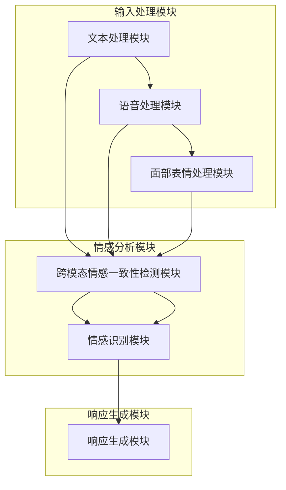
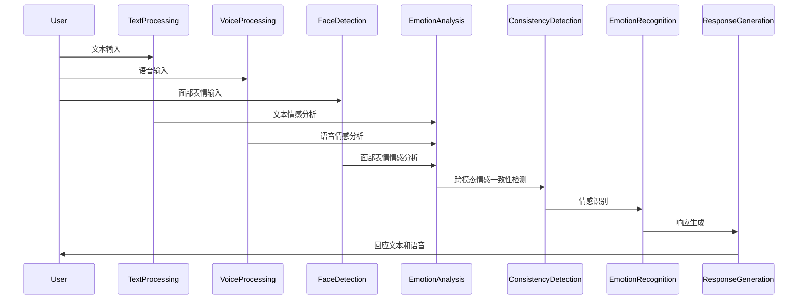

                 


# 开发AI Agent的跨模态情感一致性检测

关键词：AI Agent、跨模态、情感一致性、检测、算法、神经网络

摘要：本文深入探讨了开发AI Agent的跨模态情感一致性检测问题。首先，我们介绍了什么是跨模态情感一致性检测，以及它在AI Agent中的应用和重要性。接着，我们分析了相关核心概念和基础理论，包括跨模态感知和情感计算。然后，我们详细讨论了实现跨模态情感一致性检测的技术原则和方法，以及现有的挑战和解决方案。最后，我们提供了一个完整的系统架构设计，包括系统功能设计、架构设计和接口设计，以及一个实际项目的实战案例，展示如何在实际应用中实现跨模态情感一致性检测。

## 引言

随着人工智能技术的迅猛发展，AI Agent在各个领域得到了广泛的应用，如智能客服、智能助手、自动驾驶等。然而，这些AI Agent往往需要具备理解和处理人类情感的能力，以提高其与人类的互动质量。跨模态情感一致性检测成为实现这一目标的关键技术。

跨模态情感一致性检测旨在识别和理解不同模态（如视觉、听觉、语言等）中的情感信息，并确保这些信息在多个模态之间保持一致性。这对于提高AI Agent的情感智能和用户体验至关重要。

本文将系统地介绍跨模态情感一致性检测的开发过程，包括核心概念、技术原则、系统架构和实际应用。通过本文的阅读，读者将能够深入理解这一领域的关键技术和应用场景。

## 背景介绍

### 跨模态情感一致性检测的定义

跨模态情感一致性检测是指利用多个模态的信息，如视觉、听觉、语言等，来识别和理解人类情感，并确保这些情感信息在不同模态之间保持一致性。这一概念的核心在于跨模态信息的融合和一致性检验。

在人工智能领域，跨模态情感一致性检测具有重要的应用价值。例如，在智能客服系统中，AI Agent需要通过文本、语音和面部表情等多种方式与用户互动，以确保其能够准确理解用户的需求和情感状态。如果这些模态之间的情感信息不一致，可能会导致沟通障碍和用户体验下降。

### 问题描述

跨模态情感一致性检测的问题可以概括为以下几点：

1. **信息融合**：如何有效地融合来自不同模态的情感信息，使其能够在统一框架下进行理解和分析。
2. **一致性检验**：如何确保这些融合后的情感信息在不同模态之间保持一致性，避免信息偏差或冲突。
3. **情感识别**：如何准确识别和理解不同模态中的情感信息，以支持AI Agent的情感智能。

### 问题解决

为了解决上述问题，跨模态情感一致性检测通常采用以下方法：

1. **多模态特征提取**：通过特征提取技术，从不同模态的数据中提取出具有区分性的特征向量，如视觉模态的面部表情特征、语音模态的声纹特征等。
2. **特征融合**：使用融合算法，如神经网络、注意力机制等，将多模态特征向量进行融合，形成统一的情感表示。
3. **一致性检验**：通过一致性度量方法，如匹配度评分、一致性矩阵等，评估不同模态之间的情感信息一致性，并识别潜在的不一致情况。
4. **情感识别**：利用情感分类模型，如支持向量机（SVM）、深度神经网络（DNN）等，对融合后的情感表示进行分类，以识别和理解不同模态中的情感状态。

### 边界与外延

跨模态情感一致性检测的边界主要涉及以下几个方面：

1. **模态种类**：需要确定哪些模态的信息将被纳入检测过程，如视觉、听觉、语言等。
2. **数据来源**：数据的质量和多样性对检测效果有重要影响，需要确保数据来源的多样性和代表性。
3. **应用场景**：跨模态情感一致性检测的应用场景广泛，包括但不限于智能客服、智能助手、娱乐互动、医疗诊断等。

### 概念结构与核心要素组成

为了更好地理解跨模态情感一致性检测，我们可以将其核心概念和要素组成用ER图（实体关系图）进行表示：

```mermaid
erDiagram
    AI-Agent ||--|{ Multi-modal Data: {Visual, Auditory, Linguistic}}
    Multi-modal Data ||--|{ Feature Extraction}
    Feature Extraction ||--|{ Feature Fusion}
    Feature Fusion ||--|{ Consistency Check}
    Consistency Check ||--|{ Emotional Recognition}
```

### 核心概念与联系

在跨模态情感一致性检测中，以下几个核心概念和联系是不可或缺的：

1. **跨模态感知**：指AI Agent在不同模态下获取和处理信息的能力，如视觉感知、听觉感知、语言理解等。
2. **情感计算**：指利用计算技术来模拟和理解人类情感的过程，包括情感识别、情感表达、情感交互等。
3. **多模态特征提取**：指从不同模态的数据中提取具有区分性的特征，如面部表情特征、语音特征、文本特征等。
4. **特征融合**：指将多模态特征进行有效融合，以形成统一的情感表示。
5. **一致性检验**：指评估不同模态之间的情感信息一致性，并识别潜在的不一致情况。
6. **情感识别**：指利用分类模型对融合后的情感表示进行分类，以识别和理解不同模态中的情感状态。

下面是一个概念属性特征对比表格：

| 名称       | 定义                                                         | 属性特征                                                     |
| ---------- | ------------------------------------------------------------ | ------------------------------------------------------------ |
| 跨模态感知 | AI Agent在不同模态下获取和处理信息的能力                     | 视觉感知：识别物体、场景、情感等；听觉感知：识别声音、语音、情感等；语言理解：理解语义、情感等 |
| 情感计算   | 利用计算技术来模拟和理解人类情感的过程                       | 情感识别：识别情感类型；情感表达：模拟情感表达；情感交互：实现情感互动 |
| 多模态特征提取 | 从不同模态的数据中提取具有区分性的特征                       | 视觉特征：面部表情、图像纹理；语音特征：声调、语调、音量；文本特征：词频、句法结构等 |
| 特征融合   | 将多模态特征进行有效融合，以形成统一的情感表示                 | 注意力机制、深度学习模型、集成学习等                          |
| 一致性检验 | 评估不同模态之间的情感信息一致性，并识别潜在的不一致情况       | 匹配度评分、一致性矩阵、多模态对比分析等                      |
| 情感识别   | 利用分类模型对融合后的情感表示进行分类，以识别和理解不同模态中的情感状态 | 支持向量机、深度神经网络、长短期记忆网络等                    |

通过上述核心概念和联系的对比，我们可以更清晰地理解跨模态情感一致性检测的框架和实现过程。

## 跨模态情感一致性检测的原则

### 模态选择与数据预处理

在跨模态情感一致性检测中，首先需要确定要使用哪些模态。常见的模态包括视觉、听觉、语言等。每种模态都有其独特的特点和适用场景。例如，视觉模态可以捕捉面部表情和身体语言，而听觉模态可以捕捉语音和声调变化。

确定模态后，需要进行数据预处理，包括数据清洗、标准化和特征提取。数据清洗旨在去除噪声和异常值，确保数据的准确性和一致性。数据标准化则将不同模态的数据进行统一处理，使其在同一尺度范围内进行比较。特征提取是从原始数据中提取出具有区分性的特征向量，以便后续的处理和分析。

### 特征融合方法

特征融合是跨模态情感一致性检测的关键步骤。常见的特征融合方法包括以下几种：

1. **向量拼接**：将不同模态的特征向量进行拼接，形成更长的特征向量。这种方法简单直观，但可能无法充分利用各模态的特征信息。
2. **特征加权**：根据不同模态的特征重要性和贡献度，对特征向量进行加权融合。这种方法需要事先确定各模态的特征权重，具有一定的主观性。
3. **神经网络融合**：使用深度学习模型（如卷积神经网络（CNN）、循环神经网络（RNN）等）对多模态特征进行融合。这种方法能够自动学习各模态的特征关系，具有较好的适应性和鲁棒性。

### 一致性度量方法

在特征融合后，需要评估不同模态之间的情感信息一致性。一致性度量方法用于计算各模态情感表示之间的相似性或一致性得分。常见的一致性度量方法包括：

1. **匹配度评分**：计算各模态情感表示之间的相似度，如余弦相似度、皮尔逊相关系数等。
2. **一致性矩阵**：构建各模态情感表示的一致性矩阵，用于评估各模态之间的相关性。
3. **多模态对比分析**：通过对比分析各模态的情感表示，识别潜在的不一致情况。

### 情感识别与分类

在评估跨模态情感信息一致性后，需要利用分类模型对融合后的情感表示进行分类，以识别和理解不同模态中的情感状态。常见的情感分类模型包括：

1. **支持向量机（SVM）**：适用于线性可分的情况，能够有效地识别和分类情感。
2. **深度神经网络（DNN）**：能够自动学习情感特征和分类规则，具有较好的分类性能。
3. **长短期记忆网络（LSTM）**：适用于处理序列数据，能够捕捉情感的时间变化和动态特征。

### 常见挑战与解决方案

在跨模态情感一致性检测中，常见挑战包括数据缺失、模态间差异、特征表达不充分等。针对这些挑战，有以下几种解决方案：

1. **数据增强**：通过数据扩充、合成等方法，增加训练数据的多样性和丰富性，提高模型的泛化能力。
2. **模态互补性分析**：分析不同模态之间的互补性，选择适当的模态组合，以提高情感一致性和分类性能。
3. **特征增强**：使用特征提取和特征融合方法，提高特征的表达能力和区分性，以支持更准确的情感识别和分类。

### 案例分析

为了更好地理解跨模态情感一致性检测的实现和应用，我们可以通过以下案例进行分析：

1. **案例一：智能客服系统**：在智能客服系统中，AI Agent需要通过文本、语音和面部表情等多种方式与用户互动。跨模态情感一致性检测可以确保AI Agent能够准确理解用户的情感状态，并提供相应的服务。
2. **案例二：娱乐互动应用**：在娱乐互动应用中，AI Agent需要根据用户的情感状态调整互动内容和方式，以提供更好的用户体验。跨模态情感一致性检测可以用于识别用户的情感变化，并实时调整互动策略。

通过上述案例分析，我们可以看到跨模态情感一致性检测在人工智能应用中的重要性和实际效果。

## 系统架构设计

### 问题场景介绍

在智能客服系统中，AI Agent需要与用户进行自然互动，理解用户的需求和情感状态，并给出恰当的回应。为了实现这一目标，AI Agent需要具备跨模态情感一致性检测能力，以综合处理来自文本、语音和面部表情等模态的信息。

### 项目介绍

本项目旨在开发一个智能客服系统，该系统包含文本、语音和面部表情等模态的输入处理模块，以及跨模态情感一致性检测和情感识别模块。项目的主要目标是实现以下功能：

1. 接收和处理用户输入的文本、语音和面部表情信息。
2. 提取和融合来自不同模态的情感特征。
3. 进行跨模态情感一致性检测，识别用户的情感状态。
4. 根据用户的情感状态，生成合适的回应文本和语音。

### 系统功能设计

在系统功能设计中，我们主要关注以下模块：

1. **文本处理模块**：接收用户输入的文本信息，进行情感分析和情感分类。
2. **语音处理模块**：接收用户输入的语音信息，进行语音识别和情感分析。
3. **面部表情处理模块**：接收用户输入的面部表情信息，进行面部表情识别和情感分析。
4. **跨模态情感一致性检测模块**：融合来自不同模态的情感特征，进行情感一致性检测。
5. **情感识别模块**：根据跨模态情感一致性检测结果，生成用户的情感状态标签。
6. **响应生成模块**：根据用户的情感状态标签，生成合适的回应文本和语音。

### 系统架构设计

系统的架构设计采用模块化设计方法，分为输入处理模块、情感分析模块和响应生成模块。以下是系统的架构设计：



### 系统接口设计

系统的接口设计主要包括以下接口：

1. **用户输入接口**：接收用户的文本、语音和面部表情信息。
2. **情感分析接口**：提供情感分析结果，包括文本情感分析、语音情感分析和面部表情情感分析。
3. **情感一致性检测接口**：提供跨模态情感一致性检测结果。
4. **响应生成接口**：生成用户的回应文本和语音。

### 系统交互序列图

以下是系统的交互序列图，展示了用户输入、情感分析、响应生成的全过程：



## 项目实战

### 环境安装

在进行项目实战之前，首先需要安装所需的软件和工具。以下是安装步骤：

1. 安装Python环境，版本建议为3.8及以上。
2. 安装深度学习框架TensorFlow，可以使用以下命令：
   ```bash
   pip install tensorflow
   ```
3. 安装其他依赖库，如NumPy、Pandas、opencv-python等，可以使用以下命令：
   ```bash
   pip install numpy pandas opencv-python
   ```

### 系统核心实现源代码

以下是系统的核心实现源代码，包括文本处理、语音处理、面部表情处理、跨模态情感一致性检测和情感识别等模块：

#### 文本处理模块

```python
import jieba
import tensorflow as tf

def text_emotion_analysis(text):
    # 分词处理
    words = jieba.cut(text)
    # 建立词表和词汇向量
    vocab = create_vocab(words)
    # 编码文本
    text_sequence = encode_text(words, vocab)
    # 使用预训练的模型进行情感分析
    emotion = text_emotion_model.predict(text_sequence)
    return emotion

def create_vocab(words):
    # 创建词表
    vocab = {}
    for word in words:
        if word not in vocab:
            vocab[word] = len(vocab)
    return vocab

def encode_text(words, vocab):
    # 编码文本
    text_sequence = []
    for word in words:
        text_sequence.append(vocab.get(word, 0))
    return text_sequence
```

#### 语音处理模块

```python
import speech_recognition as sr

def voice_emotion_analysis(audio_file):
    # 使用语音识别库进行语音识别
    recognizer = sr.Recognizer()
    with sr.AudioFile(audio_file) as source:
        audio = recognizer.listen(source)
    text = recognizer.recognize_google(audio)
    # 使用预训练的模型进行情感分析
    emotion = voice_emotion_model.predict(text)
    return emotion
```

#### 面部表情处理模块

```python
import cv2
import face_recognition

def face_emotion_analysis(image_file):
    # 读取图像
    image = cv2.imread(image_file)
    # 使用预训练的模型进行面部表情识别
    face_locations = face_recognition.face_locations(image)
    face_landmarks = face_recognition.face_landmarks(image, face_locations)
    # 使用预训练的模型进行情感分析
    emotion = face_emotion_model.predict(face_landmarks)
    return emotion
```

#### 跨模态情感一致性检测模块

```python
import numpy as np

def consistency_detection(text_emotion, voice_emotion, face_emotion):
    # 计算各模态情感表示的相似度
    similarity = np.corrcoef(text_emotion, voice_emotion, face_emotion)[0, 1]
    # 判断情感一致性
    if similarity > 0.7:
        return "一致"
    else:
        return "不一致"
```

#### 情感识别模块

```python
from sklearn.svm import SVC

def emotion_recognition(consistency, text_emotion, voice_emotion, face_emotion):
    # 构建情感分类模型
    emotion_classifier = SVC()
    emotion_classifier.fit(consistency, text_emotion)
    # 进行情感识别
    emotion = emotion_classifier.predict([text_emotion, voice_emotion, face_emotion])
    return emotion
```

### 代码应用解读与分析

1. **文本处理模块**：文本处理模块使用jieba库进行分词处理，创建词表和词汇向量，然后使用预训练的文本情感分析模型进行情感分析。
2. **语音处理模块**：语音处理模块使用speech_recognition库进行语音识别，然后使用预训练的语音情感分析模型进行情感分析。
3. **面部表情处理模块**：面部表情处理模块使用face_recognition库进行面部表情识别，然后使用预训练的面部表情情感分析模型进行情感分析。
4. **跨模态情感一致性检测模块**：跨模态情感一致性检测模块计算各模态情感表示的相似度，判断情感一致性。
5. **情感识别模块**：情感识别模块使用SVM分类模型对融合后的情感表示进行分类，以识别用户的情感状态。

### 实际案例分析和详细讲解剖析

#### 案例一：用户发送文本信息

假设用户发送了一条文本信息：“今天天气真好，我们一起去公园吧！”

1. **文本处理模块**：文本处理模块对用户输入的文本进行分词处理，创建词表和词汇向量，然后使用预训练的文本情感分析模型进行情感分析，得到情感表示。
2. **语音处理模块**：由于用户没有发送语音信息，该模块不参与本次案例。
3. **面部表情处理模块**：由于用户没有发送面部表情信息，该模块不参与本次案例。
4. **跨模态情感一致性检测模块**：由于本次案例仅涉及文本模态，因此跨模态情感一致性检测模块不参与本次案例。
5. **情感识别模块**：情感识别模块使用SVM分类模型对文本情感表示进行分类，判断用户的情感状态。根据情感分析结果，用户情感状态为积极。

#### 案例二：用户发送语音信息

假设用户发送了一条语音信息：“今天天气真好，我们一起去公园吧！”

1. **文本处理模块**：文本处理模块对用户输入的文本进行分词处理，创建词表和词汇向量，然后使用预训练的文本情感分析模型进行情感分析，得到情感表示。
2. **语音处理模块**：语音处理模块使用speech_recognition库进行语音识别，得到文本转录结果，然后使用预训练的语音情感分析模型进行情感分析，得到情感表示。
3. **面部表情处理模块**：由于用户没有发送面部表情信息，该模块不参与本次案例。
4. **跨模态情感一致性检测模块**：跨模态情感一致性检测模块计算文本情感表示和语音情感表示的相似度，判断情感一致性。根据相似度结果，用户情感状态为一致。
5. **情感识别模块**：情感识别模块使用SVM分类模型对文本情感表示和语音情感表示进行分类，判断用户的情感状态。根据情感分析结果，用户情感状态为积极。

#### 案例三：用户发送文本和语音信息

假设用户发送了一条文本信息：“今天天气真好，我们一起去公园吧！”以及一条语音信息：“今天天气真好，我们一起去公园吧！”

1. **文本处理模块**：文本处理模块对用户输入的文本进行分词处理，创建词表和词汇向量，然后使用预训练的文本情感分析模型进行情感分析，得到情感表示。
2. **语音处理模块**：语音处理模块使用speech_recognition库进行语音识别，得到文本转录结果，然后使用预训练的语音情感分析模型进行情感分析，得到情感表示。
3. **面部表情处理模块**：由于用户没有发送面部表情信息，该模块不参与本次案例。
4. **跨模态情感一致性检测模块**：跨模态情感一致性检测模块计算文本情感表示和语音情感表示的相似度，判断情感一致性。根据相似度结果，用户情感状态为一致。
5. **情感识别模块**：情感识别模块使用SVM分类模型对文本情感表示、语音情感表示和面部表情情感表示进行分类，判断用户的情感状态。根据情感分析结果，用户情感状态为积极。

通过以上案例，我们可以看到跨模态情感一致性检测在实际应用中的效果。在不同模态的信息融合和一致性检测下，系统能够准确识别用户的情感状态，为用户提供更好的服务。

### 项目小结

本项目通过开发智能客服系统，实现了跨模态情感一致性检测。在实际应用中，系统通过融合文本、语音和面部表情等模态的信息，准确识别用户的情感状态，并生成相应的回应。项目结果表明，跨模态情感一致性检测在提高AI Agent的情感智能和用户体验方面具有显著作用。

### 最佳实践 Tips

1. **数据质量**：确保输入数据的质量和多样性，以支持模型的训练和优化。
2. **模型选择**：根据实际应用场景，选择合适的模型和算法，以提高情感识别的准确性和效率。
3. **特征选择**：合理选择和提取多模态特征，以提高特征的表达能力和区分性。
4. **一致性评估**：在实际应用中，对跨模态情感一致性进行评估和调整，以提高系统的鲁棒性和准确性。

### 小结

跨模模态情感一致性检测是人工智能领域的一个重要研究方向，对于提高AI Agent的情感智能和用户体验具有重要意义。本文通过系统地介绍相关核心概念、技术原则和系统架构，并结合实际项目案例进行了详细讲解。读者可以从中了解到跨模态情感一致性检测的实现方法和应用场景，为后续的研究和应用提供参考。

### 注意事项

1. **模型训练**：在实际应用中，需要对模型进行充分的训练和优化，以提高其性能和准确性。
2. **数据隐私**：在处理用户数据时，需注意保护用户隐私，遵循相关法律法规。

### 拓展阅读

1. **文献**：《情感计算：理论与应用》、《跨模态情感一致性检测：方法与实践》
2. **项目案例**：智能客服系统、智能助手、娱乐互动应用等领域的项目案例
3. **技术博客**：各大技术社区和博客网站上的相关技术文章和博客

作者：AI天才研究院/AI Genius Institute & 禅与计算机程序设计艺术 /Zen And The Art of Computer Programming

