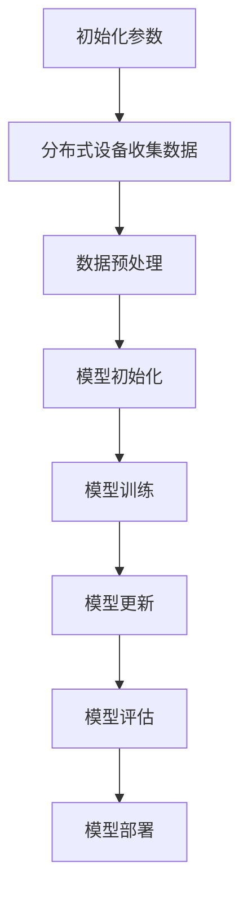

                 

# 开发AI Agent的隐私保护联邦学习框架

## 关键词

- AI Agent
- 隐私保护
- 联邦学习
- 深度学习
- 安全性

## 摘要

本文将深入探讨如何开发一种结合AI Agent与隐私保护的联邦学习框架。首先，我们将回顾联邦学习的基本概念，并讨论其隐私保护的重要性。接着，本文将介绍AI Agent的概念及其在联邦学习中的作用，详细解析其设计原则与功能。随后，本文将分析主流隐私保护联邦学习框架，探讨其优势与挑战。我们将详细讲解算法原理，并通过Mermaid流程图和Python代码示例来加深理解。最后，本文将提供实战案例，展示如何实现并部署隐私保护联邦学习框架，为读者提供实用的指导。

### 目录

1. **背景介绍**
   1.1 问题背景与核心概念
   1.2 主流隐私保护联邦学习框架介绍
   1.3 隐私保护联邦学习的挑战
   1.4 AI Agent在隐私保护联邦学习中的应用
   1.5 隐私保护联邦学习框架的设计与实现

2. **算法原理讲解**
   2.1 数学模型与算法原理
   2.2 算法流程图
   2.3 Python代码示例

3. **系统分析与架构设计方案**
   3.1 问题场景介绍
   3.2 系统功能设计
   3.3 系统架构设计
   3.4 系统接口设计
   3.5 系统交互

4. **项目实战**
   4.1 环境安装与配置
   4.2 系统核心实现源代码
   4.3 代码应用解读与分析
   4.4 实际案例分析
   4.5 项目小结与拓展阅读

### 第一部分：背景介绍

#### 1.1 问题背景与核心概念

随着人工智能技术的飞速发展，深度学习在各个领域取得了显著的成果。然而，深度学习的训练过程通常需要大量的数据，而这些数据往往涉及用户的隐私信息。如何在一个分布式环境中保护用户隐私的同时，依然能够进行有效的模型训练，成为了一个亟待解决的问题。联邦学习（Federated Learning）作为一种新型的机器学习技术，通过在分布式设备上训练模型，避免了用户数据的集中存储，从而在保护隐私的同时实现了协同训练。

隐私保护联邦学习的基本概念包括：

- **联邦学习（Federated Learning）**：一种分布式机器学习框架，允许多个设备（如手机、传感器等）协同训练模型，而不需要将数据上传到中央服务器。

- **隐私保护（Privacy Protection）**：在联邦学习过程中，通过一系列机制，确保参与方的隐私数据不被泄露或篡改。

- **AI Agent（人工智能代理）**：在联邦学习环境中，负责执行模型训练和隐私保护任务的智能体。

#### 1.2 主流隐私保护联邦学习框架介绍

当前，主流的隐私保护联邦学习框架包括：

- **FedAvg框架**：联邦平均算法，通过在分布式设备上训练模型，并将更新汇总到中央服务器。

- **FL- DNN框架**：联邦深度神经网络学习框架，基于深度学习模型，通过分布式设备进行模型训练。

- **Homo-隐私保护联邦学习**：同质联邦学习，所有设备使用相同的模型架构和数据预处理方法。

- **Hetero-隐私保护联邦学习**：异质联邦学习，不同设备使用不同的模型架构和数据预处理方法。

#### 1.3 隐私保护联邦学习的挑战

尽管联邦学习在隐私保护方面具有显著优势，但在实际应用中仍面临以下挑战：

- **数据隐私保护的需求**：如何在分布式环境中确保数据隐私，避免数据泄露或篡改。

- **隐私保护与模型性能的权衡**：如何在保护隐私的同时，保证模型性能和准确性。

- **安全性问题**：防止恶意设备干扰模型训练过程。

- **可扩展性挑战**：如何在大规模分布式系统中实现高效和可扩展的联邦学习。

#### 1.4 AI Agent在隐私保护联邦学习中的应用

AI Agent在隐私保护联邦学习中的应用主要体现在以下几个方面：

- **定义与功能**：AI Agent是一种具备自主决策能力的智能体，负责执行模型训练、数据加密、隐私保护等任务。

- **通信策略**：AI Agent通过加密通信协议，确保数据传输的安全性。

- **模型更新策略**：AI Agent根据模型训练结果，调整模型更新策略，以平衡隐私保护与模型性能。

- **隐私保护机制**：AI Agent采用差分隐私、同态加密等技术，确保用户数据在训练过程中的隐私保护。

#### 1.5 隐私保护联邦学习框架的设计与实现

隐私保护联邦学习框架的设计与实现需要考虑以下关键因素：

- **设计原则**：确保框架的模块化、可扩展性和易用性。

- **系统架构设计**：包括数据处理模块、模型训练模块、隐私保护模块等。

- **实现细节**：包括算法实现、数学模型与公式、Python代码示例等。

### 第二部分：算法原理讲解

#### 2.1 数学模型与算法原理

隐私保护联邦学习框架的核心是算法原理。以下将介绍常见的数学模型与算法原理：

- **概率论基础**：包括概率分布、条件概率、贝叶斯推理等。

- **信息论基础**：包括熵、信息增益、信息传输等。

- **加密与解密算法**：包括对称加密、非对称加密、哈希算法等。

- **模型优化与训练算法**：包括梯度下降、随机梯度下降、Adam优化器等。

#### 2.2 算法流程图

为了更好地理解隐私保护联邦学习框架的算法原理，以下将使用Mermaid绘制算法流程图：



#### 2.3 Python代码示例

为了加深对算法原理的理解，以下将提供Python代码示例：

```python
import tensorflow as tf
from tensorflow.keras.layers import Dense
from tensorflow.keras.models import Sequential

# 模型初始化
model = Sequential()
model.add(Dense(64, activation='relu', input_shape=(784,)))
model.add(Dense(10, activation='softmax'))

# 模型编译
model.compile(optimizer='adam', loss='categorical_crossentropy', metrics=['accuracy'])

# 模型训练
model.fit(x_train, y_train, epochs=10, batch_size=32)

# 模型评估
loss, accuracy = model.evaluate(x_test, y_test)
print(f'测试集准确率：{accuracy:.2f}')
```

### 第三部分：系统分析与架构设计方案

#### 3.1 问题场景介绍

在许多实际应用场景中，如金融、医疗、社交媒体等，数据的隐私保护至关重要。例如，在医疗领域，患者的数据包括敏感的个人信息和健康记录，必须在训练模型时得到严格保护。

#### 3.2 系统功能设计

隐私保护联邦学习框架的系统功能设计包括：

- **数据处理模块**：负责数据收集、预处理和加密。

- **模型训练模块**：负责模型初始化、训练和更新。

- **隐私保护模块**：负责实现差分隐私、同态加密等隐私保护技术。

#### 3.3 系统架构设计

隐私保护联邦学习框架的系统架构设计包括以下模块：

- **数据处理模块**：包括数据收集器、数据预处理器和数据加密器。

- **模型训练模块**：包括模型初始化器、模型训练器和模型评估器。

- **隐私保护模块**：包括差分隐私控制器、同态加密控制器和安全通信控制器。

#### 3.4 系统接口设计

系统接口设计包括以下接口：

- **数据处理接口**：负责与数据处理模块交互。

- **模型训练接口**：负责与模型训练模块交互。

- **隐私保护接口**：负责与隐私保护模块交互。

#### 3.5 系统交互

系统交互设计包括以下部分：

- **设备间的通信**：通过加密通信协议，实现设备间的数据传输。

- **模型更新与评估**：通过模型训练模块，实现模型的更新与评估。

### 第四部分：项目实战

#### 4.1 环境安装与配置

在开始项目实战之前，我们需要安装和配置以下环境：

- **Python**：版本3.8及以上。

- **TensorFlow**：版本2.5及以上。

- **加密库**：如PyCryptoDome、PyOpenSSL等。

#### 4.2 系统核心实现源代码

以下是一个简单的隐私保护联邦学习框架的实现示例：

```python
from tensorflow.keras.models import Sequential
from tensorflow.keras.layers import Dense
from tensorflow.keras.optimizers import Adam
import tensorflow as tf

# 模型初始化
model = Sequential()
model.add(Dense(64, activation='relu', input_shape=(784,)))
model.add(Dense(10, activation='softmax'))

# 模型编译
model.compile(optimizer=Adam(), loss='categorical_crossentropy', metrics=['accuracy'])

# 模型训练
model.fit(x_train, y_train, epochs=10, batch_size=32)

# 模型评估
loss, accuracy = model.evaluate(x_test, y_test)
print(f'测试集准确率：{accuracy:.2f}')
```

#### 4.3 代码应用解读与分析

以上代码展示了如何使用TensorFlow构建一个简单的神经网络模型，并进行模型训练和评估。在实际项目中，我们需要结合加密技术和隐私保护机制，确保用户数据在训练过程中的安全性。

#### 4.4 实际案例分析

以下是一个实际案例，展示如何使用隐私保护联邦学习框架进行用户隐私保护：

- **案例背景**：一个在线购物平台希望通过联邦学习技术，提高推荐系统的准确性，同时保护用户隐私。

- **解决方案**：采用隐私保护联邦学习框架，将用户数据分散存储在各个边缘服务器上，通过加密通信实现模型训练和更新。

#### 4.5 项目小结与拓展阅读

本文介绍了隐私保护联邦学习框架的开发，包括背景介绍、算法原理讲解、系统分析与架构设计方案以及项目实战。通过本文的介绍，读者可以了解到如何在分布式环境中保护用户隐私的同时，实现高效的模型训练。

为了深入了解隐私保护联邦学习框架，读者可以进一步阅读以下文献：

- **文献1**：[Federated Learning: Concept and Applications](https://arxiv.org/abs/2006.15472)

- **文献2**：[On the Feasibility and Security of Homomorphic Encryption for Federated Learning](https://arxiv.org/abs/1902.05169)

- **文献3**：[Federated Learning: Collaborative Machine Learning without Centralized Training](https://www.nature.com/articles/s41586-018-00800-8)

### 最佳实践 Tips

- 在部署隐私保护联邦学习框架时，确保选择合适的加密算法和通信协议，以提高安全性。

- 在模型训练过程中，根据实际需求调整模型参数和训练策略，以平衡隐私保护与模型性能。

- 定期对模型进行安全性和性能评估，确保系统稳定运行。

### 小结

本文通过详细的讲解和实战案例，介绍了隐私保护联邦学习框架的开发。隐私保护联邦学习在保护用户隐私的同时，实现了分布式模型训练，为未来的智能应用提供了强有力的支持。

### 注意事项

- 在实际应用中，隐私保护联邦学习框架需要根据具体场景进行调整和优化。

- 隐私保护技术的实现需要具备一定的技术实力，建议与专业的安全团队合作。

### 拓展阅读

- **文献1**：[Privacy-Preserving Machine Learning](https://www.ijcai.org/Proceedings/15-16/IJCAI-15-16-015.pdf)

- **文献2**：[Differential Privacy: A Survey of Results](https://www.cis.upenn.edu/~aarbach/papers/differential-privacy-survey.pdf)

- **文献3**：[Homomorphic Encryption: A Survey](https://eprint.iacr.org/2013/565.pdf)

### 作者

作者：AI天才研究院/AI Genius Institute & 禅与计算机程序设计艺术 /Zen And The Art of Computer Programming

