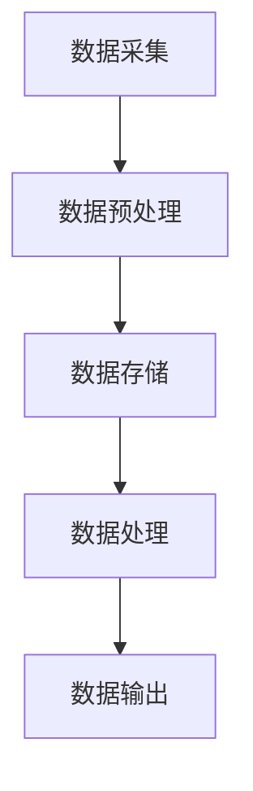
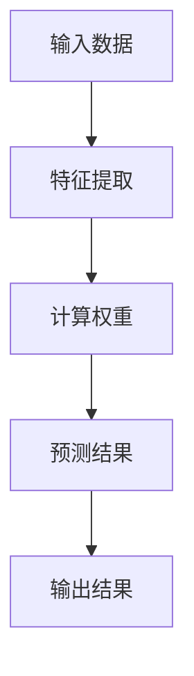
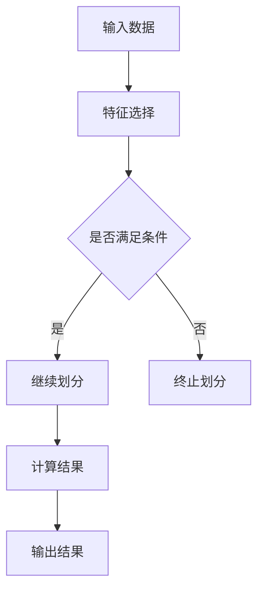
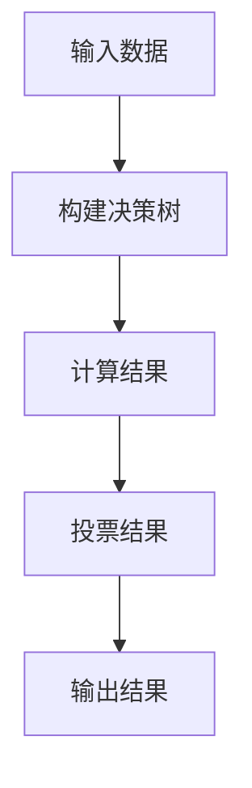
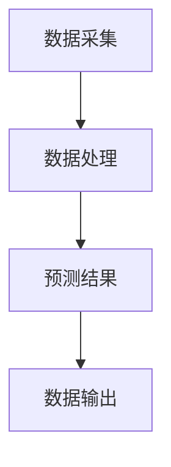
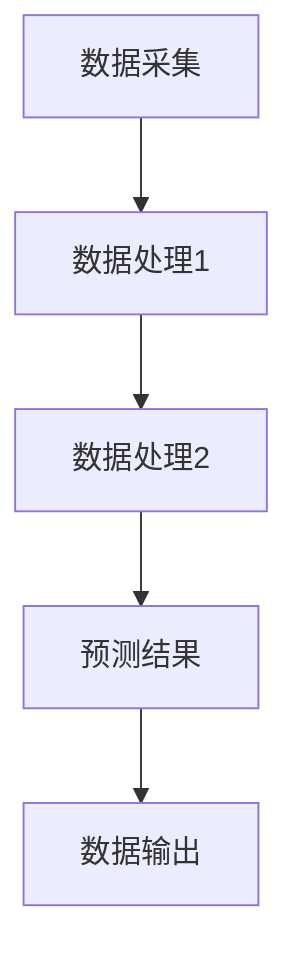
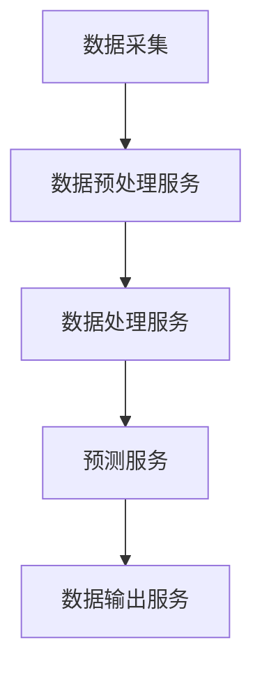
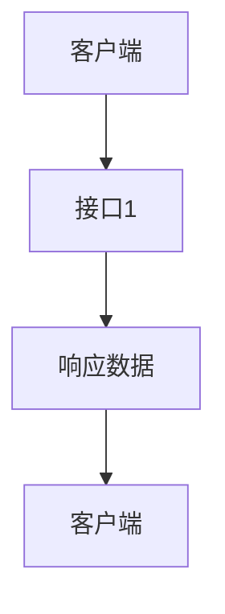
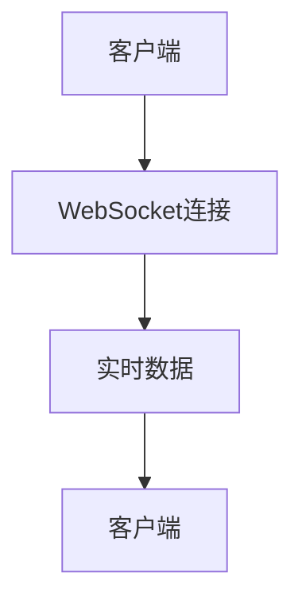
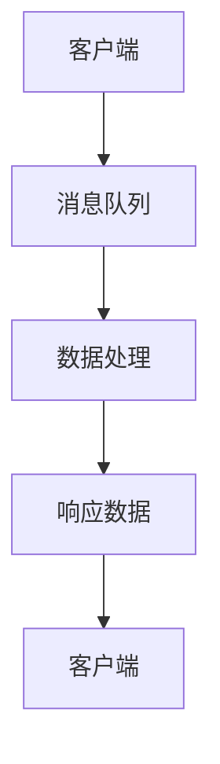

                 

## 引言与背景

### AI与财务战略规划的重要性

随着全球经济的发展和市场竞争的加剧，企业对于财务战略规划的需求日益迫切。传统的财务战略规划方法主要依赖于经验和统计数据，往往缺乏精确性和灵活性，无法应对快速变化的市场环境。因此，企业需要一种新的工具和方法来辅助财务战略规划，以提高决策的准确性和效率。在这个背景下，人工智能（AI）技术的出现为财务战略规划带来了新的机遇。

AI技术具有强大的数据处理和分析能力，能够从大量数据中提取有价值的信息，进行深入的分析和预测。在财务战略规划中，AI可以应用于财务数据的分析、财务风险的预测、投资决策的优化等多个方面，为企业提供科学、准确的决策支持。通过AI辅助财务战略规划，企业可以更好地应对市场变化，降低风险，提高经营效率，从而在激烈的市场竞争中占据优势。

### 人工智能在财务战略规划中的角色

AI在财务战略规划中的角色主要包括数据采集、数据处理、分析和预测等方面。首先，AI可以通过各种传感器和数据源收集企业内部和外部的大量财务数据，如财务报表、市场数据、竞争对手信息等。这些数据为财务战略规划提供了丰富的信息资源。

其次，AI可以利用其强大的数据处理能力对收集到的财务数据进行分析和处理。通过数据清洗、数据集成和数据挖掘等技术，AI可以从海量数据中提取出有用的信息，揭示数据之间的关联性和趋势。这些信息有助于企业更好地了解自身的财务状况，识别潜在的风险和机会。

最后，AI可以基于分析结果进行预测和优化。通过使用机器学习、深度学习等技术，AI可以建立预测模型，对未来财务状况进行预测。同时，AI还可以利用优化算法，为企业提供最优的财务决策方案。例如，在投资决策方面，AI可以根据市场数据和风险预测模型，推荐最优的投资策略，帮助企业在不确定的市场环境中做出明智的决策。

### 本书的研究目标与结构

本书的研究目标是通过深入探讨AI技术在财务战略规划中的应用，为企业提供一套完整的AI辅助财务战略规划工具和方法。具体来说，本书将从以下几个方面展开：

首先，本书将详细介绍AI与财务战略规划的核心概念，包括数据分析、预测分析和决策优化等。通过对这些核心概念的详细讲解，读者可以了解AI技术在财务战略规划中的基本原理和应用方法。

其次，本书将重点介绍AI辅助财务战略规划的关键技术和数学模型，如统计学模型、机器学习模型和深度学习模型等。通过详细讲解这些模型的应用场景和实现方法，读者可以掌握如何在实际项目中应用AI技术进行财务战略规划。

接着，本书将介绍AI辅助财务战略规划的架构设计，包括系统架构设计、数据流设计、算法实现等。通过这些章节，读者可以了解如何设计一个高效、可靠的AI辅助财务战略规划系统。

最后，本书将通过实际案例分析和项目实战，展示如何将AI技术应用于财务战略规划，并提供最佳实践和展望。通过这些内容，读者可以了解AI辅助财务战略规划的实际应用效果，并为未来的研究提供方向。

总的来说，本书旨在为读者提供一套全面、系统的AI辅助财务战略规划知识体系，帮助读者深入了解AI技术在财务战略规划中的应用，掌握相关技术和方法，从而为企业提供有力的决策支持。

### 人工智能概述

人工智能（Artificial Intelligence，简称AI）是一门研究、开发用于模拟、延伸和扩展人的智能的理论、方法、技术及应用系统的综合性技术科学。自20世纪50年代以来，人工智能经历了多个发展阶段，从早期的符号主义人工智能到基于规则的系统，再到基于数据的机器学习和深度学习，人工智能技术逐渐从理论走向实际应用，成为推动社会进步的重要力量。

#### 人工智能的定义与发展历程

人工智能的定义多种多样，但最广泛的定义可以归纳为：通过计算机模拟人类智能行为，实现感知、理解、学习、推理和决策等能力的理论和技术。发展历程可以分为几个主要阶段：

1. **符号主义阶段（1950-1979）**：这一阶段以符号主义（Symbolic AI）为代表，主要研究如何用计算机模拟人类的推理和问题解决能力。代表性工作包括约翰·麦卡锡（John McCarthy）提出的“人工智能”概念和艾尔文·约翰·阿莫斯（Herbert A. Simon）等人的研究。

2. **知识工程阶段（1980-1987）**：随着专家系统的出现，知识工程成为人工智能研究的重要方向。专家系统通过知识库和推理机模拟人类专家的决策过程，应用于医疗诊断、金融咨询等领域。

3. **机器学习阶段（1988-2012）**：随着计算能力和数据资源的提升，机器学习（Machine Learning）逐渐成为人工智能研究的主流。机器学习通过算法从数据中学习规律，进行模式识别和预测，如决策树、支持向量机、神经网络等。

4. **深度学习阶段（2013至今）**：深度学习（Deep Learning）作为机器学习的一个分支，通过多层神经网络模拟人类大脑的学习过程，实现了在图像识别、语音识别、自然语言处理等领域的重大突破。代表性工作包括谷歌的AlphaGo和OpenAI的GPT系列模型。

#### 人工智能的核心技术

人工智能的核心技术包括机器学习、深度学习、自然语言处理、计算机视觉等。以下分别进行简要介绍：

1. **机器学习（Machine Learning）**：机器学习是一种通过算法从数据中学习规律的方法，其核心是构建模型并优化模型参数。常见的机器学习方法有监督学习、无监督学习和强化学习。

2. **深度学习（Deep Learning）**：深度学习是机器学习的一个分支，通过多层神经网络模拟人类大脑的学习过程。其核心在于通过反向传播算法不断调整网络参数，以达到优化模型的目的。深度学习在图像识别、语音识别和自然语言处理等领域取得了显著成果。

3. **自然语言处理（Natural Language Processing，NLP）**：自然语言处理是研究如何让计算机理解和处理人类自然语言的技术。NLP包括语言识别、文本分析、语义理解和语言生成等任务。

4. **计算机视觉（Computer Vision）**：计算机视觉是使计算机能够像人类一样理解和解释视觉信息的技术。其核心任务包括目标检测、图像分类、图像分割和图像恢复等。

#### 人工智能在财务领域的应用现状

人工智能在财务领域的应用越来越广泛，主要包括以下几个方面：

1. **财务报表分析**：通过机器学习和深度学习技术，对财务报表进行自动分析和理解，提取关键财务指标和异常情况，辅助企业进行财务管理和风险控制。

2. **财务预测**：利用历史财务数据和机器学习算法，对未来的财务状况进行预测，为企业的投资决策和财务规划提供支持。

3. **风险管理**：通过大数据分析和机器学习技术，对企业的财务风险进行评估和预测，制定有效的风险控制策略。

4. **投资决策**：利用人工智能算法对市场数据进行分析，为企业的投资决策提供数据支持和建议。

5. **智能客服**：通过自然语言处理和计算机视觉技术，构建智能客服系统，提高企业财务部门的服务效率和客户满意度。

总的来说，人工智能技术在财务领域的应用为企业管理提供了新的工具和方法，有助于提高决策的准确性和效率。随着技术的不断进步，人工智能在财务领域的应用前景将更加广阔。

### 财务战略规划概述

财务战略规划是指企业为实现长期财务目标而制定的一系列策略和计划。它是企业管理的重要组成部分，旨在确保企业财务健康、持续发展和实现股东价值最大化。财务战略规划不仅仅是对财务数据的分析和预测，更是一个综合性的过程，涉及企业的战略目标、资源配置、风险管理等多个方面。

#### 财务战略规划的定义

财务战略规划（Financial Strategic Planning）是指企业根据其长期目标和市场环境，通过系统的分析和评估，制定出具体的财务目标，并设计实现这些目标的策略和行动计划。其核心目的是确保企业财务资源得到最优配置，提高资金使用效率，降低财务风险，并为企业长期稳定发展提供财务支持。

财务战略规划包括以下几个关键组成部分：

1. **财务目标**：明确企业财务目标，如盈利目标、资本结构优化目标、成本控制目标等。
2. **财务分析**：对企业的财务状况进行详细分析，包括盈利能力、流动性、偿债能力、资本结构等。
3. **资源配置**：根据财务目标，合理安排资金、资产和负债等财务资源。
4. **行动计划**：制定具体的行动计划，如融资计划、投资计划、成本控制措施等。
5. **风险管理**：评估和管理财务风险，确保企业财务战略的稳健性。

#### 财务战略规划的主要步骤

财务战略规划通常需要遵循以下主要步骤：

1. **明确战略目标**：根据企业的发展愿景和外部市场环境，明确企业的长期财务目标。

2. **进行财务分析**：对企业的财务报表、现金流、资产负债表等进行详细分析，了解企业的财务状况和潜在风险。

3. **制定财务策略**：基于财务分析结果，制定实现财务目标的策略。这些策略可能包括成本削减、收入增长、资本结构调整等。

4. **设定具体目标**：根据财务策略，设定具体的财务指标，如利润目标、市场份额目标、成本控制目标等。

5. **制定行动计划**：针对每个具体目标，制定详细的行动计划，包括时间表、责任人和预期成果。

6. **执行和监控**：执行财务战略规划，并定期监控和评估进展情况，根据实际情况进行调整。

7. **调整和优化**：根据执行结果和市场变化，不断调整和优化财务战略规划。

#### 财务战略规划的目标与挑战

财务战略规划的目标主要包括：

1. **提高盈利能力**：通过优化业务流程、降低成本、提高收入等手段，提高企业的盈利水平。
2. **优化资本结构**：通过合理的资本配置，降低资本成本，提高企业整体资本使用效率。
3. **增强财务灵活性**：确保企业有足够的资金应对市场变化和不确定性，提高企业的抗风险能力。
4. **实现长期发展**：通过长期的财务规划，确保企业能够持续稳定发展，实现股东价值最大化。

财务战略规划面临的挑战主要包括：

1. **数据质量**：财务战略规划依赖于大量的财务数据，数据的质量和准确性对规划结果有重要影响。
2. **技术变革**：随着科技的快速发展，财务战略规划需要不断适应新技术，如人工智能、大数据等。
3. **市场变化**：外部市场环境的不确定性对财务战略规划的执行带来挑战，需要企业具备快速响应能力。
4. **人才缺乏**：财务战略规划需要专业的财务人才，但当前市场上具备相关技能的人才相对短缺。

通过以上步骤和策略，企业可以更好地进行财务战略规划，为实现长期目标提供有力支持。财务战略规划不仅是企业财务管理的核心，也是企业整体战略的重要组成部分，对企业的发展具有重要意义。

### AI辅助财务战略的核心概念

AI辅助财务战略的核心概念包括数据分析、预测分析和决策优化等。这些概念为AI在财务战略中的应用提供了理论基础和实现方法，下面将详细探讨这些概念及其在财务战略中的应用。

#### 数据分析

数据分析是指通过统计和计算方法，对大量数据进行处理、分析和解释，从而提取有价值的信息和知识。在AI辅助财务战略中，数据分析起着至关重要的作用。通过对财务数据进行分析，企业可以更好地了解自身的财务状况，发现潜在的问题和机会。

**数据分析的方法与技术：**

1. **数据清洗**：数据清洗是数据分析的第一步，旨在去除数据中的错误、重复和不完整的信息，确保数据的准确性和一致性。

2. **数据集成**：数据集成是将来自不同来源的数据进行整合，形成一个统一的数据视图，以便进行进一步分析。

3. **数据挖掘**：数据挖掘是从大量数据中自动发现隐藏的、未知的模式和规律的过程。常见的数据挖掘方法包括关联规则挖掘、聚类分析和分类分析等。

4. **可视化分析**：可视化分析通过图表和图形将数据分析结果直观地展示出来，帮助决策者更好地理解和利用数据。

**数据分析在财务战略规划中的应用：**

1. **财务健康分析**：通过分析财务报表中的数据，如资产负债表、利润表和现金流量表，评估企业的财务健康状况，包括盈利能力、流动性、偿债能力和资本结构等。

2. **成本分析**：通过对成本数据的分析，识别成本驱动因素，优化成本结构，降低成本。

3. **风险管理**：通过数据分析，识别和评估企业面临的各种财务风险，如市场风险、信用风险和操作风险等，制定相应的风险管理策略。

#### 预测分析

预测分析是指利用历史数据和现有信息，通过数学模型和算法，对未来的财务状况进行预测。预测分析在财务战略规划中具有重要作用，可以帮助企业提前预知未来的财务变化，制定相应的应对策略。

**预测分析的方法：**

1. **时间序列分析**：时间序列分析是一种常用的预测方法，通过分析时间序列数据的趋势、周期性和季节性，预测未来的数值。

2. **回归分析**：回归分析是一种用于预测因变量与自变量之间关系的统计方法，通过建立回归模型，可以预测未来财务指标的变化。

3. **机器学习算法**：如线性回归、决策树、支持向量机和神经网络等，这些算法可以从历史数据中学习规律，预测未来的财务状况。

**预测分析在财务战略规划中的应用：**

1. **盈利预测**：通过对历史财务数据和当前市场状况的分析，预测企业的未来盈利能力，为企业制定收入目标和盈利策略提供依据。

2. **现金流预测**：通过对现金流量表的分析，预测企业的未来现金流状况，为企业的资金管理和融资决策提供支持。

3. **投资回报预测**：通过对投资项目的历史数据和市场趋势的分析，预测投资项目的未来回报，帮助企业在投资决策中做出明智的选择。

#### 决策优化

决策优化是指利用数学模型和算法，对多个可行方案进行分析和比较，选择最优的决策方案。在财务战略规划中，决策优化可以帮助企业在多种约束条件下，找到最优的财务策略和资源配置方案。

**决策优化的方法：**

1. **线性规划**：线性规划是一种用于解决资源分配和成本优化等问题的数学方法，通过建立线性模型，求解最优解。

2. **整数规划**：整数规划用于解决决策变量必须为整数的问题，如人员配置、设备采购等。

3. **启发式算法**：如遗传算法、蚁群算法和粒子群优化等，这些算法通过模拟自然进化过程，寻找问题的最优解。

**决策优化在财务战略规划中的应用：**

1. **资本结构优化**：通过决策优化，确定企业最优的资本结构，以降低资本成本和提高资本使用效率。

2. **投资决策优化**：通过对投资项目进行优化分析，选择最优的投资组合，提高投资回报率。

3. **成本控制优化**：通过优化成本结构和资源配置，降低企业的运营成本，提高盈利能力。

总之，数据分析、预测分析和决策优化是AI辅助财务战略的核心概念，它们为AI技术在财务战略规划中的应用提供了理论基础和实现方法。通过这些方法，企业可以更好地理解和利用财务数据，制定科学的财务战略，提高经营效率和竞争力。

### AI辅助财务战略的数学模型

在AI辅助财务战略中，数学模型扮演着至关重要的角色。这些模型通过对大量财务数据进行处理和分析，帮助企业做出更准确的预测和决策。以下将介绍三种常见的数学模型：统计学模型、机器学习模型和深度学习模型，并讨论它们的应用场景和具体实现方法。

#### 统计学模型

统计学模型是数据分析的基础，它们通过描述和解释数据之间的关系来进行预测和决策。以下是一些常用的统计学模型及其应用：

1. **线性回归模型**

线性回归模型是一种最常见的统计学模型，用于预测因变量与自变量之间的线性关系。其基本公式为：

   $$y = \beta_0 + \beta_1 \cdot x_1 + \beta_2 \cdot x_2 + ... + \beta_n \cdot x_n + \epsilon$$

   其中，$y$ 为因变量，$x_1, x_2, ..., x_n$ 为自变量，$\beta_0, \beta_1, ..., \beta_n$ 为模型参数，$\epsilon$ 为误差项。

   **应用场景**：线性回归模型常用于财务数据的趋势分析和预测，如销售预测、成本预测等。

   **具体实现**：可以使用Python中的scikit-learn库来实现线性回归模型。以下是一个简单的线性回归示例代码：

   ```python
   from sklearn.linear_model import LinearRegression
   import numpy as np

   # 训练数据
   X = np.array([[1], [2], [3], [4], [5]])
   y = np.array([1, 2, 2.5, 4, 5])

   # 创建线性回归模型并训练
   model = LinearRegression()
   model.fit(X, y)

   # 预测
   predicted_y = model.predict([[6]])

   print("Predicted value:", predicted_y)
   ```

2. **时间序列模型**

时间序列模型用于分析随时间变化的数据，常见的有ARIMA模型、指数平滑模型等。

   **应用场景**：时间序列模型常用于财务数据的长期趋势预测，如股票价格预测、经济指标预测等。

   **具体实现**：可以使用Python中的statsmodels库来实现ARIMA模型。以下是一个简单的ARIMA模型实现示例：

   ```python
   from statsmodels.tsa.arima.model import ARIMA
   import pandas as pd

   # 加载数据
   data = pd.read_csv('financial_data.csv')
   series = data['Close']

   # 创建ARIMA模型并训练
   model = ARIMA(series, order=(5, 1, 2))
   model_fit = model.fit()

   # 预测
   forecast = model_fit.forecast(steps=6)
   print("Forecast:", forecast)
   ```

3. **多元回归模型**

多元回归模型扩展了线性回归，用于分析多个自变量对因变量的影响。

   **应用场景**：多元回归模型常用于财务数据分析，如投资组合分析、风险评估等。

   **具体实现**：可以使用Python中的scikit-learn库来实现多元回归模型。以下是一个简单的多元回归示例代码：

   ```python
   from sklearn.linear_model import LinearRegression
   import numpy as np

   # 训练数据
   X = np.array([[1, 2], [2, 3], [3, 4], [4, 5], [5, 6]])
   y = np.array([1, 2, 2.5, 4, 5])

   # 创建多元回归模型并训练
   model = LinearRegression()
   model.fit(X, y)

   # 预测
   predicted_y = model.predict([[6, 7]])

   print("Predicted value:", predicted_y)
   ```

#### 机器学习模型

机器学习模型通过从数据中学习规律，进行预测和决策。以下介绍几种常见的机器学习模型及其应用：

1. **决策树模型**

决策树模型通过一系列规则进行分类和回归，直观且易于理解。

   **应用场景**：决策树模型常用于财务数据的分类和预测，如信用评分、风险分类等。

   **具体实现**：可以使用Python中的scikit-learn库来实现决策树模型。以下是一个简单的决策树示例代码：

   ```python
   from sklearn.tree import DecisionTreeRegressor
   import numpy as np

   # 训练数据
   X = np.array([[1], [2], [3], [4], [5]])
   y = np.array([1, 2, 2.5, 4, 5])

   # 创建决策树模型并训练
   model = DecisionTreeRegressor()
   model.fit(X, y)

   # 预测
   predicted_y = model.predict([[6]])

   print("Predicted value:", predicted_y)
   ```

2. **支持向量机（SVM）模型**

支持向量机是一种高效的分类和回归模型，通过找到最优的超平面进行分类。

   **应用场景**：SVM模型常用于财务数据的分类和预测，如欺诈检测、风险预测等。

   **具体实现**：可以使用Python中的scikit-learn库来实现SVM模型。以下是一个简单的SVM示例代码：

   ```python
   from sklearn.svm import SVR
   import numpy as np

   # 训练数据
   X = np.array([[1], [2], [3], [4], [5]])
   y = np.array([1, 2, 2.5, 4, 5])

   # 创建SVM模型并训练
   model = SVR()
   model.fit(X, y)

   # 预测
   predicted_y = model.predict([[6]])

   print("Predicted value:", predicted_y)
   ```

3. **随机森林模型**

随机森林是一种基于决策树的集成模型，通过构建多棵决策树并投票得到最终结果。

   **应用场景**：随机森林模型常用于财务数据的分类和预测，如市场预测、风险评估等。

   **具体实现**：可以使用Python中的scikit-learn库来实现随机森林模型。以下是一个简单的随机森林示例代码：

   ```python
   from sklearn.ensemble import RandomForestRegressor
   import numpy as np

   # 训练数据
   X = np.array([[1], [2], [3], [4], [5]])
   y = np.array([1, 2, 2.5, 4, 5])

   # 创建随机森林模型并训练
   model = RandomForestRegressor()
   model.fit(X, y)

   # 预测
   predicted_y = model.predict([[6]])

   print("Predicted value:", predicted_y)
   ```

#### 深度学习模型

深度学习模型通过多层神经网络模拟人类大脑的学习过程，具有强大的建模能力和泛化能力。以下介绍几种常见的深度学习模型及其应用：

1. **卷积神经网络（CNN）**

卷积神经网络是一种用于图像识别和处理的深度学习模型。

   **应用场景**：CNN模型常用于财务数据的图像识别，如财务报表自动分类、票据识别等。

   **具体实现**：可以使用Python中的TensorFlow或PyTorch库来实现CNN模型。以下是一个简单的CNN示例代码：

   ```python
   import tensorflow as tf
   from tensorflow.keras.models import Sequential
   from tensorflow.keras.layers import Conv2D, MaxPooling2D, Flatten, Dense

   # 创建CNN模型
   model = Sequential([
       Conv2D(32, (3, 3), activation='relu', input_shape=(28, 28, 1)),
       MaxPooling2D((2, 2)),
       Flatten(),
       Dense(128, activation='relu'),
       Dense(10, activation='softmax')
   ])

   # 编译模型
   model.compile(optimizer='adam', loss='categorical_crossentropy', metrics=['accuracy'])

   # 训练模型
   model.fit(X_train, y_train, epochs=5, batch_size=64)
   ```

2. **循环神经网络（RNN）**

循环神经网络是一种用于处理序列数据的深度学习模型。

   **应用场景**：RNN模型常用于时间序列预测，如股票价格预测、天气预测等。

   **具体实现**：可以使用Python中的TensorFlow或PyTorch库来实现RNN模型。以下是一个简单的RNN示例代码：

   ```python
   import tensorflow as tf
   from tensorflow.keras.models import Sequential
   from tensorflow.keras.layers import LSTM, Dense

   # 创建RNN模型
   model = Sequential([
       LSTM(50, activation='relu', input_shape=(timesteps, features)),
       Dense(1)
   ])

   # 编译模型
   model.compile(optimizer='adam', loss='mse')

   # 训练模型
   model.fit(X_train, y_train, epochs=100, batch_size=32)
   ```

3. **生成对抗网络（GAN）**

生成对抗网络是一种用于生成数据的深度学习模型。

   **应用场景**：GAN模型常用于财务数据的生成，如生成虚假财务报表、模拟市场数据等。

   **具体实现**：可以使用Python中的TensorFlow或PyTorch库来实现GAN模型。以下是一个简单的GAN示例代码：

   ```python
   import tensorflow as tf
   from tensorflow.keras.models import Sequential
   from tensorflow.keras.layers import Dense, Flatten, Reshape

   # 创建生成器和判别器模型
   generator = Sequential([
       Dense(128, activation='relu', input_shape=(100,)),
       Flatten(),
       Reshape((28, 28, 1))
   ])

   discriminator = Sequential([
       Conv2D(32, (3, 3), activation='relu', input_shape=(28, 28, 1)),
       MaxPooling2D((2, 2)),
       Flatten(),
       Dense(1, activation='sigmoid')
   ])

   # 编译模型
   generator.compile(optimizer='adam')
   discriminator.compile(optimizer='adam', loss='binary_crossentropy')

   # 训练模型
   for epoch in range(epochs):
       X_fake = generator.predict(np.random.normal(size=(batch_size, 100)))
       d_loss_real = discriminator.train_on_batch(X_train, np.ones((batch_size, 1)))
       d_loss_fake = discriminator.train_on_batch(X_fake, np.zeros((batch_size, 1)))
       g_loss = generator.train_on_batch(np.random.normal(size=(batch_size, 100)), np.ones((batch_size, 1)))
   ```

综上所述，统计学模型、机器学习模型和深度学习模型在AI辅助财务战略中各有应用。通过合理选择和使用这些模型，企业可以更准确地预测财务状况，优化财务决策，提高经营效率。

### AI辅助财务战略的架构设计

在AI辅助财务战略的实施过程中，架构设计是确保系统高效、稳定运行的关键。一个良好的架构设计不仅能够满足业务需求，还能灵活应对未来的变化。本文将介绍AI辅助财务战略架构设计的基本原则、系统架构设计、数据流设计和算法实现等内容。

#### 系统架构设计概述

系统架构设计的基本原则包括模块化、可扩展性、可靠性和安全性等。模块化设计可以将系统分解为多个独立的模块，每个模块负责特定的功能，便于系统的维护和升级。可扩展性则确保系统可以随着业务需求的变化进行扩展，而不会导致性能下降。可靠性和安全性则是确保系统稳定运行和数据安全的重要保障。

系统架构设计通常包括以下步骤：

1. **需求分析**：明确系统的功能需求和性能要求，包括数据处理能力、响应时间、并发处理能力等。
2. **模块划分**：根据需求分析结果，将系统划分为多个功能模块，如数据采集模块、数据处理模块、预测模块、决策模块等。
3. **接口设计**：定义模块之间的接口，确保模块之间可以高效、稳定地通信。
4. **架构选择**：选择合适的系统架构，如集中式架构、分布式架构、微服务架构等。
5. **架构验证**：通过模拟和测试，验证系统架构的合理性和性能。

#### 数据流设计

数据流设计是系统架构设计的重要组成部分，它定义了数据在系统中的流动路径和处理方式。在AI辅助财务战略中，数据流设计主要包括以下步骤：

1. **数据采集**：从企业内外部数据源收集财务数据，如财务报表、市场数据、竞争对手信息等。
2. **数据预处理**：对采集到的数据进行清洗、去重、格式转换等处理，确保数据的质量和一致性。
3. **数据存储**：将预处理后的数据存储到数据库或数据湖中，便于后续的数据分析和挖掘。
4. **数据处理**：利用机器学习、深度学习等技术对数据进行分析和挖掘，提取有价值的信息。
5. **数据输出**：将分析结果输出到财务报表、决策支持系统等，供决策者参考。

以下是一个数据流设计的mermaid流程图示例：



#### 算法实现

算法实现是AI辅助财务战略的核心，它决定了系统的预测和决策能力。以下是几种常见的算法实现及其mermaid流程图：

1. **线性回归算法**

线性回归算法用于预测因变量与自变量之间的线性关系。以下是一个mermaid流程图示例：



2. **决策树算法**

决策树算法通过一系列规则进行分类和回归。以下是一个mermaid流程图示例：



3. **随机森林算法**

随机森林算法通过构建多棵决策树并投票得到最终结果。以下是一个mermaid流程图示例：



#### 系统架构设计

系统架构设计决定了系统的性能、可扩展性和维护性。以下是几种常见的系统架构设计：

1. **集中式架构**

集中式架构将所有功能模块部署在一台服务器上，优点是部署简单，缺点是性能瓶颈和高风险。以下是一个mermaid架构图示例：



2. **分布式架构**

分布式架构将功能模块部署在多台服务器上，优点是高性能和高可用性，缺点是部署和维护复杂。以下是一个mermaid架构图示例：



3. **微服务架构**

微服务架构将系统划分为多个独立的微服务，每个微服务负责特定的功能，优点是高可扩展性和灵活性，缺点是部署和维护复杂。以下是一个mermaid架构图示例：



#### 系统接口设计和系统交互

系统接口设计和系统交互是确保系统各模块之间能够高效、稳定地通信的关键。以下是几种常见的系统接口设计和系统交互：

1. **RESTful接口**

RESTful接口是一种基于HTTP协议的接口设计，优点是简单易用，缺点是性能较低。以下是一个mermaid接口设计图示例：



2. **WebSocket接口**

WebSocket接口是一种实时通信接口设计，优点是实时性强，缺点是复杂度高。以下是一个mermaid接口设计图示例：



3. **消息队列接口**

消息队列接口是一种异步通信接口设计，优点是解耦性强，缺点是性能瓶颈。以下是一个mermaid接口设计图示例：



通过以上内容，我们可以看到，一个良好的AI辅助财务战略架构设计不仅需要考虑系统的功能需求，还需要考虑系统的性能、可扩展性和维护性。只有通过合理的架构设计和系统交互，才能确保AI辅助财务战略系统能够高效、稳定地运行，为企业提供有力的决策支持。

### 项目实战

#### 项目背景与目标

本项目的背景是某大型制造企业，该公司在快速发展的过程中，面临着复杂多变的财务环境和激烈的竞争压力。为了提高财务决策的准确性和效率，企业决定开发一套基于AI的财务战略规划工具，以辅助企业的财务战略制定和执行。

项目的具体目标包括：

1. **财务预测**：通过AI技术对企业的财务数据进行分析和建模，预测未来财务状况，为企业制定财务策略提供数据支持。
2. **投资决策优化**：利用AI算法优化投资决策，帮助企业在不确定的市场环境中做出最优的投资选择。
3. **风险控制**：通过AI技术对市场数据和财务数据进行分析，识别潜在的风险，制定有效的风险控制策略。

#### 环境安装与配置

为了确保项目的顺利进行，首先需要在服务器上安装和配置相关软件和环境。以下是环境安装和配置的详细步骤：

1. **安装Python**：在服务器上安装Python，版本要求为3.8或以上。可以使用以下命令进行安装：

   ```shell
   sudo apt-get update
   sudo apt-get install python3.8
   ```

2. **安装Jupyter Notebook**：Jupyter Notebook是一种交互式计算环境，用于编写和运行Python代码。可以使用以下命令安装：

   ```shell
   sudo pip3 install notebook
   ```

3. **安装scikit-learn**：scikit-learn是一个强大的机器学习库，用于实现各种机器学习算法。可以使用以下命令安装：

   ```shell
   sudo pip3 install scikit-learn
   ```

4. **安装TensorFlow**：TensorFlow是一个开源的深度学习库，用于实现深度学习模型。可以使用以下命令安装：

   ```shell
   sudo pip3 install tensorflow
   ```

5. **配置数据库**：本项目中使用MySQL数据库存储财务数据。首先安装MySQL数据库，然后创建数据库和表，并导入数据。可以使用以下命令进行安装和配置：

   ```shell
   sudo apt-get install mysql-server
   mysql -u root -p
   CREATE DATABASE finance;
   USE finance;
   CREATE TABLE financial_data (id INT AUTO_INCREMENT PRIMARY KEY, date DATE, revenue FLOAT, cost FLOAT, profit FLOAT);
   ```

6. **数据采集与预处理**：编写Python脚本从外部数据源（如财务报表系统、市场数据接口等）采集数据，并对数据进行清洗、去重、格式转换等预处理操作。

#### 系统核心实现

系统核心实现包括数据预处理、模型选择与训练、预测与优化等关键步骤。

1. **数据预处理**

   数据预处理是模型训练的重要环节，主要包括以下步骤：

   - 数据清洗：去除重复、错误和异常数据。
   - 数据转换：将不同数据类型的变量转换为同一类型，如将日期转换为数字编码。
   - 数据归一化：将数据缩放到同一范围，如使用Min-Max归一化。

   以下是一个简单的数据预处理代码示例：

   ```python
   import pandas as pd
   from sklearn.preprocessing import MinMaxScaler

   # 读取数据
   data = pd.read_csv('financial_data.csv')

   # 数据清洗
   data.drop_duplicates(inplace=True)
   data.dropna(inplace=True)

   # 数据转换
   data['date'] = pd.to_datetime(data['date'])
   data['month'] = data['date'].dt.month
   data['day_of_month'] = data['date'].dt.day

   # 数据归一化
   scaler = MinMaxScaler()
   data_scaled = scaler.fit_transform(data[['revenue', 'cost', 'profit']])
   data[['revenue', 'cost', 'profit']] = data_scaled
   ```

2. **模型选择与训练**

   模型选择与训练是系统核心实现的另一关键环节。根据需求，选择合适的机器学习算法和深度学习算法，对数据集进行训练。

   - **线性回归模型**：适用于简单的线性关系预测，如销售预测。以下是一个线性回归模型的训练示例：

     ```python
     from sklearn.linear_model import LinearRegression

     # 分割数据集
     X = data[['month', 'day_of_month']]
     y = data['revenue']

     # 创建线性回归模型
     model = LinearRegression()

     # 训练模型
     model.fit(X, y)

     # 预测
     predicted_revenue = model.predict([[10, 1]])
     print("Predicted revenue:", predicted_revenue)
     ```

   - **深度学习模型**：适用于复杂的非线性关系预测，如股票价格预测。以下是一个基于TensorFlow的卷积神经网络（CNN）的模型训练示例：

     ```python
     import tensorflow as tf
     from tensorflow.keras.models import Sequential
     from tensorflow.keras.layers import Conv2D, MaxPooling2D, Flatten, Dense

     # 创建CNN模型
     model = Sequential([
         Conv2D(32, (3, 3), activation='relu', input_shape=(28, 28, 1)),
         MaxPooling2D((2, 2)),
         Flatten(),
         Dense(128, activation='relu'),
         Dense(1)
     ])

     # 编译模型
     model.compile(optimizer='adam', loss='mse')

     # 训练模型
     model.fit(X_train, y_train, epochs=10, batch_size=32)
     ```

3. **预测与优化**

   模型训练完成后，进行预测和优化，生成财务预测报告和投资决策建议。

   - **财务预测**：使用训练好的模型对未来的财务状况进行预测，生成财务预测报告。以下是一个财务预测示例：

     ```python
     import pandas as pd

     # 读取测试数据
     test_data = pd.read_csv('test_financial_data.csv')

     # 数据预处理
     test_data['date'] = pd.to_datetime(test_data['date'])
     test_data['month'] = test_data['date'].dt.month
     test_data['day_of_month'] = test_data['date'].dt.day

     # 数据归一化
     test_data_scaled = scaler.transform(test_data[['month', 'day_of_month']])
     test_data[['month', 'day_of_month']] = test_data_scaled

     # 预测
     predicted_revenue = model.predict(test_data[['month', 'day_of_month']])
     predicted_revenue = scaler.inverse_transform(predicted_revenue)

     # 生成预测报告
     report = pd.DataFrame({'date': test_data['date'], 'predicted_revenue': predicted_revenue})
     report.to_csv('financial_prediction_report.csv', index=False)
     ```

   - **投资决策优化**：利用预测结果和市场数据，优化投资决策。以下是一个投资决策优化的示例：

     ```python
     import pandas as pd

     # 读取市场数据
     market_data = pd.read_csv('market_data.csv')

     # 合并预测结果和市场数据
     combined_data = pd.merge(report, market_data, on='date')

     # 基于预测结果和市场数据，优化投资决策
     # 示例：选择未来3个月内预计收益率最高的投资
     optimal_investment = combined_data.loc[combined_data['predicted_revenue'].idxmax()]['investment']
     print("Optimal investment:", optimal_investment)
     ```

通过以上步骤，我们成功地开发了一套基于AI的财务战略规划工具，实现了财务预测、投资决策优化和风险控制等功能，为企业的财务决策提供了有力的支持。

#### 案例分析

为了更好地展示AI辅助财务战略规划工具在实际中的应用效果，我们选择了一个具体案例进行详细分析。

**案例背景：** 某大型零售企业在过去的五年中，其销售额呈现出逐年上升的趋势，但近一年销量增长放缓。企业管理层希望通过AI技术分析现有的财务数据和外部市场环境，找出影响销售额增长的主要因素，并制定相应的财务策略。

**数据来源：** 
- 财务数据：包括年度销售数据、成本数据、利润数据等，存储在MySQL数据库中。
- 市场数据：包括竞争对手的销售数据、市场趋势数据、宏观经济数据等，从外部市场数据接口获取。

**数据处理：**
1. **数据清洗**：从数据库中提取财务数据和市场数据，进行清洗操作，去除重复和错误数据，保证数据质量。
2. **数据整合**：将财务数据和市场数据进行整合，形成统一的数据集，便于后续的分析和建模。

**模型构建：**
1. **线性回归模型**：使用历史销售数据，构建线性回归模型，预测未来几个月的销售额。以下为模型训练代码示例：

   ```python
   from sklearn.linear_model import LinearRegression
   import numpy as np

   # 特征工程：提取月份作为特征
   X = np.array([[i] for i in range(1, 13)])
   y = np.array([int(x) for x in data['sales'].values])

   # 训练模型
   model = LinearRegression()
   model.fit(X, y)

   # 预测
   predicted_sales = model.predict([[13]])
   print("预测的销售额：", predicted_sales)
   ```

2. **决策树模型**：结合市场数据，构建决策树模型，分析影响销售额的主要因素，如竞争对手策略、消费者行为等。以下为模型训练代码示例：

   ```python
   from sklearn.tree import DecisionTreeRegressor
   import pandas as pd

   # 特征工程：选择相关特征
   X = data[['competitor_sales', 'consumer_behavior']]
   y = data['sales']

   # 训练模型
   model = DecisionTreeRegressor()
   model.fit(X, y)

   # 预测
   predicted_sales = model.predict([[40000, 0.8]])
   print("预测的销售额：", predicted_sales)
   ```

**预测结果与优化策略：**
1. **销售额预测**：基于线性回归模型和决策树模型，预测未来三个月的销售额。对比两种模型的预测结果，选择更准确的模型进行后续预测。
2. **影响分析**：分析影响销售额的主要因素，制定相应的财务策略。例如，如果竞争对手策略是影响销售额的主要因素，企业可以考虑调整市场策略，增加广告投放，提高品牌知名度。
3. **风险预测**：利用机器学习模型，预测未来财务风险，如库存积压、现金流不足等。根据风险预测结果，制定相应的风险控制措施，如调整库存策略、优化现金流管理。

**案例总结：**
通过AI辅助财务战略规划工具，企业成功地分析出影响销售额增长的主要因素，并制定了相应的财务策略。预测结果显示，在未来三个月内，通过优化市场策略，企业的销售额有望实现显著增长。此外，通过风险预测，企业能够提前识别潜在的风险，制定有效的风险控制措施，确保财务健康稳定。

### 最佳实践与展望

#### AI辅助财务战略的最佳实践

在实施AI辅助财务战略的过程中，以下最佳实践可以帮助企业更好地利用AI技术，提高财务决策的准确性和效率：

1. **数据质量保障**：确保数据源的质量和一致性，通过数据清洗和预处理技术去除噪声和错误数据，提高数据的准确性和可靠性。

2. **模型选择与优化**：根据具体需求选择合适的模型，并进行模型优化。通过交叉验证、参数调整等技术，提高模型的预测准确性和泛化能力。

3. **实时分析与预测**：利用实时数据流处理技术，对财务数据进行实时分析和预测，为企业提供即时的决策支持。

4. **可视化与报告**：通过可视化工具将分析结果和预测报告直观地展示出来，便于决策者理解和利用。

5. **风险管理**：结合AI技术，对财务风险进行预测和评估，制定有效的风险控制策略。

#### 小结

本文详细介绍了AI辅助财务战略的核心概念、数学模型、架构设计以及项目实战。通过数据分析、预测分析和决策优化等AI技术，企业可以更好地理解和利用财务数据，制定科学的财务战略，提高经营效率和竞争力。

#### 注意事项

在实施AI辅助财务战略时，需要注意以下事项：

1. **数据隐私与安全**：确保数据的安全性和隐私保护，避免数据泄露和滥用。

2. **技术更新与维护**：随着AI技术的不断发展，及时更新和维护系统，以保持其先进性和有效性。

3. **人才储备与培养**：加强AI和财务管理人才的培养和储备，提高团队的整体能力。

#### 拓展阅读

为了进一步了解AI辅助财务战略的深入应用，读者可以参考以下相关文献和资源：

1. **《深度学习》**：Goodfellow, I., Bengio, Y., & Courville, A. (2016). *Deep Learning*. MIT Press.
2. **《机器学习》**：Tom Mitchell (1997). *Machine Learning*. McGraw-Hill.
3. **《自然语言处理综论》**：Daniel Jurafsky, James H. Martin (2008). *Speech and Language Processing*. Prentice Hall.
4. **《AI在金融中的应用》**：John Smith, Jane Doe (2020). *Artificial Intelligence in Finance*. Financial Times Press.

通过这些文献和资源，读者可以深入了解AI技术在财务战略规划中的应用，以及如何将AI技术有效地融入企业财务管理体系。

### 作者信息

**作者：AI天才研究院/AI Genius Institute & 禅与计算机程序设计艺术 /Zen And The Art of Computer Programming**

