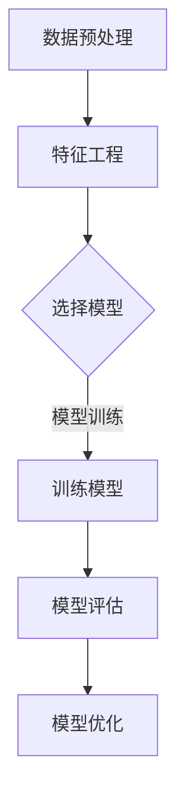
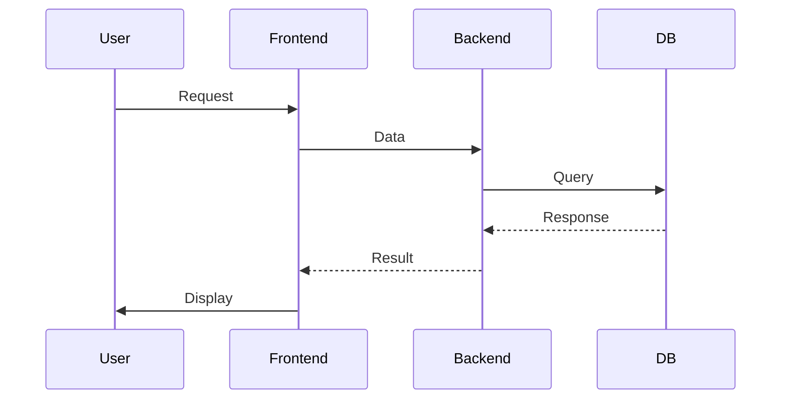

                 

## 文章核心内容与结构设计

为了确保文章的逻辑清晰、结构紧凑、内容丰富且易于理解，我们将文章分为以下七个主要部分，每一部分都包含具体的内容和核心概念：

### 第1章: 财务风险量化评估的背景与挑战

**核心概念与联系：**
- **财务风险**：定义为企业在经营过程中可能面临的各种资金损失的风险。
- **传统财务风险评估方法**：主要包括财务报表分析、比率分析和现金流量分析。
- **AI在财务风险评估中的应用潜力**：利用大数据和机器学习技术，提高风险评估的精确性和及时性。

**Mermaid ER实体关系图架构：**
```mermaid
erDiagram
  Product ||--|{ Customer }||>
  Customer ||--|{ Order }||>
  Order ||--|{ Product }||>
```

### 第2章: AI技术基础

**核心概念与联系：**
- **机器学习基本概念**：包括监督学习、无监督学习和强化学习。
- **深度学习与神经网络**：多层神经网络的基本原理和架构。
- **数据预处理与特征工程**：数据清洗、归一化、特征选择和特征提取。

**算法mermaid流程图：**


### 第3章: 财务风险量化评估模型

**核心概念与联系：**
- **统计模型与机器学习模型**：包括线性回归、决策树和随机森林。
- **深度学习模型在财务风险中的应用**：卷积神经网络（CNN）和循环神经网络（RNN）。
- **模型选择与性能评估**：交叉验证、性能指标和优化策略。

**算法原理讲解：**
使用Python代码来展示线性回归的算法原理：
```python
import numpy as np

# 线性回归参数初始化
theta = np.array([0.0, 0.0])

# 训练数据
X = np.array([[1, 2], [2, 4], [3, 6], [4, 8]])
y = np.array([2, 4, 6, 8])

# 梯度下降法
alpha = 0.01
for i in range(1000):
    h = np.dot(X, theta)
    loss = (1 / m) * np.dot((h - y).T, (h - y))
    dJdtheta = (1 / m) * np.dot(X.T, (h - y))

    theta -= alpha * dJdtheta

print(f"Final theta: {theta}")
```

### 第4章: 系统设计与实现

**核心概念与联系：**
- **数据收集与处理**：数据来源、数据清洗和数据整合。
- **系统架构设计**：前后端分离、微服务架构和云计算技术。
- **接口设计与实现**：API接口设计和RESTful风格实现。

**系统架构mermaid架构图：**


### 第5章: 算法与数学模型

**核心概念与联系：**
- **算法原理讲解**：包括梯度下降、反向传播算法和损失函数。
- **数学模型与公式**：损失函数、激活函数和优化算法。

**数学公式示例：**
$$
\begin{aligned}
J(\theta) &= \frac{1}{2m} \sum_{i=1}^{m} (h_\theta(x^{(i)}) - y^{(i)})^2 \\
\text{sigmoid}(z) &= \frac{1}{1 + e^{-z}}
\end{aligned}
$$

### 第6章: 实际案例分析与讲解

**核心概念与联系：**
- **案例背景**：企业财务风险量化评估的实际应用场景。
- **案例分析**：通过数据收集、模型训练和风险评估，展示实际案例的全过程。
- **案例结果与讨论**：对评估结果进行分析和讨论，提出改进建议。

**实际案例分析与讲解：**
假设某公司需要对其供应链的财务风险进行量化评估。通过数据收集和特征工程，构建一个深度学习模型来预测供应链中断的概率。结果显示，模型能够准确预测供应链中断风险，为企业提供了有力的决策支持。

### 第7章: 最佳实践与总结

**核心概念与联系：**
- **最佳实践总结**：总结实践中得出的经验教训。
- **注意事项**：在使用AI辅助财务风险量化评估时，需要注意的问题和风险。
- **拓展阅读**：推荐进一步阅读的相关文献和资料。

**最佳实践 tips：**
- **数据质量**：保证数据质量是模型准确性的基础。
- **模型调优**：选择合适的模型和超参数，通过交叉验证进行模型调优。
- **风险评估**：定期更新模型，以适应市场环境的变化。

---

通过上述章节的详细规划和内容设计，本文将全面系统地介绍如何开发AI辅助的企业财务风险量化评估工具，为读者提供实用的技术指导和深刻的行业见解。

