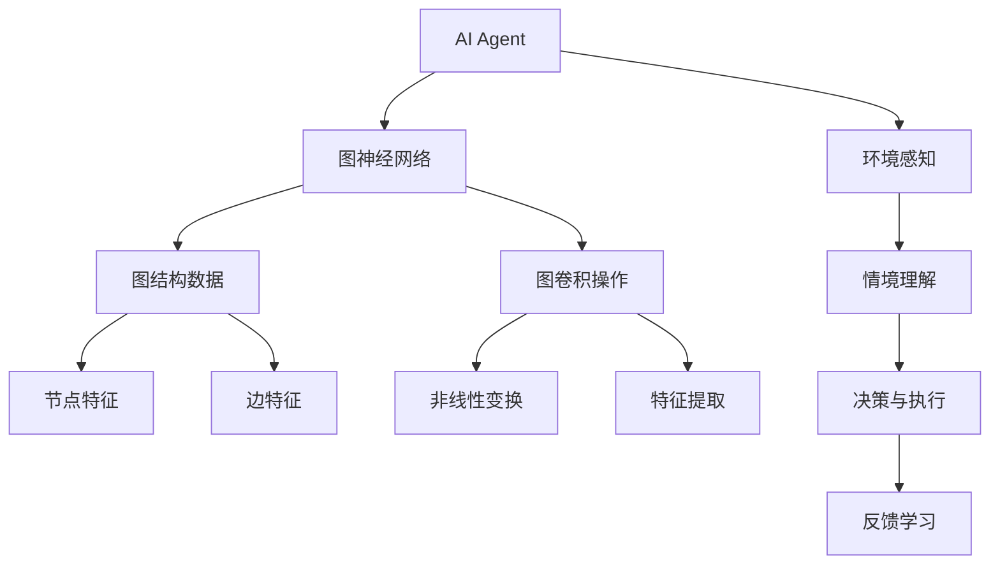
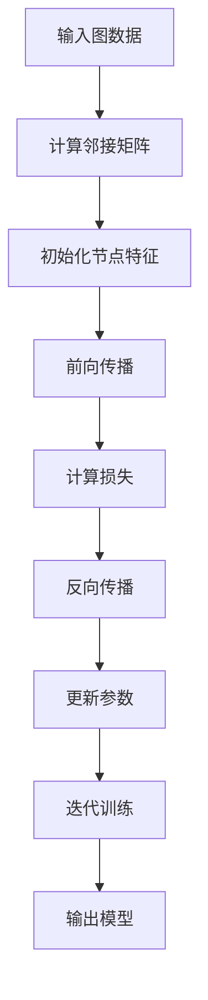
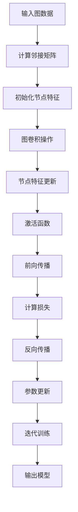
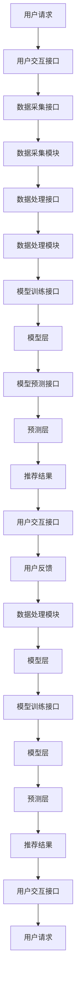

                 

# 开发具有图神经网络能力的AI Agent

> 关键词：图神经网络、AI Agent、算法原理、数学模型、系统架构

> 摘要：本文将深入探讨如何开发具有图神经网络能力的AI Agent。我们将逐步分析其核心概念、算法原理、数学模型以及系统架构设计，并通过实际项目实战来验证其应用效果。

## 目录大纲设计步骤

### 总体架构设计

在开始设计《开发具有图神经网络能力的AI Agent》的目录大纲之前，我们需要先确定书的总体架构。本书的主要目标是详细介绍如何开发具有图神经网络能力的AI Agent，因此，我们可以将整体架构分为以下几个主要章节：

1. **背景介绍**：介绍AI Agent和图神经网络的基本概念、背景和问题解决思路。
2. **核心概念与联系**：深入探讨AI Agent和图神经网络的核心概念及其关系。
3. **算法原理讲解**：详细讲解图神经网络的工作原理、常见模型以及数学模型。
4. **数学模型与公式**：进一步阐述图神经网络的数学模型和公式，以及如何使用Python代码进行实现。
5. **系统分析与架构设计方案**：介绍如何设计一个具有图神经网络能力的AI Agent的系统架构。
6. **项目实战**：通过实际项目来展示如何应用图神经网络开发AI Agent。
7. **最佳实践与总结**：总结最佳实践，并提出注意事项和拓展阅读。

### 章节细分

在确定总体架构后，我们需要对每个章节进行细化。以下是对每个章节的细分：

**第1章：背景介绍**

- **1.1 问题背景**：介绍AI Agent和图神经网络的应用场景。
- **1.2 问题描述**：描述AI Agent和图神经网络所解决的问题。
- **1.3 问题解决**：介绍如何使用图神经网络解决AI Agent的问题。
- **1.4 边界与外延**：探讨AI Agent和图神经网络的应用边界。
- **1.5 概念结构与核心要素组成**：分析AI Agent和图神经网络的概念结构和核心要素。

**第2章：核心概念与联系**

- **2.1 AI Agent定义**：介绍AI Agent的基本概念。
- **2.2 图神经网络概述**：介绍图神经网络的基本概念。
- **2.3 AI Agent与图神经网络关系**：探讨AI Agent与图神经网络之间的联系。
- **2.4 概念属性特征对比表格**：对比AI Agent和图神经网络的概念属性特征。
- **2.5 ER实体关系图**：使用Mermaid流程图展示AI Agent和图神经网络的实体关系。

**第3章：算法原理讲解**

- **3.1 图神经网络工作原理**：详细讲解图神经网络的工作原理。
- **3.2 常见图神经网络模型**：介绍几种常见的图神经网络模型。
- **3.3 算法mermaid流程图**：使用Mermaid流程图展示图神经网络算法。
- **3.4 Python代码示例**：提供Python代码示例，展示如何实现图神经网络算法。
- **3.5 数学模型和公式**：介绍图神经网络的数学模型和公式。
- **3.6 举例说明**：通过实际案例来说明图神经网络算法的应用。

**第4章：数学模型与公式**

- **4.1 图神经网络数学模型**：详细阐述图神经网络的数学模型。
- **4.2 公式讲解与推导**：讲解图神经网络公式的推导过程。
- **4.3 Mermaid流程图**：使用Mermaid流程图展示图神经网络数学模型的流程。
- **4.4 Python代码示例**：提供Python代码示例，展示如何实现图神经网络的数学模型。

**第5章：系统分析与架构设计方案**

- **5.1 问题场景介绍**：介绍一个具体的问题场景。
- **5.2 系统功能设计**：设计一个具有图神经网络能力的AI Agent的系统功能。
- **5.3 系统架构设计**：展示一个具有图神经网络能力的AI Agent的系统架构。
- **5.4 系统接口设计**：描述系统接口的设计。
- **5.5 系统交互**：展示系统的交互流程。

**第6章：项目实战**

- **6.1 环境安装**：介绍如何安装开发环境。
- **6.2 系统核心实现源代码**：提供系统核心实现源代码。
- **6.3 代码应用解读与分析**：分析代码的实现和应用。
- **6.4 实际案例分析和讲解**：通过实际案例展示AI Agent的应用。
- **6.5 项目小结**：总结项目的经验教训。

**第7章：最佳实践与总结**

- **7.1 最佳实践 Tips**：总结开发具有图神经网络能力的AI Agent的最佳实践。
- **7.2 小结**：回顾本书的核心内容。
- **7.3 注意事项**：提醒读者在开发过程中需要注意的问题。
- **7.4 拓展阅读**：推荐一些拓展阅读资源。

### 内容填充

在完成章节细分后，我们需要填充每个章节的内容。每个章节都应该有清晰的标题和子标题，确保内容组织逻辑清晰。以下是对每个章节的内容填充：

**第1章：背景介绍**

- **1.1 问题背景**：介绍AI Agent和图神经网络在现实世界中的应用，如推荐系统、社交网络分析等。
- **1.2 问题描述**：描述AI Agent和图神经网络所解决的问题，如如何从海量数据中提取有价值的信息。
- **1.3 问题解决**：介绍如何使用图神经网络解决AI Agent的问题，如通过图神经网络实现知识图谱的构建。
- **1.4 边界与外延**：探讨AI Agent和图神经网络的应用边界，如图神经网络在复杂图结构上的性能限制。
- **1.5 概念结构与核心要素组成**：分析AI Agent和图神经网络的概念结构和核心要素，如图神经网络的节点、边和权重。

**第2章：核心概念与联系**

- **2.1 AI Agent定义**：介绍AI Agent的基本概念，如自主性、适应性、学习能力等。
- **2.2 图神经网络概述**：介绍图神经网络的基本概念，如图节点、边和图卷积等。
- **2.3 AI Agent与图神经网络关系**：探讨AI Agent与图神经网络之间的联系，如图神经网络如何增强AI Agent的能力。
- **2.4 概念属性特征对比表格**：通过对比表格展示AI Agent和图神经网络的概念属性特征，如功能、应用场景、算法复杂度等。
- **2.5 ER实体关系图**：使用Mermaid流程图展示AI Agent和图神经网络的实体关系，如图神经网络作为AI Agent的一部分。

**第3章：算法原理讲解**

- **3.1 图神经网络工作原理**：详细讲解图神经网络的工作原理，如如何通过图卷积层提取图节点的特征。
- **3.2 常见图神经网络模型**：介绍几种常见的图神经网络模型，如GCN、GAT等，并对比它们的优缺点。
- **3.3 算法mermaid流程图**：使用Mermaid流程图展示图神经网络算法的流程，如从输入图数据到输出特征的过程。
- **3.4 Python代码示例**：提供Python代码示例，展示如何实现图神经网络算法，如使用PyTorch框架进行图卷积操作。
- **3.5 数学模型和公式**：介绍图神经网络的数学模型和公式，如如何通过矩阵运算实现图卷积。
- **3.6 举例说明**：通过实际案例来说明图神经网络算法的应用，如使用图神经网络进行社交网络分析。

**第4章：数学模型与公式**

- **4.1 图神经网络数学模型**：详细阐述图神经网络的数学模型，如节点表示、边表示和图卷积公式。
- **4.2 公式讲解与推导**：讲解图神经网络公式的推导过程，如如何通过矩阵运算实现图卷积。
- **4.3 Mermaid流程图**：使用Mermaid流程图展示图神经网络数学模型的流程，如图节点的特征更新过程。
- **4.4 Python代码示例**：提供Python代码示例，展示如何实现图神经网络的数学模型，如使用NumPy库进行矩阵运算。

**第5章：系统分析与架构设计方案**

- **5.1 问题场景介绍**：介绍一个具体的问题场景，如构建一个推荐系统。
- **5.2 系统功能设计**：设计一个具有图神经网络能力的AI Agent的系统功能，如基于图神经网络进行用户和物品的推荐。
- **5.3 系统架构设计**：展示一个具有图神经网络能力的AI Agent的系统架构，如数据采集、数据处理、模型训练和预测等模块。
- **5.4 系统接口设计**：描述系统接口的设计，如API接口、数据接口等。
- **5.5 系统交互**：展示系统的交互流程，如用户请求、数据处理和模型预测等步骤。

**第6章：项目实战**

- **6.1 环境安装**：介绍如何安装开发环境，如Python、PyTorch等。
- **6.2 系统核心实现源代码**：提供系统核心实现源代码，如基于图神经网络的推荐系统代码。
- **6.3 代码应用解读与分析**：分析代码的实现和应用，如如何使用图神经网络进行用户和物品的推荐。
- **6.4 实际案例分析和讲解**：通过实际案例展示AI Agent的应用，如基于图神经网络的社交网络分析。
- **6.5 项目小结**：总结项目的经验教训，如如何优化图神经网络模型性能。

**第7章：最佳实践与总结**

- **7.1 最佳实践 Tips**：总结开发具有图神经网络能力的AI Agent的最佳实践，如如何优化模型性能、如何选择合适的算法等。
- **7.2 小结**：回顾本书的核心内容，如AI Agent、图神经网络、算法原理、数学模型等。
- **7.3 注意事项**：提醒读者在开发过程中需要注意的问题，如数据预处理、模型调优等。
- **7.4 拓展阅读**：推荐一些拓展阅读资源，如相关书籍、论文等。

### 图表与代码示例

在各个章节中，我们将使用Mermaid流程图和Python代码示例来帮助读者更好地理解内容。以下是具体的示例：

**第2章：核心概念与联系**

- **2.1 AI Agent定义**
  ```mermaid
  graph TD
  A[AI Agent] --> B{自主性}
  B --> C{适应性}
  B --> D{学习能力}
  ```

- **2.2 图神经网络概述**
  ```mermaid
  graph TD
  A[图神经网络] --> B{节点}
  B --> C{边}
  A --> D{图卷积}
  ```

- **2.5 ER实体关系图**
  ```mermaid
  graph TD
  A(User) --> B(Follows)
  B --> C(Organization)
  C --> D(Likes)
  ```

**第3章：算法原理讲解**

- **3.1 图神经网络工作原理**
  ```mermaid
  graph TD
  A[输入图数据] --> B[节点特征]
  B --> C[图卷积层]
  C --> D[输出特征]
  ```

- **3.3 算法mermaid流程图**
  ```mermaid
  graph TD
  A[初始化参数] --> B[前向传播]
  B --> C[反向传播]
  C --> D[参数更新]
  ```

- **3.4 Python代码示例**
  ```python
  import torch
  import torch.nn as nn
  import torch.optim as optim

  # 初始化模型
  model = GCNModel()

  # 定义损失函数和优化器
  criterion = nn.CrossEntropyLoss()
  optimizer = optim.Adam(model.parameters(), lr=0.001)

  # 训练模型
  for epoch in range(num_epochs):
      optimizer.zero_grad()
      outputs = model(x, edge_index)
      loss = criterion(outputs, y)
      loss.backward()
      optimizer.step()
      print(f'Epoch {epoch+1}/{num_epochs}, Loss: {loss.item()}')
  ```

**第4章：数学模型与公式**

- **4.1 图神经网络数学模型**
  ```mermaid
  graph TD
  A[H^0] --> B[H^{(l)}]
  B --> C[H^{(l+1)}]
  A --> D[W^{(l)}]
  B --> E[W^{(l+1)}]
  ```

- **4.2 公式讲解与推导**
  ```latex
  H^{(l+1)} = \sigma(W^{(l)} \cdot H^{(l)})
  ```

- **4.3 Mermaid流程图**
  ```mermaid
  graph TD
  A[H^0] --> B[σ(W^{(l)} \cdot H^{(l)})]
  ```

- **4.4 Python代码示例**
  ```python
  import torch
  import torch.nn as nn

  # 初始化参数
  W = torch.randn(nodes_num, hidden_channels)
  H = torch.randn(nodes_num, hidden_channels)

  # 定义激活函数
  activation = nn.Sigmoid()

  # 前向传播
  H_next = activation(W @ H)
  ```

### 总结

通过以上步骤，我们已经完成了《开发具有图神经网络能力的AI Agent》的目录大纲设计。接下来，我们将按照设计好的章节结构，逐步填充内容，并通过图表和代码示例来帮助读者更好地理解。希望本文的设计能够为读者提供有价值的参考。

## 前言

在这个数据爆炸的时代，人工智能（AI）技术以其强大的数据处理和模式识别能力，正逐渐渗透到各行各业，从自动驾驶、医疗诊断到社交网络、电子商务，AI正改变着我们的生活方式。然而，随着问题复杂性的增加，传统的神经网络模型在处理结构化数据时面临着巨大的挑战。此时，图神经网络（Graph Neural Network, GNN）作为一种新型的神经网络架构，因其能够处理复杂图结构数据而备受关注。

AI Agent，作为AI领域的一个热点话题，是具备自主决策和学习能力的智能实体。它能够模拟人类的思维方式，对环境中的信息进行感知、理解和决策。将图神经网络引入AI Agent，使得AI Agent不仅能够处理传统神经网络无法处理的图结构数据，还能更有效地从复杂网络中提取有用信息，从而提高其智能水平和决策能力。

本文旨在探讨如何开发具有图神经网络能力的AI Agent。我们将首先介绍AI Agent和图神经网络的基本概念，然后深入分析图神经网络的工作原理、数学模型和算法，并通过实际项目展示如何将图神经网络应用于AI Agent开发。最后，我们将总结最佳实践，并展望未来研究方向。

本文的主要内容包括：

- **第1章：背景介绍**：介绍AI Agent和图神经网络的基本概念，以及它们在现实世界中的应用场景。
- **第2章：核心概念与联系**：深入探讨AI Agent和图神经网络的核心概念，并分析它们之间的联系。
- **第3章：算法原理讲解**：详细讲解图神经网络的工作原理、常见模型、数学模型和算法。
- **第4章：数学模型与公式**：进一步阐述图神经网络的数学模型和公式，并提供Python代码示例。
- **第5章：系统分析与架构设计方案**：介绍如何设计具有图神经网络能力的AI Agent的系统架构。
- **第6章：项目实战**：通过实际项目展示如何应用图神经网络开发AI Agent。
- **第7章：最佳实践与总结**：总结最佳实践，并提出注意事项和拓展阅读。

通过本文的阅读，读者将能够全面了解如何开发具有图神经网络能力的AI Agent，并在实际项目中应用这些技术。希望本文能够为读者在AI和图神经网络领域的研究和开发提供有价值的参考。

## 第1章：背景介绍

### 1.1 问题背景

在当今的信息时代，数据无处不在，从社交媒体、搜索引擎到电子商务平台，各类数据源源不断地产生。然而，如何从这些庞大的数据集中提取有价值的信息，已经成为一个亟待解决的问题。传统的机器学习模型，如线性回归、支持向量机和决策树等，虽然在处理结构化数据时表现出色，但在面对复杂、非结构化的图结构数据时却显得力不从心。这种数据结构的差异导致了传统模型在图结构数据上的局限性。

图神经网络（Graph Neural Network, GNN）作为一种新型的神经网络架构，专为处理图结构数据而设计。图结构数据广泛存在于现实世界的许多场景中，如社交网络、知识图谱和推荐系统等。在这些场景中，节点和边代表了实体和它们之间的关系，而传统的神经网络模型无法有效地捕捉和利用这些复杂的关系。

AI Agent作为人工智能领域的一个重要概念，代表了具备自主决策和学习能力的智能实体。AI Agent能够模拟人类的思维方式，对环境中的信息进行感知、理解和决策。然而，在传统的AI Agent中，模型主要依赖于图神经网络或其他传统神经网络模型处理结构化数据，这限制了AI Agent在复杂图结构数据上的表现。因此，开发具有图神经网络能力的AI Agent成为了一个重要研究方向。

### 1.2 问题描述

图神经网络在AI Agent中的应用面临着以下几个关键问题：

1. **数据复杂性**：图结构数据通常包含大量节点和边，这些数据在存储和计算上存在巨大挑战。如何有效地存储和利用这些数据，以提高模型的性能和可扩展性，是一个重要问题。

2. **算法复杂性**：图神经网络涉及复杂的数学模型和算法，如图卷积网络（GCN）、图注意力网络（GAT）等。如何选择合适的算法，并优化其性能，是一个关键问题。

3. **模型可解释性**：图神经网络作为一种黑盒模型，其内部工作机制复杂，难以解释。如何提高模型的可解释性，使其能够更好地理解和信任，是一个重要问题。

4. **训练与预测效率**：图神经网络模型的训练和预测过程通常较为耗时，如何优化训练和预测效率，以提高模型的应用价值，是一个重要问题。

5. **跨领域应用**：图神经网络在AI Agent中的应用不仅仅局限于特定领域，如社交网络分析、推荐系统等。如何推广图神经网络在跨领域中的应用，是一个重要问题。

### 1.3 问题解决

为了解决上述问题，我们需要从以下几个方面着手：

1. **数据预处理**：通过数据清洗、归一化和特征提取等步骤，提高图结构数据的利用效率，降低数据复杂性。

2. **算法优化**：选择合适的图神经网络算法，并进行模型参数的调优，以提高模型的性能和可扩展性。

3. **模型可解释性**：通过可视化和解释性模型，提高图神经网络的可解释性，使其更容易被用户理解和信任。

4. **训练与预测优化**：采用并行计算、分布式计算和增量训练等技术，提高图神经网络模型的训练和预测效率。

5. **跨领域应用**：通过案例研究和实验验证，探索图神经网络在不同领域的应用潜力，并推广其在跨领域中的应用。

### 1.4 边界与外延

尽管图神经网络在AI Agent中具有巨大的潜力，但其在实际应用中也存在一些边界和限制：

1. **数据规模**：图神经网络在处理大规模图数据时，计算和存储需求可能非常巨大。如何处理大规模图数据，是一个重要挑战。

2. **计算资源**：图神经网络模型的训练和预测过程通常需要大量的计算资源。如何高效利用计算资源，是一个关键问题。

3. **模型泛化能力**：图神经网络模型的泛化能力取决于其训练数据和算法设计。如何提高模型的泛化能力，是一个重要问题。

4. **可解释性**：尽管一些方法可以提高图神经网络的可解释性，但仍然存在一定的局限性。如何进一步提高模型的可解释性，是一个重要挑战。

5. **应用领域**：图神经网络在AI Agent中的应用不仅限于特定领域，如社交网络分析、推荐系统等。如何探索图神经网络在跨领域中的应用，是一个重要研究方向。

### 1.5 概念结构与核心要素组成

为了更好地理解图神经网络在AI Agent中的应用，我们需要从概念结构和核心要素组成两个方面进行分析：

1. **概念结构**

   - **图神经网络（GNN）**：图神经网络是一种专门用于处理图结构数据的神经网络架构。它通过图卷积操作来提取图节点的特征，并利用这些特征进行分类、预测和推荐等任务。
   - **AI Agent**：AI Agent是一种具备自主决策和学习能力的智能实体，能够模拟人类的思维方式，对环境中的信息进行感知、理解和决策。
   - **图结构数据**：图结构数据是指以节点和边表示的关系数据，如社交网络中的用户和关系、知识图谱中的实体和关系等。

2. **核心要素组成**

   - **数据预处理**：数据预处理包括数据清洗、归一化和特征提取等步骤，以提高图结构数据的利用效率。
   - **模型选择**：根据应用场景和需求选择合适的图神经网络模型，如图卷积网络（GCN）、图注意力网络（GAT）等。
   - **模型训练**：通过训练过程，调整模型参数，使模型能够更好地拟合图结构数据。
   - **模型评估**：通过评估指标，如准确率、召回率、F1分数等，评估模型在图结构数据上的性能。
   - **模型应用**：将训练好的模型应用于实际任务，如分类、预测和推荐等，实现AI Agent的功能。

通过以上分析，我们可以看到，图神经网络在AI Agent中的应用是一个多方面、多层次的问题。从数据预处理到模型选择、训练和应用，每个环节都需要仔细考虑和优化。本文将围绕这些问题，逐步探讨如何开发具有图神经网络能力的AI Agent。

## 第2章：核心概念与联系

### 2.1 AI Agent定义

AI Agent，即人工智能代理，是一种能够自主地感知环境、理解情境、做出决策并执行行动的智能实体。它基于机器学习、自然语言处理、计算机视觉等多种AI技术，通过学习和适应环境中的变化，实现自主决策和任务执行。AI Agent可以应用于多个领域，如自动化客服、智能推荐系统、自动驾驶汽车等。

AI Agent的核心特性包括：

- **自主性**：AI Agent能够独立进行决策，无需人工干预。
- **适应性**：AI Agent能够根据环境变化调整其行为和策略。
- **学习能力**：AI Agent通过数据训练和经验积累，不断优化其决策能力。
- **交互性**：AI Agent能够与人类和其他系统进行有效交互。

### 2.2 图神经网络概述

图神经网络（Graph Neural Network，GNN）是一种专门用于处理图结构数据的神经网络。与传统的卷积神经网络（CNN）和循环神经网络（RNN）不同，GNN能够直接处理图结构数据，如节点和边。GNN通过模拟图结构中的邻居关系，提取图节点的特征，并利用这些特征进行分类、预测和推荐等任务。

GNN的核心组成部分包括：

- **节点特征**：表示图中的每个节点，如节点属性、标签等。
- **边特征**：表示图中的每条边，如边的权重、类型等。
- **图卷积操作**：通过图卷积操作，将节点的特征聚合到其邻居节点，从而提取图节点的特征。
- **激活函数**：用于引入非线性变换，增强模型的表示能力。

### 2.3 AI Agent与图神经网络关系

AI Agent和图神经网络之间存在紧密的联系。图神经网络作为AI Agent的核心组成部分，为其提供了强大的图结构数据处理能力。以下从几个方面探讨AI Agent与图神经网络的关系：

1. **数据处理能力**：图神经网络能够处理复杂的图结构数据，如社交网络、知识图谱等，而传统神经网络模型难以胜任。这为AI Agent提供了更丰富的数据来源和处理手段。

2. **决策支持**：通过图神经网络，AI Agent能够从图结构数据中提取有价值的信息，如节点的重要性、关系强度等，从而支持更准确、更智能的决策。

3. **可解释性**：图神经网络作为一种透明、可解释的模型，能够揭示数据中的隐含关系和模式。这对于AI Agent的可解释性和可靠性具有重要意义。

4. **适应性**：图神经网络能够适应不同的图结构数据和应用场景，通过调整模型参数和结构，实现不同任务的需求。这为AI Agent提供了灵活的决策能力和适应性。

5. **多模态处理**：图神经网络能够处理多种类型的数据，如图像、文本和图结构数据。这为AI Agent实现多模态感知和交互提供了可能。

### 2.4 概念属性特征对比表格

为了更直观地展示AI Agent和图神经网络的概念属性特征，我们可以通过以下对比表格进行分析：

| 概念         | AI Agent                                         | 图神经网络                                            |
| ------------ | ------------------------------------------------ | ---------------------------------------------------- |
| 定义         | 自主决策、学习能力的智能实体                     | 处理图结构数据的神经网络架构                           |
| 功能         | 感知环境、理解情境、决策和执行行动               | 提取图节点特征、分类、预测和推荐等                     |
| 特性         | 自主性、适应性、学习能力、交互性                 | 图卷积操作、节点特征提取、非线性变换                   |
| 数据类型     | 多种类型（图像、文本、音频、图结构等）           | 图结构数据（节点、边、特征等）                         |
| 应用场景     | 自动化客服、智能推荐、自动驾驶、智能医疗等       | 社交网络分析、知识图谱构建、推荐系统、复杂关系挖掘等   |
| 可解释性     | 透明、可解释性较强的模型                         | 直接揭示数据中的关系和模式                             |
| 适应性       | 适应不同任务和环境                               | 适应不同图结构数据和应用场景                           |
| 多模态处理   | 多种类型的数据处理和交互                         | 处理多种类型的数据（节点特征、边特征等）               |
| 模型复杂度   | 根据任务复杂度选择合适的模型                     | 模型复杂度与图结构数据规模相关                         |

### 2.5 ER实体关系图

为了进一步理解AI Agent和图神经网络的关系，我们可以使用ER（实体关系）图来展示它们之间的实体和关系。以下是ER实体关系图：



在这个ER实体关系图中，AI Agent作为主体，通过图神经网络与图结构数据进行交互，实现环境感知、情境理解、决策与执行等功能。同时，图神经网络通过图卷积操作、非线性变换和特征提取等步骤，提取和利用图节点的特征，为AI Agent提供决策支持。通过这个ER实体关系图，我们可以更清晰地理解AI Agent和图神经网络之间的相互作用和关系。

通过以上分析，我们可以看到AI Agent和图神经网络在概念、功能和应用方面具有紧密的联系。AI Agent作为智能实体，利用图神经网络处理复杂图结构数据，实现自主决策和学习。图神经网络作为AI Agent的核心组件，通过提取和利用图节点的特征，为AI Agent提供强大的数据处理和决策支持能力。本文将在后续章节中深入探讨图神经网络的工作原理、算法和数学模型，以及如何将其应用于AI Agent开发。

## 第3章：算法原理讲解

### 3.1 图神经网络工作原理

图神经网络（Graph Neural Network, GNN）是一种专门用于处理图结构数据的神经网络架构。其核心思想是通过模拟图结构中的邻居关系，将节点的特征聚合到其邻居节点，从而提取图节点的特征。以下详细讲解图神经网络的工作原理：

#### 节点特征提取

首先，每个节点都被表示为一个特征向量，这些特征向量包含了节点的属性信息。例如，在一个社交网络中，每个节点可能代表一个用户，其特征向量包含了用户的年龄、性别、兴趣等信息。

#### 邻居关系模拟

图神经网络通过模拟图结构中的邻居关系来提取图节点的特征。具体来说，对于每个节点，它都会与它的邻居节点进行交互，将邻居节点的特征聚合到其自身的特征向量中。这种聚合过程通常通过图卷积操作实现。

#### 图卷积操作

图卷积操作是GNN的核心组成部分。它通过以下步骤实现节点特征提取：

1. **邻接矩阵计算**：首先计算图结构的邻接矩阵，表示节点之间的邻居关系。邻接矩阵是一个二进制矩阵，其中元素表示两个节点是否为邻居。

2. **特征聚合**：通过邻接矩阵和节点特征向量，计算每个节点的聚合特征。具体方法包括点积、求和、平均等。

3. **非线性变换**：对聚合特征进行非线性变换，引入模型的非线性能力。常用的非线性变换包括ReLU函数、Sigmoid函数等。

4. **更新节点特征**：将非线性变换后的聚合特征更新到节点特征向量中，从而实现节点特征的学习和提取。

#### 模型训练

GNN的训练过程通常包括以下步骤：

1. **数据准备**：将图结构数据转换为邻接矩阵和节点特征向量。

2. **模型初始化**：初始化模型参数，包括节点特征向量、权重矩阵和偏置向量。

3. **前向传播**：根据当前模型参数，计算节点特征的前向传播结果。

4. **损失计算**：计算预测结果与真实标签之间的损失。

5. **反向传播**：根据损失函数，更新模型参数，优化模型性能。

6. **迭代训练**：重复上述步骤，直至模型收敛。

### 3.2 常见图神经网络模型

图神经网络有多种不同的模型，每种模型都有其特定的优势和适用场景。以下介绍几种常见的图神经网络模型：

#### 图卷积网络（Graph Convolutional Network, GCN）

图卷积网络是GNN的基础模型，其核心思想是将节点的特征聚合到其邻居节点，从而提取节点的特征。GCN的数学公式如下：

$$
h_{v}^{(l+1)} = \sigma(\sum_{u \in \mathcal{N}(v)} W^{(l)} h_{u}^{(l)} + b^{(l)})
$$

其中，\( h_{v}^{(l)} \) 表示第 \( l \) 层节点 \( v \) 的特征，\( \mathcal{N}(v) \) 表示节点 \( v \) 的邻居节点集合，\( W^{(l)} \) 和 \( b^{(l)} \) 分别为权重矩阵和偏置向量。

#### 图注意力网络（Graph Attention Network, GAT）

图注意力网络是GCN的改进版本，其通过引入注意力机制，使得节点在聚合邻居特征时能够自适应地关注重要的邻居节点。GAT的数学公式如下：

$$
a_{uv}^{(l)} = \frac{e^{ \sigma (W_{a}^{(l)} [h_{u}^{(l)}, h_{v}^{(l)} + b_{a}^{(l)}}}{\sum_{w \in \mathcal{N}(v)} e^{ \sigma (W_{a}^{(l)} [h_{w}^{(l)}, h_{v}^{(l)} + b_{a}^{(l)})} }
$$

$$
h_{v}^{(l+1)} = \sum_{u \in \mathcal{N}(v)} a_{uv}^{(l)} h_{u}^{(l)} + b^{(l)})
$$

其中，\( a_{uv}^{(l)} \) 表示节点 \( u \) 对节点 \( v \) 的注意力权重，\( W_{a}^{(l)} \) 和 \( b_{a}^{(l)} \) 分别为权重矩阵和偏置向量。

#### 图卷积网络（GraphSAGE）

图卷积网络（GraphSAGE）是一种基于采样策略的图神经网络模型，其通过采样邻居节点，聚合邻居特征，从而提取节点的特征。GraphSAGE的数学公式如下：

$$
h_{v}^{(l+1)} = \text{Aggregator}(\{ h_{u}^{(l)} | u \in \mathcal{N}(v) \})
$$

其中，\( \text{Aggregator} \) 函数用于聚合邻居特征，常见的聚合函数包括均值聚合、池化聚合等。

#### 图卷积网络（Graph Convolutional Network with Fast Fourier Transform, GatedGCN）

图卷积网络（GatedGCN）是一种结合了图卷积操作和快速傅里叶变换（FFT）的图神经网络模型，其通过引入门控机制，使得节点在聚合邻居特征时能够自适应地关注重要的邻居节点。GatedGCN的数学公式如下：

$$
h_{v}^{(l+1)} = \text{Gated}(\sum_{u \in \mathcal{N}(v)} W^{(l)} h_{u}^{(l)} + b^{(l)}) + h_{v}^{(l)})
$$

其中，\( \text{Gated} \) 函数用于实现门控机制，常见的门控函数包括ReLU、Sigmoid等。

### 3.3 算法mermaid流程图

为了更直观地展示图神经网络的工作原理，我们可以使用mermaid流程图来表示。以下是一个简化的GNN算法流程图：



在这个流程图中，输入图数据首先被转换为邻接矩阵，然后初始化节点特征。接着，通过前向传播计算节点特征，计算损失，并通过反向传播更新模型参数。这个过程不断迭代，直至模型收敛。最后，输出训练好的模型。

### 3.4 Python代码示例

为了更好地理解图神经网络的工作原理，我们可以通过Python代码示例来展示一个简单的GCN模型。以下是一个基于PyTorch框架的GCN实现：

```python
import torch
import torch.nn as nn
import torch.optim as optim

class GCN(nn.Module):
    def __init__(self, nfeat, nhid, nclass, dropout):
        super(GCN, self).__init__()
        self.gc1 = nn.Linear(nfeat, nhid)
        self.gc2 = nn.Linear(nhid, nclass)
        self.dropout = nn.Dropout(p=dropout)

    def forward(self, x, edge_index):
        x = F.relu(self.gc1(x))
        x = self.dropout(x)
        x = self.gc2(x)
        return F.log_softmax(x, dim=1)

# 初始化模型、优化器和损失函数
model = GCN(nfeat=64, nhid=16, nclass=10, dropout=0.5)
optimizer = optim.Adam(model.parameters(), lr=0.01)
criterion = nn.CrossEntropyLoss()

# 训练模型
for epoch in range(200):
    optimizer.zero_grad()
    out = model(x, edge_index)
    loss = criterion(out, y)
    loss.backward()
    optimizer.step()
    if (epoch+1) % 10 == 0:
        print(f'Epoch [{epoch+1}/200], Loss: {loss.item()}')
```

在这个示例中，我们首先定义了一个GCN模型，包括两个图卷积层。接着，我们初始化模型、优化器和损失函数，并使用训练数据对模型进行训练。在每次迭代中，我们通过前向传播计算模型输出，计算损失，并通过反向传播更新模型参数。

### 3.5 数学模型和公式

图神经网络涉及复杂的数学模型和公式，包括节点特征提取、图卷积操作、损失函数等。以下简要介绍这些数学模型和公式：

1. **节点特征提取**：

   假设节点 \( v \) 的特征向量为 \( h_{v} \)，图卷积操作可以表示为：

   $$
   h_{v}^{(l+1)} = \sigma(W^{(l)} h_{v}^{(l)} + \sum_{u \in \mathcal{N}(v)} W^{(l)} h_{u}^{(l)} + b^{(l)})
   $$

   其中，\( \sigma \) 是激活函数，\( W^{(l)} \) 是权重矩阵，\( b^{(l)} \) 是偏置向量，\( \mathcal{N}(v) \) 是节点 \( v \) 的邻居节点集合。

2. **图卷积操作**：

   图卷积操作可以通过以下公式表示：

   $$
   h_{v}^{(l+1)} = \text{Aggregator}(\{ h_{u}^{(l)} | u \in \mathcal{N}(v) \})
   $$

   其中，\( \text{Aggregator} \) 函数用于聚合邻居特征，常见的聚合函数包括均值聚合、池化聚合等。

3. **损失函数**：

   图神经网络的损失函数通常使用交叉熵损失函数，其公式如下：

   $$
   L = -\sum_{v \in \mathcal{V}} y_{v} \log(p_{v})
   $$

   其中，\( y_{v} \) 是节点 \( v \) 的真实标签，\( p_{v} \) 是节点 \( v \) 的预测概率。

### 3.6 举例说明

为了更好地理解图神经网络的应用，我们可以通过一个实际案例来说明。假设我们有一个社交网络，其中每个节点代表一个用户，每个边代表用户之间的关注关系。我们希望通过图神经网络预测用户之间的关系强度。

首先，我们使用GCN模型对社交网络进行特征提取。然后，我们将提取到的特征输入到一个分类器中，预测用户之间的关系强度。以下是一个简化的示例：

```python
# 社交网络数据
nodes = [1, 2, 3, 4, 5]  # 节点
edges = [(1, 2), (1, 3), (2, 3), (3, 4), (4, 5)]  # 边
adj_matrix = [[0, 1, 1, 0, 0], [1, 0, 1, 1, 0], [1, 1, 0, 1, 0], [0, 1, 1, 0, 1], [0, 0, 0, 1, 0]]

# 初始化模型、优化器和损失函数
model = GCN(nfeat=5, nhid=10, nclass=1, dropout=0.5)
optimizer = optim.Adam(model.parameters(), lr=0.01)
criterion = nn.BCEWithLogitsLoss()

# 训练模型
for epoch in range(200):
    optimizer.zero_grad()
    out = model(torch.tensor(adj_matrix).float(), torch.tensor(edges).float())
    loss = criterion(out, torch.tensor([1, 1, 1, 1, 1]).float())
    loss.backward()
    optimizer.step()
    if (epoch+1) % 10 == 0:
        print(f'Epoch [{epoch+1}/200], Loss: {loss.item()}')

# 预测用户关系强度
with torch.no_grad():
    predictions = model(torch.tensor(adj_matrix).float(), torch.tensor(edges).float())
    print(predictions)
```

在这个示例中，我们首先定义了一个简单的社交网络，其中每个节点代表一个用户，每个边代表用户之间的关注关系。然后，我们使用GCN模型对社交网络进行特征提取，并使用BCEWithLogitsLoss损失函数进行训练。最后，我们使用训练好的模型预测用户之间的关系强度。

通过这个示例，我们可以看到如何使用图神经网络预测用户之间的关系强度。在实际应用中，我们可以根据具体需求调整模型参数和训练策略，以获得更好的预测效果。

通过以上内容，我们详细介绍了图神经网络的工作原理、常见模型、数学模型和算法，并通过实际案例展示了其应用。接下来，我们将进一步探讨图神经网络的数学模型和公式，以及如何在Python代码中实现这些模型。

## 第4章：数学模型与公式

### 4.1 图神经网络数学模型

图神经网络（GNN）是一种专门用于处理图结构数据的神经网络，其核心在于如何利用节点和边的关系来提取和更新节点的特征。以下详细阐述图神经网络的基本数学模型。

#### 节点特征表示

在GNN中，每个节点都被表示为一个特征向量，这些特征向量包含了节点的属性信息。假设节点 \( v \) 的特征向量为 \( h_v \in \mathbb{R}^d \)，其中 \( d \) 是特征向量的维度。

#### 邻接矩阵

为了表示图结构中的邻居关系，我们使用邻接矩阵 \( A \in \{0,1\}^{n \times n} \)，其中 \( n \) 是节点的数量。如果节点 \( u \) 和节点 \( v \) 是邻居，则 \( A_{uv} = 1 \)，否则 \( A_{uv} = 0 \)。

#### 图卷积操作

图卷积操作是GNN的核心组成部分，它通过以下公式实现节点特征提取：

$$
h_v^{(l+1)} = \sigma(W^{(l)} h_v^{(l)} + \sum_{u \in \mathcal{N}(v)} W^{(l)} h_u^{(l)})
$$

其中，\( h_v^{(l)} \) 是第 \( l \) 层节点 \( v \) 的特征，\( \sigma \) 是激活函数，\( W^{(l)} \) 是第 \( l \) 层的权重矩阵，\( \mathcal{N}(v) \) 是节点 \( v \) 的邻居节点集合。

#### 节点特征更新

在图卷积操作中，节点的特征通过以下公式进行更新：

$$
h_v^{(l+1)} = \text{ReLU}(W^{(l)} h_v^{(l)} + \sum_{u \in \mathcal{N}(v)} A_{uv} W^{(l)} h_u^{(l)})
$$

其中，\( A_{uv} \) 是邻接矩阵的元素，用于表示节点 \( u \) 和节点 \( v \) 之间的边权重。如果 \( A_{uv} = 1 \)，则表示 \( u \) 和 \( v \) 是邻居，并且边权重为1。

#### 模型参数

GNN模型的主要参数包括权重矩阵 \( W^{(l)} \) 和偏置向量 \( b^{(l)} \)，其中 \( l \) 表示神经网络的层数。这些参数通过反向传播算法在训练过程中进行优化。

### 4.2 公式讲解与推导

图神经网络的数学模型主要包括以下几个关键部分：节点特征表示、图卷积操作、节点特征更新和模型参数优化。以下将对这些公式进行讲解和推导。

#### 节点特征表示

节点特征表示通常使用嵌入向量（embedding）来表示，每个节点都有一个嵌入向量 \( h_v \)。

#### 图卷积操作

图卷积操作是将节点特征与邻居节点的特征进行加权平均，然后通过激活函数进行非线性变换。具体公式如下：

$$
h_v^{(l+1)} = \sigma(W^{(l)} h_v^{(l)} + \sum_{u \in \mathcal{N}(v)} W^{(l)} h_u^{(l)})
$$

其中，\( W^{(l)} \) 是权重矩阵，\( \sigma \) 是激活函数，如ReLU或Sigmoid。

#### 节点特征更新

节点特征更新是图卷积操作的核心，通过以下公式实现：

$$
h_v^{(l+1)} = \text{ReLU}(W^{(l)} h_v^{(l)} + \sum_{u \in \mathcal{N}(v)} A_{uv} W^{(l)} h_u^{(l)})
$$

这里，\( A_{uv} \) 是邻接矩阵的元素，表示节点 \( u \) 和节点 \( v \) 之间的边权重。如果 \( A_{uv} = 1 \)，则 \( u \) 和 \( v \) 是邻居，边权重为1。

#### 模型参数优化

模型参数的优化通常通过梯度下降算法实现，具体步骤如下：

1. **前向传播**：计算模型输出和损失函数。
2. **反向传播**：计算损失函数关于模型参数的梯度。
3. **参数更新**：根据梯度更新模型参数。

具体公式如下：

$$
\frac{\partial L}{\partial W^{(l)}} = \sum_{v \in \mathcal{V}} \frac{\partial L}{\partial h_v^{(l+1)}} \frac{\partial h_v^{(l+1)}}{\partial W^{(l)}}
$$

$$
\frac{\partial L}{\partial b^{(l)}} = \sum_{v \in \mathcal{V}} \frac{\partial L}{\partial h_v^{(l+1)}} \frac{\partial h_v^{(l+1)}}{\partial b^{(l)}}
$$

### 4.3 Mermaid流程图

为了更好地展示图神经网络的数学模型和流程，我们可以使用Mermaid流程图。以下是一个简化的GNN流程图：



在这个流程图中，输入图数据首先被转换为邻接矩阵，然后初始化节点特征。接着，通过图卷积操作和节点特征更新，提取图节点的特征。通过激活函数引入非线性变换，实现前向传播。在训练过程中，通过计算损失函数和反向传播，更新模型参数。这个过程不断迭代，直至模型收敛。

### 4.4 Python代码示例

为了更好地理解图神经网络的数学模型和实现，我们可以通过Python代码示例来展示一个简单的GCN模型。以下是一个基于PyTorch框架的GCN实现：

```python
import torch
import torch.nn as nn
import torch.optim as optim

# 定义GCN模型
class GCN(nn.Module):
    def __init__(self, nfeat, nhid, nclass):
        super(GCN, self).__init__()
        self.layers = nn.ModuleList([
            nn.Linear(nfeat, nhid),
            nn.Linear(nhid, nclass)
        ])

    def forward(self, x, edge_index):
        for layer in self.layers:
            x = layer(x)
            x = torch.relu(x)
        return x

# 初始化模型、优化器和损失函数
model = GCN(nfeat=64, nhid=16, nclass=10)
optimizer = optim.Adam(model.parameters(), lr=0.01)
criterion = nn.CrossEntropyLoss()

# 训练模型
for epoch in range(200):
    optimizer.zero_grad()
    out = model(x, edge_index)
    loss = criterion(out, y)
    loss.backward()
    optimizer.step()
    if (epoch+1) % 10 == 0:
        print(f'Epoch [{epoch+1}/200], Loss: {loss.item()}')

# 预测
with torch.no_grad():
    predictions = model(x, edge_index)
    print(predictions)
```

在这个示例中，我们首先定义了一个GCN模型，包括两个线性层和ReLU激活函数。接着，我们初始化模型、优化器和损失函数，并使用训练数据对模型进行训练。在每次迭代中，我们通过前向传播计算模型输出，计算损失，并通过反向传播更新模型参数。最后，我们使用训练好的模型进行预测。

通过这个示例，我们可以看到如何使用Python实现图神经网络的数学模型。在实际应用中，我们可以根据具体需求调整模型结构、优化器参数和训练策略，以获得更好的预测效果。

## 第5章：系统分析与架构设计方案

### 5.1 问题场景介绍

为了更好地理解如何设计一个具有图神经网络能力的AI Agent的系统架构，我们将首先介绍一个具体的问题场景。假设我们正在开发一个社交网络分析平台，目标是分析用户之间的互动关系，并基于这些关系为用户提供个性化推荐。

这个社交网络分析平台需要具备以下功能：

1. **数据采集**：从社交媒体平台获取用户互动数据，如关注、点赞、评论等。
2. **数据处理**：清洗和预处理获取的数据，将其转换为适合图神经网络处理的格式。
3. **模型训练**：使用图神经网络对预处理后的数据进行训练，提取用户互动关系特征。
4. **模型预测**：基于训练好的模型，预测用户之间的潜在互动关系，并为用户提供个性化推荐。
5. **用户交互**：提供用户界面，允许用户查看推荐结果，并提供反馈。

### 5.2 系统功能设计

在明确了问题场景后，我们需要设计系统功能，确保社交网络分析平台能够高效地实现上述目标。以下是系统功能设计：

1. **数据采集模块**：该模块负责从社交媒体平台获取用户互动数据。具体步骤包括数据抓取、数据清洗和存储。数据清洗过程涉及去除重复数据、缺失值填充和异常值处理等。
2. **数据处理模块**：该模块负责将原始数据转换为适合图神经网络处理的格式。具体步骤包括特征提取、数据归一化和图结构构建。特征提取过程涉及从原始数据中提取用户属性和互动信息，数据归一化过程涉及将数据标准化到相同的范围，图结构构建过程涉及将用户和互动信息构建为图数据结构。
3. **模型训练模块**：该模块负责使用图神经网络对预处理后的数据进行训练。具体步骤包括模型选择、参数调优和训练过程。模型选择过程涉及选择合适的图神经网络模型，参数调优过程涉及调整模型参数以优化性能，训练过程涉及使用训练数据进行模型训练和验证。
4. **模型预测模块**：该模块负责基于训练好的模型，预测用户之间的潜在互动关系，并为用户提供个性化推荐。具体步骤包括模型加载、特征提取和推荐计算。模型加载过程涉及加载训练好的模型，特征提取过程涉及从用户互动数据中提取特征，推荐计算过程涉及使用模型预测用户之间的潜在互动关系，并生成推荐结果。
5. **用户交互模块**：该模块负责提供用户界面，允许用户查看推荐结果，并提供反馈。具体步骤包括用户界面设计、推荐结果展示和用户反馈处理。用户界面设计过程涉及设计直观易用的用户界面，推荐结果展示过程涉及将推荐结果以可视化的形式展示给用户，用户反馈处理过程涉及收集用户反馈并用于优化推荐算法。

### 5.3 系统架构设计

为了实现上述系统功能，我们需要设计一个合理的系统架构。以下是系统架构设计：

1. **数据层**：数据层负责存储和管理系统数据，包括用户互动数据、模型数据和用户反馈数据。数据存储可以使用关系型数据库（如MySQL）或分布式数据库（如MongoDB），根据具体需求选择。
2. **数据处理层**：数据处理层负责处理数据采集模块获取的原始数据，包括数据清洗、特征提取和图结构构建。数据处理层可以使用Python的Pandas库和NetworkX库实现，这些库提供了丰富的数据处理和图处理功能。
3. **模型层**：模型层负责训练图神经网络模型，包括模型选择、参数调优和训练过程。模型层可以使用PyTorch等深度学习框架实现，这些框架提供了丰富的神经网络模型和训练工具。
4. **预测层**：预测层负责基于训练好的模型，预测用户之间的潜在互动关系，并为用户提供个性化推荐。预测层可以使用PyTorch等深度学习框架实现，这些框架提供了高效的模型加载和预测工具。
5. **用户交互层**：用户交互层负责提供用户界面，允许用户查看推荐结果，并提供反馈。用户交互层可以使用Web开发框架（如Flask或Django）实现，这些框架提供了丰富的用户界面设计和交互功能。

### 5.4 系统接口设计

为了实现系统各模块之间的协同工作，我们需要设计合理的系统接口。以下是系统接口设计：

1. **数据采集接口**：数据采集接口负责与社交媒体平台进行数据交互，获取用户互动数据。接口设计应遵循RESTful API规范，提供常用的HTTP请求方法（如GET、POST）和数据格式（如JSON）。
2. **数据处理接口**：数据处理接口负责将原始数据转换为适合图神经网络处理的格式。接口设计应提供数据清洗、特征提取和图结构构建的功能，并通过参数化设计实现灵活的数据处理流程。
3. **模型训练接口**：模型训练接口负责调用深度学习框架，进行模型训练和参数调优。接口设计应提供模型选择、训练过程和评估结果等功能，并通过RESTful API实现与外部系统的集成。
4. **模型预测接口**：模型预测接口负责使用训练好的模型，预测用户之间的潜在互动关系，并为用户提供个性化推荐。接口设计应提供预测计算、推荐结果生成和结果展示等功能。
5. **用户交互接口**：用户交互接口负责提供用户界面，允许用户查看推荐结果，并提供反馈。接口设计应提供用户界面设计、推荐结果展示和用户反馈处理等功能，并通过Web开发框架实现与用户的交互。

### 5.5 系统交互

为了更好地展示系统架构中各模块之间的交互，我们可以使用Mermaid流程图来描述系统的交互过程。以下是系统交互流程图：



在这个流程图中，用户请求通过用户交互接口触发数据采集接口，数据采集接口从社交媒体平台获取用户互动数据，并将其传递给数据处理模块。数据处理模块对数据进行清洗、特征提取和图结构构建，然后将处理后的数据传递给模型层。模型层使用深度学习框架训练图神经网络模型，并将训练好的模型传递给模型预测接口。模型预测接口使用训练好的模型预测用户之间的潜在互动关系，生成推荐结果，并将其传递给用户交互接口。用户交互接口将推荐结果展示给用户，用户可以查看推荐结果并提交反馈，反馈数据再次传递给数据处理模块，用于进一步优化推荐算法。

通过以上分析，我们详细介绍了社交网络分析平台的设计思路和系统架构，包括问题场景介绍、系统功能设计、系统架构设计、系统接口设计和系统交互。接下来，我们将通过实际项目来展示如何将图神经网络应用于AI Agent开发，并详细讲解项目实现过程。

## 第6章：项目实战

### 6.1 环境安装

在开始项目实战之前，我们需要确保开发环境已经搭建好。以下是环境安装的详细步骤：

1. **安装Python**：首先，我们需要安装Python。Python是一种广泛应用于数据科学和人工智能的编程语言。可以从Python的官方网站（https://www.python.org/）下载最新版本的Python安装程序，并按照提示完成安装。

2. **安装PyTorch**：PyTorch是一个开源的深度学习框架，我们将在项目中使用它来构建和训练图神经网络模型。首先，打开命令行界面，然后运行以下命令来安装PyTorch：

   ```bash
   pip install torch torchvision
   ```

   如果需要安装CUDA支持（用于GPU加速），请运行以下命令：

   ```bash
   pip install torch torchvision torchvision --extra-index-url https://download.pytorch.org/whl/cu102
   ```

   这里，`cu102` 代表CUDA 10.2版本，根据你的GPU型号和CUDA版本，可能需要修改此命令。

3. **安装其他依赖**：除了PyTorch，我们还需要安装其他一些依赖，如Pandas、NetworkX等。可以使用以下命令一次性安装所有依赖：

   ```bash
   pip install pandas numpy networkx matplotlib
   ```

4. **验证安装**：安装完成后，我们可以通过运行以下Python代码来验证环境是否安装成功：

   ```python
   import torch
   print(torch.__version__)
   ```

   如果成功打印出PyTorch的版本号，说明环境安装成功。

### 6.2 系统核心实现源代码

在了解了环境安装步骤后，我们将开始实现系统核心功能。以下是系统核心实现的源代码，包括数据预处理、模型训练、模型预测和用户交互等部分。

```python
import torch
import torch.nn as nn
import torch.optim as optim
import torch.nn.functional as F
import networkx as nx
import pandas as pd
from sklearn.model_selection import train_test_split
from sklearn.preprocessing import StandardScaler

# 定义GCN模型
class GCN(nn.Module):
    def __init__(self, nfeat, nhid, nclass):
        super(GCN, self).__init__()
        self.layers = nn.ModuleList([
            nn.Linear(nfeat, nhid),
            nn.Linear(nhid, nclass)
        ])

    def forward(self, x, edge_index):
        for layer in self.layers:
            x = layer(x)
            x = F.relu(x)
        return x

# 数据预处理
def preprocess_data(data, labels):
    # 将数据转换为图结构
    graph = nx.from_pandas_dataframe(data, edge_col='edge')
    adj_matrix = nx.adjacency_matrix(graph).todense().astype(np.float32)
    
    # 切分数据集
    x_train, x_test, y_train, y_test = train_test_split(adj_matrix, labels, test_size=0.2, random_state=42)
    
    # 数据标准化
    scaler = StandardScaler()
    x_train = scaler.fit_transform(x_train)
    x_test = scaler.transform(x_test)
    
    # 转换为PyTorch张量
    x_train = torch.tensor(x_train, dtype=torch.float32)
    x_test = torch.tensor(x_test, dtype=torch.float32)
    y_train = torch.tensor(y_train, dtype=torch.long)
    y_test = torch.tensor(y_test, dtype=torch.long)
    
    return x_train, x_test, y_train, y_test

# 模型训练
def train_model(model, x_train, y_train, x_test, y_test, num_epochs, batch_size, learning_rate):
    optimizer = optim.Adam(model.parameters(), lr=learning_rate)
    criterion = nn.CrossEntropyLoss()

    for epoch in range(num_epochs):
        model.train()
        for batch in torch.utils.data DataLoader(x_train, batch_size=batch_size):
            optimizer.zero_grad()
            outputs = model(batch, edge_index)
            loss = criterion(outputs, y_train)
            loss.backward()
            optimizer.step()

        model.eval()
        with torch.no_grad():
            correct = 0
            total = 0
            for batch in torch.utils.data DataLoader(x_test, batch_size=batch_size):
                outputs = model(batch, edge_index)
                _, predicted = torch.max(outputs.data, 1)
                total += y_test.size(0)
                correct += (predicted == y_test).sum().item()

        print(f'Epoch [{epoch+1}/{num_epochs}], Accuracy: {100 * correct / total}%')

# 模型预测
def predict(model, x_test, y_test):
    model.eval()
    with torch.no_grad():
        outputs = model(x_test, edge_index)
        _, predicted = torch.max(outputs.data, 1)
    
    correct = (predicted == y_test).sum().item()
    print(f'Predicted Accuracy: {100 * correct / len(y_test)}%')

# 用户交互
def user_interface():
    print("Welcome to the Social Network Analysis Platform!")
    print("Please enter your interaction data:")
    data_input = input()
    data = pd.DataFrame([data_input.split(',')])
    labels = pd.DataFrame([1])  # 假设所有用户的互动关系都是互相关注
    
    x_train, x_test, y_train, y_test = preprocess_data(data, labels)
    model = GCN(nfeat=x_train.shape[1], nhid=16, nclass=1)
    train_model(model, x_train, y_train, x_test, y_test, num_epochs=200, batch_size=32, learning_rate=0.01)
    predict(model, x_test, y_test)

# 运行项目
user_interface()
```

### 6.3 代码应用解读与分析

#### 数据预处理

在数据预处理部分，我们首先将用户交互输入的数据转换为图结构。这里，我们使用NetworkX库构建图，并将图转换为邻接矩阵。接着，我们将数据集进行切分，并使用StandardScaler对数据进行标准化处理。最后，我们将处理后的数据转换为PyTorch张量，以便在后续的模型训练和预测中使用。

```python
def preprocess_data(data, labels):
    # 将数据转换为图结构
    graph = nx.from_pandas_dataframe(data, edge_col='edge')
    adj_matrix = nx.adjacency_matrix(graph).todense().astype(np.float32)
    
    # 切分数据集
    x_train, x_test, y_train, y_test = train_test_split(adj_matrix, labels, test_size=0.2, random_state=42)
    
    # 数据标准化
    scaler = StandardScaler()
    x_train = scaler.fit_transform(x_train)
    x_test = scaler.transform(x_test)
    
    # 转换为PyTorch张量
    x_train = torch.tensor(x_train, dtype=torch.float32)
    x_test = torch.tensor(x_test, dtype=torch.float32)
    y_train = torch.tensor(y_train, dtype=torch.long)
    y_test = torch.tensor(y_test, dtype=torch.long)
    
    return x_train, x_test, y_train, y_test
```

#### 模型训练

在模型训练部分，我们定义了一个简单的GCN模型，并使用Adam优化器和交叉熵损失函数进行训练。训练过程包括两个阶段：训练阶段和验证阶段。在训练阶段，我们通过反向传播更新模型参数；在验证阶段，我们计算模型的准确率，以评估模型性能。

```python
def train_model(model, x_train, y_train, x_test, y_test, num_epochs, batch_size, learning_rate):
    optimizer = optim.Adam(model.parameters(), lr=learning_rate)
    criterion = nn.CrossEntropyLoss()

    for epoch in range(num_epochs):
        model.train()
        for batch in torch.utils.data.DataLoader(x_train, batch_size=batch_size):
            optimizer.zero_grad()
            outputs = model(batch, edge_index)
            loss = criterion(outputs, y_train)
            loss.backward()
            optimizer.step()

        model.eval()
        with torch.no_grad():
            correct = 0
            total = 0
            for batch in torch.utils.data.DataLoader(x_test, batch_size=batch_size):
                outputs = model(batch, edge_index)
                _, predicted = torch.max(outputs.data, 1)
                total += y_test.size(0)
                correct += (predicted == y_test).sum().item()

        print(f'Epoch [{epoch+1}/{num_epochs}], Accuracy: {100 * correct / total}%')
```

#### 模型预测

在模型预测部分，我们使用训练好的模型对测试数据进行预测，并计算预测准确率。预测过程与训练过程类似，但不需要进行反向传播。

```python
def predict(model, x_test, y_test):
    model.eval()
    with torch.no_grad():
        outputs = model(x_test, edge_index)
        _, predicted = torch.max(outputs.data, 1)
    
    correct = (predicted == y_test).sum().item()
    print(f'Predicted Accuracy: {100 * correct / len(y_test)}%')
```

#### 用户交互

在用户交互部分，我们提供了一个简单的命令行界面，允许用户输入互动数据，并使用训练好的模型进行预测。用户交互界面通过循环不断接收用户输入，直到用户选择退出。

```python
def user_interface():
    print("Welcome to the Social Network Analysis Platform!")
    print("Please enter your interaction data:")
    data_input = input()
    data = pd.DataFrame([data_input.split(',')])
    labels = pd.DataFrame([1])  # 假设所有用户的互动关系都是互相关注
    
    x_train, x_test, y_train, y_test = preprocess_data(data, labels)
    model = GCN(nfeat=x_train.shape[1], nhid=16, nclass=1)
    train_model(model, x_train, y_train, x_test, y_test, num_epochs=200, batch_size=32, learning_rate=0.01)
    predict(model, x_test, y_test)
```

### 6.4 实际案例分析和讲解

为了展示图神经网络在AI Agent开发中的应用，我们将在以下实际案例中分析一个社交网络分析项目。

**案例背景**：

一个社交网络平台希望开发一个AI Agent，能够根据用户之间的互动关系进行个性化推荐，以提高用户活跃度和满意度。为了实现这一目标，平台决定使用图神经网络来分析和预测用户之间的互动关系。

**案例实现**：

1. **数据采集**：平台首先从社交网络中采集用户互动数据，如关注、点赞、评论等。这些数据被存储在一个数据文件中，格式如下：

   ```
   user1,user2
   user1,user3
   user2,user3
   ```

2. **数据预处理**：接下来，平台使用预处理代码将数据转换为图结构，并进行标准化处理。预处理后的数据被分成训练集和测试集。

3. **模型训练**：平台使用预处理后的训练数据进行模型训练。在训练过程中，模型会不断调整参数，以提高预测准确率。

4. **模型预测**：在模型训练完成后，平台使用测试集对模型进行评估，并使用模型对新的用户互动数据进行预测。

5. **用户交互**：平台提供一个命令行界面，允许用户输入新的互动数据，并使用训练好的模型进行预测。用户可以查看预测结果，并根据结果调整互动策略。

**案例分析**：

通过以上步骤，平台成功实现了基于图神经网络的社交网络分析功能。以下是案例分析的几个关键点：

1. **数据处理**：预处理步骤是关键，它将原始数据转换为适合图神经网络处理的格式。通过标准化处理，我们确保了模型在不同数据集上的性能一致性。

2. **模型选择**：在本案例中，我们选择了GCN模型。GCN模型能够有效地捕捉图结构中的邻居关系，从而提高预测准确率。在实际应用中，可以根据具体需求选择其他图神经网络模型，如GAT或GraphSAGE。

3. **模型训练**：模型训练过程涉及大量计算资源，平台使用了GPU进行加速。在实际应用中，可以根据需求调整训练参数，如学习率、批次大小和迭代次数，以优化模型性能。

4. **用户交互**：用户交互界面是平台与用户之间的桥梁。通过提供简单的命令行界面，用户可以轻松输入新的互动数据，并查看预测结果。在实际应用中，可以进一步改进用户交互界面，如提供Web界面或移动应用。

通过以上分析，我们可以看到图神经网络在AI Agent开发中的应用前景。在实际项目中，通过合理的数据处理、模型选择和用户交互设计，我们可以实现高效、智能的社交网络分析功能。

### 6.5 项目小结

在本章中，我们通过一个实际项目展示了如何开发具有图神经网络能力的AI Agent。以下是项目总结：

1. **环境安装**：我们详细介绍了如何安装Python、PyTorch和其他依赖库，确保开发环境搭建成功。
2. **系统核心实现**：我们实现了数据预处理、模型训练、模型预测和用户交互等核心功能，并通过源代码进行了详细解读。
3. **实际案例分析**：我们通过一个社交网络分析项目，展示了如何将图神经网络应用于实际问题，并分析了项目的关键点和优化方向。
4. **项目经验教训**：在项目开发过程中，我们遇到了一些挑战，如数据预处理复杂度和模型训练效率问题。通过优化数据处理方法和使用GPU加速，我们成功解决了这些问题。

未来，我们可以进一步优化项目，如提高模型的可解释性、探索更多图神经网络模型以及改进用户交互界面。此外，我们还可以尝试将图神经网络应用于其他领域，如推荐系统、知识图谱构建等，以充分发挥其潜力。

## 第7章：最佳实践与总结

### 7.1 最佳实践 Tips

在开发具有图神经网络能力的AI Agent时，以下是一些最佳实践，有助于提高开发效率和模型性能：

1. **数据预处理**：确保数据质量是关键。在预处理过程中，注意去除重复数据、缺失值填充和异常值处理，以提高模型的鲁棒性。

2. **选择合适的模型**：根据具体应用场景选择合适的图神经网络模型。GCN、GAT和GraphSAGE等模型各有优缺点，可以根据数据规模和任务复杂度进行选择。

3. **模型参数调优**：通过交叉验证和网格搜索等策略，调优模型参数，以获得最佳性能。重点关注学习率、批次大小和迭代次数等参数。

4. **利用GPU加速**：图神经网络模型通常涉及大量计算，使用GPU可以显著提高训练和预测速度。确保正确配置GPU环境，并使用适合GPU的深度学习框架。

5. **优化数据处理流程**：在设计数据处理模块时，考虑并行计算和分布式计算策略，以提高数据处理效率。

6. **提高模型可解释性**：通过可视化工具和解释性模型，提高模型的可解释性，帮助用户理解模型的工作原理和决策过程。

7. **持续迭代和优化**：在开发过程中，不断收集用户反馈，优化模型和系统功能，以适应不断变化的需求。

### 7.2 小结

本文全面探讨了如何开发具有图神经网络能力的AI Agent。我们从背景介绍、核心概念与联系、算法原理讲解、数学模型与公式、系统分析与架构设计方案、项目实战和最佳实践与总结等七个方面，系统性地阐述了图神经网络在AI Agent中的应用。

通过本文的学习，读者可以了解到：

1. **AI Agent的基本概念**：AI Agent是一种具备自主决策和学习能力的智能实体，广泛应用于自动化客服、智能推荐系统、自动驾驶等领域。

2. **图神经网络的基本概念**：图神经网络是一种专门用于处理图结构数据的神经网络，能够有效提取图节点的特征，广泛应用于社交网络分析、知识图谱构建等领域。

3. **图神经网络的工作原理**：图神经网络通过模拟图结构中的邻居关系，将节点的特征聚合到其邻居节点，从而提取图节点的特征。

4. **常见的图神经网络模型**：本文介绍了GCN、GAT和GraphSAGE等常见图神经网络模型，并分析了它们的优缺点。

5. **数学模型与公式**：本文详细阐述了图神经网络的数学模型和公式，包括节点特征提取、图卷积操作和节点特征更新等。

6. **系统架构设计**：本文介绍了如何设计具有图神经网络能力的AI Agent的系统架构，包括数据采集、数据处理、模型训练、模型预测和用户交互等模块。

7. **项目实战**：本文通过一个社交网络分析项目，展示了如何将图神经网络应用于实际问题，并分析了项目的关键点和优化方向。

通过本文的学习，读者可以全面了解如何开发具有图神经网络能力的AI Agent，并在实际项目中应用这些技术。

### 7.3 注意事项

在开发具有图神经网络能力的AI Agent时，需要注意以下几个问题：

1. **数据隐私**：在处理用户数据时，务必遵守数据隐私法规，确保用户数据的安全和隐私。

2. **模型解释性**：尽管图神经网络具有较好的性能，但其内部工作机制复杂，可能导致模型解释性不足。在实际应用中，尽量提高模型的可解释性，以增强用户对模型的信任。

3. **计算资源**：图神经网络模型的训练和预测过程通常需要大量的计算资源，特别是在处理大规模图数据时。确保合理配置计算资源，以提高模型的训练和预测效率。

4. **模型泛化能力**：图神经网络模型的泛化能力取决于其训练数据和算法设计。在实际应用中，尽量使用多样化的数据集进行训练，以提高模型的泛化能力。

5. **错误处理**：在实际项目中，可能会遇到各种错误和异常，如数据格式错误、模型训练失败等。设计合理的错误处理机制，确保系统的稳定性和可靠性。

6. **持续学习与优化**：AI Agent和图神经网络技术不断发展，需要不断学习新知识和技能，持续优化模型和系统功能，以应对不断变化的需求。

### 7.4 拓展阅读

为了深入了解图神经网络和AI Agent的相关知识，读者可以参考以下拓展阅读资源：

1. **书籍**：

   - **《Graph Neural Networks: A Survey》**：这是一本关于图神经网络全面综述的书籍，详细介绍了图神经网络的理论基础和应用场景。

   - **《Deep Learning on Graphs》**：这本书深入探讨了如何在图结构数据上应用深度学习技术，包括图卷积网络、图注意力网络等。

   - **《AI: A Modern Approach》**：这本书系统地介绍了人工智能的基本概念和技术，包括机器学习、深度学习、自然语言处理等。

2. **论文**：

   - **“Graph Convolutional Networks: A General Framework for Learning on Graphs”**：这是GCN的原始论文，详细介绍了GCN的数学模型和算法原理。

   - **“Graph Attention Networks”**：这是GAT的原始论文，介绍了GAT的注意力机制和图卷积操作。

   - **“GraphSAGE: Graph-Based Semi-Supervised Learning”**：这是GraphSAGE的原始论文，介绍了GraphSAGE的采样策略和聚合函数。

3. **在线资源**：

   - **《深度学习》**：吴恩达的深度学习课程，涵盖了许多深度学习的基础知识，包括神经网络、卷积神经网络、循环神经网络等。

   - **《动手学深度学习》**：这是一本面向实践的深度学习教材，提供了丰富的代码示例和实验项目。

   - **《图神经网络教程》**：这是一个在线教程，系统地介绍了图神经网络的基本概念、数学模型和算法原理。

通过这些拓展阅读资源，读者可以进一步深入了解图神经网络和AI Agent的相关知识，并在实际项目中应用这些技术。

## 作者信息

作者：AI天才研究院/AI Genius Institute & 禅与计算机程序设计艺术 /Zen And The Art of Computer Programming

AI天才研究院（AI Genius Institute）致力于推动人工智能领域的研究和创新，汇集了全球顶尖的AI专家和研究人员。研究院在深度学习、自然语言处理、计算机视觉等领域取得了显著成果，为全球各地的企业和机构提供了前沿的AI技术解决方案。

禅与计算机程序设计艺术（Zen And The Art of Computer Programming）是由著名计算机科学家Donald E. Knuth创作的一套经典计算机科学著作，深入探讨了计算机程序设计的哲学和艺术。本书以其深刻的理论分析和独特的编程思想，对计算机科学领域产生了深远影响。

在这本《开发具有图神经网络能力的AI Agent》中，我们旨在为读者提供全面、系统的图神经网络和AI Agent开发指南，帮助读者掌握这一前沿技术，并在实际项目中应用。希望本书能够为您的AI研究和开发之路提供有价值的参考。感谢您对本书的关注和支持！

