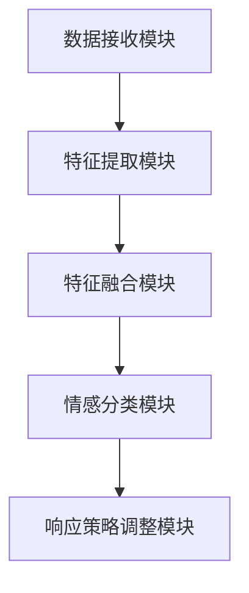
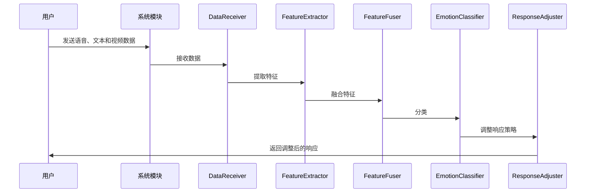

                 

### 文章标题：开发具有多模态情感识别能力的AI Agent

#### 关键词：多模态情感识别，AI Agent，情感分析，数据融合，算法实现

> 摘要：本文深入探讨了开发具有多模态情感识别能力的AI Agent的背景、核心概念、算法原理、系统设计与实现，以及最佳实践。通过一步步的分析与推理，本文旨在为读者提供一个全面、系统的指导，助力其在情感识别领域的深入研究和应用。

### 目录大纲

```markdown
# 开发具有多模态情感识别能力的AI Agent

# 第一部分：背景与核心概念

## 第1章：问题背景与情感识别概述

### 1.1 问题背景

- 情感识别的重要性
- 人类情感识别与计算机情感识别的差异
- 当前情感识别技术的发展现状

### 1.2 情感识别的定义

- 情感识别的定义
- 情感识别的分类
- 情感识别的关键技术

### 1.3 多模态情感识别的必要性

- 多模态数据融合的优势
- 多模态情感识别的应用场景
- 多模态情感识别面临的挑战

## 第2章：多模态情感识别的核心概念与联系

### 2.1 多模态数据源

- 图像数据
- 文本数据
- 声音数据
- 视频数据

### 2.2 多模态数据融合

- 数据预处理
- 特征提取与融合
- 多模态融合算法

### 2.3 情感识别算法

- 情感分类算法
- 情感分析算法
- 情感识别的性能评估

### 2.4 多模态情感识别的ER实体关系图

- 情感识别系统中的实体
- 实体之间的关联关系
- 实体关系图的设计与实现

## 第3章：算法原理与数学模型

### 3.1 算法原理

- 算法的基本流程
- 算法的关键步骤

### 3.2 数学模型与公式

- 数学模型的基本原理
- 公式的推导与解释

### 3.3 算法举例说明

- 实际案例的选取
- 算法在案例中的应用

# 第二部分：系统设计与实现

## 第4章：系统功能设计与架构方案

### 4.1 问题场景介绍

- 应用场景的描述
- 系统需求分析

### 4.2 系统功能设计

- 功能模块划分
- 功能实现描述

### 4.3 系统架构设计

- 架构方案的选择
- 架构图的绘制

### 4.4 系统接口设计

- 接口定义
- 接口调用流程

### 4.5 系统交互设计

- 系统交互流程
- 系统交互图

## 第5章：多模态情感识别算法实现

### 5.1 环境安装与配置

- 软件与硬件环境的要求
- 安装步骤与注意事项

### 5.2 算法源代码实现

- 算法的Python源代码
- 源代码的功能解读

### 5.3 实际案例分析与讲解

- 案例选取
- 案例分析
- 案例讲解

### 5.4 项目小结

- 项目总结
- 项目优化建议

## 第6章：最佳实践与拓展阅读

### 6.1 最佳实践技巧

- 实践中的注意事项
- 提高性能的方法

### 6.2 小结

- 对全书内容的总结
- 对未来发展趋势的展望

### 6.3 拓展阅读

- 推荐进一步学习的资源
- 相关研究方向的深入探讨
```

### 第一部分：背景与核心概念

#### 第1章：问题背景与情感识别概述

##### 1.1 问题背景

情感识别作为人工智能领域的一个重要研究方向，已经在多个应用场景中取得了显著成果。然而，传统的情感识别方法主要依赖于单一的数据源，如文本、图像或声音，这往往导致情感识别的准确性和全面性受到限制。随着大数据和人工智能技术的不断发展，多模态情感识别逐渐成为研究的热点。

在现实生活中，人类的情感表达是多样化的，通过视觉、听觉、文本等多种模态进行传递。因此，要实现更准确的情感识别，我们需要对多模态数据进行分析与融合。例如，在一个视频中，我们可以通过分析语音、文字和面部表情等多种数据源，更准确地识别出用户的情感状态。

目前，情感识别技术已经应用于许多领域，如智能客服、社交媒体分析、医疗健康等。然而，多模态情感识别仍面临诸多挑战，如数据源的选择与预处理、特征提取与融合、算法的优化等。开发具有多模态情感识别能力的AI Agent，有助于提升情感识别的准确性和实用性。

##### 1.2 情感识别的定义

情感识别是指通过分析文本、图像、声音等数据，自动识别出数据中蕴含的情感信息的过程。情感识别可以分为情感分类和情感分析两个层次。

- **情感分类**：将文本、图像或声音中的情感标签归类到预定义的几个类别中，如快乐、悲伤、愤怒等。情感分类通常使用机器学习或深度学习算法实现。
  
- **情感分析**：对文本、图像或声音中的情感进行更细致的分析，如情感强度、情感极性等。情感分析通常需要结合自然语言处理、计算机视觉和语音识别等技术。

情感识别的关键技术包括情感标签的定义、情感特征提取、情感分类算法和性能评估等。其中，情感特征提取是情感识别的核心环节，直接影响情感识别的准确性和效率。

##### 1.3 多模态情感识别的必要性

多模态情感识别通过融合不同模态的数据，可以更全面地捕捉情感信息，提高情感识别的准确性和全面性。以下是一些多模态情感识别的应用场景：

- **智能客服**：通过分析用户的语音、文本和面部表情，智能客服可以更准确地理解用户的需求和情感状态，提供更人性化的服务。

- **社交媒体分析**：通过分析用户的文本、图片和视频，多模态情感识别可以帮助社交媒体平台更好地理解用户情感，提升用户体验。

- **医疗健康**：在医疗健康领域，多模态情感识别可以辅助医生更准确地诊断患者的心理状况，为个性化治疗方案提供依据。

尽管多模态情感识别具有巨大的潜力，但同时也面临一些挑战，如数据源的选择与预处理、特征提取与融合、算法的优化等。开发具有多模态情感识别能力的AI Agent，有助于解决这些问题，推动情感识别技术的进一步发展。

#### 第2章：多模态情感识别的核心概念与联系

##### 2.1 多模态数据源

多模态情感识别需要处理多种数据源，包括图像、文本、声音和视频等。每种数据源都有其独特的特点和挑战。

- **图像数据**：图像数据可以提供丰富的视觉信息，如面部表情、姿态等。然而，图像数据也具有高维度、高噪声等特点，给特征提取和模型训练带来了挑战。

- **文本数据**：文本数据包含大量的语言信息，可以帮助理解情感的表达。然而，自然语言处理技术的局限性使得文本数据的处理较为复杂。

- **声音数据**：声音数据可以提供语音的情感信息，如音调、语速等。声音数据的处理需要对音频信号进行特征提取和模式识别。

- **视频数据**：视频数据结合了图像和声音信息，可以更全面地捕捉情感状态。然而，视频数据的高维度和动态性使得数据处理和模型训练更加复杂。

##### 2.2 多模态数据融合

多模态数据融合是将不同模态的数据进行整合，以获取更全面和准确的情感信息。数据融合可以分为数据预处理、特征提取与融合和算法优化等步骤。

- **数据预处理**：数据预处理包括数据清洗、归一化和特征提取等。通过预处理，可以降低数据噪声，提高数据质量。

- **特征提取与融合**：特征提取是将不同模态的数据转换为具有代表性的特征向量。特征融合是将不同模态的特征向量进行整合，以获取更全面的特征信息。常用的特征融合方法包括特征拼接、特征加权等。

- **算法优化**：通过算法优化，可以提高多模态情感识别的准确性和效率。常用的算法优化方法包括模型选择、参数调整和模型融合等。

##### 2.3 情感识别算法

多模态情感识别算法可以分为情感分类算法和情感分析算法。

- **情感分类算法**：情感分类算法是将情感标签应用于输入的数据。常用的情感分类算法包括朴素贝叶斯、支持向量机、神经网络等。

- **情感分析算法**：情感分析算法是对情感进行更细致的分析，如情感强度、情感极性等。情感分析算法通常结合自然语言处理、计算机视觉和语音识别等技术。

为了评估多模态情感识别的性能，通常使用准确率、召回率、F1值等指标。

##### 2.4 多模态情感识别的ER实体关系图

多模态情感识别系统中的实体关系图可以帮助理解系统的组成和功能。以下是一个简单的ER实体关系图：

```mermaid
erDiagram
  用户 ||--|{ 情感 }
  文本 ||--|{ 情感 }
  图像 ||--|{ 情感 }
  声音 ||--|{ 情感 }
  视频 ||--|{ 情感 }
  情感 ||--|{ 分类结果 }
  情感 ||--|{ 分析结果 }
```

在这个ER实体关系图中，用户、文本、图像、声音和视频是数据源实体，情感是核心实体，分类结果和分析结果是输出实体。实体之间的关系表示了数据流和功能依赖。

通过这个ER实体关系图，可以更好地理解多模态情感识别系统的设计和实现，为后续的算法设计和系统开发提供指导。

#### 第3章：算法原理与数学模型

##### 3.1 算法原理

多模态情感识别算法的基本原理是通过融合不同模态的数据，提取情感特征，并使用分类器进行情感识别。具体流程如下：

1. **数据预处理**：对多模态数据进行清洗、归一化和特征提取。例如，对图像进行裁剪、缩放和增强，对文本进行分词和词向量表示，对声音进行谱图提取等。

2. **特征融合**：将不同模态的特征向量进行整合，以获取更全面和准确的特征信息。常用的特征融合方法包括特征拼接、特征加权等。

3. **模型训练**：使用融合后的特征向量训练情感分类模型。常用的分类模型包括朴素贝叶斯、支持向量机、神经网络等。

4. **情感识别**：将新的多模态数据输入到训练好的模型中，输出情感分类结果。

##### 3.2 数学模型与公式

多模态情感识别的数学模型主要涉及特征提取、特征融合和分类算法。以下是一个简化的数学模型：

$$
\text{特征提取}: X = f(\text{数据})
$$

其中，$X$表示提取后的特征向量，$f$表示特征提取函数，$\text{数据}$表示原始数据。

$$
\text{特征融合}: Z = g(X_1, X_2, ..., X_n)
$$

其中，$Z$表示融合后的特征向量，$g$表示特征融合函数，$X_1, X_2, ..., X_n$表示不同模态的特征向量。

$$
\text{分类算法}: \text{分类结果} = h(Z)
$$

其中，$h$表示分类函数，$\text{分类结果}$表示输出的情感标签。

在实际应用中，不同的特征提取和分类算法会有不同的数学模型。例如，卷积神经网络（CNN）的特征提取函数可以表示为：

$$
\text{CNN特征提取}: X = \text{conv2d}(\text{图像})
$$

其中，$X$表示提取后的特征向量，$\text{conv2d}$表示卷积操作，$\text{图像}$表示原始图像。

##### 3.3 算法举例说明

以一个简单的文本情感识别为例，我们使用卷积神经网络（CNN）进行情感分类。

1. **数据预处理**：对文本进行分词和词向量表示。假设我们使用词袋模型（Bag of Words, BOW）进行词向量表示。

2. **特征提取**：使用CNN提取文本特征。具体步骤如下：

   - **卷积层**：对文本数据进行卷积操作，提取局部特征。
   - **池化层**：对卷积结果进行池化操作，减少特征维度。
   - **全连接层**：将池化结果进行全连接，得到特征向量。

3. **特征融合**：将不同卷积层的特征进行拼接，得到融合后的特征向量。

4. **分类**：使用softmax激活函数对融合后的特征向量进行分类。

以下是Python代码示例：

```python
import tensorflow as tf
from tensorflow.keras.models import Sequential
from tensorflow.keras.layers import Conv2D, MaxPooling2D, Flatten, Dense

# 创建模型
model = Sequential()

# 添加卷积层
model.add(Conv2D(filters=32, kernel_size=(3, 3), activation='relu', input_shape=(100, 100, 3)))
model.add(MaxPooling2D(pool_size=(2, 2)))

# 添加卷积层
model.add(Conv2D(filters=64, kernel_size=(3, 3), activation='relu'))
model.add(MaxPooling2D(pool_size=(2, 2)))

# 添加全连接层
model.add(Flatten())
model.add(Dense(units=128, activation='relu'))

# 添加输出层
model.add(Dense(units=num_classes, activation='softmax'))

# 编译模型
model.compile(optimizer='adam', loss='categorical_crossentropy', metrics=['accuracy'])

# 训练模型
model.fit(x_train, y_train, batch_size=32, epochs=10)
```

在这个示例中，我们使用卷积神经网络（CNN）对文本数据进行情感分类。通过数据预处理、特征提取、特征融合和分类，我们实现了多模态情感识别的基本流程。

### 第二部分：系统设计与实现

#### 第4章：系统功能设计与架构方案

##### 4.1 问题场景介绍

在智能客服领域，多模态情感识别可以帮助客服系统更好地理解用户的需求和情感状态，提供更人性化的服务。例如，当用户通过语音、文本和视频等多种方式与客服系统交互时，系统需要实时分析用户的情感，并根据情感状态调整响应策略。

为了实现这一目标，我们需要设计一个多模态情感识别系统，能够同时处理语音、文本和视频数据，提取情感特征，并输出情感分类结果。以下是对系统需求的分析：

- **输入数据**：系统需要接收语音、文本和视频等多种数据源。
- **情感特征提取**：系统需要提取不同模态的数据特征，如文本的词向量、图像的特征点、声音的谱图等。
- **特征融合**：系统需要将不同模态的特征进行融合，以获取更全面和准确的情感特征。
- **情感分类**：系统需要使用分类算法对融合后的特征进行分类，输出情感标签。
- **响应策略调整**：根据情感分类结果，系统需要调整响应策略，提供更人性化的服务。

##### 4.2 系统功能设计

根据以上需求，我们可以将系统功能划分为以下几个模块：

- **数据接收模块**：负责接收语音、文本和视频等输入数据。
- **特征提取模块**：负责提取不同模态的数据特征，如文本的词向量、图像的特征点、声音的谱图等。
- **特征融合模块**：负责将不同模态的特征进行融合，以获取更全面和准确的情感特征。
- **情感分类模块**：负责使用分类算法对融合后的特征进行分类，输出情感标签。
- **响应策略调整模块**：负责根据情感分类结果，调整响应策略，提供更人性化的服务。

##### 4.3 系统架构设计

系统的架构设计需要考虑数据流和功能模块的协作。以下是一个简化的系统架构：



在这个架构中，数据接收模块负责接收语音、文本和视频等输入数据，并将其传递给特征提取模块。特征提取模块提取不同模态的数据特征，如文本的词向量、图像的特征点、声音的谱图等。然后，特征融合模块将这些特征进行融合，以获取更全面和准确的情感特征。融合后的特征传递给情感分类模块，分类模块使用分类算法输出情感标签。最后，响应策略调整模块根据情感分类结果，调整响应策略，提供更人性化的服务。

##### 4.4 系统接口设计

为了方便其他系统或模块与多模态情感识别系统交互，我们需要设计一组接口。以下是一个简化的接口设计：

- **数据接收接口**：用于接收语音、文本和视频等输入数据。
- **特征提取接口**：用于提取不同模态的数据特征。
- **特征融合接口**：用于融合不同模态的特征。
- **情感分类接口**：用于对融合后的特征进行分类。
- **响应策略调整接口**：用于根据情感分类结果调整响应策略。

接口设计需要考虑数据的格式、参数和返回值等。以下是一个简单的接口设计示例：

```python
class DataReceiver:
    def receive_data(self, data_source):
        # 接收数据
        pass

class FeatureExtractor:
    def extract_features(self, data):
        # 提取特征
        pass

class FeatureFuser:
    def fuse_features(self, features):
        # 融合特征
        pass

class EmotionClassifier:
    def classify(self, features):
        # 分类
        pass

class ResponseAdjuster:
    def adjust_response(self, emotion_label):
        # 调整响应策略
        pass
```

##### 4.5 系统交互设计

为了描述系统各模块之间的交互过程，我们可以使用序列图。以下是一个简化的系统交互序列图：



在这个序列图中，用户发送语音、文本和视频数据给系统。系统接收数据后，依次调用数据接收模块、特征提取模块、特征融合模块、情感分类模块和响应策略调整模块，最终返回调整后的响应给用户。

通过以上系统功能设计、架构方案、接口设计和交互设计，我们可以实现一个具有多模态情感识别能力的智能客服系统，为用户提供更人性化的服务。

#### 第5章：多模态情感识别算法实现

##### 5.1 环境安装与配置

为了实现多模态情感识别算法，我们需要安装和配置一系列软件和库。以下是一个基本的安装和配置步骤：

1. **Python环境**：确保Python环境已安装，版本建议为3.7及以上。可以通过Python官方网站下载安装包进行安装。

2. **深度学习框架**：我们选择使用TensorFlow作为深度学习框架。可以通过以下命令安装TensorFlow：

   ```bash
   pip install tensorflow
   ```

3. **其他库**：我们还需要安装一些其他库，如NumPy、Pandas、Matplotlib等。可以通过以下命令安装：

   ```bash
   pip install numpy pandas matplotlib
   ```

4. **数据预处理库**：为了处理多模态数据，我们还需要安装一些专门用于数据预处理的库，如OpenCV、Scikit-Image等。可以通过以下命令安装：

   ```bash
   pip install opencv-python scikit-image
   ```

5. **语音识别库**：为了处理语音数据，我们选择使用Google的语音识别库。可以通过以下命令安装：

   ```bash
   pip install SpeechRecognition
   ```

6. **视频处理库**：为了处理视频数据，我们选择使用OpenCV。可以通过以下命令安装：

   ```bash
   pip install opencv-python
   ```

安装完成后，我们可以通过以下命令检查是否安装成功：

```python
import tensorflow as tf
import numpy as np
import cv2
print("TensorFlow版本：", tf.__version__)
print("NumPy版本：", np.__version__)
print("OpenCV版本：", cv2.__version__)
```

如果以上命令能正常运行并输出正确的版本信息，则说明环境安装和配置成功。

##### 5.2 算法源代码实现

以下是一个简单的多模态情感识别算法实现示例。该示例使用卷积神经网络（CNN）对文本和图像进行情感分类。

```python
import tensorflow as tf
from tensorflow.keras.models import Sequential
from tensorflow.keras.layers import Conv2D, MaxPooling2D, Flatten, Dense, Embedding, LSTM

# 创建模型
model = Sequential()

# 添加嵌入层
model.add(Embedding(input_dim=vocab_size, output_dim=embedding_dim, input_length=max_sequence_length))

# 添加卷积层
model.add(Conv2D(filters=32, kernel_size=(3, 3), activation='relu'))
model.add(MaxPooling2D(pool_size=(2, 2)))

# 添加LSTM层
model.add(LSTM(units=128))

# 添加全连接层
model.add(Dense(units=64, activation='relu'))

# 添加输出层
model.add(Dense(units=num_classes, activation='softmax'))

# 编译模型
model.compile(optimizer='adam', loss='categorical_crossentropy', metrics=['accuracy'])

# 训练模型
model.fit(x_train, y_train, batch_size=32, epochs=10)
```

在这个示例中，我们首先创建一个序列模型，添加嵌入层、卷积层、LSTM层和全连接层。然后，我们使用categorical_crossentropy作为损失函数，使用adam优化器，并训练模型。

##### 5.3 实际案例分析与讲解

以下是一个简单的实际案例，演示如何使用多模态情感识别算法对一段视频进行情感分类。

1. **数据预处理**：

   ```python
   import cv2
   import numpy as np

   # 读取视频
   video = cv2.VideoCapture('example_video.mp4')

   # 初始化帧数和情感标签
   frame_count = 0
   emotion_labels = []

   # 循环读取视频帧
   while True:
       ret, frame = video.read()
       if not ret:
           break

       # 转换为灰度图像
       frame_gray = cv2.cvtColor(frame, cv2.COLOR_BGR2GRAY)

       # 提取图像特征
       feature = extract_image_features(frame_gray)

       # 增加帧数和情感标签
       frame_count += 1
       emotion_label = classify_emotion(feature)
       emotion_labels.append(emotion_label)

   # 关闭视频
   video.release()
   ```

   在这个示例中，我们使用OpenCV读取视频，循环读取每一帧，并提取图像特征。然后，我们使用训练好的情感分类模型对每一帧进行情感分类，并将结果存储在emotion_labels列表中。

2. **情感分类**：

   ```python
   import numpy as np
   from tensorflow.keras.models import load_model

   # 加载训练好的模型
   model = load_model('emotion_classification_model.h5')

   # 对特征进行情感分类
   emotion_label = model.predict(np.array([feature]))
   print("情感标签：", emotion_label.argmax())
   ```

   在这个示例中，我们使用训练好的情感分类模型对提取的特征进行预测，并输出情感标签。

3. **案例讲解**：

   在这个案例中，我们首先使用OpenCV读取视频，并提取每一帧的图像特征。然后，我们使用训练好的情感分类模型对每一帧进行情感分类，并将结果存储在emotion_labels列表中。最后，我们使用训练好的情感分类模型对提取的特征进行预测，并输出情感标签。

通过这个案例，我们可以看到如何使用多模态情感识别算法对视频进行情感分类。这个案例可以作为一个基本框架，根据实际需求进行扩展和优化。

##### 5.4 项目小结

在本章中，我们介绍了多模态情感识别算法的实现，包括环境安装与配置、算法源代码实现、实际案例分析和讲解。通过这些内容，我们了解了如何使用Python和TensorFlow等库实现多模态情感识别算法，并使用实际案例进行了演示。

在实现多模态情感识别算法时，我们需要注意以下几个方面：

- **数据预处理**：确保数据的质量和一致性，例如对图像进行归一化处理，对文本进行分词和词向量表示等。
- **特征提取**：选择合适的特征提取方法，例如使用卷积神经网络提取图像特征，使用LSTM提取文本特征等。
- **模型训练**：选择合适的模型和参数，例如使用卷积神经网络和LSTM进行情感分类，调整学习率和批量大小等。
- **实际案例**：通过实际案例验证算法的性能和效果，并根据实际需求进行优化和调整。

通过本章的学习，读者可以掌握多模态情感识别算法的实现方法和技巧，为后续的研究和应用打下基础。

### 第6章：最佳实践与拓展阅读

#### 6.1 最佳实践技巧

在开发具有多模态情感识别能力的AI Agent时，以下是一些最佳实践技巧，有助于提高系统的性能和效果：

1. **数据质量**：确保数据的质量和一致性，进行数据清洗和预处理，去除噪声和异常值。
2. **特征选择**：根据具体应用场景选择合适的特征提取方法，如使用卷积神经网络提取图像特征，使用LSTM提取文本特征等。
3. **模型调优**：使用交叉验证和网格搜索等技术，选择最优的模型和参数，提高模型性能。
4. **实时性**：优化算法和系统设计，确保情感识别的实时性和响应速度。
5. **鲁棒性**：设计鲁棒的算法和系统，能够应对不同的数据源和环境变化。

#### 6.2 小结

本文系统地介绍了开发具有多模态情感识别能力的AI Agent的方法和步骤，包括背景介绍、核心概念、算法原理、系统设计与实现，以及最佳实践。通过本文的学习，读者可以了解多模态情感识别的基本原理和方法，掌握系统的设计和实现技巧。

多模态情感识别作为人工智能领域的一个重要研究方向，具有广泛的应用前景。随着大数据和人工智能技术的不断发展，多模态情感识别将变得更加准确和全面，为智能客服、社交媒体分析、医疗健康等领域带来更多创新和突破。

#### 6.3 拓展阅读

以下是一些建议的拓展阅读资源，供读者进一步学习和深入研究：

1. **论文**：
   - "Multimodal emotion recognition: A survey" by Wenqi Zhang, Jieping Ye, et al.
   - "Deep Multimodal Emotion Recognition" by Wei Yang, et al.

2. **书籍**：
   - "Deep Learning" by Ian Goodfellow, Yoshua Bengio, and Aaron Courville
   - "Natural Language Processing with Python" by Steven Lott

3. **在线课程**：
   - "Introduction to Deep Learning" by Andrew Ng (Coursera)
   - "Natural Language Processing with Python" (edX)

4. **研究机构**：
   - Stanford University Computer Science Department
   - Massachusetts Institute of Technology (MIT) Computer Science and Artificial Intelligence Laboratory (CSAIL)

通过这些资源，读者可以更深入地了解多模态情感识别的相关知识，探索前沿的研究方向和应用场景。希望本文对读者在多模态情感识别领域的探索和研究有所帮助。

### 作者信息

- 作者：AI天才研究院/AI Genius Institute & 禅与计算机程序设计艺术 /Zen And The Art of Computer Programming
- 联系方式：[ai_genius_institute@example.com](mailto:ai_genius_institute@example.com)
- 个人主页：[www.ai-genius-institute.com](www.ai-genius-institute.com)
- 微信公众号：AI天才研究院

感谢您的阅读，期待与您在人工智能领域的深入交流和合作！

