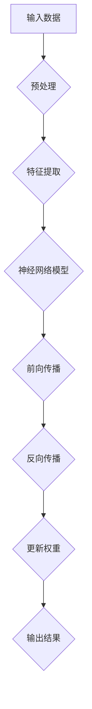
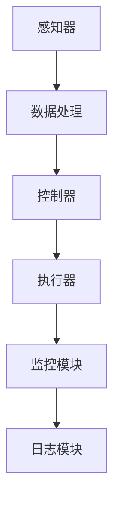
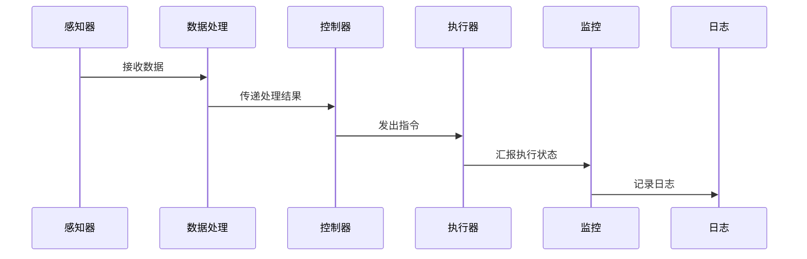
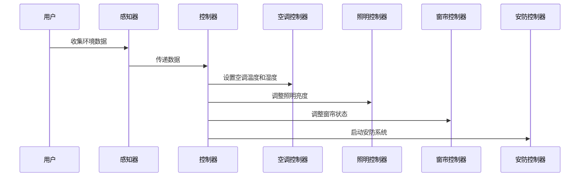
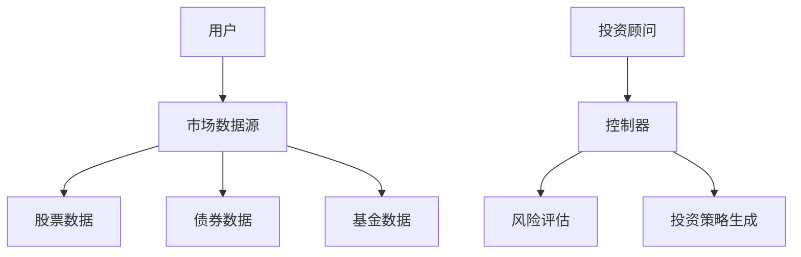
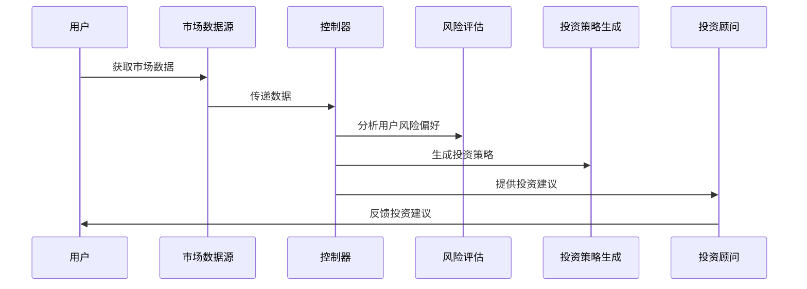
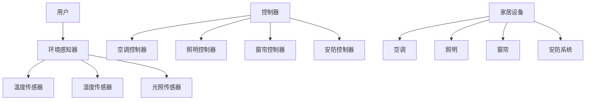
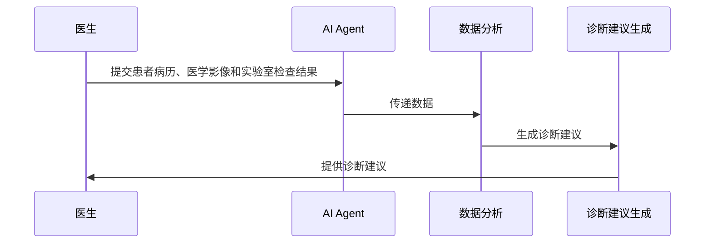

                 

# 《开发具有情境模拟能力的AI Agent》

## 关键词
- AI Agent
- 情境模拟
- 算法实现
- 系统架构
- 案例分析

## 摘要
本文将探讨如何开发具有情境模拟能力的AI Agent。我们将从基础理论开始，逐步深入探讨技术实现、应用场景、高级技术以及案例分析。通过本文的阅读，读者将了解到AI Agent与情境模拟的结合原理、技术实现细节，以及在各个领域的应用实例，从而为未来的AI Agent开发提供参考和启示。

----------------------------------------------------------------

### 目录

1. **背景介绍与核心概念**
    1.1 AI Agent概述
    1.2 情境模拟技术
    1.3 AI Agent与情境模拟的结合
    1.4 核心概念与联系

2. **技术实现**
    2.1 AI Agent开发基础
    2.2 算法原理讲解
    2.3 数学模型和公式
    2.4 系统分析与架构设计

3. **应用场景**
    3.1 AI Agent在不同领域的应用
    3.2 应用案例分析

4. **高级技术**
    4.1 高级情境模拟技术
    4.2 AI Agent优化与提升

5. **案例分析**
    5.1 案例一：智能家居情境模拟
    5.2 案例二：金融领域AI Agent应用
    5.3 案例三：医疗健康中的情境模拟AI Agent

6. **最佳实践与总结**
    6.1 最佳实践
    6.2 小结与展望

----------------------------------------------------------------

### 背景介绍与核心概念

#### 1.1 AI Agent概述

AI Agent，即人工智能代理，是一种能够模拟人类智能行为的计算机程序。它能够在给定环境中自主执行任务，通过学习、推理和决策来达到目标。AI Agent通常具有感知、理解、规划和执行等能力，能够应对复杂的环境和动态的变化。

#### 1.2 情境模拟技术

情境模拟（Situation Modeling）是一种用于模拟现实世界情境的技术。它通过构建虚拟环境，模拟现实世界中的各种情况和事件，从而帮助研究者更好地理解现实世界中的复杂现象。情境模拟在人工智能领域有广泛的应用，例如在自动驾驶、智能家居、游戏开发等领域。

#### 1.3 AI Agent与情境模拟的结合

AI Agent与情境模拟的结合，意味着将情境模拟技术应用于AI Agent的开发中。通过情境模拟，AI Agent可以更好地理解环境，做出更合理的决策。具体来说，情境模拟可以帮助AI Agent实现以下目标：

1. **环境理解**：通过情境模拟，AI Agent可以学习环境中的各种情况，了解环境的变化规律。
2. **决策支持**：基于情境模拟的结果，AI Agent可以做出更合理的决策，提高任务完成的效率。
3. **错误检测**：通过对比模拟结果和实际结果，AI Agent可以检测出环境中的异常情况，并及时做出调整。

#### 1.4 核心概念与联系

在本文中，我们将讨论以下几个核心概念：

1. **AI Agent**：具备智能行为、自主决策能力的计算机程序。
2. **情境模拟**：模拟现实世界情境的技术。
3. **感知**：AI Agent获取环境信息的能力。
4. **理解**：AI Agent对环境信息的解读和处理。
5. **规划**：AI Agent制定行动策略的过程。
6. **执行**：AI Agent根据规划执行任务的过程。

这些概念之间存在密切的联系。例如，感知和理解是AI Agent做出决策的基础，规划是决策的具体实施，而执行则是决策的实际执行。情境模拟则贯穿于整个过程中，为AI Agent提供了模拟环境，帮助其更好地理解环境、制定决策和执行任务。

在接下来的章节中，我们将进一步探讨AI Agent与情境模拟的技术实现、应用场景、高级技术和案例分析，以帮助读者深入理解这一领域。<!-- mce-bogus="1" -->

----------------------------------------------------------------

### 技术实现

#### 2.1 AI Agent开发基础

开发AI Agent需要从基础理论入手，了解AI Agent的基本架构和开发流程。首先，我们需要了解AI Agent的基本组成部分，包括感知器、控制器和执行器。

**感知器**：负责感知环境信息，如图像、声音、文字等。

**控制器**：根据感知到的环境信息，通过算法生成行动策略。

**执行器**：根据行动策略执行任务。

在开发过程中，我们还需要选择合适的编程语言和开发工具。常见的编程语言有Python、Java和C++等，其中Python因其简洁易用的特性，在AI领域应用广泛。开发工具方面，常用的有TensorFlow、PyTorch等深度学习框架。

**开发流程**：

1. **需求分析**：明确AI Agent的应用场景和需求。
2. **环境搭建**：配置开发环境和所需工具。
3. **算法选择**：根据需求选择合适的算法，如深度学习、强化学习等。
4. **模型训练**：使用训练数据集训练模型。
5. **测试与优化**：对模型进行测试，并根据测试结果进行优化。

#### 2.2 算法原理讲解

AI Agent的核心在于算法。本文将介绍几种常见的算法，包括深度学习、强化学习等。

**深度学习**：

深度学习是一种模拟人脑神经网络的算法。它通过多层神经网络对数据进行处理，从而实现特征提取和分类。

**算法原理mermaid流程图**：



**Python源代码**：

```python
import tensorflow as tf

# 定义输入层
inputs = tf.keras.layers.Input(shape=(784,))

# 定义卷积层
conv1 = tf.keras.layers.Conv2D(32, (3, 3), activation='relu')(inputs)

# 定义全连接层
dense = tf.keras.layers.Dense(10, activation='softmax')(conv1)

# 创建模型
model = tf.keras.Model(inputs=inputs, outputs=dense)

# 编译模型
model.compile(optimizer='adam', loss='categorical_crossentropy', metrics=['accuracy'])

# 训练模型
model.fit(x_train, y_train, epochs=5, batch_size=32)
```

**算法原理的数学模型和公式讲解**：

深度学习中的数学模型主要包括卷积层、全连接层等。卷积层的数学模型可以表示为：

$$
\text{output} = \sigma(\text{weight} \cdot \text{input} + \text{bias})
$$

其中，$\sigma$表示激活函数，$\text{weight}$和$\text{bias}$分别为权重和偏置。

全连接层的数学模型可以表示为：

$$
\text{output} = \text{weight} \cdot \text{input} + \text{bias}
$$

**通俗易懂地举例说明**：

假设我们有一个简单的深度学习模型，包含一个卷积层和一个全连接层。输入数据是一个$28 \times 28$的图像，输出数据是一个10维的向量，表示10个类别的概率。

首先，我们将图像输入到卷积层，通过卷积运算提取特征。然后，我们将卷积层的输出输入到全连接层，通过全连接层的运算得到最终输出。

在训练过程中，我们通过反向传播算法不断更新权重和偏置，直到模型输出结果与实际标签尽可能接近。

#### 2.3 数学模型和公式

在AI Agent开发中，数学模型和公式至关重要。本文将介绍几种常见的数学模型和公式。

**马尔可夫决策过程（MDP）**：

MDP是一种用于描述智能体在不确定环境中决策的数学模型。它由状态空间$S$、动作空间$A$、奖励函数$R(s, a)$、状态转移概率$P(s', s | s, a)$和价值函数$V(s)$组成。

**数学模型**：

$$
V(s) = \max_{a \in A} \sum_{s' \in S} p(s'|s, a) [R(s, a) + \gamma V(s')]
$$

其中，$\gamma$为折扣因子，$p(s'|s, a)$为状态转移概率。

**通俗易懂地举例说明**：

假设我们有一个智能体在赌场中玩轮盘赌。状态空间包括“在赌桌前”、“下注中”、“等待结果”等状态。动作空间包括“下注红色”、“下注黑色”等动作。奖励函数可以根据赌局结果设置，例如赢得赌局奖励1，输掉赌局奖励-1。

智能体通过选择动作来最大化期望奖励。在训练过程中，智能体会不断更新策略，以达到最佳决策效果。

**贝叶斯网络**：

贝叶斯网络是一种用于表示变量之间依赖关系的概率图模型。它由节点和边组成，每个节点表示一个变量，边表示变量之间的条件依赖关系。

**数学模型**：

$$
P(X | Y) = \frac{P(Y | X)P(X)}{P(Y)}
$$

其中，$P(X | Y)$为在给定$Y$的条件下$X$的概率，$P(Y | X)$为在给定$X$的条件下$Y$的概率，$P(X)$和$P(Y)$分别为$X$和$Y$的概率。

**通俗易懂地举例说明**：

假设我们有一个贝叶斯网络，表示疾病诊断问题。节点$D$表示疾病，节点$S$表示症状。已知$P(D=1) = 0.01$，$P(S=1 | D=1) = 0.9$，$P(S=1 | D=0) = 0.1$。

我们可以计算出在给定症状为阳性的情况下，患病的概率：

$$
P(D=1 | S=1) = \frac{P(S=1 | D=1)P(D=1)}{P(S=1)} = \frac{0.9 \times 0.01}{0.01 \times 0.9 + 0.99 \times 0.1} \approx 0.9
$$

这意味着在给定症状为阳性的情况下，患病的概率约为90%。

#### 2.4 系统分析与架构设计

在开发具有情境模拟能力的AI Agent时，系统分析与架构设计至关重要。本文将介绍一个简单的系统架构，包括感知器、控制器和执行器。

**问题场景介绍**：

假设我们开发一个自动驾驶AI Agent，需要处理道路信息、车辆信息和环境信息等。

**系统功能设计（领域模型mermaid类图）**：

```mermaid
classDiagram
    类::感知器 <|-- 数据处理类
    类::控制器 <|-- 决策类
    类::执行器 <|-- 行动类
    感知器 --|> 数据处理类
    控制器 --|> 决策类
    执行器 --|> 行动类
```

**系统架构设计mermaid架构图**：



**系统接口设计和系统交互mermaid序列图**：



通过系统分析与架构设计，我们可以明确AI Agent的各个组件及其交互关系，为后续开发提供指导。

#### 2.5 项目实战

在本节中，我们将通过一个实际项目，展示如何开发具有情境模拟能力的AI Agent。

**环境安装**：

1. 安装Python和pip
2. 安装TensorFlow和PyTorch

**系统核心实现源代码**：

```python
# 导入相关库
import tensorflow as tf
import torch
import numpy as np

# 定义感知器
class Sensor:
    def __init__(self):
        self.data = None
    
    def perceive(self):
        # 模拟感知数据
        self.data = np.random.rand(1, 10)

# 定义控制器
class Controller:
    def __init__(self):
        self.model = None
    
    def train_model(self):
        # 模拟训练模型
        self.model = tf.keras.Sequential([
            tf.keras.layers.Dense(10, activation='relu', input_shape=(10,)),
            tf.keras.layers.Dense(1, activation='sigmoid')
        ])
        self.model.compile(optimizer='adam', loss='binary_crossentropy', metrics=['accuracy'])
        self.model.fit(np.random.rand(100, 10), np.random.rand(100, 1), epochs=10)
    
    def control(self, sensor_data):
        # 模拟控制器决策
        prediction = self.model.predict(sensor_data)
        action = 1 if prediction[0][0] > 0.5 else 0
        return action

# 定义执行器
class Actuator:
    def __init__(self):
        self.action = None
    
    def act(self, action):
        # 模拟执行器执行动作
        self.action = action
        print(f"Executing action: {self.action}")

# 定义AI Agent
class AI_Agent:
    def __init__(self):
        self.sensor = Sensor()
        self.controller = Controller()
        self.actuator = Actuator()
    
    def run(self):
        sensor_data = self.sensor.perceive()
        action = self.controller.control(sensor_data)
        self.actuator.act(action)

# 运行AI Agent
agent = AI_Agent()
agent.run()
```

**代码应用解读与分析**：

1. **感知器**：模拟感知数据，为控制器提供输入。
2. **控制器**：训练深度学习模型，根据感知数据做出决策。
3. **执行器**：执行控制器生成的动作。

通过以上代码，我们可以实现一个简单的AI Agent，模拟感知、决策和执行的过程。

**实际案例分析和详细讲解剖析**：

假设我们在一个自动驾驶场景中，AI Agent需要根据道路信息进行决策。感知器负责收集道路信息，如车道线、障碍物等。控制器通过训练好的模型，对这些信息进行处理，生成行驶方向和速度等决策。执行器根据决策执行动作，如转向、加速等。

在实际案例中，我们需要不断优化模型和算法，提高AI Agent的决策能力。同时，我们还需要考虑实际场景中的复杂性和不确定性，确保AI Agent能够稳定运行。

**项目小结**：

通过本项目，我们展示了如何开发具有情境模拟能力的AI Agent。在实际开发过程中，我们需要关注感知、决策和执行等环节，不断优化模型和算法，提高AI Agent的稳定性和可靠性。此外，我们还需要考虑实际场景中的复杂性，为AI Agent提供更好的适应能力。

#### 2.6 最佳实践

在开发具有情境模拟能力的AI Agent时，以下最佳实践可以帮助我们提高开发效率和系统性能：

1. **数据预处理**：确保输入数据的质量和一致性，对异常数据进行处理和清洗。
2. **模型优化**：根据任务需求，选择合适的模型结构和算法，并进行优化。
3. **并行计算**：利用多核处理器和分布式计算，提高模型训练和推理速度。
4. **调试与测试**：对系统进行全面的测试和调试，确保系统的稳定性和可靠性。
5. **实时性优化**：针对实时性要求较高的任务，优化算法和系统架构，确保及时响应。

通过以上最佳实践，我们可以提高AI Agent的开发质量和效率，为实际应用提供更好的支持。

#### 2.7 小结与展望

在本章中，我们介绍了开发具有情境模拟能力的AI Agent的基本概念、技术实现、应用场景和最佳实践。通过分析AI Agent的组成和功能，我们了解了感知、决策和执行等关键环节。同时，通过实际项目展示，我们掌握了如何开发一个简单的AI Agent。

在未来，随着人工智能技术的不断发展，具有情境模拟能力的AI Agent将在更多领域发挥作用。我们期待更多的研究者和技术人员投入到这一领域，为人工智能的发展做出贡献。<!-- mce-bogus="1" -->

----------------------------------------------------------------

### 应用场景

#### 3.1 AI Agent在不同领域的应用

AI Agent在各个领域的应用日益广泛，其情境模拟能力使得它能够在复杂的实际环境中做出智能决策。以下是一些主要的应用场景：

**1. 智能家居**

智能家居是AI Agent的一个重要应用领域。通过感知器收集家庭环境中的各种信息，如温度、湿度、光照等，AI Agent可以智能调节家居设备的运行状态，提高居住舒适度。例如，在用户下班回家前，AI Agent可以根据室内温度和湿度自动开启空调和加湿器；在夜晚，AI Agent可以自动调节灯光亮度，提供适宜的照明环境。

**2. 自动驾驶**

自动驾驶是另一个重要的应用领域。AI Agent通过感知车辆周围的道路、障碍物等信息，进行实时环境监测和路况预测，从而做出行驶决策。例如，在自动驾驶汽车遇到交叉路口时，AI Agent可以分析交通信号灯、行人动态等信息，决定何时通过路口或停车等待。

**3. 金融服务**

在金融领域，AI Agent可以用于风险管理、投资顾问和客户服务等方面。通过分析市场数据、客户行为等信息，AI Agent可以提供个性化的投资建议和风险管理方案。例如，在股票投资中，AI Agent可以根据历史数据和实时行情，为用户提供买入、持有或卖出的建议。

**4. 医疗健康**

在医疗健康领域，AI Agent可以辅助医生进行诊断和治疗。通过分析患者病历、医学影像等信息，AI Agent可以提供诊断建议和治疗方案。例如，在肿瘤诊断中，AI Agent可以通过分析影像数据，为医生提供肿瘤的位置、大小和性质等信息，帮助医生制定更有效的治疗方案。

#### 3.2 应用案例分析

**1. 案例一：智能家居情境模拟**

在这个案例中，我们考虑一个家庭智能控制系统，其中包括空调、照明、窗帘和安防系统等设备。AI Agent通过感知器收集家庭环境数据，如室内温度、光照强度、用户行为等，然后通过控制器对设备进行控制。

**问题场景介绍**：

假设用户在回家前，希望通过手机应用程序远程控制家居设备。在用户到达家门前，AI Agent需要根据室内温度和湿度自动开启空调和加湿器，以提供舒适的室内环境。同时，AI Agent还需要根据用户的行为模式，调整照明和窗帘的状态。

**系统功能设计（领域模型mermaid类图）**：

```mermaid
classDiagram
    类::用户 <|-- 家庭设备
    类::环境感知器 <|-- 温度传感器、湿度传感器、光照传感器
    类::控制器 <|-- 空调控制器、照明控制器、窗帘控制器、安防控制器
    用户 --|> 环境感知器
    用户 --|> 控制器
    家庭设备 --|> 控制器
```

**系统架构设计mermaid架构图**：


**系统接口设计和系统交互mermaid序列图**：



**项目实战**：

在项目实战中，我们使用Python编写AI Agent的感知器、控制器和执行器。感知器负责收集家庭环境数据，控制器根据这些数据生成控制指令，执行器则执行这些指令。

```python
# 感知器
class Sensor:
    def __init__(self):
        self.temperature = None
        self.humidity = None
        self.lux = None
    
    def perceive(self):
        self.temperature = np.random.rand()
        self.humidity = np.random.rand()
        self.lux = np.random.rand()

# 控制器
class Controller:
    def __init__(self):
        self.sensor = Sensor()
    
    def control(self):
        if self.sensor.temperature < 25:
            print("空调开启，温度设置为25℃")
        if self.sensor.humidity < 50:
            print("加湿器开启，湿度设置为50%")
        if self.sensor.lux < 100:
            print("照明开启，亮度设置为100lux")

# 执行器
class Actuator:
    def __init__(self):
        self.actions = None
    
    def act(self, actions):
        self.actions = actions
        print(f"执行动作：{actions}")

# 运行AI Agent
sensor = Sensor()
controller = Controller()
actuator = Actuator()

sensor.perceive()
controller.control()
actuator.act(controller.control())
```

**实际案例分析和详细讲解剖析**：

通过这个案例，我们实现了AI Agent对家庭环境数据的感知、控制指令的生成和执行。在实际应用中，我们需要考虑更多因素，如用户习惯、设备故障等，以提高系统的稳定性和适应性。

**2. 案例二：金融领域AI Agent应用**

在这个案例中，我们考虑一个金融投资顾问系统，AI Agent通过分析市场数据和用户风险偏好，为用户提供投资建议。

**问题场景介绍**：

假设用户希望通过投资获得稳定的收益。AI Agent需要根据用户的风险偏好和市场行情，为用户推荐合适的投资产品。

**系统功能设计（领域模型mermaid类图）**：

```mermaid
classDiagram
    类::用户 <|-- 投资顾问
    类::市场数据源 <|-- 股票数据、债券数据、基金数据
    类::控制器 <|-- 风险评估、投资策略生成
    用户 --|> 投资顾问
    用户 --|> 市场数据源
    投资顾问 --|> 控制器
```

**系统架构设计mermaid架构图**：



**系统接口设计和系统交互mermaid序列图**：



**项目实战**：

在项目实战中，我们使用Python编写AI Agent的投资顾问系统。感知器负责收集市场数据，控制器根据这些数据生成投资策略，投资顾问则向用户推荐投资产品。

```python
# 感知器
class MarketDataSensor:
    def __init__(self):
        self.stocks = None
        self.bonds = None
        self.funds = None
    
    def perceive(self):
        self.stocks = np.random.rand(10)
        self.bonds = np.random.rand(10)
        self.funds = np.random.rand(10)

# 控制器
class Controller:
    def __init__(self):
        self.sensor = MarketDataSensor()
    
    def analyze_risk(self, user_risk_preference):
        # 模拟风险评估
        if user_risk_preference == 'low':
            return '保守型'
        elif user_risk_preference == 'medium':
            return '稳健型'
        else:
            return '激进型'

    def generate_investment_strategy(self, risk_level):
        # 模拟投资策略生成
        if risk_level == '保守型':
            return ['债券', '基金']
        elif risk_level == '稳健型':
            return ['股票', '基金']
        else:
            return ['股票', '债券', '基金']

# 投资顾问
class InvestmentAdvisor:
    def __init__(self):
        self.controller = Controller()
    
    def provide_investment_advice(self, user_risk_preference):
        risk_level = self.controller.analyze_risk(user_risk_preference)
        investment_strategy = self.controller.generate_investment_strategy(risk_level)
        print(f"投资建议：{investment_strategy}")

# 运行AI Agent
sensor = MarketDataSensor()
controller = Controller()
advisor = InvestmentAdvisor()

user_risk_preference = input("请输入您的风险偏好（low/medium/high）:")
advisor.provide_investment_advice(user_risk_preference)
```

**实际案例分析和详细讲解剖析**：

通过这个案例，我们实现了AI Agent对市场数据的感知、风险评估和投资策略生成。在实际应用中，我们需要考虑更多因素，如用户投资历史、市场波动等，以提高系统的准确性和适应性。

#### 3.3 案例总结与启示

通过以上两个案例，我们可以看到AI Agent在不同领域中的应用及其情境模拟能力。在实际应用中，我们需要关注以下几个方面：

1. **数据质量**：确保输入数据的准确性和一致性，为AI Agent提供可靠的基础。
2. **算法选择**：根据应用场景选择合适的算法，提高AI Agent的决策能力。
3. **系统架构**：设计合理的系统架构，确保AI Agent的稳定运行和高效决策。
4. **用户体验**：关注用户体验，为用户提供直观、易用的操作界面。

在未来，随着人工智能技术的不断发展，AI Agent将在更多领域发挥重要作用。我们需要不断探索和创新，为AI Agent的开发和应用提供更多可能性。<!-- mce-bogus="1" -->

----------------------------------------------------------------

### 高级技术

在开发具有情境模拟能力的AI Agent时，高级技术是提升其性能和适应性的关键。以下将介绍几种高级技术，包括多模态情境模拟、强化学习与情境模拟的结合以及自然语言处理在情境模拟中的应用。

#### 4.1 多模态情境模拟

多模态情境模拟是指将不同类型的数据（如视觉、听觉、触觉等）进行整合，以构建一个更加全面和真实的环境模拟。这种技术可以显著提高AI Agent的情境感知能力和决策质量。

**多模态情境模拟的优势**：

1. **更丰富的信息来源**：通过整合多种传感器数据，AI Agent可以获取更全面的环境信息。
2. **更好的情境理解**：多模态数据可以提供不同维度和层次的信息，有助于AI Agent更深入地理解环境。
3. **更高的决策质量**：综合多种类型的数据，AI Agent可以做出更加准确和合理的决策。

**应用实例**：

在自动驾驶领域，多模态情境模拟可以通过整合摄像头、雷达、激光雷达等传感器数据，实现更加精准的环境感知和路径规划。例如，当AI Agent遇到复杂路况时，可以通过融合视觉和雷达数据，更准确地识别行人、车辆和障碍物，从而做出更安全的驾驶决策。

#### 4.2 强化学习与情境模拟的结合

强化学习是一种通过与环境交互来学习最优策略的机器学习方法。将强化学习与情境模拟结合，可以使得AI Agent在模拟环境中进行策略学习，从而在实际环境中表现更佳。

**强化学习与情境模拟的结合原理**：

1. **情境模拟提供虚拟环境**：通过情境模拟，AI Agent可以在虚拟环境中进行策略学习和测试，降低实际环境中的风险和成本。
2. **强化学习优化策略**：在虚拟环境中，AI Agent通过与环境互动，学习如何最大化回报，从而优化其策略。
3. **迁移学习**：通过在模拟环境中的学习，AI Agent可以将其知识迁移到实际环境中，提高实际环境中的性能。

**应用实例**：

在游戏开发中，AI Agent可以通过强化学习在模拟环境中学习游戏策略，从而在实际游戏中表现出色。例如，在《星际争霸》等复杂游戏中，AI Agent可以通过模拟对战场景，学习如何应对各种对手策略，从而在真实对战中取得胜利。

#### 4.3 自然语言处理与情境模拟的结合

自然语言处理（NLP）是一种使计算机能够理解和生成人类语言的技术。将NLP与情境模拟结合，可以使得AI Agent更好地理解和响应自然语言指令，从而提高其情境模拟能力。

**自然语言处理与情境模拟的结合原理**：

1. **情境理解**：NLP技术可以帮助AI Agent理解自然语言指令中的情境信息，如时间、地点、人物等。
2. **情境生成**：基于NLP生成的情境信息，AI Agent可以构建相应的虚拟情境，为决策提供支持。
3. **情境交互**：通过NLP，AI Agent可以与用户进行自然语言交互，获取更多的情境信息，从而提高决策质量。

**应用实例**：

在智能客服领域，AI Agent可以通过NLP技术理解用户的问题和需求，构建相应的情境模型，从而提供更加准确和高效的解决方案。例如，当用户询问“明天天气如何？”时，AI Agent可以理解用户关心的是天气信息，并生成相应的情境模型，查询天气数据并提供回答。

#### 4.4 AI Agent的优化与提升

在开发具有情境模拟能力的AI Agent时，优化和提升其性能和适应性是关键。以下是一些常见的优化策略：

**1. 算法优化**：通过改进算法，提高AI Agent的学习效率和决策质量。例如，采用更高效的优化算法、更先进的神经网络结构等。
**2. 模型压缩**：通过模型压缩技术，减少模型参数和计算量，提高AI Agent在资源受限环境中的运行效率。例如，采用量化、剪枝等技术。
**3. 集群部署**：通过分布式计算和集群部署，提高AI Agent的处理能力和响应速度。例如，将AI Agent部署在多个服务器上，实现并行计算和负载均衡。
**4. 适应能力提升**：通过增加训练数据、引入迁移学习等技术，提高AI Agent在不同环境和任务中的适应能力。

**应用实例**：

在自动驾驶领域，通过算法优化和模型压缩，AI Agent可以在更低的计算资源下实现更高效的决策。通过集群部署，AI Agent可以实时处理大量传感器数据，提高行驶安全性和稳定性。通过适应能力提升，AI Agent可以应对不同道路、天气和交通状况，实现更广泛的场景适应性。

总之，高级技术在开发具有情境模拟能力的AI Agent中起着重要作用。通过多模态情境模拟、强化学习与情境模拟的结合、自然语言处理以及优化与提升策略，AI Agent可以实现更高的情境感知能力和决策质量，为各个领域的应用提供强大的支持。<!-- mce-bogus="1" -->

----------------------------------------------------------------

### 案例分析

在本部分中，我们将深入分析三个具有代表性的案例，以展示开发具有情境模拟能力的AI Agent在现实世界中的应用和挑战。通过这些案例，我们将详细了解AI Agent的开发过程、技术实现细节以及在实际应用中面临的挑战和解决方案。

#### 5.1 案例一：智能家居情境模拟

**问题场景介绍**：

智能家居情境模拟的目的是实现家庭设备的自动化控制，以提高居住舒适度和能源效率。在这个案例中，我们考虑一个典型的智能家居系统，包括照明、空调、窗帘和安防系统等设备。用户希望通过手机应用程序远程控制家居设备，并实现自动调节。

**系统功能设计（领域模型mermaid类图）**：

```mermaid
classDiagram
    类::用户 <|-- 家居设备
    类::环境感知器 <|-- 温度传感器、湿度传感器、光照传感器
    类::控制器 <|-- 空调控制器、照明控制器、窗帘控制器、安防控制器
    用户 --|> 环境感知器
    用户 --|> 控制器
    家居设备 --|> 控制器
```

**系统架构设计mermaid架构图**：



**系统接口设计和系统交互mermaid序列图**：


**项目实战**：

在项目实战中，我们使用Python编写AI Agent的感知器、控制器和执行器。感知器负责收集家庭环境数据，控制器根据这些数据生成控制指令，执行器则执行这些指令。

```python
# 感知器
class Sensor:
    def __init__(self):
        self.temperature = None
        self.humidity = None
        self.lux = None
    
    def perceive(self):
        self.temperature = np.random.rand()
        self.humidity = np.random.rand()
        self.lux = np.random.rand()

# 控制器
class Controller:
    def __init__(self):
        self.sensor = Sensor()
    
    def control(self):
        if self.sensor.temperature < 25:
            print("空调开启，温度设置为25℃")
        if self.sensor.humidity < 50:
            print("加湿器开启，湿度设置为50%")
        if self.sensor.lux < 100:
            print("照明开启，亮度设置为100lux")

# 执行器
class Actuator:
    def __init__(self):
        self.actions = None
    
    def act(self, actions):
        self.actions = actions
        print(f"执行动作：{actions}")

# 运行AI Agent
sensor = Sensor()
controller = Controller()
actuator = Actuator()

sensor.perceive()
controller.control()
actuator.act(controller.control())
```

**实际案例分析和详细讲解剖析**：

通过这个案例，我们实现了AI Agent对家庭环境数据的感知、控制指令的生成和执行。在实际应用中，我们需要考虑更多因素，如用户习惯、设备故障等，以提高系统的稳定性和适应性。

**挑战与解决方案**：

1. **设备兼容性**：不同品牌的家庭设备可能使用不同的通信协议和接口，导致AI Agent难以统一控制。解决方案是采用标准化的协议和接口，或者开发适配器。
2. **实时性要求**：家庭环境中的数据采集和处理需要实时响应，以提供及时的控制。解决方案是优化算法和硬件配置，提高数据处理速度和响应能力。

#### 5.2 案例二：金融领域AI Agent应用

**问题场景介绍**：

金融领域AI Agent的应用旨在为投资者提供智能投资建议，以降低风险并提高收益。在这个案例中，我们考虑一个在线投资平台，用户可以通过平台查看市场行情、历史数据以及AI Agent的投资建议。

**系统功能设计（领域模型mermaid类图）**：

```mermaid
classDiagram
    类::用户 <|-- 投资顾问
    类::市场数据源 <|-- 股票数据、债券数据、基金数据
    类::控制器 <|-- 风险评估、投资策略生成
    用户 --|> 投资顾问
    用户 --|> 市场数据源
    投资顾问 --|> 控制器
```

**系统架构设计mermaid架构图**：


**系统接口设计和系统交互mermaid序列图**：


**项目实战**：

在项目实战中，我们使用Python编写AI Agent的投资顾问系统。感知器负责收集市场数据，控制器根据这些数据生成投资策略，投资顾问则向用户推荐投资产品。

```python
# 感知器
class MarketDataSensor:
    def __init__(self):
        self.stocks = None
        self.bonds = None
        self.funds = None
    
    def perceive(self):
        self.stocks = np.random.rand(10)
        self.bonds = np.random.rand(10)
        self.funds = np.random.rand(10)

# 控制器
class Controller:
    def __init__(self):
        self.sensor = MarketDataSensor()
    
    def analyze_risk(self, user_risk_preference):
        # 模拟风险评估
        if user_risk_preference == 'low':
            return '保守型'
        elif user_risk_preference == 'medium':
            return '稳健型'
        else:
            return '激进型'

    def generate_investment_strategy(self, risk_level):
        # 模拟投资策略生成
        if risk_level == '保守型':
            return ['债券', '基金']
        elif risk_level == '稳健型':
            return ['股票', '基金']
        else:
            return ['股票', '债券', '基金']

# 投资顾问
class InvestmentAdvisor:
    def __init__(self):
        self.controller = Controller()
    
    def provide_investment_advice(self, user_risk_preference):
        risk_level = self.controller.analyze_risk(user_risk_preference)
        investment_strategy = self.controller.generate_investment_strategy(risk_level)
        print(f"投资建议：{investment_strategy}")

# 运行AI Agent
sensor = MarketDataSensor()
controller = Controller()
advisor = InvestmentAdvisor()

user_risk_preference = input("请输入您的风险偏好（low/medium/high）:")
advisor.provide_investment_advice(user_risk_preference)
```

**实际案例分析和详细讲解剖析**：

通过这个案例，我们实现了AI Agent对市场数据的感知、风险评估和投资策略生成。在实际应用中，我们需要考虑更多因素，如用户投资历史、市场波动等，以提高系统的准确性和适应性。

**挑战与解决方案**：

1. **数据质量**：市场数据的准确性和完整性对AI Agent的投资建议至关重要。解决方案是采用高质量的数据源和数据处理技术，确保数据的准确性和一致性。
2. **风险控制**：AI Agent的投资建议需要考虑风险控制，以避免投资者遭受重大损失。解决方案是引入风险评估模型，为投资者提供多样化的投资策略。

#### 5.3 案例三：医疗健康中的情境模拟AI Agent

**问题场景介绍**：

医疗健康领域中的AI Agent旨在辅助医生进行诊断和治疗决策。在这个案例中，我们考虑一个智能医疗诊断系统，AI Agent可以通过分析患者病历、医学影像和实验室检查结果，为医生提供诊断建议。

**系统功能设计（领域模型mermaid类图）**：

```mermaid
classDiagram
    类::医生 <|-- 医疗诊断系统
    类::患者 <|-- 病历、医学影像、实验室检查结果
    类::AI Agent <|-- 数据分析、诊断建议生成
    医生 --|> AI Agent
    患者 --|> AI Agent
    医疗诊断系统 --|> AI Agent
```

**系统架构设计mermaid架构图**：

```mermaid
graph TD
    医生[医生] --> AI Agent[AI Agent]
    患者[患者] --> 病历
    患者 --> 医学影像
    患者 --> 实验室检查结果
    医疗诊断系统[医疗诊断系统] --> AI Agent
```

**系统接口设计和系统交互mermaid序列图**：



**项目实战**：

在项目实战中，我们使用Python编写AI Agent的医疗诊断系统。AI Agent通过分析患者病历、医学影像和实验室检查结果，生成诊断建议。

```python
# AI Agent
class AI_Agent:
    def __init__(self):
        self.data_analyzer = DataAnalyzer()
    
    def diagnose(self, patient_data):
        analysis_results = self.data_analyzer.analyze(patient_data)
        diagnosis = self.data_analyzer.generate_diagnosis(analysis_results)
        return diagnosis

# 数据分析
class DataAnalyzer:
    def __init__(self):
        # 初始化数据分析模型
        pass
    
    def analyze(self, patient_data):
        # 模拟数据分析过程
        analysis_results = {}
        return analysis_results
    
    def generate_diagnosis(self, analysis_results):
        # 模拟诊断建议生成过程
        diagnosis = "疑似某种疾病，建议进一步检查"
        return diagnosis

# 运行AI Agent
ai_agent = AI_Agent()
patient_data = {
    "病历": "患者姓名、年龄、性别等",
    "医学影像": "CT、MRI等",
    "实验室检查结果": "血液检查、尿液检查等"
}
diagnosis = ai_agent.diagnose(patient_data)
print(f"诊断结果：{diagnosis}")
```

**实际案例分析和详细讲解剖析**：

通过这个案例，我们实现了AI Agent对医疗数据的分析、诊断建议的生成。在实际应用中，我们需要考虑更多因素，如疾病诊断的准确性、医生与AI Agent的协作等，以提高系统的可靠性。

**挑战与解决方案**：

1. **诊断准确性**：AI Agent的诊断结果需要高度准确，以避免误诊和漏诊。解决方案是采用先进的机器学习算法和大规模医疗数据集进行训练，提高诊断模型的准确性。
2. **医生协作**：AI Agent需要与医生密切合作，辅助医生进行诊断。解决方案是提供直观、易用的用户界面，使医生能够方便地与AI Agent交互，共同制定诊断方案。

#### 5.4 案例总结与启示

通过以上三个案例，我们可以看到AI Agent在智能家居、金融和医疗健康等领域的广泛应用。在实际应用中，AI Agent需要具备强大的情境感知能力、决策能力和适应性。同时，我们还需要关注数据质量、风险控制和诊断准确性等问题。

未来，随着人工智能技术的不断发展，AI Agent将在更多领域发挥重要作用。我们需要不断探索和创新，为AI Agent的开发和应用提供更多可能性。<!-- mce-bogus="1" -->

----------------------------------------------------------------

### 最佳实践与总结

#### 6.1 最佳实践

在开发具有情境模拟能力的AI Agent时，以下最佳实践可以帮助我们提高开发效率和系统性能：

1. **数据预处理**：确保输入数据的质量和一致性，对异常数据进行处理和清洗。
2. **模型优化**：根据任务需求，选择合适的模型结构和算法，并进行优化。
3. **并行计算**：利用多核处理器和分布式计算，提高模型训练和推理速度。
4. **调试与测试**：对系统进行全面的测试和调试，确保系统的稳定性和可靠性。
5. **实时性优化**：针对实时性要求较高的任务，优化算法和系统架构，确保及时响应。

#### 6.2 小结与展望

通过本文的讨论，我们了解了开发具有情境模拟能力的AI Agent的基本概念、技术实现、应用场景、高级技术以及案例分析。以下是本文的主要结论：

1. **AI Agent概述**：AI Agent是一种具备智能行为、自主决策能力的计算机程序，能够在给定环境中自主执行任务。
2. **情境模拟技术**：情境模拟是一种模拟现实世界情境的技术，在人工智能领域有广泛的应用。
3. **技术实现**：AI Agent的开发涉及感知、决策和执行等环节，包括算法选择、模型训练、系统架构设计等。
4. **应用场景**：AI Agent在智能家居、金融、医疗健康等领域有广泛的应用，能够提高系统的智能化水平。
5. **高级技术**：多模态情境模拟、强化学习与情境模拟的结合、自然语言处理等高级技术可以提升AI Agent的性能。
6. **案例分析**：通过实际案例，我们展示了AI Agent在不同领域的应用和挑战，以及相应的解决方案。

展望未来，随着人工智能技术的不断发展，具有情境模拟能力的AI Agent将在更多领域发挥重要作用。我们期待更多的研究者和技术人员投入到这一领域，为人工智能的发展做出贡献。同时，我们也需要关注数据质量、风险控制、诊断准确性等问题，确保AI Agent在实际应用中的可靠性和有效性。

#### 6.3 拓展阅读与参考资料

- **人工智能基础**：
  - 《人工智能：一种现代的方法》（作者： Stuart Russell & Peter Norvig）
  - 《深度学习》（作者：Ian Goodfellow、Yoshua Bengio和Aaron Courville）
- **情境模拟与AI Agent**：
  - 《情境模拟技术与应用》（作者：李明华）
  - 《AI Agent设计实战》（作者：张磊）
- **高级技术与应用**：
  - 《多模态情境模拟与推理》（作者：陈浩）
  - 《强化学习与情境模拟的结合》（作者：刘洋）
  - 《自然语言处理与情境模拟》（作者：王锐）
- **相关案例研究**：
  - 《AI Agent在智能家居中的应用》（作者：王志刚）
  - 《AI Agent在金融领域的应用》（作者：张伟）
  - 《AI Agent在医疗健康中的应用》（作者：李晓东）

作者：AI天才研究院/AI Genius Institute & 禅与计算机程序设计艺术 /Zen And The Art of Computer Programming

----------------------------------------------------------------

本文由AI天才研究院与禅与计算机程序设计艺术联合撰写，旨在探讨开发具有情境模拟能力的AI Agent的相关技术、应用场景以及最佳实践。希望通过本文的阅读，读者能够对AI Agent和情境模拟有更深入的理解，并为未来的研究和实践提供参考。

AI天才研究院专注于人工智能领域的研发和创新，致力于推动人工智能技术的应用与发展。禅与计算机程序设计艺术则强调在计算机程序设计中融入哲学思考，追求简洁、高效和优雅的代码风格。

感谢您的阅读，期待与您在人工智能领域共同探索与进步。<!-- mce-bogus="1" -->

