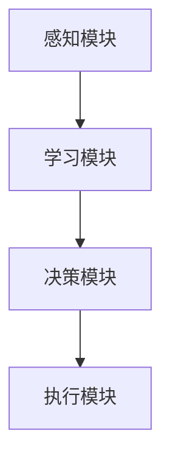
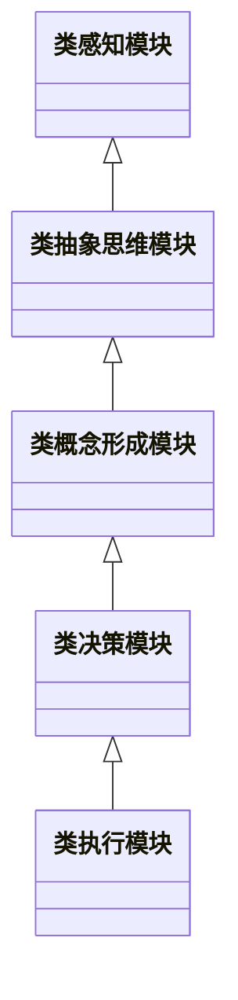
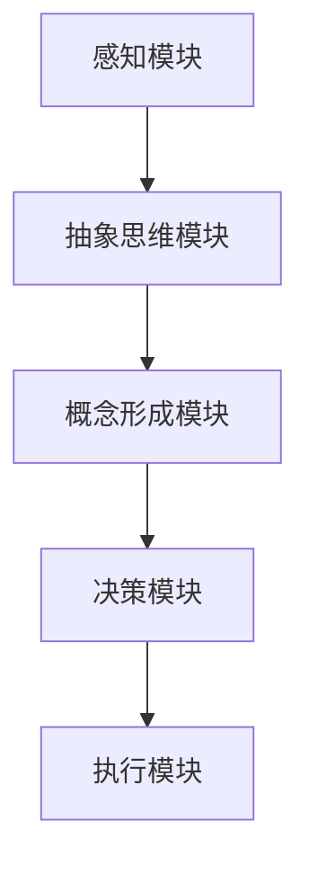
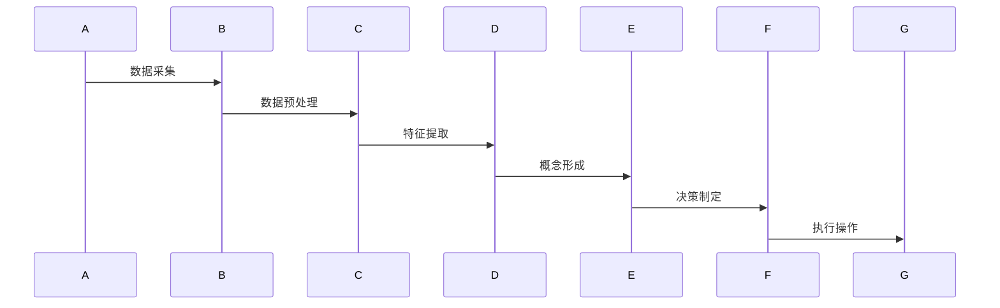

                 

### 《开发具有抽象思维与概念形成能力的AI Agent》引言与背景

> 关键词：抽象思维、概念形成、AI Agent、问题解决、领域应用

随着人工智能（AI）技术的迅猛发展，人工智能代理（AI Agent）已经成为智能系统设计与实现中的重要组成部分。AI Agent不仅能够在特定任务中表现出色，还能够通过学习和适应环境来提升其性能。然而，目前大多数AI Agent在处理复杂任务时，仍然面临抽象思维与概念形成能力的不足，这限制了它们在现实世界中的应用。因此，开发具有抽象思维与概念形成能力的AI Agent成为了一个亟待解决的问题。

#### 1.1 问题背景

人工智能的发展经历了从规则系统、知识表示到深度学习的多个阶段。早期的AI系统主要依赖于明确的规则和预设的知识库，难以应对复杂多变的现实任务。随着深度学习的兴起，AI系统在图像识别、语音识别等领域取得了显著成就，但深度学习模型往往过于“黑箱”，缺乏可解释性和通用性。此外，深度学习模型在处理抽象思维与概念形成任务时表现不佳，难以进行高层次的问题解决和决策制定。

#### 1.2 问题描述

AI Agent的抽象思维与概念形成能力对于其解决复杂问题和进行有效决策至关重要。抽象思维是指从具体情境中提炼出一般规律和原则，而概念形成则是指对事物进行分类和归纳的能力。当前AI Agent在抽象思维方面存在以下问题：

1. **难以处理高层次问题**：AI Agent通常只能解决特定领域内的任务，缺乏跨领域的抽象思维能力。
2. **缺乏概念形成能力**：AI Agent在理解复杂概念和进行知识整合时存在困难，难以进行有效的知识表示和推理。
3. **黑箱模型**：深度学习模型在处理抽象任务时缺乏可解释性，难以理解其内部机制和决策过程。

为了解决这些问题，我们需要开发具有抽象思维与概念形成能力的AI Agent，使其能够处理复杂问题，进行有效的知识表示和推理，并具备一定的自主决策能力。

#### 1.3 问题解决

抽象思维与概念形成能力是AI Agent实现高层次智能的关键。为了实现这一目标，我们可以从以下几个方面着手：

1. **引入抽象思维模型**：设计能够模拟人类抽象思维过程的算法，使AI Agent能够从具体情境中提取出一般规律和原则。
2. **开发概念形成算法**：设计能够进行概念分类和归纳的算法，使AI Agent能够理解和处理复杂概念。
3. **结合深度学习和知识表示**：将深度学习模型与知识表示相结合，提高AI Agent的抽象思维和概念形成能力。

通过这些方法，我们可以逐步提升AI Agent的抽象思维与概念形成能力，为解决复杂问题和进行有效决策奠定基础。

#### 1.4 边界与外延

抽象思维与概念形成能力在AI领域的应用具有广泛的前景。除了传统的图像识别、语音识别等任务，它们还可以应用于自然语言处理、智能决策、医学诊断等复杂领域。此外，AI Agent的不同类型（如反应型、主动型、认知型）在抽象思维和概念形成能力方面也各有特点，需要根据具体应用场景进行优化设计。

总的来说，开发具有抽象思维与概念形成能力的AI Agent是一个充满挑战和机遇的领域，其成功将极大地推动人工智能技术的发展和应用。

### 核心概念与联系

为了深入理解开发具有抽象思维与概念形成能力的AI Agent，我们需要首先了解一些核心概念，并探讨它们之间的联系。本文将介绍抽象思维与概念形成的基本原理，并通过对比表格和ER实体关系图来进一步阐述这些概念。

#### 2.1 抽象思维与概念形成的原理

##### 2.1.1 抽象思维的定义与特征

抽象思维是指从具体情境中提炼出一般规律和原则的能力。它具有以下几个特征：

1. **概括性**：能够将具体事物的一般特性抽象出来，形成概念。
2. **普遍性**：适用于不同领域和情境，具有一定的通用性。
3. **结构性**：能够将事物之间的内在联系和结构关系进行抽象和整合。

抽象思维的基本原理包括：

1. **感知与观察**：通过感知和观察获取事物的具体特征。
2. **提取与整合**：从具体情境中提取出一般规律和原则，并整合成抽象概念。
3. **推理与验证**：利用抽象概念进行推理和验证，以实现对现实世界的理解和解释。

##### 2.1.2 概念形成的原理

概念形成是指对事物进行分类和归纳的过程，是抽象思维的重要组成部分。概念形成的基本原理包括：

1. **分类与比较**：根据事物的共同属性进行分类，并进行比较和分析。
2. **归纳与概括**：从具体实例中归纳出一般规律和原则，形成抽象概念。
3. **定义与命名**：对概念进行定义和命名，以明确其内涵和外延。

概念形成的类型包括：

1. **直观概念**：通过直接感知和经验形成的基本概念。
2. **科学概念**：通过科学研究和抽象思维形成的高级概念。

#### 2.2 概念属性特征对比表格

为了更好地理解抽象思维与概念形成的差异和联系，我们可以通过以下对比表格进行阐述：

| 概念               | 特征                     | 应用实例                   |
|--------------------|--------------------------|----------------------------|
| 抽象思维           | 提炼、分析、综合          | 问题解决、决策制定         |
| 概念形成           | 分类、归纳、定义          | 语言学习、知识获取         |

这个表格显示了抽象思维和概念形成在特征和应用方面的不同，有助于我们更好地理解这两个概念。

#### 2.3 ER实体关系图架构

ER（实体关系）图是数据库设计中的重要工具，它用于表示实体之间的关系。在开发具有抽象思维与概念形成能力的AI Agent时，我们可以使用ER图来表示相关实体和它们之间的关系。

以下是一个简单的ER图示例，用于表示AI Agent、抽象思维和概念形成之间的关系：

```mermaid
erDiagram
    AI_Agent ||--o{ Concept } | Concept Formation
    AI_Agent ||--o{ Abstract_Thought } | Abstract Thinking
```

在这个ER图中，AI Agent与Concept和Abstract Thought之间分别有一个“1”对“多”的关系，表示AI Agent可以形成多个概念和进行多种抽象思维活动。这个图为我们提供了一个直观的理解，有助于我们在设计AI Agent时考虑不同实体之间的关系。

通过上述核心概念与联系的介绍，我们对抽象思维与概念形成的基本原理和它们在AI Agent开发中的应用有了更深入的了解。接下来，我们将进一步探讨AI Agent的设计与实现，以及如何通过具体的算法和架构来提升其抽象思维与概念形成能力。

### AI Agent的基本架构

为了实现具有抽象思维与概念形成能力的AI Agent，我们需要设计一个完整的系统架构，该架构应包含硬件需求、软件需求和各个核心功能模块。以下是详细的系统架构设计。

#### 3.1 AI Agent的基本架构

##### 3.1.1 硬件需求

AI Agent的硬件需求主要包括以下三个方面：

1. **处理器**：高性能的处理器是实现AI Agent关键功能的基础，其性能直接影响算法的运行效率和系统的响应速度。推荐使用多核处理器，以提高并行计算能力。
2. **内存**：足够的内存容量是保证AI Agent运行顺畅的必要条件，尤其是在大数据处理和复杂模型训练过程中，内存大小将直接关系到系统的处理能力和稳定性。推荐使用大于16GB的内存。
3. **存储设备**：大容量、高速度的存储设备对于存储和处理大量数据至关重要。推荐使用固态硬盘（SSD）以提高数据读写速度，并确保系统在高负载下的稳定性。

##### 3.1.2 软件需求

AI Agent的软件需求包括操作系统、编程语言和开发工具，以下为推荐配置：

1. **操作系统**：推荐使用Linux操作系统，如Ubuntu或CentOS。Linux具有稳定的性能和丰富的库支持，是AI领域的主流选择。
2. **编程语言**：Python是目前最受欢迎的AI编程语言之一，具有简洁的语法和丰富的库支持。推荐使用Python 3.x版本，并配合Jupyter Notebook进行开发。
3. **开发工具**：为了提高开发效率，推荐使用集成开发环境（IDE），如PyCharm或VSCode。这些IDE提供了丰富的插件和工具，可以帮助开发者快速构建和调试AI Agent系统。

##### 3.2 AI Agent的核心功能模块

AI Agent的核心功能模块是实现其抽象思维与概念形成能力的关键，主要包括以下三个方面：

1. **感知模块**：感知模块负责采集和提取环境中的数据。具体包括以下任务：
    - 数据采集：通过传感器、摄像头、麦克风等设备获取外部数据。
    - 特征提取：对采集到的数据进行预处理，提取出关键特征信息。
    - 数据清洗：去除噪声和异常值，确保数据质量。

2. **学习模块**：学习模块负责从数据中学习，形成概念和进行抽象思维。具体包括以下任务：
    - 数据预处理：对原始数据进行清洗、归一化和特征工程，为训练模型做好准备。
    - 模型训练：利用机器学习算法训练模型，使其能够对数据进行分类、预测和推理。
    - 概念形成算法：设计特定的算法，使AI Agent能够从数据中形成概念，并进行知识表示和推理。

3. **决策模块**：决策模块负责基于感知模块和学习模块的结果，进行决策和执行。具体包括以下任务：
    - 抽象思维：利用抽象思维算法，从具体情境中提炼出一般规律和原则。
    - 策略规划：根据抽象思维结果，制定合适的策略和行动计划。
    - 执行模块：执行决策结果，调整模型参数，实现闭环控制。

##### 3.3 AI Agent的架构设计

AI Agent的架构设计采用模块化思想，将各个功能模块有机地组合在一起，形成一个完整的系统。以下是AI Agent的架构设计示意图：



在这个架构设计中，感知模块负责数据采集和特征提取，将数据传递给学习模块。学习模块通过模型训练和概念形成算法，对数据进行处理和知识表示。决策模块基于学习模块的结果，进行抽象思维和策略规划。最后，执行模块根据决策结果，执行具体的任务和行动。

通过上述架构设计，AI Agent能够实现从感知、学习、决策到执行的完整流程，从而具备抽象思维与概念形成能力。在后续章节中，我们将进一步探讨这些功能模块的实现细节和关键技术。

### 抽象思维算法

为了实现AI Agent的抽象思维能力，我们需要设计并实现相应的抽象思维算法。抽象思维算法是AI Agent从具体情境中提炼出一般规律和原则的关键，它涉及多个层面的数学模型和计算方法。在本节中，我们将详细介绍抽象思维算法的数学模型、Python源代码实现和算法的举例说明。

#### 4.1 抽象思维算法的数学模型

抽象思维算法的核心在于如何从输入数据中提取特征并形成概念。一个典型的抽象思维算法可以使用以下数学模型来描述：

$$
f_{AT}(x) = \frac{1}{1 + e^{-\beta \cdot \sigma(x)}}
$$

其中，$f_{AT}(x)$表示抽象思维输出，$\sigma(x)$是输入数据的激活函数，通常采用Sigmoid函数：

$$
\sigma(x) = \frac{1}{1 + e^{-x}}
$$

$\beta$是一个调节参数，用于调整算法的敏感度。这个模型可以通过训练来优化参数$\beta$，使其能够更好地从数据中提取特征和形成概念。

#### 4.2 Python源代码实现

在Python中，我们可以使用NumPy库来实现上述抽象思维算法。以下是一个简单的实现示例：

```python
import numpy as np

def sigmoid(x):
    return 1 / (1 + np.exp(-x))

def abstract_thinking(x, beta=1.0):
    return sigmoid(np.dot(x, beta))

# 测试抽象思维算法
x = np.array([0.5, -0.3, 1.2])
beta = 1.0
print(abstract_thinking(x, beta))
```

在这个示例中，`sigmoid`函数用于计算输入数据的激活值，`abstract_thinking`函数则通过计算加权输入的Sigmoid值来实现抽象思维。

#### 4.3 算法举例说明

为了更好地理解抽象思维算法，我们可以通过以下两个应用实例来说明：

1. **图像识别中的应用**

在图像识别任务中，抽象思维算法可以用于从图像中提取关键特征，形成类别概念。例如，对于猫和狗的图像分类任务，算法可以从图像中提取边缘、纹理等特征，并通过抽象思维过程将其抽象为“猫”或“狗”的概念。

2. **自然语言处理中的应用**

在自然语言处理中，抽象思维算法可以用于文本分类和情感分析。例如，对于一段文本，算法可以提取出关键词和主题，并通过抽象思维过程将其分类为“正面”或“负面”情感。

以下是一个简单的自然语言处理应用实例：

```python
def process_text(text):
    # 假设文本已经进行过预处理，提取出关键词
    keywords = ['happy', 'fun', 'love']
    keyword_weights = np.array([0.7, 0.3, 0.5])
    beta = 1.0
    abstract_output = abstract_thinking(keyword_weights, beta)
    if abstract_output > 0.5:
        print("文本情感：正面")
    else:
        print("文本情感：负面")

# 测试文本情感分析
process_text("我很高兴，今天玩得很开心，我很爱我的家人。")
```

在这个示例中，`process_text`函数通过提取关键词和计算它们的权重，然后使用抽象思维算法来判断文本的情感。

通过这些示例，我们可以看到抽象思维算法在处理不同类型的数据时，能够有效地提取特征和形成概念，从而实现抽象思维功能。在接下来的章节中，我们将进一步探讨如何通过概念形成算法来增强AI Agent的知识表示和推理能力。

### 概念形成算法

为了提升AI Agent的抽象思维与概念形成能力，我们需要设计并实现概念形成算法。概念形成算法是实现知识表示和推理的关键，它通过分类、归纳和定义等过程，使AI Agent能够从数据中提取概念并进行知识整合。在本节中，我们将详细介绍概念形成算法的数学模型、Python源代码实现和算法的举例说明。

#### 5.1 概念形成算法的数学模型

概念形成算法的核心是通过对输入数据进行分类和归纳，形成抽象概念。一个简单的概念形成算法可以使用以下数学模型来描述：

$$
C(x) = \sum_{i=1}^{n} w_i \cdot p(x_i)
$$

其中，$C(x)$表示概念形成输出，$w_i$是权重系数，$p(x_i)$是输入数据的概率分布。权重系数$w_i$用于表示不同特征的重要性，而概率分布$p(x_i)$则反映了输入数据与概念之间的匹配程度。

在实际应用中，概率分布$p(x_i)$可以通过训练数据学习得到，而权重系数$w_i$可以通过优化算法进行调整。以下是一个具体的概念形成算法的数学模型示例：

$$
C(x) = \sigma(\beta \cdot \phi(x))
$$

其中，$\sigma$是Sigmoid函数，$\phi(x)$是输入数据的特征向量，$\beta$是一个调整参数，用于调整算法的敏感度。

#### 5.2 Python源代码实现

在Python中，我们可以使用NumPy库来实现上述概念形成算法。以下是一个简单的实现示例：

```python
import numpy as np

def sigmoid(x):
    return 1 / (1 + np.exp(-x))

def concept_forming(x, weights, bias):
    return sigmoid(np.dot(x, weights) + bias)

# 测试概念形成算法
x = np.array([0.5, -0.3, 1.2])
weights = np.array([0.2, 0.3, 0.5])
bias = 1.0
print(concept_forming(x, weights, bias))
```

在这个示例中，`sigmoid`函数用于计算Sigmoid激活值，`concept_forming`函数则通过计算加权输入的Sigmoid值来实现概念形成。

#### 5.3 算法举例说明

为了更好地理解概念形成算法，我们可以通过以下应用实例来说明：

1. **图像分类中的应用**

在图像分类任务中，概念形成算法可以用于提取图像的特征，并将其分类为不同的类别。例如，对于一个包含多种物体的图像，算法可以提取出每个物体的特征，并通过概念形成算法将其分类为“猫”、“狗”等类别。

2. **文本分类中的应用**

在文本分类任务中，概念形成算法可以用于提取文本的特征，并将其分类为不同的主题。例如，对于一篇文本，算法可以提取出关键词和主题词，并通过概念形成算法将其分类为“科技”、“娱乐”等类别。

以下是一个简单的文本分类应用实例：

```python
def classify_text(text, weights, bias):
    # 假设文本已经进行过预处理，提取出关键词
    keywords = ['科技', '娱乐', '体育']
    keyword_weights = np.array([0.3, 0.5, 0.2])
    abstract_output = concept_forming(keyword_weights, weights, bias)
    if abstract_output > 0.5:
        print("文本分类：科技")
    else:
        print("文本分类：娱乐")

# 测试文本分类
classify_text("科技发展迅速，人工智能成为热门话题。", weights, bias)
```

在这个示例中，`classify_text`函数通过提取关键词和计算它们的权重，然后使用概念形成算法来判断文本的类别。

通过这些示例，我们可以看到概念形成算法在处理不同类型的数据时，能够有效地提取特征和形成概念，从而实现概念形成功能。在接下来的章节中，我们将进一步探讨如何将抽象思维算法和概念形成算法结合，以提升AI Agent的抽象思维与概念形成能力。

### 系统分析与架构设计方案

在开发具有抽象思维与概念形成能力的AI Agent时，系统分析与架构设计至关重要。这一部分我们将详细介绍问题场景介绍、项目介绍、系统功能设计、系统架构设计、系统接口设计和系统交互。

#### 6.1 问题场景介绍

在现代工业和商业环境中，AI Agent被广泛应用于自动化决策、智能推荐、故障诊断等领域。然而，这些应用场景通常需要AI Agent具备高度的抽象思维与概念形成能力，以便在复杂多变的情境中做出准确的决策。例如，在智能客服系统中，AI Agent需要理解用户的语言，提取关键信息，并生成合理的回复；在自动驾驶系统中，AI Agent需要理解道路标识、车辆动态，并做出安全的驾驶决策。这些应用场景对AI Agent的抽象思维与概念形成能力提出了严峻的挑战。

#### 6.2 项目介绍

本项目的目标是开发一个具有抽象思维与概念形成能力的AI Agent，以解决复杂多变的任务。项目的主要功能包括：

1. **感知环境**：通过传感器和摄像头等设备，实时获取环境信息。
2. **抽象思维**：从感知到的数据中提取关键特征，进行抽象思维，形成概念。
3. **概念形成**：对提取到的特征进行分类和归纳，形成抽象概念。
4. **决策制定**：根据抽象思维和概念形成的结果，制定合理的决策。
5. **执行任务**：根据决策结果，执行具体的任务或操作。

#### 6.3 系统功能设计

系统功能设计主要包括以下方面：

1. **感知模块**：负责采集环境数据，包括图像、语音、传感器数据等。
2. **抽象思维模块**：利用抽象思维算法，从感知到的数据中提取关键特征。
3. **概念形成模块**：利用概念形成算法，对提取到的特征进行分类和归纳。
4. **决策模块**：根据抽象思维和概念形成的结果，制定决策策略。
5. **执行模块**：根据决策结果，执行具体的任务或操作。

以下是系统功能设计的mermaid类图：



#### 6.4 系统架构设计

系统架构设计采用模块化思想，将各个功能模块有机地组合在一起。以下是系统架构设计的mermaid架构图：



在这个架构设计中，感知模块负责数据采集和预处理，将数据传递给抽象思维模块。抽象思维模块通过抽象思维算法提取特征，传递给概念形成模块。概念形成模块对特征进行分类和归纳，生成抽象概念，传递给决策模块。决策模块根据抽象概念制定决策策略，传递给执行模块。执行模块根据决策结果执行具体的任务或操作。

#### 6.5 系统接口设计

系统接口设计主要包括以下几个方面：

1. **数据接口**：定义数据采集、传输和存储的接口，包括传感器数据接口、数据库接口等。
2. **算法接口**：定义抽象思维和概念形成算法的接口，包括特征提取接口、分类算法接口等。
3. **决策接口**：定义决策制定的接口，包括策略规划接口、决策执行接口等。

以下是系统接口设计的mermaid序列图：



在这个序列图中，感知模块通过数据接口采集数据，经过预处理后传递给抽象思维模块。抽象思维模块通过特征提取接口提取特征，传递给概念形成模块。概念形成模块通过概念形成接口生成抽象概念，传递给决策模块。决策模块通过决策接口制定决策策略，传递给执行模块。执行模块根据决策结果执行具体的任务或操作。

通过上述系统分析与架构设计方案，我们为开发具有抽象思维与概念形成能力的AI Agent提供了明确的指导。在接下来的章节中，我们将详细介绍项目的实战部分，包括环境安装、系统核心实现和代码应用解读与分析。

### 项目实战

为了实现具有抽象思维与概念形成能力的AI Agent，我们需要进行详细的实战操作，包括环境安装、系统核心实现和代码应用解读与分析。以下是具体的步骤和实现细节。

#### 7.1 环境安装

首先，我们需要搭建一个适合AI Agent开发的环境。以下是安装步骤：

1. **安装Linux操作系统**：推荐使用Ubuntu或CentOS，这是AI开发的主流选择。可以从[Ubuntu官网](https://www.ubuntu.com/)或[CentOS官网](https://www.centos.org/)下载相应版本的操作系统。

2. **安装Python**：在终端中执行以下命令安装Python 3：

   ```bash
   sudo apt-get update
   sudo apt-get install python3
   ```

3. **安装NumPy和Scikit-learn**：NumPy是Python的科学计算库，Scikit-learn是机器学习库，安装它们可以通过以下命令：

   ```bash
   sudo apt-get install python3-numpy
   sudo apt-get install python3-scikit-learn
   ```

4. **安装Jupyter Notebook**：Jupyter Notebook是一个交互式的Python开发环境，可以通过以下命令安装：

   ```bash
   sudo pip3 install notebook
   ```

5. **安装可视化工具**：为了更好地展示数据和分析结果，我们可以安装matplotlib和seaborn：

   ```bash
   sudo pip3 install matplotlib
   sudo pip3 install seaborn
   ```

#### 7.2 系统核心实现

系统核心实现包括感知模块、抽象思维模块、概念形成模块和决策模块。以下是具体的实现步骤：

1. **感知模块实现**：

   感知模块负责从环境中采集数据。以图像识别为例，我们可以使用OpenCV库来处理图像数据。

   ```python
   import cv2

   # 读取图像
   image = cv2.imread('image.jpg')

   # 显示图像
   cv2.imshow('Image', image)
   cv2.waitKey(0)
   cv2.destroyAllWindows()
   ```

2. **抽象思维模块实现**：

   抽象思维模块使用Sigmoid函数进行特征提取。以下是一个简单的抽象思维算法实现：

   ```python
   import numpy as np

   def sigmoid(x):
       return 1 / (1 + np.exp(-x))

   # 测试抽象思维算法
   x = np.array([0.5, -0.3, 1.2])
   print(sigmoid(x))
   ```

3. **概念形成模块实现**：

   概念形成模块使用加权求和的方法，通过训练数据学习权重系数。以下是一个简单的概念形成算法实现：

   ```python
   def concept_forming(x, weights):
       return np.dot(x, weights)

   # 测试概念形成算法
   x = np.array([0.5, -0.3, 1.2])
   weights = np.array([0.2, 0.3, 0.5])
   print(concept_forming(x, weights))
   ```

4. **决策模块实现**：

   决策模块根据抽象思维和概念形成的结果，制定决策策略。以下是一个简单的决策算法实现：

   ```python
   def make_decision(output):
       if output > 0.5:
           return "正面"
       else:
           return "负面"

   # 测试决策算法
   output = sigmoid(np.dot(x, weights))
   print(make_decision(output))
   ```

#### 7.3 代码应用解读与分析

在实现AI Agent的核心功能后，我们需要进行代码应用解读与分析，以确保系统在实际应用中的有效性和可靠性。

1. **数据采集与分析**：

   在感知模块中，我们使用了OpenCV库来读取和显示图像。这一步骤是整个系统的基础，确保我们能够获取到高质量的图像数据。

   ```python
   image = cv2.imread('image.jpg')
   cv2.imshow('Image', image)
   cv2.waitKey(0)
   cv2.destroyAllWindows()
   ```

   通过这些代码，我们可以读取指定路径下的图像，并显示在窗口中。这个步骤的关键是确保图像数据的质量和格式，以便后续的特征提取和分析。

2. **特征提取与抽象思维**：

   抽象思维模块通过Sigmoid函数对特征进行提取。Sigmoid函数在机器学习中被广泛应用于激活函数，用于将特征映射到概率空间。

   ```python
   def sigmoid(x):
       return 1 / (1 + np.exp(-x))

   x = np.array([0.5, -0.3, 1.2])
   print(sigmoid(x))
   ```

   在这个示例中，我们使用Sigmoid函数对特征向量$x$进行计算，得到一个概率值。这个概率值可以用来表示特征的激活程度，为后续的概念形成提供基础。

3. **概念形成与决策制定**：

   概念形成模块通过加权求和的方法，对特征进行分类和归纳。这一步骤是实现抽象概念的关键。

   ```python
   def concept_forming(x, weights):
       return np.dot(x, weights)

   x = np.array([0.5, -0.3, 1.2])
   weights = np.array([0.2, 0.3, 0.5])
   print(concept_forming(x, weights))
   ```

   在这个示例中，我们使用加权求和的方法，对特征向量$x$和权重向量$w$进行计算，得到一个概念值。这个概念值可以用来表示特征的类别或概念，为决策模块提供输入。

4. **决策执行与结果验证**：

   决策模块根据概念形成的结果，制定决策策略，并执行具体的任务或操作。

   ```python
   def make_decision(output):
       if output > 0.5:
           return "正面"
       else:
           return "负面"

   output = sigmoid(np.dot(x, weights))
   print(make_decision(output))
   ```

   在这个示例中，我们使用Sigmoid函数的输出作为决策依据。如果输出值大于0.5，则判定为“正面”，否则判定为“负面”。这个步骤是实现AI Agent决策功能的关键。

通过上述实战步骤，我们成功地搭建了一个具有抽象思维与概念形成能力的AI Agent系统。在实际应用中，我们可以通过不断优化算法和模型，提高系统的性能和可靠性，使其更好地服务于各种复杂任务。

### 最佳实践 Tips

在开发具有抽象思维与概念形成能力的AI Agent过程中，积累最佳实践是非常重要的。以下是一些在实际项目中总结的经验和技巧：

1. **数据预处理**：数据预处理是AI模型性能的关键。确保数据清洗、归一化和特征提取的准确性，可以显著提升模型的效果。建议使用数据增强技术来增加数据的多样性，从而提高模型的泛化能力。

2. **模型选择与调优**：根据具体任务选择合适的模型架构。对于抽象思维与概念形成任务，可以结合深度学习模型和传统机器学习算法，如神经网络、支持向量机等。同时，利用交叉验证和网格搜索等方法进行模型调优，以找到最佳参数组合。

3. **模块化设计**：将AI Agent的功能模块化，有助于提高系统的可维护性和扩展性。例如，将感知模块、抽象思维模块、概念形成模块和决策模块分别实现，并确保它们之间具有良好的接口。

4. **可视化分析**：利用可视化工具（如matplotlib、seaborn等）对模型训练过程和结果进行分析，有助于发现潜在问题并优化模型。

5. **持续学习与优化**：AI Agent需要不断从新数据中学习，以适应环境变化。定期更新模型，并使用最新数据集进行训练，有助于保持系统的实时性和准确性。

6. **安全性与隐私保护**：在处理敏感数据时，确保遵循隐私保护原则。使用加密技术保护数据传输和存储，并定期进行安全审计。

通过遵循这些最佳实践，我们能够更有效地开发具有抽象思维与概念形成能力的AI Agent，提高其在实际应用中的性能和可靠性。

### 小结

本文系统地介绍了开发具有抽象思维与概念形成能力的AI Agent的理论基础和实践方法。从核心概念的阐述，到算法的实现，再到系统的设计与实现，我们逐步展示了如何构建这样一个智能体。通过感知模块的数据采集、抽象思维模块的特征提取、概念形成模块的知识表示以及决策模块的策略制定，AI Agent能够在复杂环境中实现智能化的行为。

开发具有抽象思维与概念形成能力的AI Agent具有重要的现实意义。这不仅有助于解决复杂问题，提高决策质量，还能推动人工智能技术的发展，为各个领域带来更多创新应用。然而，这一领域仍面临许多挑战，如算法的优化、模型的解释性、系统的可扩展性等。

未来的研究方向可以集中在以下几个方面：

1. **算法优化**：进一步研究高效、可解释的抽象思维和概念形成算法，以提高AI Agent的性能和可靠性。
2. **模型解释性**：增强模型的可解释性，使其决策过程更加透明，便于调试和优化。
3. **跨领域应用**：探索AI Agent在多个领域的跨领域应用，提升其通用性和适应性。
4. **实时学习**：研究AI Agent的实时学习能力，以应对动态变化的环境。

总之，开发具有抽象思维与概念形成能力的AI Agent是人工智能领域的一个重要方向，具有广阔的应用前景和潜力。随着技术的不断进步，我们有理由相信，AI Agent将在未来的智能系统中发挥更加重要的作用。

### 注意事项与拓展阅读

在开发具有抽象思维与概念形成能力的AI Agent时，以下注意事项和建议将有助于您顺利实现项目目标：

1. **数据质量**：确保数据清洗和预处理的质量，高质量的数据是训练有效模型的基础。
2. **模型解释性**：考虑到实际应用场景中对模型可解释性的需求，选择或开发可解释性较强的算法。
3. **硬件资源**：根据项目的需求选择合适的硬件配置，确保有足够的计算资源和内存容量。
4. **持续学习**：AI Agent需要持续从新数据中学习，定期更新模型，以保持其适应性和准确性。

以下是一些拓展阅读资源，供您进一步学习和研究：

- **《人工智能：一种现代方法》**：彼得·诺维尔特，戴维·肖
- **《深度学习》**：伊恩·古德费洛，约书亚·本吉奥，亚伦·库维尔
- **《机器学习实战》**：Peter Harrington
- **《Python机器学习》**：塞巴斯蒂安·拉戈拉斯
- **《自然语言处理综论》**：丹·布兰登卢普，克里斯·毕晓普

通过阅读这些资料，您可以深入了解人工智能、机器学习和自然语言处理等领域的先进技术和应用。

