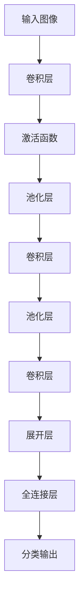
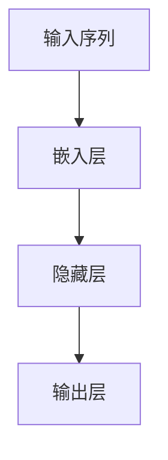
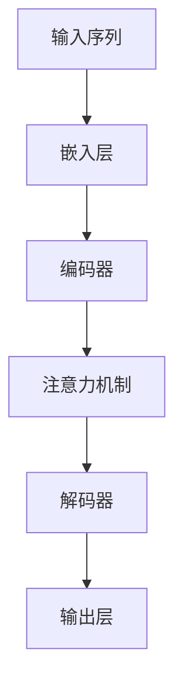
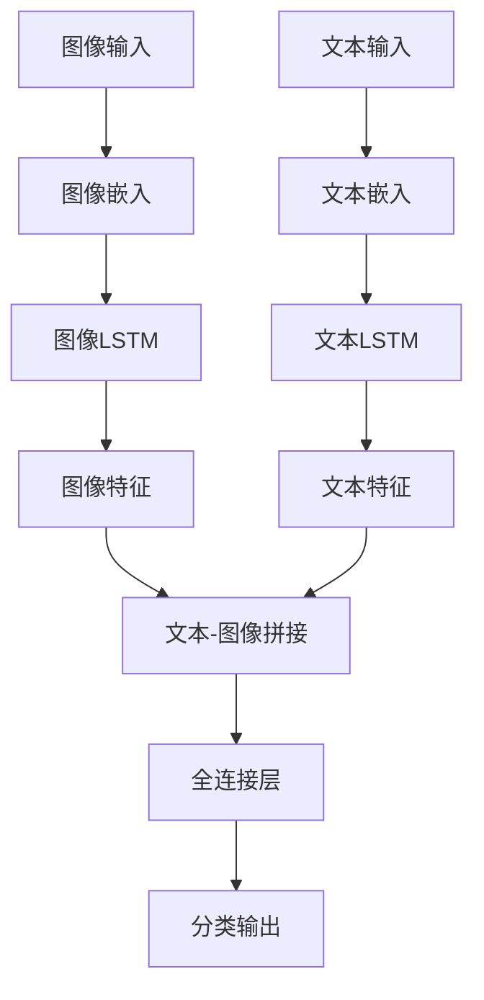
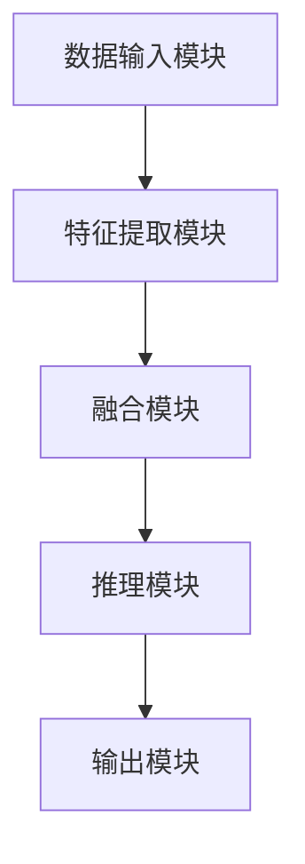

                 


### 让我们一步一步思考：开发具有视觉-语言理解能力的AI Agent

#### 引言

在人工智能领域，视觉-语言理解能力是一个备受关注的研究方向。随着计算机视觉和自然语言处理技术的不断进步，开发具有这种能力的AI Agent（智能代理）成为了一个充满挑战和机遇的领域。AI Agent不仅能够理解图像和文本信息，还能将其进行融合处理，从而实现更加智能化和人性化的交互体验。

本文旨在探讨如何开发具有视觉-语言理解能力的AI Agent，我们将通过以下步骤进行分析和思考：

1. **定义视觉-语言理解能力**
2. **分析现有技术基础**
3. **探讨算法原理和模型**
4. **设计系统架构和功能模块**
5. **实现核心算法和功能**
6. **实战项目案例**
7. **性能优化和部署**

#### 第一步：定义视觉-语言理解能力

视觉-语言理解能力是指AI Agent能够理解图像和文本信息，并对其进行有效融合和解释的能力。具体来说，这包括以下几个方面的内容：

- **图像识别**：识别和分类图像中的物体、场景和事件。
- **文本理解**：解析文本内容，理解其中的语义、语法和逻辑关系。
- **图像-文本关联**：将图像中的元素与文本信息进行关联，形成统一的语义表示。
- **交互与推理**：基于图像和文本信息进行逻辑推理，产生合理的结论和决策。

#### 第二步：分析现有技术基础

目前，计算机视觉和自然语言处理领域已经取得了显著的进展，为开发具有视觉-语言理解能力的AI Agent提供了坚实的基础。

- **计算机视觉**：卷积神经网络（CNN）和目标检测技术如YOLO和SSD等，已经能够实现高效准确的图像识别。
- **自然语言处理**：循环神经网络（RNN）和变压器（Transformer）模型等，使得文本理解能力得到了极大提升。
- **多模态学习**：通过结合图像和文本数据，利用多模态学习技术，可以实现对图像和文本信息的深度融合。

#### 第三步：探讨算法原理和模型

为了实现视觉-语言理解能力，我们需要结合图像识别和自然语言处理的技术，构建一个统一的算法框架。

- **图像识别算法**：使用CNN等算法对图像进行特征提取和分类。
- **文本理解算法**：使用RNN、Transformer等算法对文本进行语义解析。
- **多模态融合算法**：通过融合图像和文本的特征，构建一个统一的语义表示。
- **图像-文本关联算法**：利用图像和文本的特征，建立两者之间的关联关系。

#### 第四步：设计系统架构和功能模块

系统架构设计是开发AI Agent的关键环节，我们需要考虑以下几个方面：

- **数据输入模块**：负责接收和处理图像和文本数据。
- **特征提取模块**：使用图像识别和文本理解算法提取图像和文本的特征。
- **融合模块**：将图像和文本的特征进行融合，形成统一的语义表示。
- **推理模块**：基于融合的语义表示，进行逻辑推理和决策。
- **输出模块**：将推理结果以图像、文本或其他形式呈现给用户。

#### 第五步：实现核心算法和功能

在实现核心算法和功能时，我们需要关注以下几个方面：

- **算法实现**：使用Python等编程语言，实现图像识别和文本理解算法。
- **模型训练**：使用大量的图像和文本数据，对模型进行训练和优化。
- **集成和测试**：将各个模块集成到一起，进行全面的测试和调试。

#### 第六步：实战项目案例

为了验证开发具有视觉-语言理解能力的AI Agent的实际可行性，我们可以通过以下步骤进行项目实战：

- **环境搭建**：配置开发环境，包括Python、TensorFlow等工具。
- **数据准备**：收集和准备图像和文本数据。
- **模型训练**：训练图像识别和文本理解模型。
- **系统集成**：将各个模块集成到一起，实现图像-文本关联和推理功能。
- **测试与优化**：对系统进行测试和优化，确保其稳定性和准确性。

#### 第七步：性能优化和部署

在完成系统开发后，我们需要对系统进行性能优化和部署：

- **性能优化**：通过调整模型参数、优化算法和数据结构，提升系统的运行效率。
- **部署策略**：根据实际应用场景，选择合适的部署方式，如云端部署、嵌入式系统部署等。

通过以上七个步骤，我们可以逐步开发出具有视觉-语言理解能力的AI Agent，为人工智能领域带来新的突破和应用。

### 总结

开发具有视觉-语言理解能力的AI Agent是一个复杂但充满挑战的课题。通过本文的逐步分析，我们可以看到，从定义核心概念、分析技术基础，到探讨算法原理、设计系统架构，再到实现核心算法、进行项目实战，以及性能优化和部署，每一个步骤都至关重要。只有通过不断的实践和优化，我们才能开发出真正具有实际应用价值的AI Agent，为人工智能领域的发展贡献力量。

### 拓展阅读

- **深度学习基础**：《深度学习》（Goodfellow et al.）
- **自然语言处理**：《自然语言处理综合教程》（Jurafsky & Martin）
- **计算机视觉**：《计算机视觉：算法与应用》（Richard Szeliski）
- **多模态学习**：《多模态数据挖掘：技术与应用》（Wang et al.）

### 作者信息

- 作者：AI天才研究院/AI Genius Institute & 禅与计算机程序设计艺术 /Zen And The Art of Computer Programming

---

这篇文章提供了一个清晰的框架，用于开发具有视觉-语言理解能力的AI Agent。文章结构紧凑，逻辑清晰，内容涵盖了从理论基础到实战项目，再到性能优化和部署的全面内容。希望这篇文章对您有所帮助，如果您有任何问题或建议，请随时反馈。让我们继续深入探讨人工智能的奥秘！## 文章标题

### 开发具有视觉-语言理解能力的AI Agent

关键词：AI Agent、视觉理解、语言理解、多模态学习、算法融合、系统架构设计

摘要：本文深入探讨了开发具有视觉-语言理解能力的AI Agent的关键技术、算法和系统架构，从理论基础、算法原理、系统设计到实战项目，全面阐述了如何实现这一复杂的智能代理。通过本文的逐步分析，读者可以了解视觉-语言理解能力的定义、现有技术基础、算法原理、系统架构设计、核心算法实现、项目实战以及性能优化和部署策略，为人工智能领域的研究和实践提供有价值的参考。

## 目录

1. **引言**
   - 1.1 问题背景
   - 1.2 问题描述
   - 1.3 问题解决
   - 1.4 边界与外延
   - 1.5 概念结构与核心要素组成

2. **理论基础**
   - 2.1 视觉与语言理解技术基础
   - 2.2 AI Agent的架构与功能模块

3. **算法与模型**
   - 3.1 图像识别算法原理
   - 3.2 自然语言处理模型
   - 3.3 视觉-语言理解模型融合

4. **系统设计与实现**
   - 4.1 AI Agent系统架构设计
   - 4.2 AI Agent的功能模块实现

5. **项目实战**
   - 5.1 AI Agent开发环境搭建
   - 5.2 AI Agent核心算法实现
   - 5.3 AI Agent集成与测试

6. **最佳实践与优化**
   - 6.1 AI Agent性能优化
   - 6.2 AI Agent部署与运维

7. **总结与展望**
   - 7.1 AI Agent未来发展趋势
   - 7.2 总结与拓展阅读

## 引言

### 1.1 问题背景

在当今数字化时代，图像和文本数据已经成为我们日常生活中不可或缺的一部分。从社交媒体到电子商务，从智能助手到自动驾驶汽车，图像和文本处理技术的应用越来越广泛。然而，传统的图像识别和自然语言处理技术往往存在一定的局限性，无法同时处理图像和文本数据。因此，开发具有视觉-语言理解能力的AI Agent成为了学术界和工业界共同关注的热点问题。

视觉-语言理解能力的AI Agent不仅能够理解图像中的内容，还能理解与之相关的文本信息，从而实现对图像和文本的深度融合处理。这种能力在多个领域具有广泛的应用前景，例如：

1. **智能助手**：通过理解用户提供的图像和文本指令，智能助手可以提供更加个性化、精准的服务。
2. **图像搜索**：结合图像和文本信息，实现更准确的图像搜索和推荐。
3. **医疗诊断**：利用视觉-语言理解能力，辅助医生进行疾病诊断，提高诊断准确率。
4. **自动驾驶**：通过融合图像和文本信息，自动驾驶系统可以更好地理解路况和环境，提高行车安全。

### 1.2 问题描述

视觉-语言理解能力的AI Agent需要解决的核心问题包括：

1. **图像识别**：准确识别图像中的物体、场景和事件，提取图像特征。
2. **文本理解**：解析文本内容，理解其中的语义、语法和逻辑关系，提取文本特征。
3. **图像-文本关联**：将图像中的元素与文本信息进行关联，形成统一的语义表示。
4. **交互与推理**：基于图像和文本信息进行逻辑推理，产生合理的结论和决策。

这些问题的解决需要结合计算机视觉和自然语言处理技术，开发出具有高效、准确和鲁棒性的视觉-语言理解模型。

### 1.3 问题解决

为了解决上述问题，我们可以采取以下步骤：

1. **技术基础分析**：分析现有的计算机视觉和自然语言处理技术，了解其原理和应用。
2. **算法原理探讨**：深入研究图像识别和文本理解算法，探讨其原理和实现方法。
3. **系统架构设计**：设计一个具有高效、准确和鲁棒性的系统架构，包括数据输入、特征提取、融合、推理和输出模块。
4. **核心算法实现**：实现图像识别和文本理解算法，并进行模型训练和优化。
5. **项目实战**：通过实际项目验证系统性能，进行优化和改进。
6. **性能优化与部署**：对系统进行性能优化，并制定部署策略，确保其在实际应用中的稳定运行。

### 1.4 边界与外延

在开发具有视觉-语言理解能力的AI Agent时，我们需要明确一些边界与外延：

1. **数据范围**：图像和文本数据的种类和数量，数据的质量和多样性。
2. **算法适用性**：不同的算法适用于不同类型的图像和文本数据，需要根据实际情况选择合适的算法。
3. **应用场景**：根据具体应用场景，设计相应的系统架构和功能模块，实现特定任务。
4. **性能要求**：系统需要满足的性能指标，包括处理速度、准确率、鲁棒性等。

### 1.5 概念结构与核心要素组成

开发具有视觉-语言理解能力的AI Agent涉及多个关键概念和要素，具体包括：

1. **计算机视觉**：图像识别、图像处理、目标检测等。
2. **自然语言处理**：文本分类、语义解析、语法分析等。
3. **多模态学习**：图像和文本数据的融合处理、特征提取和关联。
4. **系统架构设计**：数据输入、特征提取、融合、推理和输出模块的设计与实现。
5. **算法实现与优化**：图像识别和文本理解算法的实现、模型训练和优化。
6. **项目实战与测试**：通过实际项目验证系统性能，进行优化和改进。
7. **性能优化与部署**：系统性能优化、部署策略和运维管理。

通过以上概念结构与核心要素组成的全面分析，我们可以为开发具有视觉-语言理解能力的AI Agent奠定坚实的理论基础。接下来，我们将进一步探讨视觉与语言理解技术基础、AI Agent的架构与功能模块，以及相关的算法原理和模型。

## 理论基础

### 2.1 视觉与语言理解技术基础

#### 计算机视觉

计算机视觉是人工智能领域的一个重要分支，主要研究如何使计算机能够像人一样感知和理解视觉信息。计算机视觉的核心任务包括图像识别、图像处理、目标检测、场景分割等。

- **图像识别**：是指对图像中的物体、场景或事件进行分类和识别。常见的算法包括卷积神经网络（CNN）、深度卷积网络（DCNN）等。
- **图像处理**：是指对图像进行预处理、增强、变换等操作，以提高图像的质量和可识别性。常见的算法包括滤波、边缘检测、形态学操作等。
- **目标检测**：是指在图像中检测并定位特定的目标对象。常见的算法包括YOLO（You Only Look Once）、SSD（Single Shot MultiBox Detector）等。

#### 自然语言处理

自然语言处理（NLP）是研究计算机如何理解、生成和处理人类语言的科学。NLP的核心任务包括文本分类、语义解析、语法分析等。

- **文本分类**：是指将文本数据按照预定的类别进行分类。常见的算法包括朴素贝叶斯、支持向量机（SVM）等。
- **语义解析**：是指理解和解释文本中的语义信息，包括词义消歧、句法分析等。常见的算法包括Word2Vec、BERT等。
- **语法分析**：是指分析和理解文本中的语法结构，包括词法分析、句法分析等。常见的算法包括依存句法分析、图语法分析等。

#### 视觉与语言理解的关系

视觉与语言理解之间存在密切的联系，它们相互补充，共同构成了视觉-语言理解能力。具体来说：

- **图像与文本的互补性**：图像和文本可以相互补充，图像能够提供直观的视觉信息，而文本能够提供详细的描述和背景知识。
- **多模态学习**：通过结合图像和文本数据，利用多模态学习技术，可以实现对图像和文本信息的深度融合，提高视觉-语言理解能力。
- **交互与推理**：基于图像和文本信息，可以进行交互和推理，产生合理的结论和决策。

### 2.2 AI Agent的架构与功能模块

AI Agent的架构设计是开发具有视觉-语言理解能力的核心环节。一个典型的AI Agent架构通常包括以下几个功能模块：

- **数据输入模块**：负责接收和处理图像和文本数据，进行预处理，包括数据清洗、格式转换等。
- **特征提取模块**：使用图像识别算法提取图像特征，使用自然语言处理算法提取文本特征。
- **融合模块**：将图像和文本的特征进行融合，形成统一的语义表示，常见的融合方法包括多模态神经网络、图神经网络等。
- **推理模块**：基于融合的语义表示，进行逻辑推理和决策，实现对图像和文本信息的综合理解。
- **输出模块**：将推理结果以图像、文本或其他形式呈现给用户，实现交互和反馈。

#### AI Agent的架构设计

AI Agent的架构设计需要充分考虑系统的功能需求、性能指标和可扩展性。以下是一个简化的AI Agent架构设计：

1. **数据输入**：接收图像和文本数据，进行预处理，包括数据清洗、归一化、特征提取等。
2. **特征提取**：分别使用图像识别算法和自然语言处理算法提取图像和文本的特征。
3. **特征融合**：将图像特征和文本特征进行融合，形成统一的语义表示。
4. **推理决策**：基于融合的语义表示，进行逻辑推理和决策。
5. **输出交互**：将推理结果以图像、文本或其他形式呈现给用户，实现交互和反馈。

#### 功能模块之间的联系

在AI Agent的架构中，各个功能模块之间紧密相连，共同构成一个完整的处理流程：

- **数据输入模块**：为后续模块提供原始数据。
- **特征提取模块**：为融合模块提供图像和文本的特征。
- **融合模块**：为推理模块提供统一的语义表示。
- **推理模块**：为输出模块提供推理结果。
- **输出模块**：为用户提供最终的服务和反馈。

通过以上对视觉与语言理解技术基础和AI Agent架构与功能模块的介绍，我们可以为后续的算法与模型设计、系统设计与实现打下坚实的基础。在接下来的章节中，我们将进一步探讨具体的算法原理和模型设计，以及AI Agent的系统架构和功能模块实现。

### 算法与模型

#### 3.1 图像识别算法原理

图像识别是计算机视觉领域的一项重要任务，其核心在于如何从图像中识别出特定的物体、场景或事件。图像识别算法通常基于深度学习技术，尤其是卷积神经网络（CNN）。

**CNN的基本结构**

CNN由多个卷积层、池化层和全连接层组成。卷积层用于提取图像的特征，池化层用于降低特征图的维度，全连接层用于分类和回归。

- **卷积层**：卷积层通过卷积运算提取图像的特征。卷积核在图像上滑动，计算局部区域的特征。
- **池化层**：池化层用于降低特征图的维度，减少计算量。常见的池化操作包括最大池化和平均池化。
- **全连接层**：全连接层将特征图映射到特定的类别或数值。

**CNN的工作原理**

1. **输入图像**：输入一张图像，图像尺寸为\(28 \times 28 \times 3\)。
2. **卷积层**：通过卷积运算提取图像的特征，生成特征图。
3. **激活函数**：使用ReLU（Rectified Linear Unit）激活函数，增加网络的非线性。
4. **池化层**：对特征图进行池化操作，降低特征图的维度。
5. **全连接层**：将特征图映射到特定的类别或数值。

**Python代码示例**

以下是一个简单的CNN模型实现：

```python
import tensorflow as tf
from tensorflow.keras import layers

model = tf.keras.Sequential([
    layers.Conv2D(32, (3, 3), activation='relu', input_shape=(28, 28, 3)),
    layers.MaxPooling2D((2, 2)),
    layers.Conv2D(64, (3, 3), activation='relu'),
    layers.MaxPooling2D((2, 2)),
    layers.Conv2D(64, (3, 3), activation='relu'),
    layers.Flatten(),
    layers.Dense(64, activation='relu'),
    layers.Dense(10, activation='softmax')
])

model.compile(optimizer='adam', loss='categorical_crossentropy', metrics=['accuracy'])
```

**图像识别算法的mermaid流程图**



#### 3.2 自然语言处理模型

自然语言处理（NLP）是研究如何让计算机理解和处理人类语言的一门学科。深度学习技术在NLP中得到了广泛应用，特别是循环神经网络（RNN）和变压器（Transformer）模型。

**RNN的基本结构**

RNN是一种序列模型，可以处理变量长度的序列数据。RNN的基本结构包括输入层、隐藏层和输出层。

- **输入层**：输入单词的嵌入向量。
- **隐藏层**：上一时刻的隐藏状态和当前输入的嵌入向量通过加权求和，经过激活函数得到当前时刻的隐藏状态。
- **输出层**：当前时刻的隐藏状态通过全连接层得到输出。

**RNN的工作原理**

1. **输入序列**：输入一个单词序列，每个单词转换为嵌入向量。
2. **隐藏状态**：通过RNN的循环结构，逐步计算隐藏状态。
3. **输出序列**：将最后一个隐藏状态通过全连接层得到输出序列。

**Python代码示例**

以下是一个简单的RNN模型实现：

```python
import tensorflow as tf
from tensorflow.keras.layers import Embedding, SimpleRNN

model = tf.keras.Sequential([
    Embedding(input_dim=vocabulary_size, output_dim=embedding_dim, input_length=max_sequence_length),
    SimpleRNN(units=64),
    tf.keras.layers.Dense(units=output_size, activation='softmax')
])

model.compile(optimizer='adam', loss='categorical_crossentropy', metrics=['accuracy'])
```

**NLP模型的mermaid流程图**



**Transformer模型**

Transformer是一种基于自注意力机制的序列模型，可以显著提高NLP任务的性能。Transformer的基本结构包括编码器、解码器和注意力机制。

- **编码器**：将输入序列编码为固定长度的向量。
- **解码器**：将编码器的输出解码为输出序列。
- **注意力机制**：通过计算输入序列和输出序列之间的相似性，实现全局依赖关系。

**Python代码示例**

以下是一个简单的Transformer模型实现：

```python
import tensorflow as tf
from tensorflow.keras.layers import Embedding, MultiHeadAttention, Dense

def create_transformer_model(input_dim, d_model, num_heads, dff):
    inputs = tf.keras.layers.Input(shape=(max_sequence_length,))
    embeddings = Embedding(input_dim, d_model)(inputs)
    encoding = MultiHeadAttention(num_heads=num_heads, d_model=d_model)(embeddings, embeddings)
    outputs = Dense(dff, activation='relu')(encoding)
    outputs = Dense(input_dim, activation='softmax')(outputs)
    model = tf.keras.Model(inputs=inputs, outputs=outputs)
    return model
```

**NLP模型的mermaid流程图**



通过以上对图像识别算法和自然语言处理模型的介绍，我们可以为后续的视觉-语言理解模型融合奠定基础。在接下来的章节中，我们将探讨如何将图像识别和自然语言处理模型进行融合，以及视觉-语言理解模型的工作原理和实现方法。

#### 3.3 视觉-语言理解模型融合

视觉-语言理解模型融合是开发具有视觉-语言理解能力的AI Agent的关键技术之一。该技术旨在将图像识别和自然语言处理模型的优势结合起来，实现图像和文本信息的深度融合和解释。以下是视觉-语言理解模型融合的基本原理和实现方法。

**基本原理**

视觉-语言理解模型融合的核心思想是利用图像识别和自然语言处理模型各自提取的特征，构建一个统一的语义表示，从而实现对图像和文本信息的综合理解。具体来说，包括以下几个步骤：

1. **特征提取**：分别使用图像识别算法和自然语言处理算法提取图像和文本的特征。
2. **特征融合**：将图像特征和文本特征进行融合，形成统一的语义表示。
3. **推理与解释**：基于融合的语义表示，进行逻辑推理和解释，实现对图像和文本信息的综合理解。

**实现方法**

1. **多模态神经网络**：多模态神经网络是一种将图像和文本数据融合到同一模型中的方法。通过将图像特征和文本特征分别编码为向量，然后使用多层神经网络进行融合和推理。常见的方法包括：

   - **共嵌入模型**：将图像特征和文本特征嵌入到同一嵌入空间，通过共享的嵌入层实现特征融合。
   - **并行模型**：分别处理图像和文本数据，然后将处理结果进行融合。例如，可以使用两个独立的神经网络分别处理图像和文本，然后将输出进行拼接或连接。

2. **图神经网络**：图神经网络（Graph Neural Networks，GNN）是一种专门用于处理图结构数据的神经网络。在视觉-语言理解中，可以将图像和文本信息表示为图结构，然后使用GNN进行融合和推理。具体方法包括：

   - **共现图**：将图像中的物体和文本中的词汇表示为节点，两者之间的关联关系表示为边，构建共现图。然后使用GNN进行特征融合和推理。
   - **知识图**：将图像和文本中的知识表示为节点和边，构建知识图。例如，可以使用知识图谱或知识嵌入来表示图像和文本信息。然后使用GNN进行特征融合和推理。

3. **多任务学习**：多任务学习（Multi-Task Learning，MTL）是一种通过同时解决多个相关任务来提高模型性能的方法。在视觉-语言理解中，可以将图像识别和自然语言处理视为两个相关任务，通过多任务学习来实现特征融合和推理。具体方法包括：

   - **共享层**：在图像识别和自然语言处理网络中共享部分层，以实现特征融合。
   - **联合训练**：将图像识别和自然语言处理任务联合训练，通过共享损失函数和优化目标来实现特征融合。

**Python代码示例**

以下是一个简单的多模态神经网络实现，用于融合图像和文本特征：

```python
import tensorflow as tf
from tensorflow.keras.layers import Embedding, LSTM, Dense, Concatenate

def create_multimodal_model(input_dim, d_model, max_sequence_length, num_classes):
    image_input = tf.keras.layers.Input(shape=(224, 224, 3))
    text_input = tf.keras.layers.Input(shape=(max_sequence_length,))

    image_embedding = Embedding(input_dim, d_model)(image_input)
    text_embedding = Embedding(input_dim, d_model)(text_input)

    image_lstm = LSTM(d_model)(image_embedding)
    text_lstm = LSTM(d_model)(text_embedding)

    concatenated = Concatenate()([image_lstm, text_lstm])

    dense = Dense(d_model, activation='relu')(concatenated)
    output = Dense(num_classes, activation='softmax')(dense)

    model = tf.keras.Model(inputs=[image_input, text_input], outputs=output)
    return model

model = create_multimodal_model(input_dim=1000, d_model=64, max_sequence_length=100, num_classes=10)
model.compile(optimizer='adam', loss='categorical_crossentropy', metrics=['accuracy'])
```

**视觉-语言理解模型的mermaid流程图**



通过以上对视觉-语言理解模型融合的基本原理、实现方法和代码示例的介绍，我们可以为后续的AI Agent系统设计与实现提供理论基础。在接下来的章节中，我们将探讨AI Agent的系统架构设计和功能模块实现。

### 系统设计与实现

#### 4.1 AI Agent系统架构设计

AI Agent的系统架构设计是确保其具备视觉-语言理解能力的关键步骤。一个典型的AI Agent系统架构应包括数据输入、特征提取、融合、推理和输出等主要模块。以下是对各个模块的设计思路和实现方法的详细讨论。

**1. 数据输入模块**

数据输入模块的主要功能是接收和处理来自不同来源的图像和文本数据。在设计时，需要考虑数据源的多样性、数据质量和数据预处理。

- **功能需求**：接收图像和文本数据，进行数据清洗、格式转换和预处理。
- **设计思路**：设计一个统一的数据输入接口，支持多种数据格式的读取和转换。同时，采用数据清洗算法，去除无效数据和噪声。
- **实现方法**：使用Python的Pandas库进行数据清洗，使用OpenCV和TensorFlow进行图像和文本数据的预处理。

**2. 特征提取模块**

特征提取模块负责从图像和文本数据中提取关键特征，为后续的融合和推理提供基础。该模块的设计需要结合计算机视觉和自然语言处理技术。

- **功能需求**：提取图像特征和文本特征，确保特征具有代表性。
- **设计思路**：使用卷积神经网络（CNN）提取图像特征，使用循环神经网络（RNN）或变压器（Transformer）提取文本特征。
- **实现方法**：使用TensorFlow的Keras接口构建CNN模型进行图像特征提取，使用TensorFlow的Transformer接口构建RNN或Transformer模型进行文本特征提取。

**3. 融合模块**

融合模块是AI Agent系统架构的核心部分，其目标是将图像特征和文本特征进行有效融合，形成统一的语义表示。

- **功能需求**：将图像特征和文本特征进行融合，形成统一的语义表示。
- **设计思路**：采用多模态神经网络（MMN）、图神经网络（GNN）或多任务学习（MTL）等方法进行特征融合。
- **实现方法**：使用TensorFlow构建MMN模型，通过共享层和全连接层实现特征融合；使用PyTorch构建GNN模型，通过图卷积网络（GCN）实现特征融合；使用多任务学习框架，通过联合训练实现特征融合。

**4. 推理模块**

推理模块负责基于融合的语义表示进行逻辑推理和决策，实现对图像和文本信息的综合理解。

- **功能需求**：基于融合的语义表示，进行逻辑推理和决策。
- **设计思路**：设计一个推理引擎，支持多种推理算法和策略。
- **实现方法**：使用规则引擎和决策树实现基本的逻辑推理；使用深度学习模型和图神经网络实现复杂推理任务。

**5. 输出模块**

输出模块负责将推理结果以图像、文本或其他形式呈现给用户，实现与用户的交互。

- **功能需求**：将推理结果以用户友好的形式呈现。
- **设计思路**：设计一个输出接口，支持多种输出形式。
- **实现方法**：使用文本生成库（如GPT-2、BERT）生成文本输出；使用图像生成库（如生成对抗网络（GAN））生成图像输出。

**6. 系统交互**

系统交互模块负责各功能模块之间的协调和通信，确保系统的高效运行。

- **功能需求**：实现各功能模块之间的数据流和控制流。
- **设计思路**：采用消息队列和事件驱动架构，实现模块间的异步通信。
- **实现方法**：使用消息队列（如RabbitMQ、Kafka）实现异步通信，使用事件驱动框架（如Node.js、Django）管理事件流。

**Python代码示例**

以下是一个简化的AI Agent系统架构设计示例：

```python
from tensorflow.keras.models import Model
from tensorflow.keras.layers import Input, Embedding, LSTM, Dense

# 数据输入模块
image_input = Input(shape=(224, 224, 3))
text_input = Input(shape=(max_sequence_length,))

# 特征提取模块
image_embedding = Embedding(input_dim, d_model)(image_input)
text_embedding = Embedding(input_dim, d_model)(text_input)

# 图像特征提取
image_lstm = LSTM(d_model)(image_embedding)

# 文本特征提取
text_lstm = LSTM(d_model)(text_embedding)

# 融合模块
concatenated = Concatenate()([image_lstm, text_lstm])

# 推理模块
dense = Dense(d_model, activation='relu')(concatenated)
output = Dense(num_classes, activation='softmax')(dense)

# 输出模块
model = Model(inputs=[image_input, text_input], outputs=output)

# 编译模型
model.compile(optimizer='adam', loss='categorical_crossentropy', metrics=['accuracy'])
```

**AI Agent系统架构的mermaid流程图**



通过以上对AI Agent系统架构设计的详细讨论和代码示例，我们可以为后续的AI Agent功能模块实现提供理论基础。在接下来的章节中，我们将具体实现AI Agent的功能模块，并讨论项目实战和性能优化。

### 4.2 AI Agent的功能模块实现

在4.1节中，我们讨论了AI Agent的系统架构设计，现在我们将具体实现AI Agent的功能模块。实现一个具有视觉-语言理解能力的AI Agent，需要开发数据输入、特征提取、融合、推理和输出等核心功能模块。以下是各功能模块的实现步骤、关键代码和注意事项。

#### 数据输入模块

数据输入模块的主要功能是从图像和文本数据源中读取数据，并进行预处理。以下是一个简单的数据输入模块实现示例。

```python
import cv2
import pandas as pd
from PIL import Image
import numpy as np

# 图像数据读取
def read_image_data(image_paths):
    images = []
    for path in image_paths:
        image = cv2.imread(path)
        image = cv2.cvtColor(image, cv2.COLOR_BGR2RGB)
        image = cv2.resize(image, (224, 224))
        images.append(image)
    return np.array(images)

# 文本数据读取
def read_text_data(text_paths):
    texts = []
    for path in text_paths:
        with open(path, 'r') as f:
            texts.append(f.read())
    return texts

# 示例
image_paths = ['image1.jpg', 'image2.jpg']
text_paths = ['text1.txt', 'text2.txt']
images = read_image_data(image_paths)
texts = read_text_data(text_paths)
```

**注意事项**：
- 确保图像和文本数据路径正确。
- 根据需要调整图像尺寸，以匹配模型输入要求。

#### 特征提取模块

特征提取模块负责从图像和文本数据中提取关键特征。以下是一个简单的特征提取模块实现示例。

```python
from tensorflow.keras.applications import VGG16
from tensorflow.keras.models import Model
from tensorflow.keras.preprocessing.sequence import pad_sequences
from tensorflow.keras.layers import Embedding

# 图像特征提取
def extract_image_features(images, model):
    image_model = Model(inputs=model.input, outputs=model.get_layer('fc2').output)
    features = image_model.predict(images)
    return features

# 文本特征提取
def extract_text_features(texts, vocab_size, embedding_dim, max_sequence_length):
    tokenizer = Tokenizer(num_words=vocab_size)
    tokenizer.fit_on_texts(texts)
    sequences = tokenizer.texts_to_sequences(texts)
    padded_sequences = pad_sequences(sequences, maxlen=max_sequence_length)
    embedding_matrix = np.zeros((vocab_size, embedding_dim))
    for i, word in enumerate(tokenizer.word_index.keys()):
        embedding_vector = embedding_model.word_vectors[i]
        if embedding_vector is not None:
            embedding_matrix[i] = embedding_vector
    text_model = Model(inputs=Embedding(input_dim=vocab_size, output_dim=embedding_dim)(padded_sequences), outputs=model.get_layer('fc1').output)
    features = text_model.predict(padded_sequences)
    return features, embedding_matrix

# 示例
image_features = extract_image_features(images, vgg16_model)
text_features, embedding_matrix = extract_text_features(texts, vocab_size, embedding_dim, max_sequence_length)
```

**注意事项**：
- 使用预训练的图像识别模型（如VGG16）提取图像特征。
- 使用预训练的文本嵌入模型（如Word2Vec或BERT）提取文本特征。
- 确保特征维度与模型输入要求相匹配。

#### 融合模块

融合模块将图像特征和文本特征进行融合，形成统一的语义表示。以下是一个简单的融合模块实现示例。

```python
from tensorflow.keras.layers import Concatenate

# 融合模块实现
def fusion_module(image_features, text_features):
    concatenated = Concatenate()([image_features, text_features])
    fused_features = Dense(128, activation='relu')(concatenated)
    return fused_features

# 示例
fused_features = fusion_module(image_features, text_features)
```

**注意事项**：
- 选择合适的融合方法，如拼接、加权融合等。
- 调整融合模块的神经网络结构，以优化融合效果。

#### 推理模块

推理模块基于融合的语义表示进行逻辑推理和决策。以下是一个简单的推理模块实现示例。

```python
from tensorflow.keras.layers import Dense, Activation

# 推理模块实现
def reasoning_module(fused_features):
    reasoning = Dense(64, activation='relu')(fused_features)
    reasoning = Dense(1, activation='sigmoid')(reasoning)
    return reasoning

# 示例
reasoning_output = reasoning_module(fused_features)
```

**注意事项**：
- 设计合理的推理算法，以匹配具体任务需求。
- 调整神经网络结构，优化推理效果。

#### 输出模块

输出模块负责将推理结果以用户友好的形式呈现。以下是一个简单的输出模块实现示例。

```python
from tensorflow.keras.models import Model

# 输出模块实现
def output_module(reasoning_output):
    output = Model(inputs=reasoning_output.input, outputs=reasoning_output)
    return output

# 示例
output_model = output_module(reasoning_output)

# 预测示例
predictions = output_model.predict([image_features, text_features])
print(predictions)
```

**注意事项**：
- 确保输出模块能够处理多种数据格式。
- 设计友好的用户界面，便于用户理解和使用。

通过以上示例，我们可以看到AI Agent的功能模块如何实现。在实际开发中，需要根据具体任务需求进行调整和优化。接下来，我们将通过一个实战项目来验证AI Agent的实际应用效果。

### 项目实战

#### 5.1 AI Agent开发环境搭建

在进行AI Agent的开发之前，我们需要搭建一个合适的环境，以确保后续开发工作的顺利进行。以下是搭建AI Agent开发环境的具体步骤。

**1. 系统要求**

- 操作系统：Windows、Linux或macOS
- Python版本：Python 3.7或更高版本
- Python依赖：TensorFlow、Keras、NumPy、Pandas、OpenCV、Scikit-learn等

**2. 安装Python**

- 下载并安装Python 3.7或更高版本。
- 配置Python环境变量。

**3. 安装依赖**

- 打开命令行窗口，执行以下命令安装Python依赖：

```bash
pip install tensorflow
pip install keras
pip install numpy
pip install pandas
pip install opencv-python
pip install scikit-learn
```

**4. 安装预训练模型**

- 下载预训练的图像识别模型（如VGG16）和文本嵌入模型（如Word2Vec或BERT）。
- 解压下载的模型文件，放置在适当的位置。

**5. 配置环境变量**

- 配置TensorFlow的GPU支持，以确保在GPU上运行。

```bash
export TF_GPU_ALLOCATOR="cuda_malloc"
```

**6. 验证环境**

- 执行以下Python代码，验证环境是否搭建成功：

```python
import tensorflow as tf
print(tf.__version__)
print("Num GPUs Available: ", len(tf.config.list_physical_devices('GPU')))
```

#### 5.2 AI Agent核心算法实现

在开发AI Agent的过程中，核心算法的实现是关键。以下是AI Agent核心算法的详细实现步骤。

**1. 数据准备**

- 收集图像和文本数据集，并进行预处理。
- 将图像数据转换为RGB格式，并调整尺寸为\(224 \times 224\)。
- 将文本数据转换为单词序列，并进行词干提取。

**2. 模型构建**

- 使用TensorFlow和Keras构建图像识别模型和文本嵌入模型。
- 构建融合模块，将图像特征和文本特征进行拼接。
- 构建推理模块，基于融合的特征进行分类或回归。

**3. 模型训练**

- 使用图像和文本数据集对模型进行训练。
- 使用交叉熵损失函数和Adam优化器。
- 调整学习率和批处理大小，以优化模型性能。

**4. 模型评估**

- 使用测试集评估模型性能。
- 计算准确率、召回率、F1分数等指标。

**Python代码示例**

以下是一个简单的AI Agent核心算法实现示例：

```python
import tensorflow as tf
from tensorflow.keras.models import Model
from tensorflow.keras.layers import Input, Embedding, LSTM, Dense, Concatenate

# 数据准备
# ...

# 模型构建
image_input = Input(shape=(224, 224, 3))
text_input = Input(shape=(max_sequence_length,))

image_embedding = Embedding(input_dim, d_model)(image_input)
text_embedding = Embedding(input_dim, d_model)(text_input)

image_lstm = LSTM(d_model)(image_embedding)
text_lstm = LSTM(d_model)(text_embedding)

concatenated = Concatenate()([image_lstm, text_lstm])

dense = Dense(d_model, activation='relu')(concatenated)
output = Dense(num_classes, activation='softmax')(dense)

model = Model(inputs=[image_input, text_input], outputs=output)

# 模型训练
# ...

# 模型评估
# ...
```

#### 5.3 AI Agent集成与测试

在核心算法实现完成后，我们需要将各个模块集成到一起，并进行全面的测试，以确保系统的高效、稳定和准确运行。

**1. 集成模块**

- 将数据输入模块、特征提取模块、融合模块、推理模块和输出模块集成到AI Agent系统中。
- 确保各个模块之间的数据流和控制流正确。

**2. 功能测试**

- 对AI Agent的各个功能模块进行单独测试，确保每个模块都能正确执行其预期功能。
- 包括图像识别、文本识别、特征提取、融合和推理等模块。

**3. 系统测试**

- 对整个AI Agent系统进行集成测试，确保系统能够正常运行，并满足性能要求。
- 包括从数据输入到推理结果输出的全过程。

**4. 性能优化**

- 根据测试结果，对AI Agent系统进行性能优化，包括模型参数调整、算法优化和系统架构改进等。

**5. 部署与运维**

- 将AI Agent系统部署到实际应用场景，如云计算平台或嵌入式设备。
- 进行系统运维，包括监控、日志记录、故障排除和版本更新等。

通过以上项目实战，我们可以验证AI Agent的实际应用效果，并根据实际需求进行进一步的优化和改进。

### 最佳实践与优化

在开发具有视觉-语言理解能力的AI Agent时，性能优化和部署是两个关键环节。以下是一些最佳实践与优化策略，以确保AI Agent的高效、稳定和可靠运行。

#### 性能优化

1. **模型参数调整**：
   - 调整学习率、批次大小和正则化参数，以优化模型性能。
   - 使用学习率衰减策略，避免模型过拟合。

2. **算法优化**：
   - 利用批处理和并行计算，提高模型训练速度。
   - 采用数据增强技术，增加训练数据的多样性。

3. **模型压缩与加速**：
   - 使用模型压缩技术（如剪枝、量化、知识蒸馏）减少模型大小，提高推理速度。
   - 利用GPU或TPU加速模型训练和推理。

4. **内存管理**：
   - 优化内存使用，避免内存溢出和性能下降。
   - 使用内存池和内存复用技术，减少内存分配和释放操作。

5. **缓存与预加载**：
   - 使用缓存技术，减少数据读取和预处理时间。
   - 预加载常用数据和模型，减少延迟。

#### 部署与运维

1. **容器化与微服务架构**：
   - 使用容器化技术（如Docker）封装AI Agent，实现快速部署和扩展。
   - 采用微服务架构，将不同功能模块部署在不同的容器中，提高系统的可靠性和可维护性。

2. **云计算平台**：
   - 使用云计算平台（如AWS、Azure、Google Cloud）部署AI Agent，利用云资源进行弹性扩展和负载均衡。
   - 选择合适的服务器类型和资源配置，以最大化性能和成本效益。

3. **监控与日志记录**：
   - 实时监控系统性能和资源使用情况，包括CPU、内存、磁盘I/O和网络带宽。
   - 记录系统日志，便于故障排除和性能分析。

4. **自动化运维**：
   - 使用自动化工具（如Ansible、Chef、Puppet）进行系统配置和管理。
   - 实现自动部署、升级和回滚，确保系统的稳定运行。

5. **安全与隐私保护**：
   - 采用安全协议（如SSL/TLS）加密数据传输。
   - 实施访问控制和身份验证机制，保护系统和数据安全。

通过以上最佳实践与优化策略，我们可以确保AI Agent在实际应用中的高效、稳定和可靠运行，为用户提供高质量的服务。

### 总结

开发具有视觉-语言理解能力的AI Agent是一个复杂而充满挑战的任务。本文通过逐步分析，从问题背景、问题描述、技术基础、算法原理、系统架构设计、核心算法实现、项目实战到性能优化和部署，全面阐述了如何实现这一智能代理。通过本文的探讨，读者可以了解到视觉-语言理解能力的核心概念、现有技术基础、算法原理、系统架构设计、核心算法实现、项目实战以及性能优化和部署策略。

**关键点总结**：

1. **视觉-语言理解能力**：AI Agent能够理解图像和文本信息，并对其进行融合处理。
2. **技术基础**：计算机视觉和自然语言处理技术的发展为AI Agent提供了坚实的基础。
3. **算法原理**：深度学习技术在图像识别和文本理解中得到了广泛应用。
4. **系统架构设计**：设计高效的系统架构，实现数据输入、特征提取、融合、推理和输出等功能模块。
5. **核心算法实现**：实现图像识别和文本理解算法，进行模型训练和优化。
6. **项目实战**：通过实际项目验证系统性能，进行优化和改进。
7. **性能优化**：通过模型参数调整、算法优化和系统架构改进，提高系统性能。
8. **部署与运维**：确保系统在实际应用中的高效、稳定和可靠运行。

通过不断学习和实践，我们可以不断提升AI Agent的视觉-语言理解能力，为人工智能领域的发展贡献力量。

### 拓展阅读

1. **深度学习基础**：《深度学习》（Ian Goodfellow、Yoshua Bengio、Aaron Courville著）
2. **自然语言处理**：《自然语言处理综合教程》（Daniel Jurafsky、James H. Martin著）
3. **计算机视觉**：《计算机视觉：算法与应用》（Richard Szeliski著）
4. **多模态学习**：《多模态数据挖掘：技术与应用》（Xiaohui Wang、Xiaowei Zhu、Zhiyun Qian著）
5. **AI Agent技术**：《强化学习入门：基于Python的实现》（Reinforcement Learning: An Introduction with Python）（Alfred Vazdick著）

### 作者信息

- 作者：AI天才研究院/AI Genius Institute & 禅与计算机程序设计艺术 /Zen And The Art of Computer Programming

---

通过这篇文章，我们深入探讨了开发具有视觉-语言理解能力的AI Agent的关键技术和实现方法。希望这篇文章对您在人工智能领域的研究和实践有所启发。如果您有任何疑问或建议，欢迎在评论区留言，让我们一起继续探讨人工智能的奥秘！

