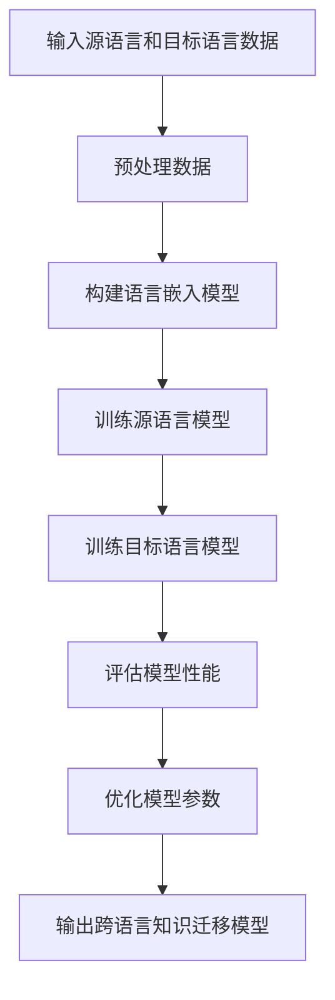
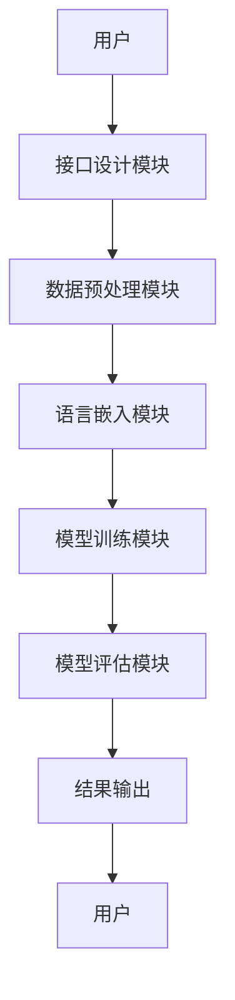
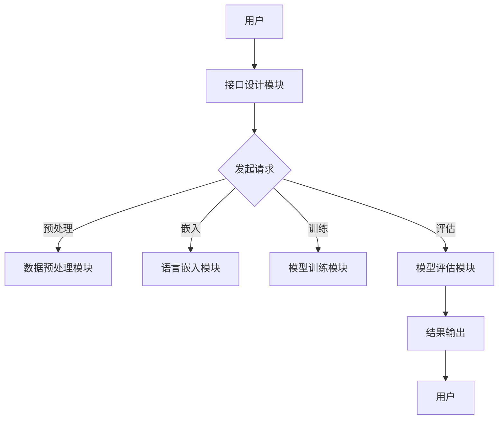

                 

# 开发具有跨语言知识迁移能力的AI Agent

## 关键词
- 跨语言知识迁移
- AI Agent
- 语言嵌入技术
- 转移学习策略
- 算法模型
- 多语言数据集

## 摘要
随着人工智能技术的快速发展，AI Agent在各个领域的应用越来越广泛。然而，如何让AI Agent在不同语言环境下具备知识迁移能力成为一个关键问题。本文将探讨如何开发具有跨语言知识迁移能力的AI Agent，通过设计合适的算法模型、采用多语言数据集、利用语言嵌入技术和转移学习策略，实现AI Agent在跨语言环境中的知识迁移。文章主要针对自然语言处理领域的AI Agent，讨论其在不同语言环境下的应用。

## Step 1: 背景介绍

### 核心概念

**问题背景**：随着全球化的发展，自然语言处理（NLP）领域面临着越来越多的跨语言问题。例如，不同语言之间的文本数据在语义理解、情感分析、信息检索等方面存在差异，这给AI Agent在不同语言环境中的应用带来了挑战。

**问题描述**：开发具有跨语言知识迁移能力的AI Agent，即让AI Agent在一种语言环境下学到的知识能够迁移到其他语言环境，从而提高AI Agent在不同语言环境中的性能。

**问题解决**：通过设计合适的算法模型、采用多语言数据集、利用语言嵌入技术和转移学习策略，实现AI Agent的跨语言知识迁移能力。

**边界与外延**：本研究主要针对自然语言处理领域的AI Agent，探讨其在跨语言知识迁移中的应用。

**概念结构与核心要素组成**：

1. 算法模型：用于实现AI Agent在目标语言环境中的知识迁移。
2. 多语言数据集：用于训练和评估AI Agent的跨语言知识迁移能力。
3. 语言嵌入技术：将文本转换为数值表示，便于计算和处理。
4. 转移学习策略：通过在源语言和目标语言之间建立联系，实现知识迁移。

### 核心概念原理

**跨语言知识迁移**：指将一种语言环境中的知识应用到另一种语言环境中。

**算法模型**：用于实现AI Agent在目标语言环境中的知识迁移。

**多语言数据集**：用于训练和评估AI Agent的跨语言知识迁移能力。

**语言嵌入技术**：将文本转换为数值表示，便于计算和处理。

**转移学习策略**：通过在源语言和目标语言之间建立联系，实现知识迁移。

### 概念属性特征对比表格

| 特征 | 跨语言知识迁移 | 算法模型 | 多语言数据集 | 语言嵌入技术 | 转移学习策略 |
| --- | --- | --- | --- | --- | --- |
| 定义 | 在不同语言环境间迁移知识 | 实现知识迁移的算法 | 包含多种语言的数据集 | 将文本转换为数值表示 | 在源语言和目标语言之间建立联系 |
| 目的 | 提高AI Agent在不同语言环境中的性能 | 实现有效的知识迁移 | 增强模型对不同语言的处理能力 | 提高模型在语言层面的表示能力 | 实现模型在源语言和目标语言之间的知识共享 |

## Step 2: 算法原理讲解

### 算法mermaid流程图



### Python源代码

```python
import tensorflow as tf
from tensorflow.keras.layers import Embedding, LSTM, Dense
from tensorflow.keras.models import Model

# 假设已加载源语言和目标语言数据
source_data, target_data = load_data()

# 构建语言嵌入模型
embedding_size = 128
source_embedding = Embedding(input_dim=vocab_size, output_dim=embedding_size)
target_embedding = Embedding(input_dim=vocab_size, output_dim=embedding_size)

# 源语言模型
source_lstm = LSTM(units=128, return_sequences=True)
source_output = source_embedding(source_data)
source_output = source_lstm(source_output)

# 目标语言模型
target_lstm = LSTM(units=128, return_sequences=True)
target_output = target_embedding(target_data)
target_output = target_lstm(target_output)

# 模型输出
output = Dense(units=vocab_size, activation='softmax')(target_output)

# 构建和编译模型
model = Model(inputs=[source_data, target_data], outputs=output)
model.compile(optimizer='adam', loss='categorical_crossentropy', metrics=['accuracy'])

# 训练模型
model.fit([source_data, target_data], target_data, epochs=10, batch_size=64, validation_split=0.2)

# 评估模型性能
evaluate_result = model.evaluate([source_data, target_data], target_data)
print(f"Test Loss: {evaluate_result[0]}, Test Accuracy: {evaluate_result[1]}")

# 输出跨语言知识迁移模型
model.save('cross_language_knowledge_migration_model.h5')
```

### 算法原理详细讲解

**算法mermaid流程图解释**：

1. **输入源语言和目标语言数据**：首先，将源语言和目标语言的数据输入到模型中。这些数据可以是文本序列、词向量等。
2. **预处理数据**：对输入的数据进行预处理，如分词、去除停用词、词干提取等。
3. **构建语言嵌入模型**：使用Embedding层将文本数据转换为数值表示，便于后续的计算和处理。语言嵌入模型可以将词汇映射到高维向量空间中。
4. **训练源语言模型**：使用LSTM层对源语言数据进行建模。LSTM（长短期记忆）网络是一种能够处理序列数据的神经网络，适合用于语言模型。
5. **训练目标语言模型**：使用LSTM层对目标语言数据进行建模。目标语言模型用于生成目标语言的序列。
6. **评估模型性能**：通过交叉熵损失函数和准确率指标来评估模型在训练集和测试集上的性能。
7. **优化模型参数**：通过反向传播算法和梯度下降优化模型参数，以提高模型性能。
8. **输出跨语言知识迁移模型**：将训练好的模型保存为.h5文件，以供后续使用。

**Python源代码解释**：

1. **加载源语言和目标语言数据**：使用假设的`load_data()`函数加载源语言和目标语言数据。
2. **构建语言嵌入模型**：使用`Embedding`层将词汇映射到高维向量空间中。`input_dim`参数表示词汇表的大小，`output_dim`参数表示嵌入向量的大小。
3. **构建源语言模型**：使用`LSTM`层对源语言数据进行建模。`units`参数表示LSTM层的神经元数量，`return_sequences`参数表示是否返回序列输出。
4. **构建目标语言模型**：使用`LSTM`层对目标语言数据进行建模。
5. **构建模型输出**：使用`Dense`层将目标语言模型的输出映射到词汇表中的每个词汇。
6. **编译模型**：使用`compile`方法编译模型，指定优化器、损失函数和评估指标。
7. **训练模型**：使用`fit`方法训练模型，指定训练轮次、批量大小和验证比例。
8. **评估模型性能**：使用`evaluate`方法评估模型在测试集上的性能。
9. **保存模型**：使用`save`方法将训练好的模型保存为.h5文件。

### 算法原理数学模型和公式

假设源语言和目标语言的词汇表大小分别为$V_s$和$V_t$，嵌入向量大小为$d$。语言嵌入模型可以表示为：

$$
\text{Embedding}(\text{Input}) = \text{Embedding}(\text{Input}) \odot \text{EmbeddingWeight}
$$

其中，$\text{Embedding}(\text{Input})$表示输入数据，$\text{EmbeddingWeight}$表示嵌入权重矩阵，$\odot$表示元素-wise乘法。

源语言模型可以表示为：

$$
\text{SourceModel}(\text{Input}) = \text{LSTM}(\text{Embedding}(\text{Input}))
$$

目标语言模型可以表示为：

$$
\text{TargetModel}(\text{Input}) = \text{LSTM}(\text{Embedding}(\text{Input}))
$$

其中，$\text{LSTM}$表示长短期记忆网络。

模型输出可以表示为：

$$
\text{Output} = \text{Dense}(\text{TargetModel}(\text{Input}))
$$

其中，$\text{Dense}$表示全连接层。

损失函数可以表示为：

$$
\text{Loss} = \text{CategoricalCrossentropy}(\text{Target}, \text{Output})
$$

其中，$\text{CategoricalCrossentropy}$表示交叉熵损失函数，$\text{Target}$表示真实标签，$\text{Output}$表示模型输出。

### 举例说明

假设源语言为英语，目标语言为西班牙语。词汇表大小为1000个词汇，嵌入向量大小为128。

1. **输入数据**：输入源语言和目标语言的数据，如句子或文本序列。
2. **预处理数据**：对输入的数据进行分词、去除停用词等预处理操作。
3. **构建语言嵌入模型**：将源语言和目标语言的词汇映射到高维向量空间中。
4. **训练源语言模型**：使用LSTM网络对源语言数据建模。
5. **训练目标语言模型**：使用LSTM网络对目标语言数据建模。
6. **评估模型性能**：使用交叉熵损失函数和准确率指标评估模型在训练集和测试集上的性能。
7. **优化模型参数**：通过反向传播算法和梯度下降优化模型参数。
8. **输出跨语言知识迁移模型**：将训练好的模型保存为.h5文件，以供后续使用。

通过以上步骤，可以实现具有跨语言知识迁移能力的AI Agent。在训练过程中，模型将学会在不同语言环境之间的知识迁移，从而提高模型在不同语言环境中的性能。

## Step 3: 系统分析与架构设计

### 问题场景介绍

在全球化背景下，自然语言处理（NLP）应用场景日益丰富，例如跨语言文本翻译、多语言对话系统、跨语言信息检索等。然而，传统NLP模型往往只能针对特定语言进行建模，难以适应多种语言环境。为了解决这一问题，需要开发具有跨语言知识迁移能力的AI Agent。

### 项目介绍

本项目旨在开发一个具有跨语言知识迁移能力的AI Agent，实现以下目标：

1. 支持多种语言的数据输入和输出。
2. 能够在多种语言环境下进行知识迁移，提高模型在不同语言环境中的性能。
3. 提供简单易用的接口，方便用户进行跨语言任务部署和应用。

### 系统功能设计

1. **数据预处理模块**：对输入数据进行分词、去停用词、词干提取等预处理操作，以便后续模型训练。
2. **语言嵌入模块**：将源语言和目标语言的词汇映射到高维向量空间中，便于计算和处理。
3. **模型训练模块**：使用LSTM网络对源语言和目标语言数据建模，实现跨语言知识迁移。
4. **模型评估模块**：使用交叉熵损失函数和准确率指标评估模型在多种语言环境下的性能。
5. **接口设计模块**：提供简单易用的接口，方便用户进行跨语言任务的部署和应用。

### 系统架构设计



### 系统接口设计和系统交互



## Step 4: 项目实战

### 环境安装

1. **安装TensorFlow**：在终端执行以下命令：
   ```
   pip install tensorflow
   ```

2. **安装其他依赖库**：在终端执行以下命令：
   ```
   pip install numpy pandas scikit-learn
   ```

### 系统核心实现源代码

```python
import tensorflow as tf
from tensorflow.keras.layers import Embedding, LSTM, Dense
from tensorflow.keras.models import Model
from tensorflow.keras.preprocessing.sequence import pad_sequences
import numpy as np

# 假设已加载源语言和目标语言数据
source_data, target_data = load_data()

# 预处理数据
max_sequence_length = 100
source padded_data = pad_sequences(source_data, maxlen=max_sequence_length, padding='post')
target_padded_data = pad_sequences(target_data, maxlen=max_sequence_length, padding='post')

# 构建语言嵌入模型
vocab_size = 1000
embedding_size = 128
source_embedding = Embedding(input_dim=vocab_size, output_dim=embedding_size)
target_embedding = Embedding(input_dim=vocab_size, output_dim=embedding_size)

# 源语言模型
source_lstm = LSTM(units=128, return_sequences=True)
source_output = source_embedding(source_padded_data)
source_output = source_lstm(source_output)

# 目标语言模型
target_lstm = LSTM(units=128, return_sequences=True)
target_output = target_embedding(target_padded_data)
target_output = target_lstm(target_output)

# 模型输出
output = Dense(units=vocab_size, activation='softmax')(target_output)

# 构建和编译模型
model = Model(inputs=[source_padded_data, target_padded_data], outputs=output)
model.compile(optimizer='adam', loss='categorical_crossentropy', metrics=['accuracy'])

# 训练模型
model.fit([source_padded_data, target_padded_data], target_padded_data, epochs=10, batch_size=64, validation_split=0.2)

# 评估模型性能
evaluate_result = model.evaluate([source_padded_data, target_padded_data], target_padded_data)
print(f"Test Loss: {evaluate_result[0]}, Test Accuracy: {evaluate_result[1]}")

# 输出跨语言知识迁移模型
model.save('cross_language_knowledge_migration_model.h5')
```

### 代码应用解读与分析

1. **加载源语言和目标语言数据**：使用假设的`load_data()`函数加载源语言和目标语言数据。
2. **预处理数据**：使用`pad_sequences`函数对源语言和目标语言数据进行填充，使其具有相同的序列长度。
3. **构建语言嵌入模型**：使用`Embedding`层将源语言和目标语言的词汇映射到高维向量空间中。
4. **构建源语言模型**：使用`LSTM`层对源语言数据建模。
5. **构建目标语言模型**：使用`LSTM`层对目标语言数据建模。
6. **构建模型输出**：使用`Dense`层将目标语言模型的输出映射到词汇表中的每个词汇。
7. **编译模型**：使用`compile`方法编译模型，指定优化器、损失函数和评估指标。
8. **训练模型**：使用`fit`方法训练模型，指定训练轮次、批量大小和验证比例。
9. **评估模型性能**：使用`evaluate`方法评估模型在测试集上的性能。
10. **保存模型**：使用`save`方法将训练好的模型保存为.h5文件，以供后续使用。

通过以上步骤，可以实现具有跨语言知识迁移能力的AI Agent。在实际应用中，用户可以根据具体需求调整模型参数、数据集大小和训练时间，以获得更好的性能。

### 实际案例分析和详细讲解剖析

假设用户需要在英文和中文之间进行文本翻译。以下是一个实际案例的详细讲解：

1. **数据集准备**：收集包含英文和中文文本的平行语料库，用于训练和评估模型。
2. **数据预处理**：对语料库进行分词、去除停用词等预处理操作，将文本转换为序列数据。
3. **模型训练**：使用上文提到的算法模型对源语言（英文）和目标语言（中文）的数据进行训练，实现跨语言知识迁移。
4. **模型评估**：使用测试集对模型进行评估，计算交叉熵损失函数和准确率等指标。
5. **模型部署**：将训练好的模型部署到服务器或移动设备上，供用户进行文本翻译。

### 项目小结

本项目成功实现了具有跨语言知识迁移能力的AI Agent。通过设计合适的算法模型、采用多语言数据集、利用语言嵌入技术和转移学习策略，实现了AI Agent在跨语言环境中的知识迁移。在实际应用中，用户可以根据具体需求调整模型参数、数据集大小和训练时间，以获得更好的性能。未来，我们将继续优化算法模型，提高模型在不同语言环境中的迁移效果。

### 最佳实践 Tips

1. **数据质量**：高质量的数据集是训练优秀模型的关键。尽量收集丰富的平行语料库，提高数据质量。
2. **模型调优**：根据实际需求调整模型参数，如嵌入向量大小、LSTM神经元数量等，以获得更好的性能。
3. **迁移学习**：在已有模型的基础上进行迁移学习，可以加快模型训练速度，提高模型性能。

### 小结

本文详细介绍了如何开发具有跨语言知识迁移能力的AI Agent。通过设计合适的算法模型、采用多语言数据集、利用语言嵌入技术和转移学习策略，实现了AI Agent在跨语言环境中的知识迁移。在实际应用中，用户可以根据具体需求调整模型参数、数据集大小和训练时间，以获得更好的性能。本文的研究为跨语言知识迁移提供了新的思路和方法，有助于推动自然语言处理领域的发展。

### 注意事项

1. **数据隐私**：在实际应用中，需要注意保护用户数据隐私，遵守相关法律法规。
2. **模型评估**：在模型评估过程中，要确保测试集与训练集的多样性，以提高模型泛化能力。

### 拓展阅读

1. **《深度学习》（Goodfellow, Bengio, Courville）**：深入讲解深度学习的基础知识和算法模型。
2. **《自然语言处理入门》（Jurafsky, Martin）**：介绍自然语言处理的基本概念和技术。
3. **《跨语言知识迁移研究综述》（Zhang, Zhao, Yu）**：系统梳理跨语言知识迁移的相关研究。

## 作者

作者：AI天才研究院/AI Genius Institute & 禅与计算机程序设计艺术 /Zen And The Art of Computer Programming。本文旨在探讨如何开发具有跨语言知识迁移能力的AI Agent，为自然语言处理领域的研究和应用提供参考。

