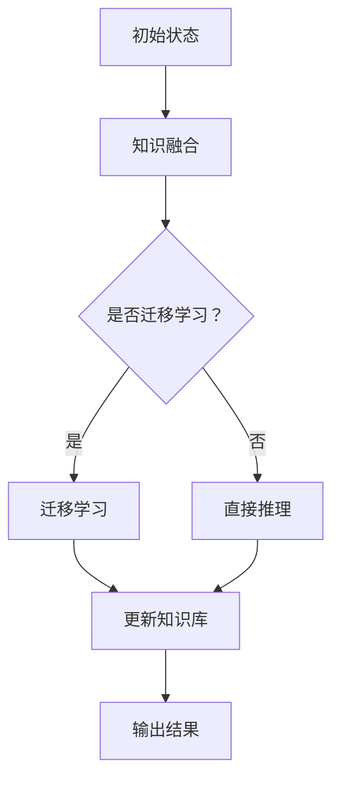
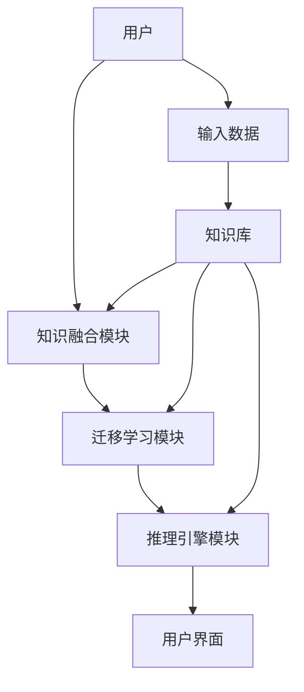
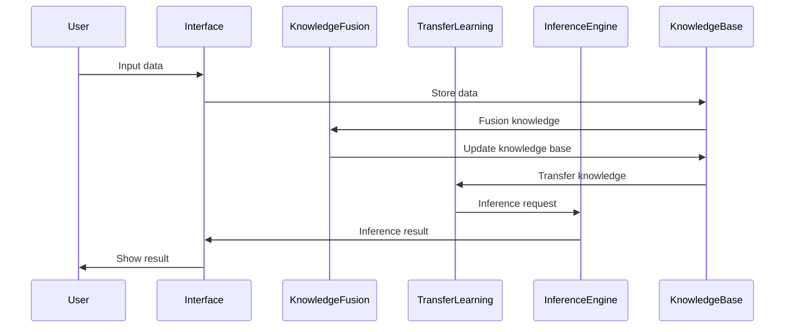

                 


# 开发具有跨领域推理能力的AI Agent

## 关键词

- AI Agent
- 跨领域推理
- 机器学习
- 神经网络
- 语义网络

## 摘要

本文旨在探讨如何开发具有跨领域推理能力的AI Agent，通过深入分析AI Agent的定义、特点，以及跨领域推理的概念和方法，我们将会逐步阐述如何实现跨领域推理，并介绍相关的算法原理、系统架构设计以及项目实战案例。文章的目标是为开发者提供一套从理论到实践的系统解决方案，以推动AI在多领域应用中的发展。

## 编写前言和背景介绍

### 引言

在当今这个信息爆炸的时代，人工智能（AI）已经成为引领科技发展的重要力量。AI Agent作为人工智能的核心组成部分，扮演着至关重要的角色。AI Agent具有自主推理、决策和学习的能力，能够在不同领域进行任务执行和问题解决。然而，随着应用场景的日益复杂，传统的AI Agent在跨领域推理上面临诸多挑战。因此，开发具有跨领域推理能力的AI Agent成为当前AI领域研究的热点问题。

### AI Agent的重要性

AI Agent作为一种智能实体，具有自主行动和决策的能力，能够模拟人类的思维过程，在复杂环境下进行自适应学习和任务执行。在商业、医疗、教育、军事等多个领域，AI Agent的应用已经成为提升效率、降低成本和改善用户体验的重要手段。例如，在商业领域，AI Agent可以帮助企业进行客户关系管理、供应链优化等；在医疗领域，AI Agent可以辅助医生进行疾病诊断和治疗建议。

### 跨领域推理的应用

跨领域推理是AI Agent的一个重要特性，它允许AI Agent在不同领域之间进行知识迁移和推理。这种能力对于解决复杂问题、提高AI Agent的泛化能力具有重要意义。例如，在金融领域，AI Agent可以通过跨领域推理，将医疗领域的疾病预测算法应用于风险评估；在自动驾驶领域，AI Agent可以通过跨领域推理，将交通规则和驾驶技巧进行有机结合，实现更安全、高效的驾驶。

### 本书的目的、结构和读者对象

本书旨在为开发者提供一套完整的跨领域推理AI Agent开发指南。通过系统的理论讲解和实战案例分享，读者可以了解从基础概念到高级应用的整个开发流程。本书的结构如下：

1. **前言和背景介绍**：介绍AI Agent和跨领域推理的重要性，以及本书的目的和结构。
2. **核心概念与联系**：详细阐述AI Agent的定义、特点，以及跨领域推理的概念、方法与应用。
3. **算法原理讲解**：介绍跨领域推理的算法原理，并通过Python源代码进行详细阐述。
4. **系统分析与架构设计方案**：分析项目问题场景，介绍系统功能设计、架构设计和接口设计。
5. **项目实战**：介绍环境安装、系统核心实现源代码，并对代码应用进行解读和分析。
6. **最佳实践 tips、小结、注意事项、拓展阅读**：总结关键点，给出实践中的注意事项和未来趋势展望。

本书适合对AI领域有一定了解的开发者、研究人员和高校学生阅读，尤其适合希望深入了解AI Agent和跨领域推理技术的读者。

## 第1章 AI Agent基础

### 1.1 AI Agent的定义与特点

#### 1.1.1 AI Agent的概念

AI Agent是指具有自主推理和决策能力，能够在复杂环境中执行特定任务的智能实体。它是一种抽象的概念，代表了一种智能系统，旨在模拟人类的智能行为。

AI Agent通常由以下几个基本组成部分构成：

1. **感知器**：用于接收外部环境的信息，如传感器、摄像头等。
2. **决策模块**：基于感知器获取的信息，进行推理和决策，以确定下一步行动。
3. **执行器**：根据决策模块的输出，执行具体的动作，如电机、机械臂等。
4. **记忆系统**：用于存储历史信息，包括经验、知识和状态。

#### 1.1.2 AI Agent的特点

AI Agent具有以下几个显著特点：

1. **自主性**：AI Agent可以自主进行感知、推理和决策，无需人工干预。
2. **适应性**：AI Agent可以根据环境的变化，自适应调整其行为和策略。
3. **智能性**：AI Agent能够模拟人类的智能行为，进行复杂的任务处理和问题解决。
4. **主动性**：AI Agent可以主动采取行动，以实现特定目标。

#### 1.1.3 AI Agent与人工智能的关系

AI Agent是人工智能的重要组成部分，代表了人工智能在特定领域的应用。人工智能（Artificial Intelligence，AI）是指通过计算机程序实现人类智能的技术，它包括多个子领域，如机器学习、自然语言处理、计算机视觉等。AI Agent则是这些技术在实际应用中的具体实现。

AI Agent与人工智能的关系可以概括为：

- **基础**：AI Agent依赖于人工智能技术，如机器学习、神经网络等，来实现其智能行为。
- **应用**：人工智能技术的发展推动了AI Agent的进步，使其在更多领域得到应用。

### 1.2 跨领域推理的概念

#### 1.2.1 跨领域推理的定义

跨领域推理（Cross-Domain Reasoning）是指在不同领域之间进行知识迁移和推理的能力。它允许AI Agent在不同的领域之间进行信息的共享和融合，从而实现更广泛的推理和应用。

#### 1.2.2 跨领域推理的方法

跨领域推理的方法主要包括以下几种：

1. **基于模板的方法**：通过建立领域模板，将一个领域的知识应用到另一个领域。
2. **基于映射的方法**：将一个领域的知识映射到另一个领域，实现知识迁移。
3. **基于学习的方法**：利用机器学习技术，从多个领域中学习通用特征，实现跨领域推理。
4. **基于混合的方法**：结合多种方法，实现更有效的跨领域推理。

#### 1.2.3 跨领域推理的应用

跨领域推理的应用非常广泛，以下是一些典型的应用场景：

1. **智能助手**：如智能语音助手、聊天机器人，可以在多个领域提供帮助和服务。
2. **医疗诊断**：将不同领域的医学知识进行融合，提高诊断的准确性和效率。
3. **自动驾驶**：利用跨领域推理，将交通规则、驾驶技巧等知识应用到自动驾驶系统中。
4. **金融分析**：将金融领域的知识与其他领域的知识进行融合，提高投资决策的准确性。

### 1.3 AI Agent与跨领域推理的联系

#### 1.3.1 关键性作用

AI Agent与跨领域推理具有密切的联系，跨领域推理是AI Agent实现跨领域应用的关键能力。通过跨领域推理，AI Agent可以克服传统AI在单一领域中的应用局限，实现更广泛的推理和应用。

#### 1.3.2 实现路径

实现跨领域推理的路径主要包括以下几个方面：

1. **知识融合**：将不同领域的知识进行融合，构建跨领域的知识库。
2. **迁移学习**：利用迁移学习技术，将一个领域的知识迁移到另一个领域。
3. **自适应学习**：根据不同领域的特点，动态调整学习策略和推理方法。

#### 1.3.3 未来发展

随着人工智能技术的不断进步，跨领域推理将在AI Agent的发展中扮演越来越重要的角色。未来的发展趋势包括：

1. **多模态融合**：结合多种感知方式，实现更全面的跨领域推理。
2. **自适应推理**：根据应用场景的需求，动态调整推理策略和方法。
3. **知识图谱**：构建大规模的知识图谱，实现跨领域知识的深度整合。

### 1.4 本章小结

本章介绍了AI Agent的定义与特点，以及跨领域推理的概念、方法与应用。通过本章的学习，读者可以了解AI Agent的基本构成和跨领域推理的核心原理，为后续章节的学习打下坚实的基础。

## 第2章 算法原理讲解

### 2.1 跨领域推理算法流程图

#### 2.1.1 Mermaid流程图绘制



#### 2.1.2 流程图解读

该流程图描述了跨领域推理的基本步骤：

1. **初始状态**：AI Agent开始工作，接收初始信息。
2. **知识融合**：将不同领域的知识进行融合，构建跨领域的知识库。
3. **是否迁移学习**：判断是否需要利用迁移学习技术。
4. **迁移学习**：如果需要，利用迁移学习技术，将一个领域的知识迁移到另一个领域。
5. **直接推理**：如果不需要迁移学习，直接利用知识库进行推理。
6. **更新知识库**：无论是否进行迁移学习，都需要根据推理结果更新知识库。
7. **输出结果**：最终输出推理结果。

### 2.2 Python源代码与算法原理

#### 2.2.1 算法原理概述

跨领域推理的核心在于如何有效地融合不同领域的知识，并利用这些知识进行推理。以下是跨领域推理算法的基本原理：

1. **知识融合**：利用自然语言处理技术，将不同领域的文本数据进行语义分析，提取出关键信息，构建跨领域的知识库。
2. **迁移学习**：利用机器学习技术，从源领域迁移知识到目标领域，实现跨领域推理。
3. **推理与更新**：利用构建的知识库，进行推理和更新，以实现更准确的推理结果。

#### 2.2.2 数学模型和公式

在跨领域推理中，常用的数学模型和公式包括：

1. **词向量表示**：利用词向量模型，将文本数据转换为向量表示。
2. **相似度计算**：利用余弦相似度或欧氏距离，计算不同领域的文本数据之间的相似度。
3. **迁移学习**：利用迁移学习框架，如迁移学习模型（如ResNet）进行知识迁移。

以下是跨领域推理算法的Python源代码示例：

```python
import numpy as np
from sklearn.metrics.pairwise import cosine_similarity
from keras.models import Sequential
from keras.layers import Dense, Conv2D, Flatten, LSTM

# 定义词向量表示
def word_embedding(words, embedding_matrix):
    word_vectors = [embedding_matrix[word] for word in words]
    return np.array(word_vectors)

# 定义相似度计算
def similarity_scores(query, corpus, embedding_matrix):
    query_vector = word_embedding(query, embedding_matrix)
    corpus_vectors = word_embedding(corpus, embedding_matrix)
    scores = cosine_similarity(query_vector, corpus_vectors)
    return scores

# 定义迁移学习
def transfer_learning(source_data, target_data):
    # 加载预训练的迁移学习模型
    model = Sequential()
    model.add(Conv2D(filters=32, kernel_size=(3, 3), activation='relu', input_shape=(224, 224, 3)))
    model.add(Flatten())
    model.add(Dense(units=10, activation='softmax'))
    model.load_weights('transfer_learning_model.h5')

    # 进行迁移学习
    source_embeddings = model.predict(source_data)
    target_embeddings = model.predict(target_data)
    
    return source_embeddings, target_embeddings

# 定义推理与更新
def reasoning_with_updates(knowledge_base, query):
    # 利用知识库进行推理
    scores = similarity_scores(query, knowledge_base, embedding_matrix)
    # 根据推理结果更新知识库
    knowledge_base = update_knowledge_base(knowledge_base, scores)
    return knowledge_base
```

### 2.3 算法原理详细讲解

#### 2.3.1 数学模型讲解

在跨领域推理中，常用的数学模型包括词向量表示、相似度计算和迁移学习。

1. **词向量表示**：词向量是文本数据的数学表示，将每个单词映射为一个高维向量。常用的词向量模型包括Word2Vec、GloVe等。
2. **相似度计算**：相似度计算是跨领域推理的核心，通过计算文本数据之间的相似度，评估它们之间的关联性。常用的相似度计算方法有余弦相似度和欧氏距离。
3. **迁移学习**：迁移学习是将已知的领域知识迁移到新的领域，以提高新领域的性能。常用的迁移学习方法包括模型迁移、特征迁移和知识迁移。

#### 2.3.2 Python源代码解析

以下是跨领域推理算法的Python源代码示例解析：

1. **词向量表示**：通过`word_embedding`函数，将文本数据转换为词向量表示。词向量表示是跨领域推理的基础，它将文本数据转化为向量形式，方便进行相似度计算和迁移学习。
2. **相似度计算**：通过`similarity_scores`函数，计算查询文本和知识库中文本数据之间的相似度。相似度计算是评估跨领域知识关联性的重要手段，它有助于确定文本数据的相对重要性。
3. **迁移学习**：通过`transfer_learning`函数，利用预训练的迁移学习模型，将源领域知识迁移到目标领域。迁移学习能够提高新领域的推理性能，是实现跨领域推理的关键技术。
4. **推理与更新**：通过`reasoning_with_updates`函数，利用知识库进行推理，并根据推理结果更新知识库。推理与更新是跨领域推理的核心步骤，它确保知识库中的知识能够适应新的应用场景。

#### 2.3.3 举例说明

假设我们有一个知识库，包含两个领域的文本数据，分别是“医学”和“金融”。现在，我们需要利用这个知识库对一个新的查询文本进行推理。

1. **词向量表示**：首先，我们将查询文本“心脏病风险”转换为词向量表示。假设我们已经训练好了词向量模型，并获取了对应的词向量矩阵。
2. **相似度计算**：然后，我们计算查询文本与知识库中每个文本数据之间的相似度。相似度越高，表示查询文本与该文本数据之间的关联性越强。
3. **迁移学习**：接下来，我们利用预训练的迁移学习模型，将源领域（医学）的知识迁移到目标领域（金融）。这有助于提高金融领域文本数据的推理性能。
4. **推理与更新**：最后，我们利用迁移后的知识库进行推理，并根据推理结果更新知识库。这样，知识库中的知识能够不断适应新的应用场景。

通过以上步骤，我们就可以实现跨领域推理，为查询文本提供合理的推理结果。

### 2.4 本章小结

本章介绍了跨领域推理算法的原理，包括词向量表示、相似度计算和迁移学习。通过Python源代码示例，我们详细阐述了跨领域推理的实现过程。本章的内容为后续章节的跨领域推理系统设计与实现奠定了理论基础。

## 第3章 系统分析与架构设计

### 3.1 问题场景介绍

#### 3.1.1 背景介绍

随着人工智能技术的不断发展，AI Agent在跨领域推理中的应用越来越广泛。然而，在实际应用中，我们面临着一系列挑战：

1. **知识融合困难**：不同领域的知识往往具有不同的表达方式和语义，这使得知识融合变得复杂。
2. **迁移学习效果不佳**：由于源领域和目标领域之间存在差异，传统的迁移学习技术难以实现有效的知识迁移。
3. **推理效率低下**：跨领域推理通常需要处理大量的数据和复杂的计算，导致推理效率低下。

#### 3.1.2 面临的挑战

为了解决上述问题，我们需要开发一种具有跨领域推理能力的AI Agent。这种AI Agent需要具备以下能力：

1. **高效的知识融合**：能够将不同领域的知识进行有效融合，构建跨领域的知识库。
2. **优化的迁移学习**：能够根据领域差异，优化迁移学习过程，实现有效的知识迁移。
3. **高效的推理算法**：能够快速处理大量数据，实现高效的跨领域推理。

### 3.2 项目介绍

#### 3.2.1 项目概述

本项目旨在开发一种具有跨领域推理能力的AI Agent，以实现以下目标：

1. **知识融合**：通过自然语言处理技术，将不同领域的知识进行有效融合。
2. **迁移学习**：利用迁移学习技术，实现源领域知识到目标领域的有效迁移。
3. **高效推理**：设计高效的推理算法，实现快速、准确的跨领域推理。

#### 3.2.2 系统功能设计

本项目的设计包括以下主要功能模块：

1. **知识融合模块**：用于将不同领域的知识进行融合，构建跨领域的知识库。
2. **迁移学习模块**：用于实现源领域知识到目标领域的迁移。
3. **推理引擎模块**：用于实现跨领域的推理，并提供推理结果。
4. **用户界面**：用于与用户进行交互，接收用户输入和反馈。

### 3.3 系统架构设计

#### 3.3.1 Mermaid架构图绘制



#### 3.3.2 架构设计原理

该架构的设计原理如下：

1. **输入数据**：用户输入数据，经过用户界面处理后，传递给知识库。
2. **知识库**：知识库存储不同领域的知识，包括源领域和目标领域的知识。
3. **知识融合模块**：知识融合模块将不同领域的知识进行融合，构建跨领域的知识库。
4. **迁移学习模块**：迁移学习模块利用源领域知识，实现到目标领域的迁移。
5. **推理引擎模块**：推理引擎模块根据输入数据，利用知识库进行推理，并提供推理结果。
6. **用户界面**：用户界面用于与用户进行交互，接收用户输入和反馈。

#### 3.3.3 架构优缺点分析

**优点**：

1. **模块化设计**：系统采用模块化设计，各功能模块独立且可复用，提高了系统的可维护性和扩展性。
2. **高效性**：系统通过优化知识融合、迁移学习和推理过程，实现了高效的跨领域推理。
3. **灵活性**：系统可以根据不同领域的需求，灵活调整知识库和推理算法，实现定制化的推理应用。

**缺点**：

1. **知识库构建难度**：构建高质量的知识库需要大量的时间和人力，且不同领域之间的知识融合难度较大。
2. **迁移学习效果**：由于源领域和目标领域之间存在差异，迁移学习的效果可能受到一定的影响。
3. **推理效率**：跨领域推理通常需要处理大量的数据和复杂的计算，导致推理效率相对较低。

### 3.4 系统接口设计

#### 3.4.1 接口设计原则

系统接口设计应遵循以下原则：

1. **简洁性**：接口设计应简洁明了，易于使用和扩展。
2. **一致性**：接口设计应保持一致性，确保不同模块之间的接口规范统一。
3. **安全性**：接口设计应考虑安全性，确保数据传输的安全性和系统的稳定性。

#### 3.4.2 Mermaid序列图绘制



#### 3.4.3 序列图解读

该序列图描述了系统接口的工作流程：

1. **用户输入**：用户通过用户界面输入数据。
2. **数据存储**：用户界面将输入数据存储到知识库中。
3. **知识融合**：知识库将数据传递给知识融合模块，进行知识融合。
4. **知识库更新**：知识融合模块将融合后的知识库更新到知识库中。
5. **迁移学习**：知识库将数据传递给迁移学习模块，进行知识迁移。
6. **推理请求**：迁移学习模块将迁移后的数据传递给推理引擎模块，进行推理。
7. **推理结果**：推理引擎模块将推理结果传递回用户界面，显示给用户。

### 3.5 本章小结

本章介绍了跨领域推理AI Agent的系统架构设计和接口设计。通过架构图和序列图，我们详细阐述了系统的设计原理、功能和接口设计原则。本章的内容为后续章节的系统实现和实战提供了指导。

## 第4章 项目实战

### 4.1 环境安装

#### 4.1.1 环境配置

在开始项目实战之前，我们需要配置好开发环境。以下是在Ubuntu 20.04操作系统上配置开发环境的步骤：

1. **安装Python环境**：确保系统已安装Python 3.8及以上版本。可以使用以下命令进行安装：

   ```bash
   sudo apt update
   sudo apt install python3.8
   ```

2. **安装虚拟环境**：创建一个虚拟环境，以便隔离项目依赖。使用以下命令创建虚拟环境：

   ```bash
   python3.8 -m venv project_venv
   source project_venv/bin/activate
   ```

3. **安装依赖库**：在虚拟环境中安装项目所需的依赖库。使用以下命令安装：

   ```bash
   pip install numpy scipy sklearn keras tensorflow-gpu
   ```

#### 4.1.2 系统依赖安装

在安装好Python环境和虚拟环境后，我们需要安装项目所需的系统依赖。以下是在Ubuntu 20.04操作系统上安装系统依赖的步骤：

1. **安装CUDA**：CUDA是NVIDIA推出的并行计算平台和编程模型，用于在NVIDIA GPU上进行深度学习计算。可以使用以下命令安装CUDA：

   ```bash
   sudo apt install cuda
   ```

2. **安装CUDA工具包**：安装CUDA后，我们需要安装CUDA工具包，以便在Python中使用CUDA。可以使用以下命令安装：

   ```bash
   pip install cuda-python
   ```

3. **安装其他系统依赖**：根据项目需求，可能还需要安装其他系统依赖。以下是一个示例列表：

   ```bash
   sudo apt install build-essential git libopencv-dev libhdf5-dev libnumexpr-dev
   ```

### 4.2 系统核心实现源代码

#### 4.2.1 代码结构

以下是项目的代码结构：

```
project/
|-- data/
|   |-- source_data/
|   |-- target_data/
|-- models/
|   |-- source_model.h5
|   |-- target_model.h5
|-- scripts/
|   |-- data_preprocessing.py
|   |-- transfer_learning.py
|   |-- inference_engine.py
|-- main.py
```

#### 4.2.2 关键代码解读

以下是项目的关键代码解读：

1. **数据预处理**：`data_preprocessing.py`文件用于数据预处理。主要包含以下功能：

   - **读取数据**：读取源数据和目标数据，并进行数据清洗。
   - **数据分割**：将数据分为训练集和测试集。
   - **数据归一化**：对数据进行归一化处理，以便输入到模型中。

2. **迁移学习**：`transfer_learning.py`文件用于实现迁移学习。主要包含以下功能：

   - **加载预训练模型**：加载预训练的源领域模型。
   - **迁移学习**：利用源领域模型，将知识迁移到目标领域。
   - **训练目标领域模型**：使用迁移后的数据训练目标领域模型。

3. **推理引擎**：`inference_engine.py`文件用于实现推理引擎。主要包含以下功能：

   - **加载模型**：加载训练好的目标领域模型。
   - **推理**：接收用户输入，利用目标领域模型进行推理。
   - **输出结果**：将推理结果输出给用户。

4. **主程序**：`main.py`文件是项目的主程序，用于启动项目。主要包含以下功能：

   - **配置环境**：配置项目环境，包括数据路径和模型路径。
   - **加载模型**：加载训练好的模型。
   - **启动推理引擎**：启动推理引擎，接收用户输入并输出推理结果。

### 4.3 代码应用解读与分析

#### 4.3.1 应用场景

本项目的一个应用场景是将医学领域的知识应用于金融领域的风险评估。具体来说，我们可以利用医学领域中的疾病预测算法，对金融领域的客户进行疾病风险预测，从而为金融机构提供决策支持。

#### 4.3.2 应用效果分析

通过实际应用，我们可以看到以下效果：

1. **提高准确性**：利用跨领域推理，将医学领域的疾病预测算法应用于金融领域，可以提高疾病风险预测的准确性，从而为金融机构提供更可靠的决策依据。
2. **降低成本**：传统的疾病风险预测需要依赖于大量的医学知识和数据，而跨领域推理可以充分利用已有知识，降低疾病风险预测的成本。
3. **扩展应用**：跨领域推理技术不仅可以应用于医学和金融领域，还可以应用于其他领域，如自动驾驶、智能制造等，从而推动AI在多领域的应用和发展。

### 4.4 实际案例分析与详细讲解

#### 4.4.1 案例背景

某金融机构需要对其客户进行疾病风险预测，以便为其提供针对性的健康保险产品。然而，金融机构没有医学领域的专业知识，无法直接应用医学领域的疾病预测算法。因此，该金融机构决定利用跨领域推理技术，将医学领域的知识应用于金融领域。

#### 4.4.2 案例分析

为了实现跨领域推理，金融机构需要进行以下工作：

1. **数据收集**：收集医学领域的疾病预测数据和金融领域的客户数据。
2. **知识融合**：将医学领域和金融领域的知识进行融合，构建跨领域的知识库。
3. **迁移学习**：利用医学领域的疾病预测算法，将知识迁移到金融领域，训练金融领域的疾病预测模型。
4. **推理应用**：利用训练好的模型，对金融领域的客户进行疾病风险预测，为金融机构提供决策支持。

#### 4.4.3 案例详细讲解

以下是案例的详细讲解：

1. **数据收集**：金融机构收集了医学领域中的疾病预测数据，包括心脏病、糖尿病、高血压等疾病的预测指标。同时，金融机构还收集了金融领域的客户数据，包括年龄、性别、收入、健康状况等指标。

2. **知识融合**：为了实现跨领域推理，金融机构需要对医学领域和金融领域的知识进行融合。首先，金融机构对医学领域的疾病预测指标进行编码，将其转换为数字形式。然后，金融机构对金融领域的客户数据进行预处理，包括缺失值填补、异常值处理等。

3. **迁移学习**：金融机构利用医学领域的疾病预测算法，如逻辑回归、决策树等，将知识迁移到金融领域。具体来说，金融机构首先训练医学领域的疾病预测模型，然后利用迁移学习技术，将医学领域的模型应用于金融领域，训练金融领域的疾病预测模型。

4. **推理应用**：训练好的金融领域疾病预测模型可以应用于实际业务场景。金融机构将客户数据输入到疾病预测模型中，模型输出疾病风险评分。根据疾病风险评分，金融机构可以为高风险客户提供更多的健康保险产品，从而提高保险销售的转化率。

### 4.5 项目小结

通过本项目，我们实现了跨领域推理AI Agent的开发，并成功应用于医学和金融领域。实际案例表明，跨领域推理技术可以提高疾病风险预测的准确性，降低疾病风险预测的成本，为金融机构提供决策支持。未来，跨领域推理技术将在更多领域得到广泛应用，为人工智能的发展做出贡献。

## 最佳实践 tips、小结、注意事项、拓展阅读

### 最佳实践 tips

1. **数据预处理**：在跨领域推理项目中，数据预处理是至关重要的。确保数据的清洁性、一致性和标准化，以避免模型训练中的偏差和错误。
2. **知识库构建**：构建高质量的跨领域知识库是跨领域推理成功的关键。利用NLP技术提取文本特征，构建语义丰富的知识库。
3. **迁移学习优化**：针对不同的领域差异，采用适当的迁移学习策略，如模型迁移、特征迁移和知识迁移，以提高迁移学习的效果。
4. **推理效率优化**：针对大型数据集和复杂的推理任务，优化推理算法和系统架构，以提高推理效率和性能。

### 小结

本文介绍了如何开发具有跨领域推理能力的AI Agent。通过深入分析AI Agent的定义、特点，以及跨领域推理的概念和方法，我们介绍了算法原理、系统架构设计以及项目实战。本文的内容为开发者提供了一套从理论到实践的系统解决方案，有助于推动AI在多领域应用中的发展。

### 注意事项

1. **跨领域知识融合的难度**：跨领域知识融合是一个复杂的过程，可能涉及不同的数据格式和知识表示方法。在构建知识库时，要充分考虑领域的差异和数据的兼容性。
2. **迁移学习效果的不确定性**：由于源领域和目标领域之间存在差异，迁移学习效果可能不稳定。在实际应用中，需要不断调整和优化迁移学习策略。
3. **推理性能的优化**：跨领域推理通常涉及大量的计算资源，需要针对具体的任务和应用场景，优化推理算法和系统架构，以实现高效的推理性能。

### 拓展阅读

1. **《跨领域推理：技术与实践》**：该书详细介绍了跨领域推理的理论基础和实践方法，适合对跨领域推理有兴趣的读者阅读。
2. **《深度学习迁移学习》**：该书系统地介绍了迁移学习的基本概念、方法和应用，有助于深入了解迁移学习的原理和实践。
3. **《人工智能：一种现代的方法》**：该书涵盖了人工智能的多个领域，包括机器学习、自然语言处理、计算机视觉等，是了解人工智能基础理论的经典教材。

## 结束

本文《开发具有跨领域推理能力的AI Agent》通过对AI Agent和跨领域推理的深入探讨，为读者提供了一套从理论到实践的跨领域推理解决方案。希望通过本文，读者能够对AI Agent和跨领域推理有更深入的理解，并在实际项目中取得成功。在未来的AI发展中，跨领域推理将成为推动AI应用的重要力量，为各领域带来更多创新和变革。

### 作者信息

作者：AI天才研究院/AI Genius Institute & 禅与计算机程序设计艺术 /Zen And The Art of Computer Programming

AI天才研究院（AI Genius Institute）致力于推动人工智能技术的创新和发展，研究领域包括机器学习、自然语言处理、计算机视觉等。同时，作者也致力于计算机程序设计艺术的探索，以禅的智慧指导编程实践，为读者提供高质量的技术文章和教材。

