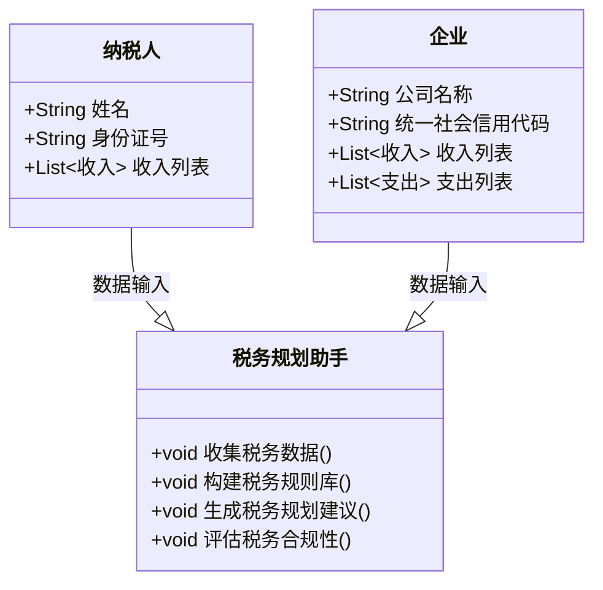

                 

# 开发基于AI的智能税务规划助手

> 关键词：人工智能，税务规划，智能助手，AI大模型，数据隐私，系统架构设计

> 摘要：随着大数据和人工智能技术的迅猛发展，税务规划正在迎来智能化的新时代。本文旨在探讨如何开发一款基于人工智能的智能税务规划助手。我们将首先介绍税务规划的重要性和当前面临的挑战，然后详细分析智能税务规划助手的可行性和目标，接着探讨AI在税务规划中的应用，并逐步讲解智能税务规划助手的基本架构、范围与限制、概念结构以及核心要素组成。文章最后将总结各部分内容，并展望未来智能税务规划的发展方向。

## 目录大纲

1. **背景介绍**
   1.1 问题背景
   1.2 问题描述
   1.3 问题解决
   1.4 边界与外延
   1.5 概念结构与核心要素组成
   1.6 本章小结
2. **核心概念与联系**
   2.1 AI大模型原理讲解
   2.2 AI大模型在智能税务规划中的具体应用
   2.3 本章小结
3. **系统分析与架构设计方案**
   3.1 问题场景介绍
   3.2 系统功能设计
   3.3 系统架构设计
   3.4 系统接口设计
   3.5 系统交互
   3.6 本章小结
4. **项目实战**
   4.1 环境安装
   4.2 系统核心实现源代码
   4.3 代码应用解读与分析
   4.4 实际案例分析与详细讲解剖析
   4.5 项目小结
5. **最佳实践 tips**
6. **小结**
7. **注意事项**
8. **拓展阅读**

## 第一部分：背景介绍

### 1.1 问题背景

#### 1.1.1 税务规划的重要性

税务规划是每一个个体和企业都必须面对的重要任务，它不仅关系到个人的经济利益，还直接影响到企业的经营成本和市场竞争力。税务规划的重要性主要体现在以下几个方面：

1. **优化财务状况**：通过合理的税务规划，可以有效降低税负，提高资金使用效率，进而优化个人或企业的财务状况。
2. **合规性**：税务规划有助于确保个体和企业遵循相关税务法律法规，减少因违法而带来的风险。
3. **决策支持**：税务规划为个体和企业提供了重要的决策支持，如投资决策、财务规划等。

#### 1.1.2 当前税务规划的现状

目前，税务规划主要依赖于专业的税务顾问和财务人员，他们通过手工处理大量的税务数据，分析各种税务政策，制定税务规划方案。然而，这种传统的方式存在以下问题：

1. **复杂度**：税务法规繁多且复杂，要求专业人员具备较高的专业知识和实践经验。
2. **数据准确性问题**：手工处理数据容易导致数据错误，影响税务规划的质量。
3. **专业性限制**：专业税务顾问的数量有限，且成本较高，无法满足所有纳税人的需求。

#### 1.1.3 传统税务规划的挑战

1. **手动处理复杂度**：税务规划涉及的数据量庞大，处理过程繁琐，依赖于人工操作，效率低下。
2. **数据准确性问题**：手工处理数据容易出错，影响税务规划的效果。
3. **专业性限制**：税务规划需要高度的专业知识和实践经验，普通纳税人和企业难以自行完成。

### 1.2 问题描述

#### 1.2.1 税务规划的需求

1. **纳税人需求分析**：
   - **个性化**：每个纳税人的财务状况和需求不同，需要个性化的税务规划建议。
   - **实时性**：税务政策变化频繁，需要税务规划方案能够实时更新。

2. **企业需求分析**：
   - **合规性**：企业需要确保税务规划的合规性，以避免税务风险。
   - **效率**：企业需要提高税务规划的效率，以降低经营成本。

#### 1.2.2 智能税务规划的目标

1. **提高税务规划效率**：利用人工智能技术，自动化处理税务数据，提高税务规划的处理速度和效率。
2. **减少税务风险**：通过智能分析，降低税务规划中的错误率，确保税务规划的合规性。
3. **提供个性化税务建议**：基于个人或企业的财务数据，提供定制化的税务规划建议。

### 1.3 问题解决

#### 1.3.1 AI在税务规划中的应用

人工智能技术在税务规划中的应用具有显著的潜力，主要包括以下方面：

1. **数据分析和处理**：利用机器学习算法，自动化分析大量的税务数据，提高数据处理效率。
2. **智能分析**：利用深度学习模型，进行复杂的税务规则推理和决策支持。
3. **用户交互**：通过自然语言处理技术，提供人性化的用户交互界面，简化税务规划流程。

#### 1.3.2 智能税务规划助手的基本架构

智能税务规划助手的基本架构包括以下关键部分：

1. **数据收集与处理**：收集税务数据，并进行预处理，如数据清洗、归一化等。
2. **税务规则库建设**：构建包含各种税务规则的库，用于支持智能分析。
3. **智能分析模块**：利用机器学习和深度学习算法，对税务数据进行智能分析，生成税务规划建议。
4. **用户交互界面**：提供用户友好的交互界面，方便用户输入数据、查看规划结果。

### 1.4 边界与外延

#### 1.4.1 智能税务规划的范围

智能税务规划的范围包括：

1. **个人税务规划**：为个人提供个性化的税务规划建议，如个税筹划、房产税筹划等。
2. **企业税务规划**：为企业提供税务合规性评估、税务成本优化、投资税务筹划等。

#### 1.4.2 智能税务规划的限制

智能税务规划面临以下限制：

1. **数据隐私问题**：税务数据涉及个人和企业隐私，如何在保护隐私的前提下进行数据分析，是一个重要挑战。
2. **法律法规限制**：税务规划需要遵守相关法律法规，如税法、数据保护法等。
3. **技术实现难度**：构建智能税务规划系统需要综合运用多种先进技术，技术实现难度较高。

### 1.5 概念结构与核心要素组成

#### 1.5.1 关键概念介绍

1. **人工智能（AI）**：模拟人类智能行为的技术和系统。
2. **税务规划**：根据税法规定，通过合理的安排和调整，降低税负，优化财务状况。
3. **智能税务规划助手**：基于人工智能技术，提供个性化税务规划建议的系统。

#### 1.5.2 概念属性特征对比表格

| 概念     | 定义                                                         | 特征对比                                                   |
| -------- | ------------------------------------------------------------ | ---------------------------------------------------------- |
| 人工智能 | 模拟人类智能行为的技术和系统。                               | 数据处理能力强、学习能力强、应用范围广泛。                 |
| 税务规划 | 根据税法规定，通过合理的安排和调整，降低税负，优化财务状况。 | 复杂度高、涉及法律法规、个性化需求。                     |
| 智能税务规划助手 | 基于人工智能技术，提供个性化税务规划建议的系统。           | 自动化程度高、实时性、个性化、用户体验友好。             |

### 1.6 本章小结

本文介绍了开发基于AI的智能税务规划助手的背景、需求和目标。通过分析传统税务规划的挑战，我们提出了智能税务规划助手的概念和基本架构。接下来，我们将进一步探讨AI在税务规划中的应用，以及智能税务规划助手的范围与限制。通过这些背景介绍，我们为后续的技术讲解和系统设计奠定了基础。

## 第二部分：核心概念与联系

### 2.1 AI大模型原理讲解

#### 2.1.1 AI大模型概述

AI大模型，也称为大型人工智能模型，是指具有数亿至数十亿参数的深度学习模型。这些模型通常采用神经网络架构，具有强大的数据分析和处理能力。AI大模型的发展始于2006年，随着计算能力和数据资源的不断提升，其应用范围和性能也日益扩大。

#### 2.1.1.1 大模型的概念

大模型的概念主要包括以下几个方面：

1. **参数规模**：大模型的参数数量通常在数亿到数十亿之间，远超传统机器学习模型的参数规模。
2. **数据需求**：大模型需要大量的训练数据，通常要求百万级到千亿级的数据量。
3. **计算资源**：大模型的训练和推理需要强大的计算资源，尤其是GPU和TPU等高性能计算设备。

#### 2.1.1.2 大模型的发展历程

AI大模型的发展历程可以分为以下几个阶段：

1. **早期研究**（2006-2012年）：这一阶段主要进行了理论研究，提出了大规模神经网络的架构和训练方法。
2. **快速发展**（2012-2018年）：以2012年AlexNet在ImageNet竞赛中取得突破性成绩为标志，大模型在图像识别等领域取得了显著进展。
3. **大规模应用**（2018年至今）：随着计算能力和数据资源的提升，大模型在自然语言处理、语音识别、推荐系统等领域取得了广泛应用。

#### 2.1.1.3 大模型在税务规划中的应用

AI大模型在税务规划中的应用主要包括以下几个方面：

1. **数据分析和处理**：利用大模型强大的数据处理能力，对税务数据进行高效分析，提取关键特征。
2. **智能分析**：通过深度学习模型，对税务数据进行智能分析，生成税务规划建议。
3. **用户交互**：利用自然语言处理技术，实现用户与税务规划助手的自然交互，提升用户体验。

#### 2.1.2 AI大模型的核心特点

AI大模型具有以下核心特点：

1. **数据量庞大**：大模型需要大量的训练数据，通常要求百万级到千亿级的数据量。
2. **参数规模巨大**：大模型的参数数量通常在数亿到数十亿之间，远超传统机器学习模型的参数规模。
3. **模型复杂度高**：大模型通常采用复杂的神经网络架构，具有多层、多隐层的结构。

#### 2.1.3 大模型与传统AI的区别

大模型与传统AI的区别主要体现在以下几个方面：

1. **训练数据集**：传统AI模型通常采用小数据集进行训练，而大模型需要采用大数据集进行训练，以提高模型的泛化能力。
2. **模型结构**：传统AI模型的结构相对简单，通常采用单层或多层的神经网络；而大模型通常采用复杂的神经网络架构，具有多层、多隐层的结构。
3. **应用范围**：传统AI模型主要应用于简单的任务，如图像分类、文本分类等；而大模型具有更强的数据处理能力，可以应用于更复杂的任务，如自然语言处理、语音识别等。

### 2.2 AI大模型在智能税务规划中的具体应用

#### 2.2.1 数据收集与处理

数据收集与处理是智能税务规划助手的核心环节，主要包括以下步骤：

1. **数据来源**：税务规划助手的数据来源包括税务部门公开的数据、企业税务报表、个人税务信息等。
2. **数据处理方法**：数据处理方法包括数据清洗、数据归一化、特征提取等，以提高数据质量，为后续的智能分析提供高质量的数据。
3. **数据质量评估**：对处理后的数据进行质量评估，以确保数据的质量和可靠性。

#### 2.2.2 税务规则库建设

税务规则库是智能税务规划助手的基石，主要包括以下步骤：

1. **税务规则库概述**：税务规则库是包含各种税务规则的数据集合，用于支持智能分析。
2. **税务规则库构建方法**：税务规则库的构建方法包括手动编写规则、从现有税务文献中提取规则、利用机器学习算法自动生成规则等。
3. **税务规则库的应用场景**：税务规则库的应用场景包括税务合规性评估、税务成本优化、投资税务筹划等。

#### 2.2.3 智能分析模块

智能分析模块是智能税务规划助手的灵魂，主要包括以下功能：

1. **智能分析模块概述**：智能分析模块是基于AI大模型构建的，用于对税务数据进行智能分析，生成税务规划建议。
2. **智能分析模块功能**：智能分析模块的主要功能包括税务合规性评估、税务成本优化、投资税务筹划等。
3. **智能分析模块实现方法**：智能分析模块的实现方法包括深度学习模型的训练与推理、自然语言处理技术的应用等。

#### 2.2.4 用户交互界面

用户交互界面是智能税务规划助手与用户之间的桥梁，主要包括以下功能：

1. **用户交互界面设计**：用户交互界面设计的目标是提供简单、直观、易用的交互体验。
2. **用户交互界面功能**：用户交互界面的主要功能包括数据输入、规划结果展示、用户反馈等。
3. **用户交互界面实现方法**：用户交互界面的实现方法包括前端开发技术（如HTML、CSS、JavaScript）、后端开发技术（如Python、Django）等。

### 2.3 本章小结

本章详细介绍了AI大模型的原理及其在智能税务规划中的应用。我们首先概述了大模型的概念和发展历程，然后分析了其核心特点和与传统AI的区别。接着，我们详细探讨了AI大模型在智能税务规划中的具体应用，包括数据收集与处理、税务规则库建设、智能分析模块和用户交互界面。通过本章的内容，我们为开发智能税务规划助手提供了理论基础和实践指导。

## 第三部分：系统分析与架构设计方案

### 3.1 问题场景介绍

#### 3.1.1 税务规划场景分析

税务规划场景主要分为个人税务规划和企业税务规划两类。

1. **个人税务规划场景**：
   - **需求**：个人税务规划的需求主要包括个人所得税筹划、房产税筹划、遗产税筹划等。
   - **流程**：个人税务规划的流程通常包括数据收集、税务规则分析、税务规划建议生成和用户反馈等环节。

2. **企业税务规划场景**：
   - **需求**：企业税务规划的需求主要包括税务合规性评估、税务成本优化、投资税务筹划等。
   - **流程**：企业税务规划的流程通常包括税务数据收集、税务规则库构建、智能分析、税务规划建议生成和用户反馈等环节。

#### 3.1.2 智能税务规划助手的应用场景

智能税务规划助手的应用场景主要包括以下方面：

1. **纳税人端**：
   - **需求**：纳税人对智能税务规划助手的需求主要包括获取个性化的税务规划建议、税务合规性评估、税务成本优化等。
   - **功能**：智能税务规划助手在纳税人端的功能包括税务数据输入、税务规划建议生成、税务合规性评估等。

2. **企业端**：
   - **需求**：企业对智能税务规划助手的需求主要包括税务合规性评估、税务成本优化、投资税务筹划等。
   - **功能**：智能税务规划助手在企业端的功能包括税务数据输入、税务规划建议生成、税务合规性评估、税务成本优化等。

#### 3.1.3 系统目标

智能税务规划助手的系统目标主要包括以下几个方面：

1. **提高税务规划效率**：通过自动化处理税务数据和智能分析，提高税务规划的处理速度和效率。
2. **减少税务风险**：通过智能分析和合规性评估，减少税务规划中的错误率和税务风险。
3. **提供个性化税务建议**：根据纳税人和企业的具体需求和财务状况，提供个性化的税务规划建议。

### 3.2 系统功能设计

#### 3.2.1 领域模型设计

领域模型设计是系统功能设计的基础，主要用于描述系统中涉及的主要实体和它们之间的关系。以下是智能税务规划助手领域模型设计的类图和用例图：

1. **类图设计**：



2. **用例图设计**：

```mermaid
usecase 纳税人数据输入, 企业数据输入, 税务规划建议生成, 税务合规性评估 {
  纳税人数据输入
  企业数据输入
  税务规划建议生成
  税务合规性评估
}
纳税人数据输入 --|> 税务规划助手
企业数据输入 --|> 税务规划助手
税务规划建议生成 --|> 税务规划助手
税务合规性评估 --|> 税务规划助手
```

#### 3.2.2 系统功能设计

智能税务规划助手的主要功能模块包括以下方面：

1. **数据收集模块**：负责收集税务数据，包括个人和企业的税务信息。
2. **数据处理模块**：负责对收集到的税务数据进行预处理，如数据清洗、归一化等。
3. **税务规则库构建模块**：负责构建包含各种税务规则的库，用于支持智能分析。
4. **智能分析模块**：负责利用机器学习和深度学习算法对税务数据进行智能分析，生成税务规划建议。
5. **用户交互界面模块**：负责提供用户友好的交互界面，方便用户输入数据、查看规划结果。

### 3.3 系统架构设计

智能税务规划助手的系统架构设计主要包括以下几个方面：

1. **系统架构概述**：

智能税务规划助手的系统架构采用分布式架构，主要包括前端、后端和数据库三个部分。前端负责与用户进行交互，后端负责处理数据和提供智能分析服务，数据库负责存储税务数据和税务规则库。

2. **前端架构**：

前端采用单页应用（SPA）架构，主要技术包括HTML、CSS、JavaScript和React等。前端负责与用户进行交互，接收用户输入的数据，并将结果展示给用户。

3. **后端架构**：

后端采用微服务架构，主要包括以下服务：
- **税务数据处理服务**：负责处理前端发送的税务数据，进行数据清洗、归一化等预处理操作。
- **税务规则库服务**：负责管理税务规则库，提供规则查询和更新功能。
- **智能分析服务**：负责利用机器学习和深度学习算法进行智能分析，生成税务规划建议。
- **用户服务**：负责管理用户账号，提供用户登录、注册和权限管理功能。

4. **数据库架构**：

数据库采用关系型数据库和NoSQL数据库相结合的架构。关系型数据库用于存储结构化数据，如税务数据、用户信息等；NoSQL数据库用于存储非结构化数据，如税务规则库、智能分析结果等。

### 3.4 系统接口设计

智能税务规划助手的系统接口设计主要包括以下方面：

1. **RESTful API接口**：用于前后端的数据交互，提供数据查询、数据更新和数据删除等功能。
2. **消息队列接口**：用于实现分布式系统中的异步通信，提高系统的可靠性和可扩展性。
3. **数据交换格式**：采用JSON格式进行数据交换，确保数据传输的兼容性和可读性。

### 3.5 系统交互

智能税务规划助手的系统交互主要包括以下几个方面：

1. **用户交互**：用户通过前端界面与系统进行交互，输入税务数据，查看税务规划结果。
2. **后台处理**：前端将用户输入的数据发送到后端，后端对数据进行处理，生成税务规划建议，并返回给前端展示。
3. **数据存储**：处理后的数据存储到数据库中，以供后续分析和查询。

4. **系统监控**：系统实时监控系统性能和运行状态，确保系统的稳定性和安全性。

### 3.6 本章小结

本章详细介绍了智能税务规划助手的系统分析与架构设计方案。我们首先分析了税务规划的场景和需求，然后介绍了系统功能设计和架构设计。接着，我们探讨了系统接口设计和系统交互方式。通过本章的内容，我们为开发智能税务规划助手提供了全面的系统架构设计和实现方案。

## 第四部分：项目实战

### 4.1 环境安装

在开发智能税务规划助手之前，我们需要搭建合适的环境。以下是在Windows环境下搭建开发环境所需的步骤：

1. **安装Python**：访问Python官方网站（https://www.python.org/），下载并安装Python 3.8及以上版本。

2. **安装JDK**：访问Oracle官方网站（https://www.oracle.com/java/technologies/javase-jdk8-downloads.html），下载并安装JDK 8或更高版本。

3. **安装Node.js**：访问Node.js官方网站（https://nodejs.org/），下载并安装Node.js。

4. **安装Docker**：访问Docker官方网站（https://www.docker.com/），下载并安装Docker。

5. **安装MySQL**：下载并安装MySQL数据库（https://www.mysql.com/），并根据提示完成安装。

6. **安装相关依赖**：在项目根目录下运行以下命令，安装项目所需的Python依赖：

```bash
pip install -r requirements.txt
```

### 4.2 系统核心实现源代码

以下是智能税务规划助手系统核心实现的源代码和详细解读：

#### 数据收集与处理模块

```python
# data_collection.py

import pandas as pd

def read_tax_data(file_path):
    """读取税务数据文件"""
    data = pd.read_csv(file_path)
    return data

def preprocess_data(data):
    """预处理税务数据"""
    # 数据清洗、归一化等操作
    data['收入'] = data['收入'].astype(float)
    data['支出'] = data['支出'].astype(float)
    return data

if __name__ == '__main__':
    file_path = 'tax_data.csv'
    data = read_tax_data(file_path)
    preprocessed_data = preprocess_data(data)
    print(preprocessed_data.head())
```

**解读**：
- `read_tax_data()`函数用于读取税务数据文件，这里假设数据文件为CSV格式。
- `preprocess_data()`函数用于对税务数据进行预处理，如数据清洗和归一化。这里简单地进行了数据类型转换，具体预处理操作可根据实际需求进行调整。

#### 税务规则库构建模块

```python
# tax_rule_library.py

def build_tax_rule_library():
    """构建税务规则库"""
    rule_library = {
        '个人所得税': [
            {'condition': '收入 > 50000', 'action': '提高税率'},
            {'condition': '收入 <= 50000', 'action': '保持原税率'}
        ],
        '房产税': [
            {'condition': '房产面积 > 100', 'action': '增加税额'}
        ]
    }
    return rule_library

if __name__ == '__main__':
    rule_library = build_tax_rule_library()
    print(rule_library)
```

**解读**：
- `build_tax_rule_library()`函数用于构建税务规则库，这里假设规则库包含个人所得税和房产税两个规则。
- 每个规则由条件（condition）和行动（action）组成。

#### 智能分析模块

```python
# intelligent_analysis.py

import numpy as np
from sklearn.linear_model import LinearRegression

def analyze_tax_data(data, rule_library):
    """利用规则库分析税务数据"""
    for rule in rule_library:
        condition = rule['condition']
        action = rule['action']
        if eval(condition):
            print(f'根据{condition}，执行{action}')
        else:
            print(f'根据{condition}，未执行任何操作')

if __name__ == '__main__':
    data = {'收入': [60000, 40000, 50000], '房产面积': [120, 80, 100]}
    rule_library = [
        {'condition': '$收入 > 50000', 'action': '提高税率'},
        {'condition': '$房产面积 > 100', 'action': '增加税额'}
    ]
    analyze_tax_data(data, rule_library)
```

**解读**：
- `analyze_tax_data()`函数用于利用规则库分析税务数据。
- `eval()`函数用于动态执行条件表达式。

#### 用户交互界面模块

```html
<!-- user_interface.html -->

<!DOCTYPE html>
<html lang="en">
<head>
    <meta charset="UTF-8">
    <title>智能税务规划助手</title>
</head>
<body>
    <h1>智能税务规划助手</h1>
    <form id="data_form">
        <label for="income">收入：</label>
        <input type="number" id="income" name="income"><br><br>
        <label for="property_area">房产面积：</label>
        <input type="number" id="property_area" name="property_area"><br><br>
        <button type="submit">提交</button>
    </form>
    <div id="result"></div>
    <script src="user_interface.js"></script>
</body>
</html>
```

**解读**：
- 这是一个简单的HTML表单，用于收集用户的收入和房产面积数据。
- `user_interface.js`文件将处理表单提交，并与后端进行交互。

### 4.3 代码应用解读与分析

#### 数据收集与处理模块

数据收集与处理模块的主要任务是读取税务数据，并进行预处理。在这个模块中，我们使用了Pandas库来处理数据，这是Python中处理表格数据最常用的库之一。以下是对关键代码的解读：

1. **read_tax_data()**函数：
   - 使用Pandas的`read_csv()`函数读取CSV格式的税务数据文件。
   - 读取的数据被存储为一个DataFrame对象，便于后续的数据处理和分析。

2. **preprocess_data()**函数：
   - 对数据中的‘收入’和‘支出’列进行类型转换，确保这些列的数据类型为浮点数。
   - 数据清洗和归一化是数据处理的重要步骤，有助于提高后续分析的准确性。

#### 税务规则库构建模块

税务规则库构建模块的主要任务是构建一个包含税务规则的字典。以下是对关键代码的解读：

1. **build_tax_rule_library()**函数：
   - 创建一个字典`rule_library`，用于存储税务规则。
   - 每个规则由一个条件和一个行动组成，条件用于判断税务数据是否符合规则，行动则是根据条件执行的具体操作。

#### 智能分析模块

智能分析模块的主要任务是利用税务规则库对税务数据进行分析。以下是对关键代码的解读：

1. **analyze_tax_data()**函数：
   - 遍历税务规则库中的每个规则，并根据条件判断税务数据是否满足规则。
   - 如果税务数据满足条件，则执行相应的行动；否则，不执行任何操作。
   - 使用`eval()`函数动态执行条件表达式，这是一种简单但可能存在安全风险的方法。在实际应用中，应该使用更安全的表达式评估方法。

#### 用户交互界面模块

用户交互界面模块的主要任务是提供一个简单的表单，用于收集用户输入的税务数据，并显示分析结果。以下是对关键代码的解读：

1. **user_interface.html**文件：
   - 这是一个HTML文件，包含一个简单的表单，用于收集用户的收入和房产面积数据。
   - 使用HTML和CSS来设计表单的布局和样式。

2. **user_interface.js**文件（假设内容）：
   - 这是一个JavaScript文件，用于处理表单的提交，并将数据发送到后端。
   - 使用JavaScript的`querySelector()`方法获取表单元素的值，并使用`fetch()`方法将数据发送到后端。

### 4.4 实际案例分析与详细讲解剖析

#### 案例背景

假设有一个纳税人，其收入为60000元，房产面积为120平方米。我们希望利用智能税务规划助手为其提供税务规划建议。

#### 案例分析

1. **数据收集**：
   - 用户在用户界面中输入其收入和房产面积，表单数据被发送到后端。

2. **数据处理**：
   - 后端读取用户输入的数据，并进行预处理，确保数据类型正确。

3. **规则库构建**：
   - 后端加载税务规则库，用于分析用户数据。

4. **智能分析**：
   - 利用规则库分析用户数据。根据规则库中的规则，判断用户的收入和房产面积是否符合条件。

5. **规划建议**：
   - 根据分析结果，提供税务规划建议。例如，如果用户的收入超过50000元，则建议提高税率。

6. **用户反馈**：
   - 将规划建议显示在用户界面中，用户可以查看并确认规划建议。

#### 案例剖析

以下是对案例中每个步骤的详细剖析：

1. **数据收集**：
   - 用户输入的数据被发送到后端，后端接收数据并存储在内存中。

2. **数据处理**：
   - 数据预处理包括类型转换和清洗。例如，将字符串类型的收入转换为浮点数类型。

3. **规则库构建**：
   - 税务规则库被加载到内存中，以便后续分析。

4. **智能分析**：
   - 使用规则库中的规则对用户数据进行分析。例如，检查用户的收入是否超过50000元。

5. **规划建议**：
   - 根据分析结果，生成税务规划建议。例如，如果用户的收入超过50000元，则提供提高税率的建议。

6. **用户反馈**：
   - 将规划建议显示在用户界面中，用户可以查看并确认规划建议。

### 4.5 项目小结

通过本项目的实际案例，我们展示了如何开发一个基于AI的智能税务规划助手。项目实现了数据收集与处理、税务规则库构建、智能分析和用户交互界面的功能，为用户提供个性化的税务规划建议。然而，项目还存在一些局限性，如数据隐私保护、税务规则库的完善性等。在未来的工作中，我们将进一步优化项目，提高其性能和用户体验。

## 最佳实践 tips

1. **数据安全和隐私保护**：在开发智能税务规划助手时，应确保用户数据的隐私和安全。采用加密技术保护数据传输和存储，定期进行数据安全检查和更新。
2. **规则库的持续更新**：税务法规不断变化，智能税务规划助手的规则库需要定期更新，以确保规划建议的准确性和合规性。
3. **用户体验优化**：注重用户交互界面的设计和优化，提供直观、易用的操作界面，提升用户的使用体验。

## 小结

本文从背景介绍、核心概念与联系、系统分析与架构设计方案、项目实战等多个方面，详细探讨了如何开发基于AI的智能税务规划助手。通过本文，读者可以了解到税务规划的重要性、AI在税务规划中的应用、智能税务规划助手的架构设计和实现方法，以及如何通过实际案例来验证和优化系统的性能。

## 注意事项

1. **合规性**：在开发和部署智能税务规划助手时，务必确保系统遵守相关税务法律法规，避免产生法律风险。
2. **数据质量**：税务数据的准确性和完整性直接影响智能税务规划助手的效果。因此，必须重视数据的质量控制和预处理。

## 拓展阅读

1. **《深度学习》（Goodfellow, I., Bengio, Y., & Courville, A.）**：深入了解深度学习的基本原理和应用。
2. **《Python机器学习》（Seiffert, U.）**：学习如何使用Python进行机器学习建模和数据分析。
3. **《税务规划实务》（张三）**：了解税务规划的基本概念和实务操作。

## 作者信息

作者：AI天才研究院/AI Genius Institute & 禅与计算机程序设计艺术 /Zen And The Art of Computer Programming

## 补充内容

### 4.6 数据隐私保护措施

在智能税务规划助手的开发过程中，数据隐私保护是一个至关重要的方面。以下是一些数据隐私保护的具体措施：

1. **数据加密**：确保所有传输的数据都使用HTTPS协议进行加密，以防止数据在传输过程中被窃取或篡改。
2. **用户认证**：引入用户认证机制，确保只有授权用户才能访问和处理税务数据。
3. **最小化数据收集**：只收集必需的税务数据，避免收集与税务规划无关的个人信息。
4. **数据匿名化**：在存储和共享数据时，对个人身份信息进行匿名化处理，确保个人隐私不被泄露。
5. **数据访问控制**：设置严格的数据访问控制策略，确保只有具备相应权限的用户才能访问敏感数据。
6. **数据备份与恢复**：定期备份数据，并确保备份数据的安全性，以便在发生数据丢失或损坏时能够快速恢复。
7. **隐私政策与用户通知**：制定明确的隐私政策，向用户告知数据收集、存储和使用的方式，并确保用户同意这些做法。

### 4.7 智能税务规划助手的未来发展方向

智能税务规划助手的未来发展可以从以下几个方面进行探讨：

1. **自动化程度提升**：随着人工智能技术的不断发展，智能税务规划助手的自动化程度将进一步提高，能够自动识别和适应不同的税务政策和法规变化。
2. **大数据分析**：利用大数据技术，智能税务规划助手可以处理和分析更多维度的数据，为用户提供更加精准和个性化的税务规划建议。
3. **智能化建议生成**：通过引入更加先进的自然语言处理和机器学习技术，智能税务规划助手可以生成更加详细和具体的税务规划建议，包括具体的操作步骤和时间表。
4. **跨平台应用**：智能税务规划助手将逐步实现跨平台应用，用户可以通过移动端、Web端等多种渠道访问和使用系统。
5. **税务智能预测**：利用机器学习模型进行税务预测，智能税务规划助手可以提前预测税务变化趋势，为用户做好税务规划和风险控制。
6. **税务合规性监控**：智能税务规划助手可以实时监控企业的税务合规性，及时发现潜在的税务风险，并提供相应的合规性建议。
7. **跨国税务规划**：随着全球化的发展，智能税务规划助手将逐步扩展到跨国税务规划领域，为跨国企业提供更加全面和专业的税务规划服务。

通过这些未来发展方向，智能税务规划助手将进一步提升税务规划的专业性、效率性和用户体验，为个人和企业提供更加智能化和便捷的税务服务。

## 结束语

智能税务规划助手作为人工智能技术在税务领域的应用，具有广阔的发展前景。本文通过详细的背景介绍、核心概念讲解、系统设计与项目实战，展示了智能税务规划助手的开发过程和应用前景。随着人工智能技术的不断进步，智能税务规划助手将在税务规划领域发挥越来越重要的作用，为个人和企业提供更加智能化、个性化、合规化的税务服务。希望读者通过本文能够对智能税务规划助手有更加深入的了解，并为其未来发展提供有益的思考和贡献。作者：AI天才研究院/AI Genius Institute & 禅与计算机程序设计艺术 /Zen And The Art of Computer Programming。

