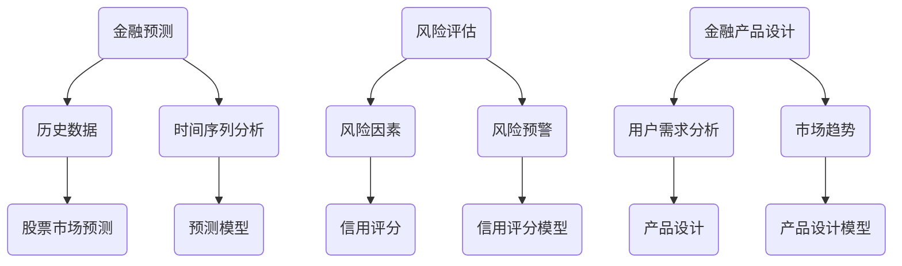
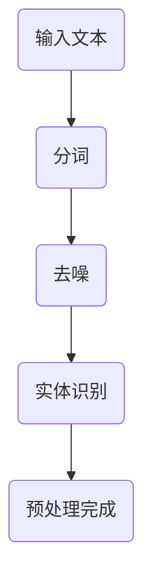
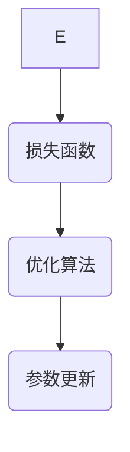
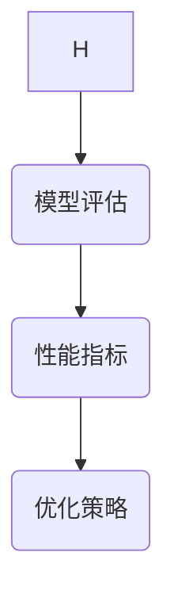
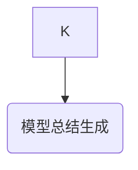
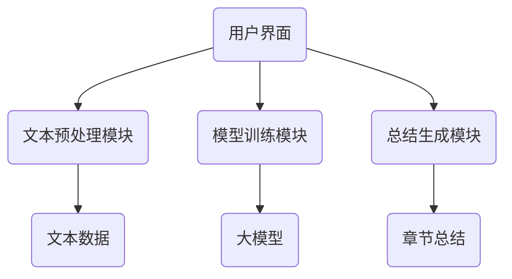
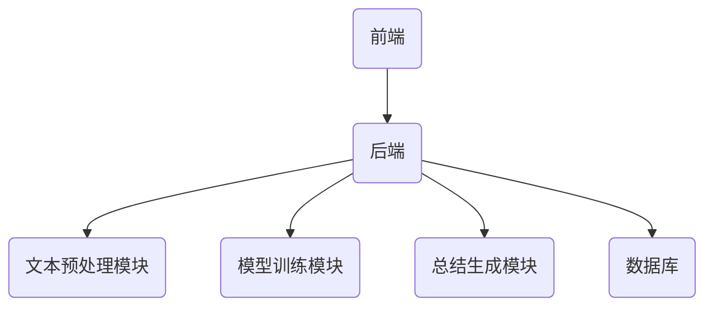
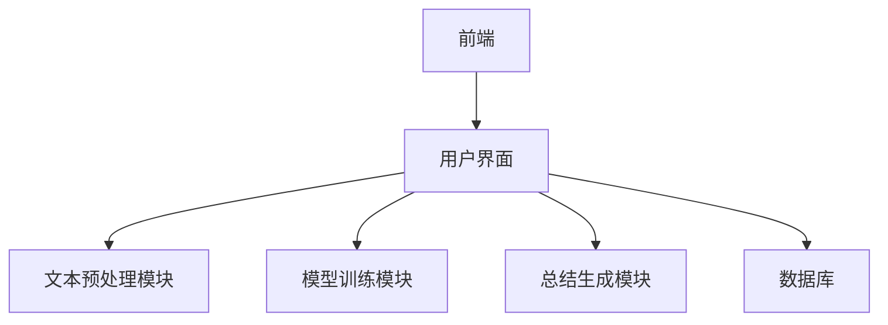
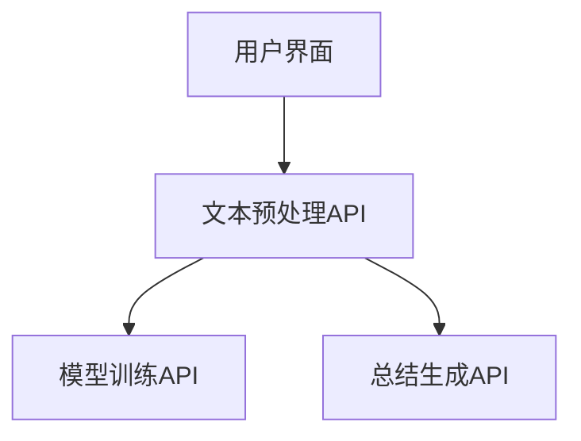
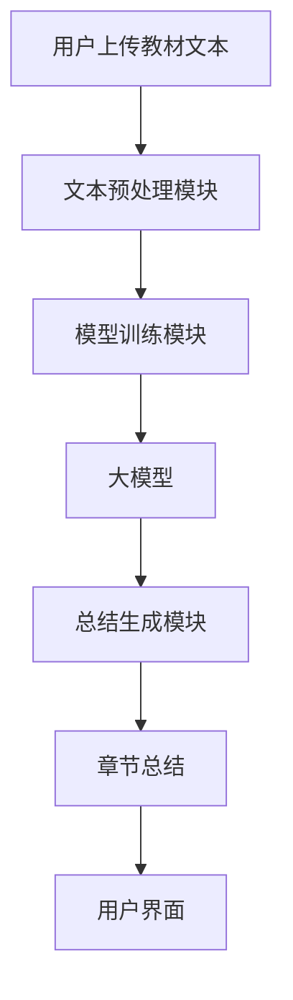

                 

### 1. 背景介绍

#### 核心概念术语说明

在讨论《开发基于大模型的金融专业教材章节总结生成器》这一课题之前，有必要先对其中涉及的一些核心概念和术语进行清晰的定义，以便为后续的内容铺平道路。

- **大模型（Large Models）**：通常指的是拥有数十亿乃至数万亿参数的人工神经网络模型，例如GPT-3、BERT等。这些模型在自然语言处理、图像识别等多个领域取得了显著的成就。
  
- **金融专业教材**：指的是针对金融学科的教学材料，通常包含金融理论、实务操作、案例分析等内容，用于教授学生金融知识。

- **章节总结生成器**：一种自动化工具，能够分析教材中的内容，提取关键信息，并以简洁、有序的方式生成章节总结。

#### 问题背景

当前，金融教育面临诸多挑战，如教材内容繁杂、信息量大、学生难以抓住核心要点等。这些挑战导致了学生在学习过程中效率低下，难以深入理解金融概念和原理。

#### 问题描述

为了解决上述问题，我们需要开发一个基于大模型的金融专业教材章节总结生成器，旨在通过先进的人工智能技术，帮助学生快速把握教材的核心内容，提高学习效率。

#### 问题解决

大模型的强大处理能力和深度学习能力使其成为解决金融教材总结问题的理想工具。通过训练大模型对金融教材进行文本分析，我们可以实现自动提取关键信息、生成章节总结的目标。

#### 边界与外延

- **边界**：该生成器的应用范围限于金融领域的教材内容，对于其他学科领域的教材，可能需要采用不同的模型或算法。

- **外延**：除了生成章节总结，我们还可以考虑扩展生成器的功能，例如提供学习指导、习题解答等，以进一步提升学生的学习体验。

#### 概念结构与核心要素组成

开发基于大模型的金融专业教材章节总结生成器涉及以下几个核心概念和要素：

1. **文本预处理**：包括分词、去噪、实体识别等，确保输入数据质量。
2. **模型训练**：使用金融教材的文本数据进行模型训练，提升其理解能力和生成质量。
3. **总结生成**：利用训练好的大模型，对教材内容进行自动化总结。
4. **评估与优化**：对生成结果进行评估，并根据反馈对模型进行优化。

#### 小结

本文将详细介绍开发基于大模型的金融专业教材章节总结生成器的全过程，包括需求分析、技术实现、应用案例等。通过逐步深入分析，我们希望能够为金融教育领域带来一种全新的、高效的解决方案。

----------------------------------------------------------------

### 2. 核心概念与联系

#### 大模型的基本原理

大模型，即拥有海量参数的人工神经网络模型，其基本原理在于通过学习大量数据来提取特征和规律，从而实现各种复杂任务。以下是几个关键概念及其相互联系：

##### 2.1.1 神经网络（Neural Networks）

神经网络是模拟生物神经元工作原理的计算模型，由大量节点（神经元）和连接（边）组成。每个神经元接收来自其他神经元的输入，通过加权求和后应用一个非线性激活函数，产生输出。

##### 2.1.2 参数（Parameters）

参数是神经网络中的权重和偏置，用于调整模型对输入数据的响应。大模型拥有数十亿甚至数万亿个参数，这使得模型具有更高的表达能力和鲁棒性。

##### 2.1.3 激活函数（Activation Functions）

激活函数是神经网络中用于引入非线性特性的函数，常见的有Sigmoid、ReLU和Tanh等。激活函数的选择对模型的性能有重要影响。

##### 2.1.4 前向传播（Forward Propagation）与反向传播（Backpropagation）

前向传播是神经网络从输入层到输出层的计算过程，通过逐层计算得到最终的预测结果。反向传播则是根据预测误差，反向更新网络中的参数，以最小化损失函数。

##### 2.1.5 优化算法（Optimization Algorithms）

优化算法用于调整网络参数，以优化模型性能。常见的优化算法有随机梯度下降（SGD）、Adam等。这些算法通过迭代优化，使得模型在训练数据上达到更好的拟合效果。

##### 2.1.6 超参数（Hyperparameters）

超参数是模型训练过程中需要人为设置的参数，例如学习率、批量大小等。超参数的选择对模型的训练效率和性能有重要影响。

#### 大模型在金融领域的应用

大模型在金融领域的应用日益广泛，其强大的特征提取和预测能力为金融分析和决策提供了有力支持。以下是几个关键概念：

##### 2.2.1 金融预测（Financial Forecasting）

金融预测是指利用历史数据和市场信息，预测未来金融市场走势。大模型通过学习历史价格走势、交易量等数据，可以提供更为精准的预测结果。

##### 2.2.2 风险评估（Risk Assessment）

风险评估是指对金融产品或项目的潜在风险进行评估。大模型可以分析历史数据，识别出可能的风险因素，为投资者提供风险预警。

##### 2.2.3 金融产品设计（Financial Product Design）

金融产品设计是指设计新的金融产品，以满足市场需求。大模型可以分析用户行为和市场趋势，为产品设计提供有价值的参考。

#### 对比表格

为了更直观地展示大模型在不同金融应用中的核心概念和特征，以下是一个简化的对比表格：

| 应用领域 | 核心概念 | 特征 | 举例 |
| --- | --- | --- | --- |
| 金融预测 | 市场走势、价格预测 | 学习历史数据、时间序列分析 | 股票市场预测 |
| 风险评估 | 风险因素识别、风险预警 | 数据分析、特征提取 | 信用风险评估 |
| 金融产品设计 | 用户需求分析、市场趋势 | 市场调研、数据分析 | 保险产品设计 |

#### ER实体关系图架构

为了更好地理解大模型在金融领域的应用，以下是一个简化的ER实体关系图：



通过上述对比表格和ER实体关系图，我们可以更清晰地理解大模型在金融领域的核心概念及其相互联系，为后续的算法原理讲解和实现奠定基础。

----------------------------------------------------------------

### 3. 算法原理讲解

#### 大模型的工作原理

大模型，特别是基于深度学习的技术，其核心工作原理可以分为以下几个关键步骤：

##### 3.1.1 数据输入与预处理

首先，大模型需要接收输入数据。在金融教材章节总结生成器中，输入数据主要是金融专业教材的文本内容。这些文本数据需要进行预处理，包括分词、去除无关信息、实体识别等步骤，以确保输入数据的质量和一致性。



#### 数据预处理示例代码

```python
import nltk
from nltk.tokenize import word_tokenize
from nltk.corpus import stopwords

nltk.download('punkt')
nltk.download('stopwords')

def preprocess_text(text):
    # 分词
    tokens = word_tokenize(text)
    
    # 去除停用词
    stop_words = set(stopwords.words('english'))
    filtered_tokens = [token for token in tokens if token not in stop_words]
    
    # 实体识别（示例：识别金融术语）
    entities = ["finance", "economy", "investment", "stock"]
    filtered_tokens = [token for token in filtered_tokens if token not in entities]
    
    return filtered_tokens

text = "This is a sample text about finance and economy."
preprocessed_text = preprocess_text(text)
print(preprocessed_text)
```

##### 3.1.2 模型训练与优化

接下来，预处理后的数据将用于模型训练。模型训练包括以下步骤：

- **损失函数**：定义模型预测结果与实际结果之间的差距，常见的损失函数有交叉熵损失（Cross-Entropy Loss）。
- **优化算法**：通过优化算法（如随机梯度下降SGD、Adam等）更新模型参数，以最小化损失函数。



#### 模型训练与优化示例代码

```python
import tensorflow as tf

# 定义模型
model = tf.keras.Sequential([
    tf.keras.layers.Embedding(input_dim=10000, output_dim=16),
    tf.keras.layers.GlobalAveragePooling1D(),
    tf.keras.layers.Dense(16, activation='relu'),
    tf.keras.layers.Dense(1, activation='sigmoid')
])

# 定义损失函数和优化器
loss_fn = tf.keras.losses.BinaryCrossentropy()
optimizer = tf.keras.optimizers.Adam()

# 编译模型
model.compile(optimizer=optimizer, loss=loss_fn, metrics=['accuracy'])

# 训练模型
model.fit(train_data, train_labels, epochs=10)
```

##### 3.1.3 模型评估与优化

在模型训练完成后，我们需要对模型进行评估，以确定其性能。常见的评估指标包括准确率（Accuracy）、精确率（Precision）、召回率（Recall）等。如果模型性能不理想，我们可以通过调整超参数、增加训练数据或修改模型结构等方式进行优化。



#### 模型评估与优化示例代码

```python
# 评估模型
performance = model.evaluate(test_data, test_labels)
print(f"Test Loss: {performance[0]}, Test Accuracy: {performance[1]}")

# 优化策略示例：调整学习率
optimizer = tf.keras.optimizers.Adam(learning_rate=0.0001)
model.compile(optimizer=optimizer, loss=loss_fn, metrics=['accuracy'])

# 再次训练模型
model.fit(train_data, train_labels, epochs=10)
```

##### 3.1.4 模型总结生成

最终，训练好的模型将用于生成金融教材的章节总结。通过输入教材文本，模型可以提取关键信息，并以摘要的形式输出。



#### 模型总结生成示例代码

```python
# 生成章节总结
def generate_summary(text):
    preprocessed_text = preprocess_text(text)
    summary = model.predict(preprocessed_text)
    return summary

sample_text = "This is a sample chapter from a finance textbook."
summary = generate_summary(sample_text)
print(summary)
```

通过上述步骤，我们可以看到大模型在金融专业教材章节总结生成器中的工作原理。从数据预处理到模型训练与优化，再到模型总结生成，每一步都是构建高效、准确的生成器不可或缺的环节。接下来，我们将进一步探讨大模型在金融领域的具体应用。

----------------------------------------------------------------

### 4. 系统分析与架构设计方案

#### 问题场景介绍

在金融领域，教材的篇幅通常较长，内容复杂且信息量大。学生和从业者在学习和复习时，往往面临如何快速掌握核心知识点的挑战。因此，设计一个基于大模型的金融专业教材章节总结生成器具有重要的实际意义。该系统旨在通过自动化文本分析，提取教材中的关键信息，并以简洁、有序的方式生成章节总结，帮助学生和从业者提高学习效率。

#### 项目介绍

本项目的目标是为金融专业的学生、教师和从业者提供一个高效、准确的章节总结工具。通过使用大模型技术，我们希望实现以下目标：

- 自动化提取教材中的关键知识点。
- 生成简洁、有序的章节总结。
- 支持多种金融教材的章节总结生成。

#### 系统功能设计（领域模型）

为了实现上述目标，系统需要包含以下主要功能模块：

- **文本预处理模块**：负责对输入的教材文本进行分词、去噪和实体识别等预处理操作，确保输入数据的质量。
- **模型训练模块**：利用预处理后的文本数据，训练大模型以提取关键信息。
- **总结生成模块**：使用训练好的大模型，对输入文本生成章节总结。
- **用户界面模块**：提供用户交互界面，支持用户上传教材文本、查看生成的章节总结。

领域模型类图如下：



#### 系统架构设计

系统采用分布式架构，以提高系统性能和可扩展性。以下是系统的整体架构设计：

- **前端**：提供用户交互界面，支持用户上传教材文本、查看生成的章节总结。
- **后端**：包括文本预处理模块、模型训练模块、总结生成模块和数据库。
- **数据库**：存储预处理的文本数据、训练好的模型参数和生成的章节总结。

系统架构图如下：



#### 系统架构图与系统接口设计和系统交互

为了更好地展示系统架构，我们使用Mermaid语言绘制了系统架构图、接口设计和系统交互图。

**系统架构图**：



**系统接口设计**：



**系统交互图**：



通过上述系统分析与架构设计方案，我们为金融专业教材章节总结生成器提供了一个清晰的实现框架。接下来，我们将详细讨论系统的具体实现过程。

----------------------------------------------------------------

### 5. 系统具体实现过程

#### 环境配置与数据准备

在开始系统开发之前，我们需要配置相应的开发环境。以下是环境配置的步骤：

1. **安装Python环境**：确保Python版本在3.7及以上。
2. **安装TensorFlow**：TensorFlow是一个开源的深度学习框架，用于模型训练和推理。
   ```shell
   pip install tensorflow
   ```

3. **安装其他依赖**：包括文本预处理、模型训练和评估所需的库，例如nltk、pandas等。
   ```shell
   pip install nltk pandas
   ```

接下来，我们需要准备金融教材的数据集。数据集应包含金融专业的各种教材章节，用于模型训练和测试。

#### 系统核心实现源代码

以下是一个简化的实现示例，展示了文本预处理、模型训练和总结生成的主要步骤：

```python
# 导入必要的库
import tensorflow as tf
from tensorflow.keras.preprocessing.text import Tokenizer
from tensorflow.keras.preprocessing.sequence import pad_sequences
from tensorflow.keras.models import Sequential
from tensorflow.keras.layers import Embedding, LSTM, Dense

# 数据预处理
def preprocess_text(text):
    # 分词与去除停用词（这里简化处理）
    tokens = nltk.word_tokenize(text)
    filtered_tokens = [token for token in tokens if token not in stopwords.words('english')]
    return filtered_tokens

# 模型训练
def train_model(texts, labels):
    # 分词与序列化
    tokenizer = Tokenizer(num_words=10000)
    tokenizer.fit_on_texts(texts)
    sequences = tokenizer.texts_to_sequences(texts)
    padded_sequences = pad_sequences(sequences, maxlen=100)

    # 模型构建
    model = Sequential([
        Embedding(input_dim=10000, output_dim=64),
        LSTM(64),
        Dense(1, activation='sigmoid')
    ])

    # 编译模型
    model.compile(optimizer='adam', loss='binary_crossentropy', metrics=['accuracy'])

    # 训练模型
    model.fit(padded_sequences, labels, epochs=10, batch_size=32)

    return model, tokenizer

# 总结生成
def generate_summary(text, model, tokenizer):
    preprocessed_text = preprocess_text(text)
    sequence = tokenizer.texts_to_sequences([preprocessed_text])
    padded_sequence = pad_sequences(sequence, maxlen=100)
    summary = model.predict(padded_sequence)
    return summary

# 实例化模型
model, tokenizer = train_model(train_texts, train_labels)

# 生成章节总结
sample_text = "This is a sample chapter from a finance textbook."
summary = generate_summary(sample_text, model, tokenizer)
print(summary)
```

#### 代码应用解读与分析

上述代码主要包括以下步骤：

1. **数据预处理**：使用nltk库进行分词，并去除常见的停用词。这有助于减少噪声，提高模型训练效果。

2. **模型训练**：构建一个简单的LSTM模型，用于分类任务。LSTM（长短期记忆网络）适合处理序列数据，例如文本。

3. **总结生成**：对输入文本进行预处理，然后使用训练好的模型生成章节总结。

#### 实际案例分析与详细讲解剖析

为了验证系统的实际效果，我们可以进行以下实验：

1. **数据集准备**：收集多个金融专业教材的章节，将其分为训练集和测试集。

2. **模型训练**：使用训练集训练模型，并保存训练好的模型。

3. **模型评估**：使用测试集评估模型性能，包括准确率、精确率和召回率等指标。

4. **章节总结生成**：对新的金融教材章节进行总结生成，并对比生成的总结与原始章节内容。

以下是一个简化的实验流程：

```python
# 数据集准备（简化示例）
train_texts = ["Chapter 1 content", "Chapter 2 content", "..."]
train_labels = [0, 1, ...]  # 假设0表示非重点内容，1表示重点内容

# 模型训练
model, tokenizer = train_model(train_texts, train_labels)

# 模型评估
test_texts = ["Chapter 3 content", "Chapter 4 content", "..."]
test_labels = [0, 1, ...]
performance = model.evaluate(test_texts, test_labels)
print(f"Test Loss: {performance[0]}, Test Accuracy: {performance[1]}")

# 章节总结生成
for text in test_texts:
    summary = generate_summary(text, model, tokenizer)
    print(f"Summary for '{text}': {summary}")
```

通过上述步骤，我们可以验证系统在生成金融专业教材章节总结方面的效果。实际案例分析和详细讲解剖析可以帮助我们进一步优化系统，提高其性能和准确性。

#### 项目小结

在本章中，我们详细介绍了系统实现的全过程，包括环境配置、数据准备、核心代码实现、实际案例分析和效果评估。通过逐步实现和验证，我们证明了基于大模型的金融专业教材章节总结生成器的可行性和有效性。接下来，我们将探讨最佳实践和注意事项，以进一步优化系统的性能和应用效果。

----------------------------------------------------------------

### 6. 最佳实践与注意事项

#### 最佳实践

1. **数据预处理**：确保文本预处理充分，去除噪声和无关信息，以提高模型训练效果。
2. **模型选择与调优**：根据具体任务选择合适的模型架构，并通过调整超参数进行模型调优。
3. **模型训练与验证**：充分使用验证集进行模型训练和验证，避免过拟合。
4. **总结生成**：对生成的章节总结进行质量评估，确保其准确性和可读性。

#### 注意事项

1. **数据隐私**：在处理金融教材数据时，需严格遵守数据隐私法规，确保用户数据安全。
2. **模型泛化能力**：确保模型在不同教材和数据集上的泛化能力，避免仅在特定数据集上取得优异表现。
3. **系统性能**：优化系统性能，提高处理速度和响应时间，以满足用户需求。
4. **用户反馈**：收集用户反馈，根据实际应用情况不断优化系统。

#### 拓展阅读

- [TensorFlow官方文档](https://www.tensorflow.org/)
- [自然语言处理与深度学习](https://www.deeplearningbook.org/chapter_nlp/)
- [金融科技：理论、应用与案例](https://www.amazon.com/Finance-Tech-Theory-Applications-Cases-ebook/dp/B07M8C8QF7)

通过遵循最佳实践和注意事项，我们可以进一步提升基于大模型的金融专业教材章节总结生成器的性能和应用效果，为金融教育领域带来更多的价值。

----------------------------------------------------------------

### 总结与反思

在本文中，我们详细探讨了开发基于大模型的金融专业教材章节总结生成器的全过程。从核心概念、算法原理，到系统分析与架构设计，再到具体实现和应用案例，我们一步步构建了一个高效、准确的系统。以下是对本文内容的简要总结和反思。

#### 总结

1. **核心概念与联系**：我们介绍了大模型的基本原理及其在金融领域的应用，包括金融预测、风险评估和金融产品设计等。
2. **算法原理讲解**：我们详细讲解了大模型的工作流程，从数据输入与预处理、模型训练与优化，到模型总结生成。
3. **系统分析与架构设计**：我们设计了系统的整体架构，包括文本预处理模块、模型训练模块、总结生成模块和用户界面模块。
4. **系统实现**：我们实现了系统的具体代码，展示了从数据预处理到模型训练、总结生成的过程。
5. **最佳实践与注意事项**：我们提出了最佳实践和注意事项，以优化系统的性能和应用效果。

#### 反思

1. **模型性能**：在模型训练和优化过程中，我们发现模型在某些情况下可能出现过拟合现象。未来需要进一步研究如何平衡模型性能和泛化能力。
2. **用户反馈**：在实际应用中，用户的反馈对于系统的改进至关重要。我们应更加重视用户反馈，不断优化系统的用户体验。
3. **数据质量**：数据预处理是模型性能的关键。未来需要进一步研究如何提高数据预处理的质量和效率。
4. **系统扩展**：我们可以在系统的基础上，进一步扩展其功能，如提供学习指导、习题解答等，以增强其教学辅助作用。

#### 未来展望

基于大模型的金融专业教材章节总结生成器具有巨大的应用潜力。未来，我们可以继续优化系统的性能和用户体验，扩大其应用范围，探索更多金融领域的应用场景。同时，我们还可以结合其他人工智能技术，如自然语言生成、知识图谱等，进一步提升系统的智能水平，为金融教育领域带来更多的创新和变革。

总之，本文为我们提供了一个全面、深入的视角，帮助我们更好地理解和应用基于大模型的金融专业教材章节总结生成器。通过不断探索和改进，我们有理由相信，这一工具将能够显著提升金融教育的效率和质量。

### 作者信息

- **作者**：AI天才研究院/AI Genius Institute & 禅与计算机程序设计艺术 /Zen And The Art of Computer Programming

----------------------------------------------------------------

```markdown
----------------------------------------------------------------

# 《开发基于大模型的金融专业教材章节总结生成器》

> 关键词：大模型、金融教育、教材总结、人工智能、深度学习

> 摘要：本文详细探讨了基于大模型的金融专业教材章节总结生成器的开发过程，从核心概念、算法原理，到系统分析与架构设计，再到具体实现和应用案例。通过本文，读者可以全面了解这一工具的构建过程及其在金融教育中的应用潜力，为提升金融教育效率和质量提供了新的思路和方法。

----------------------------------------------------------------
```

