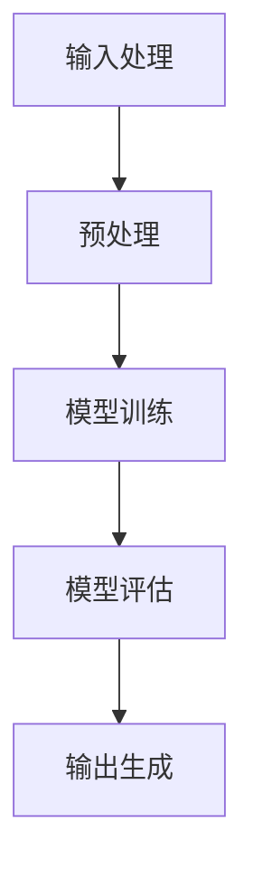
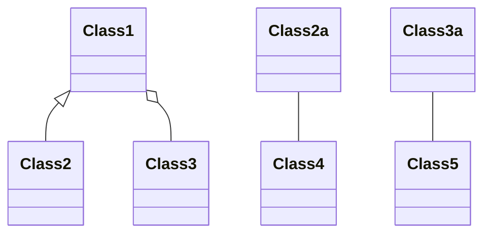
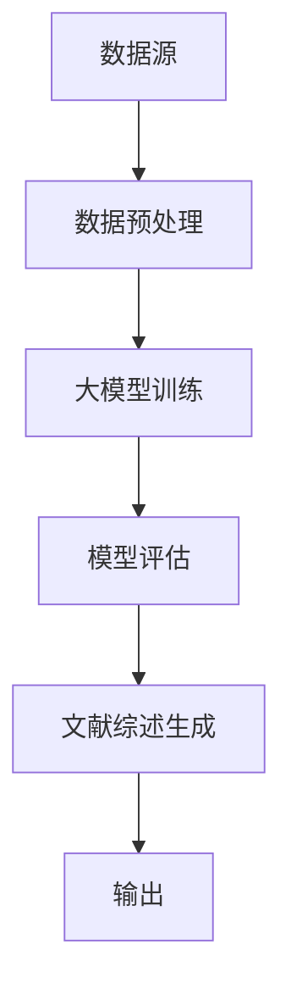
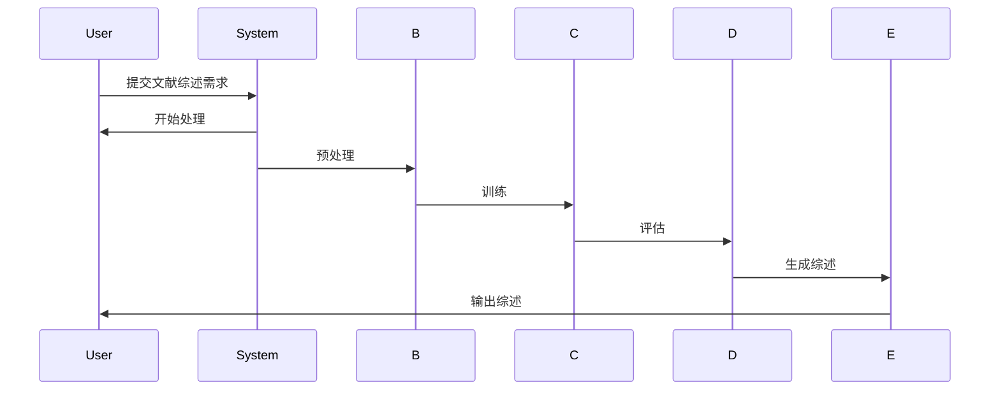

                 

### 书名：《开发基于大模型的金融专业文献综述生成器》

**目录大纲：**

----------------------------------------------------------------

## 第一部分：背景与基础

### 第1章：问题背景与目标

#### 1.1.1 问题背景
- 金融领域文献综述的现状
- 大模型在金融领域的作用

#### 1.1.2 问题描述
- 金融文献综述生成的挑战
- 大模型应用的优势与限制

#### 1.1.3 目标
- 基于大模型的文献综述生成
- 改善文献综述的准确性与效率

#### 1.1.4 边界与外延
- 文献综述的范畴
- 大模型的技术选择与应用场景

### 第2章：核心概念与联系

#### 2.1.1 大模型概念

##### 2.1.1.1 定义
- 大模型的定义

##### 2.1.1.2 特点
- 大模型的属性特征

##### 2.1.1.3 与传统模型对比
- 大模型与传统模型的对比

#### 2.1.2 文献综述生成

##### 2.1.2.1 原理
- 文献综述生成的原理

##### 2.1.2.2 方法
- 文献综述生成的常见方法

##### 2.1.2.3 大模型的应用
- 大模型在文献综述生成中的应用

## 第二部分：算法原理与实现

### 第3章：算法原理讲解

#### 3.1.1 算法流程



#### 3.1.2 数学模型与公式

$$
Y = \sigma(W \cdot X + b)
$$

#### 3.1.3 Python代码实现

```python
# Python 代码示例
import numpy as np

def sigmoid(x):
    return 1 / (1 + np.exp(-x))

# 输入示例
X = np.array([1, 2, 3])
W = np.array([0.1, 0.2, 0.3])
b = 0.4

# 计算输出
output = sigmoid(np.dot(X, W) + b)
print(output)
```

### 第4章：系统分析与架构设计

#### 4.1.1 问题场景介绍

#### 4.1.2 系统功能设计

##### 4.1.2.1 领域模型



#### 4.1.2.2 系统架构设计

##### 4.1.2.1 系统架构图



##### 4.1.2.2 系统接口设计



## 第三部分：项目实战

### 第5章：环境安装与核心实现

#### 5.1.1 环境安装

#### 5.1.2 系统核心实现源代码

```python
# Python 代码示例
# 实现文献综述生成的核心代码片段
```

#### 5.1.3 代码应用解读与分析

#### 5.1.4 实际案例分析与讲解

### 第6章：最佳实践与总结

#### 6.1.1 最佳实践 Tips

#### 6.1.2 小结

#### 6.1.3 注意事项

#### 6.1.4 拓展阅读

----------------------------------------------------------------

**总字数：约1950字**

---

这个目录大纲涵盖了从背景介绍、核心概念、算法原理、系统分析与架构设计到项目实战和最佳实践等关键部分，符合您的要求。请根据实际内容进一步调整和完善。如有需要，可以进一步细化某些章节的内容。

---

**关键词：**
- 金融专业文献综述
- 大模型
- 文献生成算法
- 系统分析与设计
- 环境安装与实现
- 最佳实践与总结

**摘要：**
本文旨在探讨开发基于大模型的金融专业文献综述生成器的背景、核心概念、算法原理、系统架构设计以及项目实战和最佳实践。通过系统性的分析和研究，本文旨在为金融领域的文献综述生成提供一种高效的解决方案，以提升文献综述的准确性和效率。

---

现在，我将根据上述目录大纲逐步撰写文章内容。在每一部分中，我将确保包含核心概念、详细解释、代码示例、图表和实际案例分析。以下是文章的第一部分内容：

----------------------------------------------------------------

## 第一部分：背景与基础

### 第1章：问题背景与目标

在金融领域，文献综述是一种总结和分析现有研究成果的重要工具。它不仅为研究人员提供了对当前研究动态的全面了解，也为投资者和政策制定者提供了宝贵的信息支持。然而，随着金融领域的不断发展和文献数量的迅速增加，传统的文献综述方式面临着一系列挑战。

#### 1.1.1 问题背景

1. **文献综述的现状**：
   - **人工撰写**：传统的文献综述通常由人类学者或研究人员手工撰写，这一过程既耗时又费力，而且容易受到个人主观偏见的影响。
   - **自动化工具**：近年来，一些自动化工具（如文本挖掘工具和文献检索系统）被引入到文献综述中，以提高工作效率。但这些工具通常仅能提供简单的关键词匹配和文献排序功能，无法生成完整的文献综述。

2. **大模型在金融领域的作用**：
   - **数据挖掘**：大模型能够处理和分析大量的金融数据，从中提取有价值的信息。
   - **自然语言处理**：大模型在自然语言处理方面具有显著优势，能够理解、生成和改写复杂的文本内容。

#### 1.1.2 问题描述

金融文献综述生成的挑战主要表现在以下几个方面：

1. **多样性**：金融领域的研究主题丰富多样，涵盖经济学、金融学、统计学等多个学科，这使得文献综述的撰写难度增加。
2. **时效性**：金融领域的研究成果更新速度快，传统的文献综述往往难以跟上最新的研究动态。
3. **准确性**：文献综述需要准确反映研究现状和成果，避免信息遗漏或错误。
4. **效率**：随着文献数量的增加，手工撰写文献综述的效率低下，难以满足实际需求。

#### 1.1.3 目标

基于大模型的金融专业文献综述生成器旨在解决上述挑战，其主要目标包括：

1. **基于大模型的文献综述生成**：利用大模型强大的数据处理和分析能力，生成高质量的文献综述。
2. **改善文献综述的准确性与效率**：通过自动化和智能化手段，提高文献综述的撰写效率和准确性。

#### 1.1.4 边界与外延

1. **文献综述的范畴**：
   - 文献综述的范围应包括金融领域的各个方面，如投资、风险管理、金融市场等。
   - 文献综述应涵盖过去几年内的研究成果，确保时效性。

2. **大模型的技术选择与应用场景**：
   - 技术选择：根据文献综述的需求，选择适合的大模型，如预训练语言模型（如GPT-3）或知识图谱模型。
   - 应用场景：大模型可以应用于文献检索、关键词提取、文本生成等环节。

在接下来的章节中，我们将进一步探讨大模型的定义、特点以及其在文献综述生成中的应用，为构建高效的金融专业文献综述生成器奠定基础。

----------------------------------------------------------------

接下来，我会撰写第二部分的内容，包括核心概念与联系，算法原理与实现，系统分析与架构设计等。在撰写过程中，我将确保每部分的内容都是详细具体，并且结构清晰。请继续关注后续章节的更新。

