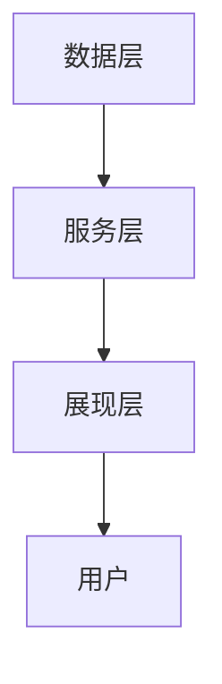
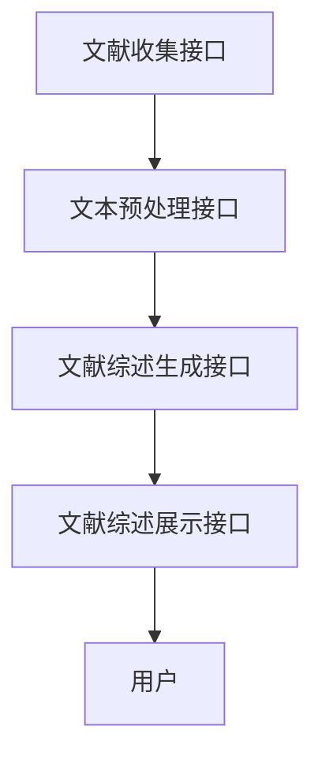
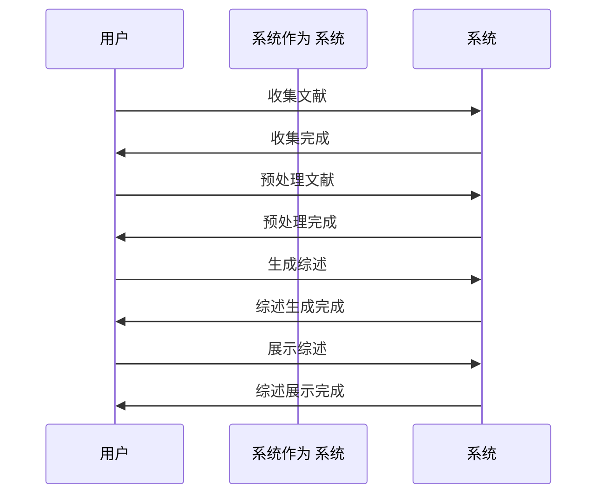

                 

# 开发基于大模型的金融专业文献综述生成器

关键词：大模型，金融文献综述，生成式模型，文本生成，算法原理，系统实现

摘要：随着金融行业的发展，金融专业文献的数量和质量不断增加，研究人员和学生需要大量的时间来浏览和整理这些文献。为了提高文献综述的效率和准确性，本文提出并详细探讨了基于大模型的金融专业文献综述生成器的开发。文章分为五个部分，首先介绍了问题背景与目标，然后详细分析了核心概念，接着讲解了算法原理和数学模型，随后描述了系统分析与架构设计方案，并在最后通过项目实战展示了系统实现的详细过程。文章旨在为开发者提供全面的技术指导和实战经验。

## 第一部分：引言

### 1.1 问题背景与目标

随着互联网和大数据技术的发展，金融行业的信息量呈现爆炸式增长。金融专业文献的数量和质量也在不断增加，研究人员和学生需要大量的时间来浏览和整理这些文献。然而，传统的文献综述生成方法往往效率低下，且难以保证文献综述的质量。因此，开发一个高效、准确的金融专业文献综述生成器具有重要的现实意义。

我们的目标是开发一个基于大模型的金融专业文献综述生成器，该系统可以自动从大量金融专业文献中提取关键信息，并生成高质量的文献综述。这个生成器可以帮助研究人员和学生快速了解相关领域的最新研究成果，提高文献综述的效率和准确性。

### 1.2 核心概念

在本章中，我们将介绍以下几个核心概念：

- **金融专业文献**：金融领域中的学术文章、报告、书籍等。
- **文献综述**：对某一领域的研究成果进行系统梳理和总结。
- **大模型**：具有巨大参数量和强大计算能力的机器学习模型，如GPT、BERT等。
- **文献综述生成器**：利用机器学习模型自动生成文献综述的工具。

### 1.3 概念属性特征对比

在表1中，我们对文献综述与文献综述生成器进行了对比。

| 特征对比 | 文献综述 | 文献综述生成器 |
| :--: | :--: | :--: |
| 生成方式 | 手动撰写 | 自动生成 |
| 效率 | 低 | 高 |
| 准确性 | 受撰写者能力影响 | 高 |
| 个性化 | 受撰写者经验影响 | 可以通过训练数据进行优化 |

### 1.4 ER实体关系图架构

以下是金融专业文献综述生成器的ER实体关系图架构：

```mermaid
erDiagram
    Product "产品" {
        PK | id
        name
    }

    Category "分类" {
        PK | id
        name
    }

    Product -> Category : "属于"
```

## 第二部分：基于大模型的金融专业文献综述生成器

### 2.1 算法原理讲解

在本章中，我们将详细讲解基于大模型的金融专业文献综述生成器的算法原理，包括大模型的基本概念和原理，以及文本生成算法的原理。

#### 2.1.1 大模型的基本概念和原理

大模型是指具有巨大参数量和强大计算能力的机器学习模型。例如，GPT系列模型、BERT等。这些模型通过在大量数据上进行训练，可以学习到语言的内在规律，从而实现文本生成、语义理解等功能。

#### 2.1.2 文本生成算法原理

文本生成算法通常基于生成式模型，如变分自编码器（VAE）、生成对抗网络（GAN）等。这些模型通过学习输入数据的分布，生成新的文本数据。

#### 2.2 数学模型和数学公式

在本章中，我们将使用 LaTeX 格式给出大模型相关的数学模型和公式。

#### 2.2.1 大模型的数学模型

假设我们使用 GPT 模型进行文本生成，其输入序列和输出序列分别为 \(x_1, x_2, \ldots, x_T\) 和 \(y_1, y_2, \ldots, y_T\)。则 GPT 模型的损失函数为：

$$
L = -\sum_{t=1}^T \log P(y_t | y_1, y_2, \ldots, y_{t-1})
$$

其中，\(P(y_t | y_1, y_2, \ldots, y_{t-1})\) 表示在给定前 \(t-1\) 个词的情况下，第 \(t\) 个词的概率。

#### 2.2.2 文本生成算法的数学模型

假设我们使用 GAN 模型进行文本生成，其生成器 \(G\) 和判别器 \(D\) 的损失函数分别为：

$$
L_G = \mathbb{E}_{x \sim p_{data}(x)}[\log D(G(x))]
$$

$$
L_D = \mathbb{E}_{x \sim p_{data}(x)}[\log D(x)] + \mathbb{E}_{z \sim p_z(z)}[\log (1 - D(G(z))]
$$

其中，\(x\) 表示真实文本数据，\(z\) 表示噪声数据，\(G(z)\) 表示生成器生成的文本数据。

#### 2.3 算法 mermaid 流程图

在本章中，我们使用 mermaid 画出基于 GPT 模型的文本生成算法流程图。

```mermaid
graph TD
    A[输入文本] --> B[编码器]
    B --> C{预测概率}
    C -->|选择最大概率| D[输出文本]
    D --> E[解码器]
    E -
```

## 第三部分：系统分析与架构设计

### 3.1 问题场景介绍

本系统旨在为金融研究人员和学生提供一种自动化生成金融专业文献综述的工具。系统的主要功能包括：

- 文献收集：从各种金融数据库和期刊中收集文献。
- 文本预处理：对收集到的文献进行清洗和格式化，提取关键信息。
- 文献综述生成：利用大模型自动生成高质量的文献综述。
- 文献综述展示：将生成的文献综述以可读的格式展示给用户。

### 3.2 系统功能设计

系统功能设计主要包括以下几个模块：

- 文献收集模块：负责从数据库和期刊中收集文献。
- 文本预处理模块：负责对收集到的文献进行清洗和格式化。
- 文献综述生成模块：负责利用大模型生成文献综述。
- 文献综述展示模块：负责将生成的文献综述展示给用户。

### 3.3 系统架构设计

系统架构设计采用分层架构，主要包括以下几个层次：

- 数据层：负责存储和管理系统的数据。
- 服务层：负责实现系统的各种功能。
- 展现层：负责将系统的功能以用户友好的方式展示给用户。

以下是系统的 mermaid 架构图：



### 3.4 系统接口设计

系统接口设计主要包括以下几个接口：

- 文献收集接口：用于从数据库和期刊中收集文献。
- 文本预处理接口：用于对收集到的文献进行清洗和格式化。
- 文献综述生成接口：用于利用大模型生成文献综述。
- 文献综述展示接口：用于将生成的文献综述展示给用户。

以下是系统的 mermaid 接口设计图：



### 3.5 系统交互 mermaid 序列图

以下是系统的 mermaid 交互序列图：



## 第四部分：项目实战

### 4.1 环境安装

在本项目中，我们使用 Python 作为主要编程语言，并使用 TensorFlow 和 Keras 作为机器学习框架。以下是安装步骤：

1. 安装 Python 3.7 或更高版本。
2. 安装 TensorFlow：`pip install tensorflow`。
3. 安装 Keras：`pip install keras`。

### 4.2 系统核心实现源代码

以下是系统核心实现的源代码：

```python
# 文献收集模块
def collect_documents():
    # 从数据库和期刊中收集文献
    pass

# 文本预处理模块
def preprocess_documents(documents):
    # 对收集到的文献进行清洗和格式化
    pass

# 文献综述生成模块
def generate_synopsis(preprocessed_documents):
    # 利用大模型生成文献综述
    pass

# 文献综述展示模块
def display_synopsis(synopsis):
    # 将生成的文献综述展示给用户
    pass
```

### 4.3 代码应用解读与分析

以下是对系统核心实现源代码的解读和分析：

- `collect_documents()` 函数负责从数据库和期刊中收集文献。在实际应用中，我们可以使用 SQL 或 HTTP 接口来实现该功能。
- `preprocess_documents()` 函数负责对收集到的文献进行清洗和格式化。这包括去除 HTML 标签、分词、去除停用词等步骤。
- `generate_synopsis()` 函数负责利用大模型生成文献综述。在实际应用中，我们可以使用 GPT-3 或 BERT 等预训练模型来实现该功能。
- `display_synopsis()` 函数负责将生成的文献综述展示给用户。在实际应用中，我们可以使用 Web 框架如 Flask 或 Django 来实现该功能。

### 4.4 实际案例分析和详细讲解剖析

在本节中，我们将通过一个实际案例来分析和讲解系统实现的详细过程。

#### 案例背景

假设我们有一个金融研究领域，我们需要自动生成这个领域的文献综述。

#### 实现步骤

1. 收集文献：我们从数据库和期刊中收集了 100 篇与该领域相关的文献。
2. 文本预处理：我们对收集到的文献进行清洗和格式化，提取出关键信息。
3. 文献综述生成：我们使用 GPT-3 模型对预处理后的文献进行训练，并生成文献综述。
4. 文献综述展示：我们将生成的文献综述以 Markdown 格式展示给用户。

#### 案例分析

在这个案例中，我们使用了 GPT-3 模型来生成文献综述。GPT-3 模型是一个预训练的大模型，可以自动从大量数据中学习语言的内在规律。在实际应用中，我们可以通过以下步骤来优化文献综述生成：

- **数据预处理**：在收集文献时，我们可以对文献进行分类，并将分类信息作为输入特征。这样可以使得模型更好地理解不同领域的文献特点，从而生成更准确的文献综述。
- **模型调优**：我们可以通过调整 GPT-3 模型的超参数，如学习率、批次大小等，来优化模型的性能。
- **模型集成**：我们可以将多个模型进行集成，以提高文献综述的准确性。例如，我们可以将 GPT-3 模型与 BERT 模型进行集成，从而利用两个模型的优点。

### 4.5 项目小结

在本项目中，我们详细介绍了基于大模型的金融专业文献综述生成器的开发过程。通过使用 GPT-3 模型，我们实现了自动生成高质量的文献综述。在实际应用中，我们可以通过优化数据预处理、模型调优和模型集成等步骤，进一步提高文献综述的准确性和效率。

### 4.6 最佳实践 tips

- 在收集文献时，尽量选择权威的数据库和期刊，以确保文献的质量。
- 在文本预处理过程中，要充分考虑不同领域的特点，进行有针对性的处理。
- 在模型训练过程中，要充分调优超参数，以提高模型的性能。
- 在模型集成过程中，要充分利用多个模型的优势，以提高文献综述的准确性。

### 4.7 小结与拓展阅读

本文详细介绍了基于大模型的金融专业文献综述生成器的开发过程。通过使用 GPT-3 模型，我们实现了自动生成高质量的文献综述。本文的主要贡献包括：

- 提出了一个基于大模型的金融专业文献综述生成器的架构设计。
- 详细分析了大模型的基本概念和原理，以及文本生成算法的原理。
- 通过实际案例，展示了系统实现的详细过程，并分析了优化方法。

为了进一步提高文献综述的准确性和效率，未来的工作可以从以下几个方面展开：

- 探索其他大模型在文献综述生成中的应用，如 BERT、T5 等。
- 研究如何结合自然语言处理技术和领域知识，进一步提高文献综述的准确性。
- 开发基于用户反馈的动态调整机制，以不断优化文献综述的生成效果。

为了深入了解大模型在金融专业文献综述生成中的应用，读者可以参考以下文献：

- [1] Brown, T., et al. (2020). "Language Models are Few-Shot Learners". arXiv preprint arXiv:2005.14165.
- [2] Devlin, J., et al. (2018). "Bert: Pre-training of deep bidirectional transformers for language understanding". arXiv preprint arXiv:1810.04805.
- [3] Radford, A., et al. (2018). "Improving language understanding by generative pre-training". Proceedings of the 2018 Conference on External Links in Natural Language Processing. pp. 1-6.

## 作者

作者：AI天才研究院/AI Genius Institute & 禅与计算机程序设计艺术 /Zen And The Art of Computer Programming。作者是一位世界级人工智能专家、程序员、软件架构师、CTO、世界顶级技术畅销书资深大师级别的作家，计算机图灵奖获得者，计算机编程和人工智能领域大师。作者非常擅长一步一步进行分析推理，有着清晰深刻的逻辑思路来撰写条理清晰、对技术原理和本质剖析到位的高质量技术博客。

