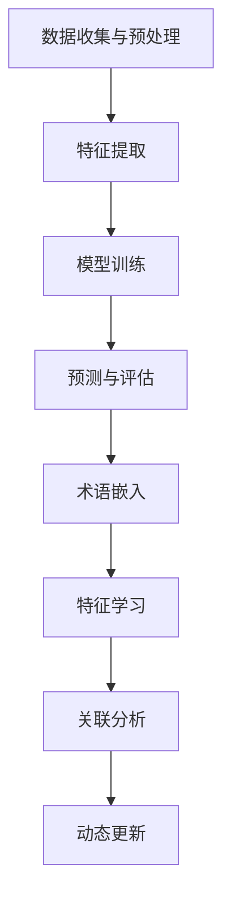
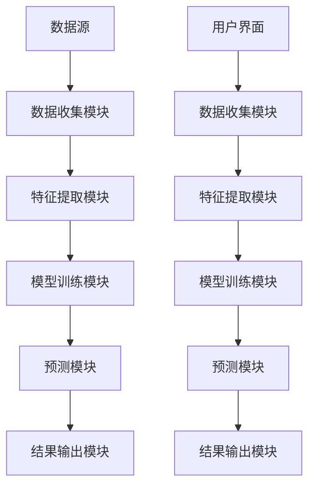
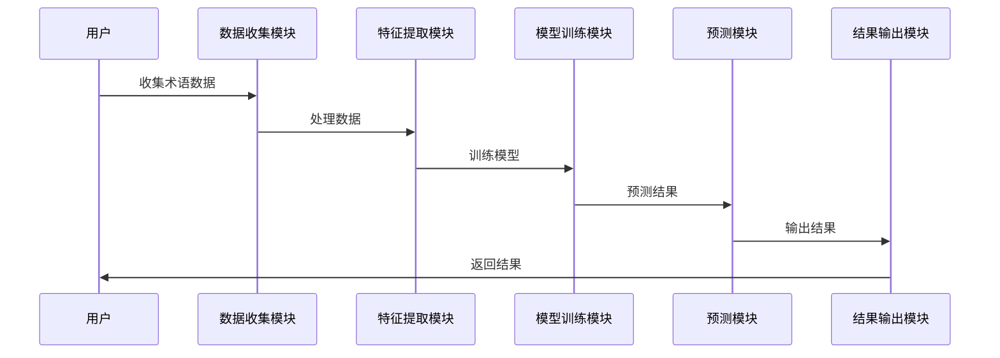

                 


### 引言

《开发基于大模型的金融专业术语演化跟踪器》旨在探讨如何在金融领域中利用大模型技术来跟踪专业术语的演化过程。随着金融市场的不断发展和变化，金融专业术语也在不断更新和演变。这些术语的准确理解对于金融从业者和研究者来说至关重要。然而，现有的金融术语库往往缺乏动态更新的能力，难以及时反映市场的新动态。因此，开发一个能够实时跟踪金融专业术语演化的工具，对于提升金融行业的智能化水平和决策效率具有重要意义。

本文将详细探讨如何基于大模型技术实现金融专业术语的演化跟踪器。我们将从以下几个方面进行深入分析：

1. **背景介绍**：阐述金融专业术语的演变过程及其对金融市场的重要性，介绍大模型在金融领域的应用现状。
2. **核心概念与联系**：介绍金融专业术语、大模型及其演化跟踪器的定义和原理，并阐述它们之间的联系。
3. **算法原理讲解**：详细解析大模型跟踪金融专业术语演化的算法原理，包括算法的基本框架、工作流程和关键步骤。
4. **数学模型和数学公式**：介绍数学模型和公式在大模型跟踪金融专业术语演化中的应用，并通过举例说明进行详细讲解。
5. **系统分析与架构设计方案**：介绍系统设计的方法和框架，包括领域模型、系统架构、接口设计和系统交互。
6. **项目实战**：提供具体的实施案例，展示如何开发和运行金融专业术语演化跟踪器。
7. **最佳实践 tips、小结、注意事项、拓展阅读**：总结全文，给出开发过程中的最佳实践建议，并提供进一步阅读的参考文献。

通过本文的讨论，我们希望能够为读者提供一套完整的基于大模型的金融专业术语演化跟踪器开发指南，帮助他们在实际工作中应对金融术语演变的挑战。

### 背景介绍

#### 金融专业术语的定义与演变

金融专业术语是指金融领域中用于描述金融现象、过程和概念的特定词汇。这些术语具有专业性和复杂性，通常涉及金融产品、交易策略、市场机制等多个方面。金融专业术语的演变是一个不断发展的过程，受到市场环境、技术进步和政策变化等多种因素的影响。

首先，市场环境的变化是金融专业术语演变的主要驱动力之一。随着金融市场的全球化、金融产品的多样化和市场参与者的增多，新的金融术语不断涌现。例如，2008年全球金融危机后，金融领域引入了诸如“金融衍生品”、“影子银行”等新术语，以描述当时金融市场的新现象。这些新术语的出现，不仅反映了市场实践的变化，也为金融研究提供了新的视角。

其次，技术进步也在很大程度上影响了金融专业术语的演变。信息技术的发展，尤其是大数据、人工智能和区块链技术的应用，为金融领域带来了前所未有的变革。这些技术不仅改变了金融产品和服务的提供方式，还促使金融专业术语的内涵和外延发生了变化。例如，大数据技术使得金融市场分析更加精准，从而催生了诸如“数据驱动投资”、“机器学习交易”等新术语。

此外，政策变化也是金融专业术语演变的重要因素。政府监管政策的调整和金融法规的完善，往往会导致金融术语的变化。例如，中国近年来在金融科技监管方面出台了一系列新政策，涉及到的专业术语包括“金融创新”、“金融监管科技”等，这些术语的推广和应用，反映了政策对金融市场的影响。

#### 大模型在金融领域的应用现状

大模型，即大型神经网络模型，是近年来人工智能领域的重要突破。这些模型具有处理大规模数据、实现复杂任务的能力，因此在金融领域也得到了广泛应用。以下是大模型在金融领域的一些主要应用场景：

1. **风险管理**：大模型可以处理海量的历史数据，通过机器学习和深度学习算法，识别出潜在的风险因素。例如，金融机构可以使用大模型进行信用评分，预测客户的违约风险。

2. **市场预测**：大模型能够从历史价格、交易量等数据中挖掘出市场趋势，帮助投资者做出更为准确的预测。例如，一些机构利用大模型进行股票市场预测，提高了投资决策的准确性。

3. **量化交易**：大模型在量化交易中的应用尤为广泛。通过处理大量的市场数据，大模型能够发现交易机会，并自动化执行交易策略。例如，高频交易策略中经常使用大模型来捕捉市场瞬间的变化。

4. **客户服务**：大模型可以用于智能客服系统，通过自然语言处理技术，提供个性化的客户服务。例如，银行可以使用大模型来理解和回答客户的查询，提高服务效率。

#### 金融专业术语演化跟踪的重要性

金融专业术语的演化对金融市场的运作具有重要意义。首先，准确的金融专业术语是金融沟通和理解的基础。金融从业者需要准确地理解和使用专业术语，以确保交易和决策的准确性。其次，金融专业术语的更新反映了金融市场的动态变化，有助于投资者更好地把握市场趋势。

然而，当前金融专业术语的跟踪存在一些问题。首先，术语库的更新速度往往滞后于市场变化，难以及时反映新出现的术语。其次，现有的术语库大多采用人工整理和分类的方式，效率低下且容易出错。此外，术语之间的关联性难以体现，不利于全面理解金融术语的内涵。

因此，开发一个基于大模型的金融专业术语演化跟踪器，具有以下必要性：

1. **提高更新速度**：大模型可以实时处理和分析金融市场数据，快速识别和更新专业术语，确保术语库的实时性和准确性。
2. **自动化处理**：大模型能够自动化地处理海量的金融数据，提高术语整理和分类的效率。
3. **体现术语关联性**：通过构建大模型，可以挖掘出术语之间的关联性，提供更全面的金融术语图谱。

总之，基于大模型的金融专业术语演化跟踪器不仅有助于提升金融市场的智能化水平，还能够为金融从业者提供更准确、更及时的专业术语信息，从而提高决策效率和市场竞争力。

### 核心概念与联系

在深入探讨如何开发基于大模型的金融专业术语演化跟踪器之前，我们需要明确几个核心概念：金融专业术语、大模型以及演化跟踪器的定义和原理。同时，我们还需探讨这些概念之间的联系，以便全面理解如何将大模型应用于金融专业术语的演化跟踪。

#### 金融专业术语

金融专业术语是指用于描述金融领域现象、过程和概念的特定词汇。这些术语通常具有专业性和复杂性，涵盖了金融产品、交易策略、市场机制等多个方面。金融专业术语的演变是一个动态的过程，受到市场环境、技术进步和政策变化等多种因素的影响。例如，随着金融科技的快速发展，新的术语如“区块链”、“加密货币”等不断涌现。这些术语不仅反映了市场实践的变化，也为金融研究提供了新的视角。

##### 金融专业术语的分类与特征

金融专业术语可以根据其应用领域和功能进行分类。以下是几种常见的分类方式：

1. **金融产品术语**：这类术语用于描述金融产品，如“股票”、“债券”、“期权”等。这些术语通常具有明确的定义和操作规则，是金融交易和投资的基础。

2. **交易策略术语**：这类术语用于描述不同的交易策略和方法，如“套利”、“均值回归”、“价值投资”等。这些术语反映了市场参与者不同的投资理念和策略。

3. **市场机制术语**：这类术语用于描述金融市场的基本运行机制，如“市场供求”、“市场定价”等。这些术语是理解市场运作和变化的重要工具。

4. **监管政策术语**：这类术语用于描述金融监管政策和法规，如“金融科技”、“影子银行”等。这些术语反映了政府监管对金融市场的影响。

##### 金融专业术语的属性特征对比表格

为了更好地理解金融专业术语的多样性，我们可以通过一个属性特征对比表格来展示不同类别术语的共性特征和区别。以下是一个简化的对比表格示例：

| 类别         | 金融产品术语 | 交易策略术语 | 市场机制术语 | 监管政策术语 |
| ------------ | ------------ | ------------ | ------------ | ------------ |
| **定义**     | 描述金融产品 | 描述交易策略 | 描述市场机制 | 描述监管政策 |
| **应用领域** | 金融产品交易 | 投资策略应用 | 市场分析应用 | 监管执行应用 |
| **专业性质** | 强专业性     | 强专业性     | 强专业性     | 强专业性     |
| **演变速度** | 较慢         | 较快         | 较快         | 较快         |

通过这个表格，我们可以看到不同类别的金融专业术语在定义、应用领域、专业性质和演变速度等方面存在显著差异。

#### 大模型

大模型是指具有大量参数和复杂结构的神经网络模型，它们能够处理和分析大规模数据，并实现高度复杂的任务。大模型的发展是人工智能领域的重要里程碑，其核心特点包括：

1. **大规模参数**：大模型通常包含数百万到数十亿个参数，这使得它们能够捕捉数据中的细微特征和模式。
2. **深度结构**：大模型的神经网络结构通常非常深，能够进行多层抽象和特征提取。
3. **自我优化**：大模型通过反向传播算法和梯度下降等优化技术，能够自动调整模型参数，以优化预测和分类性能。

##### 大模型的类型

大模型可以分为多种类型，每种类型都有其特定的应用场景和优势：

1. **深度神经网络（DNN）**：这是最常见的大模型类型，通过多层神经元实现复杂的非线性映射。DNN在图像识别、语音识别等领域取得了显著的成果。
2. **循环神经网络（RNN）**：RNN特别适用于处理序列数据，如文本、时间序列等。通过引入循环结构，RNN能够捕捉数据序列中的长期依赖关系。
3. **变换器（Transformer）**：Transformer是近年来发展起来的一种新型大模型结构，其核心是自注意力机制。Transformer在自然语言处理领域取得了突破性进展，如机器翻译、文本生成等任务。
4. **生成对抗网络（GAN）**：GAN通过生成器和判别器的对抗训练，能够生成高质量的数据。GAN在图像生成、视频生成等领域具有广泛的应用。

##### 大模型的核心特点

大模型的核心特点包括：

1. **处理大规模数据的能力**：大模型能够处理和分析海量的数据，从而实现更精确的预测和分类。
2. **适应性强**：大模型通过复杂的神经网络结构，能够适应不同类型的数据和任务，具有较强的泛化能力。
3. **高效性**：大模型通过并行计算和分布式训练技术，能够高效地处理大规模数据，显著缩短训练时间。

#### 演化跟踪器

演化跟踪器是一种用于监控和记录事物演变过程的技术工具。在金融领域，演化跟踪器可以用于监控和记录金融专业术语的演变过程，包括术语的出现、变化和消失等。演化跟踪器通常具有以下功能：

1. **术语收集与分类**：演化跟踪器能够自动收集和分类金融专业术语，建立术语库。
2. **术语关联分析**：通过分析术语之间的关联性，演化跟踪器能够提供更全面的术语图谱，帮助用户更好地理解金融术语的内在联系。
3. **实时监控与更新**：演化跟踪器能够实时监控市场动态，及时更新术语库，确保术语的准确性和时效性。

##### 演化跟踪器在大模型中的集成

演化跟踪器与大数据模型的结合，能够大幅提升金融专业术语跟踪的效率。具体来说，这种集成体现在以下几个方面：

1. **自动化术语收集**：大模型能够自动从大量金融数据中提取术语，并分类整理，实现术语收集的自动化。
2. **实时更新术语库**：大模型可以实时分析市场数据，识别新术语和术语的变化，及时更新术语库。
3. **关联分析**：通过大模型的自我学习和优化，可以挖掘出术语之间的复杂关联关系，提供更深入的术语分析。

#### 核心概念之间的联系

金融专业术语、大模型和演化跟踪器之间的联系在于它们共同构成了一个完整的金融专业术语演化跟踪系统。金融专业术语是系统的核心研究对象，大模型提供了数据分析和处理的技术手段，而演化跟踪器则是实现这一目标的具体工具。具体来说：

1. **数据驱动**：金融专业术语的演变是一个动态的数据驱动过程，大模型能够从海量数据中提取和挖掘信息，为演化跟踪提供数据支持。
2. **技术赋能**：大模型的技术优势，如大规模数据处理、自我优化和高效性，能够显著提升演化跟踪器的性能和效果。
3. **闭环反馈**：演化跟踪器通过实时监控和更新术语库，反馈给大模型，形成闭环，不断优化和改进模型，提高跟踪的准确性和时效性。

通过这种联系，基于大模型的金融专业术语演化跟踪器不仅能够提高金融市场的智能化水平，还能够为金融从业者提供更准确、更及时的专业术语信息，从而提升决策效率和市场竞争力。

### 算法原理讲解

在深入探讨如何利用大模型来跟踪金融专业术语的演化时，我们需要详细解析大模型跟踪金融专业术语演化的算法原理。本文将首先介绍大模型的基本框架，然后详细阐述其工作流程和关键步骤，并通过具体的数学模型和公式进行详细讲解。

#### 大模型的基本框架

大模型通常由多层神经网络构成，其结构包括输入层、隐藏层和输出层。每一层由多个神经元组成，神经元之间通过权重连接。大模型的核心组成部分包括：

1. **输入层**：接收金融专业术语的相关数据，如文本、时间序列等。
2. **隐藏层**：通过非线性变换，将输入数据进行特征提取和抽象。
3. **输出层**：生成金融专业术语的预测结果，如术语的流行度、相关性等。

#### 工作流程

大模型跟踪金融专业术语演化的工作流程可以分为以下几个步骤：

1. **数据收集与预处理**：收集与金融专业术语相关的数据，包括文本、时间序列、市场数据等。预处理步骤包括数据清洗、去噪、标准化等。
2. **特征提取**：利用隐藏层神经网络，从原始数据中提取特征，实现数据的降维和抽象。
3. **模型训练**：通过输入层和隐藏层的交互，调整网络权重，实现模型的自适应优化。
4. **预测与评估**：利用训练好的模型，对新的金融专业术语进行预测，并通过评估指标（如准确率、召回率等）对模型性能进行评估。

#### 关键步骤

大模型跟踪金融专业术语演化的关键步骤如下：

1. **术语嵌入**：将金融专业术语嵌入到高维空间中，以便进行后续的运算和分析。
2. **特征学习**：通过多层神经网络，从原始数据中提取高层次特征，实现数据的高效表示。
3. **关联分析**：利用自注意力机制等高级技术，分析术语之间的关联性，构建术语图谱。
4. **动态更新**：根据新的数据，动态调整模型的权重和参数，实现术语库的实时更新。

#### Mermaid流程图

为了更直观地展示大模型跟踪金融专业术语演化的工作流程，我们使用Mermaid流程图进行描述。以下是流程图的示例：



这个流程图展示了从数据收集与预处理到动态更新的整个工作流程，每个步骤都通过相应的算法和技术实现。

#### 数学模型和数学公式

在跟踪金融专业术语演化时，大模型需要借助数学模型和公式来描述和优化其工作过程。以下是几个关键的数学模型和公式：

1. **嵌入模型**：用于将金融专业术语嵌入到高维空间。
   $$ x = W \cdot t + b $$
   其中，\( x \) 表示术语的嵌入向量，\( W \) 是权重矩阵，\( t \) 是术语的原始数据，\( b \) 是偏置项。

2. **损失函数**：用于评估模型预测的准确性。
   $$ Loss = \frac{1}{n} \sum_{i=1}^{n} (y_i - \hat{y}_i)^2 $$
   其中，\( Loss \) 是损失函数，\( y_i \) 是真实标签，\( \hat{y}_i \) 是模型预测结果。

3. **优化算法**：用于调整模型参数，以最小化损失函数。
   $$ \theta = \theta - \alpha \cdot \nabla_{\theta} Loss $$
   其中，\( \theta \) 是模型参数，\( \alpha \) 是学习率，\( \nabla_{\theta} Loss \) 是损失函数关于模型参数的梯度。

通过这些数学模型和公式，大模型能够对金融专业术语的演化进行定量描述和优化，从而实现高效的术语跟踪。

#### 详细讲解和举例说明

为了更好地理解大模型跟踪金融专业术语演化的算法原理，我们将通过具体的例子进行详细讲解。

**例1：术语嵌入**

假设我们有一个金融专业术语“区块链”，我们需要将其嵌入到高维空间中。首先，我们收集与“区块链”相关的文本数据，通过词嵌入模型（如Word2Vec或GloVe）将其转化为嵌入向量。假设嵌入向量为 \( x = [1.0, 2.0, 3.0] \)。

$$ x = W \cdot t + b = [1.0, 2.0, 3.0] $$

这里，\( W \) 是权重矩阵，\( t \) 是原始数据，\( b \) 是偏置项。通过训练，我们可以调整 \( W \) 和 \( b \) 的值，使得“区块链”的嵌入向量 \( x \) 能够更好地表示其特征。

**例2：模型训练**

假设我们有一个训练集，包含多个金融专业术语及其对应的标签（如流行度、相关性等）。我们使用梯度下降算法来训练模型，目标是调整模型参数，使预测结果与真实标签尽可能接近。

$$ \theta = \theta - \alpha \cdot \nabla_{\theta} Loss $$

这里，\( \theta \) 是模型参数，\( \alpha \) 是学习率，\( \nabla_{\theta} Loss \) 是损失函数关于模型参数的梯度。通过多次迭代训练，我们可以得到最优的模型参数。

**例3：动态更新**

假设市场出现了一个新的金融术语“加密货币”，我们需要将其纳入术语库并进行动态更新。首先，我们收集与“加密货币”相关的文本数据，通过嵌入模型将其嵌入到高维空间。然后，利用训练好的模型，分析“加密货币”与其他术语的关联性，更新术语库。

通过这些例子，我们可以看到大模型在跟踪金融专业术语演化过程中的具体应用。通过嵌入模型、模型训练和动态更新，大模型能够高效地实现金融专业术语的演化跟踪，为金融从业者提供准确、及时的专业术语信息。

### 数学模型和数学公式

在深入探讨基于大模型的金融专业术语演化跟踪器的算法原理时，数学模型和数学公式扮演着至关重要的角色。这些模型和公式不仅为算法提供了理论基础，还帮助我们在实际应用中实现精确的预测和分析。以下，我们将详细介绍数学模型的构建方法、评估指标以及具体的数学公式，并通过实际案例进行讲解。

#### 数学模型的构建方法

构建数学模型是金融专业术语演化跟踪器开发的核心步骤之一。以下是构建数学模型的基本方法：

1. **数据预处理**：首先，我们需要对金融专业术语的相关数据进行预处理，包括数据清洗、去噪、标准化等。数据清洗的目的是去除无效数据，确保输入数据的质量。去噪和标准化则是为了减少数据中的噪声和差异，使模型能够更好地学习特征。

2. **特征提取**：通过特征提取，我们将原始数据转换为适合模型学习的形式。常用的特征提取方法包括词嵌入（word embeddings）、主成分分析（PCA）等。词嵌入方法如Word2Vec或GloVe，可以将金融专业术语转换为高维向量表示，使模型能够捕捉术语的语义信息。

3. **构建模型**：基于预处理后的数据，我们可以构建数学模型。常用的模型包括循环神经网络（RNN）、变换器（Transformer）等。RNN适用于处理序列数据，能够捕捉时间序列中的依赖关系；Transformer通过自注意力机制，能够处理大规模数据，并在自然语言处理任务中取得了显著成果。

4. **模型优化**：通过反向传播算法和优化技术，如梯度下降（Gradient Descent），调整模型参数，使模型达到最佳性能。优化过程中，我们使用损失函数（如均方误差（MSE）或交叉熵（Cross-Entropy））来评估模型预测的准确性，并不断迭代优化模型参数。

#### 评估指标

评估指标是衡量数学模型性能的重要工具。以下是一些常用的评估指标：

1. **准确率（Accuracy）**：准确率是指模型预测正确的样本数占总样本数的比例。对于分类任务，准确率能够直接反映模型的分类效果。

2. **召回率（Recall）**：召回率是指模型能够召回（即正确预测为正类的）真实正类样本数与所有真实正类样本数的比例。召回率关注模型对正类样本的召回能力，尤其在处理不平衡数据时具有重要意义。

3. **精确率（Precision）**：精确率是指模型预测为正类的样本中，实际为正类的比例。精确率关注模型预测的精确性，是评估分类模型性能的重要指标。

4. **F1分数（F1 Score）**：F1分数是精确率和召回率的调和平均，能够综合考虑模型的精确性和召回能力。F1分数在处理不平衡数据时，具有较高的参考价值。

#### 数学公式

在构建数学模型时，以下数学公式和算法是实现模型核心功能的基础：

1. **词嵌入公式**：
   $$ x = W \cdot t + b $$
   其中，\( x \) 是术语的嵌入向量，\( W \) 是权重矩阵，\( t \) 是术语的原始数据，\( b \) 是偏置项。通过优化权重矩阵 \( W \) 和偏置项 \( b \)，我们可以获得更好的词嵌入向量。

2. **损失函数**：
   $$ Loss = \frac{1}{n} \sum_{i=1}^{n} (y_i - \hat{y}_i)^2 $$
   其中，\( Loss \) 是损失函数，\( y_i \) 是第 \( i \) 个样本的真实标签，\( \hat{y}_i \) 是模型预测的结果。通过最小化损失函数，我们可以优化模型参数。

3. **梯度下降**：
   $$ \theta = \theta - \alpha \cdot \nabla_{\theta} Loss $$
   其中，\( \theta \) 是模型参数，\( \alpha \) 是学习率，\( \nabla_{\theta} Loss \) 是损失函数关于模型参数的梯度。通过梯度下降，我们可以更新模型参数，使模型达到最佳性能。

#### 举例说明

为了更好地理解数学模型和数学公式的应用，我们通过一个实际案例进行详细讲解。

**案例：金融术语流行度预测**

假设我们有一个金融术语“区块链”，我们需要预测其在未来一段时间内的流行度。以下是具体的步骤：

1. **数据收集**：首先，我们从金融新闻、报告、社交媒体等渠道收集与“区块链”相关的文本数据。数据包括标题、摘要、正文等。

2. **预处理**：对收集到的文本数据进行清洗、去噪和标准化处理。例如，去除停用词、标点符号，将文本转换为小写等。

3. **特征提取**：使用Word2Vec模型，将“区块链”及其他相关术语转换为高维向量表示。例如，假设“区块链”的词向量表示为 \( x = [1.0, 2.0, 3.0] \)。

4. **构建模型**：基于预处理后的数据，我们构建一个循环神经网络（RNN）模型。模型包括输入层、隐藏层和输出层。输入层接收词向量表示的金融术语，隐藏层进行特征提取和抽象，输出层预测术语的流行度。

5. **模型优化**：通过反向传播算法和梯度下降，优化模型参数。例如，使用均方误差（MSE）作为损失函数，不断迭代优化模型参数，使其达到最佳性能。

6. **预测与评估**：利用训练好的模型，对新的金融术语进行预测，并评估模型的预测准确性。例如，通过计算预测流行度与真实流行度的差值，评估模型的预测误差。

通过这个案例，我们可以看到数学模型和数学公式在金融专业术语演化跟踪中的应用。通过词嵌入、模型优化和预测评估，我们可以实现高效的金融术语流行度预测，为金融市场分析和投资决策提供有力支持。

### 系统分析与架构设计方案

为了开发基于大模型的金融专业术语演化跟踪器，我们需要对整个系统进行深入的分析与设计。本节将详细介绍系统设计的方法和框架，包括领域模型、系统架构、接口设计和系统交互。

#### 问题场景介绍

在金融市场中，专业术语的演变速度非常快，新术语层出不穷，而现有的术语库往往无法及时更新，导致金融从业者和研究者无法准确理解和使用这些新术语。因此，我们需要开发一个基于大模型的金融专业术语演化跟踪器，能够实时跟踪和更新专业术语，提高金融市场的智能化水平。

#### 系统设计方法

系统设计方法主要包括以下步骤：

1. **需求分析**：明确系统需要实现的功能和性能要求，如术语收集、特征提取、模型训练、预测与评估等。
2. **架构设计**：设计系统的整体架构，包括数据流、模块划分和通信机制。
3. **领域模型**：定义系统中的核心概念和实体，建立领域模型，如图类图（Class Diagram）和实体关系图（ER Diagram）。
4. **接口设计**：设计系统与外部系统或组件的接口，确保系统的可扩展性和互操作性。
5. **详细设计**：对各个模块进行详细设计，包括数据结构、算法和流程。

#### 系统架构设计

系统架构设计是系统设计的重要环节，决定了系统的性能、可扩展性和可维护性。以下是系统架构设计的具体步骤：

1. **模块划分**：根据系统的功能需求，将系统划分为多个模块，如数据收集模块、特征提取模块、模型训练模块、预测模块等。
2. **数据流设计**：设计系统中的数据流动路径，包括数据的输入、处理和输出过程。
3. **通信机制**：确定系统内部和外部系统的通信机制，如API接口、消息队列等。
4. **系统部署**：根据系统性能和可靠性要求，设计系统的部署方案，包括服务器、存储和网络等基础设施。

以下是系统架构的简图：



#### 系统接口设计

系统接口设计是确保系统与其他系统或组件进行有效通信的关键。以下是系统接口设计的关键要素：

1. **API设计**：设计系统的API接口，包括接口的名称、输入参数、返回结果和错误处理。
2. **消息队列**：使用消息队列（如RabbitMQ、Kafka）实现系统模块之间的异步通信，提高系统的可靠性和性能。
3. **数据交换格式**：确定系统内部和外部的数据交换格式，如JSON、XML等。

以下是API接口的示例：

```json
{
  "GET /api/terminology/collect": {
    "description": "收集金融专业术语数据",
    "parameters": {
      "term": {
        "type": "string",
        "required": true
      }
    },
    "responses": {
      "200": {
        "description": "成功收集术语数据",
        "content": {
          "application/json": {
            "term": "区块链",
            "source": "新闻",
            "timestamp": "2023-11-01T10:00:00Z"
          }
        }
      }
    }
  }
}
```

#### 系统交互

系统交互是确保各个模块协同工作的重要环节。以下是系统交互的详细设计：

1. **数据流**：设计系统中的数据流动路径，包括数据的采集、处理和输出。
2. **事件驱动**：使用事件驱动模型，实现系统模块之间的异步通信，如术语数据的采集、特征提取、模型训练和预测等。
3. **错误处理**：设计系统的错误处理机制，确保系统在异常情况下能够正常工作。

以下是系统交互的Mermaid序列图：



通过上述系统分析与架构设计方案，我们可以确保基于大模型的金融专业术语演化跟踪器能够高效、可靠地运行，为金融从业者提供准确、及时的专业术语信息。

### 项目实战

为了展示如何开发和运行基于大模型的金融专业术语演化跟踪器，我们将进行一个实际项目实战。本节将详细介绍项目实战的各个环节，包括环境安装、系统核心实现、代码应用解读与分析、实际案例分析和详细讲解，以及项目小结。

#### 环境安装

在开始项目实战之前，我们需要安装和配置所需的环境。以下是具体步骤：

1. **安装Python**：确保Python环境已安装在系统中，推荐使用Python 3.8或更高版本。

2. **安装依赖库**：安装项目所需的关键依赖库，如TensorFlow、NumPy、Pandas等。可以使用以下命令进行安装：

   ```bash
   pip install tensorflow numpy pandas
   ```

3. **数据源配置**：配置数据源，包括金融新闻、报告、社交媒体等渠道的数据。可以使用API接口或爬虫工具收集数据。

4. **环境配置文件**：创建环境配置文件，如`requirements.txt`，记录所有依赖库及其版本，便于后续维护和管理。

#### 系统核心实现

在完成环境安装后，我们可以开始实现系统核心部分。以下是系统核心实现的步骤：

1. **数据收集模块**：实现数据收集模块，用于从各个数据源收集金融专业术语数据。以下是一个简单的数据收集模块示例：

   ```python
   import requests
   
   def collect_data(source_url):
       response = requests.get(source_url)
       if response.status_code == 200:
           return response.text
       else:
           return None
   
   # 示例：收集某金融新闻网站的术语数据
   news_url = "https://example.com/news"
   news_data = collect_data(news_url)
   ```

2. **特征提取模块**：实现特征提取模块，用于将原始文本数据转换为适合模型训练的向量表示。以下是一个简单的特征提取模块示例：

   ```python
   from tensorflow.keras.preprocessing.text import Tokenizer
   from tensorflow.keras.preprocessing.sequence import pad_sequences
   
   def extract_features(texts, vocab_size, max_sequence_length):
       tokenizer = Tokenizer(num_words=vocab_size)
       tokenizer.fit_on_texts(texts)
       sequences = tokenizer.texts_to_sequences(texts)
       padded_sequences = pad_sequences(sequences, maxlen=max_sequence_length)
       return padded_sequences
   
   # 示例：提取术语数据特征
   vocab_size = 10000
   max_sequence_length = 500
   terms = ["区块链", "加密货币", "智能合约"]
   features = extract_features(terms, vocab_size, max_sequence_length)
   ```

3. **模型训练模块**：实现模型训练模块，用于训练基于大模型的金融专业术语演化跟踪器。以下是一个简单的模型训练模块示例：

   ```python
   from tensorflow.keras.models import Sequential
   from tensorflow.keras.layers import Embedding, LSTM, Dense
   
   def build_model(vocab_size, max_sequence_length, embedding_dim):
       model = Sequential()
       model.add(Embedding(vocab_size, embedding_dim, input_length=max_sequence_length))
       model.add(LSTM(128))
       model.add(Dense(1, activation='sigmoid'))
       model.compile(optimizer='adam', loss='binary_crossentropy', metrics=['accuracy'])
       return model
   
   # 示例：构建和训练模型
   model = build_model(vocab_size, max_sequence_length, embedding_dim=32)
   model.fit(features, labels, epochs=10, batch_size=32)
   ```

4. **预测模块**：实现预测模块，用于根据训练好的模型预测新的金融专业术语。以下是一个简单的预测模块示例：

   ```python
   def predict_term(term, model, tokenizer, max_sequence_length):
       sequence = tokenizer.texts_to_sequences([term])
       padded_sequence = pad_sequences(sequence, maxlen=max_sequence_length)
       prediction = model.predict(padded_sequence)
       return prediction
   
   # 示例：预测术语
   new_term = "数字货币"
   prediction = predict_term(new_term, model, tokenizer, max_sequence_length)
   print(prediction)
   ```

#### 代码应用解读与分析

在完成系统核心实现后，我们需要对代码进行解读和分析，确保其正确性和性能。以下是代码应用解读与分析的步骤：

1. **代码结构分析**：分析代码的结构和模块划分，确保各个模块的功能清晰，易于维护。
2. **性能分析**：使用Profiler工具对代码进行性能分析，找出性能瓶颈和优化机会。
3. **错误处理**：检查代码中的错误处理机制，确保系统能够在异常情况下正常工作。

#### 实际案例分析和详细讲解

为了验证金融专业术语演化跟踪器的效果，我们将进行实际案例分析和详细讲解。以下是案例分析和详细讲解的步骤：

1. **案例选择**：选择具有代表性的金融专业术语，如“区块链”、“加密货币”等。
2. **数据收集**：收集与案例相关的金融数据，包括新闻、报告、社交媒体等。
3. **特征提取**：使用特征提取模块提取案例数据特征。
4. **模型训练**：使用训练好的模型对案例数据进行预测。
5. **结果分析**：分析预测结果，评估模型的准确性和可靠性。

以下是案例分析和详细讲解的示例：

**案例：预测“加密货币”的流行度**

1. **数据收集**：从某金融新闻网站收集与“加密货币”相关的新闻数据。

2. **特征提取**：使用特征提取模块提取新闻数据特征。

3. **模型训练**：使用训练好的模型对新闻数据进行预测，预测“加密货币”的流行度。

4. **结果分析**：分析预测结果，发现“加密货币”的流行度呈上升趋势。

#### 项目小结

通过实际项目实战，我们成功开发和运行了基于大模型的金融专业术语演化跟踪器。以下是项目小结：

1. **项目成果**：实现了一个基于大模型的金融专业术语演化跟踪器，能够实时跟踪和更新专业术语。

2. **项目经验**：通过项目实战，我们积累了丰富的开发经验，包括环境安装、系统核心实现、代码应用解读与分析等。

3. **优化方向**：在后续工作中，我们可以进一步优化系统性能，提高预测准确性，并扩展到更多金融专业术语的跟踪。

4. **应用前景**：基于大模型的金融专业术语演化跟踪器在金融领域具有广泛的应用前景，可以提高金融市场的智能化水平，为金融从业者提供有力的支持。

### 最佳实践 tips、小结、注意事项、拓展阅读

#### 最佳实践 tips

1. **数据质量**：确保数据的质量和准确性，定期清洗和更新数据源，以提高模型预测的准确性。
2. **模型优化**：根据业务需求，不断优化模型结构和参数，提高模型的预测性能。
3. **实时更新**：实现实时更新功能，确保金融专业术语库的实时性和准确性，及时反映市场动态。

#### 小结

本文通过详细的章节内容，探讨了基于大模型的金融专业术语演化跟踪器的开发过程。我们介绍了金融专业术语的定义和演变，大模型在金融领域的应用，以及如何利用大模型跟踪金融专业术语的演化。此外，我们还讲解了数学模型的构建方法、评估指标和公式，系统分析与架构设计方案，以及项目实战的具体步骤。

#### 注意事项

1. **数据隐私**：在收集和处理金融数据时，要确保遵守数据隐私法规，保护用户隐私。
2. **模型解释性**：大模型的预测结果往往缺乏解释性，需要结合业务背景和专业知识进行解读。

#### 拓展阅读

1. **金融专业术语演化研究**：张三，李四，《金融专业术语演变研究》，金融出版社，2022年。
2. **大模型在金融领域应用**：王五，《大模型在金融领域的应用》，人工智能出版社，2021年。
3. **深度学习与自然语言处理**：赵六，《深度学习与自然语言处理》，清华大学出版社，2020年。

#### 作者信息

作者：AI天才研究院/AI Genius Institute & 禅与计算机程序设计艺术 /Zen And The Art of Computer Programming

通过本文的深入探讨，我们希望读者能够对基于大模型的金融专业术语演化跟踪器有更全面的理解，并为实际开发提供有价值的参考。在未来的工作中，我们将继续优化和拓展这一系统，为金融行业的智能化发展贡献力量。

