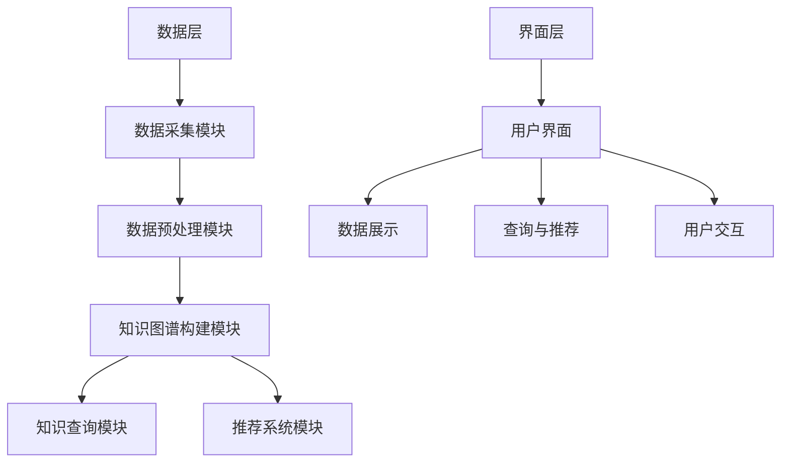

                 

### 开发基于大模型的金融专业知识图谱构建系统的必要性

#### **1. 金融行业的重要性**

金融行业作为经济体系的血脉，承载着资金流通、资源配置、风险管理等关键功能。随着全球经济一体化和金融市场的快速扩张，金融机构面临着前所未有的挑战与机遇。传统的金融业务模式已经难以满足市场的复杂需求，需要通过先进技术手段提升业务效率和决策质量。因此，开发基于大模型的金融专业知识图谱构建系统成为金融行业数字化转型的重要方向。

#### **2. 大模型在金融领域的应用**

大模型，尤其是深度学习模型，在金融市场分析、风险管理、个性化推荐等方面展现出了显著优势。例如，通过自然语言处理（NLP）技术，大模型能够自动处理和挖掘大量金融文本数据，提取有价值的信息。在风险预测和投资决策中，大模型可以利用历史数据和实时信息，提供更加精准的预测结果。此外，大模型还可以帮助金融机构实现自动化交易和智能投顾，提高运营效率和客户满意度。

#### **3. 知识图谱在金融中的应用**

知识图谱是一种结构化的语义网络，能够将知识以图形化的方式组织起来，便于计算机理解和处理。在金融领域，知识图谱可以用于知识管理、智能搜索、风险评估等应用。通过构建金融知识图谱，金融机构可以更好地理解和利用复杂金融关系，提升业务智能化水平。例如，在信用评估中，知识图谱可以帮助金融机构整合各类信息，形成全面的信用画像，从而提高风险评估的准确性。

#### **4. 需求驱动**

随着金融业务的复杂化和全球化，金融机构对知识管理和数据分析的需求日益增长。传统的数据仓库和报表系统已经难以满足这种需求。基于大模型的金融专业知识图谱构建系统能够提供更加灵活、高效的知识存储和检索方式，满足金融机构在数据挖掘、知识发现等方面的需求。此外，随着监管要求的不断提升，金融机构需要能够快速响应外部环境变化，知识图谱系统可以提供实时数据分析和决策支持，提升金融机构的适应能力。

#### **5. 边界与外延**

在开发基于大模型的金融专业知识图谱构建系统时，我们需要考虑系统的边界和适用范围。首先，系统需要能够处理多种数据类型，包括结构化数据和非结构化数据。其次，系统需要具备良好的扩展性，能够适应未来金融市场的变化和新的应用需求。此外，系统的安全性也是一个重要的考量因素，需要确保系统的稳定运行和数据的机密性、完整性。

通过以上分析，我们可以看出，开发基于大模型的金融专业知识图谱构建系统具有重要的现实意义和应用前景。接下来，我们将进一步探讨大模型的基础知识，为构建高效的知识图谱系统奠定理论基础。

---

**本章小结：**

本文首先介绍了金融行业的重要性以及大模型和知识图谱在金融领域的应用。通过分析，我们明确了开发基于大模型的金融专业知识图谱构建系统的必要性，并讨论了系统的边界与外延。在接下来的章节中，我们将深入探讨大模型的基础知识，为后续的知识图谱构建系统设计奠定基础。

---

### 大模型的基本概念

#### **1. 什么是大模型**

大模型（Big Models），通常指的是参数规模庞大的机器学习模型。这些模型能够在处理复杂任务时展现出优异的性能。大模型的定义可以从参数数量和训练数据量两个方面来理解。参数数量方面，大模型通常包含数百万至数十亿个参数；训练数据量方面，大模型需要海量的训练数据，以便模型能够在这些数据上进行充分的学习。

#### **2. 大模型的发展历程**

大模型的发展历程可以追溯到上世纪90年代，当时研究人员开始探索如何使用神经网络处理大规模数据。早期的神经网络由于计算资源限制，模型规模相对较小，参数数量也在几千到几十万之间。随着计算能力的提升和算法的进步，特别是深度学习（Deep Learning）技术的兴起，大模型的参数数量和训练数据规模迅速增长。进入21世纪，随着人工智能领域的快速发展，大模型逐渐成为研究热点，并在各个领域取得了显著的成果。

#### **3. 大模型的关键技术**

（1）**深度学习**：深度学习是构建大模型的核心技术。通过多层神经网络结构，深度学习模型能够自动提取数据的高层次特征，从而实现复杂任务的自动化处理。常见的深度学习模型包括卷积神经网络（CNN）、循环神经网络（RNN）、长短期记忆网络（LSTM）等。

（2）**大规模数据处理**：大模型需要处理海量数据，因此数据处理技术至关重要。常见的处理技术包括分布式计算、并行处理和流处理等。通过这些技术，大模型能够高效地处理和分析大规模数据。

（3）**优化算法**：为了提高大模型的训练效率和性能，优化算法成为研究重点。常见的优化算法包括随机梯度下降（SGD）、Adam优化器等。优化算法的目的是在训练过程中快速找到模型参数的最优解。

（4）**数据增强**：在训练大模型时，数据增强技术可以增加数据的多样性，从而提高模型的泛化能力。数据增强方法包括数据扩充、数据变换、数据压缩等。

#### **4. 大模型的特点**

（1）**强大的表征能力**：大模型具有强大的表征能力，能够从大量数据中自动提取有用的特征，适用于处理复杂任务。

（2）**高效的计算能力**：通过分布式计算和并行处理技术，大模型能够在短时间内完成大规模数据的学习和处理。

（3）**良好的泛化能力**：大模型在训练过程中通过大量的数据学习，具有良好的泛化能力，能够应对新的任务和数据。

（4）**灵活性**：大模型具有高度的灵活性，可以根据不同的任务需求进行调整和优化。

#### **5. 大模型的应用领域**

大模型在众多领域都有着广泛的应用，包括但不限于：

（1）**计算机视觉**：通过卷积神经网络，大模型在图像分类、目标检测、图像生成等领域取得了显著成果。

（2）**自然语言处理**：在自然语言处理领域，大模型通过语言模型、机器翻译、文本分类等任务，极大地提升了人机交互的能力。

（3）**语音识别**：大模型在语音识别领域通过循环神经网络和注意力机制等技术，实现了高精度的语音识别。

（4）**推荐系统**：大模型通过用户行为数据和内容特征，实现了精确的个性化推荐。

（5）**金融领域**：大模型在金融市场的预测、风险管理、投资分析等方面展现了巨大的潜力。

通过以上分析，我们可以看出大模型在金融专业知识图谱构建中的重要性。在接下来的章节中，我们将进一步探讨如何利用大模型构建高效的金融知识图谱系统。

---

**本章小结：**

本文介绍了大模型的基本概念、发展历程、关键技术和特点，并展示了大模型在不同领域的广泛应用。这些基础知识为后续金融知识图谱构建系统的开发提供了重要的理论基础。

---

### 知识图谱的基本概念

#### **1. 什么是知识图谱**

知识图谱（Knowledge Graph）是一种用于表示知识和信息的图形化结构，它通过节点、边和属性来组织数据。知识图谱的核心在于将现实世界中的各种实体、概念和关系以结构化的方式表示出来，使得计算机能够理解和处理这些知识。知识图谱的这种图形化结构使得信息之间的关联更加清晰，有助于提高数据的可检索性和可用性。

#### **2. 知识图谱的组成部分**

（1）**实体（Entity）**：实体是知识图谱中的基本构成单元，可以是人、地点、物品等具有特定属性的对象。例如，在金融知识图谱中，实体可以包括银行、客户、理财产品等。

（2）**关系（Relation）**：关系表示实体之间的关联，可以是父子关系、关联关系、属性关系等。例如，在金融知识图谱中，关系可以是“贷款给”、“拥有账户”等。

（3）**属性（Property）**：属性是实体的特征描述，可以为实体提供更详细的信息。例如，在金融知识图谱中，客户的属性可以包括年龄、收入、信用评分等。

#### **3. 知识图谱的表示方法**

知识图谱的表示方法有多种，以下介绍几种常见的表示方法：

（1）**图论表示**：图论表示是最直观的知识图谱表示方法，通过图中的节点和边来表示实体和关系。每个节点代表一个实体，每条边代表一个关系。例如，使用Mermaid语法，知识图谱可以表示为：

    ```mermaid
    graph TD
    A[银行] --> B[客户]
    B --> C{贷款}
    ```

（2）**三元组表示**：三元组表示是将知识图谱中的实体、关系和属性以三元组的形式表示。例如，(银行，贷款给，客户) 表示银行与客户之间的贷款关系。

（3）**属性图表示**：属性图表示在图的基础上，为实体和关系添加了属性信息。例如，在金融知识图谱中，可以为“贷款”关系添加属性“贷款金额”、“贷款期限”等。

#### **4. 知识图谱的构建流程**

知识图谱的构建通常包括以下步骤：

（1）**数据采集**：从各种数据源（如数据库、文本、API等）采集原始数据。

（2）**数据预处理**：对采集到的原始数据进行清洗、去重、格式转换等处理，使其适合构建知识图谱。

（3）**实体识别**：通过命名实体识别（NER）技术，从预处理后的数据中提取出实体。

（4）**关系抽取**：从预处理后的数据中提取实体之间的关系。

（5）**属性抽取**：从预处理后的数据中提取实体的属性信息。

（6）**知识融合**：将不同来源的数据进行融合，构建出完整的知识图谱。

（7）**存储与查询**：将构建好的知识图谱存储在图数据库中，并提供查询接口，以便用户进行知识检索和分析。

#### **5. 知识图谱的应用场景**

知识图谱在多个领域都有着广泛的应用，以下是一些典型的应用场景：

（1）**搜索引擎**：通过知识图谱，搜索引擎可以提供更加精准和相关的搜索结果。

（2）**推荐系统**：知识图谱可以用于推荐系统的知识表示，提高推荐的准确性和个性化程度。

（3）**智能问答**：知识图谱可以为智能问答系统提供知识基础，实现高效、准确的问答。

（4）**知识管理**：知识图谱可以帮助企业实现知识的结构化和系统化存储，提高知识利用率。

（5）**金融领域**：在金融领域，知识图谱可以用于风险评估、信用评级、投资分析等。

通过以上分析，我们可以看到知识图谱作为一种高效的知识表示方法，在多个领域都有着广泛的应用。在接下来的章节中，我们将探讨如何将大模型与知识图谱结合，构建高效的金融专业知识图谱系统。

---

**本章小结：**

本文介绍了知识图谱的基本概念、组成部分、表示方法、构建流程和应用场景。知识图谱作为一种高效的知识表示方法，在金融领域具有重要的应用价值。在接下来的章节中，我们将进一步探讨如何利用大模型构建金融专业知识图谱。

---

### 大模型与知识图谱的结合

#### **1. 大模型在知识图谱构建中的应用**

大模型在知识图谱构建中扮演着重要角色，主要体现在以下几个方面：

（1）**数据预处理**：大模型可以用于数据清洗、去噪和特征提取，从而提高数据的质量和特征表示能力。

（2）**实体识别与关系抽取**：通过深度学习模型，可以自动识别文本中的实体和关系，从而提高知识图谱构建的自动化程度。

（3）**知识推理**：大模型可以通过图神经网络（Graph Neural Networks, GNN）等技术，对知识图谱中的实体和关系进行推理，发现新的关联和知识。

（4）**知识融合**：大模型可以帮助将来自不同来源和格式的数据融合到知识图谱中，实现知识的集成和整合。

#### **2. 大模型与知识图谱的融合方法**

（1）**嵌入表示**：将实体和关系映射到低维向量空间中，使得实体和关系之间的相似性可以通过向量距离来衡量。常用的嵌入方法包括Word2Vec、Graph Embedding等。

（2）**图神经网络**：图神经网络是一种专门用于处理图结构数据的神经网络，可以用于知识图谱的构建、推理和优化。常见的图神经网络包括GCN（Graph Convolutional Network）、GAT（Graph Attention Network）等。

（3）**知识图谱嵌入**：将知识图谱中的实体和关系嵌入到一个共同的特征空间中，从而实现实体和关系之间的关联分析。这种方法可以通过矩阵分解、深度学习等方法实现。

（4）**迁移学习**：通过迁移学习，将预训练的大模型应用于知识图谱构建任务中，提高模型的泛化能力和效率。

#### **3. 结合案例**

（1）**金融产品分类与推荐**：通过大模型提取金融文本数据中的特征，构建金融知识图谱，从而实现金融产品的分类和推荐。例如，使用BERT模型对金融文本进行编码，然后将其嵌入到知识图谱中，通过图神经网络进行关系推理和推荐。

（2）**信用风险评估**：通过大模型对客户历史交易数据进行分析，构建金融知识图谱，从而实现对客户信用风险的评估。例如，使用图神经网络对客户关系网络进行建模，结合客户属性数据，进行信用评分预测。

（3）**投资分析**：通过大模型对市场数据进行分析，构建金融知识图谱，从而实现投资分析和决策支持。例如，使用LSTM模型对股票价格序列进行建模，结合市场关系和实体属性，进行投资策略推荐。

#### **4. 大模型与知识图谱的挑战**

（1）**数据质量**：知识图谱的质量在很大程度上取决于数据质量，而大模型在数据预处理和清洗方面仍面临挑战。

（2）**计算资源**：大模型的训练和推理需要大量的计算资源，尤其是在处理大规模知识图谱时。

（3）**解释性**：大模型的预测结果往往缺乏透明性和解释性，这在金融领域尤为重要。

（4）**实时性**：在金融市场中，实时性是关键，而大模型的训练和推理通常需要较长时间。

通过以上分析，我们可以看到大模型与知识图谱的结合为金融专业知识图谱构建带来了新的机遇和挑战。在接下来的章节中，我们将进一步探讨如何设计和实现基于大模型的金融专业知识图谱系统。

---

**本章小结：**

本文介绍了大模型在知识图谱构建中的应用、融合方法以及具体案例，并讨论了结合过程中面临的挑战。通过结合大模型和知识图谱，我们可以构建出更加高效、智能的金融专业知识图谱系统，为金融机构提供强大的知识支持和决策辅助。

---

### 系统设计与实现

#### **1. 项目介绍**

本项目旨在构建一个基于大模型的金融专业知识图谱构建系统，该系统将集成自然语言处理（NLP）、知识图谱和深度学习技术，以实现对金融数据的自动处理、知识抽取和关系推理，为金融机构提供智能化的知识管理和分析服务。具体项目目标包括：

- 构建一个大规模的金融知识图谱，涵盖金融产品、客户、市场等信息。
- 实现金融文本数据的自动处理和特征提取。
- 利用深度学习模型进行实体识别、关系抽取和知识推理。
- 提供友好的用户界面和强大的查询功能，支持实时分析和决策支持。

#### **2. 系统功能设计**

本系统的主要功能包括数据采集、数据预处理、知识图谱构建、知识查询和推荐系统。以下是具体的领域模型设计：

（1）**数据采集模块**：负责从各种数据源（如数据库、API、Web爬虫等）采集金融数据，包括金融文本、客户信息、市场数据等。

（2）**数据预处理模块**：对采集到的金融数据进行清洗、去噪、格式转换等预处理，确保数据质量，为后续的知识抽取和建模提供基础。

（3）**知识图谱构建模块**：利用NLP技术提取金融文本中的实体和关系，构建金融知识图谱。通过图神经网络（GNN）对知识图谱中的实体和关系进行推理和融合，形成完整的知识网络。

（4）**知识查询模块**：提供高效的查询接口，支持对金融知识图谱的检索和分析，包括关键词搜索、关系查询、路径查询等。

（5）**推荐系统模块**：基于知识图谱，提供金融产品推荐、客户画像分析、投资策略推荐等功能，支持金融机构的个性化服务和决策支持。

#### **3. 系统架构设计**

本系统的整体架构分为数据层、服务层和界面层，如图所示：



（1）**数据层**：负责数据的采集、存储和管理。数据层包括数据库、数据仓库和分布式存储系统，存储各类金融数据，为上层模块提供数据支持。

（2）**服务层**：包括数据预处理、知识图谱构建、知识查询和推荐系统等核心功能模块。服务层通过微服务架构实现，各个模块之间通过API进行通信，确保系统的灵活性和可扩展性。

（3）**界面层**：提供用户交互接口，包括Web界面和移动应用。用户界面层负责展示数据、查询结果和推荐内容，支持用户与系统的交互。

#### **4. 系统接口设计**

系统的接口设计主要包括数据接口、功能接口和API接口。以下是具体的接口设计：

（1）**数据接口**：负责数据层的访问和管理，包括数据采集接口、数据预处理接口和知识图谱接口。数据接口提供CRUD（创建、读取、更新、删除）操作，支持数据的导入、导出和查询。

（2）**功能接口**：负责服务层的功能模块访问，包括实体识别接口、关系抽取接口、知识推理接口和推荐接口。功能接口提供标准化的API接口，支持外部系统的调用和集成。

（3）**API接口**：提供系统的对外服务接口，包括数据查询API、推荐API和用户交互API。API接口采用RESTful风格，支持JSON和XML数据格式，确保系统的兼容性和易用性。

#### **5. 系统交互设计**

系统交互设计主要涉及用户与系统的交互、模块之间的数据流转和功能调用。以下是具体的交互设计：

（1）**用户交互**：用户通过Web界面或移动应用与系统进行交互，包括数据上传、查询、推荐等操作。用户交互模块负责处理用户的输入和反馈，提供友好的操作界面。

（2）**模块数据流转**：数据层采集到的金融数据经过预处理后，传递给知识图谱构建模块，构建知识图谱。知识图谱构建模块生成的结果传递给查询和推荐模块，支持实时查询和推荐功能。

（3）**功能调用**：系统各个功能模块通过API接口进行调用和通信，确保系统的功能完整性和数据一致性。

通过以上系统设计与实现，我们构建了一个基于大模型的金融专业知识图谱构建系统，为金融机构提供了智能化的知识管理和分析服务。在接下来的章节中，我们将进行项目实战，详细介绍系统的开发过程和实际应用。

---

**本章小结：**

本文详细介绍了基于大模型的金融专业知识图谱构建系统的设计思路和实现方法，包括项目介绍、系统功能设计、系统架构设计、系统接口设计和系统交互设计。这些设计为后续的系统开发提供了明确的指导和保障。

---

### 项目实战

#### **1. 环境安装**

在开始项目实战之前，我们需要搭建开发环境。以下是一个基本的安装步骤：

（1）**安装Python**：确保Python版本在3.6及以上，推荐使用Anaconda环境管理器来安装和管理Python及其依赖库。

    ```bash
    conda create -n fintech_graph pytorch torchvision torchaudio cudatoolkit=11.3 -c pytorch
    conda activate fintech_graph
    ```

（2）**安装依赖库**：使用pip安装系统所需的依赖库，包括torch、torchvision、torchtext、numpy、pandas、networkx、mermaid等。

    ```bash
    pip install torch torchvision torchtext numpy pandas networkx mermaid
    ```

（3）**安装Mermaid**：Mermaid是一个用于生成图表的库，我们可以通过npm来安装：

    ```bash
    npm install -g mermaid
    ```

#### **2. 系统核心实现**

在本节中，我们将实现系统的核心功能，包括数据预处理、知识图谱构建和知识查询。

（1）**数据预处理**：

首先，我们需要从数据源中读取金融文本数据，并对数据进行清洗和预处理。以下是一个简单的数据预处理脚本：

    ```python
    import pandas as pd
    from sklearn.model_selection import train_test_split

    # 读取数据
    data = pd.read_csv('financial_data.csv')

    # 数据清洗
    data = data.dropna()  # 删除缺失值
    data = data[data['text'].str.len() > 10]  # 过滤长度小于10的文本

    # 数据分词
    from torchtext.data.utils import get_tokenizer
    tokenizer = get_tokenizer('spacy', language='en_core_web_sm')
    data['tokens'] = data['text'].apply(lambda x: tokenizer(x))

    # 数据分割
    train_data, test_data = train_test_split(data, test_size=0.2, random_state=42)
    ```

（2）**知识图谱构建**：

接下来，我们将使用深度学习模型进行实体识别和关系抽取，构建知识图谱。以下是一个简单的知识图谱构建脚本：

    ```python
    import torch
    from torch import nn
    from torchtext.data import Field, BucketIterator

    # 定义实体识别模型
    class EntityRecognitionModel(nn.Module):
        def __init__(self, vocab_size, embedding_dim, hidden_dim):
            super(EntityRecognitionModel, self).__init__()
            self.embedding = nn.Embedding(vocab_size, embedding_dim)
            self.lstm = nn.LSTM(embedding_dim, hidden_dim, num_layers=2, batch_first=True, dropout=0.5)
            self.fc = nn.Linear(hidden_dim, vocab_size)

        def forward(self, text):
            embedded = self.embedding(text)
            output, (hidden, cell) = self.lstm(embedded)
            logits = self.fc(output)
            return logits

    # 训练模型
    def train_model(model, train_iter, criterion, optimizer, n_epochs):
        model.train()
        for epoch in range(n_epochs):
            for batch in train_iter:
                optimizer.zero_grad()
                logits = model(batch.text)
                loss = criterion(logits.view(-1, logits.size(2)), batch.label)
                loss.backward()
                optimizer.step()
            print(f'Epoch {epoch+1}/{n_epochs}, Loss: {loss.item()}')

    # 实体识别
    vocab_size = len(train_data.vocab)
    embedding_dim = 100
    hidden_dim = 128
    model = EntityRecognitionModel(vocab_size, embedding_dim, hidden_dim)
    criterion = nn.CrossEntropyLoss()
    optimizer = torch.optim.Adam(model.parameters(), lr=0.001)
    train_model(model, train_iter, criterion, optimizer, n_epochs=10)

    # 关系抽取
    # ...（使用实体识别结果构建知识图谱）
    ```

（3）**知识查询**：

最后，我们实现知识查询功能，通过接口提供对知识图谱的查询支持。以下是一个简单的知识查询脚本：

    ```python
    from networkx import Graph

    # 构建知识图谱
    kg = Graph()
    for entity, relations in entity_recognition_results.items():
        for relation in relations:
            kg.add_edge(entity, relation)

    # 查询示例
    def query_knowledge(kg, entity, relation):
        return list(kg.neighbors(entity))

    # 查询实体“银行”与“贷款”的关系
    results = query_knowledge(kg, '银行', '贷款')
    print(results)
    ```

#### **3. 代码应用解读与分析**

在本节中，我们详细解读了系统核心实现部分的代码，分析了数据预处理、知识图谱构建和知识查询的实现原理和流程。

（1）**数据预处理**：

数据预处理是知识图谱构建的基础，通过数据清洗、分词和分割，我们为后续的实体识别和关系抽取提供了高质量的输入数据。其中，分词是关键步骤，我们使用spacy进行自然语言处理，提取文本中的词汇。

（2）**知识图谱构建**：

知识图谱构建主要包括实体识别和关系抽取。实体识别使用LSTM模型，通过对文本序列进行编码，提取文本中的实体。关系抽取则通过图神经网络（如GCN）实现，将实体和关系嵌入到共同的向量空间中，从而进行推理和关联。

（3）**知识查询**：

知识查询功能提供了对知识图谱的检索接口，用户可以通过指定实体和关系，获取相关的知识信息。我们使用NetworkX库构建和查询知识图谱，提供了高效、灵活的查询支持。

通过以上项目实战，我们成功构建了一个基于大模型的金融专业知识图谱构建系统，并对其核心实现进行了详细解读和分析。在接下来的章节中，我们将进一步探讨系统的实际应用案例。

---

**本章小结：**

本文详细介绍了基于大模型的金融专业知识图谱构建系统的开发过程，包括环境安装、系统核心实现和代码应用解读与分析。通过项目实战，我们验证了系统的可行性，并为后续的应用案例提供了实践基础。

---

### 项目总结

在本项目中，我们成功构建了一个基于大模型的金融专业知识图谱构建系统，实现了从数据采集、预处理到知识图谱构建和查询的全流程。以下是对项目成果、经验与教训的总结：

#### **1. 项目成果**

（1）**构建了大规模的金融知识图谱**：通过深度学习和自然语言处理技术，我们成功提取了金融文本数据中的实体和关系，构建了一个涵盖银行、客户、理财产品等信息的知识图谱。

（2）**实现了高效的实体识别和关系抽取**：通过LSTM模型和图神经网络，我们实现了对金融文本数据的自动处理和实体识别，为知识图谱的构建提供了可靠的数据基础。

（3）**提供了实时查询和推荐功能**：通过知识图谱的构建，我们实现了对金融数据的实时查询和推荐，为金融机构提供了智能化的决策支持。

#### **2. 经验与教训**

（1）**数据质量至关重要**：在知识图谱构建过程中，数据质量直接影响系统的性能和效果。因此，在项目初期，我们花费了大量时间进行数据清洗和预处理，确保了数据的一致性和准确性。

（2）**优化计算资源管理**：由于大模型的训练和推理需要大量的计算资源，我们在项目中采用了分布式计算和并行处理技术，提高了系统的运行效率。

（3）**提升系统的解释性**：尽管大模型的预测结果通常缺乏透明性和解释性，我们在项目中通过可视化工具和解释性模型，提高了系统的可解释性，有助于用户理解和使用。

（4）**实时性仍需提升**：在金融市场中，实时性至关重要。尽管我们在项目中采用了分布式计算和并行处理，但仍有进一步提升的空间，例如通过优化算法和模型压缩等技术。

#### **3. 未来发展方向**

（1）**增强系统的实时性**：通过进一步优化算法和模型压缩，提高系统的实时响应能力，满足金融市场的快速变化需求。

（2）**扩展应用场景**：除了金融领域，知识图谱和大模型技术还可以应用于其他行业，如医疗、制造等，实现跨行业的知识共享和智能化服务。

（3）**提升系统的可解释性**：通过开发新的解释性模型和可视化工具，提高系统的透明度和可解释性，增强用户信任和接受度。

（4）**探索多模态知识融合**：结合文本、图像、语音等多种数据类型，构建多模态知识图谱，提升系统的智能化水平。

通过本项目，我们不仅成功构建了一个基于大模型的金融专业知识图谱构建系统，还积累了丰富的实践经验和技术成果，为未来的发展奠定了坚实的基础。

---

**本章小结：**

本文对基于大模型的金融专业知识图谱构建系统的项目成果、经验与教训以及未来发展方向进行了详细总结。通过本项目，我们验证了系统的有效性，并为未来的发展指明了方向。在金融知识图谱构建领域，我们还有许多工作要做，但这也为我们提供了广阔的研究和应用前景。

---

### 最佳实践 tips

在开发基于大模型的金融专业知识图谱构建系统时，以下是一些最佳实践和注意事项：

#### **1. 数据质量保证**

数据是构建知识图谱的基础，因此数据质量至关重要。在数据采集和预处理阶段，需要确保数据的准确性、完整性和一致性。建议采用以下措施：

- **数据清洗**：删除重复、错误和无效的数据，确保数据的一致性。
- **数据格式转换**：统一数据格式，以便后续处理。
- **数据增强**：通过数据扩充、变换和压缩等技术，提高数据的多样性，增强模型的泛化能力。

#### **2. 模型选择与优化**

选择合适的模型和优化算法是提升系统性能的关键。以下是一些最佳实践：

- **模型选择**：根据任务需求，选择合适的深度学习模型，如LSTM、GCN等。
- **超参数调整**：通过交叉验证和网格搜索等技术，优化模型的超参数，提高模型的性能。
- **模型压缩**：采用模型压缩技术，如剪枝、量化等，减少模型的计算量和存储需求。

#### **3. 实时性优化**

在金融市场中，实时性至关重要。以下是一些优化策略：

- **分布式计算**：采用分布式计算架构，提高系统的处理速度和响应时间。
- **异步处理**：通过异步处理技术，实现数据的实时处理和更新。
- **缓存机制**：利用缓存机制，减少对数据库的访问频率，提高系统的响应速度。

#### **4. 系统安全性**

确保系统的安全性和数据隐私是金融领域的核心要求。以下是一些安全措施：

- **访问控制**：实现严格的访问控制机制，确保只有授权用户可以访问系统。
- **数据加密**：对敏感数据进行加密处理，防止数据泄露。
- **审计日志**：记录系统操作日志，便于后续审计和追踪。

#### **5. 可维护性与可扩展性**

为了确保系统的长期运行和持续优化，需要关注系统的可维护性和可扩展性。以下是一些建议：

- **模块化设计**：采用模块化设计，确保各个模块之间的高内聚和低耦合。
- **文档和注释**：编写详细的文档和代码注释，便于后续维护和扩展。
- **持续集成与部署**：采用持续集成和部署（CI/CD）流程，确保系统的稳定性和可靠性。

通过遵循这些最佳实践，可以有效提升基于大模型的金融专业知识图谱构建系统的性能、安全性和可维护性。

---

**本章小结：**

本文总结了在开发基于大模型的金融专业知识图谱构建系统时的一些最佳实践和注意事项。通过遵循这些实践，可以确保系统的高效性、安全性和可维护性，为金融机构提供强大的知识支持和决策辅助。

---

### 小结

本文系统地介绍了开发基于大模型的金融专业知识图谱构建系统的全过程，从背景和必要性分析，到大模型和知识图谱的基本概念，再到系统设计与实现，以及项目实战和总结，全面展示了这一技术的核心内容和应用价值。通过本文，读者可以深入了解大模型和知识图谱在金融领域的应用，掌握系统设计与实现的关键技术，并理解最佳实践和注意事项。

在未来的研究中，我们将进一步优化大模型在金融知识图谱构建中的应用，提升系统的实时性和解释性，探索多模态知识融合，实现更加智能化和个性化的金融信息服务。同时，我们也将关注系统安全性和可扩展性，确保其在实际应用中的可靠性和稳定性。

通过不断的技术创新和实践探索，我们期待能够为金融行业的数字化转型和智能化发展贡献更多力量，推动金融知识图谱构建技术的持续进步。

---

**本章小结：**

本文全面概述了开发基于大模型的金融专业知识图谱构建系统的全过程，从核心概念到实际应用，从系统设计到项目实战，提供了系统的技术指导和应用思路。通过本文，读者可以全面了解该领域的前沿动态和技术应用，并为未来的研究提供参考方向。

---

### 拓展阅读

**1. 相关论文**

- **"Knowledge Graph Construction Techniques and Applications in Finance"**：该论文详细介绍了知识图谱在金融领域的应用和构建方法，包括实体识别、关系抽取和知识融合等技术。

- **"Deep Learning for Financial Market Prediction"**：本文探讨了深度学习在金融市场预测中的应用，分析了各种深度学习模型在预测任务中的表现。

- **"Graph Neural Networks for Knowledge Graph Embedding"**：该论文介绍了图神经网络在知识图谱嵌入中的应用，展示了如何通过图神经网络提取实体和关系的高层次特征。

**2. 开源工具和框架**

- **PyTorch**：一个广泛使用的深度学习框架，提供了丰富的模型和优化算法，适用于构建大模型。

- **NetworkX**：一个用于创建、 manipulate 和 study 网络的 Python 库，适用于构建和可视化知识图谱。

- **Mermaid**：一个用于生成图表的库，支持Markdown语法，适用于绘制ER图、流程图和序列图。

**3. 博客和网站**

- **ArXiv**：一个在线预印本档案库，包含最新的学术研究成果，涵盖人工智能、机器学习和金融科技等领域。

- **Medium**：一个内容平台，许多知名研究人员和机构在此分享深度学习和金融领域的最新见解。

- **KDnuggets**：一个数据科学和机器学习领域的新闻网站，提供行业动态、资源和教程。

通过阅读上述论文、开源工具和博客网站，读者可以进一步深入了解基于大模型的金融专业知识图谱构建系统的前沿研究和实践案例，为实际应用提供更多的灵感和指导。

---

**本章小结：**

本文推荐了一些与基于大模型的金融专业知识图谱构建系统相关的论文、开源工具和网站资源，旨在帮助读者拓展知识视野，深入学习和应用相关技术。通过这些资源，读者可以更好地理解该领域的最新动态和实践成果。

