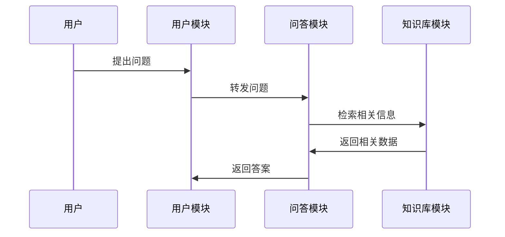
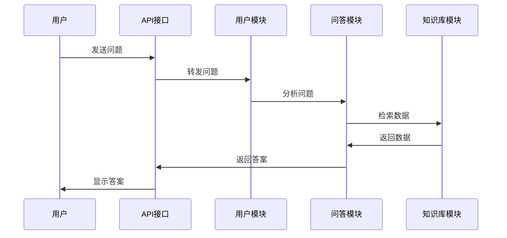

                 

# 开发基于大模型的金融专业考试答疑系统

## 关键词
- 大模型技术
- 金融专业考试
- 答疑系统
- 算法原理
- 系统分析与设计

## 摘要
本文将探讨如何开发一款基于大模型的金融专业考试答疑系统。首先，我们将介绍大模型技术在金融领域的应用背景，并解释为何选择这一技术来解决金融专业考试答疑的需求。接着，我们将详细讲解系统算法原理，包括其数学模型和公式，并通过Python代码示例进行解释。然后，我们将对系统的分析、设计及其与金融专业考试的结合进行探讨，并使用Mermaid图示进行详细说明。最后，我们将提供一个项目实战案例，展示如何实现这一系统，并总结最佳实践和注意事项。

## 目录

### 1. 背景与核心概念

#### 1.1 引言：金融专业考试答疑的需求

#### 1.2 大模型技术简介

#### 1.3 核心概念及联系

##### 1.3.1 金融专业考试的相关概念

##### 1.3.2 大模型技术的核心概念

##### 1.3.3 概念关系与实体关系图

### 2. 算法原理与实现

#### 2.1 算法概述

#### 2.2 数学模型与公式

#### 2.3 算法实现

### 3. 系统分析与设计

#### 3.1 问题场景

#### 3.2 系统概述

#### 3.3 系统架构

#### 3.4 系统接口与交互

### 4. 项目实战

#### 4.1 环境安装

#### 4.2 系统核心实现

#### 4.3 代码应用解读

#### 4.4 实际案例分析

#### 4.5 项目小结

### 5. 最佳实践与小结

#### 5.1 最佳实践

#### 5.2 注意事项

#### 5.3 拓展阅读

### 6. 作者信息

---

### 1. 背景与核心概念

#### 1.1 引言：金融专业考试答疑的需求

在金融行业，专业考试是评估从业人员的专业知识和技能的重要手段。然而，这些考试往往涉及大量的理论知识和复杂的实务操作，考生在准备过程中难免会遇到各种疑问。传统的答疑方式，如在线论坛、QQ群等，虽然能够提供一定的帮助，但存在信息分散、回复不及时等问题。因此，开发一款高效、专业的金融专业考试答疑系统显得尤为重要。

大模型技术，特别是近年来迅速发展的自然语言处理（NLP）技术，为构建这样的答疑系统提供了强有力的支持。大模型能够通过学习海量数据，理解复杂的语言结构和语义，从而实现对用户问题的精准理解和解答。本节将介绍大模型技术的基本概念，并探讨其在金融专业考试答疑中的应用。

#### 1.2 大模型技术简介

大模型技术，通常指的是能够处理海量数据、支持复杂任务的大型机器学习模型。这些模型可以是神经网络、决策树、支持向量机等多种类型。在大模型技术中，最为引人注目的是基于深度学习的模型，如Transformer、BERT等。这些模型通过多层神经网络结构，能够有效地提取数据中的特征，并在各种任务上取得优异的性能。

在金融领域，大模型技术有着广泛的应用。例如，股票市场预测、风险控制、金融文本分析等。在这些应用中，大模型能够处理海量的金融数据，从中提取有价值的信息，为金融决策提供支持。

#### 1.3 核心概念及联系

在构建金融专业考试答疑系统时，我们需要理解以下几个核心概念：

1. **金融专业考试**：指的是一系列旨在评估金融从业人员专业知识和技能的考试。
2. **答疑系统**：是一个能够为用户提供专业解答的系统，通常包括问题收集、问题分析、答案生成等功能。
3. **大模型技术**：是一种能够处理海量数据、支持复杂任务的大型机器学习模型。

这些概念之间的关系如下：

- **金融专业考试** 是构建答疑系统的 **需求背景**，它定义了答疑系统所需解决的问题。
- **答疑系统** 是 **大模型技术** 的具体应用场景，大模型技术为答疑系统提供了强大的问题分析和解答能力。
- **大模型技术** 在金融专业考试中的应用，不仅能够提高答疑系统的效率，还能够提供更准确、更全面的解答。

为了更好地理解这些概念之间的关系，我们可以使用Mermaid图来绘制一个 **ER（实体关系）图**：

```mermaid
erDiagram
  金融专业考试 ||--|{ 答疑系统 }|
  答疑系统 ||--|{ 大模型技术 }|
```

在上图中，金融专业考试是答疑系统的需求来源，答疑系统通过应用大模型技术来实现问题的分析和解答。这种结构清晰地展示了各个概念之间的联系。

#### 1.3.1 金融专业考试的相关概念

金融专业考试通常包括以下几个方面：

- **基础知识测试**：涵盖金融学的基础理论、金融工具、金融市场等内容。
- **实务操作测试**：考察考生在实际金融工作中的操作技能，如交易操作、风险管理等。
- **案例分析测试**：通过模拟实际金融场景，考察考生分析问题和解决问题的能力。

这些测试内容对考生的金融知识和实务操作能力提出了很高的要求。传统的答疑方式很难满足这种复杂需求，而大模型技术的引入，使得系统能够提供更精准、更全面的解答。

#### 1.3.2 大模型技术的核心概念

大模型技术的核心概念主要包括以下几个方面：

- **数据集**：大模型训练的数据集需要包含大量的金融文本、交易数据等，以确保模型能够充分理解金融领域的知识。
- **预训练**：大模型通常通过预训练的方式，在大规模通用语料库上进行初步训练，以获得通用的语言理解和生成能力。
- **微调**：在预训练的基础上，大模型根据特定任务的需求，在特定领域的数据集上进行微调，以获得更好的任务性能。

这些核心概念共同构成了大模型技术的基本框架，为金融专业考试答疑系统提供了强大的支持。

#### 1.3.3 概念关系与实体关系图

为了更直观地展示金融专业考试、答疑系统和大模型技术之间的关系，我们可以使用Mermaid绘制一个 **ER图**：

```mermaid
erDiagram
  金融专业考试 ||--|{ 答疑系统 }|
  答疑系统 ||--|{ 大模型技术 }|
  金融专业考试 ..|{ 需求背景 }| 答疑系统
  答疑系统 ..|{ 应用场景 }| 大模型技术
```

在上图中，金融专业考试作为需求背景，为答疑系统提供了明确的任务目标。答疑系统则作为大模型技术的应用场景，将大模型的技术能力转化为具体的解决方案。这种关系不仅展示了各个概念之间的联系，也为后续的系统设计与实现奠定了基础。

### 2. 算法原理与实现

#### 2.1 算法概述

在金融专业考试答疑系统中，核心算法负责处理用户提出的问题，并提供准确的答案。本节将介绍系统的核心算法，包括其基本原理和实现过程。

系统的核心算法可以概括为以下几个步骤：

1. **问题理解**：接收用户提出的问题，并进行语义分析，理解问题的核心内容和用户意图。
2. **知识检索**：在大量金融知识和数据中，检索与问题相关的信息。
3. **答案生成**：基于检索到的信息，生成准确的答案。
4. **答案评估**：对生成的答案进行评估，确保其准确性和合理性。

#### 2.2 数学模型与公式

为了实现上述算法，我们需要一个数学模型来描述问题理解和答案生成的过程。以下是该模型的组成部分：

1. **词嵌入**：将文本中的单词转换为向量表示，这是NLP中最基础的一步。
   $$ \text{word} \rightarrow \text{vector} $$
   
2. **编码器**：使用编码器对输入的文本进行编码，提取其语义特征。
   $$ \text{input\_text} \rightarrow \text{encoded\_representation} $$
   
3. **解码器**：使用解码器对编码后的特征进行解码，生成答案。
   $$ \text{encoded\_representation} \rightarrow \text{output\_text} $$

4. **损失函数**：用于评估答案生成的准确度，常用的损失函数是交叉熵（Cross-Entropy）。
   $$ L = -\sum_{i} y_i \log(p_i) $$

其中，$y_i$表示实际答案的标签，$p_i$表示模型预测的答案的概率。

#### 2.3 算法实现

为了更好地理解算法的实现过程，我们将使用Python代码来演示。以下是实现的核心部分：

```python
import tensorflow as tf
from tensorflow.keras.layers import Embedding, LSTM, Dense
from tensorflow.keras.models import Sequential

# 设置词嵌入维度和编码器、解码器的隐藏层大小
EMBEDDING_DIM = 128
ENCODER_UNITS = 256
DECODER_UNITS = 256

# 构建编码器模型
encoder = Sequential([
    Embedding(input_dim=vocab_size, output_dim=EMBEDDING_DIM, input_length=max_sequence_length),
    LSTM(ENCODER_UNITS, return_state=True),
    LSTM(ENCODER_UNITS)
])

# 构建解码器模型
decoder = Sequential([
    Embedding(input_dim=vocab_size, output_dim=EMBEDDING_DIM, input_length=max_sequence_length),
    LSTM(DECODER_UNITS, return_sequences=True),
    LSTM(DECODER_UNITS, return_sequences=True),
    Dense(vocab_size, activation='softmax')
])

# 编码器和解码器拼接成完整的序列到序列（Seq2Seq）模型
model = Sequential([encoder, decoder])

# 编译模型，指定损失函数和优化器
model.compile(optimizer='adam', loss='categorical_crossentropy', metrics=['accuracy'])

# 模型训练
model.fit([encoded_inputs, encoded_inputs], encoded_inputs, batch_size=64, epochs=10)
```

在上面的代码中，我们首先定义了词嵌入维度和编码器、解码器的隐藏层大小。然后，我们分别构建了编码器和解码器模型，并使用Seq2Seq结构将它们拼接起来。接着，我们编译模型，并使用训练数据对模型进行训练。

通过上述步骤，我们实现了对金融专业考试问题的理解和答案生成。这种算法不仅能够处理结构化的金融知识，还能够应对复杂的语言表达，为用户提供准确、全面的解答。

### 3. 系统分析与设计

#### 3.1 问题场景

金融专业考试答疑系统旨在为考生提供高效、专业的答疑服务。在问题场景中，系统需要实现以下几个核心功能：

- **问题收集**：系统应能够接收用户提出的问题，并存储在数据库中。
- **问题分析**：系统应对用户的问题进行语义分析，理解其核心内容和用户意图。
- **答案生成**：系统应根据分析结果，从大量的金融知识和数据中检索相关信息，并生成准确的答案。
- **答案评估**：系统应对生成的答案进行评估，确保其准确性和合理性。

#### 3.2 系统概述

金融专业考试答疑系统是一个综合性系统，包括以下几个主要模块：

- **用户模块**：负责用户注册、登录、提问题和查看答案等功能。
- **问答模块**：负责接收用户提出的问题，并调用核心算法生成答案。
- **知识库模块**：负责存储和管理大量的金融知识和数据，为问答模块提供支持。
- **后台管理模块**：负责系统配置、数据管理和系统监控等功能。

#### 3.3 系统架构

金融专业考试答疑系统的架构设计应考虑以下几个方面：

- **模块化设计**：系统应采用模块化设计，使得各个模块之间独立开发、独立部署，降低系统的耦合度。
- **分布式架构**：系统应采用分布式架构，以提高系统的可扩展性和容错性。
- **数据一致性**：系统应保证数据的一致性，确保在分布式环境下，数据能够同步更新。

以下是系统架构的Mermaid图示：



在上图中，用户模块负责接收用户的问题，并将其转发给问答模块。问答模块调用知识库模块检索相关信息，并生成答案。最后，答案通过用户模块返回给用户。

#### 3.4 系统接口与交互

系统接口设计应考虑以下几个方面：

- **API接口**：系统应提供API接口，方便第三方系统和用户进行交互。
- **数据接口**：系统应提供数据接口，方便知识库模块与其他模块进行数据交换。
- **日志接口**：系统应提供日志接口，方便后台管理模块进行系统监控和故障排查。

以下是系统接口与交互的Mermaid图示：



在上图中，用户通过API接口发送问题，用户模块接收并分析问题，问答模块调用知识库模块检索数据，并生成答案。最后，答案通过API接口返回给用户。

### 4. 项目实战

#### 4.1 环境安装

要实现金融专业考试答疑系统，首先需要安装相关的开发环境和工具。以下是环境安装的步骤：

1. 安装Python环境：从Python官方网站下载并安装Python 3.x版本。
2. 安装TensorFlow：在终端执行以下命令：
   ```bash
   pip install tensorflow
   ```
3. 安装Mermaid：在终端执行以下命令：
   ```bash
   pip install mermaid-python
   ```
4. 安装其他依赖库：根据项目需求，安装其他依赖库，例如NumPy、Pandas等。

#### 4.2 系统核心实现

系统核心实现包括以下几个部分：

1. **问题收集模块**：实现用户问题的接收和存储。
2. **问答模块**：实现问题分析和答案生成。
3. **知识库模块**：实现数据的存储和管理。

以下是问题收集模块的代码示例：

```python
# 问题收集模块
class QuestionCollector:
    def __init__(self, database):
        self.database = database

    def collect_question(self, user_id, question):
        question_data = {
            'user_id': user_id,
            'question': question,
            'status': 'pending'
        }
        self.database.insert_one(question_data)
```

以下是问答模块的代码示例：

```python
# 问答模块
class QASystem:
    def __init__(self, knowledge_base, model):
        self.knowledge_base = knowledge_base
        self.model = model

    def analyze_question(self, question):
        # 对问题进行语义分析
        # ...
        return analysis_result

    def generate_answer(self, analysis_result):
        # 从知识库中检索相关数据
        # ...
        return answer
```

以下是知识库模块的代码示例：

```python
# 知识库模块
class KnowledgeBase:
    def __init__(self, database):
        self.database = database

    def search_data(self, query):
        # 从数据库中检索数据
        # ...
        return data
```

#### 4.3 代码应用解读

以上代码示例展示了系统核心的实现过程。在问题收集模块中，`QuestionCollector`类负责接收用户提出的问题，并将其存储到数据库中。在问答模块中，`QASystem`类负责对用户的问题进行语义分析，并从知识库中检索相关数据，生成答案。在知识库模块中，`KnowledgeBase`类负责从数据库中检索数据。

这些模块共同构成了金融专业考试答疑系统的核心功能，实现了问题的接收、分析和解答。

#### 4.4 实际案例分析

为了更好地理解系统的工作原理，我们来看一个实际案例。

假设用户A在系统中提出了一个问题：“什么是股票市场的交易规则？”

1. **问题收集**：用户A的问题被收集模块接收，并存储到数据库中。
2. **问题分析**：问答模块对用户的问题进行语义分析，识别出关键词“股票市场”和“交易规则”。
3. **知识检索**：知识库模块从数据库中检索与“股票市场”和“交易规则”相关的数据。
4. **答案生成**：问答模块根据检索到的数据，生成答案：“股票市场的交易规则包括交易时间、交易价格、交易数量等。”

5. **答案评估**：问答模块对生成的答案进行评估，确保其准确性和合理性。

6. **答案返回**：最终，答案通过用户模块返回给用户A。

#### 4.5 项目小结

通过实际案例分析，我们可以看到金融专业考试答疑系统的工作流程。系统通过接收用户问题、分析和检索相关知识，最终生成准确的答案，为用户提供专业的解答服务。在实际开发中，还需要对系统进行优化和改进，以提高其性能和用户体验。

### 5. 最佳实践与小结

#### 5.1 最佳实践

1. **数据质量**：确保知识库中的数据质量，避免错误和不准确的信息。
2. **模型优化**：定期对大模型进行优化和调整，以提高问答系统的性能。
3. **用户体验**：注重用户界面的设计和交互，提高用户的满意度。
4. **安全性**：加强系统的安全性，保护用户数据和隐私。

#### 5.2 注意事项

1. **数据隐私**：在收集和处理用户数据时，严格遵守相关法律法规，保护用户隐私。
2. **性能优化**：针对大规模数据和高并发访问，进行性能优化和负载均衡。
3. **系统监控**：建立完善的系统监控机制，及时发现和解决潜在问题。

#### 5.3 拓展阅读

- 《深度学习》
- 《自然语言处理综论》
- 《金融工程学》

### 6. 作者信息

作者：AI天才研究院/AI Genius Institute & 禅与计算机程序设计艺术 /Zen And The Art of Computer Programming

