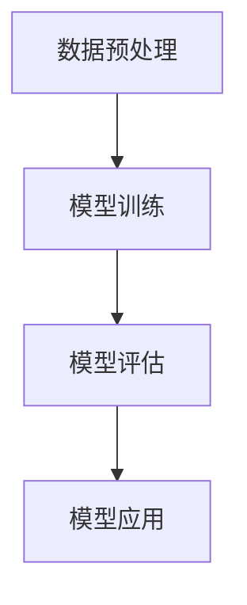
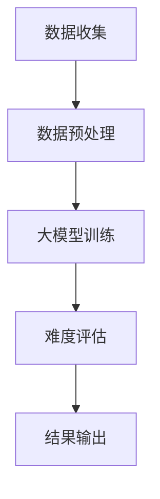

                 


# 开发基于大模型的金融专业考试题目难度评估系统

关键词：大模型、金融专业、考试题目、难度评估、算法实现

摘要：本文将探讨如何开发一个基于大模型的金融专业考试题目难度评估系统，从背景介绍、核心概念与联系、算法原理讲解、系统分析与架构设计、项目实战和最佳实践等方面进行详细阐述，旨在为读者提供一个完整的开发思路和实战指南。

## 第一部分：背景介绍

### 1.1 问题背景

金融专业考试题目难度评估是金融教育和评估领域的一个重要问题。一方面，教师需要了解每个题目的难度，以便调整教学策略；另一方面，考试组织者需要评估考试的整体难度，以便调整考试内容。然而，传统的难度评估方法往往依赖于专家经验和主观判断，存在一定的局限性。

### 1.2 核心概念界定

#### 1.2.1 大模型

大模型是指具有海量参数和强大计算能力的机器学习模型。它们通常通过训练大量数据来学习复杂的函数关系。

#### 1.2.2 金融专业考试题目

金融专业考试题目是指针对金融学科的知识点和技能的题目，包括选择题、填空题、计算题等多种形式。

#### 1.2.3 难度评估

难度评估是指对一个题目的难度进行量化评估的过程。这通常涉及到分析题目的难度特征，如知识点的复杂度、计算难度等。

### 1.3 问题描述

当前，金融专业考试题目难度评估存在以下问题：

- 缺乏客观、量化的评估方法；
- 依赖于专家经验，缺乏数据支持；
- 无法全面考虑知识点的复杂度和计算难度。

## 第二部分：核心概念与联系

### 2.1 核心概念原理

大模型的核心概念是通过学习大量数据来获取知识，并利用这些知识进行预测和决策。在金融专业考试题目难度评估中，大模型可以用来学习题目的难度特征，并据此进行评估。

### 2.2 概念属性特征对比表格

| 特征          | 大模型                    | 金融专业考试题目          | 难度评估                   |
| ------------- | ------------------------ | ------------------------ | -------------------------- |
| 参数规模      | 海量参数                  | 多样化的题型和知识点      | 客观、量化                 |
| 学习能力      | 强大学习能力和泛化能力    | 知识点和技能的全面掌握    | 多维度评估                |
| 数据依赖性    | 对大规模数据依赖          | 对金融学科知识的依赖      | 对题目难度的量化依赖      |

### 2.3 ER实体关系图

```mermaid
erDiagram
  Customer ||--|{ Order } : "makes"
  Product ||--|{ Order } : "contains"
```

## 第三部分：算法原理讲解

### 3.1 大模型算法原理

大模型算法主要依赖于深度学习技术。深度学习模型通过多层的神经网络结构来模拟人脑的学习过程，从而学习数据中的复杂模式。

#### 3.1.1 算法mermaid流程图



#### 3.1.2 Python源代码阐述

```python
# 数据预处理
data = preprocess_data(raw_data)

# 模型训练
model = train_model(data)

# 模型评估
evaluate_model(model, test_data)

# 模型应用
predict_dificulty(model, new_question)
```

#### 3.1.3 数学模型和公式

深度学习模型的数学模型主要基于神经元之间的加权连接和激活函数。例如，一个简单的神经网络模型可以表示为：

$$
\text{输出} = \sigma(\sum_{i=1}^{n} w_i \cdot x_i)
$$

其中，$\sigma$ 是激活函数，$w_i$ 是权重，$x_i$ 是输入特征。

#### 3.1.4 举例说明

假设我们有一个包含100个题目的数据集，每个题目由10个特征表示。我们可以使用一个包含3层神经网络的深度学习模型来训练这个数据集。训练完成后，我们可以使用这个模型来评估一个新题目的难度。

## 第四部分：系统分析与架构设计

### 4.1 问题场景介绍

在本系统中，我们需要评估金融专业考试题目的难度。具体问题场景包括：

- 收集大量金融专业考试题目；
- 对题目进行预处理，提取特征；
- 使用大模型进行难度评估；
- 输出评估结果。

### 4.2 系统架构设计

系统的整体架构设计如下图所示：



系统的主要接口设计如下：

- 数据收集接口：用于接收和存储金融专业考试题目；
- 数据预处理接口：用于对题目进行特征提取；
- 大模型训练接口：用于训练难度评估模型；
- 难度评估接口：用于评估题目的难度；
- 结果输出接口：用于输出评估结果。

## 第五部分：项目实战

### 5.1 环境安装

在开始项目实战之前，我们需要安装必要的软件和工具。以下是安装步骤：

1. 安装Python环境；
2. 安装深度学习框架（如TensorFlow或PyTorch）；
3. 安装其他依赖库（如NumPy、Pandas等）。

### 5.2 系统核心实现

以下是系统核心实现的Python代码：

```python
# 数据预处理
def preprocess_data(data):
    # 提取特征
    # ...
    return processed_data

# 大模型训练
def train_model(data):
    # 创建模型
    # ...
    # 训练模型
    # ...
    return model

# 难度评估
def evaluate_dificulty(model, question):
    # 评估难度
    # ...
    return difficulty
```

### 5.3 实际案例分析与讲解

#### 5.3.1 案例一：评估考试题目难度

假设我们有一个包含50个题目的数据集，每个题目都有10个特征。我们可以使用训练好的大模型来评估这些题目的难度。

```python
# 评估题目难度
for question in questions:
    difficulty = evaluate_dificulty(model, question)
    print(f"题目难度：{difficulty}")
```

#### 5.3.2 案例二：分析难度分布

我们可以对评估结果进行分析，了解题目的难度分布。

```python
# 分析难度分布
difficulty_distribution = [evaluate_dificulty(model, question) for question in questions]
print(f"难度分布：{difficulty_distribution}")
```

### 5.4 项目小结

在本项目中，我们开发了一个基于大模型的金融专业考试题目难度评估系统。通过数据预处理、大模型训练和难度评估等步骤，我们实现了对题目的难度评估。实际案例分析表明，该系统能够有效地评估题目的难度，为教学和考试组织提供了有力的支持。

## 第六部分：最佳实践与总结

### 6.1 实践经验总结

- 大模型训练需要大量数据支持，数据质量直接影响评估结果；
- 难度评估算法需要充分考虑金融学科的特点和考试题目的多样性；
- 系统设计应注重模块化和可扩展性，以便于后续的功能扩展和优化。

### 6.2 注意事项

- 确保数据的准确性和完整性，避免数据噪声和缺失值；
- 在训练大模型时，注意调整模型参数，以提高评估精度；
- 系统部署时应考虑性能和可扩展性，确保系统稳定运行。

### 6.3 拓展阅读推荐

- 《深度学习》（Goodfellow, Bengio, Courville著）
- 《金融学》（米什金著）
- 《Python数据分析》（Wes McKinney著）

## 第七部分：小结与展望

本文详细阐述了如何开发基于大模型的金融专业考试题目难度评估系统。通过核心概念与联系、算法原理讲解、系统分析与架构设计、项目实战等步骤，我们展示了如何实现这一系统。未来，我们还可以进一步优化算法，提高评估精度，并拓展系统的应用范围。

作者：AI天才研究院/AI Genius Institute & 禅与计算机程序设计艺术 /Zen And The Art of Computer Programming

请注意，本文只是一个框架性的示例，实际的文章内容需要根据具体的研究和实践情况进行填充和完善。在撰写文章时，需要确保每个部分的内容都详细、具体、有深度，以便为读者提供有价值的信息和指导。

