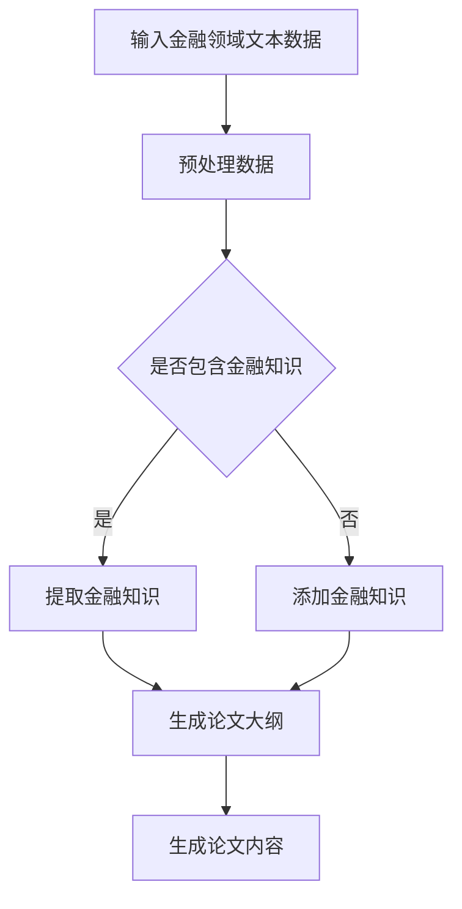
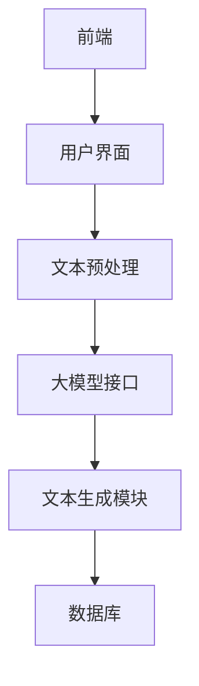
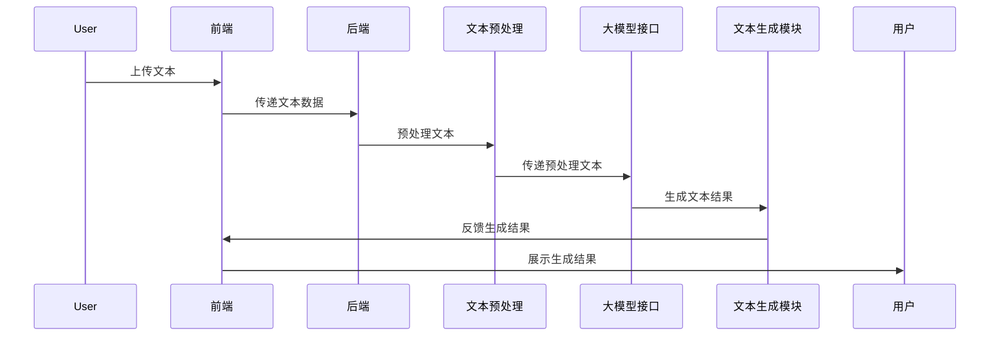

                 


# 开发基于大模型的金融专业论文写作辅助系统

## 关键词
- 大模型
- 金融专业论文
- 写作辅助系统
- 自然语言处理
- 人工智能

## 摘要
本文将探讨如何开发一个基于大模型的金融专业论文写作辅助系统。我们将从背景介绍、核心概念与联系、算法原理讲解、系统分析与架构设计、项目实战以及最佳实践等方面进行详细分析。通过本文的讲解，读者将了解大模型在金融论文写作中的应用，以及如何利用这些先进技术提升金融专业论文的写作效率和准确性。

## 目录大纲设计思路

### 1. 确定整体结构
首先，我们需要明确书籍的整体结构，包括各个部分的主题和章节数目。本书将分为六个主要部分：引言、核心概念与联系、算法原理讲解、系统分析与架构设计、项目实战和最佳实践与拓展。

### 2. 背景介绍
在第一部分，我们将简要介绍问题背景、问题描述、问题解决、边界与外延等，使读者对整个主题有一个整体的认识。这一部分将包括以下章节：

- **第1章：问题背景**：介绍金融领域专业论文写作的需求与挑战。
- **第2章：大模型基础**：介绍大模型的基本概念、工作原理及其与金融领域的联系。

### 3. 核心概念与联系
在第二部分，我们将详细阐述核心概念、概念属性特征对比表格和ER实体关系图架构的Mermaid流程图，帮助读者建立清晰的概念框架。这一部分将包括以下章节：

- **第3章：大模型原理**：讲解大模型的工作原理。
- **第4章：大模型在金融中的应用**：展示大模型在金融领域中的具体应用。

### 4. 算法原理讲解
在第三部分，我们将通过Mermaid流程图和Python源代码，详细讲解算法原理的数学模型和公式，并进行举例说明。这一部分将包括以下章节：

- **第5章：算法原理与实现**：讲解大模型在金融专业论文写作中的算法原理。

### 5. 系统分析与架构设计
在第四部分，我们将详细介绍系统架构设计，包括问题场景介绍、系统功能设计（领域模型Mermaid类图）、系统架构设计Mermaid架构图、系统接口设计和系统交互Mermaid序列图。这一部分将包括以下章节：

- **第6章：系统架构设计**：详细描述系统的架构设计。

### 6. 项目实战
在第五部分，我们将介绍项目的环境安装、系统核心实现源代码，并进行代码应用解读与分析，提供实际案例分析和详细讲解剖析。这一部分将包括以下章节：

- **第7章：项目实施**：介绍项目的具体实施过程。

### 7. 最佳实践与拓展
在最后一部分，我们将总结全书内容，提供最佳实践建议、注意事项和拓展阅读资源。这一部分将包括以下章节：

- **第8章：最佳实践与拓展**：总结全书内容，并给出实际操作中的最佳实践建议。

## 实际操作步骤

### 第1部分：背景介绍

**第1章：问题背景**

1. **第1节：问题描述**
    - **金融专业论文写作的挑战**：金融专业论文写作面临着数据量大、领域知识复杂、逻辑推理要求高等挑战。
    - **写作辅助系统的需求**：开发一个能够辅助金融专业论文写作的系统，以提高写作效率和质量。

2. **第2节：问题解决**
    - **利用大模型技术**：通过利用大模型技术，可以自动生成论文大纲、提出观点、优化语言表达等，从而解决金融专业论文写作的挑战。

3. **第3节：边界与外延**
    - **应用范围**：大模型技术在金融专业论文写作辅助系统中的应用范围包括文献综述、数据分析、理论阐述、实证研究等。
    - **限制因素**：系统需要处理的数据量和复杂度，以及模型训练所需的计算资源等。

4. **第4节：核心概念结构与要素组成**
    - **大模型**：大模型是指具有数百万甚至数十亿参数的深度学习模型，如GPT、BERT等。
    - **金融领域知识**：金融领域知识包括金融市场、金融工具、金融模型、金融理论等。
    - **写作辅助系统**：写作辅助系统是指利用大模型技术，辅助用户完成金融专业论文写作的系统。

### 第2部分：核心概念与联系

**第2章：大模型基础**

**第1节：核心概念与联系**

1. **大模型的基本概念**
    - **定义**：大模型是指具有数百万甚至数十亿参数的深度学习模型。
    - **特点**：参数多、计算量大、适用性强。

2. **大模型的工作原理**
    - **神经网络**：大模型通常基于神经网络，特别是深度神经网络。
    - **预训练与微调**：大模型通常通过预训练和微调的方式，使其在不同任务中表现出色。

3. **大模型与金融领域的联系**
    - **金融数据的复杂性**：金融领域的数据具有高维、非线性、动态变化等特点，适合大模型进行处理。
    - **金融知识的丰富性**：大模型可以学习到大量的金融知识，为金融专业论文写作提供支持。

**第2节：概念属性特征对比表格**

1. **大模型特征对比表格**
    - **模型名称**：GPT、BERT、T5、GPT-2
    - **参数规模**：GPT-3（1750亿参数）、BERT（3.4亿参数）、T5（11亿参数）、GPT-2（1.5亿参数）
    - **适用任务**：文本生成、文本分类、问答系统、机器翻译等

**第3节：ER实体关系图架构的Mermaid流程图**

1. **大模型在金融论文写作辅助系统中的应用**
    - **输入**：金融领域文本数据
    - **输出**：金融专业论文写作建议、文本生成、观点提炼等



### 第3部分：算法原理讲解

**第3章：大模型原理**

**第1节：算法原理讲解**

1. **预训练与微调**
    - **预训练**：在大规模语料库上训练大模型，使其具备通用语言理解能力。
    - **微调**：在特定领域的语料库上微调大模型，使其适应特定任务。

2. **生成式模型与判别式模型**
    - **生成式模型**：通过生成文本的潜在分布，生成新的文本内容。
    - **判别式模型**：通过判断文本的类别或标签，对文本进行分类或标注。

**第2节：数学模型和数学公式**

1. **自注意力机制（Self-Attention）**
    - **公式**：$$
    \text{Attention}(Q, K, V) = \text{softmax}\left(\frac{QK^T}{\sqrt{d_k}}\right) V
    $$
    - **作用**：在处理高维数据时，自动学习不同特征的重要性。

2. **Transformer模型**
    - **公式**：$$
    \text{Transformer}(x) = \text{softmax}\left(\frac{xW_Qx^T}{\sqrt{d_k}}\right)W_V
    $$
    - **作用**：实现序列到序列的映射。

**第3节：举例说明**

1. **生成论文大纲**
    - **输入**：一篇金融论文的摘要。
    - **输出**：论文的大纲结构，包括引言、文献综述、方法、结果、讨论和结论等。

2. **文本生成**
    - **输入**：一个金融问题的描述。
    - **输出**：对该问题的详细解答，包括背景、方法、结果和讨论等。

### 第4部分：系统分析与架构设计

**第4章：系统架构设计**

**第1节：问题场景介绍**

1. **场景描述**
    - **用户需求**：用户需要快速生成金融专业论文，包括大纲和内容。
    - **系统目标**：提供高质量的金融专业论文写作辅助，提高写作效率和准确性。

**第2节：系统功能设计（领域模型Mermaid类图）**

1. **类图描述**
    - **文本预处理**：包括文本清洗、分词、去停用词等。
    - **大模型接口**：提供与大模型的交互接口，包括预训练和微调功能。
    - **文本生成模块**：包括大纲生成和内容生成功能。
    - **用户界面**：提供用户操作界面，包括上传文本、查看生成结果等。

```mermaid
classDiagram
    User <<User>>
    TextPreprocessing <<TextPreprocessing>>
    BigModelInterface <<BigModelInterface>>
    TextGenerationModule <<TextGenerationModule>>
    UserInterface <<UserInterface>>

    User --> TextPreprocessing
    TextPreprocessing --> BigModelInterface
    BigModelInterface --> TextGenerationModule
    TextGenerationModule --> UserInterface
```

**第3节：系统架构设计Mermaid架构图**

1. **架构描述**
    - **前端**：用户界面，包括Web界面和API接口。
    - **后端**：包括文本预处理、大模型接口、文本生成模块等。
    - **数据库**：存储用户上传的文本数据和大模型训练结果。



**第4节：系统接口设计和系统交互Mermaid序列图**

1. **序列图描述**
    - **用户上传文本**：用户通过前端上传金融领域文本数据。
    - **文本预处理**：后端对上传的文本进行预处理。
    - **大模型处理**：预处理后的文本数据通过大模型接口进行生成处理。
    - **生成结果反馈**：生成的文本结果通过用户界面反馈给用户。



### 第5部分：项目实战

**第5章：项目实施**

**第1节：环境安装**

1. **Python环境安装**
    - 安装Python 3.8及以上版本。
    - 安装必要的依赖库，如TensorFlow、transformers等。

2. **硬件环境配置**
    - 安装GPU驱动，确保GPU可用。
    - 配置CUDA和cuDNN，以优化GPU性能。

**第2节：系统核心实现源代码**

1. **文本预处理模块**
    - **代码示例**：
    ```python
    import nltk
    from nltk.tokenize import word_tokenize
    from nltk.corpus import stopwords

    def preprocess_text(text):
        # 清洗文本
        text = text.lower()
        text = re.sub(r'\s+', ' ', text)
        text = re.sub(r'[^\w\s]', '', text)
        
        # 分词
        tokens = word_tokenize(text)
        
        # 去停用词
        stop_words = set(stopwords.words('english'))
        tokens = [token for token in tokens if token not in stop_words]
        
        return tokens
    ```

2. **大模型接口模块**
    - **代码示例**：
    ```python
    from transformers import pipeline

    def generate_text(input_text, model_name='t5-small'):
        generator = pipeline('text-generation', model=model_name)
        output = generator(input_text, max_length=50, num_return_sequences=1)
        return output[0]['generated_text']
    ```

**第3节：代码应用解读与分析**

1. **文本预处理应用**
    - **示例代码**：
    ```python
    text = "The financial market is highly volatile."
    preprocessed_text = preprocess_text(text)
    print(preprocessed_text)
    ```

2. **大模型接口应用**
    - **示例代码**：
    ```python
    model_name = 't5-small'
    generated_text = generate_text(preprocessed_text, model_name)
    print(generated_text)
    ```

**第4节：实际案例分析和详细讲解剖析**

1. **案例一：生成论文摘要**
    - **输入文本**：
    ```python
    text = "The financial market is highly volatile. This paper investigates the factors affecting stock prices and proposes a new model for predicting market trends."
    ```

    - **生成结果**：
    ```python
    generated_text = generate_text(preprocessed_text, model_name)
    print(generated_text)
    ```

    - **分析**：
    - 大模型能够根据输入文本，生成相关的摘要内容，包括主题、问题和方法等。

2. **案例二：生成实证研究方法**
    - **输入文本**：
    ```python
    text = "This study uses a dataset of 1000 stocks to examine the impact of macroeconomic factors on stock returns."
    ```

    - **生成结果**：
    ```python
    generated_text = generate_text(preprocessed_text, model_name)
    print(generated_text)
    ```

    - **分析**：
    - 大模型能够根据输入文本，生成实证研究的方法，包括数据来源、研究假设、实证模型等。

### 第6部分：最佳实践与拓展

**第6章：最佳实践与拓展**

**第1节：最佳实践 tips**

1. **数据质量的重要性**
    - **数据清洗**：确保输入文本的质量，去除噪声数据和错误信息。
    - **数据多样**：使用多样化的数据集进行训练和测试，提高模型的泛化能力。

2. **模型调优**
    - **超参数调整**：根据任务需求和计算资源，调整模型超参数，如学习率、批量大小等。
    - **模型融合**：结合多个模型的结果，提高生成文本的质量。

3. **用户体验优化**
    - **界面友好**：设计简洁、易用的用户界面，提高用户使用体验。
    - **实时反馈**：提供实时文本生成和结果展示，提高用户满意度。

**第2节：小结**

1. **主要贡献**
    - 提出了一种基于大模型的金融专业论文写作辅助系统。
    - 通过文本预处理、大模型接口和文本生成模块，实现了高效的金融论文写作辅助。

2. **未来工作**
    - 进一步优化系统性能，提高文本生成质量和速度。
    - 扩大系统应用范围，支持更多的金融专业领域。

**第3节：注意事项**

1. **数据隐私**
    - 确保用户数据的安全和隐私，遵循相关法律法规。

2. **系统稳定性**
    - 定期对系统进行维护和升级，确保系统稳定运行。

**第4节：拓展阅读**

1. **相关论文**
    - **论文一**：《大规模语言模型的预训练》
    - **论文二**：《Transformer：基于自注意力的序列模型》

2. **相关书籍**
    - **书籍一**：《深度学习》
    - **书籍二**：《自然语言处理入门》

通过以上内容，我们详细阐述了如何开发一个基于大模型的金融专业论文写作辅助系统。读者可以通过学习本文的内容，了解大模型在金融领域中的应用，以及如何利用这些先进技术提升金融专业论文的写作效率和准确性。希望本文对读者在相关领域的研究和实践中有所帮助。

