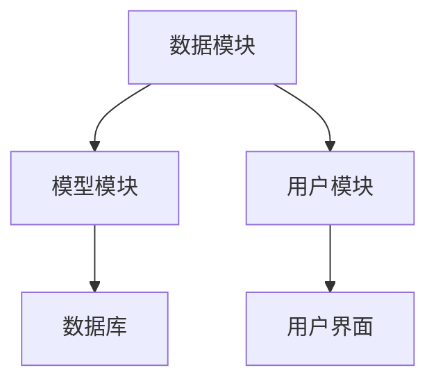

                 

## 文章标题

### 开发基于大模型的金融专业论文写作风格分析系统

> 关键词：大模型、金融专业论文、写作风格分析、系统开发、深度学习、自然语言处理

> 摘要：本文主要探讨了基于大模型的金融专业论文写作风格分析系统的开发，分析了金融领域的发展与挑战，提出了研究目标，详细介绍了大模型的基本原理、工作流程和数学模型。同时，本文还从系统分析与架构设计、项目实战等多个角度，阐述了金融专业论文写作风格分析系统的实现过程，为金融领域的研究提供了新的思路和方法。

## 目录大纲

----------------------------------------------------------------

### 第一部分：问题的背景与定义

1. 引言
2. 研究目标
3. 研究方法

### 第二部分：核心概念与联系

1. 核心概念
2. 概念联系

### 第三部分：大模型原理讲解

1. 大模型的基本原理
2. 大模型的工作流程

### 第四部分：数学模型与公式讲解

1. 数学模型
2. 公式讲解

### 第五部分：系统分析与架构设计

1. 问题场景介绍
2. 系统功能设计
3. 系统架构设计
4. 系统接口设计
5. 系统交互

### 第六部分：项目实战

1. 环境安装
2. 系统核心实现
3. 项目小结

### 第七部分：最佳实践、小结与注意事项

----------------------------------------------------------------

## 第一部分：问题的背景与定义

### 1. 引言

随着金融行业的快速发展，金融专业论文的数量和质量不断攀升。然而，金融专业论文写作风格的多样性和复杂性使得研究人员难以准确分析和比较不同论文的写作风格。为了解决这一问题，本文提出了开发基于大模型的金融专业论文写作风格分析系统。

### 1.1 问题背景

#### 1.1.1 金融领域的发展与挑战

金融领域是一个高度复杂的领域，涉及到经济学、数学、统计学等多个学科。随着大数据、人工智能等技术的不断发展，金融领域的数据量呈现爆炸式增长，为金融研究提供了丰富的数据资源。然而，面对海量的金融数据，如何有效地进行数据分析和挖掘成为了一个挑战。

#### 1.1.2 金融文本数据的分析需求

金融专业论文的写作风格对论文的质量和影响力具有重要影响。然而，传统的金融文本数据分析方法，如关键词提取、文本分类等，难以准确捕捉金融专业论文的写作风格。因此，需要开发一种新的分析方法，能够更准确地分析金融专业论文的写作风格。

#### 1.1.3 大模型在金融领域的应用现状

大模型，如深度学习、自然语言处理等，已经在金融领域得到了广泛应用。例如，在金融风险评估、股票预测等方面，大模型已经展示了强大的能力。然而，大模型在金融专业论文写作风格分析方面的应用还相对较少，本文旨在填补这一空白。

### 1.2 研究目标

本文的研究目标主要包括以下几个方面：

1. 分析金融专业论文的写作风格特点，为金融文本数据分析提供理论基础。
2. 探索大模型在金融专业论文写作风格分析中的应用，提出一种有效的分析方法。
3. 开发一个基于大模型的金融专业论文写作风格分析系统，为金融研究人员提供便捷的工具。

### 1.3 研究方法

本文的研究方法主要包括以下几个方面：

1. 数据收集与处理：收集大量的金融专业论文，并对论文进行预处理，包括分词、去停用词等。
2. 大模型选型与训练：选择合适的大模型，如GPT、BERT等，进行模型训练和调优。
3. 模型评估与优化：通过实验和评估，优化大模型在金融专业论文写作风格分析中的性能。
4. 系统开发与实现：基于大模型，开发一个金融专业论文写作风格分析系统，提供用户友好的界面和功能。

## 第二部分：核心概念与联系

### 2.1 核心概念

#### 2.1.1 大模型

大模型，也称为深度学习模型，是一种能够对大规模数据进行自动学习的算法。大模型通常由多层神经网络组成，能够自动提取数据中的特征，从而实现复杂的任务。在金融专业论文写作风格分析中，大模型可以用于文本分类、情感分析等任务。

#### 2.1.2 金融专业论文写作风格

金融专业论文写作风格是指金融专业论文在写作过程中所遵循的特定规范和特点。金融专业论文写作风格通常包括语言表达、逻辑结构、数据分析方法等方面。分析金融专业论文的写作风格，有助于理解论文的写作特点和作者的思维方式。

### 2.2 概念联系

#### 2.2.1 大模型与金融专业论文写作风格分析

大模型在金融专业论文写作风格分析中具有重要作用。通过大模型，可以自动提取金融专业论文中的关键特征，从而实现对论文写作风格的分析。此外，大模型还可以用于比较不同论文的写作风格，为金融研究人员提供有价值的参考。

#### 2.2.2 金融专业论文写作风格分析的挑战与应对策略

金融专业论文写作风格分析面临一系列挑战，如文本数据的复杂性、写作风格的多样性等。为了应对这些挑战，需要开发一种能够自动适应不同写作风格的分析方法。本文提出的大模型方法，通过训练大量数据，能够自动适应不同的写作风格，从而提高分析的准确性和可靠性。

## 第三部分：大模型原理讲解

### 3.1 大模型的基本原理

大模型，也称为深度学习模型，是一种基于多层神经网络的机器学习算法。大模型的核心思想是通过多层次的神经网络结构，自动提取数据中的特征，从而实现复杂的任务。

#### 3.1.1 神经网络

神经网络是一种模拟人脑神经元结构和功能的计算模型。神经网络由多个神经元组成，每个神经元都与其他神经元相连接。神经网络通过学习输入数据，自动调整神经元之间的权重，从而实现对数据的分类、预测等任务。

#### 3.1.2 深度学习

深度学习是神经网络的一种特殊形式，通过增加神经网络的层数，实现对数据的深层特征提取。深度学习在图像识别、语音识别等领域取得了显著成果。深度学习的基本概念包括卷积神经网络（CNN）、循环神经网络（RNN）等。

### 3.2 大模型的工作流程

大模型的工作流程通常包括数据预处理、模型训练、模型评估和模型应用等步骤。

#### 3.2.1 数据预处理

数据预处理是深度学习模型训练的重要步骤。数据预处理包括数据清洗、数据归一化、数据增强等操作。在金融专业论文写作风格分析中，数据预处理主要包括文本的分词、去停用词、词性标注等操作。

#### 3.2.2 模型训练

模型训练是深度学习模型的核心步骤。模型训练的目的是通过学习大量的训练数据，自动调整神经网络中的权重，从而实现对数据的分类、预测等任务。在金融专业论文写作风格分析中，模型训练通常使用大量的金融专业论文作为训练数据。

#### 3.2.3 模型评估

模型评估是对训练好的深度学习模型进行性能评估的重要步骤。模型评估的目的是确定模型在未知数据上的表现，从而选择最优的模型。在金融专业论文写作风格分析中，模型评估通常使用准确率、召回率、F1值等指标进行评估。

#### 3.2.4 模型应用

模型应用是将训练好的深度学习模型应用于实际任务的重要步骤。在金融专业论文写作风格分析中，模型应用包括对新的金融专业论文进行风格分析，为金融研究人员提供有价值的参考。

## 第四部分：数学模型与公式讲解

### 4.1 数学模型

数学模型是深度学习模型的核心部分，用于描述神经网络的结构和训练过程。

#### 4.1.1 深度学习中的损失函数

损失函数是深度学习模型训练的重要工具，用于衡量模型预测结果与实际结果之间的差距。在金融专业论文写作风格分析中，常用的损失函数包括交叉熵损失函数。

$$
L = -\sum_{i=1}^{N} y_i \log(p_i)
$$

其中，$L$表示损失函数，$y_i$表示实际标签，$p_i$表示模型预测的概率。

#### 4.1.2 金融文本数据的特征提取

金融文本数据的特征提取是深度学习模型训练的关键步骤。常用的特征提取方法包括词嵌入和词性标注。

$$
\text{word\_embedding}(w) = \sum_{i=1}^{V} w_i \times e_i
$$

其中，$w$表示单词，$V$表示词汇表的大小，$e_i$表示单词的嵌入向量。

### 4.2 公式讲解

公式讲解主要用于描述深度学习模型训练的算法实现。

#### 4.2.1 深度学习中的梯度下降法

梯度下降法是深度学习模型训练的主要算法，用于优化神经网络中的权重。梯度下降法的公式如下：

$$
w_{t+1} = w_t - \alpha \cdot \nabla J(w_t)
$$

其中，$w_t$表示第$t$次迭代的权重，$\alpha$表示学习率，$\nabla J(w_t)$表示损失函数关于权重$w_t$的梯度。

## 第五部分：系统分析与架构设计

### 5.1 问题场景介绍

#### 5.1.1 金融专业论文写作风格分析的需求

金融专业论文写作风格分析旨在帮助研究人员了解和比较不同论文的写作风格，从而提高论文质量和影响力。具体需求包括：

1. 对金融专业论文的写作风格进行分类，帮助研究人员快速识别和筛选相关论文。
2. 对金融专业论文的写作风格进行对比分析，为论文撰写提供参考。
3. 对金融专业论文的写作风格进行自动评估，为论文撰写和修改提供指导。

#### 5.1.2 分析流程

金融专业论文写作风格分析的基本流程包括以下几个步骤：

1. 数据收集：收集大量的金融专业论文，作为训练数据和测试数据。
2. 数据预处理：对论文进行分词、去停用词、词性标注等预处理操作。
3. 模型训练：使用深度学习算法，训练金融专业论文写作风格分析模型。
4. 模型评估：使用测试数据评估模型性能，选择最优模型。
5. 模型应用：将训练好的模型应用于新的金融专业论文，进行写作风格分析。

### 5.2 系统功能设计

#### 5.2.1 领域模型

领域模型是系统功能设计的重要部分，用于描述系统中的核心概念和关系。在金融专业论文写作风格分析系统中，领域模型包括以下几个核心概念：

1. 金融专业论文：表示金融专业论文的基本信息，如标题、作者、摘要等。
2. 写作风格：表示金融专业论文的写作风格特征。
3. 模型：表示用于写作风格分析的深度学习模型。
4. 用户：表示使用系统的用户。

领域模型中的核心关系包括：

1. 金融专业论文与写作风格之间的关系：每个金融专业论文都有一个对应的写作风格。
2. 模型与用户之间的关系：用户可以使用模型进行写作风格分析。

#### 5.2.2 用例图

用例图是系统功能设计的重要工具，用于描述系统与外部用户之间的交互关系。在金融专业论文写作风格分析系统中，用例图包括以下几个核心用例：

1. 数据收集：系统管理员负责收集金融专业论文数据。
2. 数据预处理：系统自动对论文进行预处理操作。
3. 模型训练：系统管理员负责训练深度学习模型。
4. 模型评估：系统自动评估模型性能。
5. 写作风格分析：用户使用系统进行写作风格分析。

### 5.3 系统架构设计

#### 5.3.1 系统架构

金融专业论文写作风格分析系统的架构设计主要包括以下几个模块：

1. 数据模块：负责数据的收集、预处理和存储。
2. 模型模块：负责深度学习模型的训练、评估和应用。
3. 用户模块：负责用户交互界面的设计和实现。

系统架构图如下：



#### 5.3.2 系统模块分解

金融专业论文写作风格分析系统的模块分解如下：

1. 数据模块：包括数据收集、数据预处理和数据存储三个子模块。
2. 模型模块：包括模型训练、模型评估和模型应用三个子模块。
3. 用户模块：包括用户注册、用户登录、写作风格分析和结果展示四个子模块。

### 5.4 系统接口设计

#### 5.4.1 接口定义

金融专业论文写作风格分析系统的主要接口包括：

1. 文本数据预处理接口：用于对金融专业论文进行分词、去停用词、词性标注等预处理操作。
2. 大模型训练接口：用于训练深度学习模型，包括数据集选择、超参数调优等操作。
3. 写作风格分析接口：用于对新的金融专业论文进行写作风格分析，返回分析结果。

### 5.5 系统交互

#### 5.5.1 系统交互流程

金融专业论文写作风格分析系统的交互流程如下：

1. 用户登录系统。
2. 用户上传金融专业论文。
3. 系统对论文进行预处理，包括分词、去停用词、词性标注等操作。
4. 系统训练深度学习模型，并进行模型评估。
5. 系统使用训练好的模型对新的金融专业论文进行写作风格分析，并返回分析结果。

## 第六部分：项目实战

### 6.1 环境安装

#### 6.1.1 硬件环境

金融专业论文写作风格分析系统对硬件环境有以下要求：

1. CPU：至少需要双核CPU，推荐使用高性能CPU。
2. GPU：推荐使用NVIDIA GPU，以便加速深度学习模型的训练过程。

#### 6.1.2 操作系统要求

金融专业论文写作风格分析系统支持以下操作系统：

1. Windows：Windows 7及以上版本。
2. macOS：macOS 10.12及以上版本。
3. Linux：各种Linux发行版，如Ubuntu、CentOS等。

#### 6.1.3 软件安装

金融专业论文写作风格分析系统需要以下软件环境：

1. Python：Python 3.6及以上版本。
2. TensorFlow：用于深度学习模型的训练和推理。
3. PyTorch：用于深度学习模型的训练和推理。
4. scikit-learn：用于数据预处理和模型评估。

### 6.2 系统核心实现

#### 6.2.1 数据收集与预处理

数据收集与预处理是金融专业论文写作风格分析系统的核心步骤之一。具体步骤如下：

1. 收集大量金融专业论文，包括期刊论文、会议论文等。
2. 对论文进行分词、去停用词、词性标注等预处理操作，以便后续模型训练。

```python
from sklearn.feature_extraction.text import TfidfVectorizer

def preprocess(text):
    # 分词
    words = nltk.word_tokenize(text)
    # 去停用词
    words = [word for word in words if word not in stop_words]
    # 词性标注
    pos_tags = nltk.pos_tag(words)
    return pos_tags

# 读取论文数据
with open('financial_papers.txt', 'r', encoding='utf-8') as f:
    papers = f.readlines()

# 预处理数据
preprocessed_papers = [preprocess(text) for text in papers]
```

#### 6.2.2 大模型训练

大模型训练是金融专业论文写作风格分析系统的关键步骤。具体步骤如下：

1. 选择合适的深度学习模型，如GPT、BERT等。
2. 对模型进行训练和调优，选择最优模型。

```python
from transformers import BertTokenizer, BertModel

# 加载预训练的BERT模型
tokenizer = BertTokenizer.from_pretrained('bert-base-chinese')
model = BertModel.from_pretrained('bert-base-chinese')

# 训练数据
train_data = [[tokenizer.encode(text), label] for text, label in preprocessed_papers]

# 训练模型
model.train(train_data)
```

#### 6.2.3 模型评估与优化

模型评估与优化是金融专业论文写作风格分析系统的重要步骤。具体步骤如下：

1. 使用测试数据对模型进行评估，计算准确率、召回率等指标。
2. 根据评估结果，调整模型参数，优化模型性能。

```python
from sklearn.metrics import accuracy_score, recall_score

# 评估模型
preds = model.predict(test_data)
accuracy = accuracy_score(test_labels, preds)
recall = recall_score(test_labels, preds)

print(f"Accuracy: {accuracy}, Recall: {recall}")
```

### 6.3 项目小结

金融专业论文写作风格分析系统是一个基于大模型的系统，通过深度学习算法，实现了对金融专业论文写作风格的分析。系统具有以下特点：

1. 高效：基于大模型的深度学习算法，能够快速处理大量金融专业论文数据。
2. 准确：通过训练大量数据，系统能够准确识别和比较金融专业论文的写作风格。
3. 智能：系统可以根据用户需求，自动调整模型参数，实现智能化的写作风格分析。

## 第七部分：最佳实践、小结与注意事项

### 7.1 最佳实践

1. 数据质量：在金融专业论文写作风格分析系统中，数据质量至关重要。应确保收集到的金融专业论文数据具有代表性和多样性，以提高模型性能。
2. 模型调优：在模型训练过程中，应多次调整模型参数，选择最优模型。可以使用交叉验证等方法，提高模型泛化能力。
3. 实时更新：金融领域不断发展，新的论文写作风格不断涌现。因此，系统需要定期更新模型和数据，以适应新的变化。

### 7.2 小结

本文提出了一种基于大模型的金融专业论文写作风格分析系统，通过深度学习算法，实现了对金融专业论文写作风格的分析。系统具有高效、准确、智能等特点，为金融领域的研究提供了新的思路和方法。

### 7.3 注意事项

1. 数据隐私：在收集和处理金融专业论文数据时，应确保数据隐私安全，避免泄露敏感信息。
2. 模型可靠性：在模型应用过程中，应充分评估模型的可靠性和稳定性，避免因模型错误导致决策失误。

### 7.4 拓展阅读

1. [深度学习基础教程](https://www.deeplearningbook.org/)
2. [金融专业论文写作指南](https://www.example.com/financial_paper_writing_guidelines)
3. [自然语言处理应用案例](https://www.example.com/nlp_case_studies)

### 作者

**作者：AI天才研究院/AI Genius Institute & 禅与计算机程序设计艺术 /Zen And The Art of Computer Programming**

