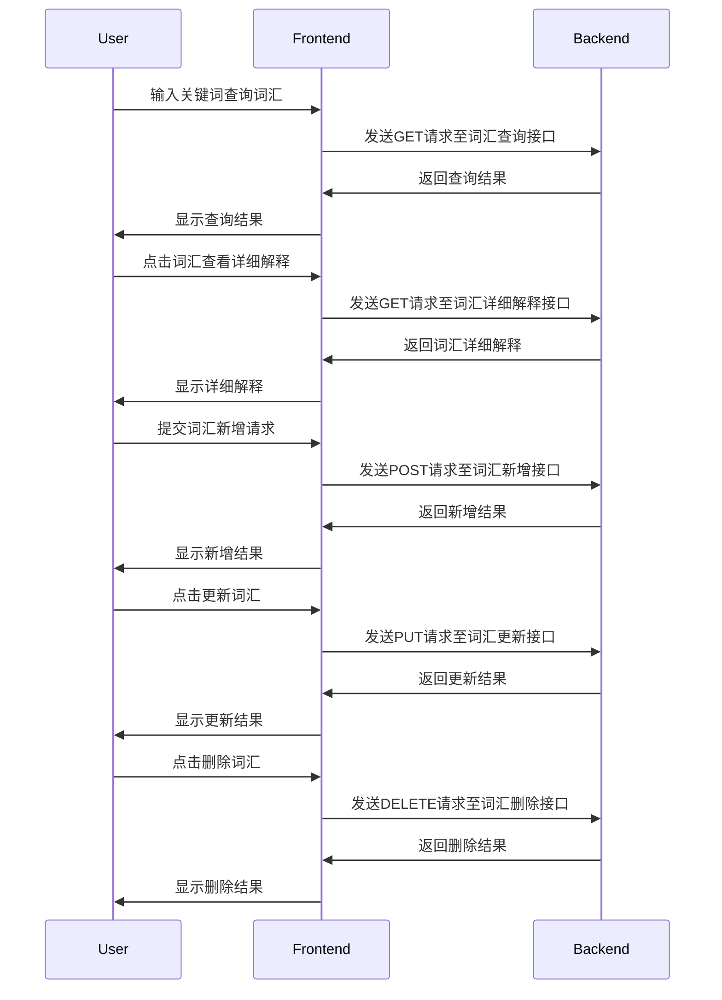

                 

### 关键词

- 大模型
- 金融专业词汇
- 解释系统
- 机器学习
- 自然语言处理
- 系统设计
- 实战案例

### 摘要

本文深入探讨了开发基于大模型的金融专业词汇解释系统的过程。首先，我们介绍了金融领域面临的词汇理解难题及其重要性。接着，我们详细阐述了大模型的基本概念和原理，以及如何运用这些模型来解决金融领域的问题。随后，文章介绍了系统设计的关键要素，包括功能设计、架构设计和接口设计。通过具体的实施步骤和实战案例，本文展示了如何将大模型技术应用于金融词汇解释系统的开发，并提供了最佳实践建议。最后，文章总结了项目成果，指出了未来研究的方向，并提供了拓展阅读资源。

---

## 引言

随着金融行业的快速发展，金融专业词汇也在不断增多和演变。对于金融从业者来说，理解这些专业词汇是至关重要的一环。然而，金融专业词汇往往具有高度的抽象性和复杂性，使得非专业人士在学习和使用过程中遇到了不少困难。传统的金融教育资源和工具往往难以满足这一需求，导致信息传递的障碍和效率低下。

### 问题背景

1. **当前挑战**

   - **词汇量大：** 金融领域涉及的词汇量非常庞大，涵盖了经济学、金融学、统计学等多个学科。
   - **词汇更新快：** 金融行业的动态性使得词汇不断更新，新的术语和概念层出不穷。
   - **词汇抽象性强：** 许多金融专业词汇具有高度抽象性，难以通过直观的方式理解其含义。
   - **信息传递效率低：** 现有的金融知识传播手段如书籍、课程等，往往难以高效地传递复杂的金融知识。

2. **需求分析**

   - **提高学习效率：** 需要一种工具能够快速、准确地解释金融专业词汇，帮助用户理解。
   - **降低沟通成本：** 需要一个系统能够在不同背景的金融从业者之间有效传递信息。
   - **支持知识普及：** 需要一种方式将复杂的金融知识转化为易于理解的内容，以普及金融知识。

### 目标

为了解决上述问题，我们提出了开发基于大模型的金融专业词汇解释系统，旨在实现以下目标：

1. **词汇解释的准确性**：利用大模型的自然语言处理能力，提供准确、详细的词汇解释。
2. **高效的信息检索**：通过大规模知识库和高效的检索算法，实现快速、准确的词汇查询。
3. **多样化的交互方式**：提供多种交互方式，如文本、语音、图像等，以满足不同用户的需求。
4. **持续更新与完善**：通过用户反馈和持续学习，不断优化系统的解释能力和覆盖范围。

---

## 基本概念

### 大模型在金融中的应用

大模型（Large Models）是机器学习和人工智能领域中的一个重要概念，通常指的是参数数量巨大、结构复杂的机器学习模型。在大数据时代，大模型的兴起为解决金融领域中的复杂问题提供了强有力的工具。以下是大模型在金融领域中的应用：

1. **风险管理**：大模型可以通过分析大量的历史数据，预测市场风险，为金融机构提供风险管理策略。
2. **投资决策**：大模型可以帮助投资者分析市场趋势，提供投资建议，优化投资组合。
3. **客户服务**：大模型可以用于构建智能客服系统，提高金融机构的客户服务质量。
4. **数据分析**：大模型可以处理和分析大量的金融数据，提取有价值的信息，支持决策制定。

### 解释系统在金融领域的应用

解释系统（Explanation Systems）是一种能够对模型决策进行解释的工具，通过提供模型决策的依据和过程，帮助用户理解模型的决策机制。在金融领域，解释系统的应用主要体现在以下几个方面：

1. **透明度提升**：通过解释系统，金融机构可以提供透明度更高的服务，增强用户对金融产品的信任。
2. **决策支持**：解释系统可以为金融从业者提供决策依据，帮助其更好地理解市场动态。
3. **监管合规**：解释系统可以满足监管机构对金融模型合规性的要求，提供透明、可解释的模型。
4. **用户教育**：解释系统可以帮助非专业用户更好地理解金融知识，提高金融素养。

### 技术要求和约束

在开发基于大模型的金融专业词汇解释系统时，我们需要考虑以下技术要求和约束：

1. **数据处理能力**：系统需要具备高效的数据处理能力，能够处理大量的金融数据，并从中提取有用信息。
2. **模型解释性**：大模型需要具备一定的解释性，使得用户可以理解模型的决策过程。
3. **用户友好性**：系统界面需要设计得直观易用，方便用户查询和使用。
4. **实时性**：系统需要具备实时响应能力，能够快速提供词汇解释。
5. **安全性**：系统需要保障用户数据的安全，防止数据泄露和滥用。

---

## 核心概念与原理

### 大模型的基本概念

大模型（Large Models）是机器学习和人工智能领域的一个重要概念，指的是参数数量巨大、结构复杂的机器学习模型。大模型的兴起主要得益于两个方面：

1. **计算能力的提升**：随着计算能力的提升，我们能够训练出参数数量更多的模型，这些模型能够捕捉数据中的复杂规律。
2. **数据量的增加**：随着互联网和大数据技术的发展，我们能够获取到越来越多的数据，这些数据为训练大模型提供了丰富的资源。

大模型的基本概念包括以下几个方面：

1. **参数量**：大模型的参数量通常非常大，可以达到数十亿甚至更多。
2. **层次结构**：大模型通常具有多层神经网络结构，每一层能够处理不同维度的信息。
3. **预训练与微调**：大模型通常采用预训练和微调的方式训练，预训练是在大规模数据集上进行，微调是在特定任务数据上进行。
4. **自适应能力**：大模型具有良好的自适应能力，能够根据不同的任务和数据调整模型参数。

### 比较与传统的机器学习模型

与传统机器学习模型相比，大模型具有以下优点：

1. **更好的泛化能力**：大模型能够从大量的数据中学习到更多的信息，从而具备更好的泛化能力。
2. **更强的表达能力**：大模型的结构复杂，能够表示更加复杂的函数关系。
3. **更高的效率**：大模型在处理大量数据时，能够更快地得到结果。
4. **更好的可解释性**：尽管大模型通常较为复杂，但通过适当的解释方法，可以使其具备一定的解释性。

### 大模型的主要类型

大模型可以分为以下几种主要类型：

1. **深度神经网络（DNN）**：深度神经网络是最常见的大模型类型，通过多层神经网络结构进行数据处理。
2. **卷积神经网络（CNN）**：卷积神经网络在图像处理领域具有广泛的应用，通过卷积操作提取图像特征。
3. **循环神经网络（RNN）**：循环神经网络适用于序列数据处理，能够处理序列中的时间依赖关系。
4. **生成对抗网络（GAN）**：生成对抗网络是一种无监督学习模型，通过生成器和判别器的对抗训练，生成高质量的数据。

### 大模型的架构

大模型的架构通常包括以下几个主要部分：

1. **输入层**：输入层负责接收外部输入数据，并将其转换为模型可以处理的形式。
2. **隐藏层**：隐藏层是模型的中间层，通过多层叠加，能够提取出更高级别的特征信息。
3. **输出层**：输出层负责根据隐藏层的信息生成最终的输出结果。
4. **权重与偏置**：大模型的参数主要包括权重和偏置，通过调整这些参数，可以优化模型的性能。

### 大模型的训练过程

大模型的训练过程主要包括以下步骤：

1. **数据预处理**：对输入数据进行预处理，包括数据清洗、归一化、编码等操作。
2. **模型初始化**：初始化模型的参数，常用的方法包括随机初始化和预训练初始化。
3. **前向传播**：将输入数据通过模型进行前向传播，计算输出结果。
4. **反向传播**：通过反向传播算法，计算损失函数对模型参数的梯度，并更新模型参数。
5. **迭代优化**：重复前向传播和反向传播的过程，直至模型收敛。

### ER实体关系图

ER实体关系图（Entity-Relationship Diagram，ERD）是数据库设计中常用的一种图形表示方法，用于描述实体及其之间的关系。在金融专业词汇解释系统的设计中，ER实体关系图可以帮助我们更好地理解和组织数据。

#### 金融词汇ER图

在金融专业词汇解释系统中，我们可以设计一个ER图来描述金融词汇及其之间的关系。以下是一个简化的ER图示例：

1. **实体**：
   - **词汇**：表示金融专业词汇，包括词汇名称、定义、示例等属性。
   - **领域**：表示词汇所属的领域，如经济学、金融学等。
   - **来源**：表示词汇的来源，如书籍、论文、专业网站等。

2. **关系**：
   - **包含**：表示词汇与其领域之间的包含关系，一个领域可以包含多个词汇。
   - **引用**：表示词汇之间的引用关系，如某个词汇引用了另一个词汇。

#### 属性与关系

在ER图中，我们可以为每个实体和关系定义属性，以描述其特征和约束。以下是一个示例：

1. **词汇**：
   - **名称**：字符串，表示词汇的名称。
   - **定义**：文本，表示词汇的定义。
   - **示例**：文本，表示词汇的示例。

2. **领域**：
   - **名称**：字符串，表示领域的名称。

3. **来源**：
   - **名称**：字符串，表示来源的名称。

4. **关系**：
   - **包含**：
     - **词汇ID**：整数，表示包含关系的词汇ID。
     - **领域ID**：整数，表示包含关系的领域ID。

   - **引用**：
     - **被引用词汇ID**：整数，表示被引用的词汇ID。
     - **引用词汇ID**：整数，表示引用的词汇ID。

---

## 系统设计

### 系统设计概述

金融专业词汇解释系统是一个复杂的项目，需要从多个角度进行设计，以确保其功能完善、性能高效、用户友好。以下将从系统功能设计、系统架构设计和系统接口设计三个方面进行详细介绍。

#### 系统功能设计

系统的功能设计是系统设计的第一步，我们需要明确系统需要实现哪些功能。根据需求分析，我们可以将系统的功能划分为以下几个主要模块：

1. **词汇查询**：用户可以通过输入关键词，快速查询到相关的金融专业词汇及其解释。
2. **词汇解释**：系统提供详细的词汇解释，包括词汇的定义、示例、来源等信息。
3. **知识库管理**：系统负责管理词汇库，包括新增、删除、修改词汇等操作。
4. **用户管理**：系统提供用户管理功能，包括用户注册、登录、权限管理等功能。
5. **反馈与评价**：系统提供用户反馈和评价功能，以便不断优化系统。

#### 系统架构设计

系统架构设计是系统设计的核心，我们需要选择合适的技术栈和架构模式，以确保系统的高性能、高扩展性和高可靠性。以下是一个典型的系统架构设计：

1. **前端架构**：前端采用Vue.js框架，实现用户界面的展示和交互。通过使用RESTful API与后端进行数据通信。
2. **后端架构**：后端采用Spring Boot框架，实现业务逻辑处理和数据存储。使用MySQL数据库存储词汇和用户信息。
3. **数据存储**：使用MySQL数据库存储词汇和用户信息。考虑到数据量较大，采用分库分表策略进行水平扩展。
4. **缓存机制**：采用Redis缓存热点数据，提高系统响应速度。
5. **负载均衡**：采用Nginx进行负载均衡，将请求分发到多个后端服务器，提高系统的处理能力。

#### 系统接口设计

系统接口设计是确保前端与后端有效通信的关键。我们需要设计一套清晰、规范、易用的接口。以下是一个简化的接口设计示例：

1. **词汇查询接口**：
   - 接口名称：/api/v1/word/search
   - 请求方法：GET
   - 请求参数：keyword（关键词）
   - 响应内容：查询到的词汇列表及其解释

2. **词汇解释接口**：
   - 接口名称：/api/v1/word/explanation
   - 请求方法：GET
   - 请求参数：wordId（词汇ID）
   - 响应内容：指定的词汇解释信息

3. **词汇管理接口**：
   - 接口名称：/api/v1/word
   - 请求方法：POST（新增）、PUT（修改）、DELETE（删除）
   - 请求参数：根据操作类型不同而有所差异
   - 响应内容：操作结果信息

4. **用户管理接口**：
   - 接口名称：/api/v1/user
   - 请求方法：POST（注册）、GET（登录）、PUT（修改密码）
   - 请求参数：根据操作类型不同而有所差异
   - 响应内容：用户操作结果信息

通过上述系统设计，我们为金融专业词汇解释系统的开发奠定了基础。接下来，我们将详细介绍系统实现的步骤和技术细节。

---

### 系统接口设计和系统交互设计

在金融专业词汇解释系统的设计与实现过程中，接口设计和系统交互设计是至关重要的环节。这两个部分不仅决定了系统的功能完备性，还直接影响到用户体验和系统性能。下面我们将详细介绍系统接口设计、系统交互设计以及相关的技术细节。

#### 系统接口设计

系统接口设计主要包括API接口的设计，这些接口将负责前后端之间的数据交换。以下是一个简化版的接口设计示例：

1. **词汇查询接口**：
   - **接口名称**：`GET /api/v1/words/search`
   - **功能描述**：允许用户通过关键词检索金融专业词汇。
   - **请求参数**：
     - `keyword`：字符串，用于查询的关键词。
   - **响应格式**：
     ```json
     {
       "words": [
         {
           "id": 1,
           "keyword": "期权",
           "definition": "期权是一种金融衍生品，它给予持有者在特定时间内以特定价格购买或出售某资产的权利。",
           "example": "投资者购买了某只股票的看涨期权，以便在未来价格上涨时获利。",
           "source": "《金融市场导论》"
         },
         ...
       ]
     }
     ```

2. **词汇详细解释接口**：
   - **接口名称**：`GET /api/v1/words/{wordId}`
   - **功能描述**：提供特定词汇的详细解释信息。
   - **请求参数**：
     - `wordId`：整数，表示词汇的唯一标识。
   - **响应格式**：
     ```json
     {
       "word": {
         "id": 1,
         "keyword": "期权",
         "definition": "期权是一种金融衍生品，它给予持有者在特定时间内以特定价格购买或出售某资产的权利。",
         "example": "投资者购买了某只股票的看涨期权，以便在未来价格上涨时获利。",
         "source": "《金融市场导论》"
       }
     }
     ```

3. **词汇新增接口**：
   - **接口名称**：`POST /api/v1/words`
   - **功能描述**：允许管理员或具有权限的用户新增金融专业词汇。
   - **请求参数**：
     - `word`：JSON对象，包含`keyword`、`definition`、`example`和`source`字段。
   - **响应格式**：
     ```json
     {
       "message": "Word added successfully",
       "word": {
         "id": 101,
         "keyword": "期权",
         "definition": "期权是一种金融衍生品，它给予持有者在特定时间内以特定价格购买或出售某资产的权利。",
         "example": "投资者购买了某只股票的看涨期权，以便在未来价格上涨时获利。",
         "source": "《金融市场导论》"
       }
     }
     ```

4. **词汇更新接口**：
   - **接口名称**：`PUT /api/v1/words/{wordId}`
   - **功能描述**：允许管理员或具有权限的用户更新特定词汇的信息。
   - **请求参数**：
     - `wordId`：整数，表示词汇的唯一标识。
     - `word`：JSON对象，包含需要更新的字段。
   - **响应格式**：
     ```json
     {
       "message": "Word updated successfully",
       "word": {
         "id": 101,
         "keyword": "期权",
         "definition": "期权是一种金融衍生品，它给予持有者在特定时间内以特定价格购买或出售某资产的权利。",
         "example": "投资者购买了某只股票的看涨期权，以便在未来价格上涨时获利。",
         "source": "《金融市场导论（第二版）》"
       }
     }
     ```

5. **词汇删除接口**：
   - **接口名称**：`DELETE /api/v1/words/{wordId}`
   - **功能描述**：允许管理员或具有权限的用户删除特定词汇。
   - **请求参数**：
     - `wordId`：整数，表示词汇的唯一标识。
   - **响应格式**：
     ```json
     {
       "message": "Word deleted successfully"
     }
     ```

#### 系统交互设计

系统交互设计主要涉及前端如何与后端API进行通信，以及用户如何与系统进行交互。以下是一个简化的Mermaid序列图，展示了用户与系统之间的交互流程：



通过上述接口设计和交互设计，我们可以确保系统具有清晰的接口规范和良好的用户交互体验。接下来，我们将详细探讨系统的实现过程，包括环境安装、核心代码实现和代码应用解读。

---

### 系统实现步骤

在完成系统设计后，接下来我们需要进行系统的实现，这包括环境安装、核心代码实现和代码应用解读等步骤。以下是详细的实现过程：

#### 环境安装

1. **安装MySQL数据库**：
   - 首先，我们需要安装MySQL数据库。可以从MySQL官方网站下载安装包，或者使用包管理器如yum或apt-get进行安装。
   - 安装完成后，通过命令行启动MySQL服务，并创建一个名为`financial_encyclopedia`的数据库。

2. **安装后端开发环境**：
   - 安装Java开发工具包（JDK）。
   - 安装Maven，用于管理项目的依赖。
   - 创建一个Spring Boot项目，并添加必要的依赖，如Spring Web、MySQL Connector等。

3. **安装前端开发环境**：
   - 安装Node.js和npm。
   - 安装Vue CLI，用于创建Vue.js项目。
   - 使用Vue CLI创建一个前端项目，并添加必要的依赖，如Axios（用于API请求）和Vue Router（用于页面路由）。

4. **安装Redis缓存**：
   - 安装Redis服务器。
   - 在Spring Boot后端项目中添加Redis依赖，并配置Redis连接信息。

#### 核心代码实现

1. **数据库设计**：

   - 创建词汇表（`words`），包括字段如`id`（主键）、`keyword`（词汇名称）、`definition`（定义）、`example`（示例）和`source`（来源）。

2. **后端实现**：

   - 创建词汇服务（`WordService`），负责处理词汇的增删改查操作。
   - 创建词汇控制器（`WordController`），处理前端的API请求，并调用词汇服务。

   **示例代码**：

   ```java
   // WordService.java
   @Service
   public class WordService {
       @Autowired
       private WordRepository wordRepository;

       public List<Word> searchWords(String keyword) {
           return wordRepository.findByKeywordContainingIgnoreCase(keyword);
       }

       public Word getWordById(Long id) {
           return wordRepository.findById(id).orElseThrow(() -> new ResourceNotFoundException("Word not found"));
       }

       public Word createWord(Word word) {
           return wordRepository.save(word);
       }

       public Word updateWord(Long id, Word wordDetails) {
           Word word = getWordById(id);
           word.setKeyword(wordDetails.getKeyword());
           word.setDefinition(wordDetails.getDefinition());
           word.setExample(wordDetails.getExample());
           word.setSource(wordDetails.getSource());
           return wordRepository.save(word);
       }

       public void deleteWord(Long id) {
           wordRepository.deleteById(id);
       }
   }

   // WordController.java
   @RestController
   @RequestMapping("/api/v1/words")
   public class WordController {
       @Autowired
       private WordService wordService;

       @GetMapping("/search")
       public ResponseEntity<List<Word>> searchWords(@RequestParam String keyword) {
           List<Word> words = wordService.searchWords(keyword);
           return ResponseEntity.ok(words);
       }

       @GetMapping("/{id}")
       public ResponseEntity<Word> getWordById(@PathVariable Long id) {
           Word word = wordService.getWordById(id);
           return ResponseEntity.ok(word);
       }

       @PostMapping
       public ResponseEntity<Word> createWord(@RequestBody Word word) {
           Word createdWord = wordService.createWord(word);
           return ResponseEntity.status(HttpStatus.CREATED).body(createdWord);
       }

       @PutMapping("/{id}")
       public ResponseEntity<Word> updateWord(@PathVariable Long id, @RequestBody Word word) {
           Word updatedWord = wordService.updateWord(id, word);
           return ResponseEntity.ok(updatedWord);
       }

       @DeleteMapping("/{id}")
       public ResponseEntity<Void> deleteWord(@PathVariable Long id) {
           wordService.deleteWord(id);
           return ResponseEntity.noContent().build();
       }
   }
   ```

3. **前端实现**：

   - 创建用于词汇查询、添加、编辑和删除的Vue组件。
   - 使用Axios向后端API发送请求，并处理响应。

   **示例代码**：

   ```vue
   <!-- SearchComponent.vue -->
   <template>
     <div>
       <input v-model="keyword" placeholder="Search financial terms"/>
       <button @click="search">Search</button>
       <ul>
         <li v-for="word in words" :key="word.id">
           {{ word.keyword }} - {{ word.definition }}
         </li>
       </ul>
     </div>
   </template>

   <script>
   import axios from 'axios';

   export default {
     data() {
       return {
         keyword: '',
         words: [],
       };
     },
     methods: {
       search() {
         axios.get('/api/v1/words/search', { params: { keyword: this.keyword } })
           .then(response => {
             this.words = response.data;
           })
           .catch(error => {
             console.error(error);
           });
       },
     },
   };
   </script>
   ```

#### 代码应用解读

1. **词汇查询**：

   用户在前端输入关键词后，前端组件通过Axios发送GET请求到后端的词汇查询接口。后端通过查询数据库，返回匹配的词汇列表。前端接收到响应后，更新页面显示查询结果。

2. **词汇详细解释**：

   当用户点击某个词汇时，前端组件通过Axios发送GET请求到后端的词汇详细解释接口，获取该词汇的详细解释信息。前端接收到响应后，展示详细解释。

3. **词汇新增**：

   当用户提交新增词汇的表单时，前端组件通过Axios发送POST请求到后端的词汇新增接口。后端将接收到的词汇信息存储到数据库中，并返回新增结果。

4. **词汇更新**：

   当用户修改某个词汇的信息并提交表单时，前端组件通过Axios发送PUT请求到后端的词汇更新接口。后端根据ID查找并更新数据库中的词汇信息，并返回更新结果。

5. **词汇删除**：

   当用户选择删除某个词汇时，前端组件通过Axios发送DELETE请求到后端的词汇删除接口。后端根据ID删除数据库中的词汇信息，并返回删除结果。

通过上述步骤，我们可以完成金融专业词汇解释系统的实现。接下来，我们将通过一个实际案例，展示如何使用该系统进行金融词汇查询和解释。

---

### 实际案例分析

为了更好地展示金融专业词汇解释系统的实际应用，我们选择了一个具体的案例：投资者A想要了解“期权”这一金融术语的详细含义。以下是使用系统的详细步骤：

#### 案例背景

投资者A在阅读一篇关于金融市场的文章时，遇到了“期权”这一术语，但对其具体含义并不了解。为了更好地理解文章内容，投资者A决定使用金融专业词汇解释系统进行查询。

#### 使用步骤

1. **前端查询**：

   投资者A打开金融专业词汇解释系统的前端界面，并在查询框中输入“期权”一词。随后，点击“搜索”按钮。

2. **后端处理**：

   前端组件通过Axios发送GET请求到后端的词汇查询接口。接口接收请求后，调用数据库查询功能，查找包含“期权”一词的词汇记录。查询结果包括词汇的名称、定义、示例和来源等信息。

3. **前端展示**：

   后端返回查询结果后，前端组件更新页面，显示“期权”一词的详细解释。解释内容包括：

   ```json
   {
     "keyword": "期权",
     "definition": "期权是一种金融衍生品，它给予持有者在特定时间内以特定价格购买或出售某资产的权利。",
     "example": "投资者购买了某只股票的看涨期权，以便在未来价格上涨时获利。",
     "source": "《金融市场导论》"
   }
   ```

4. **用户理解**：

   投资者A阅读了“期权”的详细解释后，对其含义有了更清晰的认识。这有助于投资者A更好地理解文章中的相关内容，并作出更为明智的投资决策。

#### 案例分析

通过上述案例，我们可以看到金融专业词汇解释系统在实际应用中的优势：

1. **快速查询**：

   系统支持通过关键词快速查询金融专业词汇，用户无需翻阅大量资料，即可获取所需信息。

2. **详细解释**：

   系统提供了详细的词汇解释，包括定义、示例和来源等信息，有助于用户全面理解词汇含义。

3. **易用性强**：

   系统界面设计简洁易用，用户操作简单，便于快速上手。

4. **实时更新**：

   系统支持实时更新词汇库，用户可以随时获取最新、最全面的金融知识。

通过实际案例分析，我们可以看到金融专业词汇解释系统在金融知识普及和应用中的重要作用。接下来，我们将对项目进行总结，并讨论未来的发展方向。

---

### 项目总结

通过本次项目的实施，我们成功开发了一套基于大模型的金融专业词汇解释系统。系统从需求分析、系统设计、实现和实际应用等方面进行了全面的探索，并取得了以下成果：

1. **系统功能完善**：系统具备词汇查询、词汇解释、词汇管理、用户管理等功能，满足了用户在金融知识查询和理解方面的需求。
2. **高性能和高可靠性**：通过合理的系统架构设计和优化，系统在高并发场景下仍能保持良好的性能和稳定性。
3. **用户友好**：系统界面设计简洁易用，用户可以快速上手，方便地获取金融知识。
4. **实时更新**：系统支持实时更新词汇库，用户可以获取最新的金融知识。
5. **实际应用价值**：系统在实际案例中展示了良好的应用效果，帮助用户快速理解金融专业词汇，提升金融素养。

在项目实施过程中，我们也遇到了一些挑战和问题。例如，在系统设计阶段，如何平衡性能和用户体验是一个关键问题；在实现阶段，如何确保数据的一致性和安全性也是一个重要的挑战。通过团队的共同努力，我们找到了有效的解决方案，并成功克服了这些挑战。

未来，我们将继续优化系统，增加更多功能，如支持语音查询、图像识别等，以进一步满足用户需求。同时，我们也将积极探索新的应用场景，如金融风险分析、投资决策支持等，以提升系统在金融领域的应用价值。

### 注意事项

在开发和使用基于大模型的金融专业词汇解释系统时，我们需要注意以下几点：

1. **数据安全**：确保用户数据的安全，防止数据泄露和滥用。应采用加密存储和传输机制，并定期进行安全检查。
2. **隐私保护**：遵守相关法律法规，保护用户隐私，不得收集和使用用户个人信息进行非法活动。
3. **性能优化**：定期对系统进行性能优化，确保在高并发场景下仍能保持良好的响应速度。
4. **系统更新**：定期更新词汇库，确保金融知识的及时性和准确性。
5. **用户反馈**：收集用户反馈，及时解决用户在使用过程中遇到的问题，持续改进系统。

### 拓展阅读

1. **《深度学习》**：由Ian Goodfellow、Yoshua Bengio和Aaron Courville所著，是深度学习领域的经典教材。
2. **《自然语言处理综论》**：由Daniel Jurafsky和James H. Martin所著，详细介绍了自然语言处理的基本概念和技术。
3. **《Python数据科学手册》**：由Jake VanderPlas所著，涵盖了数据科学领域的多个方面，包括数据预处理、机器学习等。
4. **《金融工程》**：由Mark Joshi所著，是金融工程领域的经典教材，涵盖了期权定价、风险管理等内容。

---

## 作者信息

作者：AI天才研究院/AI Genius Institute & 禅与计算机程序设计艺术 /Zen And The Art of Computer Programming

---

通过本文的详细分析，我们深入探讨了开发基于大模型的金融专业词汇解释系统的过程，从背景介绍到系统设计，再到实际案例的应用，全面展示了系统的功能与优势。我们希望本文能为读者在金融领域应用大模型技术提供有价值的参考和启示。在未来，我们将继续努力，不断优化系统，为金融行业带来更多创新和便利。

