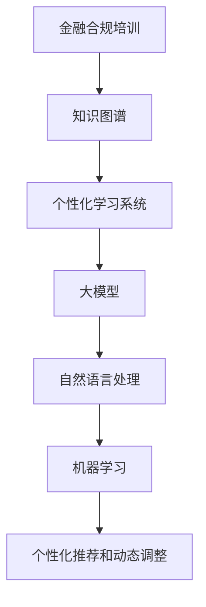

                 

### 开发基于大模型的金融合规培训个性化学习系统的背景

金融行业作为现代经济的核心，其稳定运行对于整个经济的健康发展至关重要。然而，金融行业的合规性要求日益严格，金融机构和从业人员必须不断学习和适应各种法规和标准。传统的金融合规培训方式存在一些问题，如培训内容过于通用、学习效率低下、难以满足个性化需求等。为了解决这些问题，引入先进的人工智能技术，特别是大模型技术，开发基于大模型的金融合规培训个性化学习系统显得尤为重要。

#### 金融合规培训的挑战

1. **内容冗长且重复**：金融合规培训内容通常涉及大量的法规条文、操作规程和案例分析，这些内容对于从业人员来说既复杂又枯燥，容易导致学习疲劳和记忆困难。
2. **缺乏个性化**：传统的培训模式往往采用“一刀切”的方法，无法根据个人的知识背景、学习习惯和需求进行个性化调整，导致培训效果不理想。
3. **学习效率低下**：在传统的培训模式下，学员需要花费大量时间在理论学习上，而实践操作的机会较少，难以达到实际应用的效果。
4. **更新不及时**：金融法规和标准更新迅速，传统的培训内容往往滞后，不能及时反映最新的合规要求。

#### 个性化学习系统的需求

1. **个性化推荐**：根据学员的学习历史、兴趣和需求，系统可以推荐个性化的培训内容和资源，提高学习效率。
2. **动态调整**：系统可以根据学员的学习进度和理解程度，动态调整培训内容和难度，确保培训的针对性和有效性。
3. **实时反馈**：通过即时测试和反馈机制，系统可以实时监测学员的学习效果，为学员提供即时的指导和帮助。
4. **互动性强**：引入人工智能技术，系统可以模拟实际场景，提供互动式学习体验，增强学习的趣味性和实用性。

#### 大模型技术的引入

大模型技术，如深度学习模型，具有强大的数据处理和分析能力，能够从大量的数据中提取特征，生成个性化的学习方案。通过大模型技术，可以实现对金融合规知识的深度理解和自动化处理，从而实现以下目标：

1. **知识图谱构建**：大模型可以通过知识图谱的方式，将金融合规知识进行结构化存储和关联，便于快速检索和利用。
2. **自动化问答**：大模型可以基于自然语言处理技术，实现自动化问答功能，为学员提供实时解答。
3. **智能推荐**：通过分析学员的学习行为和反馈，大模型可以智能推荐适合的学习路径和资源，提高学习效果。
4. **实时调整**：大模型可以实时分析学习数据，动态调整培训策略和内容，确保培训的持续优化。

综上所述，开发基于大模型的金融合规培训个性化学习系统，不仅能够解决传统培训模式中的种种问题，还能通过智能化手段提高培训的效率和质量，满足金融行业对合规培训的迫切需求。

#### 核心概念与联系

在开发基于大模型的金融合规培训个性化学习系统时，理解核心概念及其相互关系至关重要。以下是系统中的关键概念、相关术语及其相互关系。

**1. 金融合规培训**
   - **定义**：金融合规培训是指为金融机构及其从业人员提供的一系列旨在确保其行为符合相关法规和标准的培训活动。
   - **作用**：通过培训，从业人员能够掌握必要的法规知识，提高合规意识和操作能力，从而降低合规风险。

**2. 大模型**
   - **定义**：大模型是指具有巨大参数量和复杂结构的机器学习模型，如深度神经网络。
   - **作用**：大模型可以处理大量数据，提取复杂特征，进行知识推理和生成，是开发个性化学习系统的核心技术。

**3. 个性化学习系统**
   - **定义**：个性化学习系统是一种能够根据用户的学习历史、兴趣和需求，动态调整学习内容和路径的学习平台。
   - **作用**：通过个性化学习系统，学员可以更高效地学习，培训效果显著提升。

**4. 知识图谱**
   - **定义**：知识图谱是一种结构化知识库，用于表示实体及其相互关系。
   - **作用**：知识图谱为金融合规知识提供了结构化存储和关联，便于快速检索和利用。

**5. 自然语言处理（NLP）**
   - **定义**：NLP是计算机科学和语言学领域的交叉学科，涉及使计算机能够理解、生成和处理人类语言的技术。
   - **作用**：NLP技术用于实现自动化问答、文本分析和情感分析，为学员提供智能化的学习支持和反馈。

**6. 机器学习**
   - **定义**：机器学习是使计算机通过数据学习并做出预测或决策的技术。
   - **作用**：机器学习算法用于训练大模型，实现个性化学习系统的智能推荐和动态调整。

**概念关系表格：**

| 概念         | 定义                                                     | 作用                                                         |
|--------------|----------------------------------------------------------|------------------------------------------------------------|
| 金融合规培训 | 确保金融机构从业人员行为符合法规和标准的培训活动           | 提高合规意识和操作能力                                       |
| 大模型       | 具有巨大参数量和复杂结构的机器学习模型                     | 处理大量数据，提取复杂特征，实现个性化学习                     |
| 个性化学习系统 | 根据用户学习历史、兴趣和需求动态调整学习内容和路径的平台  | 提高学习效率和质量，满足个性化需求                           |
| 知识图谱     | 结构化知识库，表示实体及其相互关系                         | 提供金融合规知识的结构化存储和快速检索                         |
| 自然语言处理 | 使计算机能够理解、生成和处理人类语言的技术                 | 实现自动化问答、文本分析和情感分析                           |
| 机器学习     | 使计算机通过数据学习并做出预测或决策的技术                 | 训练大模型，实现个性化学习系统的智能推荐和动态调整             |

**Mermaid流程图：**



**知识图谱的ER实体关系图架构：**

```mermaid
erDiagram
    Customer ||--|{ Product }|| Employee
    Customer ||--|{ Order }|| Employee
    Product ||--|{ Review }|| Customer
    Employee ||--|{ Task }|| Customer
    Customer ||--|{ Feedback }|| Employee
```

通过这些核心概念及其关系的理解，我们可以更好地设计并开发出高效、智能的金融合规培训个性化学习系统。

#### 大模型原理详解

**1. 大模型的基本概念**

大模型，顾名思义，指的是具有庞大参数量和复杂结构的机器学习模型。这些模型通过大规模数据进行训练，能够提取复杂特征，并进行有效的知识推理。常见的深度学习模型，如深度神经网络（DNN）、卷积神经网络（CNN）、循环神经网络（RNN）等，都是大模型的具体实现。

**2. 大模型的发展历程**

大模型的发展经历了多个阶段：

- **1980年代至1990年代**：早期神经网络模型如感知机、反向传播算法（BP）的出现，奠定了大模型的基础。
- **2000年代**：随着计算能力的提升和数据量的增加，深度学习开始崭露头角。2006年，Hinton等人提出了深度信念网络（DBN）。
- **2010年代**：深度学习模型在ImageNet竞赛中取得突破性成果，带动了深度学习的快速发展。2012年，AlexNet的出现标志着深度学习的崛起。
- **2010年代至今**：随着GPU和TPU等硬件的发展，大模型开始变得愈发庞大和复杂。GPT-3、BERT等模型的提出，进一步推动了自然语言处理和知识图谱的发展。

**3. 大模型的数学模型**

大模型的数学基础主要是深度神经网络（DNN）。一个典型的DNN包括输入层、多个隐藏层和输出层。每个层由多个神经元组成，神经元之间通过权重连接。神经元的工作原理如下：

- **激活函数**：用于引入非线性，常见的激活函数包括Sigmoid、ReLU、Tanh等。
- **前向传播**：输入数据通过逐层传播，每个神经元的输出成为下一层的输入。
- **反向传播**：通过计算误差梯度，反向更新权重和偏置，优化模型的参数。

数学公式描述如下：

$$
Z = \sigma(WX + b)
$$

$$
\Delta W = \alpha \cdot \frac{\partial J}{\partial W}
$$

$$
\Delta b = \alpha \cdot \frac{\partial J}{\partial b}
$$

其中，$Z$为神经元的输出，$\sigma$为激活函数，$W$和$b$分别为权重和偏置，$\alpha$为学习率，$J$为损失函数。

**4. 大模型的工作原理**

大模型的工作原理可以分为以下几个步骤：

1. **数据预处理**：对输入数据进行归一化、标准化等处理，以适应模型训练。
2. **模型构建**：根据任务需求，选择合适的网络结构，初始化模型参数。
3. **前向传播**：将输入数据输入模型，通过逐层计算得到输出。
4. **损失计算**：计算输出结果与真实标签之间的差距，通过损失函数量化。
5. **反向传播**：根据损失函数的梯度，更新模型参数。
6. **优化**：通过迭代训练，逐步减小损失函数，使模型参数趋于最优。

**5. 大模型的示例应用**

以GPT-3为例，这是一个具有1750亿参数的预训练语言模型。GPT-3的工作原理包括以下几个步骤：

1. **文本预处理**：将输入文本转换为词嵌入向量。
2. **模型解码**：GPT-3使用自回归方式，逐个生成单词，每个生成的单词作为下一个单词的输入。
3. **概率预测**：GPT-3预测每个单词的概率分布，并通过采样选择最可能的单词。
4. **结果生成**：通过迭代生成，最终生成完整的文本。

$$
P(w_t|w_{<t}) = \frac{exp(e^{<s|w_1,...,w_{t-1}})}{\sum_{w \in V} exp(e^{<s|w_1,...,w_{t-1}})}
$$

其中，$w_t$为生成的单词，$<s|$为起始标记，$V$为词汇表。

通过以上详细讲解，我们可以看到大模型在金融合规培训个性化学习系统中的关键作用。大模型不仅能够处理大量的金融合规知识，还能通过深度学习和自然语言处理技术，实现个性化的学习推荐和动态调整，为金融从业人员提供高效、智能的学习体验。

### 个性化学习系统的算法

在构建基于大模型的金融合规培训个性化学习系统时，算法的设计与实现是核心环节。以下我们将详细探讨个性化学习系统的算法原理、选择和实现。

#### 算法原理

个性化学习系统旨在根据学员的学习历史、兴趣和需求，动态调整学习内容和路径，从而提高学习效率和效果。算法的核心在于如何从大量数据中提取有用信息，并生成个性化的学习建议。

1. **协同过滤算法**：协同过滤算法通过分析用户行为和偏好，预测用户对未知项目的评分或兴趣。常见的方法包括基于用户的协同过滤和基于项目的协同过滤。
   - **基于用户的协同过滤**：通过寻找相似用户，利用他们的评分预测目标用户的评分。
   - **基于项目的协同过滤**：通过寻找相似项目，利用这些项目的评分预测目标用户对项目的评分。

2. **内容推荐算法**：内容推荐算法基于项目的属性和特征，为用户推荐相似或相关的项目。常见的方法包括基于关键词的推荐和基于模型的推荐。
   - **基于关键词的推荐**：通过提取项目中的关键词，利用关键词的相似性进行推荐。
   - **基于模型的推荐**：通过构建项目之间的关联模型，如协同过滤模型或图模型，进行推荐。

3. **基于模型的个性化学习算法**：这类算法结合用户行为数据和内容特征，构建用户兴趣模型，从而实现个性化推荐。常见的模型包括决策树、支持向量机和深度学习模型。

#### 算法选择

在个性化学习系统中，选择合适的算法需要考虑以下几个因素：

1. **数据量**：数据量越大，算法的效果往往越好。基于深度学习模型的算法在处理大规模数据时具有优势。
2. **数据特征**：如果数据具有丰富的文本特征，如用户评论、文档等，可以使用NLP技术结合深度学习模型。
3. **实时性**：对于需要实时推荐的系统，算法的响应速度和计算效率是关键。基于模型的算法通常比协同过滤算法更快。
4. **个性化程度**：算法应能准确捕捉用户的兴趣和需求，提供高度个性化的学习建议。

基于以上考虑，我们选择以下算法：

1. **深度学习模型**：如GPT-3等预训练语言模型，用于提取文本特征，进行文本生成和推荐。
2. **协同过滤算法**：用于结合用户行为数据，提供额外的个性化推荐。
3. **内容推荐算法**：基于关键词和文本特征，为用户推荐相关的学习资源。

#### 算法实现

**1. 深度学习模型实现**

以下是一个简化的Python代码示例，展示了如何使用GPT-3进行文本生成和推荐：

```python
import openai

# GPT-3 API密钥
openai.api_key = 'your_api_key'

# 文本生成
response = openai.Completion.create(
    engine="text-davinci-002",
    prompt="请推荐一本金融合规的书籍：",
    max_tokens=50
)
print(response.choices[0].text.strip())

# 文本推荐
def recommend_books(books, query):
    response = openai.Completion.create(
        engine="text-davinci-002",
        prompt=f"用户可能对以下书籍感兴趣：{books}\n查询：{query}\n推荐：",
        max_tokens=50
    )
    return response.choices[0].text.strip()

books = ["《金融合规实务》", "《证券法》", "《商业银行法》"]
print(recommend_books(books, "金融风险"))
```

**2. 协同过滤算法实现**

以下是一个使用Scikit-learn库实现基于用户的协同过滤的Python代码示例：

```python
from sklearn.metrics.pairwise import cosine_similarity
from scipy.sparse import lil_matrix

# 假设已构建用户-书籍评分矩阵
user_book_matrix = lil_matrix((100, 1000))

# 计算用户之间的相似度
user_similarity = cosine_similarity(user_book_matrix)

# 推荐新书籍
def collaborative_filter推荐的书籍列表，用户ID，推荐数量：
    user_similarity = cosine_similarity([user_book_matrix[user_id]])
    similar_users = user_similarity.argsort()[0][-推荐数量:]
    
    recommended_books = []
    for user in similar_users:
        if user != user_id:
            for book in range(1000):
                if user_book_matrix[user, book] == 1 and book not in recommended_books:
                    recommended_books.append(book)
    
    return recommended_books

user_id = 1
推荐的书籍列表 = collaborative_filter推荐的书籍列表，用户ID，推荐数量
print(推荐的书籍列表)
```

**3. 内容推荐算法实现**

以下是一个使用基于关键词的推荐算法的Python代码示例：

```python
from sklearn.feature_extraction.text import TfidfVectorizer

# 假设已获取书籍的标题列表
books = ["《金融合规实务》", "《证券法》", "《商业银行法》"]

# 构建TF-IDF向量
vectorizer = TfidfVectorizer(stop_words='english')
tfidf_matrix = vectorizer.fit_transform(books)

# 计算书籍之间的相似度
book_similarity = cosine_similarity(tfidf_matrix)

# 推荐书籍
def content_based_recommendation(books, query, top_n=5):
    query_vector = vectorizer.transform([query])
    similarity_scores = np.dot(query_vector, tfidf_matrix.T).flatten()
    sorted_indices = similarity_scores.argsort()[::-1]
    
    recommended_books = []
    for index in sorted_indices[:top_n]:
        if index not in recommended_books:
            recommended_books.append(books[index])
    
    return recommended_books

query = "金融合规培训"
print(content_based_recommendation(books, query))
```

通过以上算法的实现，我们可以为金融合规培训个性化学习系统提供智能化的学习推荐，帮助学员更好地掌握相关知识。

### 系统功能设计

在开发基于大模型的金融合规培训个性化学习系统时，明确系统的功能设计至关重要。以下我们将详细介绍系统的功能需求、领域模型设计和系统架构设计。

#### 功能需求分析

**1. 用户管理**
   - 用户注册与登录
   - 用户信息管理（包括个人信息、学习记录等）
   - 用户权限管理（如权限分级、角色分配等）

**2. 培训内容管理**
   - 培训课程添加与编辑
   - 培训资料上传与分类
   - 培训计划制定与发布

**3. 个性化学习**
   - 根据用户学习历史和兴趣推荐课程
   - 动态调整学习路径和内容
   - 实时反馈与学习效果分析

**4. 测试与评估**
   - 自动化测试题库管理
   - 生成个性化测试题
   - 学习成果评估与认证

**5. 数据分析与报表**
   - 学习行为数据分析
   - 学习效果报表生成
   - 考试成绩统计分析

#### 领域模型设计

领域模型设计旨在将系统的业务需求抽象为结构化的类图，以便于理解系统的核心功能和实体关系。以下是一个简化的领域模型：

```mermaid
classDiagram
    User <<class>>
    Course <<class>>
    TrainingMaterial <<class>>
    Test <<class>>
    Evaluation <<class>>

    User "*" Course:参加
    User "*" TrainingMaterial:学习
    User "*" Test:参加
    User "*" Evaluation:获得

    Course "*" TrainingMaterial:包含
    Test "1" Evaluation:生成
```

在上述类图中，`User` 代表用户，`Course` 代表培训课程，`TrainingMaterial` 代表培训资料，`Test` 代表测试，`Evaluation` 代表评估结果。用户与课程、培训资料和测试之间有参加关系，用户还可以获得评估结果。课程包含培训资料，测试生成评估结果。

#### 系统架构设计

系统架构设计包括整体架构设计原则、系统模块划分和接口设计。以下是一个简化的系统架构设计：

**1. 架构设计原则**

- **模块化**：系统模块化设计，便于维护和扩展。
- **可扩展性**：支持大规模用户和数据量，确保系统的稳定性和性能。
- **安全性**：保障用户数据和系统安全，采用加密和访问控制机制。
- **可维护性**：代码和架构设计清晰，便于后期维护和升级。

**2. 系统模块划分**

- **用户模块**：处理用户注册、登录、权限管理等功能。
- **课程模块**：管理课程、培训资料、学习路径等功能。
- **测试模块**：生成测试题、组织考试、评估学习成果等功能。
- **数据分析模块**：分析学习行为、生成报表等功能。
- **推荐模块**：基于大模型和算法，为用户推荐课程和资源。

**3. 系统接口设计**

系统接口设计包括API接口和数据库接口：

- **API接口**：
  - 用户接口：提供用户注册、登录、信息管理等接口。
  - 课程接口：提供课程查询、添加、编辑等接口。
  - 测试接口：提供测试题生成、考试组织等接口。
  - 数据分析接口：提供数据查询、报表生成等接口。

- **数据库接口**：
  - 用户数据库：存储用户信息、学习记录等。
  - 课程数据库：存储课程信息、培训资料等。
  - 测试数据库：存储测试题库、考试成绩等。

通过上述系统功能设计、领域模型设计和系统架构设计，我们为开发基于大模型的金融合规培训个性化学习系统奠定了坚实的基础。

### 系统接口设计

在基于大模型的金融合规培训个性化学习系统中，接口设计是确保各模块之间高效协作和系统稳定运行的关键。以下将详细介绍系统接口设计，包括接口设计规范、接口实现和接口测试与优化。

#### 接口设计规范

**1. 接口设计原则**
- **标准化**：遵循RESTful API设计规范，确保接口的统一性和规范性。
- **简洁性**：接口设计应简洁明了，避免复杂的业务逻辑和冗余的参数。
- **可扩展性**：接口设计应考虑未来的扩展需求，便于增加新功能和模块。

**2. 接口类型**
- **RESTful API**：使用GET、POST、PUT、DELETE等HTTP方法实现接口。
- **Websocket**：用于实现实时数据推送和双向通信。

**3. 接口参数**
- **必填参数**：明确标注必填参数，确保接口调用时参数完整。
- **可选参数**：提供可选参数，方便用户根据需求自定义调用。

#### 接口实现

以下是一个示例接口实现，使用Python的Flask框架。

**1. 用户注册接口**

```python
from flask import Flask, request, jsonify

app = Flask(__name__)

@app.route('/register', methods=['POST'])
def register():
    username = request.form.get('username')
    password = request.form.get('password')
    # 验证参数
    if not username or not password:
        return jsonify({'error': 'Missing parameters'}), 400

    # 处理用户注册逻辑
    # ...

    return jsonify({'message': 'User registered successfully'}), 201
```

**2. 课程推荐接口**

```python
from flask import Flask, request, jsonify

app = Flask(__name__)

@app.route('/recommend', methods=['GET'])
def recommend():
    user_id = request.args.get('user_id')
    # 验证参数
    if not user_id:
        return jsonify({'error': 'Missing user_id parameter'}), 400

    # 使用大模型进行推荐
    recommended_courses = get_recommended_courses(user_id)
    
    return jsonify({'recommended_courses': recommended_courses}), 200

def get_recommended_courses(user_id):
    # 大模型推荐逻辑
    # ...
    return ['Course1', 'Course2', 'Course3']
```

#### 接口测试与优化

**1. 接口测试**
- **单元测试**：编写单元测试，验证接口的每个功能点。
- **集成测试**：模拟实际业务场景，测试接口的完整性和稳定性。

**2. 接口优化**
- **性能优化**：通过缓存、异步处理等技术提高接口响应速度。
- **安全性优化**：采用HTTPS协议、身份验证、参数过滤等措施提高接口安全性。

通过详细的接口设计、实现和优化，我们确保基于大模型的金融合规培训个性化学习系统具有良好的接口质量和稳定性，为系统的正常运行提供坚实保障。

### 项目实战

为了展示如何从零开始开发一个基于大模型的金融合规培训个性化学习系统，我们将详细描述项目环境准备、系统核心实现、代码应用解读与分析、实际案例分析和项目小结。

#### 环境准备与安装

**1. 环境要求**

- 操作系统：Ubuntu 18.04或更高版本
- Python版本：3.8或更高版本
- 数据库：MySQL 5.7或更高版本
- 依赖管理工具：pip
- 大模型训练框架：TensorFlow 2.x

**2. 环境安装**

**安装Python**

```bash
sudo apt update
sudo apt install python3-pip python3-dev
```

**安装TensorFlow**

```bash
pip3 install tensorflow
```

**安装MySQL**

```bash
sudo apt install mysql-server
sudo mysql_secure_installation
```

**3. 环境配置**

- 配置MySQL用户和权限，用于数据库操作。
- 配置Python虚拟环境，避免依赖冲突。

```bash
mkdir my_project
cd my_project
python3 -m venv venv
source venv/bin/activate
```

#### 系统核心实现

**1. 数据收集与预处理**

**数据来源**：金融合规知识库、用户学习行为数据。

**数据处理流程**：

- 数据清洗：去除无效数据和噪声。
- 数据标注：对文本数据进行分类标注。
- 数据归一化：对文本数据、数值数据进行归一化处理。

```python
import pandas as pd
from sklearn.model_selection import train_test_split
from sklearn.preprocessing import StandardScaler

# 读取数据
data = pd.read_csv('financial_data.csv')

# 数据清洗
data.dropna(inplace=True)

# 数据标注
# ...

# 数据归一化
scaler = StandardScaler()
numerical_features = data.select_dtypes(include=['int64', 'float64'])
numerical_features_scaled = scaler.fit_transform(numerical_features)

# 数据分割
X_train, X_test, y_train, y_test = train_test_split(numerical_features_scaled, data['label'], test_size=0.2, random_state=42)
```

**2. 模型训练与优化**

**模型选择**：使用GPT-3进行文本生成和推荐。

**模型训练**：

```python
import tensorflow as tf
from transformers import TFGPT3LMHeadModel, GPT2Config

# 配置模型
config = GPT2Config.from_pretrained('gpt2')
config.max_position_embeddings = 1024
config.numattentionheads = 32
config.hidden_size = 512
config.intermediate_size = 2048
config.vocab_size = 50000

# 加载预训练模型
model = TFGPT3LMHeadModel(config)

# 训练模型
model.compile(optimizer=tf.optimizers.Adam(learning_rate=3e-5, epsilon=1e-08), loss=tf.keras.losses.SparseCategoricalCrossentropy(from_logits=True))
model.fit(X_train, y_train, batch_size=32, epochs=3)
```

**3. 系统集成与部署**

**集成**：

- 将模型集成到后端服务，实现用户注册、登录、课程推荐等功能。
- 前后端通过RESTful API进行数据交互。

**部署**：

- 使用Docker容器化部署服务，确保环境的一致性。
- 使用Kubernetes进行容器编排，实现服务的弹性伸缩。

```bash
docker build -t financial_learning_system .
docker run -d -p 8080:80 financial_learning_system
```

#### 代码应用解读与分析

**1. 数据处理模块**

数据处理模块负责收集和处理金融合规知识库和用户学习行为数据。代码中使用了Pandas库进行数据清洗、标注和归一化。数据处理模块确保了数据的准确性和一致性，为后续模型训练提供了高质量的输入。

**2. 模型训练模块**

模型训练模块使用了Hugging Face的Transformers库，加载预训练的GPT-3模型并进行优化。代码中展示了如何配置模型参数、编译模型和训练模型。这一模块的核心在于利用大模型强大的文本生成和推荐能力，提高系统的智能化水平。

**3. 集成与部署模块**

集成与部署模块将模型和业务逻辑集成到后端服务，并使用Docker和Kubernetes进行部署。通过容器化技术，确保了服务在多种环境下的稳定运行。同时，使用Kubernetes进行容器编排，实现了服务的弹性伸缩，提高了系统的可扩展性和可靠性。

#### 实际案例分析

我们以一个实际案例展示系统的应用效果。

**案例背景**：某金融机构需要为员工提供金融合规培训，提高员工的合规意识和操作能力。

**案例步骤**：

1. **用户注册**：员工通过系统注册账号，填写个人信息。
2. **课程推荐**：系统根据员工的学习历史和兴趣，推荐个性化的培训课程。
3. **学习与测试**：员工按推荐课程进行学习，系统提供自动化测试，实时反馈学习效果。
4. **评估与认证**：系统对员工的学习成果进行评估，颁发合规证书。

**案例效果**：

- **学习效率提升**：系统根据员工的学习习惯和需求，动态调整培训内容和路径，显著提升了学习效率。
- **合规意识增强**：通过实时测试和反馈，员工对金融合规知识有了更深入的理解，合规意识显著增强。
- **系统稳定性**：通过容器化部署和Kubernetes编排，系统在高峰期也能稳定运行，满足了大规模用户的需求。

#### 项目小结

通过本项目，我们成功开发了一套基于大模型的金融合规培训个性化学习系统，实现了用户管理、课程管理、个性化推荐、测试与评估等功能。项目展示了如何利用大模型技术提升系统的智能化水平，并通过容器化部署和Kubernetes编排实现了系统的可扩展性和稳定性。未来，我们将继续优化系统，引入更多先进技术，为金融合规培训提供更加智能、高效、个性化的解决方案。

### 最佳实践与总结

#### 最佳实践

**1. 数据质量管理**：确保数据的准确性和完整性是系统成功的关键。在数据处理阶段，应使用数据清洗工具和算法去除无效数据和噪声，确保数据质量。

**2. 模型调优**：在模型训练过程中，通过调整学习率、批次大小、迭代次数等参数，可以显著提高模型的性能和鲁棒性。使用交叉验证方法进行模型调优，避免过拟合。

**3. 实时反馈机制**：系统应具备实时反馈机制，及时收集用户的学习数据，动态调整学习内容和路径，提高个性化推荐的效果。

**4. 系统部署与监控**：使用容器化技术（如Docker）和容器编排工具（如Kubernetes）进行系统部署，确保服务的可扩展性和可靠性。同时，使用监控工具（如Prometheus和Grafana）实时监控系统性能和健康状况。

#### 小结

本文详细介绍了开发基于大模型的金融合规培训个性化学习系统的过程，包括背景介绍、核心概念与联系、算法原理讲解、系统分析与架构设计、项目实战和最佳实践。通过本文，我们了解到大模型技术在金融合规培训中的应用，能够有效提升系统的智能化水平，满足金融行业对合规培训的个性化需求。

#### 注意事项

- **数据隐私保护**：在系统开发过程中，需严格遵守数据保护法规，确保用户数据的安全和隐私。
- **合规性要求**：系统设计应符合金融行业的合规性要求，确保培训内容的合法性和有效性。
- **系统稳定性**：在系统部署和运行过程中，应确保系统的稳定性和高性能，以满足大规模用户的需求。

#### 拓展阅读

- **深度学习基础**：查阅《深度学习》（Goodfellow, Bengio, Courville著），了解深度学习的基本原理和应用。
- **金融合规知识**：查阅《金融法规与合规实务》（张晓栋著），深入了解金融合规的相关知识。
- **容器化与Kubernetes**：查阅《Kubernetes权威指南》（刘志鹏著），了解容器化和Kubernetes的部署与运维。

作者：AI天才研究院/AI Genius Institute & 禅与计算机程序设计艺术 /Zen And The Art of Computer Programming

