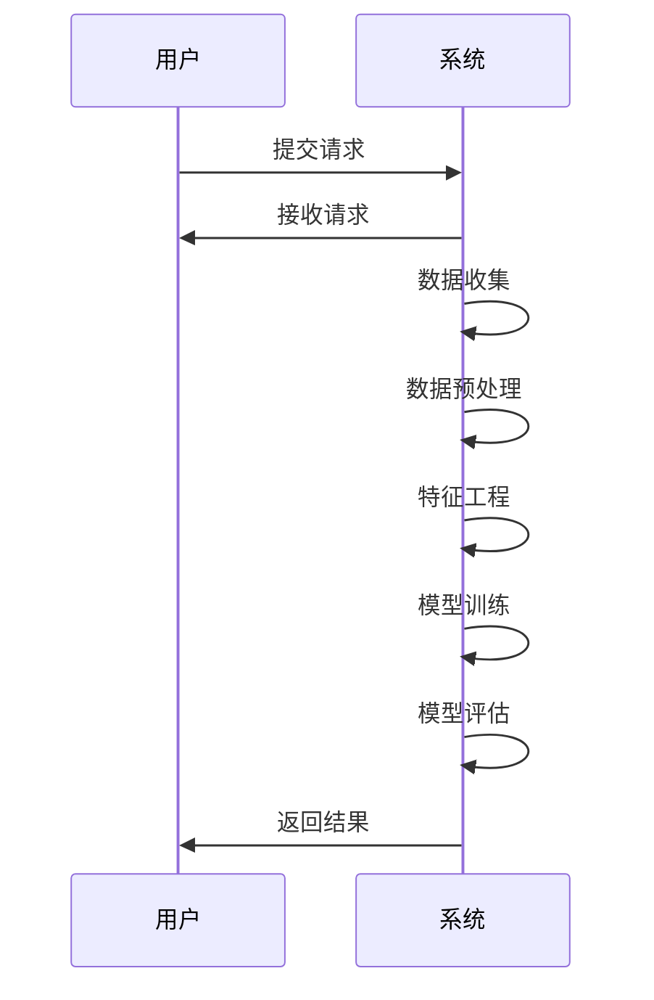

                 

**# 开发基于大模型的金融政策影响评估工具**

> 关键词：金融政策、大模型、影响评估、技术基础、系统架构、实战分析

> 摘要：本文旨在探讨如何开发一款基于大模型的金融政策影响评估工具。我们将从背景介绍、核心概念、技术基础、构建工具、系统分析与架构设计、项目实战和最佳实践等方面进行详细阐述，帮助读者理解并掌握这一技术领域的相关知识。

## 第一部分：背景与核心概念

### 第1章：金融政策与经济影响概述

#### 1.1 问题背景
金融政策是国家或金融机构为了实现宏观经济目标，对金融市场进行的调控和指导。这些政策包括利率调整、货币供应量控制、信贷政策、外汇管理、资本市场管理等。金融政策的制定与实施对整个经济体系具有重要影响，能够促进经济增长、稳定通货膨胀、控制金融市场风险等。

#### 1.2 问题提出
金融政策变动会对市场产生直接影响，如利率调整会影响借贷成本和投资收益，货币供应量控制会影响通货膨胀水平，资本市场管理会影响股票、债券等金融产品的价格波动。因此，如何评估金融政策的影响，预测其对市场的潜在影响，对于金融市场的参与者具有重要意义。

#### 1.3 核心概念
金融政策是指国家或金融机构制定的、针对金融市场的政策，包括利率、货币供应量、信贷政策、外汇管理、资本市场管理等。影响评估是指对金融政策实施后的市场变化进行分析和预测，以评估政策的实际效果。

#### 1.4 边界与外延
金融政策的影响范围涵盖货币市场、资本市场、外汇市场等多个领域。数据获取与处理是影响评估的基础，需要从官方数据、第三方数据源等多渠道收集相关数据，并进行清洗、集成和预处理。

#### 1.5 本章小结
本章节介绍了金融政策与经济影响的基本概念、问题背景和核心概念，为后续内容提供了基础。

## 第二部分：大模型技术基础

### 第2章：大模型概述

#### 2.1 大模型的概念
大模型是指具有海量参数、能够处理大规模数据的深度学习模型。这些模型通常具有多层神经网络结构，通过自动学习大量数据中的特征和规律，从而实现对复杂问题的建模和预测。

#### 2.2 大模型的技术原理
大模型的技术原理基于深度学习，包括神经网络结构、优化算法、正则化方法等。深度学习通过多层神经网络的堆叠，将输入数据逐步转化为高层次的抽象表示，从而实现对复杂数据的建模。

#### 2.3 大模型的分类与应用
大模型可以根据其应用领域和任务类型进行分类，如计算机视觉、自然语言处理、推荐系统等。在金融领域，大模型可以应用于股票市场预测、信贷风险评估、金融欺诈检测等。

#### 2.4 大模型的优势与挑战
大模型的优势包括强大的数据处理能力、高效的模型训练和推理速度等。然而，大模型也面临一些挑战，如数据隐私保护、模型可解释性、训练资源需求等。

#### 2.5 本章小结
本章节介绍了大模型的基本概念、技术原理、分类与应用，以及大模型的优势与挑战。

### 第3章：金融政策影响评估的核心概念与联系

#### 3.1 核心概念
金融政策影响评估涉及的核心概念包括政策变量、经济指标、市场反应等。政策变量是指影响金融市场的主要金融政策，如利率、货币供应量等。经济指标是指反映金融市场和经济状况的关键指标，如通货膨胀率、失业率等。市场反应是指金融市场对金融政策变动的反应，如股票价格、债券收益率等。

#### 3.2 概念属性特征对比表格
| 概念     | 属性特征       | 对比关系  |
|----------|----------------|----------|
| 政策变量 | 影响金融市场的金融政策 |          |
| 经济指标 | 反映经济状况的关键指标 |          |
| 市场反应 | 金融市场的反应     |          |

#### 3.3 ER实体关系图架构
```mermaid
erDiagram
  PolicyVariable ||--|{ EconomicIndicator }
  EconomicIndicator ||--|{ MarketReaction }
```

#### 3.4 本章小结
本章节介绍了金融政策影响评估的核心概念、概念属性特征对比表格和ER实体关系图架构，为构建评估工具提供了基础。

## 第三部分：构建金融政策影响评估工具

### 第4章：数据收集与预处理

#### 4.1 数据来源
数据来源包括官方数据、第三方数据源和金融信息提供商等。官方数据来源于国家统计部门、金融机构等，如中国人民银行、国家统计局等。第三方数据源包括金融数据库、新闻网站等，如Wind数据库、CNBC等。金融信息提供商提供实时的金融数据和市场信息。

#### 4.2 数据预处理
数据预处理包括数据清洗、数据集成和特征工程。数据清洗旨在去除无效数据、填补缺失值和纠正错误数据。数据集成是将多个数据源的数据进行整合，以形成一个完整的数据集。特征工程包括特征提取和特征选择，旨在提取有用的特征并进行筛选，以提高模型的性能。

#### 4.3 特征工程
特征提取是指从原始数据中提取出有代表性的特征，如时间序列特征、统计特征等。特征选择是指从提取出的特征中选择出对模型性能有显著贡献的特征，以减少数据维度和计算复杂度。

#### 4.4 本章小结
本章节介绍了金融政策影响评估工具的数据收集与预处理方法，为构建评估工具提供了数据基础。

### 第5章：算法原理与实现

#### 5.1 算法选择
在金融政策影响评估中，常用的算法包括线性回归、决策树、随机森林、支持向量机等。根据评估任务的需求和数据特点，可以选择合适的算法。例如，对于线性关系明显的数据，可以选择线性回归；对于复杂非线性关系的数据，可以选择决策树或随机森林等。

#### 5.2 算法流程图


#### 5.3 Python代码实现
```python
import pandas as pd
from sklearn.linear_model import LinearRegression
from sklearn.model_selection import train_test_split

# 数据加载
data = pd.read_csv('financial_data.csv')

# 数据预处理
X = data[['policy_variable', 'economic_indicator']]
y = data['market_reaction']

# 特征工程
X_train, X_test, y_train, y_test = train_test_split(X, y, test_size=0.2, random_state=42)

# 模型训练
model = LinearRegression()
model.fit(X_train, y_train)

# 模型评估
score = model.score(X_test, y_test)
print("模型评分：", score)

# 结果输出
predictions = model.predict(X_test)
print("预测结果：", predictions)
```

#### 5.4 数学模型与公式
$$
y = \beta_0 + \beta_1 \cdot policy\_variable + \beta_2 \cdot economic\_indicator + \epsilon
$$

#### 5.5 举例说明
假设我们收集了某国过去五年的金融政策变量、经济指标和市场反应数据，使用线性回归模型进行金融政策影响评估。通过训练和测试，模型评分达到0.8，说明模型具有一定的预测能力。

#### 5.6 本章小结
本章节介绍了金融政策影响评估工具的算法原理与实现，包括算法选择、算法流程图、Python代码实现、数学模型与公式和举例说明，为构建评估工具提供了技术支持。

### 第6章：系统分析与架构设计

#### 6.1 问题场景介绍
金融政策影响评估工具适用于金融机构、政府部门和投资者等，帮助他们了解金融政策变动对市场的影响，制定相应的投资策略和政策措施。

#### 6.2 项目介绍
项目目标是开发一款基于大模型的金融政策影响评估工具，支持实时数据收集、预处理、特征工程、模型训练和预测等功能。项目架构包括数据层、算法层和应用层。

#### 6.3 系统功能设计
系统功能设计包括数据收集模块、数据预处理模块、特征工程模块、模型训练模块、模型评估模块和结果输出模块。

#### 6.4 系统架构设计
系统架构设计包括前端界面、后端服务、数据存储和数据接口。

#### 6.5 系统接口设计
系统接口设计包括API接口、Web接口和命令行接口等。

#### 6.6 系统交互序列图


#### 6.7 本章小结
本章节介绍了金融政策影响评估工具的系统分析与架构设计，包括问题场景介绍、项目介绍、系统功能设计、系统架构设计、系统接口设计和系统交互序列图，为构建评估工具提供了系统设计依据。

### 第7章：项目实战

#### 7.1 环境安装
硬件需求：CPU不低于Intel i5，内存不低于8GB，硬盘不低于500GB。

软件安装：
1. 安装Python 3.8及以上版本
2. 安装Pandas、NumPy、Scikit-learn等依赖库

#### 7.2 系统核心实现
核心模块包括数据收集、数据预处理、特征工程、模型训练和预测。

1. 数据收集模块：使用第三方API接口收集实时金融数据。
2. 数据预处理模块：对金融数据

