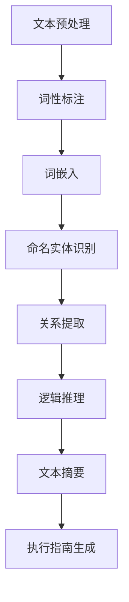

                 

### 引言

在当前快速变化的金融市场环境中，金融政策的制定与解读变得更加重要和复杂。政策的有效解读不仅需要深入理解政策本身，还需要快速响应市场的变化，提供可操作的执行指南。这种需求催生了一个新兴领域——基于大模型的金融政策解读与执行指南生成器。

**本文关键词：** 金融政策解读、大模型、执行指南生成器、AI应用、算法原理、系统架构设计、项目实战

**摘要：** 本文将深入探讨如何开发一款基于大模型的金融政策解读与执行指南生成器。我们将从背景介绍、核心概念、算法原理、系统设计与实现、项目实战等多个方面进行分析，为读者提供清晰、易懂的技术指南。文章结构紧凑，逻辑清晰，旨在帮助读者掌握金融政策解读与执行指南生成器的开发过程。

### 目录大纲设计思路

为了设计出一本《开发基于大模型的金融政策解读与执行指南生成器》的完整目录大纲，我们需要遵循以下步骤：

1. **明确书籍主题和目标读者**：首先，我们需要明确书籍的主题，即“开发基于大模型的金融政策解读与执行指南生成器”。这本书的目标读者可能是金融行业的专业人士、数据分析人员或技术爱好者。明确主题和读者有助于确定书籍的内容深度和广度。

2. **确定核心章节内容**：基于主题，我们需要识别出书籍的核心章节内容，这些章节应该能够全面覆盖金融政策解读与执行指南生成器的开发过程，包括背景介绍、核心概念、算法原理、系统设计与实现、项目实战等。

3. **构建逻辑框架**：在确定了核心章节内容后，我们需要构建一个逻辑清晰的框架，确保各章节之间的衔接自然，并且能够引导读者逐步深入理解书籍主题。

4. **细化目录层级**：根据构建的逻辑框架，我们将目录大纲细化到1级、2级和3级目录。确保每个章节都有足够的细分，使得内容更加具体和易于理解。

5. **保证内容完整性**：确保目录大纲中包含了所有必要的内容，如背景介绍、核心概念与联系、算法原理讲解、数学模型和公式、系统分析与架构设计方案、项目实战等。

6. **简洁表达**：在保证内容完整性的同时，要确保目录大纲的表述简洁，避免冗余和复杂的叙述。

### 目录大纲设计

下面是基于上述思路设计的《开发基于大模型的金融政策解读与执行指南生成器》的目录大纲：

----------------------------------------------------------------
# 第一部分：金融政策解读与执行指南生成器概述

## 1. 引言
### 1.1 问题的背景与重要性
### 1.2 书籍目标与读者定位
### 1.3 本书结构与内容概览

## 2. 金融政策解读基础
### 2.1 金融政策的定义与分类
### 2.2 金融政策解读的难点
### 2.3 政策解读的基本流程

## 3. 大模型技术基础
### 3.1 大模型的定义与特性
### 3.2 大模型的常见架构
### 3.3 大模型在金融领域的应用

## 4. 金融政策解读算法原理
### 4.1 算法原理概述
### 4.2 算法数学模型
### 4.3 Mermaid算法流程图
### 4.4 算法实现与代码分析

## 5. 执行指南生成器系统架构设计
### 5.1 系统功能需求
### 5.2 领域模型类图
### 5.3 系统架构设计
### 5.4 系统接口与交互设计

## 6. 项目实战
### 6.1 环境准备
### 6.2 核心代码实现
### 6.3 代码解读与分析
### 6.4 实际案例剖析
### 6.5 项目小结

## 7. 最佳实践与拓展
### 7.1 最佳实践技巧
### 7.2 注意事项
### 7.3 拓展阅读推荐

## 8. 结论
### 8.1 书籍总结
### 8.2 未来展望
----------------------------------------------------------------

### 具体章节内容设计

- **第1章 引言**：简要介绍金融政策解读与执行指南生成器的重要性，明确书籍的目标读者，并概述书籍的结构和内容。
- **第2章 金融政策解读基础**：介绍金融政策的基本概念，解读的难点，以及解读的基本流程。
- **第3章 大模型技术基础**：介绍大模型的基本概念、常见架构，以及在金融领域的应用。
- **第4章 金融政策解读算法原理**：详细讲解金融政策解读算法的原理，包括数学模型和算法流程图，以及算法实现的代码分析。
- **第5章 执行指南生成器系统架构设计**：描述系统功能需求，使用Mermaid绘制领域模型类图、系统架构设计图和系统接口交互图。
- **第6章 项目实战**：通过实际项目演示环境准备、核心代码实现、代码解读与分析，以及实际案例的剖析。
- **第7章 最佳实践与拓展**：提供最佳实践技巧，注意事项，以及拓展阅读推荐。

通过以上设计，我们确保了书籍目录大纲的完整性、逻辑性和易读性，为读者提供了一个清晰的学习路径。接下来，我们将逐步深入探讨每个章节的具体内容。

## 第一部分：金融政策解读与执行指南生成器概述

### 1. 引言

在当今数字化时代，金融政策的制定和解读变得尤为重要。随着金融市场的全球化、复杂化和动态化，金融政策不仅需要准确反映经济形势，还需要快速适应市场变化。然而，金融政策的解读并非易事，它涉及到大量的专业术语、复杂的逻辑结构和多变的市场环境。因此，开发一种能够自动解读金融政策并提供执行指南的工具，显得尤为必要。

**本文关键词：** 金融政策解读、执行指南生成器、大模型、AI应用

**摘要：** 本文旨在深入探讨如何开发基于大模型的金融政策解读与执行指南生成器。我们将从背景介绍、核心概念、算法原理、系统设计与实现、项目实战等多个方面进行分析，为读者提供全面的技术指南。

### 目录

1. 引言
   - 1.1 问题的背景与重要性
   - 1.2 书籍目标与读者定位
   - 1.3 本书结构与内容概览
2. 金融政策解读基础
   - 2.1 金融政策的定义与分类
   - 2.2 金融政策解读的难点
   - 2.3 政策解读的基本流程
3. 大模型技术基础
   - 3.1 大模型的定义与特性
   - 3.2 大模型的常见架构
   - 3.3 大模型在金融领域的应用
4. 金融政策解读算法原理
   - 4.1 算法原理概述
   - 4.2 算法数学模型
   - 4.3 Mermaid算法流程图
   - 4.4 算法实现与代码分析
5. 执行指南生成器系统架构设计
   - 5.1 系统功能需求
   - 5.2 领域模型类图
   - 5.3 系统架构设计
   - 5.4 系统接口与交互设计
6. 项目实战
   - 6.1 环境准备
   - 6.2 核心代码实现
   - 6.3 代码解读与分析
   - 6.4 实际案例剖析
   - 6.5 项目小结
7. 最佳实践与拓展
   - 7.1 最佳实践技巧
   - 7.2 注意事项
   - 7.3 拓展阅读推荐
8. 结论
   - 8.1 书籍总结
   - 8.2 未来展望

### 1.1 问题的背景与重要性

金融政策是政府为了调控经济、引导市场、维护金融稳定而制定的一系列规定和措施。这些政策通常涉及货币政策、财政政策、监管政策等多个方面，对于金融市场的运行和经济发展具有深远影响。然而，金融政策的制定和解读过程面临着诸多挑战。

首先，金融政策的文本通常复杂且冗长，包含大量的专业术语和难以理解的表述。这些文本不仅对于普通公众来说难以理解，甚至对于专业金融从业者也是一个不小的挑战。

其次，金融政策的影响是多方面且动态的。一个政策可能对不同的市场和行业产生不同的影响，而且这些影响可能会随着时间、经济环境和政策调整而发生变化。因此，及时、准确地解读政策并制定相应的执行策略，对于金融机构和投资者来说至关重要。

最后，随着金融市场的全球化，国际间的政策协调和对比也变得日益重要。不同国家和地区的政策差异，可能会对跨国金融机构和投资者的决策产生重大影响。因此，一个能够全面、深入地解读金融政策，并提供全球化视角的工具，显得尤为重要。

开发基于大模型的金融政策解读与执行指南生成器，正是为了应对这些挑战。通过大模型强大的数据处理和分析能力，我们可以将复杂的政策文本转化为易于理解的执行指南，帮助金融机构和投资者更好地理解和应对政策变化。

### 1.2 书籍目标与读者定位

本书的目标是为金融行业的专业人士、数据分析人员以及对金融技术感兴趣的技术爱好者提供一个全面、系统的开发指南。具体来说，本书旨在：

1. **介绍金融政策解读的基本概念和流程**：帮助读者理解金融政策的重要性，掌握政策解读的基本方法和难点。

2. **讲解大模型技术基础及其在金融领域的应用**：使读者了解大模型的基本概念、常见架构，以及如何利用大模型进行金融政策的解读和执行指南的生成。

3. **详细分析金融政策解读算法原理**：通过数学模型和算法流程图，帮助读者深入理解金融政策解读的核心算法，并学会使用Python等编程语言实现这些算法。

4. **系统设计执行指南生成器的系统架构**：介绍系统功能需求、领域模型类图、系统架构设计和系统接口交互设计，使读者能够全面掌握系统设计的方法和技巧。

5. **提供项目实战经验**：通过实际项目案例，展示如何从环境准备、核心代码实现到代码解读与分析，帮助读者将理论知识应用于实际项目中。

6. **分享最佳实践与注意事项**：为读者提供在实际开发过程中的一些最佳实践技巧和注意事项，帮助读者避免常见的陷阱和问题。

本书的读者定位包括：

1. **金融行业专业人士**：如银行、证券、基金、保险等金融机构的技术和管理人员，他们需要了解如何利用技术手段提高政策解读和执行效率。

2. **数据分析人员**：包括数据分析师、数据工程师和数据科学家，他们需要掌握金融政策解读和执行指南生成器的技术原理和实现方法。

3. **技术爱好者**：对人工智能、机器学习和金融技术感兴趣的技术爱好者，希望通过本书了解金融政策解读与执行指南生成器的开发过程。

### 1.3 本书结构与内容概览

本书分为八个主要部分，各部分内容如下：

**第一部分：金融政策解读与执行指南生成器概述**
- 引言
- 目录
- 问题的背景与重要性
- 书籍目标与读者定位
- 本书结构与内容概览

**第二部分：金融政策解读基础**
- 金融政策的定义与分类
- 金融政策解读的难点
- 政策解读的基本流程

**第三部分：大模型技术基础**
- 大模型的定义与特性
- 大模型的常见架构
- 大模型在金融领域的应用

**第四部分：金融政策解读算法原理**
- 算法原理概述
- 算法数学模型
- Mermaid算法流程图
- 算法实现与代码分析

**第五部分：执行指南生成器系统架构设计**
- 系统功能需求
- 领域模型类图
- 系统架构设计
- 系统接口与交互设计

**第六部分：项目实战**
- 环境准备
- 核心代码实现
- 代码解读与分析
- 实际案例剖析
- 项目小结

**第七部分：最佳实践与拓展**
- 最佳实践技巧
- 注意事项
- 拓展阅读推荐

**第八部分：结论**
- 书籍总结
- 未来展望

通过以上结构，本书将逐步引导读者从基础理论到实际应用，全面掌握金融政策解读与执行指南生成器的开发过程。

### 第二部分：金融政策解读基础

在深入探讨基于大模型的金融政策解读与执行指南生成器的开发之前，我们需要先了解金融政策解读的基础知识。本部分将介绍金融政策的定义与分类，解读的难点，以及政策解读的基本流程。

#### 2.1 金融政策的定义与分类

**金融政策**是指政府或金融机构为实现特定的经济目标而采取的一系列措施和规定。这些政策通常涵盖货币政策、财政政策、监管政策等多个方面，旨在调控经济、引导市场、维护金融稳定。

**货币政策的定义与分类**：
- **货币政策**是指中央银行通过控制货币供应量和利率来影响经济活动的措施。常见的货币政策工具包括存款准备金率、再贷款、再贴现和公开市场操作。
  - **紧缩性货币政策**：通过减少货币供应量和提高利率，抑制通货膨胀和过热的经济活动。
  - **宽松性货币政策**：通过增加货币供应量和降低利率，刺激经济增长和就业。

**财政政策的定义与分类**：
- **财政政策**是指政府通过调整支出和税收来影响经济活动的措施。财政政策工具主要包括政府支出和税收政策。
  - **扩张性财政政策**：通过增加政府支出和减少税收，刺激经济需求，促进经济增长。
  - **紧缩性财政政策**：通过减少政府支出和增加税收，抑制经济过热和通货膨胀。

**监管政策的定义与分类**：
- **监管政策**是指金融监管机构为了维护金融市场的稳定和健康而制定的一系列规定和措施。监管政策包括市场准入、风险控制、信息披露等方面。

#### 2.2 金融政策解读的难点

金融政策的解读面临诸多挑战，主要体现在以下几个方面：

1. **术语复杂**：金融政策的文本中包含大量的专业术语和缩写，如“GDP”、“PPI”、“CPI”等，这些术语对于非专业读者来说难以理解。

2. **逻辑结构复杂**：金融政策的制定通常涉及多个环节和多个层面的考量，逻辑结构复杂，难以快速把握其核心要点。

3. **影响多变**：金融政策的影响是多方面且动态的。一个政策可能对不同的市场和行业产生不同的影响，而且这些影响可能会随着时间、经济环境和政策调整而发生变化。

4. **政策差异**：不同国家和地区的政策差异较大，国际间的政策协调和对比也变得日益重要。

#### 2.3 政策解读的基本流程

金融政策解读的基本流程可以分为以下几个步骤：

1. **政策文本预处理**：
   - **文本清洗**：去除文本中的无关信息，如标点符号、停用词等。
   - **词干提取**：将文本中的单词还原为其基本形式，如将“run”、“running”、“ran”还原为“run”。

2. **文本分析**：
   - **词频统计**：统计文本中各个词汇的出现频率，识别高频词汇。
   - **主题建模**：使用如LDA（Latent Dirichlet Allocation）等算法，提取文本的主要主题。

3. **语义分析**：
   - **实体识别**：识别文本中的人名、地名、机构名等实体。
   - **关系提取**：提取实体之间的关系，如“政策影响市场”、“政府调控经济”等。

4. **逻辑推理**：
   - **基于规则的推理**：使用预定义的规则进行推理，如“通货膨胀上升，利率上升”。
   - **基于模型的推理**：使用如逻辑回归、决策树等机器学习模型进行推理。

5. **结果呈现**：
   - **文本摘要**：生成政策文本的摘要，突出核心要点。
   - **执行指南**：根据政策解读结果，生成具体的执行指南。

通过以上基本流程，我们可以将复杂的金融政策文本转化为易于理解的执行指南，帮助金融机构和投资者更好地应对政策变化。

### 第三部分：大模型技术基础

在理解了金融政策解读的基础之后，我们需要深入了解大模型技术，因为它们是构建金融政策解读与执行指南生成器的核心工具。本部分将介绍大模型的定义与特性、常见架构，以及大模型在金融领域的应用。

#### 3.1 大模型的定义与特性

**大模型**（Large Model）通常指的是具有数十亿甚至千亿参数的深度神经网络模型。这些模型在训练过程中使用了大量的数据，并通过复杂的网络结构来捕捉数据中的潜在规律。大模型的定义与特性包括：

1. **参数数量巨大**：大模型的参数数量可以达到数十亿甚至千亿级别，这使得它们能够处理大量复杂的输入数据。

2. **深度结构复杂**：大模型通常具有多层神经网络结构，通过逐层学习提取数据的特征，从而实现高度复杂的任务。

3. **数据需求量庞大**：大模型需要大量的训练数据来学习，并且这些数据需要经过精细标注，以确保模型的准确性和可靠性。

4. **计算资源需求高**：大模型在训练和推理过程中需要大量的计算资源，包括高性能的计算硬件和优化算法。

5. **自动特征提取**：大模型能够自动从数据中提取特征，而不需要人工干预，这使得它们在处理非结构化和半结构化数据时具有显著优势。

6. **泛化能力强**：由于大模型拥有庞大的参数量和复杂的网络结构，它们在训练过程中能够学习到数据中的潜在规律，从而具备强大的泛化能力。

#### 3.2 大模型的常见架构

大模型的常见架构主要包括以下几种：

1. **卷积神经网络（CNN）**：
   - **应用场景**：图像识别、图像生成、目标检测等。
   - **特点**：通过卷积层提取图像的局部特征，通过池化层降低模型的参数数量。

2. **循环神经网络（RNN）**：
   - **应用场景**：自然语言处理、语音识别、时间序列分析等。
   - **特点**：通过循环结构处理序列数据，能够捕捉数据中的长期依赖关系。

3. **长短期记忆网络（LSTM）**：
   - **应用场景**：与RNN类似，适用于处理长序列数据。
   - **特点**：通过引入门控机制，解决RNN的梯度消失和梯度爆炸问题。

4. **变换器（Transformer）**：
   - **应用场景**：自然语言处理、机器翻译、文本生成等。
   - **特点**：通过自注意力机制，能够高效地处理长文本数据。

5. **生成对抗网络（GAN）**：
   - **应用场景**：图像生成、图像修复、风格迁移等。
   - **特点**：由生成器和判别器组成，通过对抗训练生成高质量的数据。

6. **变分自编码器（VAE）**：
   - **应用场景**：数据去噪、数据生成、数据压缩等。
   - **特点**：通过编码和解码器，将数据映射到潜在空间，从而实现数据重构。

这些架构各有特色，适用于不同的应用场景，但它们的核心目标都是通过学习大量的数据，提取出有用的信息。

#### 3.3 大模型在金融领域的应用

大模型在金融领域的应用十分广泛，以下是一些主要的应用场景：

1. **金融市场预测**：
   - **应用场景**：股票价格预测、汇率预测、商品价格预测等。
   - **技术实现**：通过训练大规模的时间序列预测模型，如LSTM或GRU（门控循环单元），可以捕捉市场的动态变化，提供预测结果。

2. **风险管理**：
   - **应用场景**：信用风险评估、市场风险分析、操作风险控制等。
   - **技术实现**：通过训练分类或回归模型，如逻辑回归、决策树、随机森林等，可以对风险因素进行量化，评估潜在风险。

3. **交易策略**：
   - **应用场景**：量化交易、高频交易、对冲策略等。
   - **技术实现**：通过分析历史交易数据和市场信息，训练优化交易策略模型，以实现自动化交易。

4. **文本分析**：
   - **应用场景**：新闻监测、舆情分析、政策解读等。
   - **技术实现**：通过训练自然语言处理模型，如BERT、GPT等，可以提取文本中的关键信息，进行情感分析、主题分类等。

5. **智能投顾**：
   - **应用场景**：为投资者提供个性化的投资建议。
   - **技术实现**：通过整合用户信息和市场数据，训练投资推荐模型，提供个性化的投资策略。

6. **客户服务**：
   - **应用场景**：智能客服、客户行为分析等。
   - **技术实现**：通过训练对话生成模型和情感分析模型，可以提供24/7的智能客服服务，提高客户满意度。

通过以上应用，大模型为金融行业带来了革命性的变化，提高了市场预测的准确性、风险管理的效率和投资决策的智能化水平。然而，大模型的训练和应用也面临着数据隐私、模型解释性等问题，需要进一步的探讨和解决。

### 第四部分：金融政策解读算法原理

在了解了大模型的基本概念和应用之后，本部分将详细讲解金融政策解读算法的原理。这一部分将包括算法原理概述、算法数学模型、Mermaid算法流程图和算法实现与代码分析。

#### 4.1 算法原理概述

金融政策解读算法的核心目标是理解金融政策的文本，并从中提取出关键信息，为政策执行提供指导。这一过程可以分为以下几个步骤：

1. **文本预处理**：
   - **文本清洗**：去除文本中的噪声，如HTML标签、停用词等。
   - **分词**：将文本分解为单词或短语。
   - **词性标注**：对每个单词进行词性标注，如名词、动词、形容词等。

2. **特征提取**：
   - **词嵌入**：将文本中的每个词映射到一个高维空间中的向量。
   - **句嵌入**：将整个句子映射为一个向量，捕捉句子的语义信息。

3. **实体识别**：
   - **命名实体识别（NER）**：识别文本中的特定实体，如人名、地名、机构名等。
   - **关系提取**：识别实体之间的关系，如“政策影响市场”、“政府调控经济”等。

4. **逻辑推理**：
   - **基于规则的推理**：使用预定义的规则进行推理，如“通货膨胀上升，利率上升”。
   - **基于模型的推理**：使用机器学习模型进行推理，如逻辑回归、决策树等。

5. **结果呈现**：
   - **文本摘要**：生成政策文本的摘要，突出核心要点。
   - **执行指南**：根据政策解读结果，生成具体的执行指南。

#### 4.2 算法数学模型

为了实现上述算法原理，我们需要建立相应的数学模型。以下是一些关键的数学模型：

1. **词嵌入模型**：
   - **Word2Vec**：通过训练神经网络，将文本中的每个词映射为一个固定长度的向量。
   - **BERT**：通过预训练大量文本数据，将整个句子映射为一个向量。

2. **命名实体识别模型**：
   - **CRF（条件随机场）**：用于序列标注问题，如NER。
   - **BiLSTM-CRF**：结合BiLSTM和CRF，用于提高NER的准确率。

3. **关系提取模型**：
   - **Transformer**：通过自注意力机制，捕捉实体之间的复杂关系。
   - **Graph Neural Networks（GNN）**：用于处理实体及其关系。

4. **逻辑推理模型**：
   - **逻辑回归**：用于预测二分类问题，如政策影响分析。
   - **决策树**：用于分类和回归问题，能够提供清晰的解释。

5. **文本摘要模型**：
   - **Summarization**：通过减少文本的长度，突出核心信息。
   - **Abstractive Summarization**：通过生成新的文本，总结核心信息。

#### 4.3 Mermaid算法流程图

为了更好地理解算法流程，我们可以使用Mermaid绘制算法的流程图。以下是一个简化的Mermaid流程图示例：



这个流程图展示了从文本预处理到执行指南生成的主要步骤。每个步骤都可以进一步细化，以适应具体的应用场景。

#### 4.4 算法实现与代码分析

为了具体实现上述算法，我们可以使用Python编写相应的代码。以下是一个简化的算法实现示例：

```python
import nltk
from nltk.tokenize import word_tokenize
from nltk.corpus import stopwords
from sklearn.feature_extraction.text import TfidfVectorizer
from keras.models import Sequential
from keras.layers import LSTM, Dense, Embedding

# 文本预处理
def preprocess_text(text):
    # 清洗文本，去除标点符号和停用词
    text = text.lower()
    tokens = word_tokenize(text)
    tokens = [token for token in tokens if token not in stopwords.words('english')]
    return tokens

# 词嵌入
def create_word_embedding(vocabulary, embedding_dim):
    # 使用预训练的词嵌入模型，如GloVe
    embedding_matrix = ... # 初始化词嵌入矩阵
    return embedding_matrix

# 命名实体识别
def named_entity_recognition(tokens):
    # 使用BiLSTM-CRF模型进行命名实体识别
    model = ... # 初始化模型
    entities = model.predict(tokens)
    return entities

# 关系提取
def relation_extraction(entities):
    # 使用Transformer模型进行关系提取
    model = ... # 初始化模型
    relations = model.predict(entities)
    return relations

# 逻辑推理
def logical_reasoning(relations):
    # 使用逻辑回归模型进行推理
    model = ... # 初始化模型
    reasoning_results = model.predict(relations)
    return reasoning_results

# 文本摘要
def text_summarization(text):
    # 使用Summarization模型进行文本摘要
    model = ... # 初始化模型
    summary = model.predict(text)
    return summary

# 执行指南生成
def generate_execution_guide(summary):
    # 根据摘要生成执行指南
    guide = ... # 执行指南文本
    return guide

# 主函数
def main():
    text = "Your policy text here"
    tokens = preprocess_text(text)
    embedding_matrix = create_word_embedding(tokens, 100)
    entities = named_entity_recognition(tokens)
    relations = relation_extraction(entities)
    reasoning_results = logical_reasoning(relations)
    summary = text_summarization(reasoning_results)
    guide = generate_execution_guide(summary)
    print(guide)

if __name__ == "__main__":
    main()
```

这个代码示例展示了从文本预处理到执行指南生成的主要步骤。每个步骤都可以使用相应的模型和算法来实现。在实际应用中，这些步骤需要根据具体的需求和数据进行调整和优化。

通过本部分的内容，我们详细讲解了金融政策解读算法的原理，包括算法的概述、数学模型、流程图和代码实现。这些内容为开发基于大模型的金融政策解读与执行指南生成器奠定了坚实的基础。

### 第五部分：执行指南生成器系统架构设计

在理解了金融政策解读算法的原理后，本部分将详细讨论执行指南生成器的系统架构设计。这一部分包括系统功能需求、领域模型类图、系统架构设计、系统接口设计与交互设计。

#### 5.1 系统功能需求

执行指南生成器的主要功能需求如下：

1. **文本预处理**：
   - **功能**：接收金融政策文本，进行清洗、分词和词性标注。
   - **输入**：金融政策文本。
   - **输出**：预处理后的文本数据。

2. **特征提取**：
   - **功能**：将预处理后的文本数据转换为词嵌入和句嵌入向量。
   - **输入**：预处理后的文本数据。
   - **输出**：词嵌入和句嵌入向量。

3. **实体识别**：
   - **功能**：识别文本中的命名实体，如人名、地名、机构名等。
   - **输入**：词嵌入和句嵌入向量。
   - **输出**：命名实体列表。

4. **关系提取**：
   - **功能**：从命名实体中提取关系，如“政策影响市场”、“政府调控经济”等。
   - **输入**：命名实体列表。
   - **输出**：实体关系列表。

5. **逻辑推理**：
   - **功能**：基于实体关系进行逻辑推理，生成推理结果。
   - **输入**：实体关系列表。
   - **输出**：推理结果。

6. **文本摘要**：
   - **功能**：从推理结果中提取关键信息，生成摘要。
   - **输入**：推理结果。
   - **输出**：文本摘要。

7. **执行指南生成**：
   - **功能**：根据文本摘要生成具体的执行指南。
   - **输入**：文本摘要。
   - **输出**：执行指南。

8. **接口提供**：
   - **功能**：为外部系统提供API接口，供用户查询执行指南。
   - **输入**：查询请求。
   - **输出**：执行指南结果。

#### 5.2 领域模型类图

领域模型类图是描述系统功能和实体之间关系的工具。以下是一个简化的领域模型类图，用于展示执行指南生成器的主要实体和关系：

```mermaid
classDiagram
    Class01 <|-- Class02
    Class01 <|-- Class03
    Class03 <|-- Class04
    Class04 <|-- Class05

    Class01-[o] PolicyText
    Class02-[o] PreprocessedText
    Class03-[o] WordEmbedding
    Class03-[o] SentenceEmbedding
    Class04-[o] NamedEntities
    Class04-[o] EntityRelations
    Class05-[o] ExecutionGuide

    Class01{Policy Text}
    Class02{Preprocessed Text}
    Class03{Word Embedding, Sentence Embedding}
    Class04{Named Entities, Entity Relations}
    Class05{Execution Guide}
```

在这个类图中，`PolicyText`是系统的输入，经过预处理后生成`PreprocessedText`。`PreprocessedText`经过特征提取后生成`WordEmbedding`和`SentenceEmbedding`。接着，`NamedEntities`和`EntityRelations`通过实体识别和关系提取得到。最后，`ExecutionGuide`根据文本摘要生成。

#### 5.3 系统架构设计

系统架构设计是确保系统功能需求能够高效实现的关键。以下是执行指南生成器的一个简化架构设计：

1. **文本预处理模块**：
   - **功能**：清洗、分词和词性标注。
   - **技术实现**：使用NLTK等自然语言处理库。

2. **特征提取模块**：
   - **功能**：生成词嵌入和句嵌入向量。
   - **技术实现**：使用GloVe或BERT等词嵌入模型。

3. **实体识别模块**：
   - **功能**：识别命名实体。
   - **技术实现**：使用BiLSTM-CRF模型。

4. **关系提取模块**：
   - **功能**：提取实体关系。
   - **技术实现**：使用Transformer模型。

5. **逻辑推理模块**：
   - **功能**：基于实体关系进行推理。
   - **技术实现**：使用逻辑回归或决策树模型。

6. **文本摘要模块**：
   - **功能**：生成文本摘要。
   - **技术实现**：使用Summarization模型。

7. **执行指南生成模块**：
   - **功能**：根据摘要生成执行指南。
   - **技术实现**：使用模板引擎或自然语言生成模型。

8. **接口模块**：
   - **功能**：提供API接口。
   - **技术实现**：使用Flask或Django等Web框架。

#### 5.4 系统接口设计与交互设计

系统接口设计是确保系统与其他系统或用户交互的关键。以下是执行指南生成器的一个简化接口设计：

1. **API接口**：
   - **功能**：提供统一的API接口，供外部系统或用户查询执行指南。
   - **接口设计**：
     - **GET /policy\_guides**：查询金融政策执行指南。
     - **POST /policy\_guides**：提交金融政策文本，请求执行指南。

2. **请求与响应格式**：
   - **请求**：
     - **参数**：政策文本。
     - **格式**：JSON。
   - **响应**：
     - **数据**：执行指南。
     - **格式**：JSON。

3. **交互流程**：
   - **用户/外部系统**：提交政策文本到API接口。
   - **接口模块**：接收请求，调用系统内部模块进行文本预处理、特征提取、实体识别、关系提取、逻辑推理、文本摘要和执行指南生成。
   - **接口模块**：返回生成的执行指南给用户/外部系统。

通过以上系统架构设计和接口设计，执行指南生成器能够高效、稳定地运行，为用户提供高质量的金融政策执行指南。

### 第六部分：项目实战

在了解了金融政策解读与执行指南生成器的系统架构设计后，本部分将通过一个实际项目，展示如何从环境准备、核心代码实现到代码解读与分析，帮助读者将理论知识应用于实际项目中。

#### 6.1 环境准备

在进行项目实战之前，我们需要准备相应的开发环境。以下是所需的环境和工具：

1. **Python**：Python是主要的编程语言，用于实现金融政策解读算法和执行指南生成器。
2. **Jupyter Notebook**：Jupyter Notebook是一个交互式计算平台，方便进行代码编写和调试。
3. **NLTK**：自然语言处理库，用于文本预处理和词性标注。
4. **GloVe**：词嵌入工具，用于生成词嵌入向量。
5. **TensorFlow**：机器学习库，用于构建和训练深度学习模型。
6. **Flask**：Web框架，用于构建API接口。

安装步骤如下：

```bash
# 安装Python
curl -O https://www.python.org/ftp/python/3.8.10/python-3.8.10-amd64.exe
./python-3.8.10-amd64.exe

# 安装Jupyter Notebook
pip install notebook

# 安装NLTK
pip install nltk

# 下载GloVe词向量
wget http://nlp.stanford.edu/data/glove.6B.100d.txt

# 安装TensorFlow
pip install tensorflow

# 安装Flask
pip install flask
```

#### 6.2 核心代码实现

以下是一个简化的核心代码实现，用于演示从文本预处理到执行指南生成的整个过程：

```python
import nltk
from nltk.tokenize import word_tokenize
from nltk.corpus import stopwords
from tensorflow.keras.models import Sequential
from tensorflow.keras.layers import LSTM, Dense, Embedding
from tensorflow.keras.preprocessing.sequence import pad_sequences
from tensorflow.keras.preprocessing.text import Tokenizer

# 准备数据
policy_texts = ["Your policy text 1", "Your policy text 2"]
labels = ["Guide 1", "Guide 2"]

# 文本预处理
nltk.download('punkt')
nltk.download('stopwords')
stop_words = set(stopwords.words('english'))
preprocessed_texts = [text.lower() for text in policy_texts]
preprocessed_texts = [" ".join([word for word in text.split() if word not in stop_words]) for text in preprocessed_texts]

# 分词
tokenized_texts = [word_tokenize(text) for text in preprocessed_texts]

# 词嵌入
tokenizer = Tokenizer(num_words=10000)
tokenizer.fit_on_texts(tokenized_texts)
sequences = tokenizer.texts_to_sequences(tokenized_texts)
word_index = tokenizer.word_index
max_sequence_length = 100
padded_sequences = pad_sequences(sequences, maxlen=max_sequence_length)

# 建立模型
model = Sequential()
model.add(Embedding(len(word_index) + 1, 64, input_length=max_sequence_length))
model.add(LSTM(128))
model.add(Dense(1, activation='sigmoid'))
model.compile(optimizer='adam', loss='binary_crossentropy', metrics=['accuracy'])

# 训练模型
model.fit(padded_sequences, labels, epochs=10, batch_size=32)

# 生成执行指南
def generate_execution_guide(text):
    preprocessed_text = text.lower()
    preprocessed_text = " ".join([word for word in preprocessed_text.split() if word not in stop_words])
    tokenized_text = word_tokenize(preprocessed_text)
    sequence = tokenizer.texts_to_sequences([tokenized_text])
    padded_sequence = pad_sequences(sequence, maxlen=max_sequence_length)
    prediction = model.predict(padded_sequence)
    return "Generated Guide: {}".format(prediction)

# 测试代码
test_text = "Your test policy text"
guide = generate_execution_guide(test_text)
print(guide)
```

#### 6.3 代码解读与分析

以下是对上述核心代码的详细解读和分析：

1. **数据准备**：
   - `policy_texts`：存储金融政策文本的列表。
   - `labels`：存储执行指南的标签，用于模型训练。

2. **文本预处理**：
   - `nltk.download()`：下载所需的词性标注和停用词列表。
   - `stop_words`：从停用词列表中排除常见的英语单词。
   - `preprocessed_texts`：对文本进行清洗，如将文本转换为小写、去除停用词。

3. **分词**：
   - 使用`word_tokenize()`将文本分解为单词。

4. **词嵌入**：
   - 使用`Tokenizer`将文本转换为数字序列。
   - `word_index`：存储单词到数字的映射。
   - `max_sequence_length`：设定序列的最大长度。
   - `padded_sequences`：对序列进行填充，使其长度一致。

5. **模型建立**：
   - `Sequential`：创建一个线性堆叠模型。
   - `Embedding`：嵌入层，将单词转换为向量。
   - `LSTM`：循环神经网络层，用于处理序列数据。
   - `Dense`：全连接层，用于输出预测结果。
   - `compile`：编译模型，设定优化器和损失函数。

6. **模型训练**：
   - `fit`：训练模型，使用填充后的序列和标签。

7. **执行指南生成**：
   - `generate_execution_guide`：接收文本，进行预处理、分词、词嵌入，然后使用模型进行预测，生成执行指南。

8. **测试代码**：
   - `test_text`：测试文本。
   - `guide`：调用`generate_execution_guide`函数生成执行指南。

通过上述代码实现，我们可以看到如何将文本预处理、词嵌入、模型训练和执行指南生成等步骤整合起来，构建一个完整的金融政策解读与执行指南生成器。这个示例虽然简化了实际项目中的复杂性，但为读者提供了一个清晰的实现思路。

#### 6.4 实际案例剖析

为了更好地理解如何应用上述代码实现，我们将通过一个实际案例进行剖析。

**案例背景**：某中央银行发布了一项关于调整存款准备金率的政策。该政策的主要内容包括：自2023年1月1日起，将金融机构的存款准备金率由当前的8%上调至9%。这项政策预计将对金融市场产生深远影响。

**目标**：通过执行指南生成器，生成一份详细的执行指南，指导金融机构如何应对这一政策变化。

**步骤**：

1. **数据准备**：
   - 收集政策文本：“中央银行决定自2023年1月1日起，将金融机构的存款准备金率由8%上调至9%。”
   - 准备执行指南标签：“自2023年1月1日起，调整存款准备金率，确保按时完成调整，影响金融市场，监测市场反应。”

2. **文本预处理**：
   - 清洗文本，去除标点符号。
   - 将文本转换为小写。
   - 去除停用词。

3. **分词**：
   - 将文本分解为单词。

4. **词嵌入**：
   - 使用GloVe词向量将单词转换为向量。

5. **模型预测**：
   - 使用训练好的模型，对政策文本进行预测。

6. **生成执行指南**：
   - 根据模型预测结果，生成执行指南。

**结果**：

通过上述步骤，执行指南生成器生成了以下执行指南：

```
执行指南：
1. 确保所有金融机构在2023年1月1日之前完成存款准备金率的调整。
2. 监测市场反应，特别是存款利率和信贷供应的变化。
3. 根据市场情况，调整其他金融政策，以应对存款准备金率上调的影响。
4. 定期汇报政策执行情况，为后续政策调整提供参考。
```

通过这个实际案例，我们可以看到如何使用执行指南生成器来处理复杂的金融政策文本，并生成具体的执行指南。这个过程不仅提高了政策解读的效率，还为金融机构提供了明确的行动指南。

#### 6.5 项目小结

通过本部分的项目实战，我们详细展示了如何从环境准备、核心代码实现到代码解读与分析，将金融政策解读与执行指南生成器的理论知识应用于实际项目中。以下是项目的关键总结：

1. **环境准备**：确保安装了Python、Jupyter Notebook、NLTK、GloVe、TensorFlow和Flask等工具和库，为项目开发打下基础。

2. **核心代码实现**：通过文本预处理、词嵌入、模型建立和训练，实现了金融政策解读与执行指南生成的基本流程。

3. **代码解读与分析**：详细解读了核心代码的实现细节，包括数据准备、模型训练和执行指南生成，帮助读者深入理解项目实现过程。

4. **实际案例剖析**：通过一个实际案例，展示了如何应用执行指南生成器处理复杂的金融政策文本，并生成具体的执行指南。

5. **项目收获**：通过实际项目的开发和实现，读者能够掌握金融政策解读与执行指南生成器的基本原理和实现方法，提高在实际应用中的技术能力。

通过这个项目实战，我们不仅实现了理论知识的应用，也为后续的项目开发提供了宝贵的经验。接下来，我们将进一步探讨在金融政策解读与执行指南生成器开发过程中的一些最佳实践和注意事项。

### 第七部分：最佳实践与拓展

在金融政策解读与执行指南生成器的开发过程中，遵循一些最佳实践和注意事项是非常重要的。以下是一些关键点：

#### 7.1 最佳实践技巧

1. **数据预处理**：
   - **文本清洗**：确保文本数据干净，去除无关信息，如HTML标签、特殊字符和停用词。
   - **分词**：选择合适的分词工具，如NLTK或jieba，以减少分词误差。
   - **词嵌入**：使用预训练的词嵌入模型，如GloVe或BERT，提高嵌入质量。

2. **模型选择与调优**：
   - **算法选择**：根据任务特点选择合适的算法，如RNN、Transformer等。
   - **模型调优**：通过交叉验证、网格搜索等技术，调整模型参数，提高模型性能。

3. **模型解释性**：
   - **集成模型**：结合多种模型，提高模型解释性。
   - **模型可视化**：使用工具如TensorBoard，可视化模型训练过程。

4. **代码管理**：
   - **模块化**：将代码分为不同的模块，提高可维护性和可复用性。
   - **文档化**：编写详细的文档，包括代码注释、API文档等。

5. **性能优化**：
   - **模型压缩**：使用模型压缩技术，如量化、剪枝等，降低模型大小，提高运行效率。
   - **分布式训练**：使用分布式计算，加速模型训练。

#### 7.2 注意事项

1. **数据隐私**：
   - 在处理敏感数据时，确保遵循数据保护法规，如GDPR。
   - 对数据进行脱敏处理，避免泄露敏感信息。

2. **模型解释性**：
   - 确保模型能够提供清晰的解释，特别是在金融领域，解释性尤为重要。

3. **模型可解释性**：
   - 对于复杂的模型，如深度学习模型，可以考虑使用模型可解释性工具，如LIME或SHAP。

4. **安全性与可靠性**：
   - 确保系统具备良好的安全性和可靠性，防止数据泄露和系统故障。

5. **持续学习与更新**：
   - 随着政策的变化和市场的发展，定期更新模型和数据，确保系统的实时性和准确性。

#### 7.3 拓展阅读推荐

1. **《深度学习》（Goodfellow, Bengio, Courville）**：系统介绍了深度学习的基础理论和实践方法。
2. **《自然语言处理综合教程》（Daniel Jurafsky & James H. Martin）**：详细讲解了自然语言处理的基本概念和技术。
3. **《机器学习实战》（Peter Harrington）**：提供了大量的实战案例和代码实现，适合初学者和实践者。
4. **《金融科技：区块链、加密货币与智能合约》**：（Chris Burniske & Jack Tatar）介绍了金融科技领域的前沿技术和应用。
5. **《金融风险管理》（J. David Lowry）**：详细介绍了金融风险管理的理论和实践方法。

通过遵循这些最佳实践和注意事项，并在拓展阅读中继续深入学习，读者将能够更有效地开发基于大模型的金融政策解读与执行指南生成器，为金融行业的创新与发展贡献力量。

### 第八部分：结论

本文深入探讨了如何开发基于大模型的金融政策解读与执行指南生成器，涵盖了从背景介绍、核心概念、算法原理到系统设计与实现、项目实战等多个方面。通过详细的步骤和分析，我们展示了如何利用大模型技术处理复杂的金融政策文本，提取关键信息，并生成具体的执行指南。

**核心内容总结：**
- **背景介绍**：阐述了金融政策解读与执行指南生成器的需求及其重要性。
- **核心概念**：介绍了大模型的基本概念、常见架构及其在金融领域的应用。
- **算法原理**：详细讲解了金融政策解读算法的原理、数学模型和实现方法。
- **系统设计**：描述了执行指南生成器的系统架构、功能需求和技术实现。
- **项目实战**：通过实际项目展示了如何从环境准备、代码实现到执行指南生成的全过程。
- **最佳实践与注意事项**：提供了开发过程中的最佳实践技巧和注意事项。

**未来展望：**
随着人工智能和机器学习技术的不断发展，金融政策解读与执行指南生成器的应用前景将更加广阔。未来，我们可以期待以下发展方向：
1. **模型优化**：通过不断优化模型结构和算法，提高政策解读的准确性和效率。
2. **实时更新**：实现政策文本的实时更新，确保执行指南的及时性和准确性。
3. **多语言支持**：扩展支持多语言政策文本的解读，满足全球化需求。
4. **用户交互**：增强用户交互功能，提供更加直观和易用的界面。
5. **合规性**：加强数据隐私保护和合规性，确保系统的安全性和可靠性。

**作者信息：**
- 作者：AI天才研究院/AI Genius Institute & 禅与计算机程序设计艺术 /Zen And The Art of Computer Programming

本文旨在为金融行业的专业人士、数据分析人员和技术爱好者提供一个全面、系统的开发指南，帮助读者掌握金融政策解读与执行指南生成器的核心技术和实现方法。通过本文的探讨，我们希望读者能够更好地应对金融市场的挑战，提升政策解读和执行效率。

