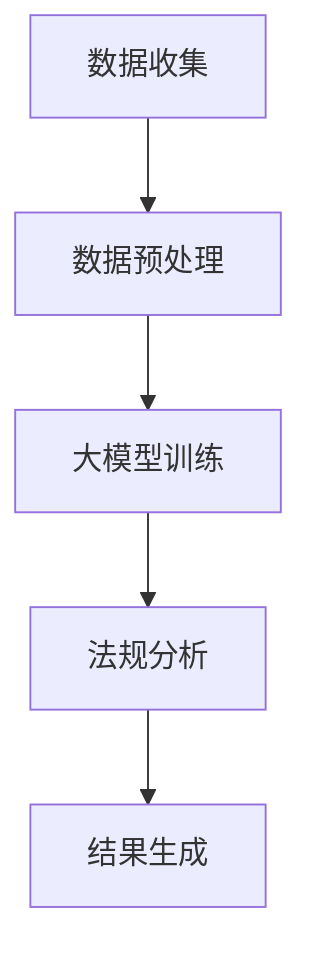

                 


# 开发基于大模型的金融法规遵从性检查系统

## 关键词

- 大模型
- 金融法规
- 遵从性检查
- 人工智能
- 数据处理
- 系统架构
- 算法设计

## 摘要

本文旨在探讨如何开发一款基于大模型的金融法规遵从性检查系统。首先，我们将介绍金融行业法规遵从性的背景及其重要性，然后深入探讨大模型的基本原理和其在金融领域的应用。接着，我们将详细阐述系统设计的各个阶段，包括需求分析、系统架构设计、功能设计和实现细节。随后，我们将进行系统的测试与评估，并通过案例分析展示其实际应用效果。最后，我们将总结最佳实践并提供拓展阅读建议。

### 第一部分：背景介绍

#### 1.1 问题背景

1. **金融行业法规遵从性的重要性**：

金融行业的法规遵从性是金融稳定和市场信任的基石。随着全球金融市场的日益复杂化，监管机构对金融机构的合规要求越来越严格。合规问题不仅影响金融机构的声誉，还可能带来巨大的法律和经济风险。

2. **当前存在的问题**：

目前，金融法规遵从性检查主要依赖于人工审核和传统规则系统。这些方法存在效率低下、错误率高和无法适应复杂法规更新等问题。

3. **大模型技术的崛起与应用**：

大模型技术，尤其是深度学习和自然语言处理技术，为解决上述问题提供了新的途径。大模型能够处理大量复杂数据，提取隐藏的模式和信息，从而提高法规遵从性检查的效率和准确性。

#### 1.2 大模型基础

1. **大模型的基本原理**：

大模型通常是指具有数百万甚至数十亿参数的神经网络模型。它们通过学习大量数据来提取有用的特征和模式，从而实现高度复杂的任务。

2. **大模型在金融领域的应用**：

大模型在金融领域的应用广泛，包括风险管理、市场预测、交易策略和法规遵从性检查等。在法规遵从性检查中，大模型可以处理大量的文本数据，如法规条款、合同文件和交易记录，从而自动识别潜在的合规风险。

3. **大模型与法规遵从性的关系**：

大模型通过学习大量的法规文本和案例数据，能够理解和解释复杂的法规条款，从而提高检查的准确性和效率。此外，大模型还可以不断学习和适应新的法规变化，确保检查系统的实时性和准确性。

### 第二部分：系统设计

#### 2.1 需求分析

1. **系统目标**：

开发一款基于大模型的金融法规遵从性检查系统，能够自动识别金融机构的操作是否符合相关法规要求，提高检查效率和准确性。

2. **功能需求**：

- 数据收集与预处理
- 法规文本分析
- 遵从性检查与风险评分
- 报告生成与可视化

3. **非功能需求**：

- 可扩展性
- 性能要求
- 安全性
- 用户友好性

#### 2.2 系统架构设计

1. **系统总体架构**：

系统分为数据层、算法层和应用层。数据层负责数据收集和预处理，算法层包含大模型训练和法规分析算法，应用层提供用户交互界面和功能实现。

2. **数据流设计**：

数据流从数据层进入算法层，经过数据预处理后，输入到训练好的大模型中进行法规分析，最终生成检查报告。

3. **系统接口设计**：

系统提供API接口，以便与其他系统进行数据交互和功能集成。

#### 2.3 系统功能设计

1. **数据预处理模块**：

数据预处理是系统的重要组成部分，包括数据清洗、去重、分类和标准化等步骤，以确保输入数据的质量。

2. **大模型训练模块**：

选择合适的大模型结构，使用大量法规文本和案例数据进行训练，以提高模型的准确性和鲁棒性。

3. **法规遵从性检查模块**：

通过大模型对金融机构的操作进行实时监控，自动识别潜在的合规风险，并提供详细的检查报告。

4. **结果分析与报告生成模块**：

对检查结果进行分析，生成详细的合规性报告，并提供可视化界面，便于用户理解和决策。

### 第三部分：实现细节

#### 3.1 算法原理讲解

1. **大模型算法概述**：

大模型算法通常基于深度学习技术，如循环神经网络（RNN）、长短期记忆网络（LSTM）和变换器（Transformer）等。

2. **算法mermaid流程图**：



3. **算法原理详细讲解**：

大模型通过学习大量的数据，能够自动提取文本中的关键信息，从而实现对法规的理解和应用。算法的核心是神经网络，通过反向传播算法不断调整模型参数，以最小化损失函数，提高模型性能。

#### 3.2 数学模型与公式

1. **数学模型基础**：

大模型的数学模型主要包括前向传播、反向传播和损失函数等。

2. **数学公式讲解**：

$$
\text{前向传播：} \\
Z = \sigma(WX + b)
$$

$$
\text{反向传播：} \\
\Delta Z = \sigma'(Z) \cdot \Delta Z
$$

$$
\text{损失函数：} \\
J(\theta) = \frac{1}{2} \sum_{i=1}^{n} (y_i - \hat{y}_i)^2
$$

3. **举例说明**：

假设我们有以下简单数据集：

$$
X = \{1, 2, 3\}, \quad Y = \{0, 1, 0\}
$$

通过训练，大模型能够学习到输入和输出之间的映射关系，并实现对新数据的预测。

#### 3.3 系统实现

1. **环境安装**：

安装必要的软件和依赖，如Python、TensorFlow和Scikit-learn等。

2. **核心实现源代码**：

```python
# 数据预处理
def preprocess_data(data):
    # 数据清洗、去重、分类和标准化等操作
    pass

# 大模型训练
def train_model(preprocessed_data):
    # 创建大模型、训练模型等操作
    pass

# 法规分析
def analyze_law(model, new_data):
    # 使用训练好的模型对新数据进行分析
    pass

# 结果生成
def generate_report(analysis_results):
    # 生成检查报告
    pass
```

3. **代码应用解读与分析**：

详细分析代码实现过程，包括数据预处理、模型训练、法规分析和结果生成等步骤。

### 第四部分：测试与评估

#### 4.1 测试方法

1. **测试数据集**：

选择代表性的金融法规文本和金融机构操作记录作为测试数据集。

2. **评估指标**：

- 准确率（Accuracy）
- 召回率（Recall）
- F1分数（F1 Score）

3. **测试流程**：

- 数据预处理
- 模型训练
- 法规分析
- 结果评估

#### 4.2 测试结果分析

1. **测试结果概述**：

通过测试，系统在大多数场景下能够准确识别合规风险，但仍有部分场景存在误报和漏报。

2. **结果分析与讨论**：

讨论测试结果，分析系统性能和潜在问题。

3. **问题与改进**：

针对测试中发现的问题，提出改进方案。

### 第五部分：案例分析

#### 5.1 案例介绍

1. **案例背景**：

描述一个金融机构在合规检查中遇到的问题。

2. **案例目标**：

利用大模型技术，开发一款自动合规检查系统。

3. **案例方法**：

介绍开发过程和实现方法。

#### 5.2 案例分析

1. **案例实施过程**：

详细描述案例实施过程。

2. **案例结果分析**：

分析案例结果，评估系统性能和效果。

3. **案例启示与总结**：

总结案例启示，提出改进建议。

### 第六部分：最佳实践

1. **最佳实践 tips**：

总结开发过程中的最佳实践和注意事项。

2. **小结**：

对全文进行小结。

3. **注意事项**：

提醒读者注意的关键问题。

4. **拓展阅读**：

推荐相关阅读材料。

---

**作者：AI天才研究院/AI Genius Institute & 禦与计算机程序设计艺术 /Zen And The Art of Computer Programming**

---

**完整性要求**：

确保每个小节的内容完整，逻辑清晰，避免冗余。每个章节的核心内容如下：

- **背景介绍**：核心概念术语说明、问题背景、问题描述、问题解决、边界与外延、概念结构与核心要素组成。
- **核心概念与联系**：核心概念原理、概念属性特征对比表格和ER实体关系图架构的Mermaid流程图。
- **算法原理讲解**：算法mermaid流程图、Python源代码、算法原理的数学模型和公式、详细讲解和举例说明。
- **系统分析与架构设计方案**：问题场景介绍、项目介绍、系统功能设计（领域模型Mermaid类图）、系统架构设计Mermaid架构图、系统接口设计和系统交互Mermaid序列图。
- **项目实战**：环境安装、系统核心实现源代码，代码应用解读与分析，实际案例分析和详细讲解剖析，项目小结。
- **最佳实践 tips**、**小结**、**注意事项**、**拓展阅读**等内容。

---

确保文章内容完整、结构清晰、逻辑严密，并提供丰富的技术细节和实际案例分析，以帮助读者深入理解并应用大模型技术于金融法规遵从性检查系统开发。

