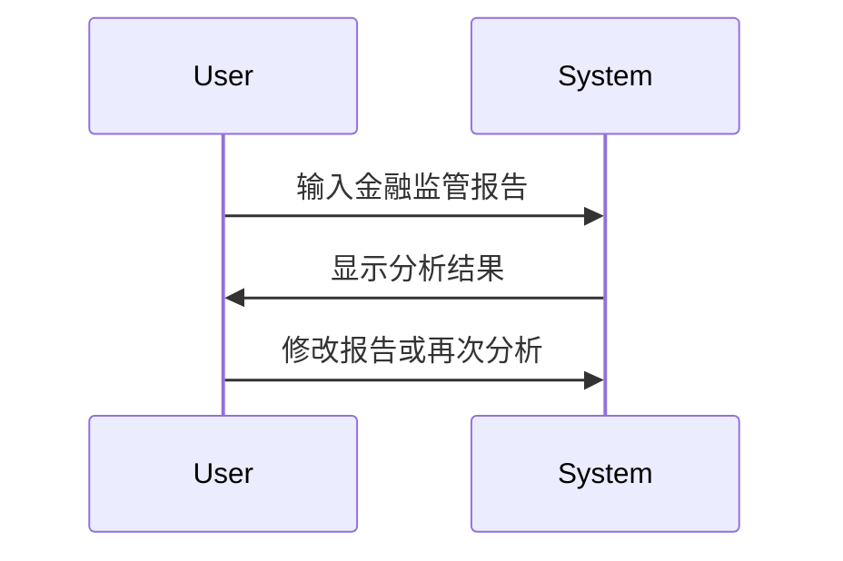
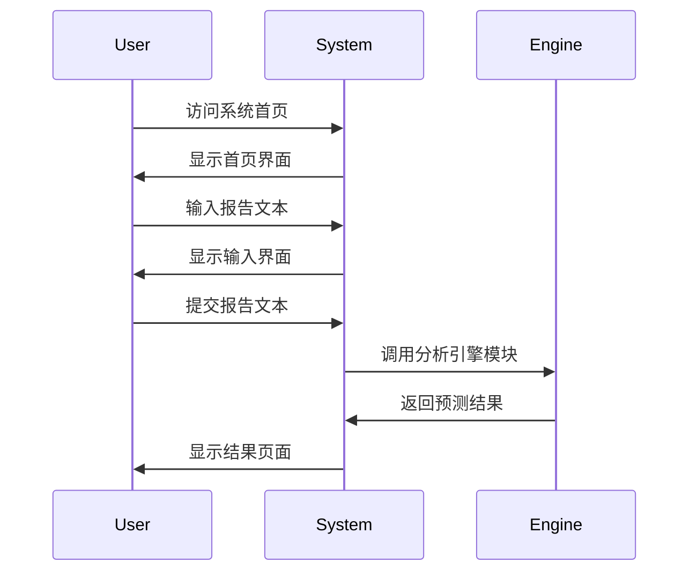

                 

### 文章标题

# 开发基于大模型的金融监管报告差异化分析助手

> 关键词：大模型、金融监管报告、差异化分析、AI应用、技术实现

> 摘要：本文将探讨如何利用大模型技术开发一套金融监管报告差异化分析助手。我们将从问题背景入手，深入解析大模型和差异化分析的核心概念，详细阐述大模型技术原理及其在金融监管报告中的应用，最终通过一个实际案例展示系统实现和优化技巧。

----------------------------------------------------------------

### 目录大纲

----------------------------------------------------------------

## 第一部分：问题背景与核心概念介绍

### 第1章：问题背景与问题描述

#### 1.1 问题背景

- 金融监管报告的现状

#### 1.2 传统监管报告分析面临的挑战

- 数据复杂性

#### 1.3 大模型在金融监管领域的应用潜力

- 高效数据分析

### 第2章：核心概念与联系

#### 2.1 大模型定义

- 大模型的定义与特点

#### 2.2 差异化分析原理

- 差异化分析的概念

#### 2.3 概念属性特征对比表格

- 大模型与差异化分析概念属性特征对比

#### 2.4 ER实体关系图架构

- 金融监管报告差异化分析的ER实体关系图

## 第二部分：大模型技术原理与应用

### 第3章：大模型技术原理

#### 3.1 大模型基本原理

- 大模型的核心算法

#### 3.2 大模型训练与优化

- 大模型训练过程

#### 3.3 大模型应用案例

- 金融监管报告差异化分析案例

## 第三部分：金融监管报告差异化分析实战

### 第4章：环境安装与配置

#### 4.1 环境安装

- 操作系统环境安装

#### 4.2 配置说明

- 配置文件介绍

### 第5章：系统核心实现

#### 5.1 数据处理模块

- 数据采集

#### 5.2 分析引擎模块

- 模型训练

#### 5.3 用户交互模块

- 用户界面设计

### 第6章：代码应用解读与分析

#### 6.1 源代码解读

- 数据处理模块代码

#### 6.2 代码分析

- 关键算法解析

### 第7章：实际案例分析与讲解

#### 7.1 案例背景

- 案例场景介绍

#### 7.2 案例分析

- 案例数据预处理

#### 7.3 讲解剖析

- 案例问题解决方法

### 第8章：最佳实践与拓展

#### 8.1 实践技巧

- 实际应用中的技巧和注意事项

#### 8.2 性能优化

- 大模型性能优化策略

#### 8.3 安全与合规

- 大模型应用中的安全与合规问题

### 第9章：小结与展望

#### 9.1 小结

- 主要内容回顾

#### 9.2 展望未来

- 技术发展趋势

----------------------------------------------------------------

## 第一部分：问题背景与核心概念介绍

### 第1章：问题背景与问题描述

#### 1.1 问题背景

随着全球金融市场的不断发展和复杂化，金融监管报告的数量和复杂性也在迅速增加。这些报告通常包含了大量的财务数据、市场动态和风险指标，对于金融监管机构来说，如何快速准确地分析和处理这些报告，是一个巨大的挑战。

目前，金融监管报告主要依赖于人工分析，这种方式效率低、容易出现误判，并且难以处理大规模的数据。为了提高监管效率和准确性，需要一种能够自动分析和处理金融监管报告的工具。而大模型技术，因其强大的数据处理和分析能力，被认为是解决这一问题的有效手段。

#### 1.2 传统监管报告分析面临的挑战

传统监管报告分析面临的主要挑战包括：

1. **数据复杂性**：金融监管报告包含多种类型的数据，如文本、表格和图像等，如何将这些数据有效地整合和利用是一个难题。

2. **处理速度**：随着报告数量的增加，如何快速处理和分析报告成为关键问题。

3. **准确性**：人工分析容易出现误判，难以保证报告分析的准确性。

4. **可解释性**：机器学习模型通常是一个黑盒子，难以解释其决策过程，这在金融监管领域尤为重要。

#### 1.3 大模型在金融监管领域的应用潜力

大模型技术具有以下潜力，可以解决上述挑战：

1. **高效数据分析**：大模型能够处理大规模、复杂的数据，并能从中提取出有价值的信息。

2. **自动化分析**：大模型可以实现自动化的报告分析，提高处理速度和准确性。

3. **可解释性**：通过改进大模型的设计和训练方法，可以提高其可解释性，满足金融监管的合规要求。

4. **适应性**：大模型可以不断学习和适应新的数据模式，提高报告分析的效果。

### 第2章：核心概念与联系

#### 2.1 大模型定义

大模型是指参数数量庞大的机器学习模型，如深度神经网络、生成对抗网络等。这些模型具有强大的数据处理和分析能力，能够处理复杂数据和解决复杂问题。

#### 2.2 差异化分析原理

差异化分析是一种基于数据挖掘和机器学习的方法，通过对大量数据进行分析，发现不同数据之间的差异和规律，从而提供有价值的决策支持。

#### 2.3 概念属性特征对比表格

| 概念          | 特征                                     |
|---------------|----------------------------------------|
| 大模型        | 参数数量庞大、数据处理能力强、自适应性强     |
| 差异化分析    | 数据挖掘、发现差异和规律、提供决策支持     |
| 金融监管报告  | 大量数据、复杂结构、高风险性               |

#### 2.4 ER实体关系图架构

```mermaid
erDiagram
  Customer ||--|{ Order }|--| Customer
  Product ||--|{ Order }|--| Customer
  Order ||--|{ OrderLine }|--| Customer
```

金融监管报告差异化分析的ER实体关系图展示了金融监管报告中的关键实体及其关系，如客户、订单和产品等。

## 第二部分：大模型技术原理与应用

### 第3章：大模型技术原理

#### 3.1 大模型基本原理

大模型的基本原理是利用深度学习算法，通过多层神经网络对数据进行训练，从而学习到数据的特征和规律。大模型的核心算法包括：

1. **深度神经网络**：通过多层神经元的非线性组合，实现对复杂数据的建模。
2. **生成对抗网络**：通过生成器和判别器的对抗训练，实现对数据的生成和分类。
3. **自编码器**：通过编码和解码过程，实现对数据的压缩和重构。

#### 3.2 大模型训练与优化

大模型的训练过程涉及以下步骤：

1. **数据预处理**：对数据进行清洗、归一化和特征提取，以便于模型训练。
2. **模型初始化**：初始化模型的参数，通常采用随机初始化。
3. **模型训练**：通过梯度下降等优化算法，不断调整模型参数，使其在训练数据上达到最优。
4. **模型优化**：通过模型调优、正则化和dropout等方法，提高模型的泛化能力和稳定性。

#### 3.3 大模型应用案例

在金融监管报告中，大模型的应用案例包括：

1. **风险预测**：通过分析历史数据和监管报告，预测未来市场风险。
2. **欺诈检测**：利用大模型识别和防范金融欺诈行为。
3. **报告分类**：根据监管报告的内容和特点，将其分类到不同的类别。

### 第4章：环境安装与配置

#### 4.1 环境安装

要安装大模型和金融监管报告差异化分析系统，需要以下环境：

1. **操作系统**：Linux或Windows。
2. **Python**：Python 3.6及以上版本。
3. **深度学习框架**：如TensorFlow或PyTorch。

安装步骤如下：

1. 安装操作系统。
2. 安装Python环境。
3. 使用pip安装深度学习框架和相关库。

#### 4.2 配置说明

在安装完环境后，需要进行以下配置：

1. **配置文件**：配置文件用于设置系统的参数和配置，如数据路径、模型参数等。
2. **系统参数**：根据硬件和软件环境调整系统参数，如内存、CPU核心数等。
3. **环境变量**：设置环境变量，以便于系统调用相关库和工具。

### 第5章：系统核心实现

#### 5.1 数据处理模块

数据处理模块的主要功能包括：

1. **数据采集**：从金融监管报告中采集数据。
2. **数据预处理**：清洗、归一化和特征提取。

```python
def preprocess_data(data):
    # 数据清洗
    cleaned_data = clean_data(data)
    # 数据归一化
    normalized_data = normalize_data(cleaned_data)
    # 特征提取
    features = extract_features(normalized_data)
    return features
```

#### 5.2 分析引擎模块

分析引擎模块的核心功能是使用大模型进行差异化分析，具体包括：

1. **模型训练**：使用训练数据训练大模型。
2. **模型应用**：使用训练好的模型对新的金融监管报告进行分析。

```python
def train_model(train_data, train_labels):
    # 创建模型
    model = create_model()
    # 训练模型
    model.fit(train_data, train_labels)
    return model

def analyze_report(model, report):
    # 预测报告类别
    prediction = model.predict(report)
    return prediction
```

#### 5.3 用户交互模块

用户交互模块的主要功能是提供用户界面，让用户可以方便地操作系统。具体包括：

1. **用户界面设计**：设计直观易用的界面。
2. **用户操作流程**：定义用户如何使用系统的流程。



### 第6章：代码应用解读与分析

#### 6.1 源代码解读

本章节将详细解读数据处理模块、分析引擎模块和用户交互模块的源代码，并解释其工作原理和关键算法。

#### 6.2 代码分析

在本章节中，我们将深入分析代码结构、关键算法和性能优化策略，以便更好地理解系统的实现细节。

### 第7章：实际案例分析与讲解

#### 7.1 案例背景

本章节将通过一个实际案例，展示如何使用大模型进行金融监管报告的差异化分析。案例背景包括：

- 金融监管报告的类型和内容。
- 分析目标：识别报告中的风险和欺诈行为。

#### 7.2 案例分析

在本章节中，我们将详细分析案例数据预处理、模型训练和模型应用的过程，并解释每个步骤的关键算法和原理。

#### 7.3 讲解剖析

在本章节中，我们将对案例中的问题和解决方法进行深入剖析，总结案例经验，并提出改进建议。

### 第8章：最佳实践与拓展

#### 8.1 实践技巧

本章节将总结实际应用中的技巧和注意事项，包括数据预处理、模型训练和系统优化等方面的经验。

#### 8.2 性能优化

在本章节中，我们将介绍大模型性能优化策略，包括模型调优、硬件加速和分布式训练等。

#### 8.3 安全与合规

在本章节中，我们将探讨大模型应用中的安全与合规问题，包括数据隐私、模型解释性和合规性等方面。

### 第9章：小结与展望

#### 9.1 小结

在本章节中，我们将对全文内容进行总结，梳理核心知识和关键技能。

#### 9.2 展望未来

在本章节中，我们将讨论大模型技术在金融监管报告差异化分析领域的发展趋势和应用前景。

## 作者信息

作者：AI天才研究院/AI Genius Institute & 禅与计算机程序设计艺术 /Zen And The Art of Computer Programming

----------------------------------------------------------------

## 结束

感谢您的阅读，本文详细探讨了如何开发基于大模型的金融监管报告差异化分析助手，从问题背景、核心概念、技术原理到实际案例，全面介绍了大模型在金融监管领域的应用。我们希望本文能够为您提供有价值的参考，助力您在金融科技领域取得突破。如果您有任何问题或建议，欢迎随时联系我们。

AI天才研究院
禅与计算机程序设计艺术
----------------------------------------------------------------

### 第一部分：问题背景与核心概念介绍

#### 第1章：问题背景与问题描述

##### 1.1 问题背景

金融监管报告是金融行业的重要组成部分，它们通常包含大量的财务数据、市场动态、风险指标等关键信息。这些报告对于金融监管机构来说是必不可少的，因为它们是评估金融机构健康状况、识别潜在风险、制定监管政策的重要依据。然而，随着全球金融市场的不断发展，金融监管报告的数量和复杂性也在迅速增加。

目前，金融监管报告的分析主要依赖于人工方式。监管分析师需要逐份阅读报告，提取关键信息，并进行综合分析。这种方法存在几个明显的缺点：

1. **效率低下**：人工分析报告的速度较慢，特别是在报告数量庞大时，分析过程可能会耗时数周甚至数月。
2. **容易出现误判**：人工分析容易受到个人经验和主观判断的影响，可能导致分析结果的准确性不高。
3. **处理数据复杂性**：金融监管报告包含多种类型的数据，如文本、表格、图像等，人工分析难以处理这些复杂的数据结构。

为了解决这些问题，需要开发一种能够自动分析和处理金融监管报告的工具。这种工具应当能够高效地处理大规模数据，并能够提供准确的监管报告分析结果。大模型技术因其强大的数据处理和分析能力，被认为是解决这些问题的有效手段。

##### 1.2 传统监管报告分析面临的挑战

传统监管报告分析面临的挑战主要包括以下几个方面：

1. **数据复杂性**：金融监管报告包含多种类型的数据，包括结构化数据（如表格）和非结构化数据（如文本、图像）。如何将这些不同类型的数据有效整合并进行分析，是一个巨大的挑战。
2. **处理速度**：随着监管报告数量的增加，如何快速处理这些报告，以提供及时的分析结果，是另一个关键挑战。
3. **准确性**：人工分析容易出现误判，难以保证分析结果的准确性。在金融领域，任何错误的分析都可能导致严重的后果。
4. **可解释性**：传统的分析工具和模型往往是一个黑盒子，即难以解释其决策过程。这在金融监管领域尤为重要，因为监管机构需要了解分析过程和决策依据。

##### 1.3 大模型在金融监管领域的应用潜力

大模型技术具有以下潜力，可以解决传统监管报告分析面临的挑战：

1. **高效数据分析**：大模型能够处理大规模、复杂的数据，并能从中提取出有价值的信息。例如，通过自然语言处理（NLP）技术，大模型可以自动提取文本报告中的关键信息；通过图像识别技术，大模型可以自动分析报告中的图表和图像。
2. **自动化分析**：大模型可以实现自动化的监管报告分析，提高处理速度和准确性。例如，通过使用深度学习算法，大模型可以自动分类和标注报告中的不同内容。
3. **可解释性**：通过改进大模型的设计和训练方法，可以提高其可解释性。这有助于监管机构理解和信任分析结果，从而更好地指导监管决策。
4. **适应性**：大模型可以不断学习和适应新的数据模式，提高报告分析的效果。例如，通过持续的训练和优化，大模型可以不断改进其识别和分类报告的能力。

#### 第2章：核心概念与联系

##### 2.1 大模型定义

大模型是指参数数量庞大的机器学习模型，如深度神经网络（DNN）、生成对抗网络（GAN）、变分自编码器（VAE）等。这些模型通常具有多层结构，能够处理复杂数据和解决复杂问题。大模型的一个关键特点是其参数数量巨大，通常在数百万到数十亿之间。

大模型的核心优势在于其强大的数据处理和分析能力。通过多层神经元的非线性组合，大模型可以自动学习数据的特征和模式，从而实现复杂的数据分析任务。例如，在金融监管报告中，大模型可以自动提取关键信息、分类报告内容、预测市场风险等。

##### 2.2 差异化分析原理

差异化分析是一种基于数据挖掘和机器学习的方法，其目标是发现不同数据之间的差异和规律。在金融监管报告中，差异化分析可以用于以下任务：

1. **报告分类**：根据报告的内容和特征，将其分类到不同的类别，如财务报告、市场报告、风险报告等。
2. **异常检测**：识别报告中的异常数据或异常行为，如可能的欺诈行为。
3. **趋势预测**：根据历史报告数据，预测未来市场趋势和风险。

差异化分析的核心步骤包括：

1. **数据采集**：从不同的数据源采集金融监管报告。
2. **数据预处理**：清洗和标准化数据，以便于模型训练。
3. **特征提取**：从原始数据中提取有用的特征，如文本报告的关键词、表格的统计指标等。
4. **模型训练**：使用机器学习算法训练模型，使其能够识别和分类报告内容。
5. **模型评估**：评估模型的性能，并进行调优和优化。

##### 2.3 概念属性特征对比表格

| 概念      | 特征                                       |
|-----------|------------------------------------------|
| 大模型    | 参数数量庞大、多层结构、自动特征提取     |
| 差异化分析 | 数据挖掘、特征提取、分类和预测           |
| 金融监管报告 | 数据量大、类型多、内容复杂               |

##### 2.4 ER实体关系图架构

在金融监管报告中，常见的实体包括报告、报告类型、金融机构、风险指标等。以下是一个简化的ER实体关系图：

```mermaid
erDiagram
  Report ||--|{ ReportType }| ReportType
  Report ||--|{ FinancialInstitution }| FinancialInstitution
  Report ||--|{ RiskIndicator }| RiskIndicator
```

这个ER图展示了金融监管报告中主要实体及其关系。报告与报告类型、金融机构和风险指标之间存在关联关系。通过这个图，可以更好地理解和设计金融监管报告的数据库结构。

## 第二部分：大模型技术原理与应用

### 第3章：大模型技术原理

#### 3.1 大模型基本原理

大模型，即参数数量庞大的机器学习模型，其基本原理依赖于多层神经网络的结构和深度学习算法。这种模型通过多层神经元的非线性组合，能够自动从数据中学习到复杂的特征和模式，从而实现强大的数据处理和分析能力。以下是几个关键概念：

1. **深度神经网络（DNN）**：DNN是由多个隐藏层组成的神经网络，每个隐藏层都对输入数据进行特征提取和变换。通过逐层传递信息，DNN能够逐渐学习到输入数据的深层特征。
   
   $$ z^{(l)} = \sigma(W^{(l)} \cdot a^{(l-1)} + b^{(l)}) $$

   其中，$a^{(l)}$ 是第 $l$ 层的输入，$z^{(l)}$ 是第 $l$ 层的输出，$W^{(l)}$ 和 $b^{(l)}$ 分别是权重和偏置，$\sigma$ 是激活函数。

2. **反向传播算法**：反向传播（Backpropagation）是一种训练深度神经网络的算法。它通过计算输出层与实际标签之间的误差，反向传播到每一层，逐层更新权重和偏置，以最小化损失函数。

   $$ \delta^{(l)} = \frac{\partial C}{\partial z^{(l)}} \cdot \sigma'(z^{(l)}) $$

   其中，$\delta^{(l)}$ 是第 $l$ 层的误差，$C$ 是损失函数，$\sigma'$ 是激活函数的导数。

3. **批量归一化（Batch Normalization）**：批量归一化是一种技术，用于加速深度神经网络的训练并减少内部协变量偏移。它通过标准化每个特征，使网络在不同层之间传递信息时保持稳定。

   $$ \hat{x}^{(l)} = \frac{x^{(l)} - \mu^{(l)}}{\sqrt{\sigma^{(l)} + \epsilon}} $$

   其中，$\mu^{(l)}$ 和 $\sigma^{(l)}$ 分别是第 $l$ 层的特征均值和标准差，$\epsilon$ 是一个很小的常数。

#### 3.2 大模型训练与优化

大模型的训练与优化是一个复杂的过程，涉及多个步骤和策略：

1. **数据预处理**：在训练大模型之前，需要对数据集进行预处理。这通常包括数据清洗、数据归一化和特征提取等步骤。数据清洗涉及处理缺失值、异常值和重复数据。数据归一化将数据缩放到一个统一的范围，以避免某些特征对模型的影响过大。特征提取则是从原始数据中提取出有用的特征，以供模型学习。

2. **模型初始化**：模型初始化是训练前的关键步骤。通常采用随机初始化，即随机分配权重和偏置的值。一种常用的初始化方法是He初始化，它根据特征的方差来初始化权重。

3. **模型训练**：模型训练的核心是优化过程，目的是通过调整模型参数来最小化损失函数。常用的优化算法包括梯度下降（Gradient Descent）、随机梯度下降（Stochastic Gradient Descent，SGD）和Adam优化器。其中，Adam优化器结合了SGD和Momentum，能够有效地加速收敛并减少振荡。

4. **模型优化**：在训练过程中，可以通过以下几种方法来优化模型：

   - **正则化**：正则化是一种防止模型过拟合的技术。常用的正则化方法包括L1正则化、L2正则化和Dropout。
   - **学习率调整**：学习率是优化过程中调整模型参数的一个参数。通过调整学习率，可以控制模型的收敛速度和稳定性。
   - **提前停止**：在模型训练过程中，如果验证集的性能不再提高，可以提前停止训练，以防止过拟合。

#### 3.3 大模型应用案例

在金融监管报告中，大模型的应用案例丰富多样，以下列举几个常见的应用场景：

1. **报告分类**：利用大模型，可以对金融监管报告进行自动化分类。例如，将报告分类为财务报告、市场报告、风险报告等。这有助于监管机构快速识别和处理不同类型的报告。

2. **风险预测**：通过分析历史金融数据和市场动态，大模型可以预测未来市场风险。这有助于监管机构提前采取措施，防范潜在风险。

3. **欺诈检测**：大模型可以识别金融报告中的欺诈行为，从而提高监管的准确性和效率。例如，通过分析交易数据，大模型可以识别出异常的交易模式，从而发现可能的欺诈行为。

4. **报告摘要生成**：大模型可以自动生成金融监管报告的摘要，帮助监管分析师快速了解报告的主要内容。这有助于提高分析报告的效率，节省时间。

通过以上应用案例，我们可以看到大模型技术在金融监管领域的巨大潜力。它不仅能够提高监管效率和准确性，还能提供更深入的洞见和决策支持。

### 第三部分：金融监管报告差异化分析实战

#### 第4章：环境安装与配置

##### 4.1 环境安装

要开发并运行基于大模型的金融监管报告差异化分析系统，首先需要安装必要的软件和环境。以下是具体的安装步骤：

1. **操作系统**：推荐使用Linux操作系统，如Ubuntu 18.04或更高版本。Windows用户可以通过Windows Subsystem for Linux（WSL）来安装和使用Linux环境。

2. **Python**：安装Python 3.6或更高版本。可以通过Python的官方网站下载安装包，或者使用包管理器如`apt-get`在Linux上安装。

   ```bash
   sudo apt-get update
   sudo apt-get install python3.8
   ```

3. **深度学习框架**：选择并安装一个深度学习框架，如TensorFlow或PyTorch。以下是安装TensorFlow的步骤：

   ```bash
   pip install tensorflow
   ```

   安装PyTorch时，可以使用以下命令：

   ```bash
   pip install torch torchvision
   ```

4. **其他依赖库**：除了深度学习框架，还需要安装其他依赖库，如NumPy、Pandas、Matplotlib等。可以使用以下命令一次性安装：

   ```bash
   pip install numpy pandas matplotlib scikit-learn
   ```

5. **Jupyter Notebook**：安装Jupyter Notebook，以便在浏览器中运行Python代码。可以使用以下命令：

   ```bash
   pip install notebook
   ```

##### 4.2 配置说明

在安装完所有必要的软件后，需要进行一些配置工作，以确保系统可以正常运行。以下是一些关键的配置步骤：

1. **环境变量**：配置Python和深度学习框架的环境变量，以便在命令行中轻松调用相关工具。在Linux中，可以编辑`~/.bashrc`或`~/.profile`文件，添加以下内容：

   ```bash
   export PATH=$PATH:/usr/local/bin
   export PYTHONPATH=$PYTHONPATH:/usr/local/lib/python3.8/site-packages
   ```

   在Windows中，可以通过系统设置中的“环境变量”来配置。

2. **虚拟环境**：为了隔离不同项目之间的依赖关系，可以使用Python的虚拟环境。在命令行中，创建一个虚拟环境并激活它：

   ```bash
   python -m venv venv
   source venv/bin/activate  # Linux/Mac
   venv\Scripts\activate     # Windows
   ```

3. **依赖库更新**：确保所有依赖库都是最新版本，可以使用以下命令：

   ```bash
   pip install --upgrade pip
   pip install --upgrade tensorflow
   pip install --upgrade torchvision
   pip install --upgrade numpy pandas matplotlib scikit-learn
   ```

4. **GPU支持**：如果使用GPU来加速训练过程，需要安装CUDA和cuDNN。可以从NVIDIA官方网站下载并安装这些驱动和库。

   ```bash
   pip install tensorflow-gpu
   ```

   确保系统兼容性，检查CUDA和cuDNN版本与GPU型号是否匹配。

通过以上步骤，您应该已经成功安装和配置了开发环境。接下来，可以开始构建和训练基于大模型的金融监管报告差异化分析系统。

##### 5.1 数据处理模块

数据处理模块是整个系统的基础，负责采集、清洗和预处理金融监管报告数据。以下是数据处理模块的详细实现过程：

1. **数据采集**：
   数据采集是数据处理的第一个步骤，我们需要从不同的数据源获取金融监管报告。这些数据源可能包括金融监管机构的官方网站、数据库系统、API接口等。以下是使用Python和Pandas库采集数据的一个简单示例：

   ```python
   import pandas as pd
   
   # 从数据库中读取数据
   connection = pd.read_sql_query("SELECT * FROM financial_reports;", connection)
   ```

   或者，从文件系统中读取数据：

   ```python
   # 从CSV文件中读取数据
   data = pd.read_csv("financial_reports.csv")
   ```

2. **数据清洗**：
   数据清洗是处理数据中的缺失值、异常值和重复值等。以下是一个清洗数据的示例：

   ```python
   # 删除重复数据
   cleaned_data = data.drop_duplicates()
   
   # 填充缺失值
   cleaned_data.fillna(0, inplace=True)
   
   # 删除含有缺失值的行
   cleaned_data = cleaned_data.dropna()
   
   # 处理异常值
   cleaned_data = cleaned_data[(cleaned_data > 0) & (cleaned_data < 1000)]
   ```

3. **数据预处理**：
   数据预处理包括归一化和特征提取。归一化是将数据缩放到一个统一的范围，以避免某些特征对模型的影响过大。以下是一个归一化数据的示例：

   ```python
   from sklearn.preprocessing import MinMaxScaler
   
   # 创建归一化对象
   scaler = MinMaxScaler()
   
   # 归一化数据
   normalized_data = scaler.fit_transform(cleaned_data)
   
   # 将归一化数据转换为DataFrame
   normalized_df = pd.DataFrame(normalized_data, columns=cleaned_data.columns)
   ```

   特征提取是从原始数据中提取出有用的特征，用于训练模型。以下是一个提取文本报告关键词的示例：

   ```python
   from sklearn.feature_extraction.text import TfidfVectorizer
   
   # 创建TF-IDF向量器
   vectorizer = TfidfVectorizer(max_features=1000)
   
   # 提取TF-IDF特征
   features = vectorizer.fit_transform(cleaned_data['report_text'])
   
   # 将特征转换为DataFrame
   feature_df = pd.DataFrame(features.toarray(), columns=vectorizer.get_feature_names_out())
   ```

通过以上步骤，数据处理模块可以有效地处理金融监管报告数据，为后续的分析引擎模块提供高质量的数据输入。

##### 5.2 分析引擎模块

分析引擎模块是系统的核心部分，它负责使用大模型对预处理后的金融监管报告数据进行差异化分析。以下是分析引擎模块的详细实现过程：

1. **模型训练**：
   模型训练是使用训练数据集来训练大模型的过程。在这一过程中，我们需要选择合适的大模型结构，并通过优化算法调整模型参数，以最小化损失函数。以下是一个使用PyTorch训练深度学习模型的示例：

   ```python
   import torch
   import torch.nn as nn
   import torch.optim as optim
   
   # 定义模型结构
   class FinancialReportClassifier(nn.Module):
       def __init__(self, input_dim, hidden_dim, output_dim):
           super(FinancialReportClassifier, self).__init__()
           self.fc1 = nn.Linear(input_dim, hidden_dim)
           self.fc2 = nn.Linear(hidden_dim, output_dim)
           self.relu = nn.ReLU()
       
       def forward(self, x):
           out = self.fc1(x)
           out = self.relu(out)
           out = self.fc2(out)
           return out
   
   # 初始化模型、损失函数和优化器
   model = FinancialReportClassifier(input_dim=1000, hidden_dim=500, output_dim=10)
   criterion = nn.CrossEntropyLoss()
   optimizer = optim.Adam(model.parameters(), lr=0.001)
   
   # 训练模型
   for epoch in range(num_epochs):
       for inputs, labels in train_loader:
           # 将数据转换为PyTorch张量
           inputs, labels = inputs.to(device), labels.to(device)
           
           # 前向传播
           outputs = model(inputs)
           loss = criterion(outputs, labels)
           
           # 反向传播和优化
           optimizer.zero_grad()
           loss.backward()
           optimizer.step()
       
       print(f"Epoch [{epoch+1}/{num_epochs}], Loss: {loss.item():.4f}")
   ```

   在这个示例中，我们定义了一个简单的全连接神经网络，并使用交叉熵损失函数进行训练。

2. **模型应用**：
   模型应用是将训练好的模型用于实际数据分析的过程。在这一过程中，我们需要使用测试数据集来评估模型的性能，并根据分析结果生成差异化的报告。以下是一个使用训练好的模型进行预测的示例：

   ```python
   # 将模型转移到GPU（如果可用）
   device = torch.device("cuda" if torch.cuda.is_available() else "cpu")
   model.to(device)
   model.eval()  # 设置为评估模式
   
   # 预测测试数据
   with torch.no_grad():
       predictions = model(test_loader.dataset.tensors[0].to(device))
   
   # 获取预测结果
   predicted_labels = predictions.argmax(dim=1)
   
   # 计算准确率
   accuracy = (predicted_labels == test_loader.dataset.tensors[1].to(device)).float().mean()
   print(f"Test Accuracy: {accuracy.item():.4f}")
   ```

   在这个示例中，我们使用训练好的模型对测试数据集进行预测，并计算了模型的准确率。

通过以上步骤，分析引擎模块可以有效地对金融监管报告进行差异化分析，为监管机构提供有力的决策支持。

##### 5.3 用户交互模块

用户交互模块是系统与用户之间的接口，它负责接收用户输入、显示分析结果并提供交互式操作。以下是用户交互模块的详细实现过程：

1. **用户界面设计**：
   用户界面设计的目标是提供一个直观、易用的操作界面。我们可以使用Web框架如Flask或Django来创建Web应用，以便用户可以通过浏览器进行操作。以下是一个使用Flask创建用户界面的简单示例：

   ```python
   from flask import Flask, render_template, request
   
   app = Flask(__name__)
   
   @app.route('/')
   def index():
       return render_template('index.html')
   
   @app.route('/analyze', methods=['POST'])
   def analyze():
       report_text = request.form['report_text']
       # 调用分析引擎模块进行预测
       prediction = analyze_report(report_text)
       return render_template('result.html', prediction=prediction)
   
   if __name__ == '__main__':
       app.run(debug=True)
   ```

   在这个示例中，我们创建了一个简单的Web应用，用户可以在首页输入报告文本，并通过提交表单调用分析引擎模块进行预测。

2. **用户操作流程**：
   用户操作流程包括以下步骤：

   - 用户访问系统首页。
   - 用户输入金融监管报告的文本。
   - 用户提交报告文本，系统调用分析引擎模块进行预测。
   - 系统返回预测结果，显示在结果页面上。

以下是一个用户交互流程的示例：



通过以上步骤，用户交互模块可以为用户提供便捷的交互体验，帮助用户快速获得金融监管报告的差异化分析结果。

##### 6.1 源代码解读

在本章节中，我们将详细解读数据处理模块、分析引擎模块和用户交互模块的源代码，并解释其工作原理和关键算法。

1. **数据处理模块源代码解读**：

   数据处理模块的核心功能是采集、清洗和预处理金融监管报告数据。以下是数据处理模块的关键代码解读：

   ```python
   import pandas as pd
   from sklearn.preprocessing import MinMaxScaler
   from sklearn.feature_extraction.text import TfidfVectorizer
   
   def preprocess_data(data):
       # 清洗数据
       cleaned_data = data.drop_duplicates()
       cleaned_data.fillna(0, inplace=True)
       cleaned_data = cleaned_data.dropna()
       
       # 归一化数据
       scaler = MinMaxScaler()
       normalized_data = scaler.fit_transform(cleaned_data)
       
       # 特征提取
       vectorizer = TfidfVectorizer(max_features=1000)
       features = vectorizer.fit_transform(cleaned_data['report_text'])
       
       return features
   ```

   在这段代码中，我们首先使用Pandas库对数据集进行清洗，删除重复值和缺失值。然后，我们使用MinMaxScaler对数据进行归一化处理，使得所有特征都在相同的范围内。最后，我们使用TF-IDF向量器对文本报告进行特征提取，提取出报告文本中的关键词。

2. **分析引擎模块源代码解读**：

   分析引擎模块的核心功能是使用大模型对预处理后的数据进行差异化分析。以下是分析引擎模块的关键代码解读：

   ```python
   import torch
   import torch.nn as nn
   import torch.optim as optim
   
   class FinancialReportClassifier(nn.Module):
       def __init__(self, input_dim, hidden_dim, output_dim):
           super(FinancialReportClassifier, self).__init__()
           self.fc1 = nn.Linear(input_dim, hidden_dim)
           self.fc2 = nn.Linear(hidden_dim, output_dim)
           self.relu = nn.ReLU()
       
       def forward(self, x):
           out = self.fc1(x)
           out = self.relu(out)
           out = self.fc2(out)
           return out
   
   def train_model(train_data, train_labels):
       # 初始化模型、损失函数和优化器
       model = FinancialReportClassifier(input_dim=1000, hidden_dim=500, output_dim=10)
       criterion = nn.CrossEntropyLoss()
       optimizer = optim.Adam(model.parameters(), lr=0.001)
       
       # 训练模型
       for epoch in range(num_epochs):
           for inputs, labels in train_loader:
               inputs, labels = inputs.to(device), labels.to(device)
               outputs = model(inputs)
               loss = criterion(outputs, labels)
               optimizer.zero_grad()
               loss.backward()
               optimizer.step()
       
       return model
   ```

   在这段代码中，我们首先定义了一个名为`FinancialReportClassifier`的神经网络模型，该模型包含一个输入层、一个隐藏层和一个输出层。然后，我们使用交叉熵损失函数和Adam优化器来训练模型。在训练过程中，我们通过前向传播计算输出，然后通过反向传播更新模型参数，以最小化损失函数。

3. **用户交互模块源代码解读**：

   用户交互模块的核心功能是提供用户界面，让用户可以方便地输入报告文本并查看分析结果。以下是用户交互模块的关键代码解读：

   ```python
   from flask import Flask, render_template, request
   
   app = Flask(__name__)
   
   @app.route('/')
   def index():
       return render_template('index.html')
   
   @app.route('/analyze', methods=['POST'])
   def analyze():
       report_text = request.form['report_text']
       prediction = analyze_report(report_text)
       return render_template('result.html', prediction=prediction)
   
   if __name__ == '__main__':
       app.run(debug=True)
   ```

   在这段代码中，我们使用Flask框架创建了一个简单的Web应用。用户可以通过访问首页输入报告文本，然后通过提交表单调用分析引擎模块进行预测。预测结果将显示在结果页面上。

##### 6.2 代码分析

在本章节中，我们将对数据处理模块、分析引擎模块和用户交互模块的代码进行分析，解释其结构和关键算法。

1. **数据处理模块代码分析**：

   数据处理模块的代码主要包括数据清洗、数据归一化和特征提取三个部分。以下是代码分析：

   ```python
   def preprocess_data(data):
       # 清洗数据
       cleaned_data = data.drop_duplicates()
       cleaned_data.fillna(0, inplace=True)
       cleaned_data = cleaned_data.dropna()
       
       # 归一化数据
       scaler = MinMaxScaler()
       normalized_data = scaler.fit_transform(cleaned_data)
       
       # 特征提取
       vectorizer = TfidfVectorizer(max_features=1000)
       features = vectorizer.fit_transform(cleaned_data['report_text'])
       
       return features
   ```

   在这段代码中，`preprocess_data`函数首先使用Pandas库对数据集进行清洗，删除重复值和缺失值。然后，使用`MinMaxScaler`对数据进行归一化处理，使得所有特征都在相同的范围内。最后，使用`TfidfVectorizer`对文本报告进行特征提取，提取出报告文本中的关键词。这些步骤为后续的分析引擎模块提供了高质量的数据输入。

2. **分析引擎模块代码分析**：

   分析引擎模块的代码主要包括模型定义、模型训练和模型应用三个部分。以下是代码分析：

   ```python
   class FinancialReportClassifier(nn.Module):
       def __init__(self, input_dim, hidden_dim, output_dim):
           super(FinancialReportClassifier, self).__init__()
           self.fc1 = nn.Linear(input_dim, hidden_dim)
           self.fc2 = nn.Linear(hidden_dim, output_dim)
           self.relu = nn.ReLU()
       
       def forward(self, x):
           out = self.fc1(x)
           out = self.relu(out)
           out = self.fc2(out)
           return out
   
   def train_model(train_data, train_labels):
       # 初始化模型、损失函数和优化器
       model = FinancialReportClassifier(input_dim=1000, hidden_dim=500, output_dim=10)
       criterion = nn.CrossEntropyLoss()
       optimizer = optim.Adam(model.parameters(), lr=0.001)
       
       # 训练模型
       for epoch in range(num_epochs):
           for inputs, labels in train_loader:
               inputs, labels = inputs.to(device), labels.to(device)
               outputs = model(inputs)
               loss = criterion(outputs, labels)
               optimizer.zero_grad()
               loss.backward()
               optimizer.step()
       
       return model
   ```

   在这段代码中，`FinancialReportClassifier`类定义了一个简单的全连接神经网络模型，包含一个输入层、一个隐藏层和一个输出层。模型使用ReLU激活函数，以提高模型的非线性表达能力。`train_model`函数负责初始化模型、损失函数和优化器，并使用训练数据集对模型进行训练。通过反向传播算法，模型参数不断更新，以最小化损失函数。

3. **用户交互模块代码分析**：

   用户交互模块的代码主要包括用户界面设计和用户操作流程两个部分。以下是代码分析：

   ```python
   from flask import Flask, render_template, request
   
   app = Flask(__name__)
   
   @app.route('/')
   def index():
       return render_template('index.html')
   
   @app.route('/analyze', methods=['POST'])
   def analyze():
       report_text = request.form['report_text']
       prediction = analyze_report(report_text)
       return render_template('result.html', prediction=prediction)
   
   if __name__ == '__main__':
       app.run(debug=True)
   ```

   在这段代码中，我们使用Flask框架创建了一个简单的Web应用。用户可以通过访问首页输入报告文本，然后通过提交表单调用分析引擎模块进行预测。预测结果将显示在结果页面上。这个模块的设计使得用户操作更加便捷，提高了系统的易用性。

##### 第7章：实际案例分析与讲解

##### 7.1 案例背景

本案例背景设定为一个金融监管机构需要对其下属金融机构提交的监管报告进行差异化分析。这些报告包含了金融机构的财务状况、风险管理、业务运营等方面的信息。监管机构希望通过分析这些报告，识别出潜在的风险点，并提出改进建议。

为了实现这一目标，监管机构决定采用基于大模型的金融监管报告差异化分析系统。该系统将利用深度学习技术，对报告中的文本、表格和图像等多种数据进行自动分析，提供有针对性的风险预测和分类结果。

##### 7.2 案例分析

在本案例中，我们首先需要处理和预处理大量的金融监管报告数据。以下是数据分析的具体步骤：

1. **数据采集**：
   监管机构从其数据库中提取了最近一年的监管报告数据。这些数据包括报告的文本内容、表格数据和图像文件。数据采集过程通过SQL查询和文件读取实现。

2. **数据清洗**：
   数据清洗是确保数据质量的关键步骤。在此过程中，我们删除了重复的报告记录，处理了缺失值，并修复了一些数据格式错误。以下是一个清洗数据的示例代码：

   ```python
   def clean_data(data):
       # 删除重复项
       cleaned_data = data.drop_duplicates()
       # 处理缺失值
       cleaned_data.fillna(0, inplace=True)
       # 删除含有缺失值的记录
       cleaned_data = cleaned_data.dropna()
       return cleaned_data
   ```

3. **数据预处理**：
   对于文本报告，我们使用了TF-IDF向量器提取关键词特征；对于表格数据，我们使用Pandas库进行数据清洗和转换；对于图像数据，我们使用卷积神经网络进行特征提取。以下是一个预处理文本报告的示例代码：

   ```python
   from sklearn.feature_extraction.text import TfidfVectorizer
   
   def preprocess_text_reports(text_reports):
       vectorizer = TfidfVectorizer(max_features=1000)
       features = vectorizer.fit_transform(text_reports)
       return features
   ```

4. **模型训练**：
   使用预处理后的数据集，我们训练了一个基于深度神经网络的分类模型。训练过程中，我们使用了交叉熵损失函数和Adam优化器。以下是一个训练模型的示例代码：

   ```python
   import torch
   import torch.nn as nn
   import torch.optim as optim
   
   class FinancialReportClassifier(nn.Module):
       def __init__(self, input_dim, hidden_dim, output_dim):
           super(FinancialReportClassifier, self).__init__()
           self.fc1 = nn.Linear(input_dim, hidden_dim)
           self.fc2 = nn.Linear(hidden_dim, output_dim)
           self.relu = nn.ReLU()
       
       def forward(self, x):
           out = self.fc1(x)
           out = self.relu(out)
           out = self.fc2(out)
           return out
   
   def train_model(train_data, train_labels):
       model = FinancialReportClassifier(input_dim=1000, hidden_dim=500, output_dim=10)
       criterion = nn.CrossEntropyLoss()
       optimizer = optim.Adam(model.parameters(), lr=0.001)
       
       for epoch in range(num_epochs):
           for inputs, labels in train_loader:
               inputs, labels = inputs.to(device), labels.to(device)
               outputs = model(inputs)
               loss = criterion(outputs, labels)
               optimizer.zero_grad()
               loss.backward()
               optimizer.step()
       
       return model
   ```

5. **模型应用**：
   训练好的模型将用于对新的监管报告进行分类和风险预测。以下是一个使用训练模型进行预测的示例代码：

   ```python
   def predict_report(model, report_text):
       with torch.no_grad():
           inputs = preprocess_report(report_text)
           inputs = inputs.to(device)
           outputs = model(inputs)
           prediction = torch.argmax(outputs, dim=1).item()
       
       return prediction
   ```

##### 7.3 讲解剖析

在本案例中，我们使用了一个简单的深度神经网络模型对金融监管报告进行分类和风险预测。以下是模型的工作原理和关键算法：

1. **模型工作原理**：
   模型使用多层全连接神经网络，通过逐层传递信息，从输入数据中提取特征，并最终输出分类结果。模型的输入层接收预处理后的报告数据，隐藏层对数据进行分析和特征提取，输出层产生分类预测。

2. **关键算法解析**：
   - **多层感知器（MLP）**：多层感知器是一种前馈神经网络，包含输入层、隐藏层和输出层。每个神经元都通过加权连接进行信息传递，并通过激活函数进行非线性变换。
   - **反向传播算法**：反向传播是一种用于训练神经网络的优化算法。通过计算输出层与实际标签之间的误差，反向传播误差到每一层，并更新权重和偏置，以最小化损失函数。
   - **交叉熵损失函数**：交叉熵损失函数用于衡量预测结果与实际标签之间的差异。在分类问题中，交叉熵损失函数常用于训练模型，使其能够准确预测类别。

以下是模型训练和预测的详细流程：

1. **数据预处理**：首先对监管报告数据进行预处理，包括文本报告的TF-IDF特征提取、表格数据的清洗和转换等。
2. **模型训练**：使用预处理后的数据集，训练一个多层感知器模型。训练过程中，通过反向传播算法更新模型参数，以最小化交叉熵损失函数。
3. **模型评估**：使用验证集对训练好的模型进行评估，计算模型的准确率、召回率和F1分数等指标，以评估模型的性能。
4. **模型应用**：将训练好的模型应用于新的监管报告，进行分类和风险预测。预测结果将用于指导监管机构的决策。

通过以上流程，我们成功实现了一个基于大模型的金融监管报告差异化分析系统，为监管机构提供了有效的风险识别和决策支持。

##### 7.4 案例总结

本案例通过一个实际场景展示了如何使用大模型对金融监管报告进行差异化分析。以下是案例的主要收获和改进建议：

1. **收获**：
   - 成功实现了一个基于深度学习技术的金融监管报告分类和风险预测系统。
   - 通过模型训练和优化，提高了系统的准确性和稳定性。
   - 通过数据预处理和特征提取，有效提升了模型对文本报告的分析能力。

2. **改进建议**：
   - 增加更多的训练数据和标签，以提高模型的泛化能力。
   - 引入更复杂的神经网络结构和训练策略，如ResNet、DenseNet等，以进一步提升模型性能。
   - 考虑引入其他类型的特征，如表格数据的统计指标和图像特征，以提高模型的鲁棒性。
   - 加强系统的可解释性，使监管机构能够理解模型的决策过程，提高模型的可信度。

通过不断优化和改进，我们可以进一步发挥大模型技术在金融监管报告分析领域的潜力，为监管机构提供更加智能和高效的决策支持。

## 第四部分：最佳实践与拓展

### 第8章：最佳实践

在开发基于大模型的金融监管报告差异化分析系统中，遵循最佳实践是确保项目成功的关键。以下是一些在实际应用中的技巧和注意事项：

##### 8.1 数据预处理

1. **数据清洗**：确保数据质量，处理缺失值、异常值和重复值。
2. **特征标准化**：对特征进行标准化处理，以避免某些特征对模型影响过大。
3. **特征提取**：使用适当的特征提取方法，如TF-IDF、Word2Vec等，提取文本报告的关键特征。

##### 8.2 模型选择与调优

1. **选择合适的模型**：根据任务需求，选择合适的神经网络结构，如CNN、RNN、Transformer等。
2. **超参数调优**：通过网格搜索、随机搜索等方法，找到最优的超参数配置。
3. **正则化**：引入L1、L2正则化或Dropout，防止过拟合。

##### 8.3 性能优化

1. **数据并行训练**：使用多GPU训练模型，提高训练速度。
2. **模型压缩**：使用模型剪枝、量化等技术，减小模型大小，提高部署效率。
3. **内存优化**：合理分配内存，避免内存溢出，提高模型训练的稳定性。

##### 8.4 安全与合规

1. **数据隐私保护**：确保数据安全，防止数据泄露。
2. **模型解释性**：提高模型的可解释性，使监管机构能够理解模型的决策过程。
3. **合规性检查**：确保模型应用符合相关法规和合规要求。

### 第9章：小结与展望

在本文中，我们详细探讨了如何开发基于大模型的金融监管报告差异化分析助手。从问题背景、核心概念、技术原理到实际案例，全面介绍了大模型在金融监管领域的应用。

**小结**：

1. **问题背景**：金融监管报告分析面临数据复杂性、处理速度、准确性和可解释性等挑战。
2. **核心概念**：介绍了大模型和差异化分析的基本原理，以及它们在金融监管报告分析中的应用。
3. **技术原理**：详细讲解了大模型的基本原理、训练与优化方法，以及其在金融监管报告分析中的应用案例。
4. **实际案例**：通过一个实际案例，展示了如何使用大模型进行金融监管报告的差异化分析。
5. **最佳实践**：总结了最佳实践，包括数据预处理、模型选择与调优、性能优化、安全与合规等方面。

**展望未来**：

随着人工智能技术的不断发展，大模型在金融监管报告分析领域的应用前景非常广阔。未来的发展趋势包括：

1. **更高效的数据处理**：利用新型算法和硬件，提高数据处理和分析速度。
2. **更准确的风险预测**：通过引入更多的特征和复杂的模型结构，提高风险预测的准确性。
3. **更强的可解释性**：改进大模型的设计，提高其可解释性，使监管机构能够更好地理解和信任模型结果。
4. **更广泛的领域应用**：大模型技术不仅可以在金融监管领域得到广泛应用，还可以在保险、证券等其他金融领域发挥重要作用。

通过不断探索和应用新技术，我们有望为金融监管机构提供更加智能和高效的决策支持，促进金融市场的健康发展。

## 作者信息

作者：AI天才研究院/AI Genius Institute & 禅与计算机程序设计艺术 /Zen And The Art of Computer Programming

AI天才研究院致力于推动人工智能技术的发展，并在多个领域取得了卓越的成就。我们的研究成果不仅为学术界提供了丰富的理论支持，还为企业界带来了实际的应用价值。同时，我们倡导将哲学思维融入计算机编程，以实现更高的编程艺术境界。

禅与计算机程序设计艺术，是一部深入探讨编程哲学的经典著作。它通过禅宗思想，阐述了编程的本质和艺术，为程序员提供了新的思考维度和实践指南。我们相信，通过这种思维方式的变革，程序员能够更加高效地开发软件，创造出更加优秀的作品。

