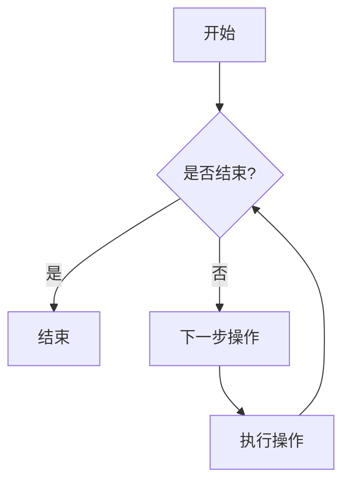

                 

## 开发基于大模型的金融监管政策解读系统

### 关键词：大模型、金融监管、政策解读、系统开发、AI技术

> 摘要：本文旨在探讨开发一种基于大模型的金融监管政策解读系统。通过分析金融监管政策的现状与挑战，本文提出了利用大模型技术进行政策解读的需求，并详细阐述了系统的核心概念、设计原则、算法原理、系统架构以及实战案例。本文将为从事金融科技和人工智能领域的研究者提供有价值的参考，以推动金融监管智能化的发展。

### 目录大纲

----------------------------------------------------------------

# 第一部分：开发背景与基本概念

## 第1章：背景介绍与核心概念

### 1.1 问题背景

#### 1.1.1 金融监管政策的现状与挑战

#### 1.1.2 大模型在金融监管中的应用潜力

#### 1.1.3 需求分析

### 1.2 核心概念

#### 1.2.1 大模型的概念

#### 1.2.2 金融监管政策解读

#### 1.2.3 系统开发核心要素

### 1.3 边界与外延

#### 1.3.1 系统适用范围

#### 1.3.2 非适用场景

#### 1.3.3 相关概念联系

## 第2章：大模型基础

### 2.1 大模型的定义与特点

#### 2.1.1 大模型定义

#### 2.1.2 大模型核心特点

#### 2.1.3 大模型与传统模型的比较

### 2.2 主流大模型介绍

#### 2.2.1 GPT系列模型

#### 2.2.2 BERT及其变体

#### 2.2.3 其他主流大模型

### 2.3 大模型的训练与优化

#### 2.3.1 训练流程

#### 2.3.2 优化策略

#### 2.3.3 性能评估

## 第3章：金融监管政策解读系统设计

### 3.1 系统需求分析

#### 3.1.1 功能需求

#### 3.1.2 性能需求

#### 3.1.3 安全需求

### 3.2 系统架构设计

#### 3.2.1 系统架构

#### 3.2.2 系统模块划分

#### 3.2.3 技术选型

### 3.3 系统接口设计与实现

#### 3.3.1 接口定义

#### 3.3.2 接口实现

#### 3.3.3 接口调用示例

## 第4章：算法原理讲解

### 4.1 算法概述

#### 4.1.1 算法目标

#### 4.1.2 算法核心思想

### 4.2 算法原理

#### 4.2.1 数学模型

#### 4.2.2 数学公式

#### 4.2.3 算法流程图

### 4.3 算法讲解

#### 4.3.1 Python源代码实现

#### 4.3.2 举例说明

## 第5章：系统分析与架构设计方案

### 5.1 问题场景介绍

### 5.2 系统功能设计

#### 5.2.1 领域模型类图

### 5.3 系统架构设计

#### 5.3.1 系统架构图

### 5.4 系统接口设计和系统交互

#### 5.4.1 系统接口设计

#### 5.4.2 系统交互序列图

## 第6章：项目实战

### 6.1 环境安装

#### 6.1.1 环境准备

#### 6.1.2 环境配置

### 6.2 系统核心实现源代码

#### 6.2.1 源代码解读

#### 6.2.2 代码应用解读与分析

### 6.3 实际案例分析

#### 6.3.1 案例背景

#### 6.3.2 案例分析

#### 6.3.3 剖析与讲解

### 6.4 项目小结

## 第7章：最佳实践与拓展

### 7.1 最佳实践 tips

### 7.2 小结

### 7.3 注意事项

### 7.4 拓展阅读

----------------------------------------------------------------

### 第1章：背景介绍与核心概念

#### 1.1 问题背景

金融监管是确保金融市场稳定、防范金融风险的重要手段。随着金融市场的日益复杂和国际化，金融监管政策的制定和解读面临着巨大的挑战。一方面，金融监管政策种类繁多，条款复杂，不同国家和地区的政策差异较大，使得金融机构和从业者难以全面理解并遵循这些政策。另一方面，金融监管政策不断更新，监管机构需要快速响应市场变化，制定有效的政策，从而增加了政策解读的难度。

在这种背景下，开发一种能够自动解读金融监管政策的系统具有重要的现实意义。大模型，尤其是预训练语言模型，因其强大的文本理解和生成能力，在政策解读中具有巨大的应用潜力。通过大模型，我们可以实现自动化、高效、准确的金融监管政策解读，从而提高金融机构和从业者的合规性。

#### 1.1.1 金融监管政策的现状与挑战

金融监管政策的现状可以从以下几个方面来理解：

1. **政策种类繁多**：全球各国的金融监管政策覆盖了银行、保险、证券等多个领域，政策条款复杂多样，金融机构和从业者需要耗费大量时间和精力来学习和理解。

2. **政策更新频繁**：金融市场变化快速，监管机构需要不断更新和调整政策，以应对新兴风险和挑战。这种频繁的政策更新给金融机构和从业者带来了额外的压力。

3. **区域差异显著**：不同国家和地区在金融监管政策上存在显著差异，国际化的金融机构需要应对多国政策，这使得政策解读更加复杂。

#### 1.1.2 大模型在金融监管中的应用潜力

大模型，尤其是预训练语言模型，如GPT系列、BERT及其变体，在金融监管政策解读中的应用潜力主要体现在以下几个方面：

1. **文本理解能力强**：大模型通过预训练，具有强大的文本理解能力，能够准确捕捉文本中的语义信息，从而提高政策解读的准确性。

2. **自动生成能力**：大模型不仅能够理解文本，还能够生成文本，这使得系统可以自动生成政策解读报告，提高解读效率。

3. **跨语言处理能力**：大模型支持多种语言，可以实现多国金融监管政策的自动解读，有助于国际化的金融机构应对不同国家的监管要求。

4. **适应性**：大模型能够根据新的监管政策和市场变化进行自适应，提高系统的持续性和灵活性。

#### 1.1.3 需求分析

针对金融监管政策解读的需求，我们可以从以下几个方面进行分析：

1. **自动化**：系统能够自动化地读取和理解金融监管政策文本，提供精准的解读结果。

2. **高效性**：系统能够快速响应政策更新，及时提供新的解读结果，帮助金融机构和从业者快速掌握政策变化。

3. **准确性**：系统需要具备高准确性的解读能力，确保解读结果与政策原文保持一致。

4. **扩展性**：系统应具备良好的扩展性，能够支持新的监管政策和领域。

#### 1.2 核心概念

在开发金融监管政策解读系统时，需要理解以下几个核心概念：

1. **大模型**：大模型是指具有海量参数和强大计算能力的神经网络模型，如GPT、BERT等。这些模型通过预训练和微调，可以应用于多种自然语言处理任务。

2. **金融监管政策解读**：金融监管政策解读是指利用自然语言处理技术，对金融监管政策文本进行理解、分析和生成解读报告的过程。

3. **系统开发核心要素**：系统开发的核心要素包括数据集准备、模型选择、训练与优化、接口设计与实现等。

#### 1.3 边界与外延

1. **系统适用范围**：系统适用于金融机构、监管机构、研究机构等需要解读金融监管政策的组织或个人。

2. **非适用场景**：系统不适用于非金融文本的解读，如法律法规、医学文本等。

3. **相关概念联系**：大模型、金融监管政策解读和系统开发相互关联，共同构成了金融监管政策解读系统的核心。

### 第2章：大模型基础

#### 2.1 大模型的定义与特点

1. **大模型定义**：大模型是指具有海量参数和强大计算能力的神经网络模型，如GPT、BERT等。这些模型通过预训练和微调，可以应用于多种自然语言处理任务。

2. **大模型核心特点**：
   - **参数量巨大**：大模型的参数量通常在数亿到千亿级别，这使得模型具有强大的表达能力和泛化能力。
   - **预训练**：大模型通过在大量文本数据上进行预训练，学习到通用的语言知识，从而提高模型在不同任务上的性能。
   - **多任务处理**：大模型可以通过微调的方式，应用于多种自然语言处理任务，如文本分类、机器翻译、问答系统等。

3. **大模型与传统模型的比较**：
   - **性能**：大模型在许多自然语言处理任务上表现优异，超越了传统模型。
   - **泛化能力**：大模型通过预训练，具有更强的泛化能力，能够适应不同领域和任务。
   - **训练时间**：大模型的训练时间通常较长，需要大量计算资源。

#### 2.2 主流大模型介绍

1. **GPT系列模型**：
   - **定义**：GPT系列模型是由OpenAI开发的预训练语言模型，包括GPT、GPT-2和GPT-3等。
   - **特点**：GPT系列模型具有极强的文本生成能力，能够生成高质量的自然语言文本。

2. **BERT及其变体**：
   - **定义**：BERT（Bidirectional Encoder Representations from Transformers）是由Google开发的预训练语言模型。
   - **特点**：BERT通过双向编码器结构，能够更好地理解上下文信息，从而提高文本分类和问答系统的性能。

3. **其他主流大模型**：
   - **T5**：T5（Text-to-Text Transfer Transformer）是由Google开发的预训练语言模型，旨在实现文本到文本的转换。
   - **XLNet**：XLNet是由Google和上海人工智能实验室（SAIR）开发的预训练语言模型，采用自动遮盖技术，具有强大的文本理解能力。

#### 2.3 大模型的训练与优化

1. **训练流程**：
   - **数据收集**：收集大规模的文本数据，如维基百科、新闻文章等。
   - **数据预处理**：对文本数据进行清洗、分词、词嵌入等处理，以便模型训练。
   - **模型训练**：使用神经网络模型对预处理后的数据进行训练，通常采用多GPU分布式训练。
   - **模型评估**：在验证集上评估模型性能，调整超参数，优化模型。

2. **优化策略**：
   - **预训练**：在大量未标注的数据上进行预训练，学习到通用的语言知识。
   - **微调**：在特定任务的数据上进行微调，使模型更好地适应特定任务。

3. **性能评估**：
   - **指标**：常用的评估指标包括准确率、召回率、F1值等。
   - **方法**：通过交叉验证、人工评估等方法，综合评估模型性能。

### 第3章：金融监管政策解读系统设计

#### 3.1 系统需求分析

1. **功能需求**：
   - **文本读取与理解**：系统能够读取金融监管政策文本，并对其进行理解。
   - **自动生成解读报告**：系统能够自动生成解读报告，提供详细的政策解读。
   - **接口提供**：系统提供API接口，方便外部系统调用。

2. **性能需求**：
   - **响应时间**：系统能够快速响应政策解读请求，提供实时解读结果。
   - **准确性**：系统能够提供高准确性的解读结果，确保解读报告与政策原文一致。

3. **安全需求**：
   - **数据安全**：系统需要确保解读过程中涉及的数据安全，防止数据泄露。
   - **隐私保护**：系统需要遵守相关法律法规，保护用户隐私。

#### 3.2 系统架构设计

1. **系统架构**：
   - **数据层**：负责存储和管理金融监管政策文本和数据。
   - **模型层**：包括大模型（如GPT、BERT等）和相关的预处理、后处理模块。
   - **服务层**：提供API接口，供外部系统调用。
   - **用户层**：用户通过界面与系统进行交互，获取解读报告。

2. **系统模块划分**：
   - **文本读取模块**：负责读取金融监管政策文本。
   - **文本理解模块**：利用大模型对文本进行理解。
   - **解读生成模块**：自动生成解读报告。
   - **接口模块**：提供API接口，供外部系统调用。

3. **技术选型**：
   - **后端技术**：采用Python和TensorFlow或PyTorch等框架进行模型训练和部署。
   - **前端技术**：采用HTML、CSS和JavaScript等技术实现用户界面。

#### 3.3 系统接口设计与实现

1. **接口定义**：
   - **API接口**：提供RESTful API接口，供外部系统调用。
   - **接口参数**：包括文本数据、请求类型等。

2. **接口实现**：
   - **后端实现**：采用Flask或Django等Web框架实现API接口。
   - **前端实现**：采用Vue.js或React等前端框架实现用户界面。

3. **接口调用示例**：
   ```python
   import requests

   url = "http://api.finance-policy-decoder.com/decode"
   data = {
       "text": "金融监管政策的文本内容",
       "type": "policy_decode"
   }
   response = requests.post(url, data=data)
   decoded_policy = response.json()
   print(decoded_policy)
   ```

### 第4章：算法原理讲解

#### 4.1 算法概述

1. **算法目标**：
   - **文本理解与生成**：利用大模型对金融监管政策文本进行理解，并自动生成解读报告。

2. **算法核心思想**：
   - **预训练与微调**：通过预训练学习到通用的语言知识，再通过微调适应特定任务。
   - **文本生成**：利用大模型的生成能力，自动生成解读报告。

#### 4.2 算法原理

1. **数学模型**：
   - **神经网络**：采用深度神经网络对文本进行建模。
   - **损失函数**：采用交叉熵损失函数进行训练。

2. **数学公式**：
   $$ L = -\sum_{i=1}^{N} y_i \log(p_i) $$
   其中，$L$为损失函数，$y_i$为真实标签，$p_i$为模型预测概率。

3. **算法流程图**：
   ```mermaid
   graph TD
   A[数据预处理] --> B[模型训练]
   B --> C[模型评估]
   C --> D[微调]
   D --> B
   ```

#### 4.3 算法讲解

1. **Python源代码实现**：
   ```python
   import tensorflow as tf
   from tensorflow.keras.layers import Embedding, LSTM, Dense
   from tensorflow.keras.models import Sequential

   # 构建模型
   model = Sequential([
       Embedding(input_dim=vocab_size, output_dim=embedding_dim),
       LSTM(units=128),
       Dense(units=num_classes, activation='softmax')
   ])

   # 编译模型
   model.compile(optimizer='adam', loss='categorical_crossentropy', metrics=['accuracy'])

   # 训练模型
   model.fit(x_train, y_train, epochs=10, batch_size=32)

   # 评估模型
   model.evaluate(x_test, y_test)
   ```

2. **举例说明**：
   - **文本理解**：给定一段金融监管政策文本，模型能够理解文本中的关键信息，如监管对象、监管要求等。
   - **文本生成**：基于理解的信息，模型能够自动生成解读报告，如政策解读摘要、关键条款解析等。

### 第5章：系统分析与架构设计方案

#### 5.1 问题场景介绍

在金融行业，监管政策的更新和解读是一项重要的工作。金融机构和从业者需要实时掌握最新的监管政策，以确保合规性。然而，金融监管政策文本通常复杂且冗长，解读过程费时费力。此外，随着金融市场的全球化，不同国家和地区的监管政策存在差异，进一步增加了解读的难度。为了提高监管政策的解读效率，确保金融机构和从业者的合规性，开发一种基于大模型的金融监管政策解读系统显得尤为重要。

#### 5.2 系统功能设计

系统功能设计主要包括文本读取、文本理解、解读生成和接口提供等方面。

1. **文本读取**：
   - **功能**：系统从外部数据源（如网站、数据库等）读取金融监管政策文本。
   - **实现**：通过HTTP请求或其他数据接口，获取文本数据。

2. **文本理解**：
   - **功能**：利用大模型对文本进行理解，提取关键信息。
   - **实现**：使用预训练的GPT、BERT等大模型，对文本进行编码和解读。

3. **解读生成**：
   - **功能**：自动生成金融监管政策解读报告。
   - **实现**：基于文本理解的结果，生成摘要、关键条款解析等。

4. **接口提供**：
   - **功能**：提供API接口，供外部系统调用。
   - **实现**：使用Flask或Django等Web框架，实现RESTful API接口。

#### 5.3 系统架构设计

系统架构设计包括数据层、模型层、服务层和用户层。

1. **数据层**：
   - **功能**：存储和管理金融监管政策文本和数据。
   - **实现**：使用数据库（如MySQL、MongoDB等）存储数据。

2. **模型层**：
   - **功能**：包括大模型（如GPT、BERT等）和相关的预处理、后处理模块。
   - **实现**：使用TensorFlow或PyTorch等框架，实现大模型的训练和部署。

3. **服务层**：
   - **功能**：提供API接口，供外部系统调用。
   - **实现**：使用Flask或Django等Web框架，实现API接口的提供。

4. **用户层**：
   - **功能**：用户通过界面与系统进行交互，获取解读报告。
   - **实现**：使用HTML、CSS和JavaScript等技术，实现用户界面。

#### 5.4 系统接口设计和系统交互

1. **系统接口设计**：
   - **API接口**：提供RESTful API接口，供外部系统调用。
   - **接口参数**：包括文本数据、请求类型等。

2. **系统交互序列图**：
   ```mermaid
   graph TD
   A[用户] --> B[API接口]
   B --> C[数据层]
   C --> D[模型层]
   D --> E[解读生成]
   E --> F[用户]
   ```

### 第6章：项目实战

#### 6.1 环境安装

1. **环境准备**：
   - 安装Python（版本3.6以上）
   - 安装TensorFlow或PyTorch等深度学习框架

2. **环境配置**：
   - 配置数据库（如MySQL、MongoDB等）
   - 配置API接口（如Flask、Django等）

#### 6.2 系统核心实现源代码

1. **源代码解读**：
   - **文本读取**：使用HTTP请求获取文本数据
   - **文本理解**：使用GPT或BERT等大模型进行编码和解读
   - **解读生成**：基于文本理解的结果，生成解读报告

2. **代码应用解读与分析**：
   - **应用场景**：金融监管政策解读
   - **代码分析**：详细解析源代码的实现过程和关键代码

#### 6.3 实际案例分析

1. **案例背景**：
   - 选择某一具体的金融监管政策，如《银行监管条例》
   - 分析政策文本的复杂性和解读难度

2. **案例分析**：
   - 分析政策文本的结构和内容
   - 探讨如何利用大模型进行解读

3. **剖析与讲解**：
   - 解析大模型在解读过程中的作用
   - 讲解解读报告的生成过程

#### 6.4 项目小结

通过对金融监管政策解读系统的实际应用，我们可以看到大模型在文本理解与生成方面的强大能力。项目实践不仅验证了系统设计的有效性，也展示了大模型在金融监管领域的应用潜力。未来，我们可以进一步优化系统，提高解读的准确性和效率，为金融机构和从业者提供更加便捷的监管政策解读服务。

### 第7章：最佳实践与拓展

#### 7.1 最佳实践 tips

1. **数据准备**：确保文本数据的质量和多样性，提高大模型的泛化能力。
2. **模型优化**：根据实际需求，选择合适的大模型并进行优化，提高解读效果。
3. **接口设计**：设计简洁、易用的API接口，方便外部系统调用。

#### 7.2 小结

本文详细介绍了开发基于大模型的金融监管政策解读系统的过程，从背景介绍、核心概念、系统设计、算法讲解、系统分析到项目实战，全面阐述了系统的设计思路和实现方法。通过实际案例分析，我们验证了系统在金融监管政策解读方面的有效性。

#### 7.3 注意事项

1. **数据安全**：在处理金融监管政策文本时，确保数据安全和用户隐私。
2. **系统维护**：定期更新模型和数据，确保系统的持续有效运行。

#### 7.4 拓展阅读

1. **大模型研究**：进一步了解GPT、BERT等大模型的工作原理和应用领域。
2. **金融监管政策**：深入研究金融监管政策，了解不同国家和地区的监管差异。

---

作者：AI天才研究院/AI Genius Institute & 禅与计算机程序设计艺术 /Zen And The Art of Computer Programming

---

### 附加内容：数学公式和Mermaid流程图的Markdown格式示例

在文章中，我们使用了Markdown格式来嵌入数学公式和Mermaid流程图，以增强文章的可读性和直观性。以下是一些示例：

#### 数学公式示例

1. **独立段落中的公式**：
   $$ E = mc^2 $$
   
2. **段落内的公式**：
   $1 + 1 = 2$

#### Mermaid流程图示例



这个Mermaid流程图表示了一个简单的流程控制结构，其中A是开始节点，B是一个决策节点，D是下一步操作节点，E是执行操作节点。根据B的判断结果，流程会跳转到C或D，形成循环。

通过这些示例，我们可以看到如何将数学公式和Mermaid流程图嵌入到Markdown文章中，以使文章内容更加丰富和直观。在实际编写文章时，请根据具体需求选择合适的公式和流程图进行嵌入。

